# 📰 AI时代的数据研发-Semantic（语义层）实践总结


本文总结了AI时代数据研发从传统SQL开发向Semantic（语义层）+ DataAgent范式转型的实践与思考，指出传统模式存在效率低、语义鸿沟及口径不一致等瓶颈，而通过构建包含指标、维度、逻辑表及CTE适配层的语义层，结合Meta-ontology本体论和Wiki-RAG检索增强，实现了业务语义的结构化定义与AI自动翻译NL2SQL；该方案采用Agentic架构双轨制，将数据知识从代码迁移至语义模型，使研发角色转变为语义架构师与AI教练，并通过工程化校验与自动化治理保障资产质量，最终达成需求响应实时化、取数自动化及数据价值高效释放的目标。


## 从SQL到语义（Semantic）

AI时代数据研发范式的变革与尝试，由人到AI Semantic（人+agent）。

由 业务需求 → 理解语义 → 设计模型 → 编写SQL → 测试验证 → 交付报表

到 业务需求 ──→ [语义层+AI] ──→ SQL ──→ 结果

旧时代人是重中之重，沟通、开发和知识存储的唯一载体，是把业务需求翻译成准确的SQL！所有的经验和规范以及相关知识都在人脑（文档）和SQL代码中，重要的是人那么随之而来的瓶颈当然也是人，因为人是丰富的多样性的，有牛皮的、有菜的、有经验老道的有初生牛犊不怕虎的\~

但是现如今效率优先，所有的优点都不如多快好省！

因此我们正在做的就是由过去面向SQL的开发变为面向AI Semantic的开发\~

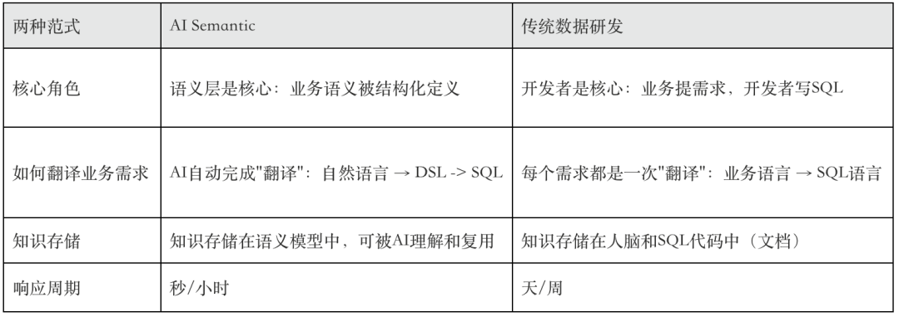

### ▐ 为什么要做语义层 ###

###   
 ###

----------

* #### 三个趋势 ####

----------

* AI从"对话助手"进化为"自主智能体"（Agentic AI）。AI不再只是回答问题，而是能够：

* 感知业务环境

* 理解数据语义

* 自主生成SQL查询

* 协作完成复杂分析任务

当AI学会"理解语义"，数据开发者的角色就从"写SQL"转向"定义语义"

* 效率与成本的压力

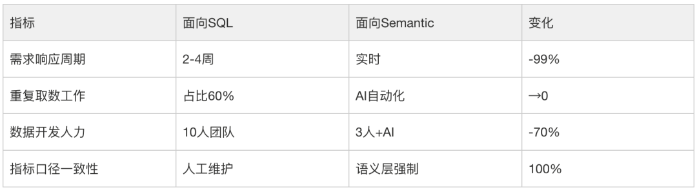

* 数据价值释放的瓶颈

  过去，数据价值被"最后一公里"卡住：

* 业务有问题，但不会写SQL → 语义层让AI代劳

* 数据有答案，但没人来问 → Agent主动推送洞察

* 既懂数据又懂业务分析的人急缺 → 业务自己养专业Agent

* #### 三个瓶颈 ####

----------

----------

效率低周期长

之前的话，一个需求的生命周期：

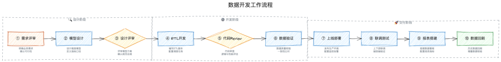

需求评审 -\> 模型设计 -\> 设计评审 -\> ETL开发 -\> 代码Review -\> 数据验证 -\> 上线部署 -\> 联调测试 -\> 报表搭建 -\> 数据回刷 

怎么滴也得一天吧？还得是熟练工 all in 这一个需求。

业务-技术的语义鸿沟

业务说："我要看活跃用户的复购率。" 技术问："活跃用户怎么定义？7日活跃还是30日活跃？复购是否包含退款后再购买？"这种对话每天都在上演。业务语言和技术实现之间的翻译，消耗了数据团队30%以上的精力。

指标口径的丛林

同一个"GMV"，在不同报表里可能有5种计算方式。营销部门的GMV包含优惠券，财务部门的不包含；运营看的是下单口径，仓储看的是发货口径。指标定义的不一致，是数据可信度的最大杀手。

基于传统数据研发的痛点和瓶颈以及ai发展所带来的变化，我们发现了数据研发在ai时代的破局之道-语义层！

### ▐ 语义层是啥 ###

----------

前面铺垫了这么久，终于到了关键性的东西了。简单类比下，语义层（Semantic Layer）就是钓鱼佬的偏光镜！

* 它是连接原始数据和业务语义的中间层，它将复杂的表结构、字段关系、计算逻辑，抽象为业务人员能理解的"指标"和"维度"

* 语义层帮助AI 调用业务真相接口而非猜测底层结构

LLM虽然厉害，很擅长自然语言处理，但是他不懂你的业务、也不懂你的数据，语义层就是他的专门为了看懂你的业务和数据而配置的偏光镜，让你池子里鱼一览无余\~

通用的ai大模型看起来啥都会，但不理解你的业务上下文——不知道数据在哪张表、GMV的计算公式是什么、该过滤哪些异常数据。语义层补上了这个上下文。

####   
 ####

* #### 核心要素 ####

  ####   
   ####

----------

----------

----------

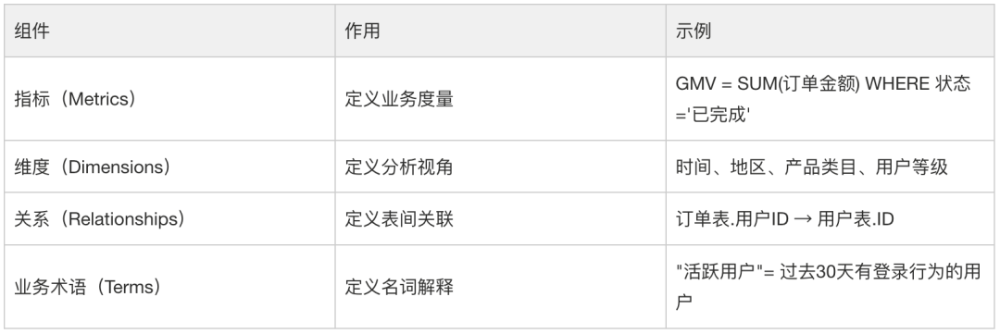

可以这么理解，语义层是将传统的数仓分层转变成了维度、指标和业务术语带关系的知识图谱。

### ▐ 语义层带来的变化 ###

----------

如果说语义层是给AI戴上的"眼镜"，那么Agentic AI就是让AI长出了"手脚"。

Agentic AI的核心定义：AI不再只是一个被动响应的模型，而是一个能感知环境、主动行动、有明确目标、具备协作能力的智能体（Agent）。

传统AI：你问它问题，它给你答案。（被动） Agentic AI：它主动发现问题，自己找数据，自己分析，自己给你建议，甚至自己执行决策。（主动）

Agentic AI + 语义层正在从根本上改变数据仓库的消费模式，进而迫使数仓架构的重构。

* #### 数仓架构变化 ####

----------

传统数仓架构的设计是：人类是数据的最终消费者。

因此我们需要：

* 多层数据加工（ODS→DWD→DWS→ADS）

* 复杂的ETL管道

* 精心设计的报表和数据产品

* 数据分析师/BI作为"翻译官"

但当AI Agent成为数据的主要消费者时，这套假设就被彻底打破了。

传统分层架构：

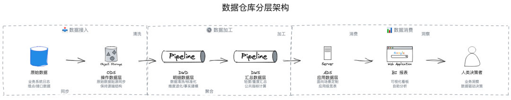

每一层都是为了让数据更"易于人类理解"。但AI Agent不需要这些！

Agentic架构的双轨制：

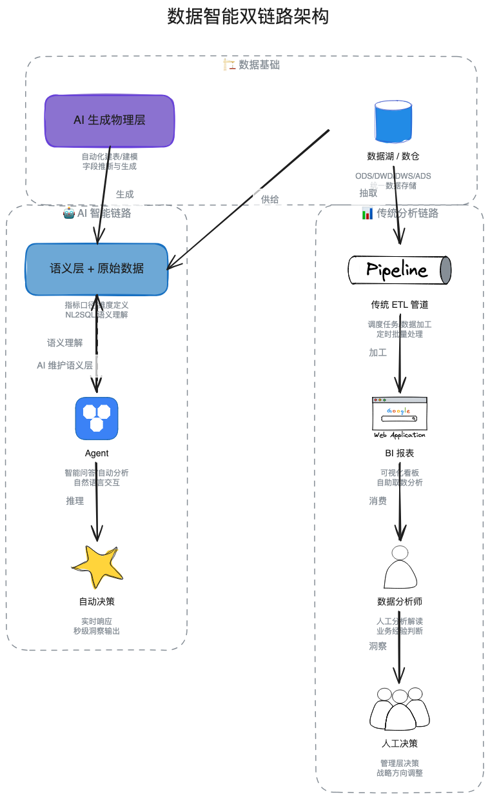

我们构建了 Agentic Data Stack 的混合架构：AI Agent 通过语义层直接消费数据，人类分析师通过传统BI/报表消费数据，两条轨道并存、按需选择。Agent 不只是数据消费者，也是语义资产的维护者。

关键变化：

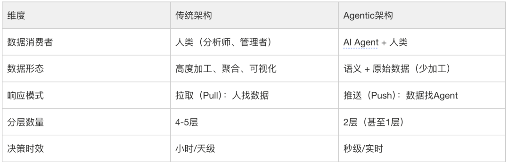

* #### 语义成为新的"分层" ####

----------

在Agentic AI架构下，语义层取代了物理分层，成为数据组织的核心。

传统分层解决的问题：

* ODS：数据清洗和标准化

* DWD：业务过程建模

* DWS：预计算聚合，提升查询性能

* ADS：面向应用的数据集市

语义层如何解决这些问题：

* 数据质量 → 语义层定义数据校验规则

* 业务建模 → 语义层定义实体、关系、度量

* 查询性能 → 向量化、列存、物化视图（数仓引擎负责）

* 应用适配 → 每个Agent根据语义自动组装所需数据

核心洞察：

短期来看，语义层成为数据组织的新抽象层，传统 ODS→DWD→DWS→ADS的物理分层并没有消失，但对消费者透明了——业务看到的是一个统一的语义层，物理分层变成了性能优化的实现细节。

长期来看，当算力足够强大（随便跑大Sql）和当AI足够聪明（能理解原始数据的语义）时，中间的加工层就变得多余了。

* #### 知识存储的变化 ####

----------

数据知识从"散落在 SQL 代码中、文档中、跟人绑定口口相传中"迁移到"集中在语义模型里、可被 Agent理解和复用"。口径的载体变了，管理成本和维护方式也随之改变。

知识的保鲜、保质等难题也通过更高效、更便捷、更有解释性的方式来解决掉了。

* #### 数据研发范式的变化 ####

----------

从SQL Developer到Semantic Architect，数据研发的角色正在从"SQL Developer"进化为"Semantic Architect"。核心价值不再是写出正确的SQL，而是定义准确的业务语义、设计可被 AI 消费的语义模型、并持续治理口径一致性。

数据团队的定位从"数据加工厂"转变为"AI Agent的教练"。


语义层落地细节

----------

----------

### ▐ 生产关系 ###

----------

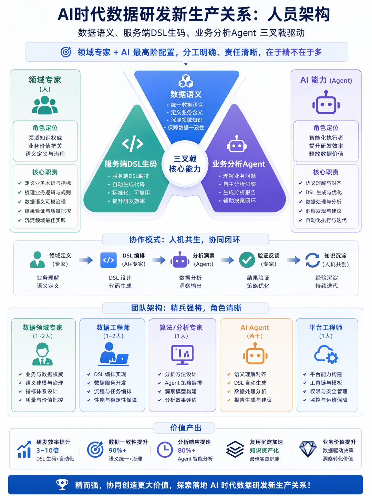

* 语义层（数据语义、业务语义、知识库）、服务端（DSL、生码、基础服务）、DataAgent（业务洞察、目标分析等）三叉戟

* 领域专家+AI最高阶配置，分工明确、责任清晰、1+1+1\>\>\>3

* 在于精不在多，全栈开发（前端、后端、数据、AI应用），探索落地AI时代数据研发新生产关系

### ▐ 技术架构  ###

----------

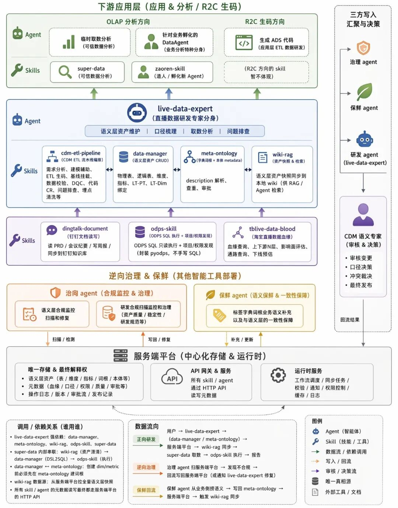

新型研发团队：Agent + 专家 + Skill生态\~

正向

* 数仓物理表资产到语义资产（逻辑表、指标、维度）

* Wiki本地快速检索

* NL2SQL、R2C（ADS）

逆向

* 治理Agent + Skill 定期扫描语义层、标签词根

* 专家评审

* Agent修复

横向

* 保鲜：标签词根和维度、指标的联动

* 端到端血缘

* 使用覆盖情况（错误查询、DWS自动沉淀、低质/优质资产发掘）

### ▐ 核心概念-CTE ###

----------

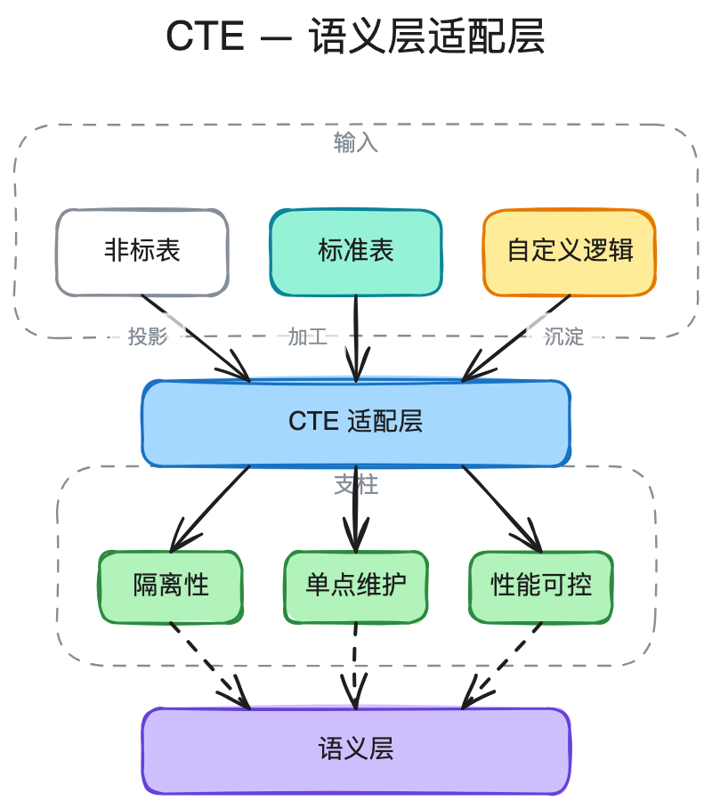

大量的交流沟通以及需求分析调研我们发现：有一个标准化的数仓当然好，而且非常重要，会极大的降低构建语义层的难度。物理数仓是整个系统的根基也是天花板。

但是你做的产品服务用户的，而不是教育用户的，无数案例证明一个优秀的标准化的数仓就跟三条腿的蛤蟆一样可遇不可求。我们不能既要又要还要更要没完没了的要，这不符合现实逻辑，你用我们的产品还必须先这样那样的，这天然就反人类，我都这样那样了还要你干什么？

为了尽可能降低构建语义层的成本，减少非标数仓的影响，语义层做了适当的妥协对三类不可直接消费的数据形态的适配层——把"用不了/ 不好用 / 太慢"的数据源，包装成"语义层能用"的标准输入。

* #### 四大诉求 ####

----------

兼容非标数仓表

Cdm标准表（dwd/dws/ads）有规范的分层、命名、分区、粒度。但现实里大量数据源不在规范里

* 业务方的临时表、项目表（命名/分区随意）

* 外部数据源（非 CDM 治理范围，但业务需要关联）

这些表不能直接 type=0 import（会污染语义层的标准性），也不能让业务方裸写 SQL引用（会失去治理）。CTE 的角色：写一段 SELECT 把这些非标数据源投影成"符合语义层契约"的形状，再注册。非标被隔离在 statement 里，下游只看规范字段。

业务自定义逻辑

有些语义概念无法从任何单张标准表直接拿到：

* "最近 7 天活跃主播"：需要在明细表上窗口聚合 + 时间过滤

* "去重后最近一次的状态"：需要 ROW\_NUMBER + QUALIFY

* "跨两张表的业务状态合并"：需要 UNION / COALESCE

* "黑名单 / 无效场次已剔除"：需要在 SQL 里写业务过滤条件

这些是业务方的领域知识，不是数仓工程师的建模产物。

CTE的角色：让业务方（或数据研发）把这段自定义逻辑沉淀成可命名、可审批、可追溯的资产。

大表性能优化

直播域的核心事实表经常是百亿行级（dwd\_tb\_ctlive\_xxx\_di 这种日增量明细）。如果DSL2SQL 每次都基于明细表跑：

* 取数 SQL 跑几十分钟甚至超时

* 全表扫描浪费计算资源

* 同样的聚合在不同 metric 上重复执行

需要一个中间加速层。CTE 的角色：把常用的聚合粒度（如 account\_id + ds）和常用指标（如SUM(pay\_amt)）提前 GROUP BY 到一张 CTE 上，下游 metric / dim直接基于这张小表引用。CTE 在语义层充当了"轻量 dws"的角色——不是真正的物化表，但SQL 层面已经把计算量压下来。

标准表的二次加工

一些标准化数仓也解不了或者是下游ads层使用时转化的逻辑，可以放在Cte层沉淀抽象掉：

* dwd转dim，一些dwd表在某些场景下需要被关联，比如订单明细

* 主键去重，有些维表是多粒度复用的，但是主键跟粒度不完全一致，这时候就需要借助Cte二次加工让关联的粒度成为主键

借助Cte可以沉淀复用逻辑、避免下游数据异常

* #### 三根支柱 ####

----------

隔离性 —— 把"脏"留在 statement 里

* statement 可以写任何合法 ODPS SQL：跨 project、非标分区、复杂 JOIN、子查询

* 但输出给语义层的字段（fieldList）必须是规范、稳定、可解释的

* 下游 binding 只看到 fieldList 里的字段，看不到 statement 的内部复杂度

单点维护 —— 一段 SQL 多处复用

* 同一个"最近 7 天活跃主播"逻辑，被 5 个 metric 引用 → 只维护 1 段 statement

* 业务口径变了（7 天改 30 天）→ 改 statement + 重审批 → 5 个 metric 自动跟新

* 反例：每个 metric 在自己的 binding expression 里写一遍窗口聚合 → 改一次要改 5 处

性能可控 —— 主动定义聚合粒度

* aggrList 手工声明（如 ['account\_id','ds']）→ 告诉语义层"这段 SQL的最小粒度是什么"

* DSL2SQL 基于这个粒度生成 SQL，不会做无谓的细粒度扫描

* 如果 aggrList 写错（比如漏了分区字段），生成的 SQL 会慢甚至错——所以 CTE 的aggrList 必须准确反映 statement 的真实粒度

CTE的底层信念是——数据源的异构性不应该污染语义层的统一性，它让语义层不必关心底层细节（物理表结构、自定义逻辑、性能优化等等）。

劲酒虽好，可不要贪杯哦。前面也说了，标准化的物理数仓才是基础和天花板，Cte只是权宜之举，要想走得远必须要有扎实的基建才行\~

### ▐ 核心概念-逻辑表 ###

----------

逻辑表是整个语义层的灵魂和精髓，是物理数仓和AI数据语义的桥梁\~把人理解和使用的维度建模物理表变成了AI能够理解和分析的实体-关系网络。

* #### 解耦：物理层与语义层之间的一道墙 ####

----------

逻辑表最核心的设计是在物理表和指标/维度之间插入一个抽象层，物理层解耦解决的是"下游不该关心数据存在哪"。指标和维度面向逻辑表，不面向物理表。物理表加减、DWS 加速、字段改名，都收敛在 LT-PT绑定层，下游不动。

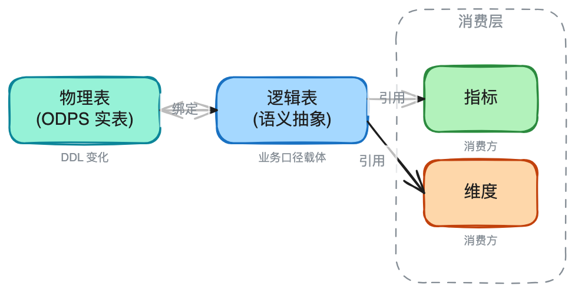

没有逻辑表，指标直接绑物理表字段——物理表一重构，所有指标的 expression 全断。有了逻辑表，物理表换名/拆表/迁移，只要 LT-PT 绑定更新，指标和维度的配置不用动。

* #### 抽象：更关注使用而不是实现 ####

----------

FACT （事实表-指标）vs DIM（维表-维度）：

由业务需求决定，不由表名前缀决定，真实案例：tbcdm.dim\_tb\_ctlive\_itm\_tag 这张 dim 物理表，既能当维表用（建逻辑维表绑维度），又能当事实表用（建逻辑事实表 basic\_plh挂指标）。同一张物理表，两个逻辑表，两套语义，互不干扰。

立体物理表架构

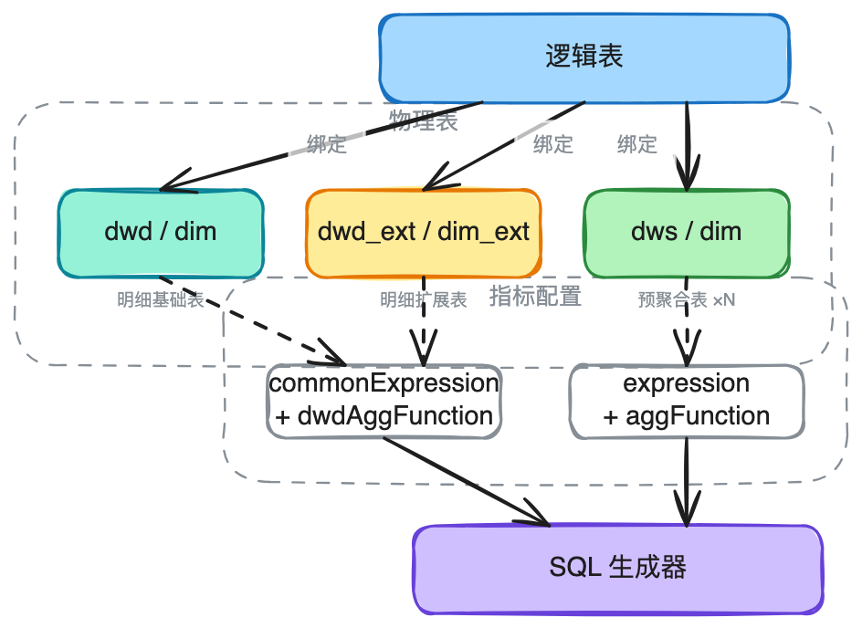

* 一个逻辑表可以同时挂多张物理表

* 一个dwd/dim基础表，明细层，多字段

* 一个dwd\_ext/dim\_ext表，明细层拓展，性能差一些但是信息覆盖更全

* 多个dws/dim，预聚合表，加速查询

* 指标的配置层必须与物理表类型严格对应——DWD 层填 commonExpression + dwdAggFunction，DWS 层填 expression + aggFunction，两套独立配置不能混用。SQL生成器按查询场景自动选择具体物理表。

模糊物理建模

逻辑表类型由业务需求决定，而非物理表名前缀：

dim\_ 前缀的表可以建逻辑事实表（要算指标），dwd\_ 前缀的表也可以建逻辑维表（要暴露维度）。判断依据是"下游怎么用"——需要 GROUP BY + SUM/COUNT 就是事实表，需要JOIN补维度信息就是维表。

业务过程隔离：

同一张物理表可以关联多个逻辑表，按业务过程隔离。

tbcdm.dws\_tb\_ctlive\_jiangjie\_vst\_gc\_itm\_pv\_lead\_trd\_1d

 ├→ jiangjie\_pay (LT, businessProcess=pay)

 ├→ jiangjie\_ipv (LT, businessProcess=ipv)

 └→ jiangjie\_read (LT, businessProcess=read)

指标绑逻辑表时，businessProcess 必须与逻辑表的 businessTag 一致。

* #### 语义图谱 ####

----------

关系绑定解决的是"解耦之后怎么连起来"。LT-PT 连物理表，LT-Dim 连维度，指标 bindLogicTableId连逻辑表。所有连接都是声明式的绑定关系，不是硬编码引用。本质：一张声明式的图

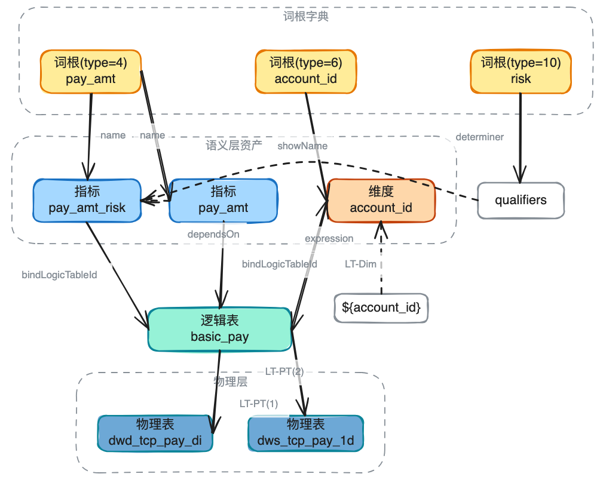

语义层的所有资产——物理表、逻辑表、维度、指标、词根——都是节点。绑定关系是边。SQL生成器做的事就是遍历这张图，自动拼出 JOIN 逻辑。用户不需要写 SQL JOIN，只需要声明这些边。SQL 生成器自动沿着图走：

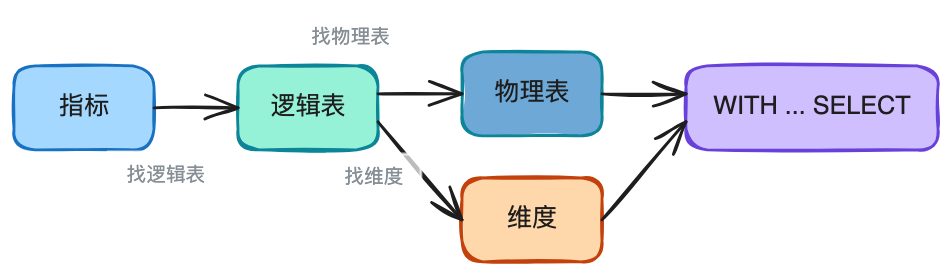

指标找逻辑表 →逻辑表找物理表 → 逻辑表找维度 → 拼出完整的 WITH ... SELECT。

* #### 四层绑定 ####

----------

第一层：词根 → 语义层（元数据绑定）词根是字典层的"身份证"，确保命名统一。

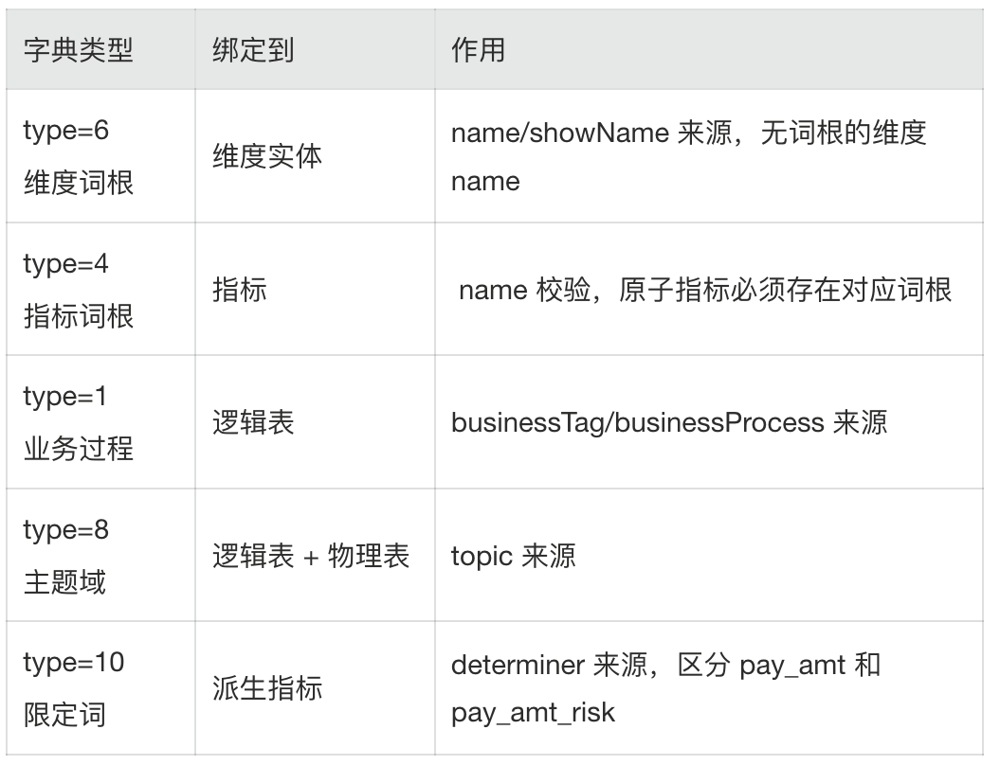

这层绑定解决的是"叫什么"的问题。之前创建 pay\_amt\_risk 时第一次被拒，就是因为 name 不在type=4 字典里——词根绑定断了，服务端不认。

第二层：物理表 → 逻辑表（LT-PT 绑定）

这层解决"数据从哪来"。

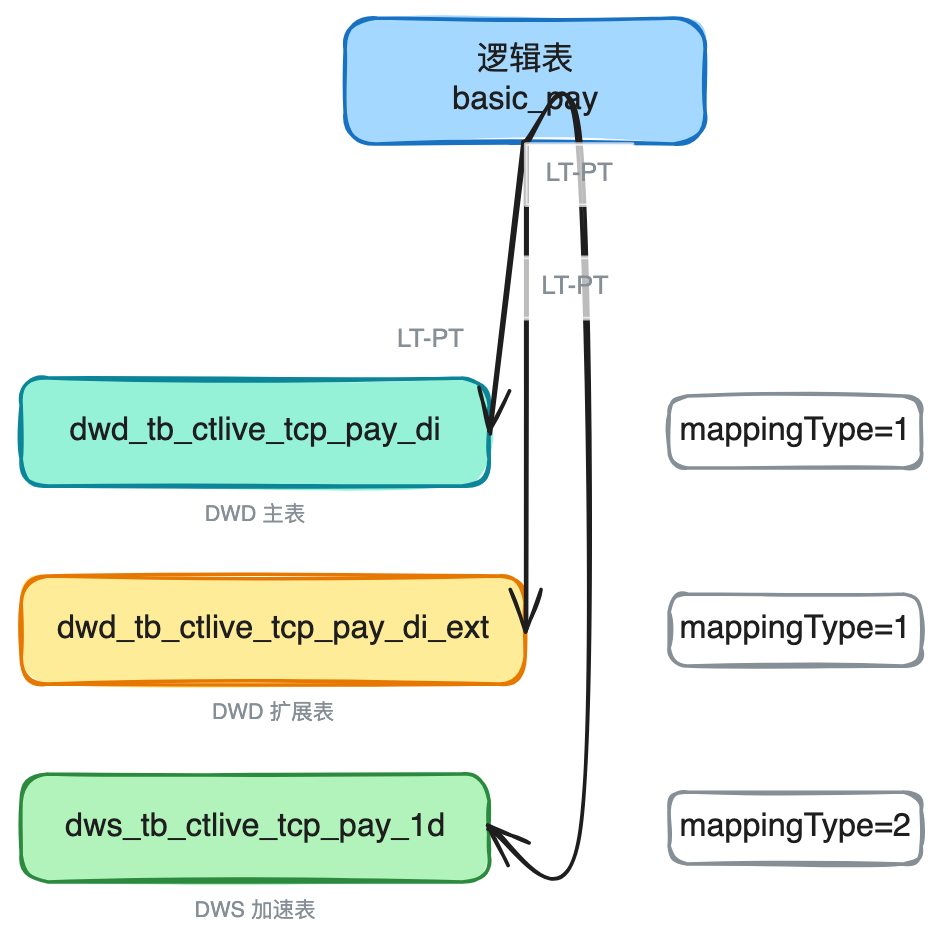

```

# basic_pay 同时绑两张物理表
LT-PT(binding 1): basic_pay ↔ tbcdm.dwd_tb_ctlive_tcp_pay_di
(mappingType=1, DWD主表)
LT-PT(binding 2): basic_pay ↔ tbcdm.dwd_tb_ctlive_tcp_pay_di_ext
(mappingType=1, DWD扩展表)
LT-PT(binding 3): basic_pay ↔ tbcdm.dws_tb_ctlive_tcp_pay_1d
(mappingType=2, DWS加速表)

```

多对多关系：一张物理表可以绑多个逻辑表（按业务过程隔离），一个逻辑表可以绑多张物理表（dwd/dws/dim）。

第三层：维度 → 逻辑表（LT-Dim 绑定）

这层解决"怎么关联"。

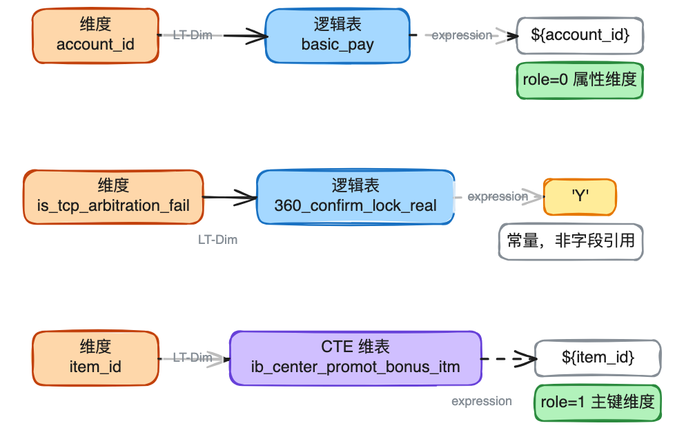

```

# account_id 绑到 basic_pay，映射到物理字段 account_id
LT-Dim: dimension=account_id(1990) → lt=basic_pay(110)
        expression="${account_id}"  ← 物理表实际字段名
        role=0  ← 属性维度
# is_tcp_arbitration_fail 绑到 tcp_commission_order 维表
LT-Dim: dimension=is_tcp_arbitration_fail(2643) → lt=360_confirm_lock_real(313)
        expression="'Y'"  ← 常量，不是字段引用
        role=0  ← 属性维度
# item_id 绑到 CTE 维表作为主键
LT-Dim: dimension=item_id(2085) → lt=cte.ib_center_promot_bonus_itm(357)
        expression="${item_id}"
        role=1  ← 主键维度，维表专属

```

* expression是核心：它声明了"在这个逻辑表对应的物理表里，这个维度取哪个字段"。同一个维度在不同逻辑是 ${visitor\_id}，在 B 表是 ${buyer\_id}（字段名不同但语义相同）。

* role=1 的设计：只有维表的主键用 role=1。SQL 生成器看到 role=1 就知道这是 JOIN 键，用LEFT JOIN dim\_table ON fact.key = dim.pk。role=0 的属性维度不需要JOIN，直接从事实表取值。

* 常量表达式：is\_tcp\_arbitration\_fail 的 expression 是 'Y' 而不是${is\_ad}——因为视图里所有记录都是仲裁失败订单，关联上即为 Y，不需要取字段值。这是is\_fans 模式的泛化。

第四层：指标 → 逻辑表 + 指标 → 指标（指标绑定）

这层解决"怎么算"。

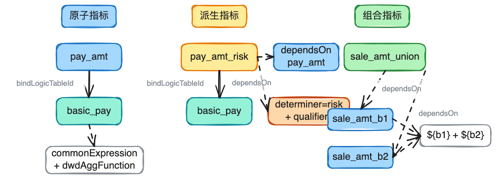

```

# 原子指标直接绑逻辑表
指标 pay_amt(6637) → bindLogicTableId=110 (basic_pay)
    commonExpression="CASE WHEN ${is_pay}='Y' THEN ${div_pay_amt} END"
    dwdAggFunction=SUM
# 派生指标绑逻辑表 + 依赖原子指标
指标 pay_amt_risk(7704) → bindLogicTableId=110 (basic_pay)
    basePointId=6637, basePointName="pay_amt"
    dependsOn=[{type:POINT, id:"6637"}]
    commonExpression="CASE WHEN GET_JSON_OBJECT(${risk_extend},...)=...
THEN ${div_pay_amt} END"
    determiner="risk", qualifiers=[{...type:QUALIFIER, id:"2561"...}]
# 组合指标依赖多个指标
指标 sale_amt_union(7623) → bindLogicTableId=284
    dependsOn=[{id:"7621", alias:"sale_amt_b1"}, {id:"7622", alias:"sale_amt_b2"}]
    expression="${sale_amt_b1} + ${sale_amt_b2}"

```

* dependsOn是派生/组合指标的命脉：它声明了计算依赖关系。派生指标依赖一个原子（basePointId + basePointName），组合指标依赖多个指标（每个有 alias 供 expression引用）。这条边断了，SQL 生成器找不到上游指标的表达式，整个链路就断了。

* determiner + qualifiers：派生指标通过 determiner 区分（pay\_amt vs pay\_amt\_risk），通过qualifiers 声明限定条件（risk 限定词）。nameAndDeterminer 是指标的唯一标识——同名不同determiner 的指标共享同一个 type=4 词根，但配置独立。

关系绑定的本质是把 SQL JOIN逻辑拆成可声明、可组合、可验证的边。每条边只描述一个事实。

* #### 几个优点 ####

----------

## 1.物理层变更不影响消费侧

物理表重构/改名/迁移，只更新 LT-PT 绑定，指标和维度的 expression 不用改。

## 2.口径统一收口

指标绑定逻辑表（bindLogicTableId），维度绑定逻辑表（LT-Dim），所有口径通过逻辑表收口。同一个指标在不同主题下可以复用 name，只要 nameAndDeterminer 不同——逻辑表按 topic + businessProcess 天然隔离。

## 3.多表多层灵活组合

一个逻辑表挂 DWD + DWS 两层物理表，SQL 生成器按场景选最优路径。同一张物理表可以绑多个逻辑表（不同业务过程），互不干扰。

## 4.维度复用与解耦

维度实体是全局的（不绑表），通过 LT-Dim 绑定到不同逻辑表，每张表上的 expression 可以不同（${account\_id} vs cast(${account\_id} as string)）。改物理字段名只需改 LT-Dim expression，不用动维度实体。

## 5.RAG 检索友好

wiki\_rag 按逻辑表组织目录：topic → bp → points/，\_relations.md 一跳拿到逻辑表→物理表→维度→指标的全部关系。逻辑表是知识库的关系枢纽，没有它检索就得全表扫描。

## 6.本体元数据增强

metadata-ontology 在字典 description 里编码 @entity/@kind/@pair等本体标签，维度词根可以按实体聚合、按形态过滤、配对补全。逻辑表绑定的维度通过词根本体获得语义增强检索能力，不只是文本匹配。

▐ 设计哲学-Wiki-rag

AI应用效果不好或者说不稳定是经常出现的，原因有很多，这里我们抛开模型本身、使用者，就只聊上下文其实很多时候是你给的输入太多又不够清晰和规范，导致AI的误判。

因此我们需要一个唯一真相，一个中心化标准化的唯一口径，拥有最终解释权，且专人维护、专人负责、专人背锅。即ssot，single source of truth。

wiki-rag不是数据源，是为 LLM上下文窗口优化过的只读投影。真相永远在服务端平台。它只做本地快速高效速查、只读，是之前lightRag的本地化轻量级替代方案。

* #### 四个要素 ####

----------

## 1.SSOT（投影 ≠ 真相）

* 服务端平台 = 唯一存储 + 最终解释权

## 2.中心化标准口径

* wiki 把服务端已确定的口径原样投影

* agent 做资产澄清只能引用 wiki，不能从物理表字段猜口径

* 同步完成 = 全生态口径基线统一，下游 DSL / SQL / 报告从同一基线出发

## 3.快速检索

* 文件级索引（\_index.md / \_enum\_index.md）+ 路径即语义（basic/pay/points/pay\_amt.md）

* grep 友好、离线可用、无 embedding 语义损失

* agent \< 100ms 拿到资产 ID，不依赖远程 API

## 4.上下文工程

* 分级加载：index.md → 主题 \_index.md → 单资产 .md，按需逐层读

* 密度优先：只留 ID/name/showName/formula/aggrType/description，丢掉审计字段

* 可验证：每个数字能反向追溯到 wiki → 服务端平台

* 可重建：wiki 脏了重同步（便宜），好过让 agent 带旧口径推理（贵）

* #### 协同流 ####

----------

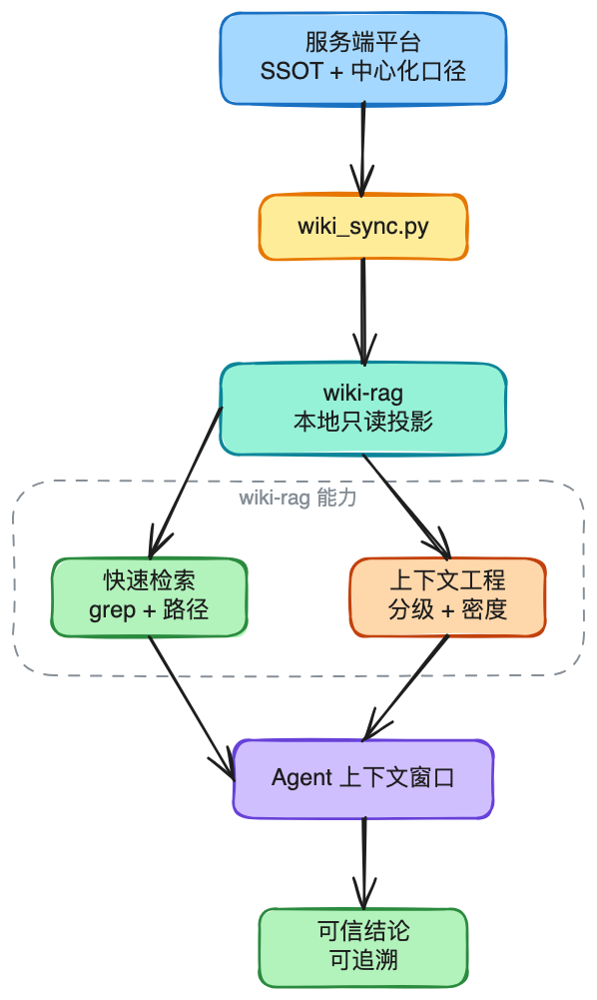

反模式速查：

改 wiki 文件 / 绕过 wiki 猜口径 / 全量塞 prompt / 多套 wiki 共存 ——都破坏 SSOT 链路。

### ▐ 设计哲学-Meta-ontology ###

----------

这是业务语义层的建设初探，meta-ontology 是语义层的词源层 + 本体层——不只管"叫什么"，还管"是什么、属于什么范畴、和其他东西有什么关系"。语义层知道"怎么查"，但不知道"是什么"。

哲学本体论研究三件事：① 世界上有什么（存在）② 怎么分类（范畴）③ 彼此什么关系（结构）。

meta-ontology 把这套搬到数据领域，

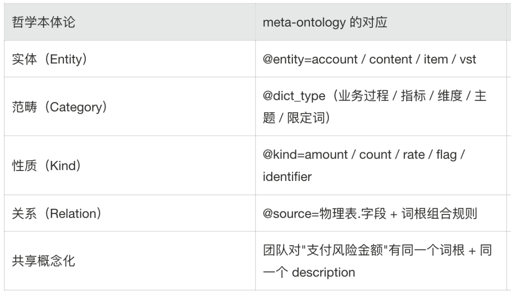

核心信念：数据资产不是 ID 的堆积，而是一套被共识过的概念体系。meta-ontology就是把这套概念体系显式化、可计算化、可治理化的工具。

* 语义层资产——物理表、逻辑表、维度、指标——本质上是一套结构化的技术配置。它知道：

* account\_id 维度绑在 basic\_pay 逻辑表上，expression 是 ${account\_id}

* pay\_amt 指标的 commonExpression 是 CASE WHEN ${is\_pay}='Y' THEN ${div\_pay\_amt} END，聚合方式是 SUM

* basic\_pay 逻辑表绑了 tbcdm.dwd\_tb\_ctlive\_tcp\_pay\_di 这张物理表

* 但它不知道：

* account\_id 和 account\_name 是同一个实体的两种形态（id↔name 配对）

* cate\_level1\_id 和 cate\_level2\_id 构成一个层级体系，level1 是 level2 的父节点

* pay\_amt 属于"金额"类指标，跟 pay\_cnt（计数类）不是一类

* is\_ad 维度通常跟 pay\_amt、expo\_uv 搭配使用

* 用 belong\_tag 维度时要注意"历史数据可能与现网不一致"

业务方问"有哪些类目维度的指标"时，语义层只能按 name模糊搜索。业务方问"这个维度配什么指标合适"时，语义层没有答案。metadata-ontology 解决的就是这个断层。

* #### 核心要素 ####

----------

## 1.词根 = 命名基本单位（本体论：概念的原子）

* 5 类词根对应 5 类基本范畴：业务过程（1）/ 指标（4）/ 维度（6）/ 主题（8）/ 限定词（10）

* 所有 metric / dimension 的 name 必须由已有词根拼装

* 词根是最小语义单元，相当于本体论里的"概念原子"

## 2. description 即语义契约（本体论：公理化）

* description 用 @key=value 标签做机器可读的公理声明：支付风险金额 @business\_process=pay\_risk @kind=amount @formula=CASE\_WHEN\_...

* 这不只是"说明文字"，是对这个概念的公理化定义——可以被 RAG 检索、被 agent推理、被校验器比对

* 强制 build\_description(free\_text, metadata) 拼装，保证公理结构稳定

## 3.查重（dedup）= 防止命名腐败（本体论：概念唯一性）

* 同一概念不能有多个名字（pay\_amt / pay\_amount / payment\_amt 并存 = 本体腐败）

* 创建前强制 check\_before\_create：精确冲突 block、相似 warn

* 本体论里这叫概念同一性（Concept Identity）——一个概念一个标识符

## 4.CDM 审批 = 本体演化的阀门（本体论：共识治理）

* 创建 = EDIT 态，永远不直接上线

* 上线必须 CDM 专家组审批

* 本体不是某个研发的个人产物，是团队的共识概念体系——演化必须经过共识程序

* #### 如何实现 ####

----------

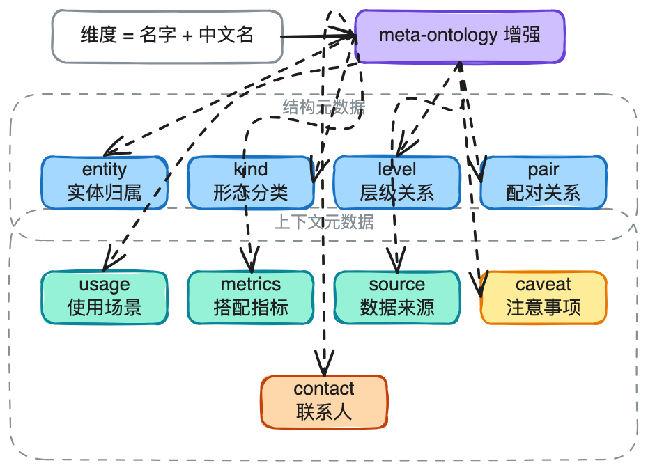

在 description 里编码本体元数据，不改服务端 schema，不加新字段，不调新接口。复用字典条目已有的 description 字段，用@key=value 标签语法编码结构化元数据：一级类目id，来自商品类目体系，顶层节点 @entity=cate @kind=identifier @level=1

@pair=cate\_level1\_name @usage=类目下钻分析,商品筛选

@metrics=pay\_amt,expo\_uv,clk\_pv @source=item\_info.cate\_id+cate\_tree

@caveat=每年类目调整;历史数据可能与现网不一致 @contact=xxx

人看到的是中文描述 + 一堆标签。机器用 parse\_description() 解析后拿到：

```

{
  "entity": "cate",          // 属于"类目"实体
  "kind": "identifier",       // 形态是"标识符"
  "level": 1,                 // 层级深度 1
  "pair": "cate_level1_name", // 配对词根
  "usage": ["类目下钻分析", "商品筛选"],
  "metrics": ["pay_amt", "expo_uv", "clk_pv"],
  "source": "item_info.cate_id+cate_tree",
  "caveat": "每年类目调整;历史数据可能与现网不一致",
  "contact": "xxx"
}

```

这一层元数据把"一个维度是什么"从"一个名字+中文名"提升为"实体归属 + 形态分类 + 层级关系 + 配对关系 + 使用场景 + 搭配指标 + 数据来源 + 注意事项 + 联系人"。

* #### 边界和关系 ####

----------

metadata-ontology: 管"是什么"——实体、形态、层级、配对、业务场景

data-manager: 管"怎么查"——表、字段、绑定、表达式、SQL

data\_manager 创建维度/指标时，name/showName 必须从 metadata-ontology的词根获取。词根不存在 → 停下来通过 metadata-ontology 创建 → 等 CDM 审批 → 再继续语义层操作。

但 metadata-ontology 不知道语义层资产的存在。它不知道 account\_id绑在哪个逻辑表上，不知道 expression 是什么，不知道 status是上线还是下线。它只管字典层的元数据——这是干净的职责分离。

桥梁是 name。同一个 name（如 account\_id）在两个体系中指代同一个概念：metadata-ontology里是 type=6 词根，data\_manager 里是维度实体。name 是 joinkey，把字典层的业务语义和语义层的技术配置关联起来。

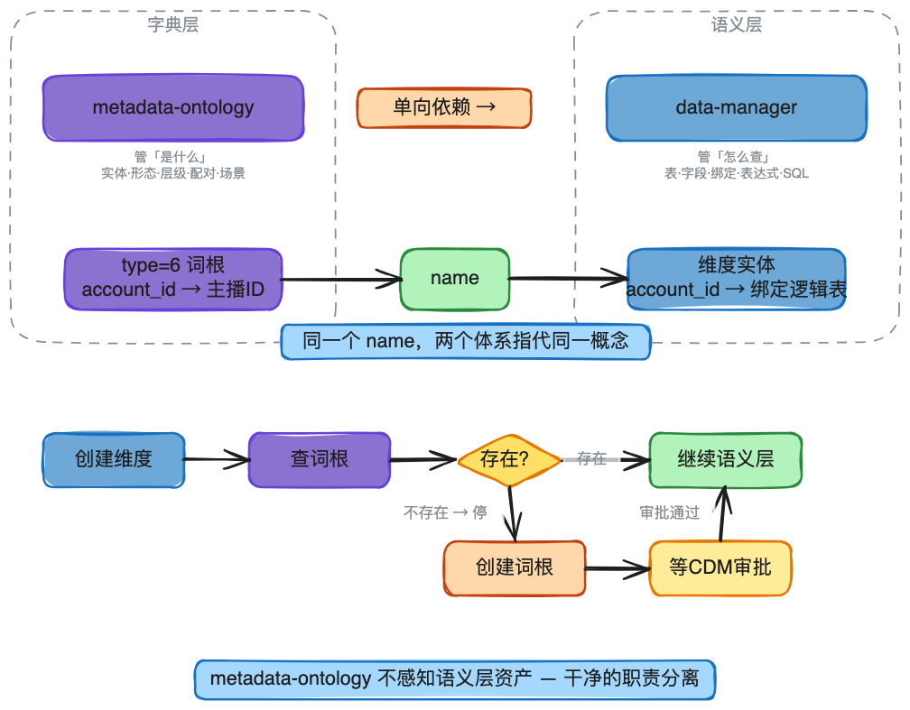

metadata-ontology 把"一个词根叫什么"升级为"一个词根是什么"——它属于哪个实体、什么形态、第几层级、配对是谁、通常配什么指标、数据从哪来、用的时候注意什么。这些业务含义编码在description 字段里，不改 schema、不加接口，纯加法。语义层（data-manager）负责把名字变成可执行的 SQL，metadata-ontology 负责让名字有业务意义。两者通过 name关联，各管各的，单向依赖。

### ▐ 设计哲学-Harness ###

----------

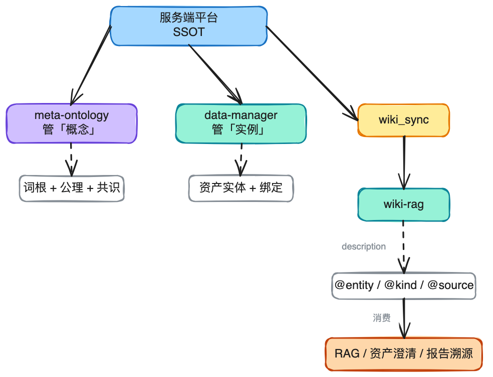

刚才上面说的什么wiki-rag、data-manager、meta-ontology都是语义层的相关skill，我们的语义层是agent开发和维护的，人在中间扮演的是业务专家和数据研发专家的角色，具体的实施和落地都是ai来完成的。

* #### AI（Agent）能做什么该做什么 ####

----------

宽泛点说，AI啥都能干上天入地，只要你让他干他就没有做不了的，我们这里聊的是更优雅、更高效的使用AI而不是只是用AI，我们通过大量的实操发现，AI适合和应该做的几件事：

* 探索分析

* 标准工作流执行落地

不适合或者是暂时不适合做的几件事：

* 100%精准的交付

* 复杂背景、复杂口径需求的开发

* #### 工程和AI的边界 ####

----------

要想保证系统的稳定性、确定性以及健壮性（降低幻觉），我的经验如下：

* 能不用AI的就不用AI，能工程的就用工程来解决

* 能写代码的就不写提示词

如果你都能说清楚规则和规范那说明就可以用工程或者代码来解决而不是寄希望于提示词，提示词起效快但是不治本，你不知道什么时候他会幻觉。

* #### 研发角色变化 ####

----------

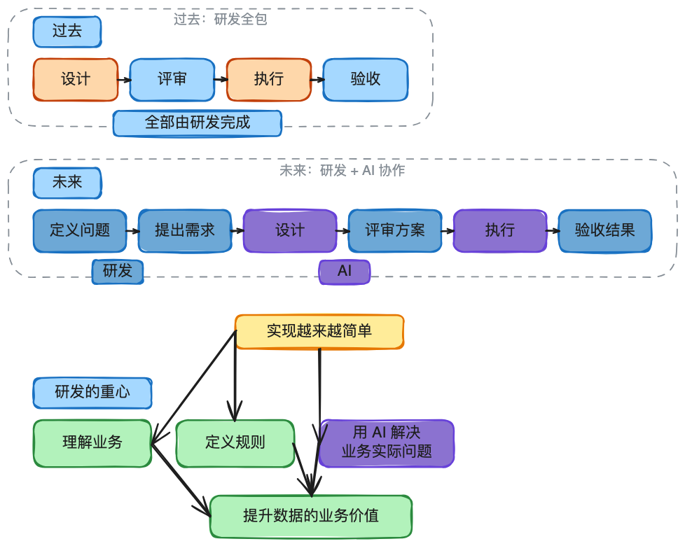

研发的分工从设计、评审、执行和验收逐步的转变为评审和验收，研发定义问题、提出需求、评审方案和验收结果，设计和执行交由AI来做，说白了实现变得越来越简单，研发应当更多的去理解业务、定义规则，用AI这种先进工具更好的解决业务实际问题，提升数据的业务价值。

* #### 实践 ####

----------

上面大家也看到了，我们的语义层是多么的复杂，目前的话就靠data-manager这个skill在生产和维护，使用过程中我们发现，单纯的靠牛皮的skill来保障语义层的质量真的太难太难了，这对使用者、对模型都有很高的要求，而且幻觉是无法避免的。

一开始我们做了语义层的上线管控，但是最后发现，你根本CR不过来，最后不得不用工程端强制拦截校验+标准化清晰错误提示的方案去优化和兜底保障data-manager的产出物质量。

整体来说，我们在服务端构建了两道防线，确保语义资产（物理表/逻辑表/指标/维度）的创建质量和上线安全：

防线一：创建时前置校验（Import Validation）

定位：在资产写入数据库前拦截不合规数据，给出精确到字段的中文报错。

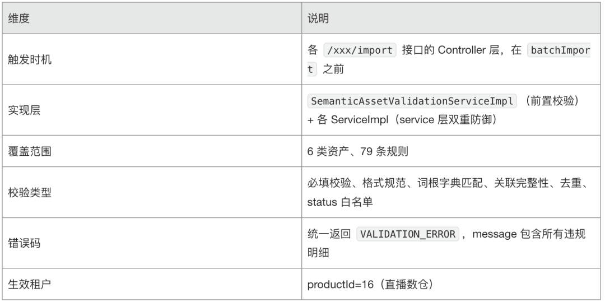

核心能力：

* 词根强绑定 — name/showName 必须来自字典，且 showName 必须以词根中文名开头（MT-28/DM-11）

* status 审批卡口 — 创建时禁止 status=1（在线），只允许 0/3（DM-12 + service 层双重拦截）

* 关联完整性 — 逻辑表必须先有物理表、指标必须绑定逻辑表、表达式字段必须在 CTE/物理表中存在

* 同批次去重 — 防止一次导入中重复提交相同资产

防线二：上线审批拦截（BPMS Approval）

定位：资产从草稿/下线→在线（status=1）或删除时，必须经过 CDM 审批人审批通过后才执行。

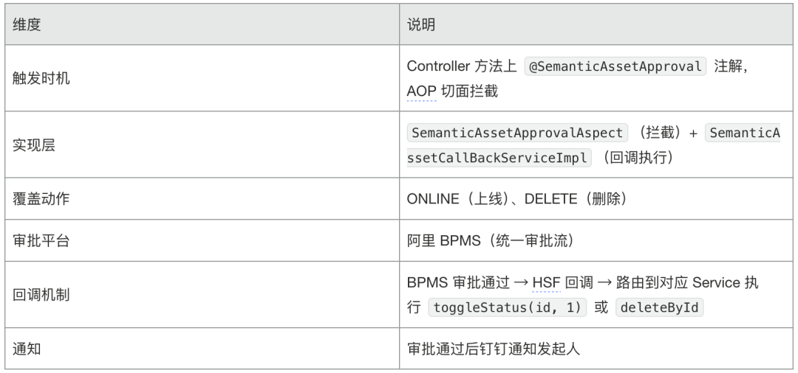

流程

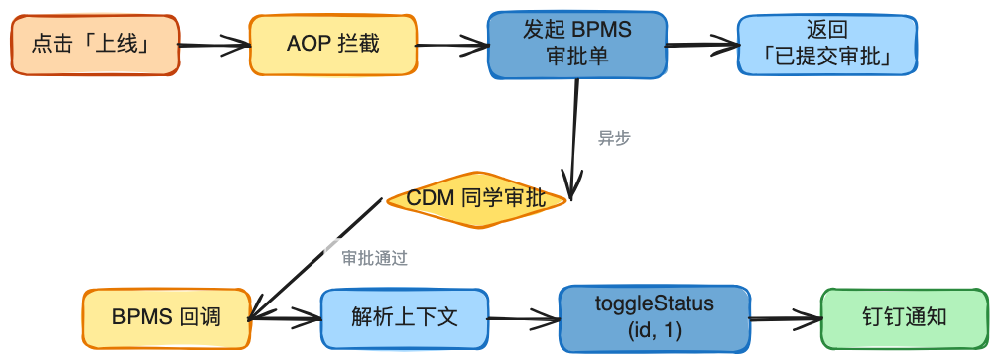

两道防线的协同关系

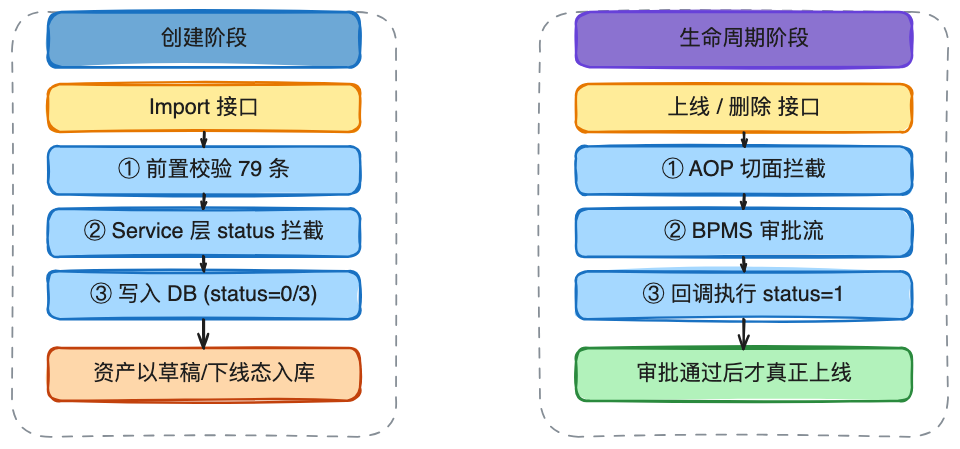

创建时保证数据质量，上线时保证审批流程——两道卡口缺一不可。

### ▐ 逆向-治理&保鲜 ###

----------

前面一直说的都是正向的落地，我们语义层还有2个重要的日常扫描治理来保障语义的准确性和及时性。data-manager和meta-ontology结合各种定时任务实现同一个skill的左右互搏和自我进化。

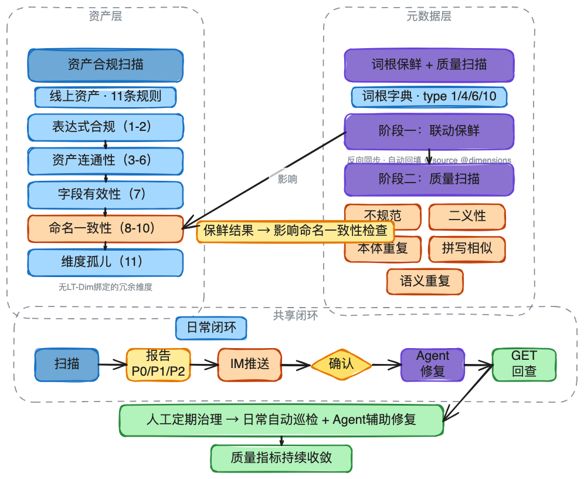

* #### 语义层资产合规扫描 ####

----------

这个任务面向的是"线上资产"——也就是已经在用的指标、维度、逻辑表、物理表及其绑定关系。扫描 11 条规则，可以理解为给语义层做一次"全身体检"：

* 第一层是表达式合规（规则 1-2）：检查指标和 LT-Dim 绑定里的 SQL 表达式是否规范，比如物理表字段是否用 ${} 正确包裹、有没有把整个函数调用误包进去的情况。

* 第二层是资产连通性（规则 3-6）：检测"孤儿资产"——指标有没有绑定到有效逻辑表、LT-Dim 绑定引用的逻辑表是否存在、LT-PT 绑定的物理表是否真实存在、逻辑表有没有至少一条有效绑定。这些本质上是数据模型的一致性校验，防止"配置了但查不了"的幽灵资产。

* 第三层是字段有效性（规则 7）：LT-Dim 绑定表达式里引用的字段必须在底层物理表里真实存在，否则查询时会报字段不存在的错误。

* 第四层是命名与元数据一致性（规则 8-10）：指标存储的 logicTableName 是否与实际逻辑表名称一致、指标/维度/逻辑表的 name 和 showName 是否与标签词根体系对齐（P0 name 不在词根、P1 showName 前缀不匹配、P2 topic/businessTag 不一致）、指标 fieldType 是否与 aggFunction 匹配。

* 第五层是维度孤儿（规则 11）：上线的维度如果没有任何 LT-Dim 绑定，说明它没有被任何逻辑表使用，是冗余配置。

扫描结果按严重程度分级（P0/P1/P2），通过 IM 推送报告，确认后由 Agent 自动执行修复——改 showName、下线孤儿资产、修正表达式等，修复后 GET 回查验证。

* #### 语义标签词根联动保鲜 + 质量扫描 ####

----------

这个任务面向的是"词根字典"——也就是指标、维度、业务过程、限定词的元数据根节点（type=1/4/6/10）。分两个阶段：

* 阶段一：联动保鲜。拉取线上资产的最新状态，反向检查词根字典是否需要同步更新。比如新上线了一个指标但它的 name 对应的词根还没补 @source 或 @dimensions，保鲜脚本会自动回填。本质上是让词根字典跟着业务变化自动演进，而不是靠人肉维护。

* 阶段二：质量扫描（5 项检测）：

* 不规范：词根缺必填元数据标签（@usage、@entity、@kind），或者 description 为空、name 和 showName 没翻译

* 二义性：showName 过短（\<=2 个字符），无法区分语义

* 本体重复：同一 type 内 entity+kind 完全相同的词根对，可能是重复录入

* 拼写相似：name 编辑距离\<=2 或相似度\>=0.9，检测 typo 或重复定义

* 语义重复：showName 完全相同或相似度\>=0.85，比本体重复更严格的语义层面去重

报告会自动与前一日对比，输出增量变化趋势。

两者的关系：

前者扫描管"资产层"（指标/维度/逻辑表的配置正确性），后者扫描管"元数据层"（词根字典的完整性和一致性）。

两层互相关联——保鲜回填的词根元数据会直接影响前者的命名一致性检查的结果。形成了一个"底层元数据治理 → 上层资产合规"的正向循环。

整体设计思路是把语义层的质量保障从"人工定期治理"变成"日常自动巡检 + Agent 辅助修复"，每天发现问题、确认问题、修复问题形成闭环，质量指标（不规范数、语义重复数等）持续收敛。


后续方向

----------

----------

大致这么几个方向：

成本

* 降低接入成本，非标表快速变成标表（ods-\>cdm）、由报表到语义（报表、api口径、血缘拆解到语义层生成）

* 降低理解成本，持续的业务语义层的建设，打通业务语义和数据语义的理解盲区

体验

* 查询提速，先优化Odps

* 权限隔离、申请以及安全管控

生态

* 使用监控、分析和优化包括Agent、Skill、以及具体的跑数Sql等

* 垃圾语义的跟踪治理


团队介绍

----------

----------

本文作者盈科，来自淘天集团-直播技术团队，我们是一支充满活力、在AI赛道上高速成长的技术先锋队，深耕直播数据多年，拥有深厚和先进的数据研发经验，服务AI与直播深度融合的黄金赛道——从传统数仓到AiData新时代，每一次代码提交都在推动着行业变革。

### ¤** **拓展阅读** **¤

**[3DXR技术](https://mp.weixin.qq.com/mp/appmsgalbum?__biz=MzAxNDEwNjk5OQ==&action=getalbum&album_id=2565944923443904512#wechat_redirect) | [终端技术](https://mp.weixin.qq.com/mp/appmsgalbum?__biz=MzAxNDEwNjk5OQ==&action=getalbum&album_id=1533906991218294785#wechat_redirect) | [音视频技术](https://mp.weixin.qq.com/mp/appmsgalbum?__biz=MzAxNDEwNjk5OQ==&action=getalbum&album_id=1592015847500414978#wechat_redirect)**

**[服务端技术](https://mp.weixin.qq.com/mp/appmsgalbum?__biz=MzAxNDEwNjk5OQ==&action=getalbum&album_id=1539610690070642689#wechat_redirect) | [技术质量](https://mp.weixin.qq.com/mp/appmsgalbum?__biz=MzAxNDEwNjk5OQ==&action=getalbum&album_id=2565883875634397185#wechat_redirect) | [数据算法](https://mp.weixin.qq.com/mp/appmsgalbum?__biz=MzAxNDEwNjk5OQ==&action=getalbum&album_id=1522425612282494977#wechat_redirect)**

----------

----------

