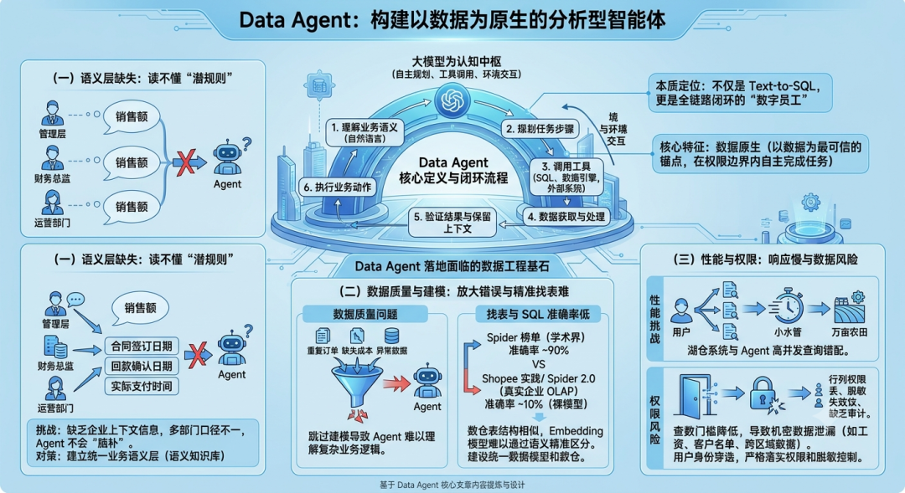
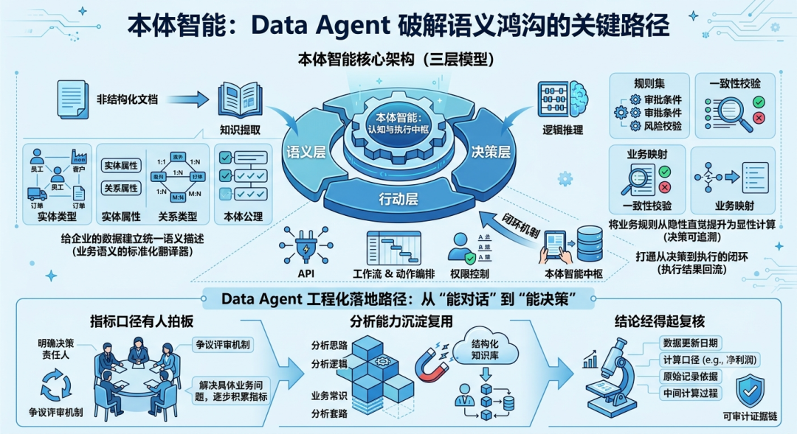

# 📰 【大胖智能】Data Agent 的本质不是 Agent，而是 Data Engineering

 过去两年，Data Agent 从概念验证走向企业试点，市场热度在 2025 年底达到顶峰。IDC 预测，到 2028 年，60% 的中国 500 强企业将部署企业级 Data Agent。Databricks 2026 年的报告也显示，60% 的组织已将数据分析与报告生成列为最具影响力的 AI Agent 用例。[【大胖智能】浅谈Data Agent](https://mp.weixin.qq.com/s?__biz=MzY5MzExOTQ5Mg==&mid=2247483993&idx=1&sn=368c9a695b516c2f06b917d7c23c7de7&scene=21#wechat_redirect)

 但到 2026 年，市场的语气开始变了。高频出现的不再只是“秒级问数”“自然语言分析”，而是“准确率”“口径统一”“权限安全”“可追溯”“交付能力”。Agentic Analytics 大概已经走过期望膨胀期，正在进入一段更严格的筛选期。

 为什么？因为太多 Data Agent 项目在演示阶段效果出色，上线三个月后却逐渐退回为少数人偶尔使用的工具。

 问题出在哪里？答案往往不在模型本身，今天你能调用的模型，同行很快也能调用。决定一个 Data Agent 能否在经营会上持续使用的，是它脚下的数据工程是否扎实。

## 一、Data Agent 的本质定位

 Data Agent 是以大模型为认知中枢，具备自主规划、工具调用和环境交互能力，能够在企业环境中稳定运行，并完成从数据获取、跨系统处理到业务动作执行的全链路闭环的数字员工。它不是“自然语言生成 SQL”的单点工具，而是分析型智能体系统，既能理解业务语言，也能规划任务、调用工具、验证结果、保留上下文。

 但“数据原生”才是 Data Agent 区别于通用对话机器人的核心特征。Data Agent 不是简单地与数据库完成连接，而是把数据变成 Agent 理解业务、形成判断、生成结果时最可信的锚点：既能懂指标口径、数据语义，也能在权限、治理和审计边界内自动完成任务。

## 二、数据工程：Data Agent 无法绕过的地基

 “Data Agent is Easy，Data Context is Hard。”这句来自一线实践者的判断，道出了问题的本质。

 Gartner 预言，超过 60% 的 AI 项目会因为数据问题而被放弃。MIT 的另一项研究也指出，95% 的企业 AI 部署项目没有产生可衡量的 ROI。

 当 Agent 走出聊天窗口、进入生产系统，它要面对的是数据、语义、性能、安全、审计一整套工业级约束。

 综合业界一线落地观察，核心堵点可归纳为三个层面：

### （一）语义层缺失：Agent 读不懂企业的“潜规则” ###

 这是制约 Data Agent 准确率最关键的挑战。即便大模型再聪明，缺乏企业上下文信息也很难理解企业业务语义。同样是“销售额”，财务、运营、管理层可能指向不同口径；“客户数”在新增、活跃、有效、付费场景下各有定义。

 某企业 Data Agent 上线第一周就翻车了：业务部门拿 Agent 报告开会，财务总监拍桌子，Agent 从 CRM 拉的是“合同签订日期”，而财务认的是“回款确认日期”，同一个“销售额”差出 30%。模型没问题，数据口径错了。

过去这套系统之所以还能运行，是因为使用对象是人，人是会脑补的。

 一个熟悉业务的分析师看到一张表名不规范的表，也能大概知道它来自哪个系统；业务同学问“本月新客转化”，分析师脑子里会自动补上“这个部门通常按注册后首单算”。但 Agent 不会天然继承这些默契。

### （二）数据质量与建模：Agent 只会更快地放大错误 ###

 数据库一接通，很多人就默认“数据已经准备好了”。真实世界却是：同一客户在两个系统里用两个编码；补数留下重复订单；退款后收入还在；缺失的成本被默认成零。过去分析师知道哪些坑要手工绕开，Agent 不知道，它只会更快、更稳定地放大这些错误。

 更危险的是“跳过数据建模”。当几十张甚至上百张原始表被一次性丢给 AI，期待它自己找关系时，AI 不会凭空知道订单和退款是一对多、库存是时点快照、价格表还有生效时间。

 Shopee 团队的实践提供了一个残酷的数据：初代 Text-to-SQL 方案上线后，找表的平均倒数排名仅达到 56% 左右，Text-to-SQL 的执行准确率不到 40%，就连最基本的语法准确率也徘徊在百分之五六十。

 核心原因之一就是数仓中大量结构相似的表，Embedding 模型很难通过语义相似性检索去区分这种微弱差异。

### （三）性能与权限：小水管灌不了万亩农田 ###

 演示时只有几千行样例数据，Agent 当然能秒回。一上线，用户开始自由追问，时间范围更宽、分析维度更多，几十个人同时发起查询，原本几秒的答案变成一分钟后还在转圈。传统湖仓与 Agent 的工作负载存在根本性错配。

 权限问题同样棘手。当查数门槛从“会写 SQL”降到“会问一句话”，原本很难被触达的工资、客户名单、其他区域的经营数据，现在可能一句追问就出来了。

 如果用户身份不能穿透到数据源，行列权限、脱敏和审计都没跟上，那不是数据开放，而是让公司数据在菜市场裸奔。

## 三、本体智能：Data Agent 破解语义鸿沟的关键路径

 前面提到，Data Agent 落地的第一道坎是“语义层缺失”，Agent 读不懂企业的业务语言。怎么解？本体智能提供了一条系统化的解决路径。

 本体智能[【大胖智能】大模型是大脑，本体智能是脊梁，万字长文讲透企业级AI的“硬知识”底座](https://mp.weixin.qq.com/s?__biz=MzY5MzExOTQ5Mg==&mid=2247485035&idx=1&sn=705d4cc31afc76c8ffad35dc88518de6&scene=21#wechat_redirect)的整体架构以“语义理解—推理决策—行动执行”为核心主线，采用“语义层—决策层—行动层”三层模型设计，使企业知识从非结构化文档中提取为机器可理解的语义模型，让 AI 能够直接基于业务规则进行推理与决策。

## 1、语义层：给企业的数据建立统一语义描述

 语义层的核心任务，就是把企业里“人知道但系统不知道、系统知道但模型不知道”的那些知识，显式地表达出来。它构建企业级统一语义模型，将分散于不同业务系统中的异构数据、业务术语与逻辑规则，映射为统一、标准、无歧义的业务语义体系。本质上，语义层是一个“业务语义的标准化翻译器”。

 语义层由四个核心要素构成。  

* **实体类型**定义业务世界里的核心对象：员工、客户、订单、设备等。每个实体类型包含数据属性和关系属性。  

* **实体类型属性**进一步描述这些对象的具体特征，分为数据属性和关系属性两类。  

* **关系类型**描述实体之间的业务关联，支持 1:1、1:N、M:N 三种基数，这是语义层最核心的能力，不止列清单，还画连线，让 AI 能顺着关系追踪业务逻辑。  

* **本体公理**则定义业务运行的逻辑边界与行为规范，如审批条件、权限控制、风险校验等，确保本体的一致性与可扩展性。

 语义层的建设需要从两个方向持续输入：

 一是**专业建模**，通过业务专家与本体工程师的协同，将专家的隐性知识转化为可计算的概念与规则；

 二是**智能化辅助**，借助大语言模型从现有系统数据、历史文档与操作记录中自动识别业务实体与关联关系。在实践中，企业还可将已沉淀的企业架构资产、数仓模型资产进行自动识别、映射与绑定，无需从零搭建。

## 2、决策层：将业务规则从隐性直觉提升为显性计算

 决策层构建企业业务的标准化决策逻辑体系，将分散在各业务环节中的碎片化处置规则整合为可量化、可复用、可追溯的统一决策规则集。其核心组件包括：  

* **逻辑推理：**基于语义层的概念关系与业务规则，推导出未显式记录的隐含结论；  

* **一致性校验：**自动检测知识库中的逻辑不一致性；  

* **触发条件：**定义决策逻辑的激活条件，当特定业务状态发生时自动触发相应流程；  

* **业务映射：**将决策结论映射为具体的业务操作指令。

 决策层的一个重要设计原则是**决策可追溯**。所有规则的触发、推理以及决策的生成，均以结构化事件的形式被完整记录，每一条结论均可回溯至具体规则依据，支持合规审计与业务解释。

## 3、行动层：打通从决策到执行的闭环

 行动层构建企业业务的自动化执行能力，将业务意图拆解为可跨系统联动、可闭环落地的自动化执行动作流。其核心工具包括：  

* **API 接口：跨系统的能力调用通道；**  

* **工作流与动作编排：**将多个原子动作组合为完整业务流程；  

* **权限控制：**执行动作的操作权限与范围管控。

 行动层最核心的设计是**决策闭环机制**：决策下发后，业务系统的执行结果与数据变化实时回流至本体智能层，动态更新实体属性、关系与业务规则，形成“知识感知→推理决策→执行反馈→知识更新”的闭合学习回路。

 此外，行动层还承担**知识能力开放**的职责，以标准化接口向上层应用提供语义搜索、自然语言问答、解释性分析等服务，使本体积累的业务知识可被不同系统按需调用。

 三层模型共同构成企业的统一语义网络，使企业数据从传统“字段级连接”升级为“业务语义级连接”。语义层让 Agent 理解业务概念“是什么”，决策层让它知道“该怎么做”，行动层让它能够“真的去执行”。

 三层环环相扣，从根本上解决了 Data Agent 因语义模糊而产生的“听不懂、答不对、落不了地”的问题。

## 四、从“能对话”到“能决策”的工程化路径

 Data Agent 从演示到生产系统之间，隔着一整套工程体系。企业落地 AI 普遍面临三类顾虑：难落地、没大用、不敢用。

 这三类顾虑能否化解，分别对应三块基础是否牢固：

 **第一，指标口径要有人拍板。**同一个指标，企业内部没有统一的定义和明确的决策机制，AI 计算得再快，结果也无法服众。需要明确“谁来拍板”，争议口径需要有清晰的决策责任人和评审机制。建设路径上，与其“先建平台再找用途”，不如“围绕业务问题逐步积累”，先确定要解决哪个经营问题，圈定涉及的指标，跑通一个问题，业务就见一次效果。

 **第二，分析能力要能沉淀复用。**如果每一次归因、每一次复盘的分析思路都留在那次对话里，换个区域、换个人提问一切从头开始，这样的 Data Agent 价值有限。需要把分析逻辑、业务常识、分析套路沉淀为结构化知识，在 Agent 运行过程中进行组合与调用。

 **第三，结论要能经得起复核。**真正用于决策的答案，必须能回答：数据更新到哪一天？“利润”用的是哪个口径？结论来自哪些记录？中间经过了怎样的计算？没有这条证据链，答案就无法复核。系统输出结论时，应为关键数字、异常判断和中间计算过程挂接证据入口。

## 结语：Data Engineering 不会被替代，只会更重要

 沿着这条链路回看，Data Agent 落地的每一道坎，根因都不在大模型或 Agent 框架。大模型能压缩查询、归因和表达的时间，却不会替企业补出事实、决定口径或建立权限责任。

 AI 出现之前，数据行业就在解决来源、质量、建模、口径、性能、权限和追溯。AI 出现之后，这些问题没有消失，改变的只是数据被使用的方式、速度和范围：过去一张错报表影响一次会议，现在一个错误答案可能被 Agent 瞬间送到更多人面前。

 AI 时代的数据基建，不是把旧数仓接上大模型，而是要把企业业务世界重建成一套 Agent 可以理解、可以调用、可以追溯、可以执行的语义系统。传统数仓不会消失，甚至会继续承担很重要的存储、计算和性能底座。但如果企业还以过去“给人用 BI”的方式去建设数据资产，再期待 Agent 能自动理解里面所有历史债、口径差异和业务潜规则，这件事大概率会走向一地鸡毛。

 数据工程师的角色正在从“管道建造者”转变为“上下文架构师”。把真实世界映射成可信、可用、可控的数据，这份责任永远不会消失。Agent 降低了数据的使用门槛，也把 Data Engineering 从后台推到了智能应用的地基上。

注：文章来自大胖每天的臆想，大胖对自己的话语付不起任何法律义务的，大胖更多的臆想，请关注“大胖说”，按大胖体重增长情况更新臆想内容
