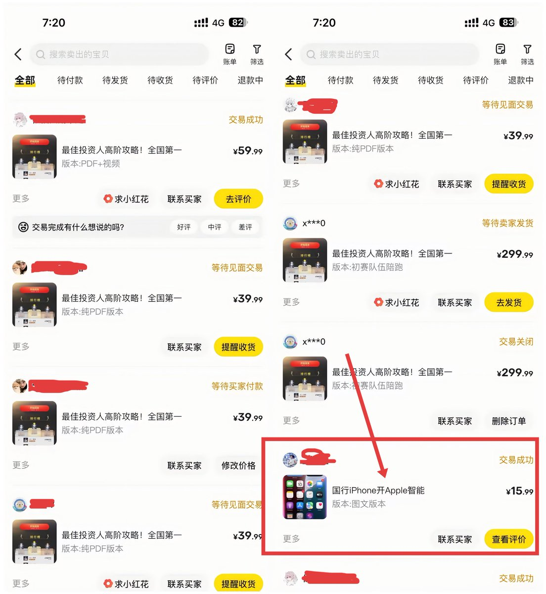
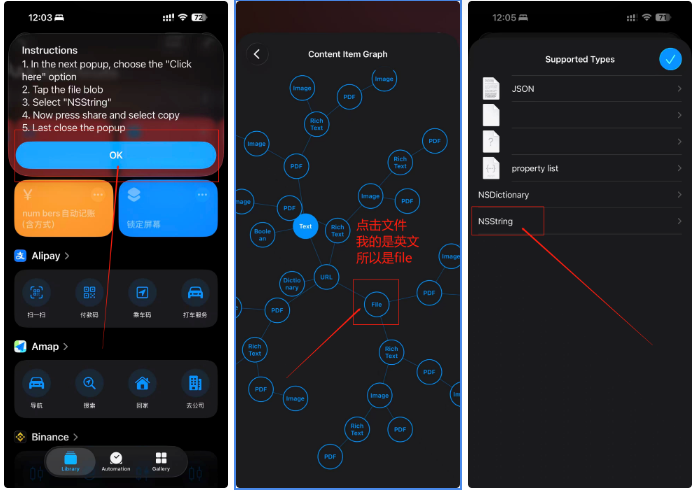
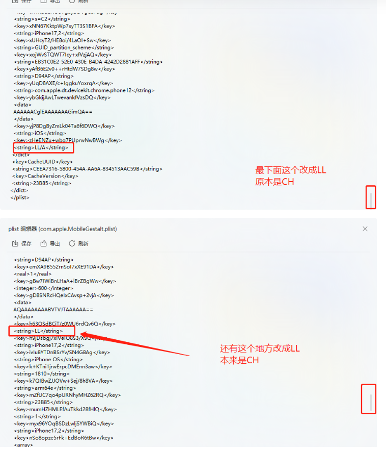
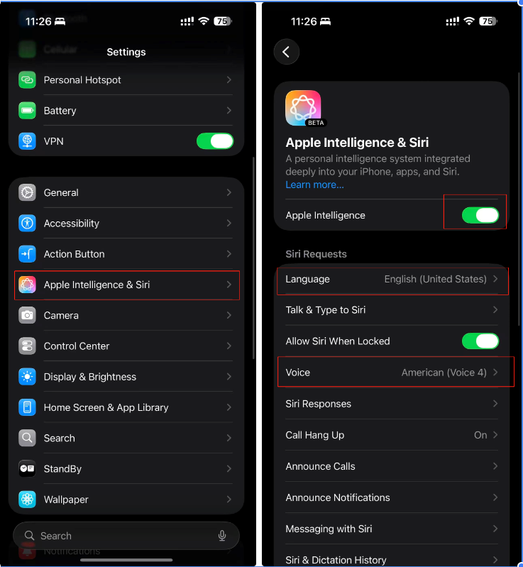
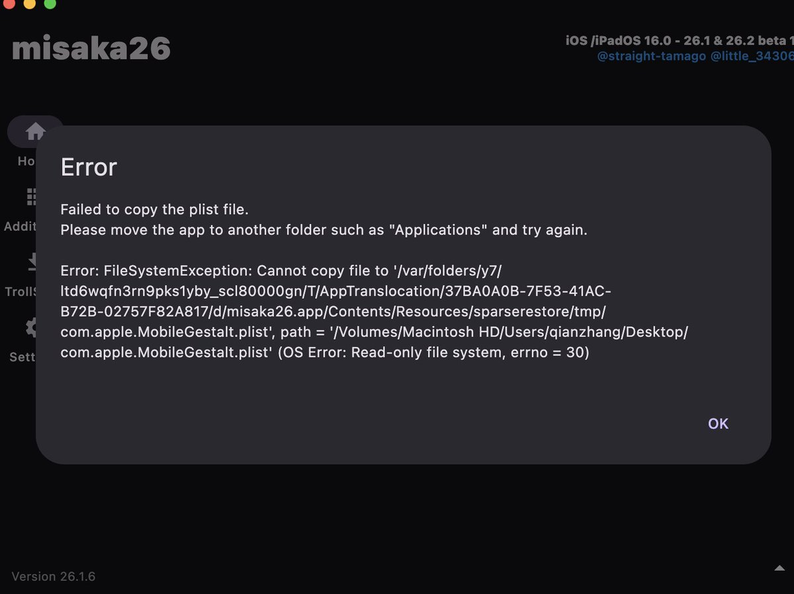

《国行 iPhone → 开启满血 AI，全图文流程X平台首发版》——闲鱼小红书副业赚钱版
前天起床了之后打开闲鱼，我发现国行 iPhone 也能开启AI 了
于是我搜索了X上的内容想找一个免费教程
发现X上竟然没人讲，那我就我自己摸索了完整流程第一时间发布
现在把最稳定、最安全、最容易复现的一版直接拆给你
（不需要越狱、不需要刷机）

这个想法，从看到到完成只用了两天时间
并且成功卖出单赚到了钱
大家看完之后，完全可以闲鱼小红书挂上商品去卖
请记住：
只要你愿意折腾，就永远不缺钱赚！

附：闲鱼近期收入截图——并且卖出去一单Apple ID 图文教程（近期副业收入日均300+）

接下来教程开始！！！
所需物品清单：

一台电脑window10/11 或者mac电脑
一个米区apple   ID
一条连接手机和电脑的数据线
Iphone15pro及以上机型
IOS版本必须要是iOS18.1-26.2Beta
电脑上的爱思助手以及misaka软件
（下面有下载链接）

好的准备好以上内容，我们就开始教程咯

第一步：手机设置里，查找手机关闭
语言与地区中地区  改米国并且关闭定位

第二步：打开网址[icloud.com/shortcuts/0002…](https://www.icloud.com/shortcuts/0002e5bd9b7842bda3c2a83ad82033c9)
下载快捷指令，下载完毕之后点击快捷指令，点击里面的文件
点击NSS开头的文件，然后全选，复制粘贴到电脑上
然后现在把语言全部设置为英语

第三步：在电脑上新建一个TXT文件夹，粘贴刚刚NSS文件里面的内容，更改两个地方
分别是  &lt;string&gt;CH&lt;/string&gt;中的CH改为LL 有两个哦，都需要改
还有一个是  &lt;string&gt;LL/A&lt;/string&gt;中的LL改为 CH
更改完毕后
在电脑上把txt文件重命名为

[com.apple](http://com.apple).MobileGestalt.plist

第四步：下载misaka软件
下载链接： [pan.baidu.com/s/1tIr6GtVjC1v…](https://pan.baidu.com/s/1tIr6GtVjC1veXKBDQ0bbqw?pwd=a1jc) 提取码: a1jc

在电脑上打开misaka软件，在里面打开[com.apple](http://com.apple).MobileGestalt.plist文件

只勾选Apple Intelligence  其他全部为空

第五步：连接手机和电脑，点击信任此电脑，输入密码，随后卸载苹果自带的图书app，确保现在登录的是美区id账号，在apple store里面下载book 软件（刚刚卸载的那个）

打开自己的小火箭，勾选代理，关闭启用回退
然后挂米国的节点

接着打开刚刚下载的book软件搜索free，搜索出来的图书是免费的，点击get，验证人脸或者密码，在下载过程中，同时点击电脑上misaka软件的apply！

记住必须在下载过程中点击电脑上的apply

点击完成后，手机会自动关机并且重启

第六步：重启完成后，打开设置，看一下有没有apple intell这个功能，有的话点击进去，他会自动下载，切记这里的语言要选择english，不要选择Chinese否则用不了AI，并且唤醒词也是english设置的，等待十几分钟之后，他会出现下图所示的AI系统

第七步：重启后进入：设置 → Apple Intelligence
如果你能看到完整 AI 面板 → 说明成功
第一次加载会自动下载组件，大概 5～10 分钟
记住：
语言要先切到 English
中文目前会导致部分功能无法加载

第八步：短按侧边键 → 即可直接呼出 Apple Intelligence
你就可以开始体验完整的苹果 AI 生态了：
Rewrite
Image Playground
Genmoji
Summaries
Siri 全新能力

🎉 到这里，恭喜你完成了国行最强“平替升级”！

结语：

所以说呢，赚钱这件事情，就看自己做不做，在推文里我已经明确说了

这篇教程绝对可以卖得出去，需求量也绝对有

并且竞争不激烈，那为什么不做呢？

执行力，才是这个时代年轻人真正拉开差距的地方

如果对你有帮助
文末点个赞 + 转发
让我知道这篇干货应该继续做下去
祝大家玩的开心，点赞转发，支持一下！谢谢大家！

### 🖼️ Attached Media

## 💬 Replies

### 1 @Leobai825 (天策) (Author)

*Sat Dec 13 06:23:12 +0000 2025*

有点意外这条推文会爆
我后面会把：
我是怎么从“看到需求”到“2 天内做出来 + 立刻变现”
的完整思路单独拆一篇
如果你是普通人、刚毕业、想靠执行力多一条收入线的，关注我，我会持续更新的！一起从0到1！

### 2 @li9292 (李韭二)

*Fri Dec 12 14:06:31 +0000 2025*

@Leobai825 太干货了！有个问题，我设置好了，总是过一段时间韭显示“ChatGPT is not  available on your country”

### 3 @Leobai825 (天策) (Author)

*Fri Dec 12 14:07:21 +0000 2025*

@li9292 yes我也是这样老师，目前我并不知道解决办法

### 4 @ox_planb (毛毛虫)

*Sat Dec 13 13:28:57 +0000 2025*

@Leobai825 成功率低的，misaka导入前可以打开图书和App store 基本上一次就成

### 5 @Leobai825 (天策) (Author)

*Sat Dec 13 13:50:17 +0000 2025*

@ox\_planb 感谢老师补充！信息差确实非常大的

### 6 @yahaclass (YAHA學堂)

*Fri Dec 12 12:27:37 +0000 2025*

@Leobai825 这个绝对高端教程

### 7 @Leobai825 (天策) (Author)

*Fri Dec 12 12:46:21 +0000 2025*

@AIPMLogi 哈哈哈感谢老师认可！我会继续努力的！

### 8 @ScarletKc_ (KC)

*Fri Dec 12 11:56:36 +0000 2025*

@Leobai825 厉害👍

### 9 @Leobai825 (天策) (Author)

*Fri Dec 12 12:16:13 +0000 2025*

@ScarletKc\_ 嘻嘻，感谢老师认可！

### 10 @RayW_OldW (RayW_OldW)

*Fri Dec 12 16:46:55 +0000 2025*

@Leobai825 iOS26.1及以下版本完全可用，iOS26.2Beta已经修复漏洞

### 11 @Leobai825 (天策) (Author)

*Fri Dec 12 16:50:00 +0000 2025*

@RayW\_OldW 感谢老师补充！支持了！

### 12 @NikMulberry (Nik-X)

*Fri Dec 12 15:13:22 +0000 2025*

@Leobai825 好使不？

### 13 @Leobai825 (天策) (Author)

*Fri Dec 12 16:09:48 +0000 2025*

@NikMulberry 挺好使的呀，总比不开强，当然，开不开没太大区别

### 14 @wenzherunze (Venz)

*Fri Dec 12 12:45:58 +0000 2025*

@Leobai825 牛啊

### 15 @Leobai825 (天策) (Author)

*Fri Dec 12 12:50:37 +0000 2025*

@wenzherunze 嘻嘻，感谢老师认可！一起加油啊！

### 16 @hGaFj5gE1O3x1JW (shier)

*Fri Dec 12 18:05:21 +0000 2025*

@Leobai825 得一直用英文语言和使用的时候得开着vpn吧？

### 17 @Leobai825 (天策) (Author)

*Sat Dec 13 00:00:58 +0000 2025*

@hGaFj5gE1O3x1JW 我目前用英文的，不清楚用中文行不

### 18 @baidashi996 (爱吃西红柿🍅)

*Sat Dec 20 06:31:53 +0000 2025*

@Leobai825 适用必须 Iphone15pro及以上机型 吗

### 19 @Leobai825 (天策) (Author)

*Sat Dec 20 06:42:14 +0000 2025*

@baidashi996 是的老师

### 20 @sodawhite_dev (苏打白.Dev)

*Mon Jan 12 13:24:39 +0000 2026*

@Leobai825 打开桌面保存的软件出错 

### 21 @Leobai825 (天策) (Author)

*Mon Jan 12 13:46:18 +0000 2026*

@QBuildsAI 选择这里面的按钮去打开文件，不是直接拖

### 22 @WangChuRan__ (②◎②⑥)

*Fri Dec 12 22:39:07 +0000 2025*

@Leobai825 牛啊，这都能发现😲

### 23 @Leobai825 (天策) (Author)

*Sat Dec 13 00:00:00 +0000 2025*

@WangChuRan\_\_ 哈哈哈发现了就去做啦

### 24 @Gloriaznr (Gloria🦦)

*Wed Dec 17 12:04:22 +0000 2025*

@Leobai825 大佬，我可以去卖一下吗？哈哈。

### 25 @Leobai825 (天策) (Author)

*Wed Dec 17 13:55:07 +0000 2025*

@Gloriaznr 放心去卖

### 26 @zc88866 (web3聪哥丨Bird🕊️)

*Fri Dec 12 14:23:36 +0000 2025*

@Leobai825 先收藏起来了，老师太牛逼了！

### 27 @Leobai825 (天策) (Author)

*Fri Dec 12 14:25:51 +0000 2025*

@Glow88866 感谢老师认可！关注了哦

### 28 @WwwWwyyyyyyyy (Wwwwwwww)

*Sat Dec 13 02:42:48 +0000 2025*

@Leobai825 这样说的话我完全可以买一个国行拿到日本来当满血使用？？

### 29 @Leobai825 (天策) (Author)

*Sat Dec 13 05:30:45 +0000 2025*

@WwwWwyyyyyyyy 理论来讲是可以的

### 30 @David_Yanggg (David.HK🇭🇰)

*Fri Dec 12 15:41:35 +0000 2025*

@Leobai825 其实最大的问题不是复杂，是怕不安全，毕竟有这么多步骤要给权限

### 31 @Leobai825 (天策) (Author)

*Fri Dec 12 16:06:48 +0000 2025*

@David\_Yanggg 老师这个真的就是仁者见仁 智者见智了，也可以不开都没太大区别

### 32 @Kefangshen (小呆)

*Sun Dec 14 16:41:09 +0000 2025*

@Leobai825 操作失误的话，手机会变成砖头吗

### 33 @Leobai825 (天策) (Author)

*Sun Dec 14 16:48:40 +0000 2025*

@Kefangshen 我操作失误了很多次，也没影响。。。

