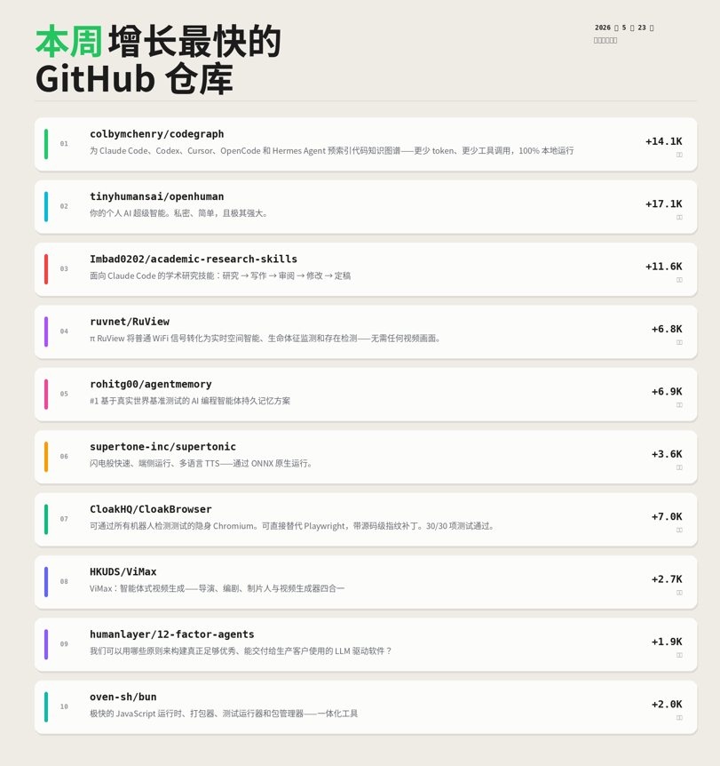
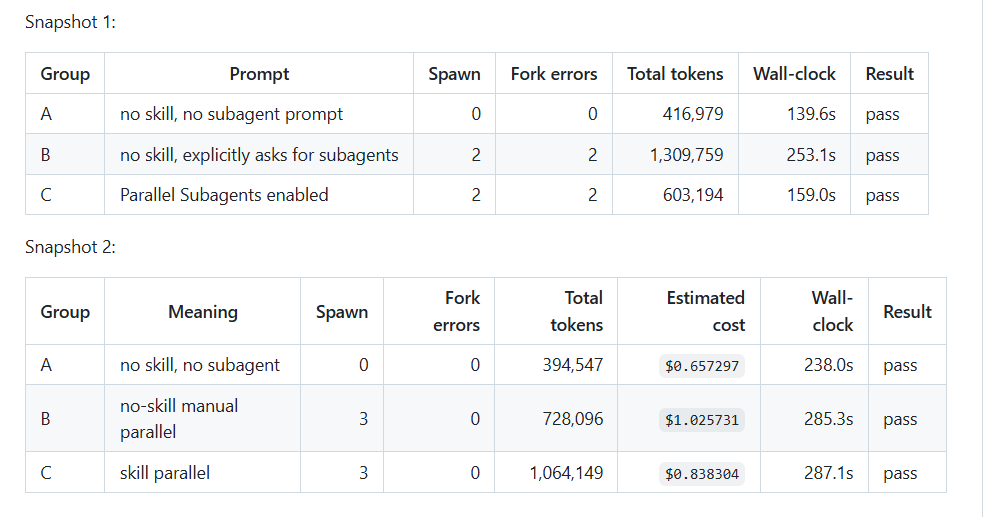

本周增长最快的 10 个 GitHub 仓库：

1\. codegraph（+14.1K stars）
为 Claude Code、Codex、Cursor、OpenCode 和 Hermes Agent 提供预索引的代码知识图谱——更少 token、更少工具调用、100% 本地运行
[github.com/colbymchenry/c…](https://github.com/colbymchenry/codegraph)

2\. openhuman（+17.1K stars）
你的个人 AI 超级智能。私密、简单且极其强大
[github.com/tinyhumansai/o…](https://github.com/tinyhumansai/openhuman)

3\. academic-research-skills（+11.6K stars）
面向 Claude Code 的学术研究技能：研究 → 写作 → 审阅 → 修改 → 定稿
[github.com/Imbad0202/acad…](https://github.com/Imbad0202/academic-research-skills)

4\. RuView（+6.8K stars）
π RuView 将普通 WiFi 信号转化为实时空间智能、生命体征监测和存在感知——全程无需任何视频画面
[github.com/ruvnet/RuView](https://github.com/ruvnet/RuView)

5\. agentmemory（+6.9K stars）
基于真实世界基准测试的 AI 编程智能体第一持久记忆方案
[github.com/rohitg00/agent…](https://github.com/rohitg00/agentmemory)

6\. supertonic（+3.6K stars）
闪电般快速的端侧多语言文本转语音（TTS）——通过 ONNX 原生运行
[github.com/supertone-inc/…](https://github.com/supertone-inc/supertonic)

7\. CloakBrowser（+7.0K stars）
可通过所有机器人检测测试的隐身 Chromium。可直接替代 Playwright，并带有源码级指纹补丁。30/30 项测试通过
[github.com/CloakHQ/CloakB…](https://github.com/CloakHQ/CloakBrowser)

8\. ViMax（+2.7K stars）
ViMax：智能体式视频生成工具，集导演、编剧、制片人和视频生成器于一体
[github.com/HKUDS/ViMax](https://github.com/HKUDS/ViMax)

9\. 12-factor-agents（+1.9K stars）
我们可以用哪些原则来构建真正足够优秀、能够交付给生产环境客户使用的 LLM 驱动软件
[github.com/humanlayer/12-…](https://github.com/humanlayer/12-factor-agents)

10\. bun（+2.0K stars）
极快的 JavaScript 运行时、打包器、测试运行器和包管理器——一体化工具
[github.com/oven-sh/bun](https://github.com/oven-sh/bun)

本周主题：智能体记忆、上下文效率和端侧智能正在让 AI 基础设施成为最火热的构建方向。

收藏这份清单。下周的榜单可能会完全不同。

### 🖼️ Attached Media

## 💬 Replies

### 1 @tinyhumansai (TinyHumans AI)

*Fri May 29 15:35:09 +0000 2026*

@pritipatelfgoo we're only gettin started 🐥6

### 2 @ajs6888 (安叫兽|Bird🕊️ 🔶 BNB)

*Sat May 23 21:29:49 +0000 2026*

@pritipatelfgoo 又是 AI 工具霸榜的一周，codegraph 有点想看下

### 3 @0xSerious (Jens Ernstberger)

*Sun May 24 10:55:00 +0000 2026*

@pritipatelfgoo The velocity of agent infra ecosystem is insane, shipping the glue is becoming just as fast as shipping the apps

### 4 @ZAbens200080378 (赛博老登)

*Sun May 24 06:50:12 +0000 2026*

@pritipatelfgoo 谢谢分享，我就不客气的笑纳啦！

### 5 @britanianec (hanayuki)

*Sun May 24 07:03:39 +0000 2026*

@pritipatelfgoo Trí tuệ siêu việt AI cá nhân của bạn!

### 6 @MARTINPARK111 (Martin BC)

*Sun May 24 13:19:46 +0000 2026*

@pritipatelfgoo 我用了一下OpenHuman，我感觉有点有点silly。我就没有然后了。

### 7 @Long725792857 (Long 7)

*Sun May 24 07:34:35 +0000 2026*

@pritipatelfgoo 次週はもっとエキサイティングかも！

### 8 @steveshaobin (炒币爆仓从零开始)

*Tue Jun 02 16:15:29 +0000 2026*

@pritipatelfgoo codegraph那个最有意思——预索引代码知识图谱，减少token消耗、减少工具调用，100%本地运行。给Claude Code用的思路对了：不是让AI聪明，是让AI少做无用功。agentmemory也在这个方向，持久记忆解决的是重复劳动问题。本周AI基础设施主题集中在'效率'而不是'能力'，这个信号值得关注。

### 9 @yuki__shu1224 (ゆうき＠カッコよくて売れるデザイン)

*Sun May 24 10:25:32 +0000 2026*

@pritipatelfgoo ファーストビューで見つけるUSPの衝撃

codegraphの注目は「コード知識グラフ」

膨大なコードを要約し高速検索を可能にする技術で

ユーザー体験のレスポンスが劇的に向上する仕組み

デザインで言えば、盛り付けの美しさが味を決めるようなものですね

### 10 @ingridiasdesou1 (ingrid souza)

*Sun May 24 06:14:59 +0000 2026*

@pritipatelfgoo 興味深いリポジトリですね！将来的に影響を与える可能性があります。

### 11 @Wuli1013 (陆川Luc)

*Mon May 25 03:05:40 +0000 2026*

@pritipatelfgoo 量大 满血 限时优惠[shop.xuedingtoken.com/?dist=HNA8TRTW](https://shop.xuedingtoken.com/?dist=HNA8TRTW)

### 12 @PANGDAMO (大魔出海汇)

*Sun May 24 19:04:42 +0000 2026*

@pritipatelfgoo 感谢分享以家模指

### 13 @citerDX (citer)

*Fri May 29 16:52:20 +0000 2026*

@pritipatelfgoo @tinyhumansai 

### 14 @AmberChenuzjt (香菜XIANG|AI 工具实测)

*Tue May 26 13:51:17 +0000 2026*

@pritipatelfgoo codegraph 这个看着挺有意思——预索引代码图谱让 Claude Code/Codex 共享一份知识库，少 token 少调用。

进阶用户的 alpha 越来越往"上下文工程"这一层走了。Skill 是沉淀 prompt，codegraph 是沉淀代码结构，套路一样：能预计算的东西就别让 AI 每次重算。

### 15 @HuaMan498374247 (Hua Man)

*Thu Jun 04 07:46:12 +0000 2026*

@pritipatelfgoo One thing I've found helpful is freezing scope per lane with explicit allowed/forbidden files before spawning agents. parallel-subagent-planner does exactly that + has model suggestions.

[github.com/manhua-man/par…](https://github.com/manhua-man/parallel-subagent-planner) 

