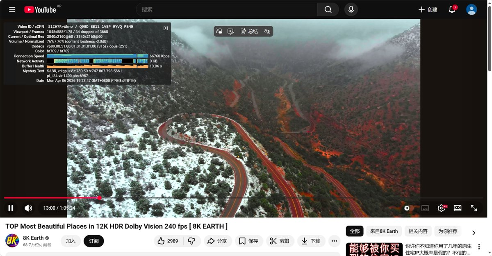
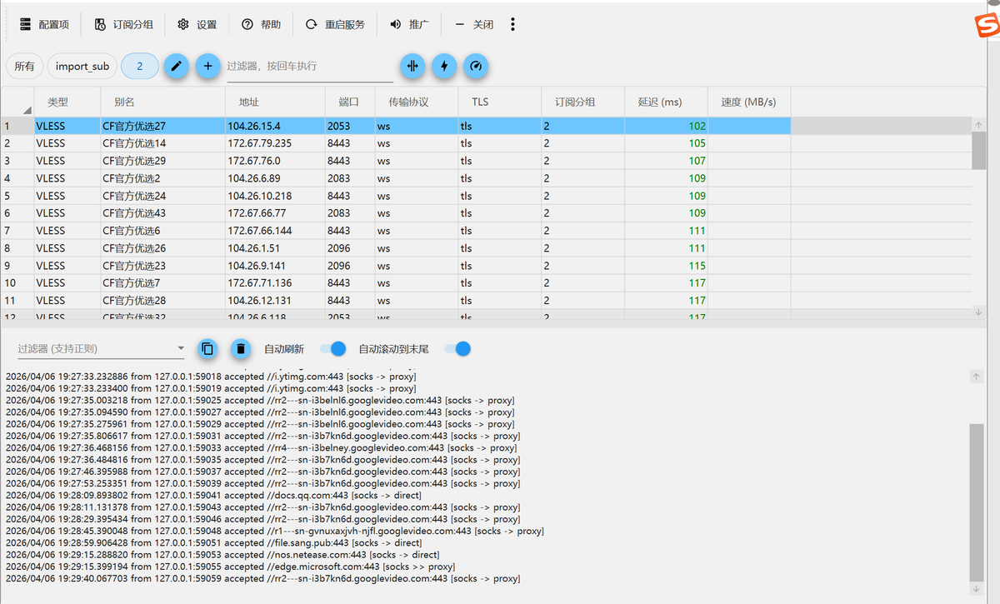
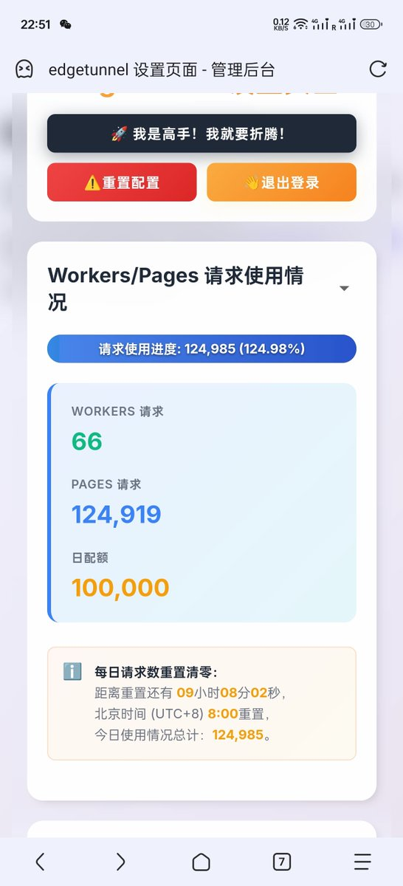
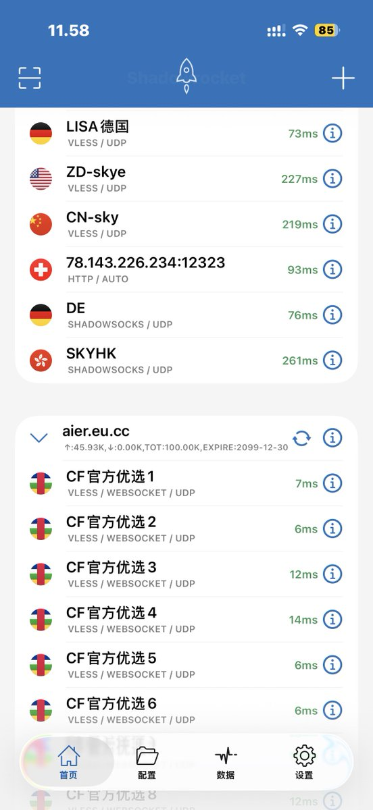

最近几天看到很多网友在说梯子崩了…… 

这不CF大善人提供的免费无限流量梯子来了，你只需要注册一个Cloudflare账号并在CF Workers/Pages平台上部署一个EdgeTunnel就好啦🥳

在4月这波清退潮中，有不少VPN机场受到影响，上面严查、同行互D、专线成本一起上来，直接扛不住切换到直连模式了。虽然奶昔机场不是我开的，但我还是得给买不起VPS和eSIM、不会自建节点的一个兜底方案，配合新拉的移动家宽再优选下简直夯爆了！！！

项目地址[github.com/cmliu/edgetunn…](https://github.com/cmliu/edgetunnel)t
如果懒得搭，直接订阅[s.ee/subc](https://s.ee/subc)Yh

### 🖼️ Attached Media

## 💬 Replies

### 1 @simon_wcw (屋顶上的重骑兵)

*Mon Apr 06 13:32:52 +0000 2026*

@realNyarime 没钱想白嫖的话，CF节点确实不错，但是需要经常维护和优选，还想白嫖稳定一点线路的话，那就试一试甲骨文免费VPS。

### 2 @realNyarime (奶昔🥤) (Author)

*Mon Apr 06 13:34:29 +0000 2026*

@simon\_wcw 甲骨文其实都发了教程的，没人看🥲[x.com/realNyarime/st…](https://x.com/realNyarime/status/2038116106217705668)B

### 3 @AngelaGonzll (🍣)

*Mon Apr 06 13:15:44 +0000 2026*

@realNyarime warp还没被封的时候速率感觉过得去 几PB的流量 但是现在只有电脑能用 基本是LAX

### 4 @realNyarime (奶昔🥤) (Author)

*Mon Apr 06 13:19:53 +0000 2026*

@AngelaGonzll 我移动连不上warp，电信去LAX了延迟巨高，开小号用CF pages走的KR还行（单纯测试 留给有需要的网友吧

### 5 @Cyber_Nekomata (鸽🕊️*3)

*Mon Apr 06 13:24:31 +0000 2026*

@realNyarime 套cf中转网速也太慢了

### 6 @realNyarime (奶昔🥤) (Author)

*Mon Apr 06 13:31:56 +0000 2026*

@Cyber\_Nekomata 所以优选过了，复制订阅链接到Clash等代理软件就行了，你可以直接用我的（推文底部

### 7 @wuhua04 (無花)

*Mon Apr 06 13:04:29 +0000 2026*

@realNyarime 你部署一个给我玩玩呗，不要黑丝了要这个

### 8 @realNyarime (奶昔🥤) (Author)

*Mon Apr 06 13:06:06 +0000 2026*

@wuhua04 底部不是有订阅链接吗，直接用！

### 9 @zhengyu89737964 (Mik yuen)

*Mon Apr 06 14:41:45 +0000 2026*

@realNyarime 前天搞了，節點沒個可以ping通的。不知道原因。

### 10 @realNyarime (奶昔🥤) (Author)

*Mon Apr 06 16:27:01 +0000 2026*

@zhengyu89737964 看下有没有允许不安全sni，超过10万还是可以用的 官方文档写了只是超过10万之后不保证连接线
流量是无限，但每天只有100000的works/pages配额，用完就得等第二天刷新，晚上对移动网不太友好 

### 11 @ZaindORp (*۫۫۫۫۫۫۫۫۫۫雨۫۫۫۫۫۫۫۫۫樱۫۫۫۫۫۫۫۫۫۫落𝗭𝗮𝗶𝗻𝗱𝗢𝗥𝗽)

*Mon Apr 06 13:50:07 +0000 2026*

@realNyarime 免费CF Workers的TOS原则上是禁止用于代理流量用途的。
非必要最好别这么做。

### 12 @hangkun_wangshu (熏🈚️🈳️🉐️醺)

*Mon Apr 06 14:21:44 +0000 2026*

@realNyarime edt还是别推荐了吧，把大善人薅垮了就天塌了，一堆正常项目在works和pages

### 13 @_alexas_ (alex)

*Tue Apr 07 00:54:04 +0000 2026*

@realNyarime CF明令禁止用Worker搭代理，甚至这个Edge Tunnel的明文代码会被针对。想用自己私下用就好。用这种话术，搞宣传给自己攒Credit多少有点不地道。

### 14 @ClockWorkMe (boris1993)

*Mon Apr 06 15:07:34 +0000 2026*

@realNyarime EdgeTunnel属于是滥用了，违反TOS的

### 15 @lei_ren38662 (类人猿)

*Mon Apr 06 13:15:40 +0000 2026*

@realNyarime 倒是想过买vps，但是我看了很多攻略，发现没有合适我的。我一个月大概用25-30G左右的代理流量，vps几乎都是起步1T，对我来说已经是天文数字了。
而且对于我这种互联网小白来说，一个vps只能给我用来翻墙，发挥不出其他作用，也是降低了一些性价比。

### 16 @afkk1000 (afkk1000)

*Mon Apr 06 16:11:32 +0000 2026*

@realNyarime 这个算违反ToS的，跟薅OpenAI 7万个号那种没啥区别

### 17 @Zhitongno1 (Tong)

*Mon Apr 06 13:13:22 +0000 2026*

@realNyarime 哈哈😄，能上来的人网络应该差不了多少，不要怕，技术性调整。

### 18 @rockefeller_tom (不听不信)

*Mon Apr 06 15:03:16 +0000 2026*

@realNyarime 不要自建机场那是割韭菜的，他们劝你自建机场都是吃返利的

### 19 @tian9c68055c6d1 (免费VPN机场 免费节点 V2ray节点)

*Tue Apr 07 02:03:18 +0000 2026*

@realNyarime 一個人的眼睛，
是心裡唯一的展現。

### 20 @xianrenzz (天赋认知)

*Tue Apr 07 03:40:03 +0000 2026*

@realNyarime 这玩意儿一发，墙闻着味就又过来拦了

### 21 @rand__gen (rand__gen)

*Mon Apr 06 23:11:59 +0000 2026*

@realNyarime 这和直接用cdn有啥区别

### 22 @yichen070215 (YichenBert)

*Mon Apr 06 23:48:13 +0000 2026*

@realNyarime 我用过，速度也还行。但是我一使用后登录X，直接给我警告来了，说什么账号有问题。吓得我都不敢继续用了

### 23 @jcrank_com (机场排行榜)

*Mon Apr 06 13:31:23 +0000 2026*

@realNyarime 好用吗

### 24 @zzwinwinwin (Lucas｜冷哥)

*Mon Apr 06 16:31:36 +0000 2026*

@realNyarime 这个节点都是中转机房的IP

### 25 @iBigQiang (强子手记)

*Mon Apr 06 15:05:39 +0000 2026*

@realNyarime 这不都是自己悄咪咪用吗 分享出来流量大了不怕cf封号吗

### 26 @Hardison0910 (Hardison｜拖拉机)

*Mon Apr 06 13:57:51 +0000 2026*

@realNyarime 好家伙，你很刑啊
我也在用，不过是悄咪咪滴
可不敢大声嚷嚷

### 27 @_ooT00Too_ (~ › /dev/null)

*Mon Apr 06 13:40:37 +0000 2026*

@realNyarime 订阅的那个链接几乎都超时，要么就自己搞了。

### 28 @U2t5SGlnaA (SkyHigh)

*Wed Apr 08 08:58:37 +0000 2026*

@realNyarime 那很快了，海外个位数延迟 

### 29 @ever1309 (Piggymate)

*Tue Apr 07 02:42:43 +0000 2026*

@realNyarime 部署好测了下，虽然节点没法选指定地区但速度还不赖，终于不用再多买一个备用机场了，救急的时候就用它了，谢谢分享。

### 30 @StephanusOf (𝕾𝖙𝖊𝖕𝖍𝖆𝖓𝖚𝖘)

*Mon Apr 06 13:13:58 +0000 2026*

@realNyarime 直接安装cloudflare-warp，然后打开进行连接，不需要注册的搞pages的，可能有的省份不太行。

### 31 @junli102676 (NovaVey)

*Mon Jun 29 06:44:27 +0000 2026*

@realNyarime 我那个19块一年的，不需要维护，太麻烦了😀

### 32 @1114514_ (deeps1eep)

*Tue Apr 07 13:58:57 +0000 2026*

@realNyarime 这个其实也需要一点折腾能力吧，懒人的话cfnew那个库更合适一点，这个我都是用的AS13335和209242列表开ECH当备用梯子

