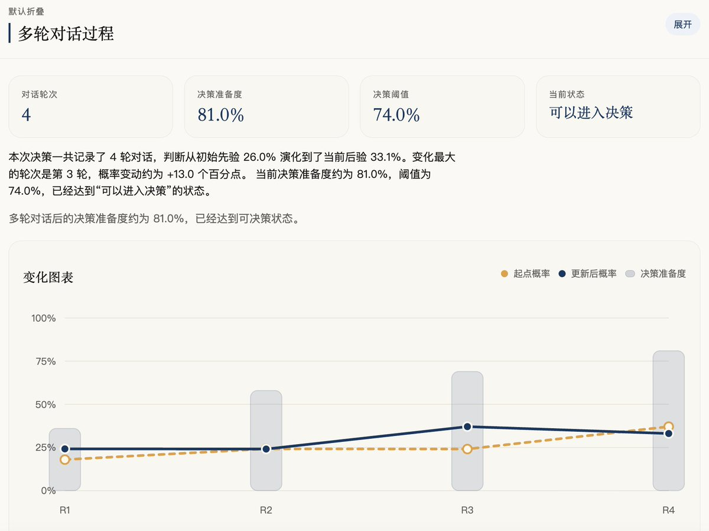
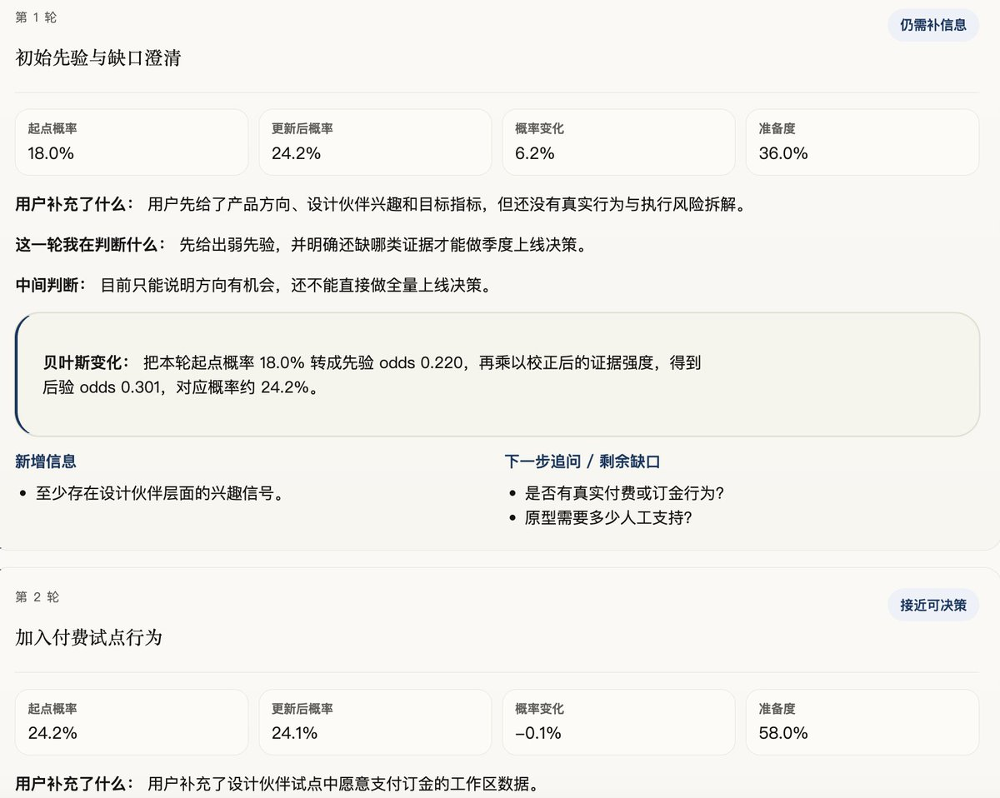
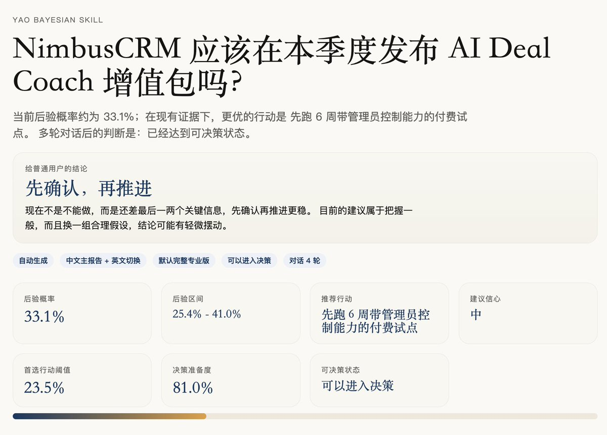
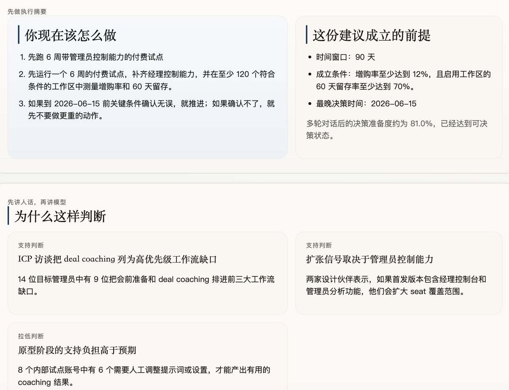

开源一个贝叶斯决策Skill

它不是简单帮你算一个贝叶斯公式，而是帮你把一个复杂决策，拆成一个可以持续更新判断的过程 
这个Skill，一开始会先基于当前信息形成初始判断，然后AI通过引导用户多轮对话，不断补充变量、更新后验，并记录每一轮判断为什么变化 
最后会输出一份Markdown+双语HTML决策报告，包含沟通过程、过程的判断变化和行动建议

适合产品、增长、商业、创业这类判断，也适合旅行、搬家、职业选择这类个人决策 
本质上，它解决的是：当信息不完整、风险不确定时，怎么更理性地判断“这件事到底该不该做”，以及如何提升决策的质量 

GitHub地址：
[github.com/yaojingang/yao…](https://github.com/yaojingang/yao-open-skills/tree/main/skills/yao-bayesian-skill)

配图为示例报告

### 🖼️ Attached Media

## 💬 Replies

### 1 @jameszz343698 (GlowJames 追光🐬)

*Sat Apr 25 08:44:17 +0000 2026*

现实世界的产品/创业决策，本质往往是极其主观的先验 + 难以量化的收益和损失，真正严格做贝叶斯的人都知道，很多时候「概率」数字本身是拍的。这个 Skill 可能更多是帮你「规范地拍」，而不是 magically 给出客观概率。

如果实现只是 用自然语言说：你的信心从 60% 变成 70% ，而没有背后清晰的概率模型和假设，那贝叶斯更多只是叙事包装——有流程价值，但统计学意义上的贝叶斯含量未必高。

### 2 @yaojingang (姚金刚) (Author)

*Sat Apr 25 09:25:39 +0000 2026*

@jameszz343698 “规范地拍”其实有时候也会在这个过程中，让人的理性值增加

### 3 @edenyanglawyer (Eden 杨燕亭 律师)

*Sat Apr 25 08:46:07 +0000 2026*

@yaojingang 感谢。感觉还可以把万维钢老师现在讲的各个模型都弄个skill，试试效果。这样对各个模型的使用会更直观。

### 4 @yaojingang (姚金刚) (Author)

*Sat Apr 25 09:24:57 +0000 2026*

@edenyanglawyer 哈哈，你可以试试～

### 5 @Potatoloogs (土豆本豆)

*Sun Apr 26 04:43:20 +0000 2026*

@yaojingang 好思路啊。本质上是把拍脑袋得来的决策变成了一个可回溯的判断链。

我比较好奇一个设计选择：先验概率的初始值是让用户自己估，还是Skill会给一个参考锚点？这个起点对后续更新影响还挺大的。

### 6 @yaojingang (姚金刚) (Author)

*Sun Apr 26 06:36:08 +0000 2026*

Skill会给参考锚点，skill里也有关于初始先验的一些准则：我可能错，所以我要留余地
先看基础率，再看个别故事。
证据有强弱，不能一视同仁
越惊人的结论，需要越强的证据
一两个案例不能代表整体
看人和事，要看激励结构
先避免毁灭性风险，再追求收益
该出现的证据没出现，本身就是信息
相关只是线索，因果需要更多证明
极端表现常会向平均水平回归
证据相当时，优先考虑更简单的解释
不确定时，优先保留可逆选择
人的行为常有处境逻辑，先理解再判断
信念要有置信度，不要只有信和不信
反面证据最能提升判断质量
刚发生和很生动的事，会被大脑高估
任何规则和选择都可能有副作用
平均规律重要，个体差异也重要
善意起步，逐步验证，分级信任
先验会过期，要定期校准

### 7 @DangcingAI (Dangcing Chan)

*Sat Apr 25 15:42:29 +0000 2026*

@yaojingang 太酷了！贝叶斯决策流程化，还带对话式迭代更新——这不就是人脑+AI协同决策的雏形嘛？我做DangcingAI时也总在想，怎么让AI不只是输出结果，而是陪用户一起思考过程…你这个skill有demo吗？

### 8 @yaojingang (姚金刚) (Author)

*Sun Apr 26 22:26:27 +0000 2026*

@DangcingAI 有三个示例报告，在仓库里

### 9 @ApplyWiseAi (Samian)

*Sun Apr 26 03:31:18 +0000 2026*

@yaojingang continuous judgment updates in decisions? how do you weight new priors

### 10 @yaojingang (姚金刚) (Author)

*Sun Apr 26 22:27:18 +0000 2026*

@ApplyWiseAi 为了提升先验的相对客观性，又设计了20条先验准则

### 11 @huoshan007 (火山哥🕊️)

*Sun Apr 26 00:34:18 +0000 2026*

@yaojingang 贝叶斯公式不难，难的是怎么把自己那些拍脑袋的直觉，一笔笔量化明白。这活儿不漂亮，但真有用。

### 12 @Saccc_c (Sac)

*Sun Apr 26 00:15:24 +0000 2026*

@yaojingang 这个牛逼

### 13 @BaoZiDaDa010 (Jackie | Game严厉的父亲)

*Sat Apr 25 08:50:09 +0000 2026*

@yaojingang 如果那这个去polymarket做预测判断 会不会靠谱呢？

### 14 @yangsir_ai (Evan YanG)

*Sat Apr 25 05:19:13 +0000 2026*

@yaojingang [skills.yangsir.net/skill/gh-yao-b…](https://skills.yangsir.net/skill/gh-yao-bayesian-skill) 收录了🥰

### 15 @Keji715 (柯基是只猫)

*Sat Apr 25 12:26:35 +0000 2026*

@yaojingang 日常决策最难的部分可能不是算概率，而是很多人根本不知道自己缺了哪些关键变量，AI引导提问这步是关键

### 16 @hiheimu (赖叔 | LaiShu.ai)

*Sat Apr 25 14:31:02 +0000 2026*

@yaojingang 这套技能最大的价值感觉在于交流的过程
让你重新梳理自己的思想，将一些隐形的内容显性化

至于结果是否能完全信赖，得多试试

### 17 @lilong (重粒子 baryon)

*Sat Apr 25 10:52:18 +0000 2026*

@yaojingang 强力点赞👍，贝叶斯概率和微积分都是教人在变化中看世界

### 18 @zjjsas007 (不是NEO)

*Sat Apr 25 10:08:59 +0000 2026*

@yaojingang 看看后验概率怎么取？这个最关键

### 19 @weiyangxin (Jinyu)

*Sat Apr 25 22:56:47 +0000 2026*

@yaojingang 这个Skill将数学公式产品化流程，极大降低了使用门槛。但在真实创业决策里，先验概率往往是主观的“拍脑袋”，AI引导更新后验会不会反而放大决策者或者拍板人的认知偏差？

### 20 @intoaiworld (Americano Estate)

*Sat Apr 25 14:30:21 +0000 2026*

@yaojingang 学起来

### 21 @robertmaurerfan (Jackie)

*Sat Apr 25 07:07:03 +0000 2026*

@yaojingang 谢谢你啊 最近对这个llm 贝叶斯方法很感兴趣

### 22 @BluceVon61916 (von bluce)

*Sun Apr 26 06:34:44 +0000 2026*

@yaojingang 这很好啊，需要学起来

### 23 @skyerK12 (Mr.K)

*Mon May 25 08:50:36 +0000 2026*

@yaojingang This is worth watching. The gap between the demo and production reality is where the actual learning happens.

### 24 @skyerK12 (Mr.K)

*Sun May 24 08:32:52 +0000 2026*

@yaojingang Interesting framing. Most people focus on what AI can do; the harder question is what it should not do.

### 25 @skyerK12 (Mr.K)

*Sat May 23 06:29:10 +0000 2026*

@yaojingang Bayesian thinking as a dialogue structure is smart. Most decision frameworks fail because they are one-shot. Making it iterative — updating priors through conversation — mirrors how actual judgment works in practice.

### 26 @daipm123 (jimmy)

*Sat Apr 25 18:12:51 +0000 2026*

@yaojingang 感谢

### 27 @zjjsas007 (不是NEO)

*Sat Apr 25 10:08:20 +0000 2026*

@yaojingang 真不错，正缺这个呢，感谢！

### 28 @LewisWeldtech (That AI Guy)

*Sat Apr 25 11:16:28 +0000 2026*

@yaojingang [x.com/i/status/20474…](https://x.com/i/status/2047495238290403776)

### 29 @ptstsd (ptstsd)

*Sat Apr 25 15:24:01 +0000 2026*

@yaojingang 现实世界决策我觉得反而更适合用逻辑回归构建非0即1的二元世界，实践中往往没有那么多既要又要的机会，按贝叶斯公式来，如果 prior、likehood、evidence 都可以清晰的话用不用贝叶斯算一下 posterior 都意义不大

### 30 @ivangranito (Ivan Granito)

*Sun Apr 26 10:30:12 +0000 2026*

@yaojingang M

### 31 @Nicwix (Nicwix)

*Sat Apr 25 21:24:43 +0000 2026*

@yaojingang 🙏🏼

### 32 @yzg75001 (CryptoClaw)

*Sun Apr 26 13:43:36 +0000 2026*

@yaojingang 这是个好东西，有效避免拍脑袋决策

### 33 @ThingNoChange (糕点大王)

*Sat Apr 25 09:13:29 +0000 2026*

@yaojingang 1

