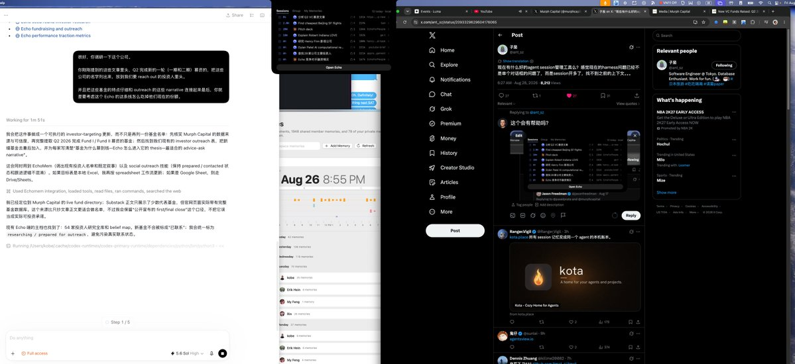

现在有什么好的agent session管理工具么？感觉现在的harness问题已经不是单个对话框的问题了，而是session开多了，找不到之前的上下文。。。

## 💬 Replies

### 1 @spectredxxx (spectredxxx)

*Sat Aug 29 04:16:03 +0000 2026*

@ant\_sz 看评论区发现这样的项目还真的多，有时间也试试我的…

[github.com/sxwedo/mena](https://github.com/sxwedo/mena)

### 2 @QuantumTransf (Yuu💖)

*Fri Aug 28 15:59:27 +0000 2026*

@ant\_sz 试试 obelisk\~
想看看 obelisk 能做什么的话，看一下 [obelisk.antinomie.org](https://obelisk.antinomie.org) 
项目的话在 [github.com/tommy0103/obel…](https://github.com/tommy0103/obelisk)，是完全开源的

### 3 @kobe_acc (kobe)

*Sat Aug 29 00:19:55 +0000 2026*

@ant\_sz 这个会有帮助吗？ 

### 4 @ant_sz (子茄) (Author)

*Sun Aug 30 13:35:21 +0000 2026*

@kobe\_acc 这个是什么app呀

### 5 @wey_gu (Wey Gu 古思为)

*Fri Aug 28 14:33:16 +0000 2026*

@ant\_sz 老师，请试试 @NowledgeMem 🫡
我们一直专注在管理维护好个人的上下文，会自主维持记忆健康，也能渐进式披露你的 session 信息被所有 ai 共享

### 6 @supezen (ZEN)

*Sat Aug 29 00:37:13 +0000 2026*

@ant\_sz 试试[todos.dev](https://todos.dev)
只要一个对话，没有搜索的烦扰

### 7 @iamcheyan (徹言)

*Fri Aug 28 14:30:12 +0000 2026*

@ant\_sz 同问。

### 8 @Ranger_Vigil (Ranger.Vigil)

*Fri Aug 28 20:52:53 +0000 2026*

@ant\_sz [kota.place](https://kota.place) 所有 session 记忆变成同一个 agent 的本机账本。

### 9 @cheerchen37 (Lu Hang / 陳)

*Sat Aug 29 00:00:53 +0000 2026*

@ant\_sz 这个东西写起来很快的。我也写了一个。

[github.com/CheerChen/sess…](https://github.com/CheerChen/session-index-viewer)

### 10 @bao_xiao78791 (xiaobao)

*Fri Aug 28 14:48:59 +0000 2026*

@ant\_sz 也可以试试evermind的everme，汇集并管理你在不同 Agent 和跨平台中的个人记忆、偏好与数字画像。[evermind.ai/everme](https://evermind.ai/everme)

### 11 @Necokeine (慧音-知识和历史的半兽)

*Fri Aug 28 13:43:41 +0000 2026*

@ant\_sz 很多 我自己做了个runner manager，但后面还是常用codex。推荐的有raft，multica，lody， herdr, 都试图在做这个事情。
但说真的，我觉得都不太够好用，我想自己做一个。

### 12 @shrik1645608 (shrik)

*Sat Aug 29 01:01:34 +0000 2026*

@ant\_sz [github.com/danielwanwx/am…](https://github.com/danielwanwx/am-memory)

### 13 @killme20082 (Dennis Zhuang)

*Fri Aug 28 17:03:27 +0000 2026*

@ant\_sz 自荐下 TMA1 [github.com/tma1-ai/tma1](https://github.com/tma1-ai/tma1)

完全保存在本地，可以通过 skill 来查询历史或者其他 Agent 的 session。

### 14 @sunlei (鬼仔)

*Fri Aug 28 15:14:11 +0000 2026*

@ant\_sz [agentsview.io](https://www.agentsview.io/)

### 15 @marovole (marovole)

*Fri Aug 28 15:02:32 +0000 2026*

@ant\_sz 最好的是 Orca

### 16 @PixelMaLiang (数字马良)

*Sat Aug 29 00:48:57 +0000 2026*

@ant\_sz 佬相信我，试一试 Firstmate + Herdr

### 17 @xingkaixin (XingKaiXin)

*Fri Aug 28 15:06:25 +0000 2026*

@ant\_sz [github.com/xingkaixin/cod…](https://github.com/xingkaixin/codesesh)

### 18 @leon7hao (leon7hao)

*Sat Aug 29 13:32:38 +0000 2026*

@ant\_sz 试试 [lody.ai](https://lody.ai) ，所有的 coding agent 记录都可以导入，可以全局搜索，可以让  agent 搜索。可以让 agent 管理会话。

### 19 @wangxiyu191 (Wxy)

*Fri Aug 28 14:48:17 +0000 2026*

@ant\_sz 只是为了方便找session的话安利[github.com/siteboon/claud…](https://github.com/siteboon/claudecodeui) 简单好用

### 20 @FoxSnowing (SnowingFox)

*Sat Aug 29 08:43:00 +0000 2026*

@ant\_sz @EntireHQ 试试他们的，绝对好使

### 21 @belliedmonkey (张钊)

*Sat Aug 29 01:28:22 +0000 2026*

@ant\_sz gbrain啊

### 22 @suohawking (Hawkingrei)

*Sat Aug 29 17:04:55 +0000 2026*

@ant\_sz 茄子哥哥，试一试@NowledgeMem 看看呢？

### 23 @yijunwang0212 (Ejwing)

*Sat Aug 29 12:38:59 +0000 2026*

@ant\_sz 不是session管理，更多是目标管理，[github.com/adeptify/GoalB…](https://github.com/adeptify/GoalBoard)

### 24 @littlesummercat (一本正经的凯文老师)

*Fri Aug 28 14:17:15 +0000 2026*

@ant\_sz ant\_sz /compact

### 25 @wohsj110 (Aiden)

*Sat Aug 29 03:47:24 +0000 2026*

@ant\_sz 推荐 orca

### 26 @MinyiShen (Min-yi Shen)

*Fri Aug 28 22:26:24 +0000 2026*

@ant\_sz 或是那個你用得稱心如意的 session 不知道死到哪裡去了 :(

### 27 @yargee_cs (yargee_cs)

*Fri Aug 28 19:29:57 +0000 2026*

@ant\_sz 所以用gui🥹

### 28 @Luna_Jobs (六分之狗仨儿)

*Sun Aug 30 12:44:44 +0000 2026*

@ant\_sz 用的啥 agent，不用 claude codex 吗，感觉不需要管理啊，都有跨 session 记忆的

### 29 @Eren_Chin (狗含剑)

*Sat Aug 29 12:25:39 +0000 2026*

@ant\_sz dsh插件：session manager

### 30 @ljh0x1d (ljh)

*Sat Aug 29 01:46:25 +0000 2026*

@ant\_sz 不是有个herd吗

### 31 @detailyang (detailyang)

*Fri Aug 28 15:45:32 +0000 2026*

@ant\_sz gui 的侧边栏优势就是这个

### 32 @okenJiang (okJiang)

*Sat Aug 29 02:28:21 +0000 2026*

@ant\_sz 让你的 agent 帮你找那个 session

### 33 @LeonLRedfield (台灣李家宝🇲🇳)

*Fri Aug 28 16:30:13 +0000 2026*

@ant\_sz 爲啥這麽説啊，我從來沒遇到這種情況過

### 34 @Wilf_Lin (Wilf Lin)

*Sat Aug 29 19:04:19 +0000 2026*

@ant\_sz 不管session直接问，然后让他自己去找上下文

### 35 @wind_coo (urain)

*Sat Aug 29 03:13:07 +0000 2026*

@ant\_sz 可以试试看
[github.com/yuluod/AllSess…](https://github.com/yuluod/AllSessions)

