# 📰 从“做过”到“会做”：用 OpenViking 经验记忆构建 Agent 的进化闭环

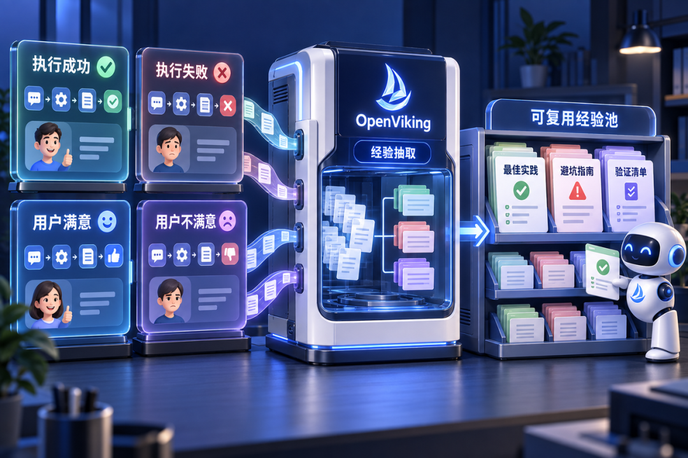

一个 Agent 能调用工具、完成长链路任务，不等于它会从过去的任务中学习。

设想一个常见的开发场景：Agent 刚排查完一次部署失败，检查环境、定位权限、修正配置、重新验证。换一个会话，面对相似问题，它可能又从第一步开始试错。

在客服场景里，Agent 也许偶尔能正确处理换货或改签，但面对相似而不完全相同的请求，依然可能漏掉身份校验、选错工具顺序，或者违反业务政策。企业积累了越来越多的对话、日志和工具调用记录，Agent 却没有因此自然获得更稳定的执行能力。

💡 问题在于：**“做过”不等于“学会”**

**Agent 需要的不是更多记录，而是可复用的经验**

聊天记录能告诉我们上一次说了什么，日志能告诉我们某个工具返回了什么。但当 Agent 再次面对类似任务时，它真正需要的是另一类信息：

* 这类任务应该先确认哪些条件？

* 哪套执行顺序更可靠？

* 哪些路径曾经失败，失败原因是什么？

* 最后应该检查什么，才能确认任务真的完成？

OpenViking 解决这个问题的方式，是为 Agent 建立一类**面向执行过程的长期记忆**：经验记忆。它与记录用户偏好、身份和长期事实的个性化记忆关注点不同，回答的是“Agent 如何把一类任务做成”。

Agent 执行任务时，OpenViking 持续收集目标、消息、工具调用、执行结果和用户反馈，并从中还原完整的执行轨迹。随着同类任务样本不断积累，系统将相似轨迹归类、比较，从中提取反复出现的成功模式、失败模式与边界条件，形成可复用的经验知识。第一条经验可以来自较少的轨迹；后续样本会继续为它提供验证和更新依据。

**OpenViking：为 Agent 管理可以持续复用的上下文**

OpenViking 是一个面向 AI Agent 的开源上下文数据库。它为 Agent 提供统一的上下文空间，用来组织知识、记住用户，并跨会话复用经验。如果把大模型比作 Agent 的“大脑”，那么 OpenViking 更像它可以持续维护的上下文系统：模型可以保持不变，历史记录也无需一次性塞回上下文。Agent 在需要的时候，只加载真正相关的信息。

在经验记忆场景中，OpenViking 主要处理三个对象：

* **Session**：记录一次任务中真实发生的用户消息、Agent 回复、工具调用和工具结果。

* **Trajectory**：从 Session 中还原任务目标、执行路径和最终结果，回答“这件事上次是怎么做的”。

* **Experience**：从相关执行轨迹中提炼可以迁移的方法、检查项和风险边界，回答“下次遇到类似问题应该怎么做”。

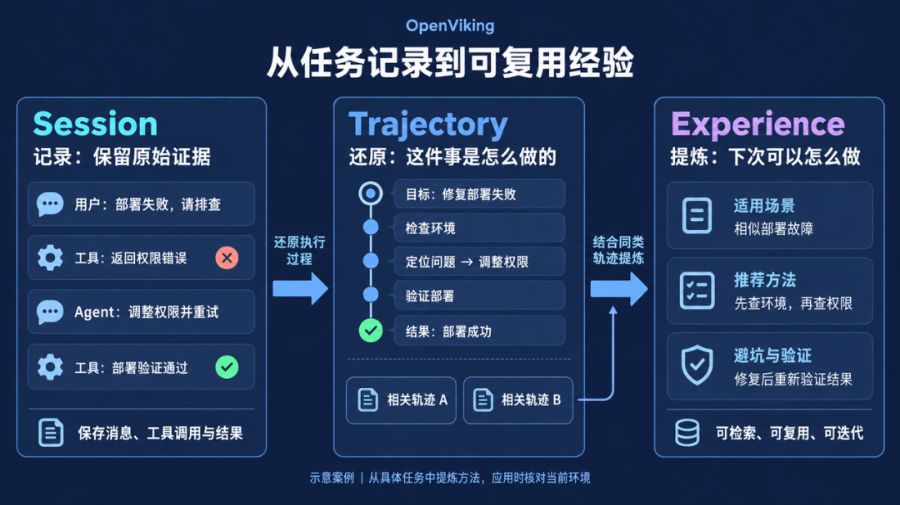

这三个对象构成了一条逐层加工的链路：Session 保留原始证据，Trajectory 还原执行过程，Experience 给出可复用的建议。经验记忆的目标，是把过去转化为下一次任务可以调用、核对和持续迭代的方法。

### 一次完整的进化，是如何发生的？

OpenViking 把 Agent 的经验学习分成两个相互衔接的阶段。

第一阶段发生在任务执行之后。

Agent 持续记录任务过程。当一个目标完成、一次失败被修复、用户给出关键纠错，或者会话即将压缩与结束时，完整任务会被提交。OpenViking 随后归档原始过程，分析目标、步骤、工具结果和最终反馈，形成 Trajectory，并生成或更新 Experience。

这里的关键是保留一个可以判断结果的完整任务片段。只有目标、过程和结果能够对应起来，系统才有机会区分真正有效的方法与偶然成功；单纯增加记录量并不能达到这个目的。

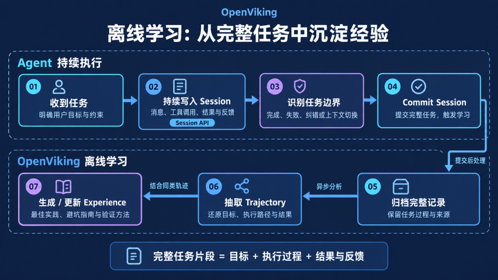

【离线学习：持续记录任务过程，在任务边界提交，并从完整轨迹中生成或更新 Experience】

第二阶段发生在下一次任务开始时。

接入在线检索后，当 Agent 遇到编码、配置、调试、故障恢复或其他多步骤任务，它可以先检索与当前目标相关的经验，读取少量最匹配的原文，再核对环境、前置条件和风险边界。确认适用后，才把其中的步骤和检查项用于当前执行。

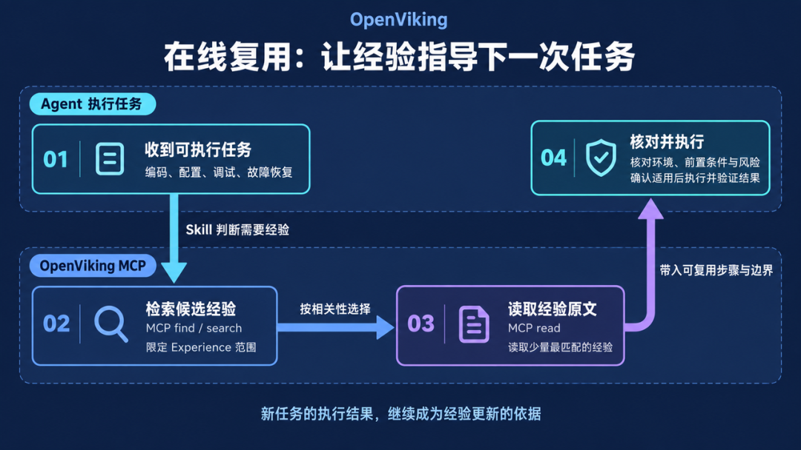

【在线复用：检索相关 Experience、读取原文、核对适用条件，再用于当前任务】

新的执行结果又会成为下一轮经验更新的证据。于是，一个闭环形成了：

**执行任务 → 记录过程 → 提炼经验 → 相似任务召回 → 核对并应用 → 用新结果继续更新。**

### 从一个真实任务看经验记忆的工作方式

用一个真实任务场景的还原案例，看看经验记忆如何工作：Agent 要结合 Excel 经营数据、客户反馈纪要和指定模板，制作一份季度复盘 PPT。首次执行没有正确读出毛利率的公式计算值，图表生成受阻；用户提示后，Agent 调整读取方式、校验指标，重新生成并完成验收。

【首次受阻与修复 → 轨迹和经验沉淀 → 新任务检索与复用】

这段过程沉淀出了三类可复用方法：如何读对复杂表格、如何核对多源事实，以及如何按模板生成并验收。换成一个新的新品上市复盘任务，Agent 先检索并读取这些经验，再处理本次附件，一轮执行达到要求。它复用了检查方法，所有数字和结论仍来自新任务。

### 效果如何？看看评测结果

经验记忆是否有效，最终要落到任务结果上。Agent 引用了一段记忆，并不能证明它已经获得了更稳定的执行能力。

为了验证 OpenViking 带来的实际变化，我们观察它在公开评测中是否能真正贡献任务的一次成功率。τ²-bench 提供了零售、航空等多轮对话任务执行的业务场景：Agent 需要理解需求、遵守领域政策、读取动态状态、调用工具，并在与用户的持续沟通中推进任务。在这里，我们先使用训练集执行多个零售、航空领域的对话任务，后台沉淀这些任务的经验记忆，在测试阶段使用测试题集，agent 执行时先检索题目相关经验，注入上下文后开始执行，来看历史经验是否可复用于同场景、同类型的新任务。

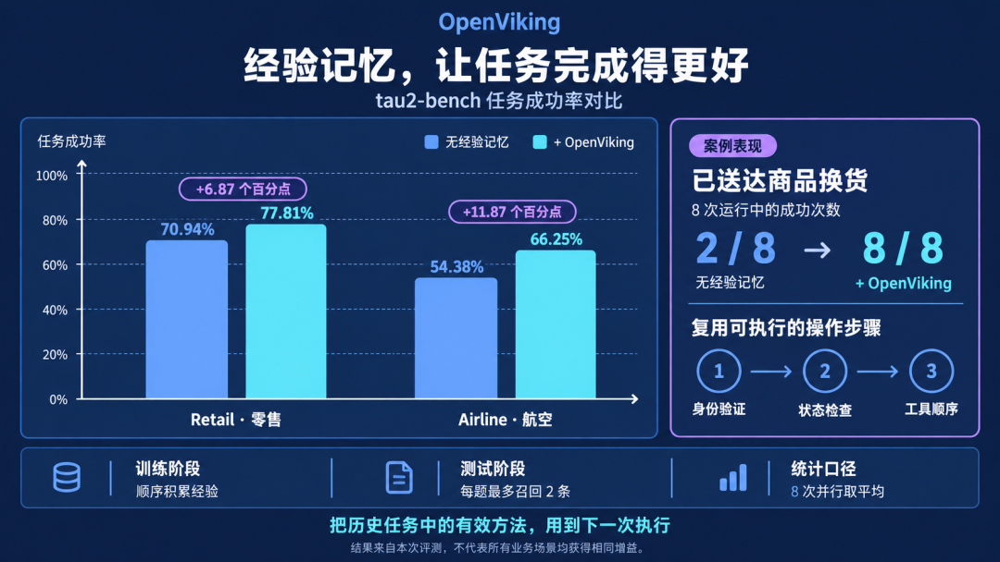

OpenViking Context 的评测结果中，相较于相同大模型不使用经验记忆的基线，引入经验记忆后：

* Retail 测试集上，任务成功率从 **70.94%** 提升到 **77.81%**，提升 **6.87** 个百分点；

* Airline 测试集上，任务成功率从 **54.38%** 提升到 **66.25%**，提升 **11.87** 个百分点。

在一项“已送达商品换货”的单题测试中，没有经验时，8 次运行只成功了 2 次；召回包含身份验证、状态检查和工具顺序的流程经验后，8 次全部成功。

**从内部提效到客户服务，经验如何发挥作用？**

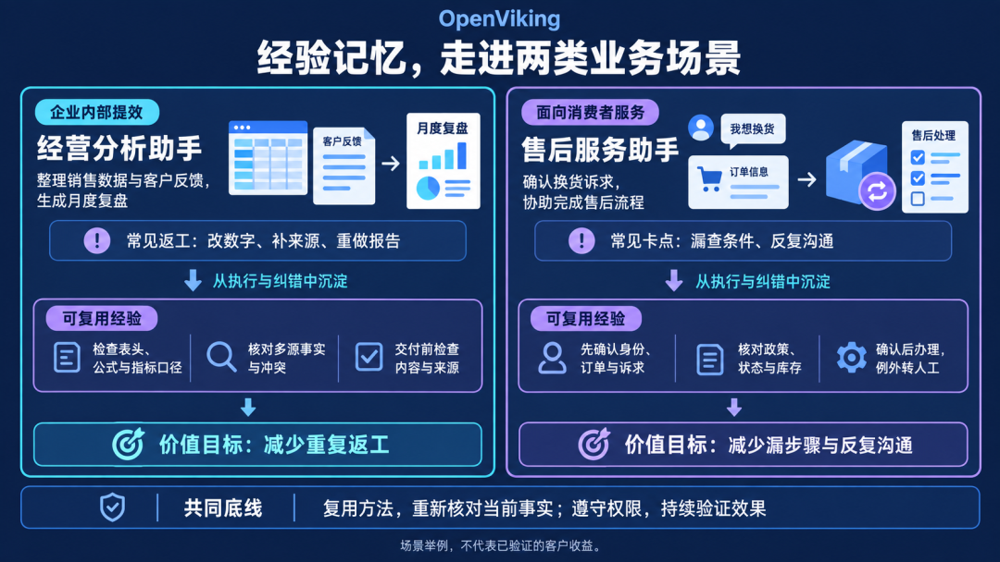

### 企业内部提效：让经营分析助手少返工

经营分析助手可以帮助业务团队整理销售数据、汇总客户反馈，再按指定模板生成月度复盘。员工希望拿到的是一份数字可信、结论有依据的报告，而不是一份还需要逐项纠错的初稿。

前面的复盘案例展示了经验可以积累什么：遇到公式值缺失时如何回查，遇到多源冲突时如何确认事实，交付前需要检查哪些内容。随着类似任务持续执行，这些成功做法和纠错记录可以沉淀为经营分析助手的检查方法。

下一次制作月报或新品复盘时，Agent 先检索适用经验，再读取本次材料、核对口径并完成验收。目标是减少反复改数、补来源和重做报告，让员工把更多时间用在判断和决策上。

**面向消费者服务：让售后助手把事情办完整**

以电商售后助手处理换货为例，消费者需要的是顺利完成换货，不只是得到一段政策解释。Agent 需要确认身份和订单，了解换货诉求，核对商品状态、当前政策与库存，在获得必要确认后办理，并告知后续安排。

经验记忆可以从已解决、失败和人工纠正的服务过程中，提炼出哪些信息需要先问、哪些条件必须检查、遇到例外何时交给人工。后续遇到相似诉求，Agent 可以参考这些方法，结合当前订单执行，减少漏步骤和反复沟通。

### 接入不必从复杂改造开始

现在开通 OpenViking Context 服务，可马上使用经验记忆来实现 Agent 的进化。

开通 OpenViking Context 企业版或个人版，打开 Agent 进化：

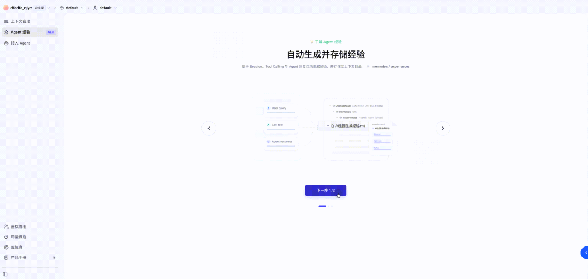

如果企业拥有自研 Agent 服务，可以在任务运行过程中持续写入完整过程，在可靠的任务边界提交，再通过 OpenViking MCP 与 Experience Skill，让 Agent 在执行高价值任务前检索和读取经验。

如果使用 Codex、Claude Code、OpenClaw、Hermes 等消费级 Agent 产品，可直接集成 OpenViking 官方 Plugin 利用宿主的生命周期能力，自动完成消息捕获、任务提交和经验召回，减少对业务代码的改造。

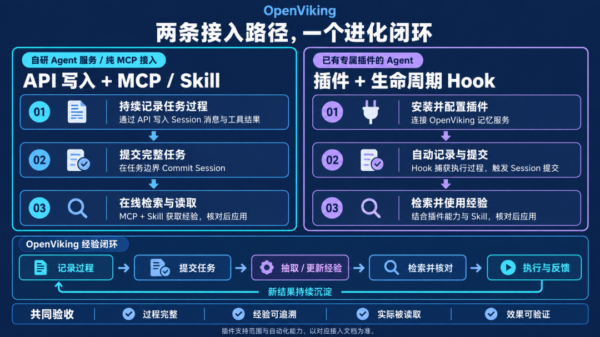

接入 Agent 后可查看生成的经验记忆列表、溯源记忆的 Session 来源并查看经验记忆被召回、注入的效果分布。

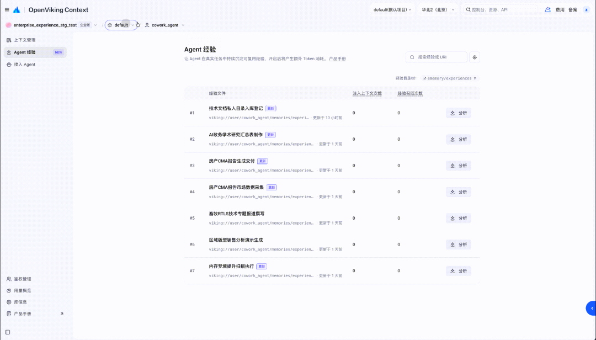

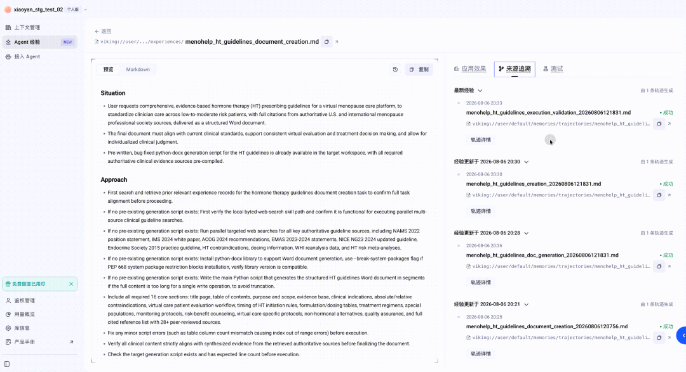

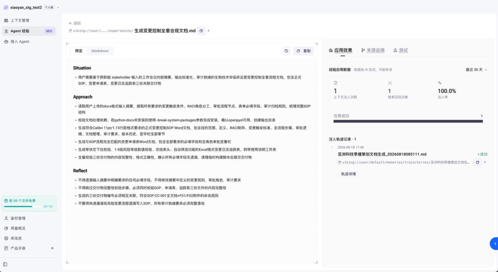

左右滑动查看更多精彩内容

### 让每一次任务，成为下一次任务的起点

更强的模型、更长的上下文和更完整的 SOP，仍然重要。经验记忆并不替代它们。

它补上的，是 Agent 系统里长期缺失的一环：让真实任务中产生的执行过程，不再随着会话结束而失去价值。当每一次成功、失败和纠错都能成为下一次任务的起点，Agent 才真正开始从“完成任务”走向“积累能力”。

### 加入我们，共建 Agent 上下文的未来！

🚀 **上手试用**：访问 https://www.volcengine.com/product/openviking-service，无需自行部署，即可将常用 Agent 接入 OpenViking，体验上下文的持续积累与跨任务复用。

🌟 **给个 Star**：访问我们的 GitHub 仓库 https://github.com/volcengine/OpenViking，为我们点亮一颗 Star，你的 Star 是我们前进的最大动力！

💬 **加入社区**：扫描下方飞书二维码，加入官方交流群，与顶尖开发者一起探讨 Agent 上下文的无限可能。

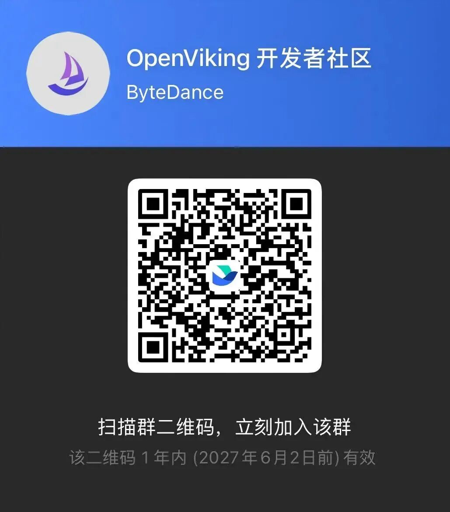

