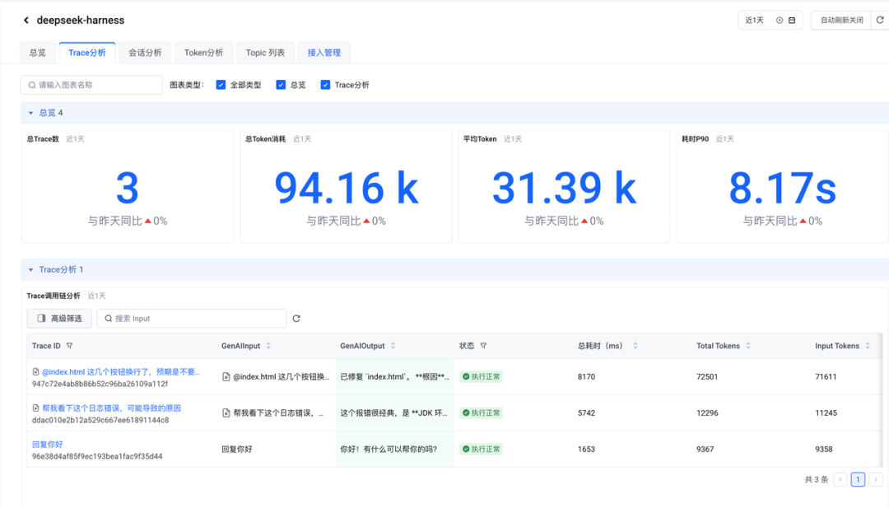
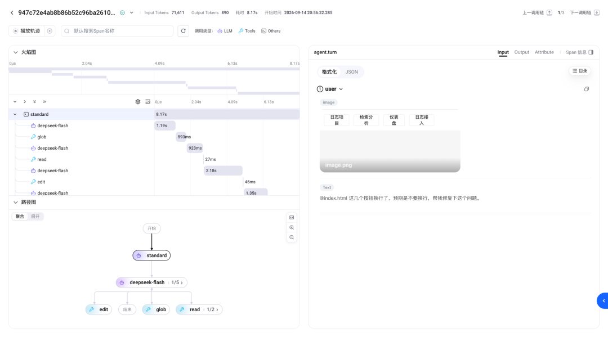
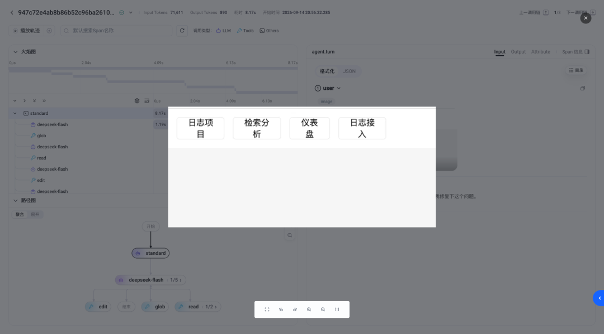
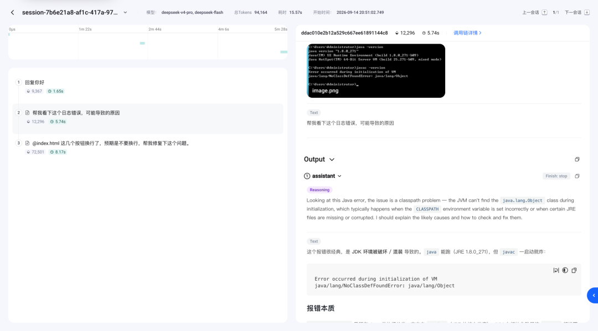
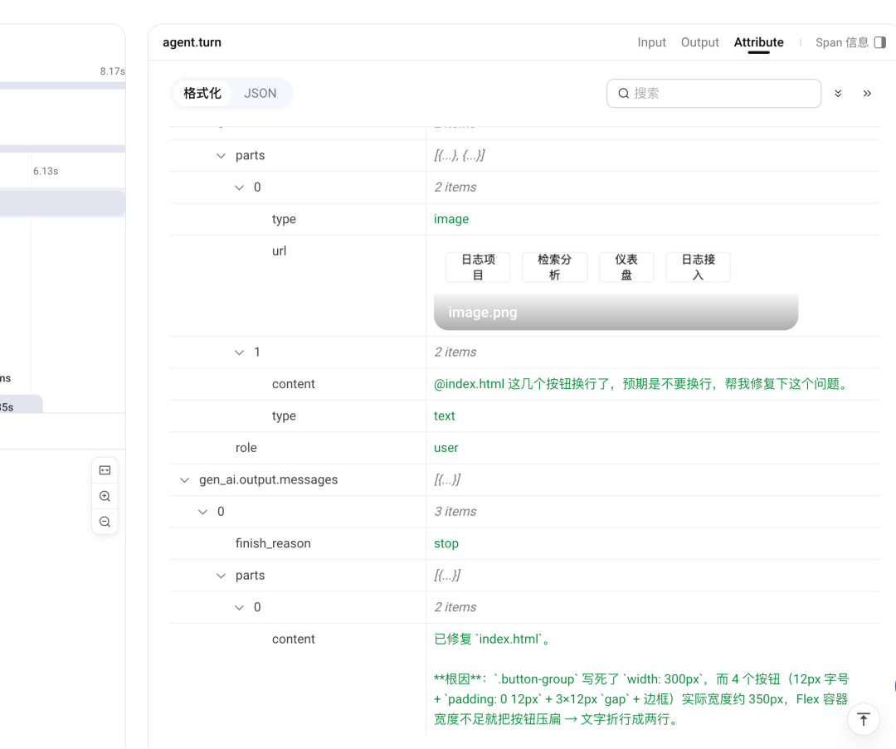
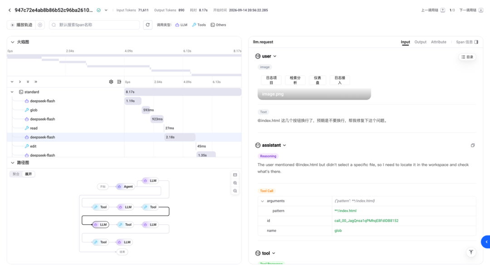
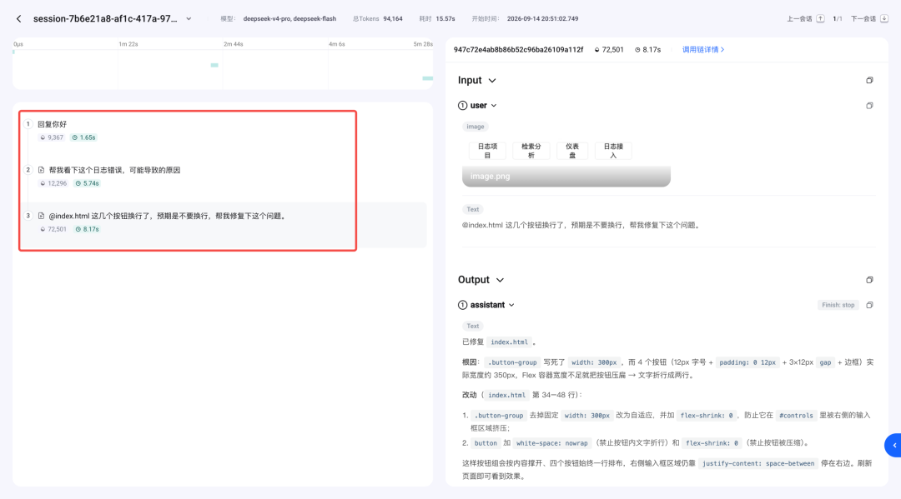
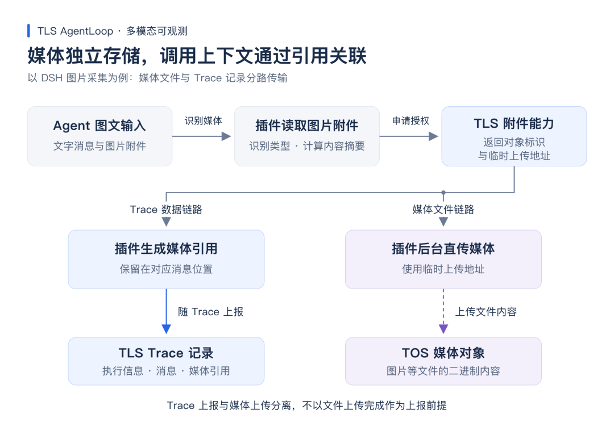

# 📰 日志服务 TLS AgentLoop：让多模态调用清晰可见

给 Agent 一张页面截图，让它修复布局；上传一张报错图片，让它判断原因。在多模态交互中，图片已不再是“补充材料”，而是模型理解任务的一部分。

问题也随之更具体：当 Agent 的回答不符合预期，开发者如何确认它到底看到了什么？调用链显示成功，耗时和 Token 消耗也正常，但排查时若只能看到附件 ID 或一段不可读的编码内容，就很难判断偏差究竟发生在输入、模型理解，还是后续工具执行环节。

火山引擎日志服务 TLS AgentLoop 在会话与调用链观测的基础上，进一步支持多模态内容展示。开发者可在对应的消息和调用节点中直接查看图片，并把图片与提示词、模型输出、工具结果放在同一条链路中分析。

💡 **多模态可观测的价值，不仅在于“日志中能看图”，还在于让媒体内容成为可查看、可关联的调用上下文。**

本文以 DSH（DeepSeek Harness）的图片采集场景为例，介绍 TLS AgentLoop 如何把媒体内容接回 Session、Trace 和 Span，让一次图文请求从“执行过”变成“看得清”。

## 一、为什么只看执行记录还不够

传统调用链能回答“任务如何执行”：哪些步骤被触发、每个阶段耗时多少、错误出现在哪个节点。对纯文本任务来说，这通常已经足够定位大部分问题。

多模态任务还要回答另一个问题：这次执行是基于什么内容发生的。

以“根据截图修复页面”为例，模型调用和代码修改都可能显示成功，但页面效果仍不符合预期。此时开发者需要核对上传的截图是否正确、关键区域是否清晰、提示词是否准确描述预期，以及模型输出和工具修改是否对应截图中的问题。

如果日志中只有附件 ID，就要另找原始文件；如果图片独立存放，又难以对应具体会话和轮次；如果把大段 Base64 写入日志，记录虽完整，但阅读和检索效率低，对业务方来说，还存在数据完整性（Base64 可能被截断）和成本问题：

1. 数据完整性：多模态文件以 Base64 混入日志 / Trace 数据，可能导致一条日志或 Trace Span 超长被截断，造成日志 / Trace 数据不完整，影响观测数据的可用性。特别是视频、音频等多模态文件。

2. 成本较高：多模态内容以 Base64 混入 Trace Span / 日志中，作为通用 Trace / 日志字段进行索引和存储，成本较高。

## 1. 使用低效：多模态文件的阅读、管理与 Trace / 日志的关联效率低。

## 二、媒体回到会话和调用链

TLS AgentLoop 沿用已有的 Session、Trace 和 Span 结构：Session 串联多轮会话，Trace 表示一次请求或一轮任务，Span 记录模型调用、工具执行等具体阶段。多模态内容出现在对应的消息和调用节点中，而不是被放进孤立的附件列表。

### 列表发现：先找到包含媒体的任务

在 Trace、Session 列表中，包含多模态内容输入的记录会显示媒体标识。开发者可结合状态、耗时、Token 等已有信息，快速筛出需要进一步检查的记录。



进入详情后，左侧调用树会继续标识包含媒体的 Span 或 Trace。即使一次任务包含多轮交互和多个执行步骤，也能沿着原有浏览路径定位到相关内容。



### 原位预览：把图片放回消息上下文

在支持输入、输出的格式化视图中，图片可直接预览并按需放大；对于已提供且受支持的媒体数据场景，前端也支持音频、视频播放。

文字与媒体保留在同一条消息上下文中，开发者可对照提示词、模型回答和执行信息阅读，不必在截图、日志和调用链之间来回拼接。



### 会话复盘：看清问题如何演变

在 Session 详情中，多轮任务可连续查看各轮输入、输出，再进入关联的 Trace 检查执行细节。媒体属于哪一轮交互、与哪段文字对应，都能在会话中保留下来。

对团队协作来说，这也减少了反复转发截图、粘贴日志、补充背景的时间成本。大家围绕同一条会话和调用链讨论，信息口径更容易对齐。



## 三、一次图文请求的排查路径

当一条包含图片的 Agent 任务结果不符合预期时，可以沿着“输入—执行—反馈”三个步骤排查。

### 核对输入

展开相关模型调用，在输入区域直接查看采集的截图及文字要求。重点看三件事：截图是否为预期图片；关键区域是否清晰；提示词是否明确说明期望结果。

若输入本身有缺失或歧义，应优先检查输入组织和提示词，而不是将问题直接归因于模型能力。



### 对照执行

若输入符合预期，再检查模型输出、工具参数和工具结果。模型给出的修改方向是否对应截图中的问题？工具修改的文件是否正确？执行过程中是否出现异常？后续调用是否根据工具结果继续处理？

图片提供任务背景，Trace 提供执行步骤，两者结合，排查才不会只停留在“结果不对”的判断上。



### 追踪反馈

对于需要多次补充要求的任务，可回到 Session 视图，查看用户后续反馈是否出现在对应轮次，模型是否据此调整回答。

这里要保留一个判断边界：某条记录未显示图片，不等于模型一定没有收到图片。媒体是否可见，还受采集开关、插件覆盖范围、上传结果、访问权限和网络条件影响。



## 四、背后的实现思路

不同团队的多模态数据来源并不相同：

* 来自 Agent 运行时附件；

* 已存放在客户自有 TOS 桶中的媒体文件；

* 直接使用公开可访问的图片、音频或视频链接。

TLS AgentLoop 的多模态观测能力围绕这些场景提供接入方式，让媒体内容能回到对应的 Session、Trace 和 Span 中，成为可查看、可关联的调用上下文。



### TLS 插件内部多模态能力

对于 Agent 运行过程中产生或接收的本地附件，TLS 插件 / SDK 可在采集阶段识别多模态内容，并完成媒体读取、上传授权、对象存储和引用上报。

以 DSH 图片采集为例，插件会识别模型输入中的图片附件，读取文件内容，并获取 MIME 类型、文件大小、内容摘要等信息。随后，插件通过 TLS 附件能力申请上传地址，取得对象存储 TOS 对象标识和临时上传地址，再将图片文件上传至 TOS。Trace 上报时，插件不会把大段 Base64 写入日志，而是在原消息位置写入媒体引用。引用包含对象位置、媒体类型、大小、摘要等元数据，TLS 负责记录 Trace、消息结构和媒体引用，TOS 负责保存图片等二进制内容。

这种方式适合希望由采集插件或 SDK 托管媒体处理链路的客户。

接入后，开发者可在 AgentLoop 的会话和调用链中直接查看图片，并对照提示词、模型输出和工具结果排查问题。

### 将已有 TOS 私有多模态资源进行观测关联

如果客户已将图片、音频、视频等多模态资源存储在自有 TOS 中，TLS AgentLoop 也支持将这些资源与调用过程关联，无需业务侧重复上传文件。

在这种模式下，业务系统或采集 SDK 可在上报 Trace 时携带媒体对象的引用信息，例如 TOS 对象位置、媒体类型、文件大小、内容摘要等。TLS 保存的是“这条消息关联了哪一个媒体对象”，而非媒体文件本身。

当开发者在 AgentLoop 中查看会话或 Trace 详情时，前端会根据媒体引用申请临时访问地址，再从 TOS 读取对应内容并完成预览。这样既保留了客户对私有媒体资源的存储与权限管理方式，也让媒体内容能够出现在对应的调用上下文中。

这种方式适合已有多模态资产管理体系的客户。例如，图片、录音、视频片段统一存放在私有 TOS 桶中，客户只需要将这些资源与 Agent 调用记录关联，即可用于问题排查、案例沉淀和后续评测分析。

对于这类场景，接入前需要确认资源访问权限、临时访问地址的生成方式、保留周期和跨系统权限边界。Trace 中记录了可追溯的媒体引用，不会直接保存长期有效的签名地址。

### 兼容 GenAI 标准多媒体消息

除 TLS 插件自定义引用外，AgentLoop 前端也支持识别 GenAI 规范的多模态消息。

对于已携带公开可访问媒体地址的数据，可根据媒体 part 的 type，结合 modality、mime\_type 等字段直接展示。音频、视频、PDF 或多文件场景，可参考 OpenTelemetry GenAI 多模态消息规范与示例（https://github.com/open-telemetry/semantic-conventions-genai/blob/main/docs/gen-ai/non-normative/examples-llm-calls.md#multimodal-inputs-example）组织数据：每个文件对应一个 parts 元素，分别填写承载方式、媒体类型和文件地址。TLS 前端按支持范围提供图片预览、音视频播放或文件打开入口。

Attributes.gen\_ai.input.messages 的内容数据结构如下：

```

[
  {
    "role": "user",
    "parts": [
      {
        "type": "text",
        "content": "请结合这段录音、视频和 PDF，总结主要内容。"
      },
      {
        "type": "uri",
        "modality": "audio",
        "mime_type": "audio/mpeg",
        "uri": "https://example.com/recording.mp3"
      },
      {
        "type": "uri",
        "modality": "video",
        "mime_type": "video/mp4",
        "uri": "https://example.com/demo.mp4"
      },
      {
        "type": "uri",
        "modality": "document",
        "mime_type": "application/pdf",
        "uri": "https://example.com/report.pdf"
      }
    ]
  }
]

```

### 三种方式如何选择

* 如果媒体文件来自 Agent 运行时附件，优先使用 TLS 插件 / SDK 完成解析、上传和引用上报。

* 如果客户已有 TOS 私有资源，优先通过对象引用完成观测关联。

* 如果媒体内容已有公开可访问链接，可直接使用 GenAI 标准多媒体消息完成展示。

三种方式对应不同的数据来源，但目标一致：让图片、音频、视频等多模态内容回到具体的消息和调用节点中。

## 五、如何快速验证接入

接入时，从一条简单、可重复的图文请求开始，先跑通链路，再扩展到更复杂的业务流程。

1. **配置采集**：安装支持对应媒体场景的 AgentLoop 采集插件，配置 TLS 地域、采集目标和鉴权信息，并按需开启内容采集。

2. **发起请求**：准备一条包含图片的任务。任务结束后，在 Session 与 Trace 中核对媒体标识、图片预览、提示词和相关调用记录。

1. **检查异常**：图片未显示时，结合插件日志检查附件读取、上传授权和文件上传结果，再确认访问权限和网络条件。

图片、提示词和工具结果都可能包含业务数据。正式接入前，应先明确允许采集的内容、可访问的人员和保留周期，并统筹 Trace 与媒体文件的保存策略。

## 六、从看见过程到理解上下文

随着 Agent 的输入不再只有文字，TLS AgentLoop 的多模态方案把媒体内容放回具体的执行上下文：既能查看任务中的图片，也能对照提示词、模型输出和工具结果理解处理过程。

对开发者来说，这意味着排查时多了一份直接可查的内容依据；对团队协作来说，这意味着问题讨论可围绕同一条会话和调用链开展。

在 AgentLoop 已有的数据回流与评测能力之上，这些图文任务记录也可以成为问题案例整理和样本建设的起点。后续多模态样本如何回流与评测，可结合具体数据格式和评估器支持范围进一步接入。

**多模态可观测的终点，不是多展示一张图片，而是让开发者在知道“执行了什么”之外，还能看清“这些执行基于什么内容”。**

**阅读原文**，查看火山引擎 TLS AgentLoop 文档，了解产品能力与接入流程。

