# 📰 Claude Code 省 Token 指南：慎用 1M 上下文，不开新会话或者总是开新会话都不对

最近社区里怨声载道：配额烧得太快了。Max 用户一周的额度，有人两天就用完。有人在 AWS Bedrock 上算了一笔账，一个会话的真实成本超过 134 美元，而 Pro Max 5x 订阅一个月才 100 美元。Anthropic 的订阅本身就是亏本在卖。

很多人的第一反应是频繁 /clear，或者每做完一步就开新会话。觉得这样“轻装上阵”能省钱。但如果你理解了 Claude Code 背后的缓存机制，会发现这个操作经常适得其反：你刚刚触发了一次全价上下文重建，花的钱比继续聊下去还多。

## 模型每次都在“从头读”

要理解配额为什么烧得快，得先搞清楚大语言模型处理输入的方式——它跟人类的“接着读”完全不同。

想象你在写一篇关于气候变化的论文，每次去图书馆都要做同一件事：找到那本 500 页的《全球气候报告》，翻到需要的章节，把关键数据抄下来。第一次花 40 分钟，第二次问了个不同的问题，还是同一本书，又花 40 分钟。第三次、第四次，同样的 40 分钟。

大语言模型干的就是这件事。它没有“记忆”，不会因为刚读过就跳过。每次收到你的消息，它都要从头“读”一遍完整的输入内容，读的时间和内容长度成正比。

在 Claude Code 里，输入内容通常包括三部分：

- 固定部分：系统指令、工具定义、CLAUDE.md 里的项目规则

- 对话历史：之前所有的对话轮次

- 新消息：你刚刚输入的那句话

前两部分在同一个会话里几乎不变，但模型每次都要重新“读”一遍。聊了 20 轮之后，每条新消息可能要带上 10 万个 Token 的“旧行李”，既慢又贵。

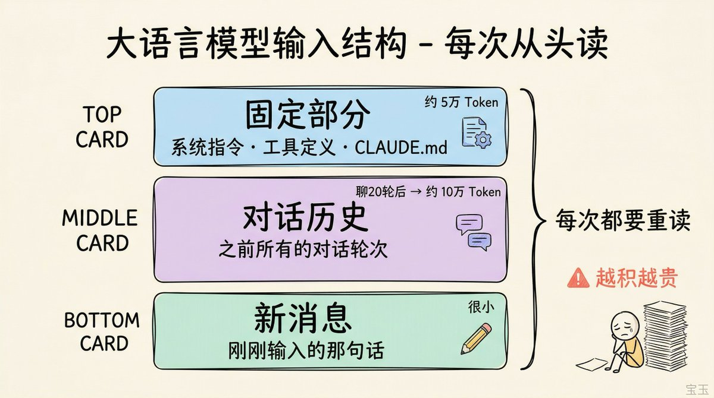

## 提示缓存：把“笔记”存起来

每次都从头翻那本 500 页的书，任谁都受不了。解决办法很直接：把笔记提前做好，下次只翻笔记本。

提示缓存干的就是这件事。

模型读完一段输入后，会生成一组中间计算结果，相当于“阅读笔记”。后续生成回答时，模型靠的就是这组笔记，不会再回去看原文。提示缓存的机制是：第一次算完笔记后存下来，下次再遇到相同的输入前缀，直接用存好的笔记，跳过重复计算。

读取缓存的成本只有重新计算的十分之一。

粗略算一下：一个 20 轮的会话，10 万 Token 的上下文，缓存一直命中的话，输入成本比每次都全价处理低 6 倍以上。

但缓存有两个前提条件。

第一，缓存只对“前缀”有效。 必须从头开始、一字不差地匹配。

打个比方：你在作文纸上写了一篇文章，前 3 页一字不差，第 4 页改了一个字。只有前 3 页能用缓存，第 4 页开始就得重新计算。如果你在第 1 页就改了一个字？整个缓存全部失效，从头算。

所以 Claude Code 的输入结构很重要：系统指令、工具定义这些不变的内容放在最前面，对话历史在中间，新消息放在最后。每次只有末尾那一小段需要重新计算，前面一大段都能命中缓存。

在同一个活跃会话里，前缀天然一致，每一轮只是在尾部追加新内容，缓存命中率很高。但如果你开了一个新会话，前缀从零开始，之前积累的缓存全部用不上。

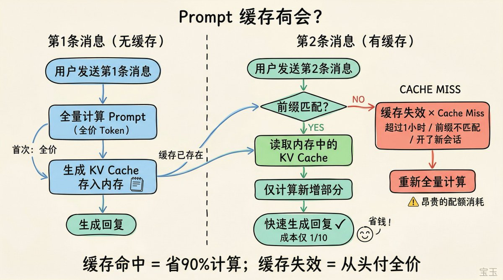

第二，缓存有存活时间。 根据 Claude Code 团队的说明，主智能体的缓存窗口是 1 小时，子智能体是 5 分钟。API 用户默认只有 5 分钟（可以付费开启 1 小时，但更贵）。每次缓存命中都会刷新计时器，只要你保持交互频率，缓存可以一直活着。

Claude Code 团队的原话：

> “Claude Code 是缓存利用率最高的框架。”

但缓存未命中的代价，随上下文长度增大而急剧增加。一个 200K 的缓存未命中和一个 1M 的缓存未命中，完全是两个量级的开销。

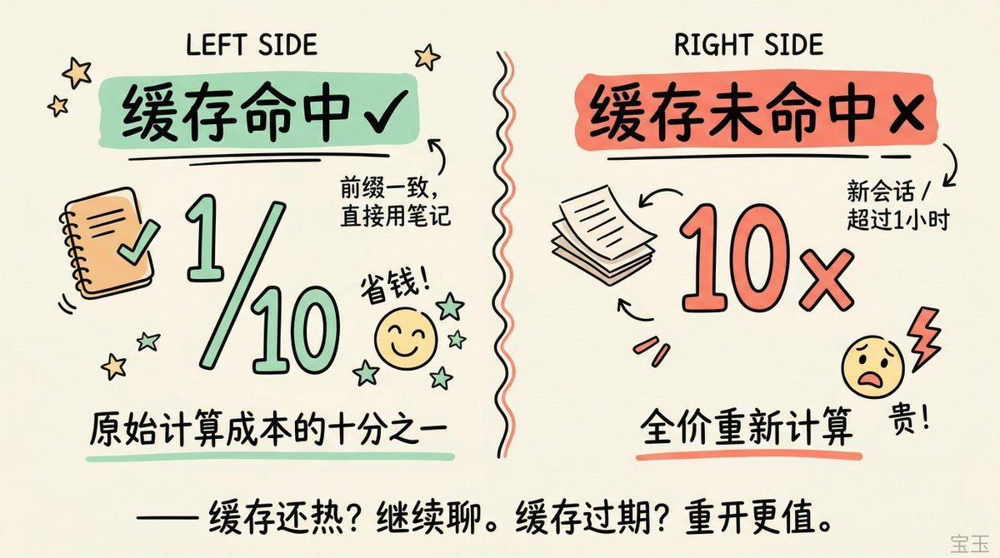

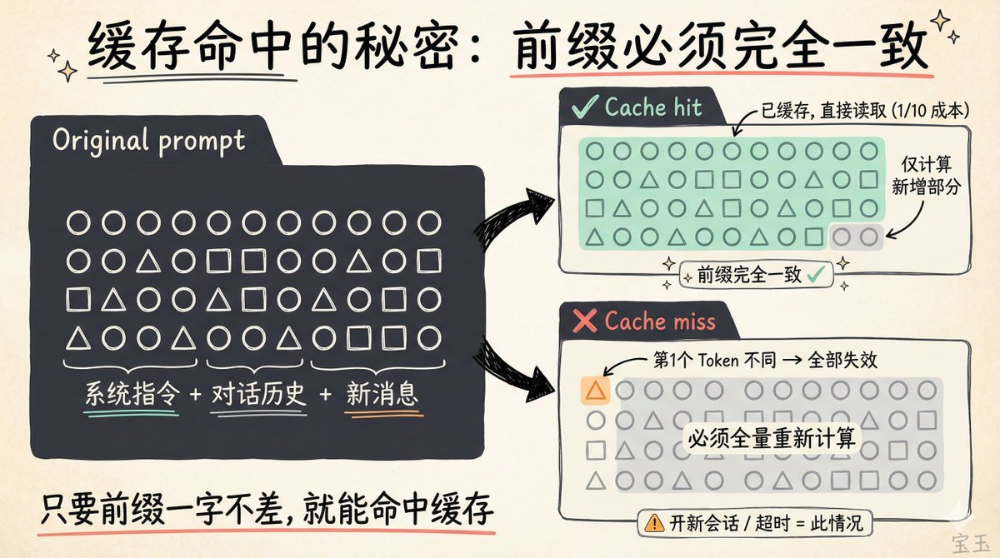

## 三个反直觉的省钱策略

理解了缓存之后，有些“常识”要翻过来。

## 缓存还热的时候，继续聊比开新会话便宜

Claude Code 每次新会话启动，都要重新加载系统提示、工具定义、CLAUDE.md、项目配置。这些“基础设施”大约 5 万 Token。频繁 /clear 等于反复为这些不变的内容付全价写入费。

而在活跃会话里，这些内容一直在缓存中，每次只付十分之一的价格。

Anthropic 员工 Lydia Hallie 说的“闲置约一小时的大型会话，建议重新开始”，关键词是“闲置”。活跃工作中的会话，缓存一直是热的，继续聊才最省。

## 复杂任务一次做对，比来回改三轮更省

关掉扩展思考确实能在单次请求里省 Token。但一个复杂的重构任务，开着扩展思考一次搞定，和关掉之后来回改三轮，后者更贵的概率很大。因为每多一轮对话，整个上下文都要重新发送一次，三轮累积的 Token 远超一次深度思考的额外开销。

简单任务反过来。把 /effort 调低或者在 /config 里关掉思考模式，效果立竿见影。思考 Token 按输出价计费，默认预算对简单任务来说浪费明显。

## 长内容给路径，别往对话里贴

比起控制输出长度，更有效的是控制输入质量。不要把 10000 行日志复制粘贴到对话里让 Claude 自己找错误，直接把日志文件路径发给它。Claude Code 会自己用 grep 之类的工具去检索需要的信息，只把相关内容拉进上下文。最便宜的 Token，永远是根本没进上下文的 Token。

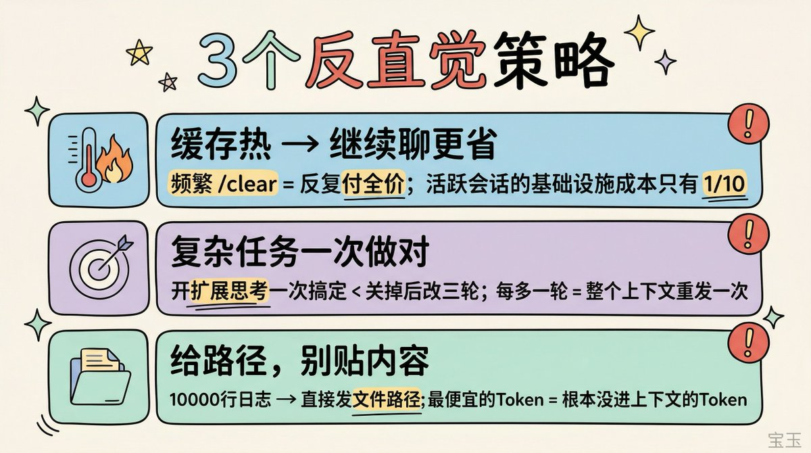

## 继续聊还是开新会话：一张决策表

这可能是 Claude Code 省 Token 最关键的一个判断。很多人的默认习惯是“做完就清”，实际上最省的默认习惯应该反过来：能继续就继续，开新会话是有条件触发的操作。

满足以下任一条件，继续当前会话：

- 任务没变。还在调同一个 bug、写同一个模块、围绕同一组文件工作。

- 距离上一条消息不超过 1 小时。缓存还活着，前面积累的上下文几乎不花钱。

- 上下文里的内容对当前工作仍然有用。之前读过的文件、讨论过的方案，模型还在用。

如果在思考问题暂时没有输入，可以发一条简短消息保持缓存活跃。有用户甚至写了心跳扩展来自动保活缓存，刷新一次缓存的成本只有完整缓存未命中的十分之一。

满足以下任一条件，开新会话：

- 任务换了。刚写完认证模块要做支付功能，两件事的上下文完全不同。老会话里堆的代码文件、调试记录对新任务毫无用处，每条请求都在为这些无关内容付费。

- 闲置超过 1 小时。缓存大概率已经过期，继续聊等于触发全量重建，还不如从干净状态开始。

- 上下文被不相关内容塞满。试了十几种方案、读了大量无关文件，这些内容还在占位。即使缓存命中，模型也要在噪音里找信号，输出质量下降，而且压缩后可能丢掉关键信息。

一句话总结：缓存还热、任务没换，继续聊。缓存过期、任务切换、上下文里噪音太多，果断重开。

社区里有人反馈，一个会话只做一件事的工作方式，几乎不会触发配额问题。

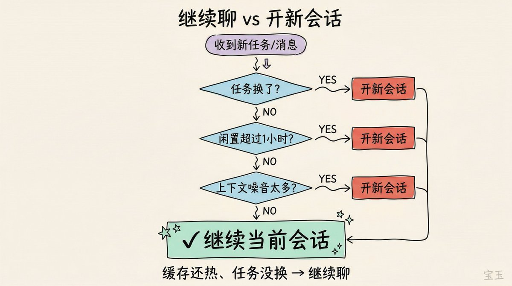

## 1M 上下文窗口：慎用

从 2026 年 3 月起，Max、Team、Enterprise 计划默认使用 Opus 4.6 的 1M 上下文窗口。Anthropic 取消了长上下文的 2 倍价格溢价，1M 窗口和 200K 同价。

但 1M 上下文正在成为很多人配额见底的头号原因。

问题出在缓存失效的代价上。你用 1M 上下文积累了一个很长的会话，中间离开电脑超过 1 小时，回来继续聊，这时候 1M Token 的缓存全部过期，一条消息就要触发全量重建。团队确认了这个问题，正在考虑将默认上下文从 1M 降到 400K。

而且大多数日常会话在 80-120K 上下文时就会触发压缩，根本用不到 200K，更别说 1M。社区里的经验数据也指向同一个结论：上下文超过 200K 后模型表现明显下降，350K 以上基本靠运气。

适合 1M 的场景确实存在：一次性加载大型代码库做全局重构、长时间多轮对话不想被压缩打断。但日常写代码改 bug 用不上。

我的建议：保留 1M 窗口但设一个保守的自动压缩阈值，兼顾灵活性和效率。

如果你想禁用 1M 上下文，在 \~/.claude/settings.json 中添加：

> \[json\]
{
 "env": {
 "CLAUDE\_CODE\_DISABLE\_1M\_CONTEXT": "1"
 }
}

如果你想设置自动压缩上下文的阈值：

> \[json\]
{
 "env": {
 "CLAUDE\_CODE\_AUTO\_COMPACT\_WINDOW": "200000"
 }
}

上下文接近 20 万 Token 时自动压缩摘要化，既保留上下文连续性，又防止成本失控。

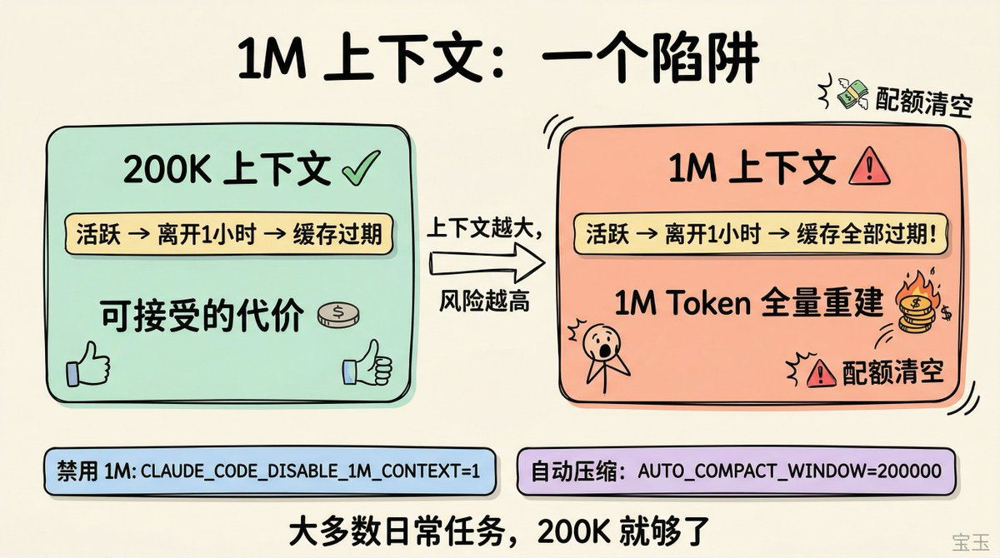

## 六条操作规则

## 一、用 Sonnet 做日常工作

Opus 的输入成本大约是 Sonnet 的 1.7 倍，但更关键的是 Opus 消耗 Token 的速度大约是 Sonnet 的两倍。很多团队花大量时间研究怎么让 Opus 少说点，不如先问一句：这件事真的需要 Opus 吗？大多数编码任务 Sonnet 就够了，Opus 留给复杂架构决策和多步推理。在 Claude Code 里输入 /model 切换。

## 二、别在会话中间换模型

提示缓存按模型隔离。你在 Opus 上积累了 10 万 Token 的缓存，切到 Sonnet 问个简单问题，Sonnet 要从零建立自己的缓存。这时候让 Opus 直接回答，反而比切到“更便宜”的 Sonnet 花得少。需要用轻量模型的场景，用子智能体而非切换主模型。

## 三、精简 CLAUDE.md，控制技能数量

CLAUDE.md 的内容会注入到每一次请求里。官方建议控制在 200 行以内，只保留真正长期有效的规则。代码审查流程、数据库迁移步骤这类只在特定时刻需要的长说明，挪到技能里去；技能默认只在调用时加载，不会提前占上下文。

但技能也不是越多越好。加载太多技能和智能体是配额消耗的一个隐形杀手，团队正在改进界面让这些消耗更可见。技能放在项目目录（.claude/skills/）而非全局目录，只装当前项目真正需要的。没在用的 MCP 服务也记得关掉。

一个小技巧：在 CLAUDE.md 里用 HTML 注释写维护者备注，Claude 注入上下文前会把注释剥掉，不花 Token。

## 四、命令行优先，MCP 其次

GitHub 的 gh 命令行工具比 GitHub MCP 服务器消耗的 Token 少得多。MCP 工具会把完整的结构定义注入上下文，请求和响应两端都在花 Token。能用命令行解决的事，别装 MCP。

## 五、先花一点 Token 做计划

复杂任务先进入计划模式，让 Claude 先探索代码、提出方案，再进入实施，总成本往往更低。真正昂贵的是方向错了以后重扫代码、重写实现、重跑测试。

提问也是一样：“帮我优化这个代码库”这种模糊提示会触发广泛扫描；「给 auth.ts 里的 login 增加输入校验」这种具体指令，文件读取和试错都会显著减少。

## 六、用 permissions.deny 限制模型的阅读范围

没有索引的代码库会迫使模型通过文件搜索来寻找上下文，效率极低。在 .claude/settings.json 中用 permissions.deny 严格限制模型可读取的范围，比如排除 node\_modules、构建产物、大型数据文件：

> \[json\]
{
 "permissions": {
 "deny": \[
 "Read(./.env)",
 "Read(./.env.\*)",
 "Read(./secrets/\*\*)",
 "Read(./node\_modules/\*\*)",
 "Read(./build)"
 \]
 }
}

匹配这些模式的文件会被排除在文件发现和搜索结果之外，读取操作也会被直接拒绝。模型有时候会陷入长达 5 分钟以上的代码库搜索循环，即便你指明了文件路径，它仍可能在背景中反复读取不相关文件。permissions.deny 能从源头减少这种浪费。

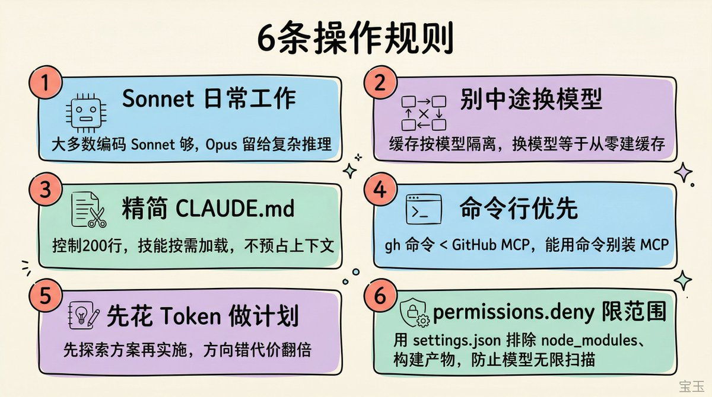

## 把部分工作委派出去

两个委派思路可以减少主会话的 Token 消耗。

子智能体：Claude Code 的子智能体有独立上下文，完成后只返回简短摘要给主会话。子智能体的缓存窗口只有 5 分钟（主智能体是 1 小时），每次调用的缓存利用率更低。但它的价值在于隔离上下文：代码审查、跑测试、查文档这些工作的详细输出不会留在主会话里，后续每条消息都不用为这些内容付费。

智能体团队和子智能体不同。智能体团队里每个成员都是独立 Claude 实例，各自维护自己的上下文窗口。计划模式下智能体团队的 Token 消耗是标准会话的数倍（社区估算约 7 倍），闲置的成员也在继续消耗。并发加速有成本，多智能体不等于更便宜。

Codex 插件：如果你同时有 OpenAI 订阅，社区里有人用 openai/codex-plugin-cc 把部分任务分出去。这是第三方社区方案，有用户反馈 Codex 完成同等任务大概只用 Claude Code 三分之一的 Token，但具体效果因任务而异。适合委派的：结构化的 bug 修复、代码审查、写测试。留给 Claude Code 的：架构设计、跨文件重构、需要理解整个代码库的复杂工作。

安装方式：

> \[bash\]
claude mcp add codex -- npx -y @openai/codex-plugin-cc

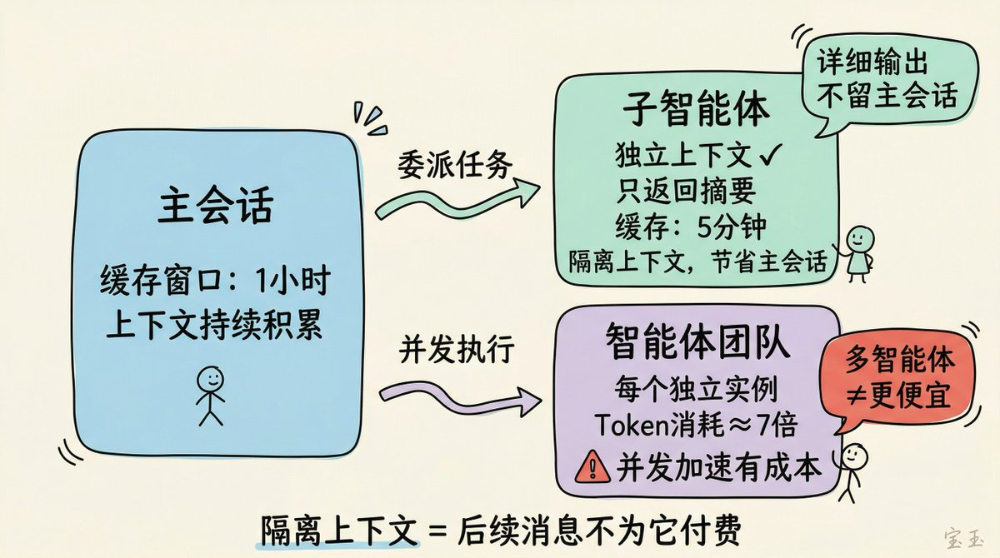

## 一些被澄清的误解

社区里流传不少关于配额消耗的说法，Claude Code 团队在讨论中做了官方澄清。

流传最广的一条是“上下文超过 256K 之后消耗会更快”。官方回应很直接：这不是真的。 实际原因很可能是用户重启了闲置已久的会话，触发了大规模缓存未命中，被误归因于上下文长度。

还有人抱怨模型每次读文件都在检查是否为恶意软件，浪费 Token。这个安全检测提示从 Sonnet 3.7 就有了，每次新模型都做过评估，没有引发退化。Opus 4.6 已经移除了这个提示。至于“自适应思考导致配额消耗异常”，团队也已排除。团队表示没有盲目相信内部指标，仍在持续调查：

> “我们在认真对待这件事，仍在持续调查。我们没有盲目相信内部指标。”

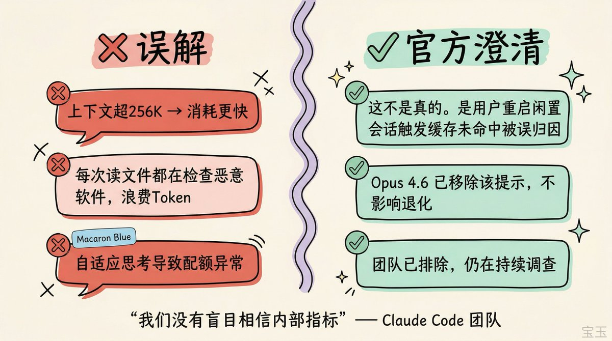

省 Token 的核心思路就一句话：让缓存尽可能多地被命中，让上下文尽可能少地装无关内容。

开新会话是手段，理解了提示缓存之后你会发现，“在活跃会话里继续工作”才是默认策略，“开新会话”是特定条件触发的优化操作。

社区里很多人在比较 Claude Code、Codex、Cursor 的配额谁更慷慨。但配额收紧可能是个行业趋势，有人说我们正处在“补贴算力时代的末期”，类似当年 Uber 3 美元打车的阶段。与其赌哪家补贴更久，不如搞清楚成本结构，把钱花在刀刃上。

你们平时一个会话大概多长？有没有因为不敢继续聊而频繁 /clear 的习惯？

### 🖼️ Attached Media

## 💬 Replies

### 1 @dotey (宝玉) (Author)

*Mon Apr 13 03:56:20 +0000 2026*

至于 Plan 后是否新开 session，要综合来看：
从效果来说，通常新 session 更好，因为上下文更少更相关

从省token来说，同一个session节约，因为该有的信息基本都有了

如果cache过期了，就开新的吧

[x.com/richardchang/s…](https://x.com/richardchang/status/2043537859559543176?s=20)

### 2 @dotey (宝玉) (Author)

*Wed Apr 15 05:38:39 +0000 2026*

Claude Code 订阅用户缓存 1 小时信息来源
[x.com/bcherny/status…](https://x.com/bcherny/status/2043715713551212834)

### 3 @CuiMao (CuiMao)

*Sun Apr 12 23:15:05 +0000 2026*

@dotey 哇，学习了

### 4 @suddenly01234 (suddenly)

*Mon Apr 13 06:47:55 +0000 2026*

@dotey 主动compact 或者自动compact 会不会让缓存失效？

### 5 @dotey (宝玉) (Author)

*Mon Apr 13 06:51:16 +0000 2026*

@suddenly01234 会的

### 6 @bhiibnk44233 (Bhiibnk)

*Tue Apr 14 07:41:37 +0000 2026*

@dotey 缓存不是一个小时吧，所有用户都是5分钟

### 7 @dotey (宝玉) (Author)

*Tue Apr 14 07:55:50 +0000 2026*

@bhiibnk44233 API用户默认5分钟，订阅用户一小时

### 8 @novauraluxe (Novauraluxe)

*Mon Jun 01 00:21:45 +0000 2026*

@dotey 学习了，希望能早点看到。不过有个问题，如果我的项目没做完，要去睡觉，明天接着做。那这种情况，肯定是要新开对话，那怎么让新对话接着昨天的内容继续呢？

### 9 @dotey (宝玉) (Author)

*Mon Jun 01 01:12:55 +0000 2026*

@novauraluxe 那就直接继续好了，偶尔几次cache失效成本并不会剧增

### 10 @oaooao_x (oaooao)

*Sun Apr 12 23:47:53 +0000 2026*

再次说明了 harness 系统的必要性，harness 里面的 checkpoint 和记忆循环做好了的话，可以在聊到三四十万 token 的时候，随时开新的 session 续聊，新 session 依然可以知道目前系统的关注点、最新进度和 open issues 这些重要信息，无缝衔接，我现在 session 想关就关，完全没有因为担心关闭长上下文窗口而担心丢失重要内容的心智负担，最近在专注开发产品，等有空了我会把我花了一个多月深入思考、不断踩坑、重建 harness 系统的经历完整分享出来，欢迎大家关注我

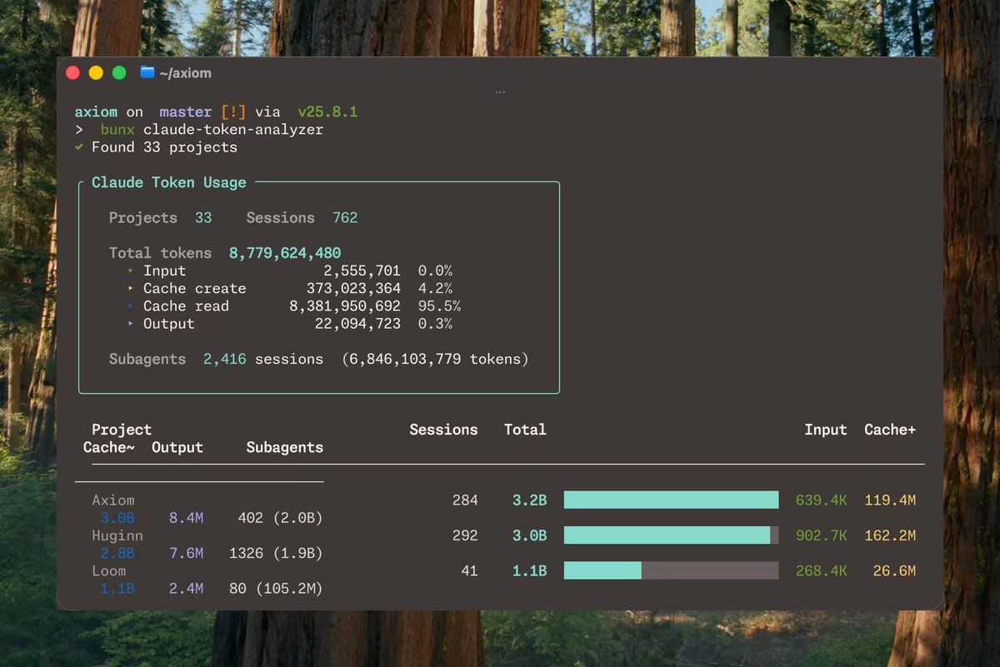

### 11 @wuanwanbaozang (吴安玩的宝藏)

*Mon Apr 13 01:39:29 +0000 2026*

看了宝玉老师的文章，我在 claude.md 里加上了一段规则：

\### 缓存心跳
\- \*\*启动时\*\*：处理完用户第一条消息后，自动调用
\`ScheduleWakeup(delaySeconds=3000, prompt="心跳
", reason="50分钟缓存保活")\`，并告知用户「50 分
钟心跳已开启」
\- \*\*收到「心跳」时\*\*：只做两件事——① 再调用一次
\`ScheduleWakeup(delaySeconds=3000, prompt="心跳
", reason="50分钟缓存保活")\` ② 回复一个字「好」
，不输出任何多余内容

### 12 @gm5gn (0xKong)

*Sun Apr 12 23:23:42 +0000 2026*

@dotey 感谢宝玉老师系统全面的分析。太及时了，最近在作个人软件，token有时消耗慢有时消耗快，终于找到原因了。我是连续相关的任务在一个会话，但有时第二天继续在这个会话开发，一上来token就消耗了很多，看来得新开个会话才划算一些。

### 13 @wuzhige4pixel (武止戈👽🦀相比于《1984》, 我宁可《2012》)

*Tue Apr 14 21:06:48 +0000 2026*

@dotey 我写了心跳skill来自动保活缓存

[github.com/RyderFreeman4L…](https://github.com/RyderFreeman4Logos/agent-skills-collection)

### 14 @zwdroidai (zwdroid)

*Mon Apr 13 00:35:22 +0000 2026*

@dotey 宝玉老师牛👍

### 15 @iml1s (ImL1s)

*Sun Apr 12 23:08:46 +0000 2026*

@dotey 会话管理这块确实是成本关键所在。缓存命中率的影响远超大多数人预期，任务类型切换时盲目继续旧会话反而更浪费。个人更倾向按任务边界来判断，而不是简单地"尽量不开新会话"。

### 16 @Michaelzsguo (Michael Guo)

*Mon Apr 13 02:50:26 +0000 2026*

我最近做了一个Token consumption profiler， 可以分析以前的Session， 也可以监控当前的Session。从14个metrics方面打分。
不过最后分析的结果， 最浪费token的就是长Session（也就是下列表中的第二个：trajectory amplifcation)， 几十甚至几百回合。所以现在比较会留意，把长任务拆分成小任务，每次从/clear开始，也会多主动Compaction。

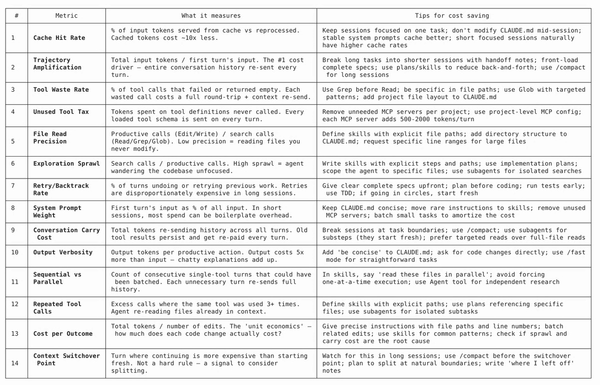

### 17 @MKonbing (Onbing)

*Tue Apr 14 15:26:30 +0000 2026*

@dotey 太宝贵了，收获很多

### 18 @Dr_Martiin (Martin | AI x MKT)

*Sun Apr 12 23:46:05 +0000 2026*

@dotey Thank you so much! This is a wonderful article!

### 19 @negtivspace (NegativeSpace 留白)

*Mon Apr 13 13:25:32 +0000 2026*

@dotey 個人體會：五、先花一点 Token 做计划 -&gt; 特別重要，需要在開始前，考慮清楚。好文細讀，謝謝分享

### 20 @luluji298111 (轉生成千年的福利連)

*Mon Apr 13 00:53:50 +0000 2026*

@dotey 厲害 感謝

### 21 @dustybill3 (eatfirst)

*Mon Apr 13 00:54:57 +0000 2026*

@dotey 不知道是不是错觉，俺用了rtk+mempalace+get shit done感觉明显省了很多，也可能只是速度变慢了😅

### 22 @zou_boss (boss zou)

*Mon Apr 13 15:58:26 +0000 2026*

@dotey 学到了很多，好文

### 23 @Cx_300_kim (说不清的时光)

*Mon Apr 13 03:26:45 +0000 2026*

@dotey 感谢宝玉老师的分享 受益了

### 24 @Ryanyang0831 (Ryan瑞安)

*Mon Apr 13 05:08:18 +0000 2026*

@dotey 看到这篇文章之前的使用习惯还都是/clear，感谢宝玉老师的分享！

### 25 @richardchang (RichChat)

*Mon Apr 13 03:52:47 +0000 2026*

@dotey 以claude code中常见的先分析-写plan-执行这个流程来说，如果用的的opus 1M，是cc写好了implementation plan后刻意去开个新session来执行更好还是就在当前session执行更好啊？

### 26 @noodlesli2016 (Noodles)

*Mon Apr 13 00:37:04 +0000 2026*

@dotey 突然联想到现在存储紧缺问题和这个1小时的记忆设置…🤔

### 27 @fengdeng585 (eddieyeung | Bird🕊️)

*Mon Apr 13 05:11:29 +0000 2026*

@dotey 一个session烧134刀看得我心跳加速 现在每次开新会话之前都要犹豫三秒

### 28 @wsiwsii (Wibi X)

*Mon Apr 13 16:56:19 +0000 2026*

@dotey 买个中转站日卡，去他们token消耗页观察一下就全明白了

### 29 @MossAI_CN (MOSS 中文)

*Mon Apr 13 03:31:35 +0000 2026*

@dotey 说实话，我之前也是无脑 /clear 党，看完才知道每次清空都在为 5 万 Token 的基建重新付全价😂

现在改成了一个会话只做一件事，做完再开新的，配额确实耐用多了。

### 30 @zhedao88 (黑泽)

*Mon Apr 13 02:07:31 +0000 2026*

@dotey 缓存热继续聊；复杂任务一次性搞定；能给路径就不贴全文
我昨天跑的一个session 系统几乎每个子任务都在compact对话 后来逼着我clear了 结果更慢了……

### 31 @ayako0952 (Bin)

*Mon Apr 13 02:04:59 +0000 2026*

@dotey 但是CLAUDE降智這麼嚴重，你多聊幾句Opus就變智障了，不理會上下文，不遵守CLAUDE.MD，不調用SKILL，
計畫A但是實作B，廢話還多，有錯誤不查文檔，這麼廢，只能重開對話阿

### 32 @MrJiangSCU (Mr Jiang)

*Mon Apr 13 05:12:37 +0000 2026*

@dotey 宝玉老师如何评价auto compact功能？有必要compact还是直接clear？

### 33 @JasonBoy7 (Jason)

*Mon Apr 13 01:06:41 +0000 2026*

@dotey 缓存失效重建还得加价25%😂😂

### 34 @CosmicMangzoqz (Jack Li)

*Mon Apr 13 01:28:46 +0000 2026*

@dotey 大部分日常工作，国产模型已经都能胜任了。再过6个月，基本上也用不着Claude写代码了。

