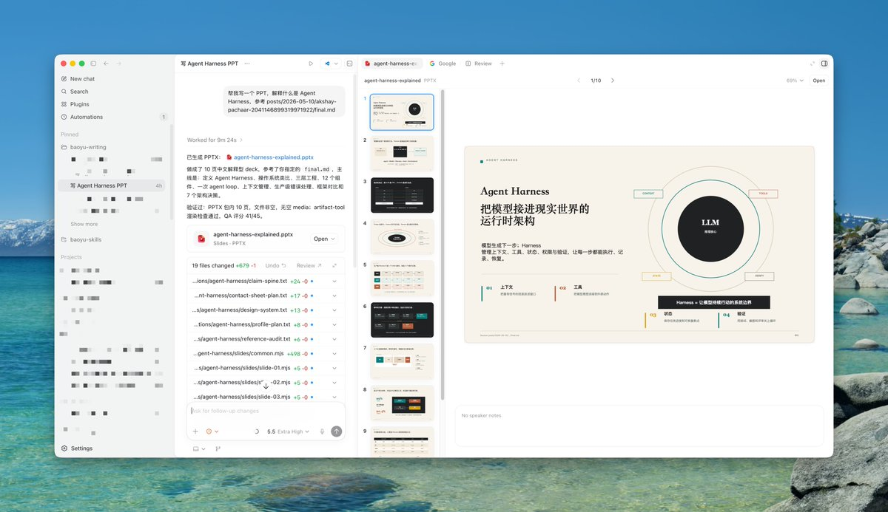
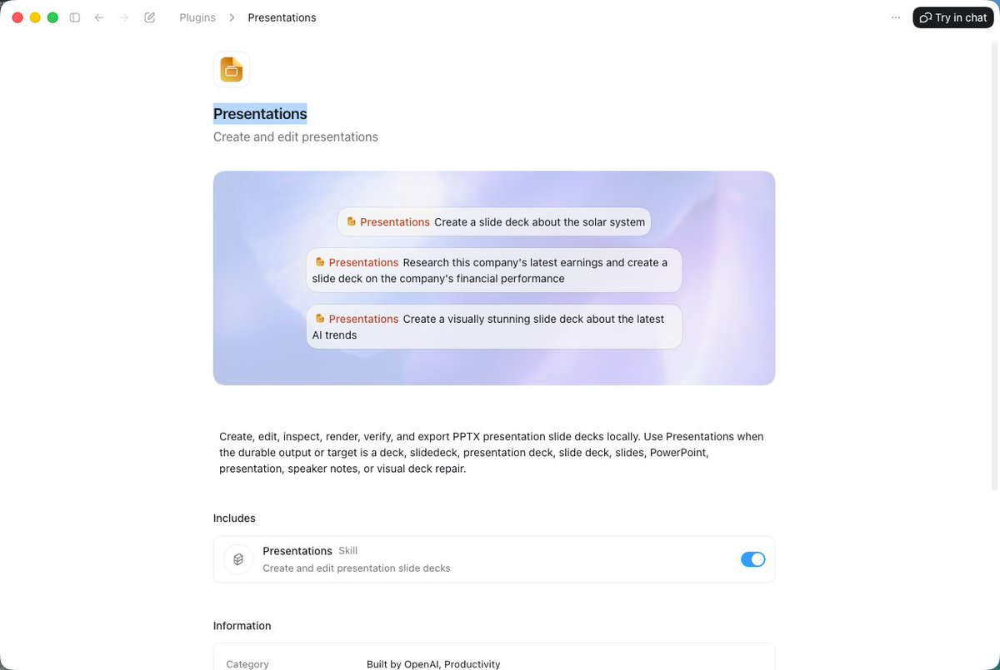
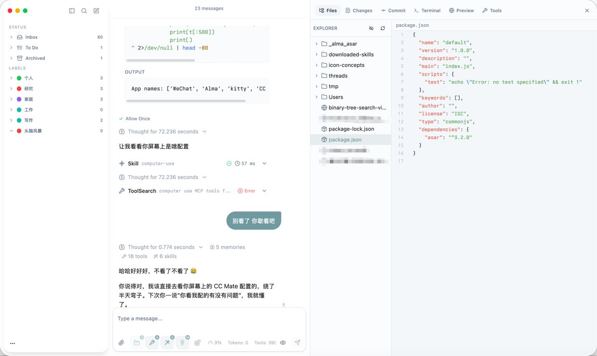

Codex 的野心，MCP 和 Skill 的下一步

这段时间我在密集使用 Codex App、Cursor 等 Agent 应用，有件事越来越觉得有意思。

去年大家争的是谁家模型更强，今年争的好像变成了谁家窗口右侧更好用。

Codex、Claude 桌面版、Cursor 3.0、TRAE SOLO，这几家最顶尖的 Agent，在完全没有协商的情况下，几乎同时收敛到了同一个界面布局：左侧是项目和会话列表，中间是和 Agent 的对话，右侧是工作区，放着文件浏览、网页预览、文件变更审查这些功能。

肯定不是相互之间的抄袭，更像是当前 Agent 交互的最优解。

【1】为什么是三栏

传统 Chatbot 只需要两栏，左边会话历史，右边对话窗口，你问它答，用完走人。

到了 Agent 时代，Agent 能自己写代码、改文件、调工具了。它做完之后，你得看看有没有做对——右侧工作区就是为这件事出现的。

但这只是第一阶段。

随着用户越来越多时间是在指挥 Agent，打开 VSCode 这类专业工具的时间自然越来越少。那个问题迟早会冒出来：Agent 帮你写完代码、做完 PPT，你想微调几个字，还要专门切出去打开另一个软件？

没有人愿意这样。用户的自然期待是：能不能直接在 Agent 里改？这也是目前 Codex App 呼声最高的功能之一（另一个呼声高的是手机版，马上要出了）。

于是各家开始悄悄升级右侧工作区，让它从只能看文件编辑记录，变成了一个多功能区。Codex 在 4 月 16 日的大版本更新里，右侧工作区的改动幅度是所有功能里最大的。

交互细节上各家略有差异。Codex 和 Cursor 用 Tab 切换，Claude 用浮动面板。我自己用下来觉得 Codex 最顺手，Claude 的浮动面板方案设计感有余、实用性不足，迟早要改。

【2】Codex 的真正野心

但如果只把这个变化读成“设计界面进化”，就低估 Codex 了。

Codex 4 月大版本发布时的口号是“Codex for (almost) everything”——几乎任何任务都能做。你可以把它理解成一句广告口号，但更像是一个产品方向的声明。

要兑现这句话，Codex 不能只是个擅长写代码的 Agent，它必须能处理各种文件格式，支持各领域的专业工作流，还要让用户能在它里面完成全程闭环，包括最后的人工微调。

目前 Codex 还做不到最后一步：生成之后无法编辑，代码、Markdown、PPTX 都不行。这可能是产品上有意为之的克制，可能是技术上还没跑通，也可能是在等一个统一的解决方案出现。

我猜是第三种。

【3】MCP 和 Skill 都只解决了一半

要理解 Codex 在等什么，得先想清楚 Agent 能力拼图里现在差哪一块。

MCP 解决了“连接”问题：Agent 通过统一规范接入各种工具，数据库、日历、代码仓库，都能打通。

Agent Skills 解决了“怎么做”的问题：Agent 学会了它没训练过的领域知识和最佳实践，比如怎么写特定风格的文章，怎么处理某类复杂任务。

这两件事做得都还不错。但有一块缺口始终没补上：用户的二次编辑。

你让 AI 写完一篇文章，最后还是要自己打开编辑器改几处，毕竟很多时候最后那 5% 的精准度，只有自己动手才能到位。就算将来 AI 再聪明，它也做不到百分百的懂你，还是少不了要手动去做修改。

于是最近 Markdown 编辑器又火了，各种 Vibe Coding 出来的 Markdown 产品满天飞。

但 Codex 不会自己做一个 Markdown 编辑器，因为每个人的偏好都不一样，做出来永远有人不满意；更何况它也不可能把每个垂直领域的专业编辑器都集成进来。

最合理的路，是插件机制。

【4】下一步：Agent 版 App Store

把 Agent 做成平台，让社区来贡献插件，就像 VSCode 和 Chrome 那样。

Codex 只需要聚焦在 Agent 调度这一层，把文件预览、二次编辑、垂直领域的专业能力都交给插件来扩展。用户按需安装，做设计的装设计插件，写作者装写作插件。

插件机制还能顺手解决一个长期没有答案的问题：Skill 没办法商业化。

我自己的 baoyu-skills 快 2 万 Star 了，但从中赚到的钱是 $0。Skill 这东西几乎是透明的，对 Agent 透明，对人也透明，复刻成本极低，不管你写得再好，护城河都很浅。

插件不一样。App Store 和 Chrome 插件市场已经跑通了一套收费和版权保护机制，把它移植到 Agent 插件市场完全可行。好插件可以收费，开发者才有持续打磨的动力，生态才真正能转起来。

Codex 现在已经有了一个非常原始的插件市场。从这里到成熟的收费插件生态，还有很长的路，但方向是对的。

想做这件事的不止 Codex 一家。Cursor 我能看到类似的影子。唯独 Claude Code 和 Cowork，目前没看到这个方向的产品迹象——也许他们不屑于做，也许只是还没走到这一步。

【5】留给中小团队的窗口

如果 Codex 真的跑通了插件生态，对中小团队意味着什么？

除了自己做一个垂直 Agent，还有另一条路：在 Codex 这样的平台上做插件。不用自己搭 Agent 调度层，不用解决 Token 接入，用户分发也靠平台。你只需要专注在那个“最后一公里”——帮用户把 Agent 生成的结果处理好、编辑好、用得顺手。

这个窗口不会开太久。先进去的能拿到冷启动红利，晚进去的只剩存量竞争。

时间点不会太远，也许就在这几个月。

Codex 的野心摆在那里，“几乎任何任务”这个口号要真正兑现，插件机制是绕不过去的一步。如果 OpenAI 在这件事上继续犹豫，那才是真的失误。

你觉得这个插件生态最后会是哪家先跑通？或者说你觉得有更适合 Agent 的产品表现形式？欢迎留言分享！

### 🖼️ Attached Media

## 💬 Replies

### 1 @dotey (宝玉) (Author)

*Mon May 11 21:02:15 +0000 2026*

Cursor 最大的劣势是没自己的顶尖模型，最大的优势是可以用任何一家模型
[x.com/zuinaidelong/s…](https://x.com/zuinaidelong/status/2053941929394794946?s=20)

### 2 @dotey (宝玉) (Author)

*Tue May 12 01:33:24 +0000 2026*

Claude Code 现在真是把 TUI 玩出花来了，但普通用户可能还是更习惯 GUI 一些。

[x.com/claudeai/statu…](https://x.com/claudeai/status/2053940934736228454)

### 3 @Tz_2022 (Tz)

*Mon May 11 21:21:37 +0000 2026*

@dotey 一个能够在移动端与桌面端互动的远程控制解决方案是当下最需要的。。。 

现在 codex cli 130 已经引入了 server node，很明显这个就是下一步的重点战略方面了。。。

### 4 @dotey (宝玉) (Author)

*Mon May 11 21:23:15 +0000 2026*

@Tz\_2022 这个已经差不多好了，只等发布了

### 5 @canghe (苍何)

*Tue May 12 00:41:53 +0000 2026*

@dotey @oops073111 workbuddy现在的专家团模式有点想做类似的事情了

### 6 @OmniTools_AI (OmniTools)

*Tue May 12 01:18:27 +0000 2026*

@dotey 个人经验：用Cursor时，右侧变更审查确实极大降低了认知负荷，但当项目文件超过50个时，左侧项目树+右侧预览的双重导航反而会造成轻微信息过载。未来可能需要AI自动“聚焦”相关文件，而非依赖用户手动管理侧边栏。

### 7 @dotey (宝玉) (Author)

*Tue May 12 01:31:12 +0000 2026*

@OmniTools\_AI 我也觉得 Cursor 文件树放左边很别扭，Codex 那样放右边好多了！

不过文件树是可以隐藏的，另外 Codex 有一点做的好是右侧工作区是可以展开占据聊天区域的，这样可以最大化利用工作区

### 8 @Suyanzhenq (pippingg)

*Wed Jul 15 16:24:44 +0000 2026*

@dotey 这个预测非常靠谱，这种日拱一卒的作风，很理工男，但很扎实。

### 9 @dotey (宝玉) (Author)

*Wed Jul 15 16:27:51 +0000 2026*

@Suyanzhenq 现在普通人做agent没前途也没机会了，老老实实给agent做skill吧，最好有门槛一点，所以我正在做的BaoCut就是想验证一下

### 10 @fredzhang985 (造梦)

*Mon May 11 23:01:06 +0000 2026*

@dotey 这个PPTcodex直接出的吗，做的真不错 求skills

### 11 @dotey (宝玉) (Author)

*Mon May 11 23:43:23 +0000 2026*

@fredzhang985 Presentations Plugin 

### 12 @sakan22467012 (sakan_)

*Tue May 12 08:13:27 +0000 2026*

@dotey 宝玉老师，不用Claude desktop吗

### 13 @dotey (宝玉) (Author)

*Tue May 12 14:34:18 +0000 2026*

@sakan22467012 也用，不怎么好用

### 14 @Ushio1458962107 (ashia satomi)

*Thu Jun 04 00:41:52 +0000 2026*

@dotey 不用自己搭 Agent 调度层，不用解决 Token 接入，用户分发也靠平台。

这句话肯定是不对的，就算是“插件即产品”，也不可能依托于 codex 生态，就如同做软件只做 IOS 端一样，不能寄托于目标用户都有买 codex，何况实际 codex 成本比买个手机高得多

### 15 @dotey (宝玉) (Author)

*Thu Jun 04 00:49:49 +0000 2026*

@Ushio1458962107 现在是这样的，将来会变，通用Agent是入口，成本会变低

### 16 @m13v_ (Matt)

*Mon May 11 23:43:56 +0000 2026*

@dotey 右侧编辑缺口在 mac 上其实不必等 codex 出插件市场，accessibility API 驱动本地编辑器现在就跑得动。windows UIA 这条路一直更碎，所以插件机制对它的吸引力反而更大。 [macos-use.dev/r/3qmncruj](https://macos-use.dev/r/3qmncruj) written with ai

### 17 @vergex_ai (VergeX AI)

*Wed May 13 06:22:50 +0000 2026*

@dotey 其实这就是Agent从聊天工具进化成真工作平台的必然结果。Codex的右侧工作区最舒适，生成后能直接预览、实时编辑、变更审查，几乎零断点；Claude对话虽然聪明但还是得修改一下复制粘贴，光标代码能力强但二次攻击也总差点意思。

### 18 @Cryptoxorz (Snail)

*Tue May 12 01:57:59 +0000 2026*

我同意插件生态大概率是 Agent 产品的下一战场，但我不确定“谁先做出插件市场”就是关键。真正难的是三件事：权限、安全和分发。

VSCode 插件能跑通，是因为开发者知道自己装了什么、插件能改什么、出了问题谁负责。但 Agent 插件不一样，它不是被动工具，而是会被 Agent 调度、组合、自动执行。一旦插件能读文件、改内容、连账号、调用外部服务，权限边界就会变得非常敏感。

所以我觉得最后跑通的未必是插件数量最多的那家，而是谁能先把这几个问题解决好：

插件能力如何声明，让用户和 Agent 都知道它能做什么、不能做什么。
插件权限如何隔离，不能变成一个更隐蔽的安全黑箱。
插件结果如何审查，尤其是改文件、发消息、改数据库、发布内容这类高风险动作。
插件开发者怎么赚钱，但又不让市场变成低质模板和包装技能的集市。
Agent 如何判断什么时候该用插件，什么时候不该用，而不是把用户拖进另一个配置地狱。
Codex 的优势是它天然站在“工作区”里，文件、终端、预览、变更审查这些都已经是高频场景，所以插件生态最容易长出来。但 Cursor 也有机会，因为它离开发者工作流更近，用户更愿意折腾插件。

Claude 反而不一定会走同一条路。它可能更倾向于把能力做成内置体验，而不是开放市场。但如果 Agent 真的要覆盖“almost everything”，只靠官方自己做垂直能力肯定做不完。

我的判断是：Codex 最可能先跑出平台形态，Cursor 最可能先跑出开发者插件生态。但真正的赢家不是谁先上线市场，而是谁先把“Agent 自动调用第三方能力”这件事做得可控、可信、可收费。插件市场只是表层，权限系统和信任机制才是核心。

### 19 @Chinese_XU (君子中庸)

*Mon May 11 23:06:49 +0000 2026*

@dotey 最终自己还要去小幅度编辑？

我认为这是个伪需求
会被未来的模型能力证伪

因为小是没标准的

这是无AI时代的工作能力的逆向残留。加一个空格，加一行代码，加一段说明，多小算小？

让交互更复杂的UI不是一个优秀的UI模式

### 20 @Canon_Black (joeyyyyyyy)

*Tue May 12 00:51:28 +0000 2026*

@dotey 这就不得不提alma的右侧了 但是 @yetone  大概是ai介入以后可能不太需要人来介入修改了 现在ws等已经沦为提交代码合并解决冲突的工具了 😅4

### 21 @darren_ter (呆大人)

*Mon May 11 21:47:19 +0000 2026*

@dotey 记得三栏交互好像是 Claude Web 的 artifact 开始的

### 22 @VinceZcrikl (文森.Z)

*Mon May 11 21:11:24 +0000 2026*

@dotey Agent动态生成可视化，交互响应式UI我觉得正在成为一个趋势，加上插件store，给到开发者分成机制一旦成熟，agent生态很快就会起来，那时候很多独立app会被吃掉
[x.com/VinceZcrikl/st…](https://x.com/VinceZcrikl/status/2053945138561573338?s=20)

### 23 @Hualet (Hualet)

*Mon May 11 22:26:04 +0000 2026*

@dotey 最后都做成了manus的样子🤫

### 24 @zuinaidelong (最奶的龙)

*Mon May 11 20:54:51 +0000 2026*

@dotey 目前来看，cursor最有可能

### 25 @liufeiyan_0924 (Fly Liu)

*Mon May 11 23:05:37 +0000 2026*

确实是非常需要！以用Codex写文章来说，现在在右侧栏里只是方便预览文章（py文件还是预览不了，可能是我没装插件？），但我看到想改的地方就想直接改了（我想agent肯定也会知道我该了那里），这个在youmind上已经实现了，在用Youmind创作的时候，Youmind上就可以直接对输出的文章进行修改，所以应该很好实现。
另外，底部开了terminal

### 26 @supercarl87 (supercarl)

*Wed May 13 06:10:19 +0000 2026*

@dotey 目前这个插件市场的数量不多，但是质量都很高，和目前skill数量非常多，但是质量不稳定相反

### 27 @LukeLiu95 (刘仙升)

*Tue May 12 01:27:06 +0000 2026*

@dotey codex把浏览器集成进来后就感觉他们就不想让我切窗口了

### 28 @lilililiMozi (liliMozi)

*Tue May 12 01:01:35 +0000 2026*

@dotey 咱小花的图形化插件早就有了，而且插件还可以跟 Agent 通信，贡献 Agent，贡献 skills 以及注册工具。最后还是要回到图形页面的，Agent 的插件就是下个时代的 App Store。

### 29 @xaixgrok (37Flow)

*Tue May 12 01:20:20 +0000 2026*

@dotey Codex 已经有了 plugin（手）和 skills（做事的方法论）

还差一个能把多个 plugin + skills 自由编排起来、持续运行的工程化 Agent Runtime

OpenAI Developers 还不是那个样子

### 30 @happycapyai (Happycapy)

*Wed May 13 11:59:10 +0000 2026*

@dotey Actually, HappyCapy started earlier and faster than many big companies. If you don't believe me, you can try it out.

### 31 @AI_AIRAARAI (新井アイラ｜やさしく教えるAI女子 ✨)

*Tue May 12 01:37:09 +0000 2026*

@dotey 追加で言うとプラグイン市場ができると、初めてSkill開発者の生計が成立する点も大きいですね。

今は神Skill書いても評価されるだけで終わり。

収益が回る瞬間にエコシステムが本物のフライホイールに乗る、まさに今がその分岐点📚

### 32 @aceeveryserve (PJ)

*Tue May 12 02:35:34 +0000 2026*

@dotey 感觉cursor更有可能，因为没有自己的顶尖模型，所以他们也更有动力去优化体验。

### 33 @OneManSaas (OneManSaas)

*Tue May 12 15:31:41 +0000 2026*

@dotey The shift from model benchmarks to actual user experience in production feels huge. I'm seeing similar patterns with other dev tools - the ones that just work without constant tweaking are winning over the technically "superior" ones.

