# 📰 Lex Fridman 播客深度解读 AI 现状：中美竞争、模型对比、规模定律、AGI 时间线

Sebastian Raschka 和 Nathan Lambert 坐在 Lex Fridman 的播客里，聊了整整 4 个小时。

[Embedded Tweet: https://x.com/i/status/2017735625227833850]

Sebastian 是《从零构建大语言模型》一书的作者，那本书教你从零开始写一个 GPT-2。Nathan 是艾伦人工智能研究所（AI2）的后训练负责人，写了业界最权威的 RLHF（基于人类反馈的强化学习）书籍。两个人都是真正在一线做研究、训练模型的人。

这期播客覆盖了 AI 领域几乎所有热门话题：中美竞争、模型对比、规模定律（Scaling Laws，即模型性能随计算量增长的规律）、训练流程、AGI（通用人工智能）时间线、程序员是否会被取代……信息密度极高。以下是按访谈顺序整理的核心内容。

## 中美 AI 竞争：谁在赢？

Lex 开场就抛了一个问题：国际层面，中国还是美国在赢？

Sebastian 的回答很谨慎："赢"这个词太宽泛了。他认为 DeepSeek 赢得了开源社区的心，因为他们真的把模型放出来了。但长期来看，不会有任何一家公司独占某种技术——研究者频繁跳槽，想法会流动。真正的差异化因素是预算和硬件。

Nathan 补充了一个有趣的观察：Claude 4.5 的热度是有机增长的，而几个月前 Gemini 3 发布时营销攻势很猛，但热度很快就被 Claude 盖过了。

"差异化程度在降低，"他说。各家的想法空间很流通，但 Anthropic 在代码上的长期押注正在收到回报。

关于中国公司，Nathan 指出 DeepSeek 可能正在"失去王冠"——智谱 AI、MiniMax、月之暗面等公司在 2025 年下半年表现更加亮眼。DeepSeek 启动了中国的开源运动，就像 ChatGPT 启动了美国的聊天机器人运动一样。

"中国现在有大量科技公司在发布非常强的前沿开源模型。"

Lex 追问：中国公司会持续开源多久？

Nathan 的判断是：至少几年。中国公司很清楚，美国顶级科技公司出于安全顾虑不会购买中国 API 服务。开源模型是一种"曲线进入"美国市场的方式——用户在本地运行，既获得分发又不触发安全红线。

"他们对此非常现实，而且正在奏效。"

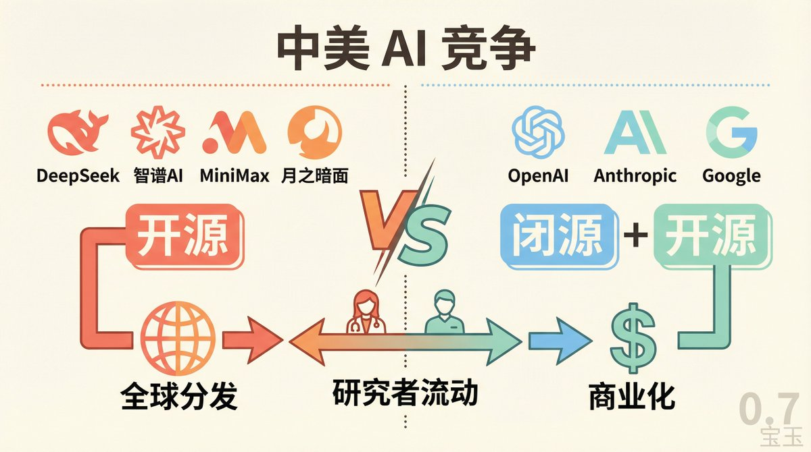

## ChatGPT、Claude、Gemini、Grok：谁更强？

Lex 问：2025 年哪个模型赢了？2026 年谁会赢？

Nathan 坦言很难押注 Gemini 超过 ChatGPT，因为 OpenAI 是市场领先者，在科技行业这有巨大优势。但 Gemini 的势头确实在上升。他的判断是：Gemini 会继续蚕食 ChatGPT 的份额，Anthropic 会在软件和企业端持续成功。

关于个人使用习惯，三人的偏好完全不同：

Sebastian：大多数时候用 ChatGPT 快速查东西，用非思考的快速模式。偶尔用 Pro 模式做深度检查，比如让它彻底审查一篇文章的引用、格式、逻辑。

Nathan：从不碰 GPT-5 的非思考模式。信息检索一律用 GPT-5.2 思考模式或 Pro，快速问题用 Gemini，代码和哲学讨论用 Claude Opus 4.5（带扩展思考），实时信息用 Grok。

"我简直不敢相信你用路由模式和非思考模式。"

Lex：用 Grok-4 Heavy 做硬核调试，其他模型解决不了的问题它能解。界面上更偏好 Gemini，因为它的长上下文能力——在"大海捞针"场景下（即从海量文本中找到特定信息），Gemini 对他来说表现最好。

Sebastian 总结了一个普遍规律："你一直用到它出问题，出了问题就换一个模型。"

就像浏览器一样——Safari、Firefox、Chrome 功能差不多，你不会同时打开三个浏览器对比同一个网页。你用习惯的那个，直到它出问题。

Lex 提了一个尖锐的问题：我们三个都没提中国模型。这说明什么？

Sebastian 认为这是平台和模型的脱节——中国开源模型更多是作为权重被下载使用，而不是通过产品界面。Nathan 补充：美国用户愿意为边际智能付费，而中国公司还没找到让美国用户付费的方式。

"简单说，美国模型目前更好，我们就用它们。"

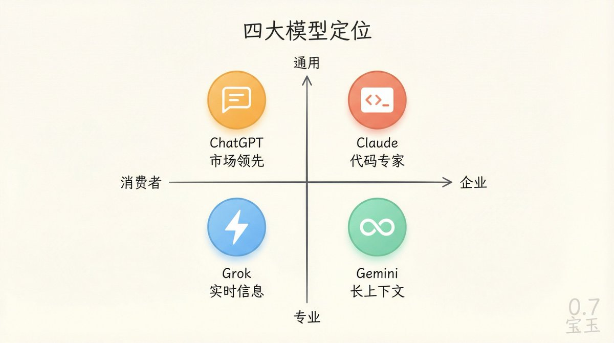

## 最佳编程 AI

Lex 说他一半用 Cursor，一半用 Claude Code，因为它们是"根本不同的体验"。

Sebastian 用 Cursor（VS Code 插件版），因为方便——一个聊天窗口直接访问代码库。他还没准备好让 AI 完全接管项目。"也许我是个控制狂，但我还是喜欢看到正在发生什么。"

Nathan 做了一个有趣的对比测试建议：同时打开 Claude Code、Cursor、VS Code，选同样的模型，问同样的问题。结果会很不一样。

"Claude Code 在这个领域好太多了，真的很惊人。"

Lex 解释他用 Claude Code 的原因："培养用英语编程的能力"。这是一种完全不同的思维方式——不是盯着代码细节和差异对比，而是用自然语言在宏观层面指导，像做设计。

Sebastian 提了一个值得思考的问题：如果大语言模型随时可用，你还会去"挣扎"吗？

资深开发者用 AI 更多，可能是因为他们更会用、更会审查。但新人如果从不经历挣扎，怎么成为专家？"我是通过自己尝试来学习的。如果大语言模型一直在那儿，你还会愿意挣扎吗？"

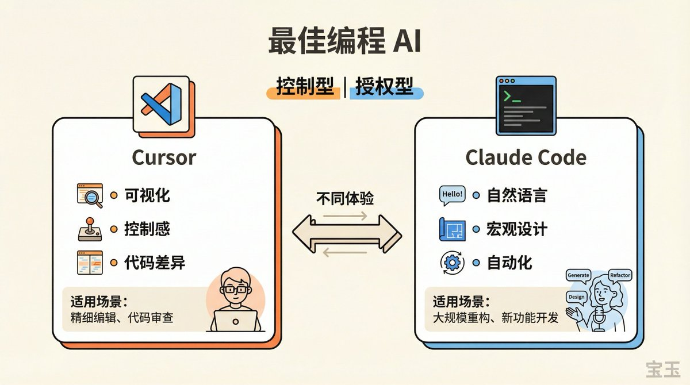

## 开源与闭源大模型

Lex 让两人即兴列举能想到的开源模型。

Nathan 开始报名：DeepSeek、Kimi、MiniMax、01.AI、月之暗面……

Sebastian 接力：Mistral、Gemma、GPT-o1（OpenAI 的开源模型）、英伟达的 Nemotron-3、通义千问……

"你能至少说出 10 个中国的，至少 10 个西方的。"

Nathan 提到一个关键区别：中国开源模型通常是大型 MoE（混合专家模型，即模型内部有多个"专家"子网络，每次只激活一部分）架构，峰值性能更高；美国偏好的 Gemma、Nemotron 等往往是较小的稠密模型（所有参数每次都参与计算）。但这正在改变——Mistral Large 2 就是一个巨型混合专家模型。

Sebastian 指出中国模型许可证的优势：几乎无限制。而 Llama、Gemma 有用户数量上限等条款。对于想基于开源模型做商业化的公司，中国模型限制更少。

为什么要开源？Nathan 列了几个原因：

1. 获取用户——很多人不会付费订阅 API，但愿意在本地跑模型

1. 获取分发——OpenAI 都 GPU 不够用，开源可以用用户的 GPU

1. 数据隐私——有些数据你不想发到云端

1. 定制需求——企业可以在开源模型上做专属微调

Sebastian 补充：开源还解决了教育和人才问题。如果只有闭源模型，你只能加入公司后才能学习，但怎么识别和招聘人才呢？"开源是培养下一代研究者的唯一方式。"

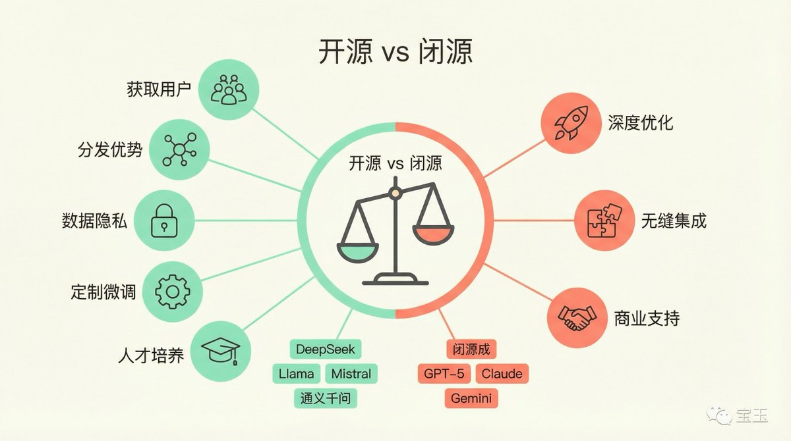

## Transformer 架构：从 2019 年到现在的演进

Lex 问了一个基础但重要的问题：从 GPT-2 到今天，架构到底变了多少？

Sebastian 的回答可能让很多人意外：

"从根本上说，架构还是一样的。"

具体变化可以列出来：

- 混合专家模型（MoE）：不是 DeepSeek 发明的，但他们用得很好

- 多头潜在注意力（MLA）：DeepSeek 的注意力机制变体

- 分组查询注意力（GQA）：比 MLA 更早出现，很多模型在用

- 滑动窗口注意力：OLMo-2 在用

- RMSNorm 替代 LayerNorm（两种归一化方法）

- 非线性激活函数的微调

"你可以从一个模型转换到另一个，只需要添加这些改动。"

Sebastian 在他的书里就是这么做的：从 GPT-2 出发，增量修改得到 OLMo、Llama 3 等。

Nathan 补充了另一个变化维度：系统层面。FP8、FP4 训练（低精度浮点数），更高效的 GPU 通信，更快的每秒每 GPU 生成词元数。这些不改变架构，但让实验速度大幅提升。

"你现在训练一个 GPT-MoE 8x7B 的实际耗时可能比当年训 GPT-2 还快。"

Sebastian 提到一些替代架构正在冒头：文本扩散模型、Mamba（状态空间模型）。但它们有各自的权衡取舍。如果追求最先进的效果，自回归 Transformer 仍然是首选。

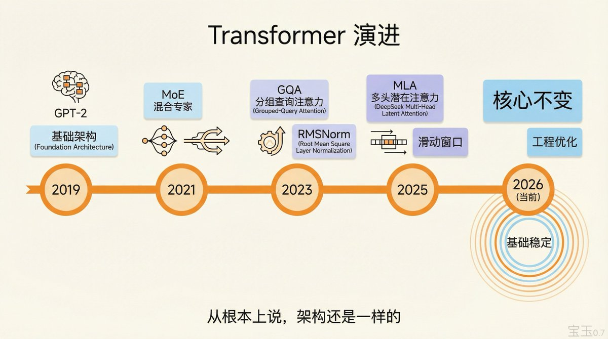

## 规模定律：死了还是活着？

这是个敏感话题。"预训练规模定律已死"这句话在圈内流传很广。

Nathan 先给了技术定义：规模定律是计算量/数据量（x 轴）和预测准确率（y 轴）之间的幂律关系。这个关系仍然存在。问题是：用户能从中得到什么？

现在有三种扩展方式：

1. 预训练扩展：模型大小 + 数据量

1. 强化学习扩展：RL 训练时间

1. 推理时扩展：生成更多词元

"我还是比较乐观的。这三种方式都还在起作用，只是容易摘的果子已经被摘得差不多了。"

Nathan 解释预训练变贵的原因：训练一个万亿参数模型意味着你要向用户提供一个巨型模型，服务成本极高。DeepSeek 预训练成本约 500 万美元听起来不多，但服务百万用户的推理成本是"真正数十亿美元"的开销。

Sebastian 的观点更平衡："我不会说预训练扩展已死，只是现在有其他更有吸引力的扩展方式。"

在理想世界里，你会同时做预训练、中训、后训、推理时扩展——如果有无限计算资源的话。现实是你要选择把钱花在哪里。

GPT-4.5 就是一个例子：预训练一个更大的模型，性价比不如用 o1 这样的推理时扩展。

Nathan 预测 2026 年会出现 2000 美元/月的订阅服务——是现在 200 美元的 10 倍。新的 Blackwell 计算集群正在上线，实验室会有更多训练计算资源。

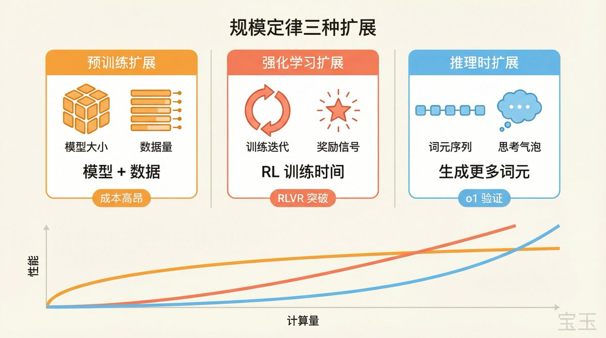

## 训练流程详解：预训练、中训、后训练

Sebastian 给了清晰的定义：

预训练：经典的下一个词预测，在海量互联网数据、书籍、论文上训练。现在不只是扔原始数据进去，还包括合成数据——把维基百科文章改写成问答格式，用光学字符识别提取 PDF 文本，清理和重组数据。

"更高质量的数据让模型训练更快。如果语法和标点都正确，它直接学到正确的方式，而不是先学错再纠正。"

中训：类似预训练但更聚焦，比如专门针对长上下文文档。为什么单独拎出来？因为长上下文文档本来就少，而且神经网络有"灾难性遗忘"问题——学新东西会忘旧东西。中训是一种选择性的、高质量的阶段。

后训练：所有微调阶段，包括 SFT（监督微调，用人类标注的问答对训练）、DPO（直接偏好优化）、RLVR（可验证奖励强化学习，用可验证的正确答案作为奖励）、RLHF（人类反馈强化学习）。这里不是教模型新知识，而是"解锁"它已有的能力。

Nathan 补充了数据规模的概念：小型模型的预训练数据集是 5-10 万亿词元，通义千问据说到 50 万亿，闭源实验室传言达到 100 万亿。但这只是原始数据，实际训练的是筛选后的一小部分。

关于合成数据，两人都强调：这不等于"AI 编造的数据"。它包括光学字符识别提取、格式转换、数据清洗——很多是技术处理而非凭空生成。

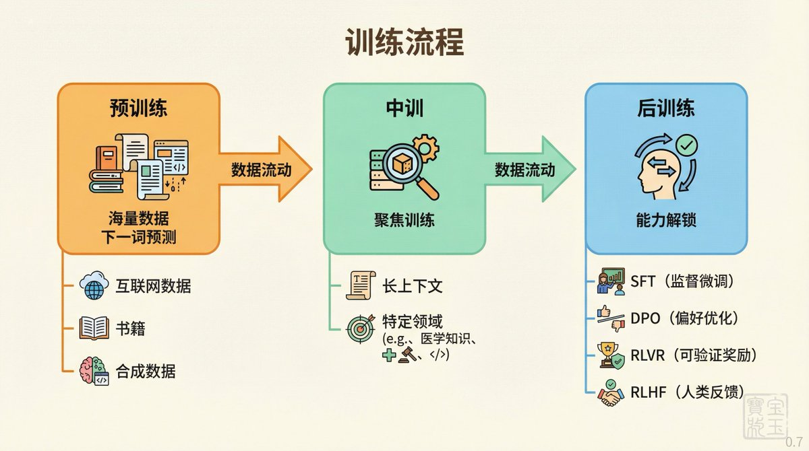

## 后训练前沿：RLVR 与 RLHF

Nathan 说 2025 年后训练最大的突破是 RLVR（可验证奖励强化学习）。

机制很简单：模型尝试解题，验证答案正确性，正确性作为强化学习的奖励信号。这让模型能学习工具使用、代码执行、自我纠错等行为。

"推理时扩展和 RLVR 训练之间有一种完美的耦合。"

Sebastian 做了一个实验：用 RLVR 对通义千问 2.5 基础模型训练仅 50 步，MATH-500 准确率从 15% 跳到 50%。

"你不可能在 50 步里真的学会数学。知识早就在预训练阶段存在了，RLVR 只是解锁它。"

关于 DeepSeek R1 论文里著名的"顿悟时刻"——模型自发说"啊，我做错了，让我再试一次"——Nathan 持怀疑态度：

"这些'顿悟时刻'可能是假的。"

他的理由是：预训练数据中肯定包含类似内容——数学讲座转录、教学视频字幕，里面充满了老师的自我纠错。RLVR 不是发明新行为，是放大已有模式。

Sebastian 补充：这就是为什么蒸馏能奏效。如果模型真的在 RLVR 过程中学到全新的数学能力，蒸馏应该不可能。

RLVR 与 RLHF 的关键区别

Nathan：RLHF 有天然上限。偏好是主观的、可平均的，训练到一定程度后继续投入计算没有意义。历史上的 RLHF 规模定律论文标题是《奖励模型过拟合的规模定律》——讲的是过拟合问题，不是持续提升。

但 RLVR 不同。OpenAI 的 o1 论文展示了真正的规模定律：计算量对数增长，性能线性增长。DeepSeek 复现了这个结果。

"你可以让最好的 RLVR 训练多跑 10 倍，获得更好的性能。但 RLHF 做不到。"

这将定义这个领域。

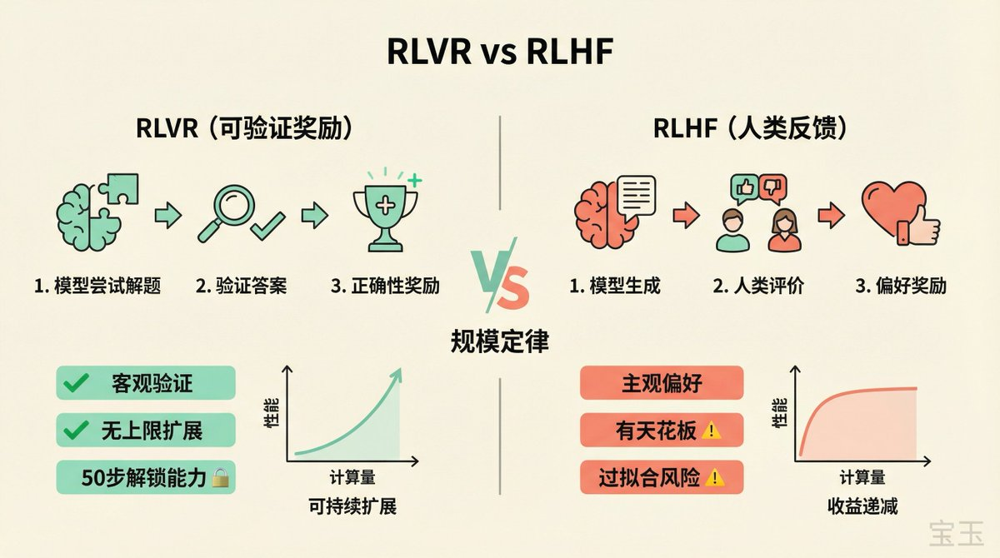

## 入行建议：如何进入 AI 研发

Sebastian 的建议：从零实现一个小模型。

"目标不是做一个日常使用的个人助手，而是理解大语言模型里面到底有什么。"

在你的笔记本上跑，理解预训练、注意力机制、微调。然后你会遇到瓶颈——大规模训练的复杂性：参数分片、键值缓存实现细节、分布式系统。

"书里的代码是为了理解，不是为了生产。一旦你有了基础，你就能读懂生产级代码。"

一个实用技巧：从 Hugging Face Transformers 库加载预训练权重，然后在你自己的架构实现里跑。如果输出一致，你的实现就是对的。

Nathan 的建议更偏向职业路径：

对于零计算资源的研究者，最有影响力的路径是：创建让前沿模型失败的评测基准。如果你的基准被 Claude 或 GPT 下一版在博客里引用，职业生涯起飞。

"你可能需要花几周时间真正理解一个狭窄的领域。但一旦你做到，可能全世界只有 2-3 个人在深度关注这个问题。找到他们，给他们发邮件。"

他举了一个例子：一个牛津学生联系他，对"角色训练"感兴趣——如何让模型变得幽默、讽刺或严肃。Nathan 指导了他，论文已经发表。当时全球可能只有 2-3 个人在深度关注这个话题。

另一条路是加入前沿实验室。Nathan 说，如果你进了 OpenAI，最有影响力的贡献方式可能不是"发明下一个 o1"，而是：找到更好的数据，或让团队实验速度提升 5%。

"花哨的算法工作是最性感的想法，但大多数贡献是让数据更好，或让基础设施更好。"

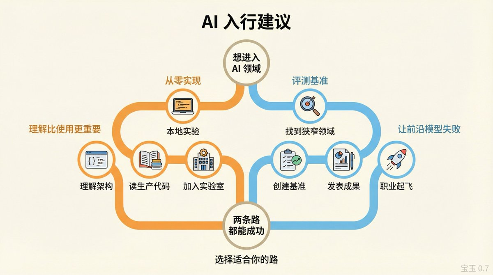

## AI 工作文化：996 与幸福感

Lex 提到 996——早 9 晚 9，一周 6 天。这原本是中国科技公司的文化，现在已经渗透硅谷 AI 实验室。

Sebastian 说他在学术界时也是这种状态——教授要写科研经费申请、教课、做研究，三份工作合一。但现在看来，前沿实验室的压力可能更大。

Nathan 的观察更直接：

"我那些当教授的朋友，平均来看比在前沿实验室工作的朋友更幸福。"

OpenAI 平均每位员工每年获得超过 100 万美元股票薪酬。但高薪不等于幸福。

教授有学生辅导带来的成就感，有稳定的研究方向，有明确的使命感。而实验室的节奏是无止境的竞争——模型在互相追赶，没有终点。

Nathan 提到帕特里克·麦基的书《苹果在中国》：苹果在中国建供应链时有"拯救婚姻项目"的代号——当工程师必须回家挽救婚姻时，同事会进入紧急接替状态。

"有人因这种程度的过度工作死亡。"

Sebastian 补充：很多时候不是被强迫的，是太热爱这件事了。他自己也有过过度工作导致的身体问题——背痛、颈椎问题。"不是因为有人逼我，是因为我想工作，因为这东西太激动人心了。"

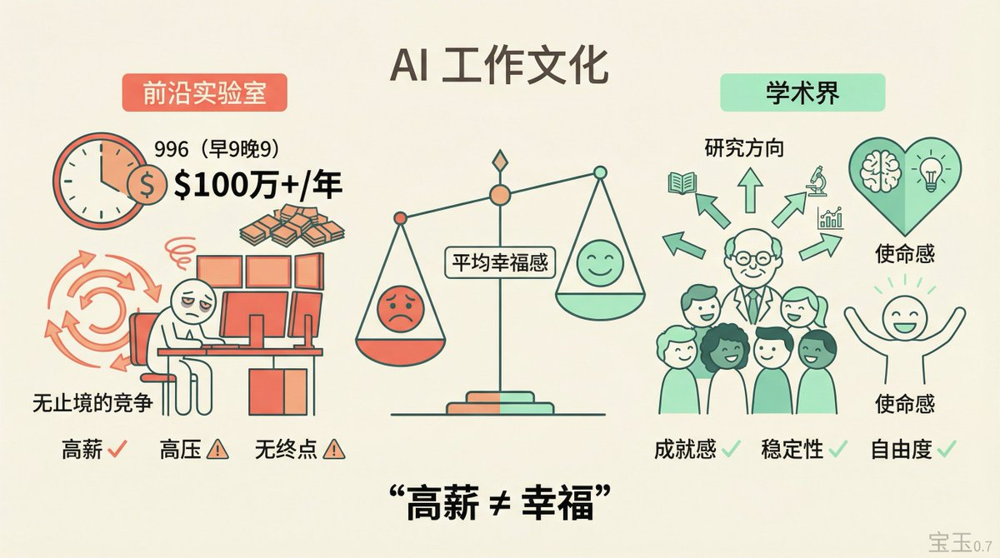

## 硅谷泡沫

Lex 提到他和各种各样的人交流，能清楚看到各种"泡沫"和"回声室"。硅谷毫无疑问是一个。

"泡沫实际上可以非常有用和有效。"它像乔布斯的现实扭曲场——你们互相说服突破即将到来，然后突破真的就来了。

Nathan 提到伯恩·霍巴特的泡沫分类：金融投机型（坏的）和基础设施建设型（好的）。AI 目前处于后者，但有转向前者的风险。

一个极端例子是"永久下层阶级"这个梗，意思是 2025 年下半年是唯一能在 AI 创业中创造持久价值的窗口，否则所有价值都将被现有公司捕获，你就会变穷。

"这是旧金山 AI 圈文化走向极端的例子。"

Lex 的建议：如果你要进入这个泡沫——它确实有价值——也要出来。读历史书，读文学，去世界其他地方看看。推特和 Substack 不是整个世界。

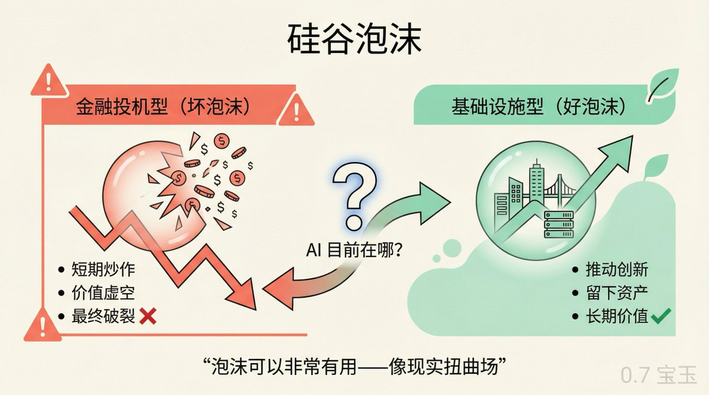

## 新研究方向：文本扩散模型

Sebastian 介绍了一个正在冒头的替代架构：文本扩散模型。

原理类似图像生成的 Stable Diffusion——从随机噪声开始，迭代去噪。但应用到文本上，不是一个词元一个词元生成，而是并行填充多个位置。

优势是可能更快。但权衡在于某些任务本质上是串行的，比如需要中间结果的推理任务、需要调用工具的场景。

Nathan 提到一个实际用例：代码创业公司用文本扩散生成超长的代码差异，因为自回归模型生成这种东西需要几分钟，用户流失严重。

谷歌宣布推出 Gemini Diffusion，定位是 Nano-2 模型同等质量但更快。

Sebastian 的判断：文本扩散不会取代自回归 Transformer，但会成为"廉价快速选项"——也许是免费层级的选择。

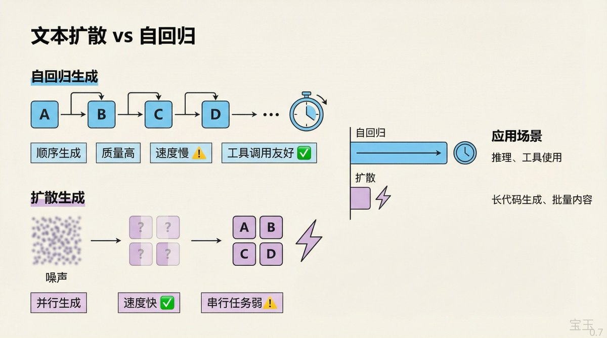

## 工具使用

Sebastian 强调 GPT-o1（OpenAI 的开源模型）是第一个真正为工具使用设计训练的公开模型。这是一个范式转变。

"大语言模型最常见的抱怨是幻觉。解决幻觉最好的方式之一是：不要试图记忆一切。数学问题？用 Python 计算器。历史问题？做网络搜索。"

但开源生态对工具使用的支持仍然滞后。部分原因是信任问题：你不想让大语言模型在你电脑上有执行任意命令的权限。需要容器化、沙箱等基础设施。

Nathan 指出开源和闭源模型在工具使用上的不同处境：

闭源模型（ChatGPT、Claude）可以深度集成特定工具——搜索、代码执行、文件系统。用户体验是无缝的。

开源模型需要兼容各种用户自定义的工具配置。你用 OpenRouter 可能想接不同的搜索后端，这就需要模型更通用、更灵活，但也更难优化。

Sebastian 提到一篇 2024 年底的论文《递归语言模型》：将长上下文任务分解为子任务，递归调用大语言模型解决每个子任务，每个子任务可以调用工具。

"你不是把所有东西塞进一个长上下文，而是分解成多个小调用。这样节省内存，准确率还更高。"

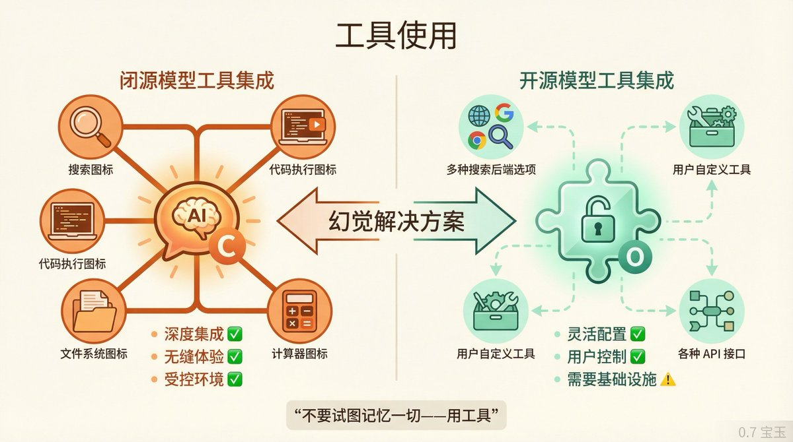

## 持续学习

这是 AGI 讨论中的关键缺失能力。

Nathan 解释：当前大语言模型无法像人类员工那样从反馈中快速学习。你告诉一个编辑他犯了错，好编辑下次不会再犯。但大语言模型做不到，它的权重是固定的。

如果我们想要一个能"替代远程工作者"的系统，它需要能从在职学习中快速适应。

但 Nathan 对"必须更新权重"持怀疑态度：

"我对语言模型通过很好的上下文就能快速学习比较乐观。你可以写详细的文档——'这是我写过的所有博客，我的风格基于这些'。但很多人不提供这些给模型。"

也许不需要真正的持续学习，只需要足够好的上下文工程。

Sebastian 补充了障碍：为每个用户更新权重太昂贵了。即使是 OpenAI 的规模，为每个用户定制模型也不现实。

可能的突破口是设备端模型，比如苹果智能，成本由消费者的硬件承担。

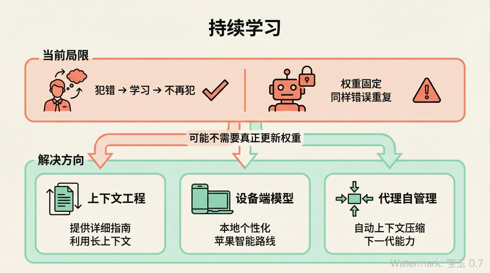

## 长上下文

Nathan 说业界普遍认为长上下文是计算和数据问题。你可以用架构变体（混合注意力模型）来降低计算成本，但这些不是免费的——需要配合大量计算和正确的数据。

"100 万词元的序列在世界上有多少？这些数据从哪来？训练成本很高。"

目前已经很快到达 100 万词元窗口。Nathan 预计今年会增长到 200 万或 500 万，但 1 亿词元不太可能很快实现。

关于后训练的有趣方向：让代理自己管理上下文。

Claude 用户都知道"压缩"的痛苦，当对话太长时，Claude 会把整个历史压缩成要点列表。Nathan 说下一代模型可能会训练"压缩作为一种动作"，模型自己决定何时压缩、如何压缩，目标是最小词元数保持最大性能。

Sebastian 提到 DeepSeek-V3 的稀疏注意力机制，用轻量级索引器选择"实际需要注意的词元"，而不是注意全部。这是在全注意力和压缩之间寻找平衡。

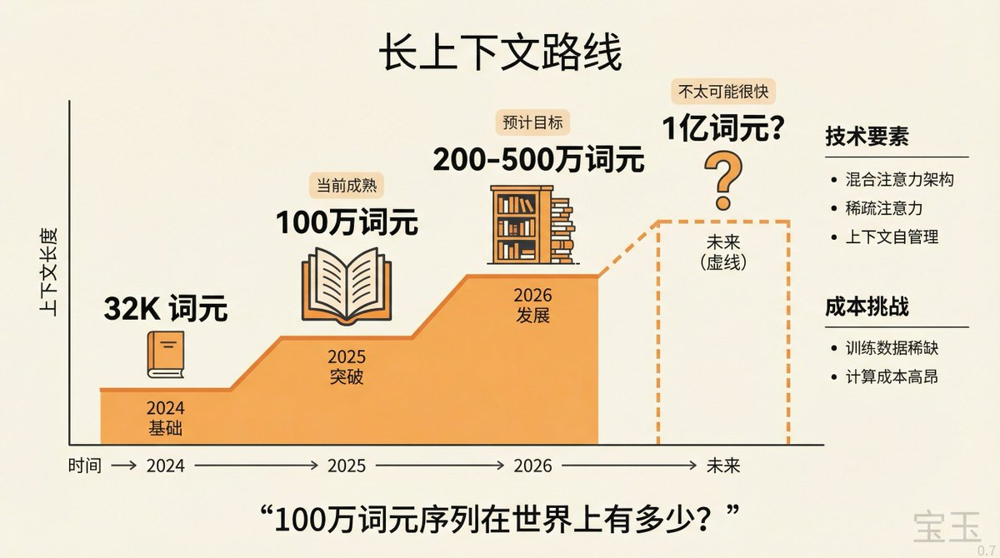

## 机器人

Lex 说他最近脑子里一直在想机器人。这是一个几乎没在播客里讨论的领域。

Nathan 对这个领域的投资很兴奋，大语言模型的基础设施正在惠及机器人领域。Hugging Face 可能会成为机器人模型的开源生态中心——下载模型、微调、共享数据集。

但他对消费级家用学习型机器人非常悲观。

"我对自动驾驶非常乐观，对工业自动化非常乐观——比如亚马逊专门为机器人设计的配送中心。但家用机器人？"

家庭环境太复杂了。每个人的家都不一样，机器人需要在现场快速适应，回到持续学习的瓶颈。

Lex 提了一个几乎没人讨论的问题：安全。

"学习机器人的所有有趣复杂性，我们讨论的所有失败模式，在大语言模型领域这都是好玩的。但在机器人领域，在人们家里，在数百万分钟和数十亿次交互中，你几乎不允许任何失败。"

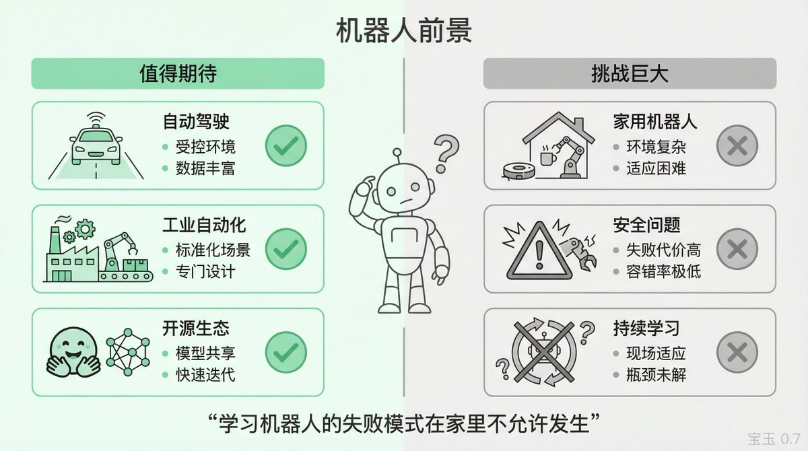

## AGI 时间线

Nathan 说 AGI（通用人工智能）和 ASI（超级人工智能）的定义争议很大，但"能替代大多数远程工作者"是一个相对合理的标准。

AI 2027 报告（原《态势感知》）的预测已从 2027-28 年推迟到 2031 年（均值预测）。

Lex 的判断更保守，"甚至比 2031 还要远"。

Nathan 的核心论点是 AI 能力是"锯齿状的"，某些事情非常擅长，某些事情很差。

"这些模型在传统机器学习、前端方面非常出色。但分布式机器学习训练？模型实际上相当差，因为这方面的训练数据太少了。"

他不相信"自动化软件工程师"会完全实现，因为这意味着在所有领域都达到超人水平。更可能的是，模型在某些代码领域已经超人，人类填补它们的弱点，两者配合快速前进。

"到今年年底，被自动化的软件量将非常高。但像用多组 GPU 通信训练强化学习模型这样的事仍然很难，可能一两年后会容易很多。"

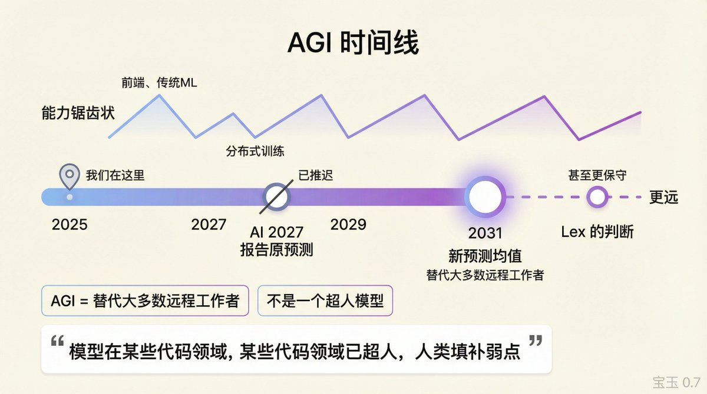

## 程序员会被取代吗？

Nathan 的判断：软件工程会变得更偏向系统设计和结果导向。

"人们从说'AI 代理是垃圾货（slop）'到'软件的工业化，任何人都能用自己的指纹创建软件'，只花了几周时间。"

一个惊人的细节：Cursor 的 Composer 模型（基于中国大型混合专家模型微调——有时用中文回复可以判断出来）"每 90 分钟根据真实用户反馈更新模型权重"。

"这是我见过的最接近现实世界强化学习的实践。"

Sebastian 提了一个务实的问题：需求规格。

"问题是你还得告诉大语言模型你想要什么。大语言模型可以写代码，但你需要告诉它目标是什么。"

Lex 认为这是人类技能问题。很多程序员对 AI 工具持怀疑态度，可能部分是因为他们没学会如何正确使用——清晰的规格、足够的上下文、正确的期望。

Nathan 补充：失败模式目前很蠢。"Claude，你试了 14 次我没装的命令行工具，然后我发给你要运行的命令。"从建模角度看，这是可修复的问题。

9

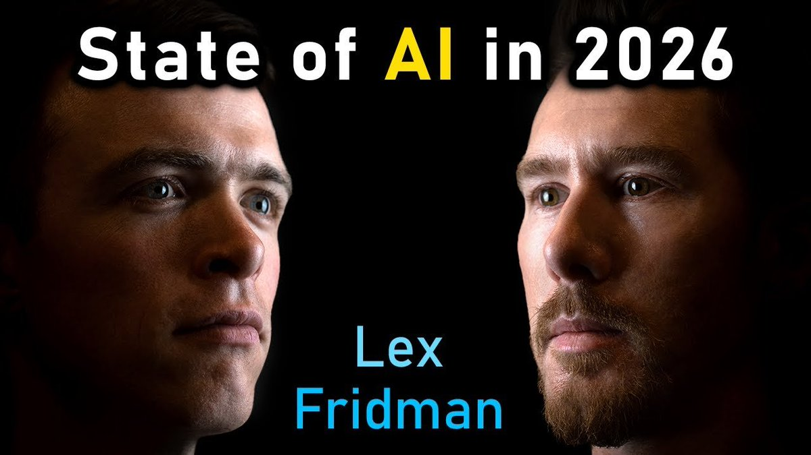

## AGI 梦想是否在死去？

Nathan 说了一句大胆的话：

"'一个模型统治一切'的梦想正在死去。"

他的理由是：Claude 虽然是通用模型，但它越来越依赖集成——搜索、代码执行、文件系统。真正的用法是 Claude + 工具，不是纯 Claude。

未来可能是多个代理处理不同任务，互相协调。不是一个超级大脑，是一群专家组成的团队。

Sebastian 同意但提了一个反问：那这真的是 AGI 吗？"我们正在专业化。这和以前的专用算法有什么本质区别？"

他认为真正的突破是有了"基础模型可以专业化"——这是新的。但如果 AGI 的实现方式是一堆专用系统的组合，那这个词的含义需要重新思考。

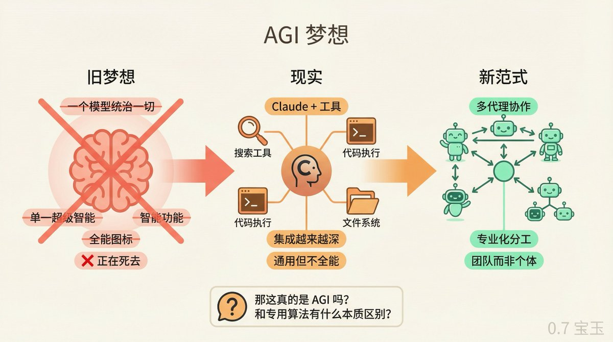

## AI 如何赚钱？

Sebastian 提到广告是必然的。

"我几年前就提过：如果你问推荐跑鞋，耐克先出现是巧合吗？"

Nathan 说问题是竞争，只要有一家不放广告，用户就会流向那里。目前大家都在用风投的钱补贴，没人想先动。

但他认为广告可以是好的："如果我是一个做世界上最好牛排刀的小公司，我想让需要的人找到我。AI 如果能让这种匹配更好，对世界是好事。"

坏的是让人上瘾的信息流以展示更多广告。

他预测 10 年后的格局：靠广告收入可以补贴更好的研发、训练更好的模型。YouTube 就是这个逻辑，广告收入让它主导视频市场。

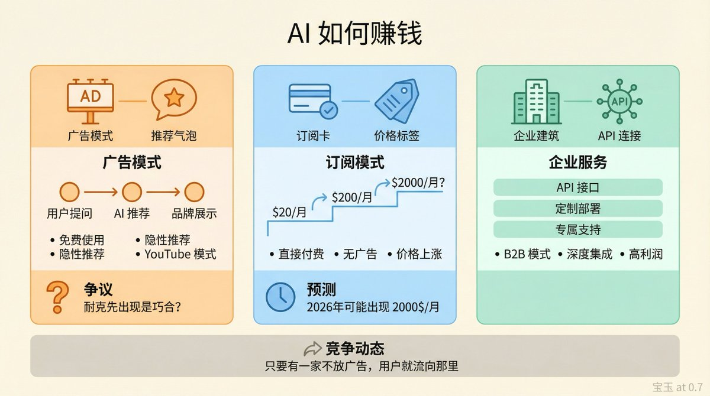

## 2026 年大收购

Nathan 预计 200 亿美元级别的收购会变得常见。Groq 被收购（传闻约 200 亿），Scale AI 估值近 300 亿。

但他担心一种新型交易结构：授权协议而不是真正的收购。这对硅谷生态有害，不是全员受益的收购，而是只带走顶尖人才。

"如果你加入创业公司，即使它不那么成功，公司被收购时你的股权会变现。但这种授权协议只带走高管。"

关于首次公开募股：只要融资容易，这些公司不会上市。公开市场会带来压力。但 MiniMax 和智谱 AI 已经在中国提交了上市申请。

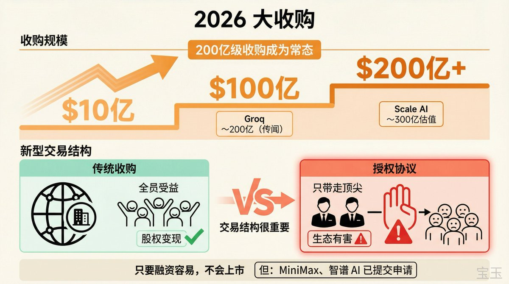

## 各大公司前景

OpenAI：总是看起来混乱，但总能落地。GPT-5 的路由功能可能帮他们省了很多 GPU 成本。

Anthropic：文化上最不混乱，在企业和软件市场持续成功。

谷歌：规模优势，自研芯片不用付英伟达的利润空间，数据中心先发优势。如果有新范式，最可能来自 OpenAI；如果是规模竞争，谷歌更有利。

Meta/Llama：完蛋了。Nathan 预测不会有开源的 Llama 5。

"内部政治斗争、激励错位、研究者追求最佳模型与管理层追求公关的冲突。"

扎克伯格 2024 年 7 月写了"可能是当时最好的开源 AI 案例"博文，2025 年 7 月就说"我们正在重新评估与开源的关系"。

Sebastian 补充：开源社区对 Llama 的批评可能太苛刻了。"我们作为开源开发者可能有点太严厉了。他们试图做好事，给我们开源模型，然后我们说负面的话，他们的反应是'好吧，那我们就改变主意'。"

ATOM 项目

Nathan 发起了 ATOM（美国真正开放模型），目标是让美国建立最佳开源模型。

"这些中国开源模型正在积累影响力。如果最好的研究发生在使用中国模型的基础上，价值就流向那里了。"

美国国家科学基金会给 AI2 提供了 1 亿美元 4 年拨款——基金会史上最大的计算机科学拨款。英伟达也在加大 Nemotron 等开源模型的投入。

但他强调：任何开源模型都是有价值的模型。他不是要"禁止中国模型"，而是要美国在开源领域有竞争力。

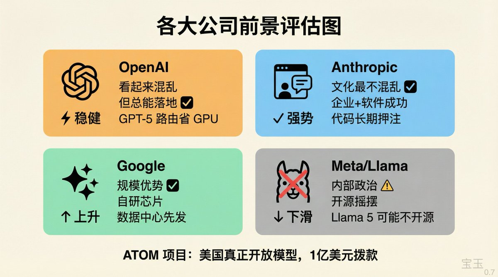

## AI 曼哈顿计划

Lex 提到 AI 2027 报告的一个叙事：随着 AI 变强，国家安全担忧会导致集中化——实验室合并、保密加强、军方介入，变成中美之间的竞赛。

Sebastian 不同意这会在 2025-27 年发生：

"你可以对计算机说同样的话——'计算机太强大了，不能让公众拥有'。或芯片。看看华为现在在造芯片。你无法控制知识的传播。"

Nathan 提了一个有趣的反向思路：开源模型的"曼哈顿计划"成本其实不高。

"一亿美元左右就能训一个前沿开源模型。对这些公司来说这不算什么。"

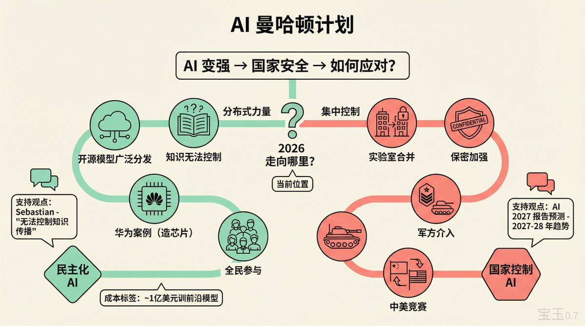

## 英伟达与计算未来

Sebastian 说英伟达的真正护城河不是 GPU，是 CUDA 生态系统，二十年积累的软件栈。

"即使 15 年前我做生物物理模拟时，我们就用 Tesla GPU。他们在这上面投资了很久。"

Nathan 说只要黄仁勋还这么深度参与运营，英伟达就会持续创新。"他的投入程度和其他大公司很不一样。"

关于太空数据中心的想法：问题不是能源（太阳能充足），是散热，太空没有空气散热，还会接收太阳辐射。但有大量空间可以放集群，工程上可能可以解决。

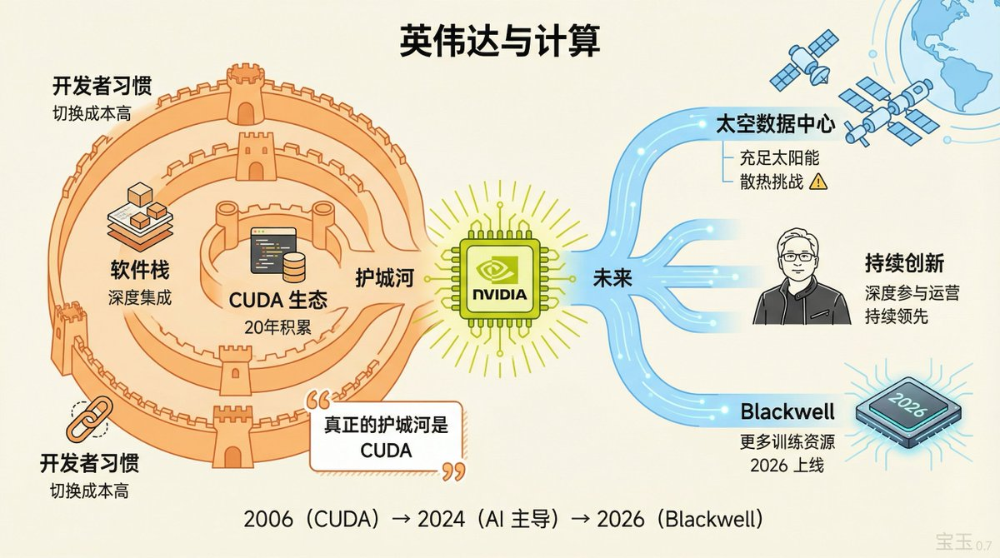

## 人类文明的未来

Lex 问：100 年后，历史学家会怎么看我们这个时代的技术突破？

Sebastian：可能不会记得"AI"或"Transformer"。会记得的是"计算"，就像我们说"工业革命"而不是"蒸汽机"。

Nathan 补充："深度学习"这个词大概率会留下来。

关于人类与机器的关系，Sebastian 说他不担心 AI"接管"：

"我们人类决定我们想做什么。AI 在当前实现中——你必须告诉它做什么。它不会自己获得代理权。你仍然是负责人。"

Nathan 对未来几年的预测：

"物理商品和线下活动的价值会急剧上升。垃圾内容只会更多。接下来几年会有更多、更多样的 AI 生成垃圾内容。"

他希望社会"淹没在垃圾内容中然后醒悟"，意识到数字内容太多、太廉价，然后物理存在变成稀缺品。

Sebastian 说即使是现在，如果他知道一篇文章明显是 AI 生成的，他就不想读了。"算了，不适合我。"

Lex 最后问：有什么让你们对人类文明的未来抱有希望？

Nathan 的回答：

"人类总能找到办法。这就是人类生来要做的——建立社区，想办法解决问题。这就是我们走到今天的方式。"

Sebastian 的回答：

"完全同意。如果有什么会出错，那是因为有东西被明确编程去做有害的事。AI 本身不会'接管'。"

Lex 的结尾：

"如果是人类和机器的后奇点、后末日战争，我认为人类会赢。我们太聪明了。很难解释我们怎么会想出办法，但我们会的。而且我们可能会用本地大语言模型、开源大语言模型来帮助对抗机器。"

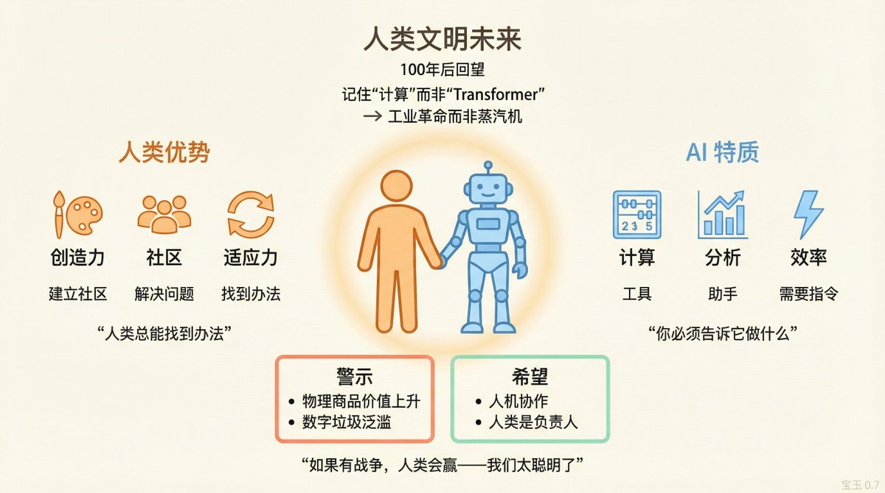

这场 4 小时的对话覆盖了 AI 的几乎所有维度：技术细节、商业逻辑、人才市场、社会影响、哲学思考。两位嘉宾都是真正在一线的人，他们的判断不一定对，但至少是基于真实经验。

如果要提炼一个核心主题：AI 正在快速进步，但不是以人们想象的方式。架构没怎么变，"突破"很多是工程优化，AGI 可能不是"一个模型"，而人类的位置仍然是核心的、不可替代的。

### 🖼️ Attached Media

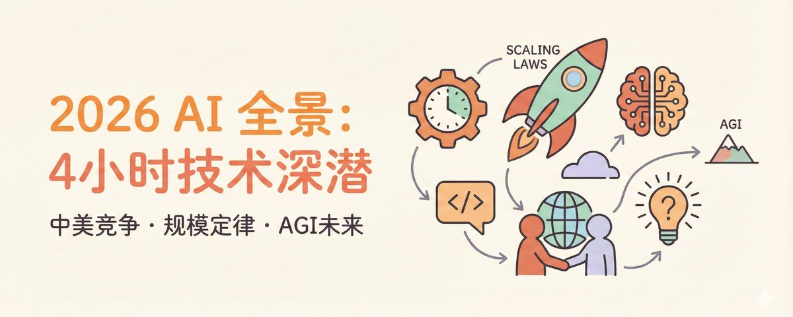

## 💬 Replies

### 1 @Rallyyds (Rally)

*Sun Feb 01 14:42:28 +0000 2026*

@dotey 宝玉老师，我可以拿去国内平台吗，会署名

### 2 @dotey (宝玉) (Author)

*Sun Feb 01 16:58:58 +0000 2026*

@Rallyyds 著名不要标记原创即可

### 3 @Charlie181065 (Charlie)

*Sun Feb 01 13:49:49 +0000 2026*

@dotey 谢谢分享

### 4 @dotey (宝玉) (Author)

*Sun Feb 01 17:02:34 +0000 2026*

@Charlie181065 [github.com/jimliu/baoyu-s…](https://github.com/jimliu/baoyu-skills)
里面的文章插图 skill，选信息图，可以自定一下样式，密度上让它选所有章节 

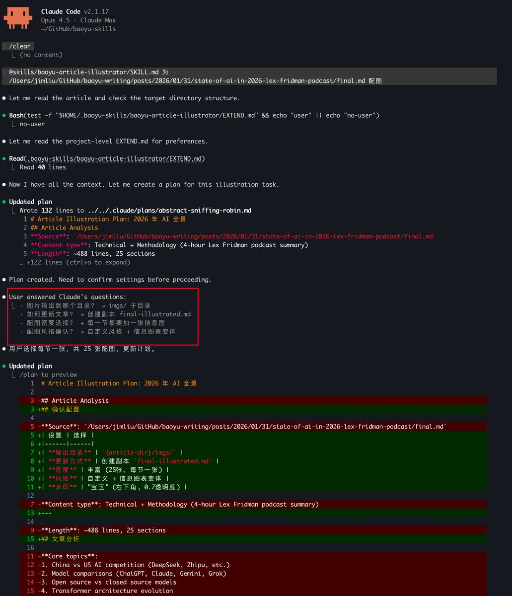

### 5 @linzhiyang7 (Wisdom_Yang)

*Sun Feb 01 12:32:33 +0000 2026*

"物理商品和线下活动的价值会急剧上升。垃圾内容只会更多。接下来几年会有更多、更多样的 AI 生成垃圾内容。"

我也非常同意這點，所以....有演唱會就去看吧！我相信票會越來越貴的

### 6 @MarshalXuan (轩帅)

*Mon Feb 02 10:32:39 +0000 2026*

@dotey 最近读过最长、内容最密集的文章；决定收藏起来，期望三个季度后，可以回来再看看，看看哪些观点仍旧适用（从过去的经历来看，除了人性之外的大多数事物，其发展与实时预期并不相符，对于未来，拭目以待）。

### 7 @sage_rabi (loopcat)

*Sun Feb 01 06:20:35 +0000 2026*

@dotey Agent加持下宝玉老师太高产了！

### 8 @jasongyang365 (jasonyang365)

*Sun Feb 01 11:47:00 +0000 2026*

1\. AI架构没变，进步来自数据和工程
“从根本上说，架构还是一样的”，MoE/MLA/GQA都是增量改进
最有影响力的贡献不是“发明下一个o1”，而是“找到更好的数据，或让实验速度提升5%”

2\. AI能力天然是“锯齿状”的
某些任务已超人（传统ML、前端），某些仍很差（分布式训练）
不相信"自动化软件工程师"会完全实现，人类价值在于"填补模型弱点"

3\. “一个模型统治一切的梦想正在死去”
未来是多个代理互相协调，不是一个超级大脑
“如果AGI通过专用系统组合实现，这个词的含义需要重新思考”

### 9 @Ni_luvya (岛)

*Mon Feb 02 10:10:51 +0000 2026*

@dotey 没想到从这也能看到中国公司996😂

### 10 @Michaelzsguo (Michael Guo)

*Sun Feb 01 12:06:46 +0000 2026*

@dotey 好久没听lex Friedman 了，以前经常听。 这集值得回去。

### 11 @OwlStreetCan (Owl Street)

*Sun Feb 01 12:09:45 +0000 2026*

@dotey 很好，涨见识

### 12 @Michaelzsguo (Michael Guo)

*Mon Feb 02 12:38:42 +0000 2026*

@dotey 刚刚开始听了。 感觉lex还有两个嘉宾好像是从石头纪回来的，还在谈去年的事儿，用浏览器大模型，其中一个还对tool use抱有怀疑不敢用。really, that’s the basic of agent😜
硬着头皮继续听

### 13 @bigworldcoming (old man)

*Sun Feb 01 14:53:33 +0000 2026*

@dotey @grok 总结一下

### 14 @qch1209 (LUKE C)

*Sun Feb 01 14:39:15 +0000 2026*

@dotey 很精彩，但人类必胜这个观点不见的，至少不是所有人类

### 15 @VitoLiu678 (Vito Liu)

*Sun Feb 01 08:24:12 +0000 2026*

@dotey @threadreaderapp  unroll

### 16 @guoyuan6 (Wheeler)

*Sun Feb 01 15:32:58 +0000 2026*

@dotey 宝玉老师，里面的图都是怎么生成的，能否分享一下作图思路以及相关的提示词。同求。就是能录下操作吗？你这个配图的效果我始终AI出不来跟你一样的。

### 17 @wang_yi81231 (王毅)

*Sun Feb 01 13:55:10 +0000 2026*

@dotey 宝玉老师，里面的图都是怎么生成的，能否分享一下作图思路以及相关的提示词

