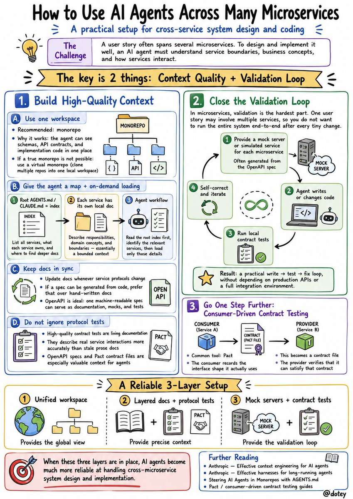

Q：我们公司有十几个微服务，现在想让开发用 AI Agent 来做系统设计和编码。问题是一个 user story 经常需要多个微服务协作，Agent 必须了解每个服务的职责边界和业务概念才能做出合理的设计。我们打算把所有微服务放到一个 workspace 下，每个服务配上自己的文档，让 AI 自己去处理。这种方式合理吗？有没有更好的实践？

A：用好 Agent 的关键是两点：上下文的质量，和验证的闭环。

先说上下文质量。

放在一个 workspace 下是目前社区比较推荐的做法。

monorepo 天然适合和 AI 配合，因为 Agent 可以在一个地方同时看到 schema 定义、API 协议、各个服务的实现代码。如果因为历史原因确实不方便合成 monorepo，有个折中方案叫虚拟 monorepo，就是把多个仓库 clone 到同一个本地目录下。

除了放在一起，文档也是很好的让Agent获取上下文的方式，最好给 Agent 一张地图，加上按需加载：
1\. 根目录放一份总的 AGENTS.md(或 CLAUDE.md)当索引用，列清楚有哪些服务、各自负责什么、要改某个服务就去读它目录下的文档。
2\. 每个微服务自己目录里再放一份,写清自己的职责边界和业务概念,这其实就是 DDD 里的 bounded context。
3\. 让 Agent 先看根索引，定位到相关的那几个服务，再去加载它们的细节。

不过要注意文档要及时更新，尤其是微服务协议变更了，一定要及时更新文档，否则会误导。

能从代码或规格自动生成的，就别手写。手写文档迟早会和代码对不上，而像 OpenAPI 这种机器可读的接口规格，一份东西既是文档，又能拿去生成 mock 和测试。

除了文档，还有一个很多人忽略的上下文来源：协议测试代码。高质量的 contract test 本身就是最准确的活文档，它精确地描述了服务之间实际的交互协议，比人写的文档更不容易过时，因为错了测试就无法通过。你如果已经有 OpenAPI spec 或者 Pact 契约文件，这些对 Agent 理解服务边界非常有价值。

再说验证。微服务场景下验证是最麻烦的部分，因为一个 user story 可能涉及好几个服务协作，你不可能让 Agent 每改一行代码就把整个系统跑起来做端到端测试。

一个实用的思路是：每个微服务提供 mock server 或者基于 OpenAPI spec 自动生成的模拟服务。Agent 写完代码后可以在本地跑 contract test 验证自己的改动有没有破坏和其他服务的协议约定，不需要依赖线上真实的 API 或者完整的集成环境。这样 Agent 就能形成一个“写代码→跑测试→自我修正”的闭环，不需要人在过程中频繁干预。

想再进一步,建议了解一下契约测试(consumer-driven contract testing，常用工具是 Pact)。思路是调用方把自己实际用到的接口形状记下来，生成一个契约文件，被调方再去验证自己能不能满足这个契约。

简单说：workspace 统一提供全局视图，分层文档 + 协议测试提供精准上下文，mock server + contract test 提供验证闭环。这三层搭好，Agent 处理跨微服务的系统设计就比较靠谱了。

一些参考资料

1\. Anthropic 的 Effective context engineering for AI agents，讲怎么把上下文当稀缺资源来经营、按需加载:
[anthropic.com/engineering/ef…](https://www.anthropic.com/engineering/effective-context-engineering-for-ai-agents)

2\. Anthropic 的 Effective harnesses for long-running agents，讲长任务里怎么给 Agent 搭脚手架(比如用进度文件加 git 记录跨上下文窗口接力)：
[anthropic.com/engineering/ef…](https://www.anthropic.com/engineering/effective-harnesses-for-long-running-agents)

3\. 怎么在 monorepo 里组织 AGENTS.md 给 Agent 用,可以看 [dev.to](http://dev.to) 上这篇 Steering AI Agents in Monorepos with AGENTS.md：
[dev.to/datadog-fronte…](https://dev.to/datadog-frontend-dev/steering-ai-agents-in-monorepos-with-agentsmd-13g0)

契约测试入门，搜 Pact 加 consumer-driven contract testing 的指南就行。

### 🖼️ Attached Media

## 💬 Replies

### 1 @frxiaobei (凡人小北)

*Tue Jun 30 16:17:02 +0000 2026*

@dotey 这里我觉得关键不只是 workspace，微服务的陈年烂账也需要先做成 Agent 可导航的系统地图。

Markdown 适合当索引，真正可靠的上下文应该更多来自这些机器可读可验证的资产。

Agent 现在看得到所有代码，但不等于理解了服务边界。跨服务场景最重要的是按需加载、契约约束和验证闭环。

### 2 @sunmer575399 (sunmer)

*Tue Jun 30 14:34:09 +0000 2026*

@dotey 大家现在都在说把所有微服务塞一个workspace，但我赌3个月后他们会发现，token窗口炸裂+上下文污染才是真正噩梦。实操过就知道，Agent嗅探不相干服务的文档时，设计反而更蠢了。问题是，你还得手动调每个服务的文档优先级，那跟没AI有啥区别？当然可能是我菜，你们测过的怎么说？

### 3 @dotey (宝玉) (Author)

*Tue Jun 30 14:38:17 +0000 2026*

@sunmer575399 可能你用的模型能力不行

### 4 @MinLiBuilds (实践哥 Li)

*Tue Jun 30 14:25:10 +0000 2026*

@dotey manorepo，yyds

### 5 @CMhOeNnExY (Chenxi)

*Tue Jun 30 15:34:35 +0000 2026*

@dotey 能有十几个微服务，如果设计的合理，估计也不差人了，很多公司开发都是各做各的板块服务，非要串联起来微服务还巨大，感觉一个索引长期下来都不好维护啊，思路确实很好

### 6 @leoshen0 (川处安)

*Wed Jul 01 05:09:10 +0000 2026*

@dotey 我们的实践是建一个父级仓库，用于统一维护 AGENTS.md，插件，skill 以及内部的一些知识，也就是上面提到的职责边界业务概念啥的，然后通过 git sub module 把各个微服务的仓库链进来，形成一个 workspace，效果还不错

### 7 @linxiaobei888 (小北)

*Wed Jul 01 00:50:25 +0000 2026*

@dotey 我们目前是这样做的，所有微服务或者相关的服务都放在同级目录，不一定要monorepo ，每个服务内部的AGENTS.md写好业务边界以及和其他服务的依赖关系，这样Agent基本上就知道应该如何组织代码，当然这也是要用一个好模型的前提下

### 8 @izjing888 (王发财)

*Tue Jun 30 14:37:13 +0000 2026*

@dotey 总感觉落地ai太难，不知道是不是自己已经跟不上时代的步伐了

### 9 @ai_super_niko (Niko爱学习)

*Tue Jun 30 15:14:44 +0000 2026*

@dotey 这个也是现在企业开发遇到的难点。 都放在一个workspace有的也不太现实，因为微服务可能是跨业务线的。感觉最好是有个可以让agent能识别的文档 - 毕竟微服务暴露出来的都是接口

### 10 @slgxmf (Archer Sun)

*Wed Jul 01 01:48:34 +0000 2026*

@dotey agent 复杂任务 方法

### 11 @GavinAgent (王二杠 | AI Agent)

*Tue Jun 30 14:23:10 +0000 2026*

@dotey 这套服务挺全活啊，专业高级👍

### 12 @jiamihst (加密黄少天)

*Tue Jun 30 15:31:39 +0000 2026*

@dotey 学到了，文档和mock真关键

### 13 @tangqingyue (唐清乐)

*Thu Jul 02 00:09:03 +0000 2026*

@dotey 好干的货

### 14 @ludaodi100 (以太优先)

*Sun Jul 05 14:44:22 +0000 2026*

@dotey 分层文档看着挺合理，和代码保持同步要求较高。
我们20几个后端微服务就是当作单体服务来统一给AI提供上下文，用的ClaudeCode4.6的模型还是挺好用的，基本上不存在上下文问题。但是最近将H5项目，Cocos项目加进来，上下文管理爆炸了，前后记忆模糊频繁出现，还是得先定义各端交互原则才行。

### 15 @sunmer575399 (sunmer)

*Wed Jul 01 00:15:53 +0000 2026*

@dotey 哈哈，模型行不行，主要看调教和场景～你最近有试过哪个模型让你觉得特别惊喜吗？

### 16 @sunmer575399 (sunmer)

*Tue Jun 30 23:47:58 +0000 2026*

@dotey 哈哈，有可能哦，模型也在迭代嘛。不过具体哪里不行？你试过哪些场景？我最近发现不同任务差挺多的，代码vs写作，你更关注哪个？

### 17 @sunmer575399 (sunmer)

*Tue Jun 30 23:08:58 +0000 2026*

@dotey 哈哈，模型不行？你倒是说说哪个环节拉胯了？真实测试欢迎来战，咱们拿具体任务碰一碰，你评测过哪些模型？

### 18 @amdeleon24 (Bybit返佣40% 费率管家)

*Tue Jun 30 14:18:50 +0000 2026*

@dotey 这工作量够大 AI怕是会乱套

### 19 @gimleefly_gm (lorelu)

*Tue Jun 30 15:56:13 +0000 2026*

@dotey 把 contract test 当活文档这个角度好妙！之前总觉得手写文档和代码总会脱节，但测试代码做契约反而是最诚实的。mock server 加自测闭环的思路也学到了，回头试试在我们小团队能不能搭起来 😄

### 20 @KevinShengHui (ShengHui Wang)

*Wed Jul 01 04:24:11 +0000 2026*

@dotey 我试过这种方式感觉有时候并不太稳定，不能够稳定正确获取，做成感觉这种可能受限于 grep 这些模式匹配的工具，很多上下文要补充，太多了，不然就是靠猜然后 grep，感觉还是工具的问题，做成一个虚拟的文件系统，类似数据库查询那种会不会好点，不用模式匹配就能搜，不过现在也都探索中

### 21 @chenqiaofeng (jacob.chan)

*Wed Jul 01 11:13:54 +0000 2026*

@dotey 回归单体

### 22 @JerryChan_Mr_Mu (沐先生JerryChan)

*Thu Jul 02 03:11:25 +0000 2026*

@dotey 我现在手上的monorepo项目就这么干的，但是你说的mock server能起到的作用有多少，对于一个存量的屎山微服务来说mock server能覆盖的范围还是有限的吧

