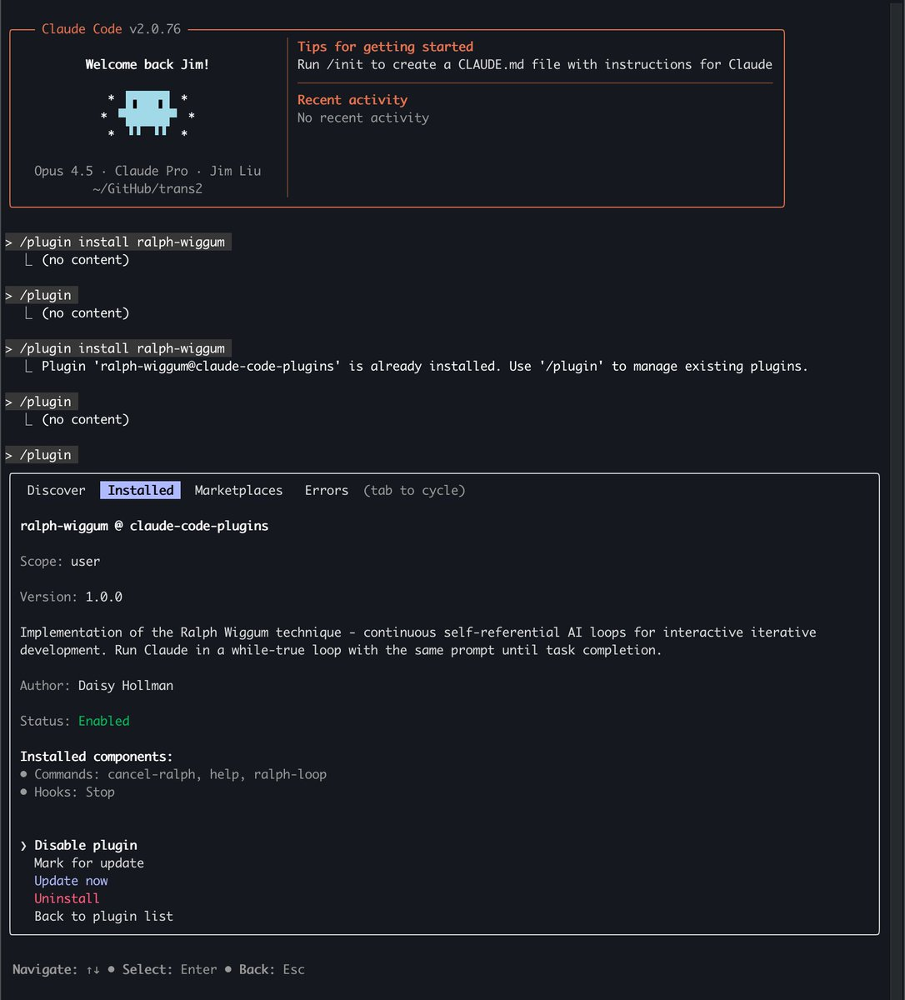
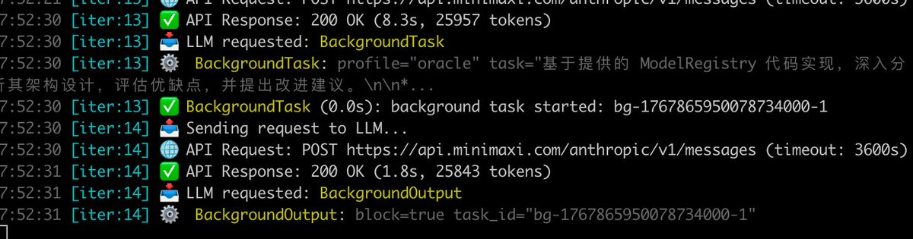

Ralph Wiggum 插件：让 Claude Code “通宵干活”

Ralph 就是一个让 Claude 自己跟自己对话的循环——你下班回家，它替你加班，醒来代码写好了。

核心原理

传统用法：你给 Claude 一个任务 → Claude 完成 → 退出 → 你再手动启动下一轮。

Ralph 用法：
\`\`\`bash
/ralph-loop "你的任务描述" --completion-promise "DONE" --max-iterations 50
\`\`\`

Claude 会：
1\. 执行任务
2\. 尝试退出时被 Stop hook 拦截
3\. 自动重新读取同一个 prompt
4\. 看到自己之前写的代码/测试结果
5\. 继续改进，直到输出 “DONE” 或达到迭代上限

每次迭代 prompt 不变，但文件和 git 历史在变——Claude 通过读取自己的“作品”实现自我进化。

最适合的场景

✅ TDD 开发：写测试 → 跑失败 → 改代码 → 重复直到全绿
✅ Greenfield 项目：定义好需求，过夜执行
✅ 有自动验证的任务：测试、Lint、类型检查能告诉它对不对

❌ 需要人类判断的设计决策
❌ 没有明确成功标准的任务

Prompt 写法要点：
必须有：明确的完成条件 + 完成信号词

示例：
\`\`\`markdown
构建一个 Todo REST API

完成标准：
\- CRUD 全部可用
\- 输入校验完备
\- 测试覆盖率 &gt; 80%

完成后输出：&lt;promise&gt;COMPLETE&lt;/promise&gt;
\`\`\`

真实战绩

\- Y Combinator Hackathon：一夜生成 6 个仓库
\- 某项目：$50k 合同，API 成本仅 $297

安全机制

始终设置 \`--max-iterations\` 防止无限循环：
\`\`\`bash
/ralph-loop “任务” --max-iterations 30 --completion-promise “DONE”
\`\`\`

📎 插件地址[github.com/anthropics/cla…](https://github.com/anthropics/claude-plugins-official/tree/main/plugins/ralph-wiggum)f

### 🖼️ Attached Media

## 💬 Replies

### 1 @dotey (宝玉) (Author)

*Sat Jan 03 18:16:59 +0000 2026*

Best practice for reviewing AI code
[x.com/dotey/status/2…](https://x.com/dotey/status/2007514902819467505)

### 2 @dotey (宝玉) (Author)

*Wed Jan 07 16:23:45 +0000 2026*

改名了
[x.com/Jarodxu7/statu…](https://x.com/Jarodxu7/status/2008882212545200605?s=20)

### 3 @xiaohu (小互)

*Sat Jan 03 03:00:07 +0000 2026*

@dotey 费钱，土豪专用

### 4 @yanhua1010 (Yanhua)

*Sat Jan 03 01:59:41 +0000 2026*

@dotey 目前公司在积极推荐AI coding，现在最大问题是AI写完的代码如何更有效CR？

### 5 @dotey (宝玉) (Author)

*Sat Jan 03 02:02:29 +0000 2026*

@yanhua1010 任务拆小一点

### 6 @zwdroidai (zwdroid)

*Sun Jan 04 01:23:48 +0000 2026*

@dotey 这个太考验整个流程的把控和验证性设计了，基本细节到让一个新手按照提示词来写和让 ai 来写，都有差不多的效果的地步，只是 ai 比人快很多

### 7 @dotey (宝玉) (Author)

*Sun Jan 04 01:24:57 +0000 2026*

@zwdroidai 有些“翻译”任务，比如做语言迁移、类库版本升级之类是挺好的

### 8 @WillDebause (Will DeBause)

*Sat Jan 03 08:04:57 +0000 2026*

@dotey Is there a way to auto trigger Claude code in a cloud environment? Like if I wanted it to run a scheduled prompt each morning.

### 9 @dotey (宝玉) (Author)

*Sat Jan 03 16:41:43 +0000 2026*

GitHub Actions (for Claude Code users):

How it works: Create a workflow file (.github/workflows/scheduler.yml) that uses a cron schedule (e.g., daily) to trigger a job.

Process: The action can queue tasks, creating issues or sending mentions that Claude Code picks up, running long-running jobs overnight and refreshing your rate limits for the workday.

### 10 @yejia11530 (lilian)

*Wed Jan 07 16:21:34 +0000 2026*

@dotey 404 - page not found

### 11 @dotey (宝玉) (Author)

*Wed Jan 07 16:24:05 +0000 2026*

@yejia11530 [github.com/anthropics/cla…](https://github.com/anthropics/claude-plugins-official/tree/main/plugins/ralph-loop)

### 12 @GeoffreyHuntley (geoff)

*Sat Jan 03 07:45:22 +0000 2026*

@dotey see [ghuntley.com/ralph](https://ghuntley.com/ralph) (and the video in that post from yesterday) if you want better outcomes than the CC plugin.

cc plugin isn’t it

### 13 @leeoxiang (Leo Xiang)

*Sat Jan 03 03:20:42 +0000 2026*

@dotey 这个还是要慎重用， stop hook 的时候有点问题，我有个任务一直没停。

### 14 @codewithimanshu (Himanshu Kumar)

*Sat Jan 03 05:51:42 +0000 2026*

@dotey I've observed Ralph's overnight coding; it functions as described, a clever loop.

### 15 @ashleybchae (Ashley Ha)

*Sat Jan 03 10:51:03 +0000 2026*

@dotey mr worldwide @GeoffreyHuntley

### 16 @RookieRicardoR (耳朵)

*Sat Jan 03 14:04:42 +0000 2026*

@dotey 最近在用的 opencode 内置了类似功能 [x.com/rookiericardor…](https://x.com/rookiericardor/status/2007450352350834837?s=46)

### 17 @Soranlan (Soran)

*Sun Jan 04 00:54:44 +0000 2026*

@dotey 让AI自己卷自己，实现无限迭代[x.com/Soranlan/statu…](https://x.com/Soranlan/status/2007612814819799356?s=20)

### 18 @ninthbit_ai (Kieran Zhang)

*Tue Jan 06 15:14:27 +0000 2026*

@dotey 我觉得看起来很美好，但实际生产中最难的是评判任务是否达标这件事，首先得有个可量化的评估体系。至于 TDD 开发这个事情，去过一些大厂了解过，一些老代码很难有完整全量的测试用例，所以我理解可替代的还是一些简单的机械性的重复性工作量。

### 19 @xMikeMickelson (Mike Mickelson)

*Sat Jan 03 05:21:02 +0000 2026*

@dotey My Claude code didn’t like Ralph for some reason, it kept getting all pissed off with the stop hook so it finally took it upon itself to just delete it

### 20 @Tsj_estwld (Eastwood)

*Sat Jan 03 02:25:59 +0000 2026*

@dotey 这个插件有bash换行bug，在很多终端上用不了，得用一个社区的实现，但是官方还没接受这个pr

### 21 @eplurubusnullus (Eplurubusnullus)

*Sat Jan 03 16:03:33 +0000 2026*

@dotey So basically what opencode does by default

### 22 @zhaoby83 (zhaoby)

*Sun Jan 11 03:07:16 +0000 2026*

@dotey 也装了，也设置了，可是在使用期间claude 还是会在会话中退出来让我确认，请问是什么原因呢

### 23 @sodawhite_dev (苏打白.Dev)

*Sat Jan 03 23:40:16 +0000 2026*

@dotey 这得烧掉多少token…🥹

### 24 @duange6099 (程序员端哥)

*Sat Jan 03 00:18:04 +0000 2026*

@dotey 代码检测 PR 这块呢 我睡一觉 醒来 想看看改动

### 25 @seven_cuz (aha七表哥)

*Sat Jan 03 01:53:56 +0000 2026*

@dotey 啊哈，Agent的agent监工

### 26 @BadTechBandit (Roman M • building gotmoat.ai • curo.you - e/acc)

*Sat Jan 03 16:43:07 +0000 2026*

@dotey Just kicked off a session to build a full sass from extensive specs plan, let’s see what happens!! 💪🏻

### 27 @Pengxs588445 (Chauncey Peng)

*Wed Jan 07 06:38:21 +0000 2026*

@dotey 我有尝试让Claude去扮演数据分析，写paper，审稿，返修，再循环迭代直到审稿人满意为止，效果还不错，有点像给定一个任务目标，让Claude往目标迭代改进的样子

### 28 @Aguilar15062008 (0xAguilarCohen)

*Sat Jan 03 02:15:25 +0000 2026*

@dotey Banger code overnight

### 29 @hillsmao (Max)

*Sat Jan 03 23:32:08 +0000 2026*

@dotey @readwise save thread

### 30 @lawgpts (vewin)

*Wed Jan 07 22:17:23 +0000 2026*

@dotey token 烧干为止

### 31 @stellarlinkAI (Stellarlink AI)

*Fri Jan 09 02:40:35 +0000 2026*

@dotey 这个方法太费 token 了而且一点不智能，我的 vibebuilder 即swe-agent2.0 可以自动agent 编排，偷学了 ohmyopencode 的多 agent 

### 32 @OpsxJacky (Jacky | 运维x投资 (Ops & Invest))

*Sat Jan 03 01:53:38 +0000 2026*

@dotey cool

### 33 @binbin_0910 (jiuzhe)

*Sun Jan 04 16:16:35 +0000 2026*

@dotey Mark

### 34 @jumppshot (jumpshot)

*Thu Jan 08 02:47:14 +0000 2026*

@dotey @readwise save thread

### 35 @Jarodxu7 (Jarod Xu)

*Wed Jan 07 12:43:37 +0000 2026*

@dotey 名字改成ralph-loop了，地址也更新了：
[github.com/anthropics/cla…](https://github.com/anthropics/claude-plugins-official/tree/main/plugins/ralph-loop)

