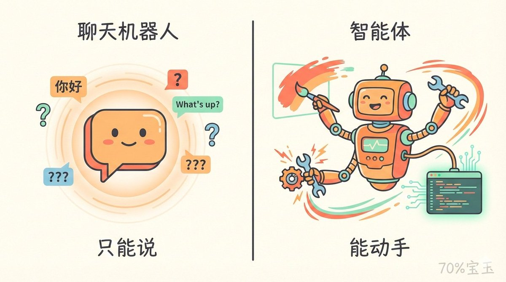
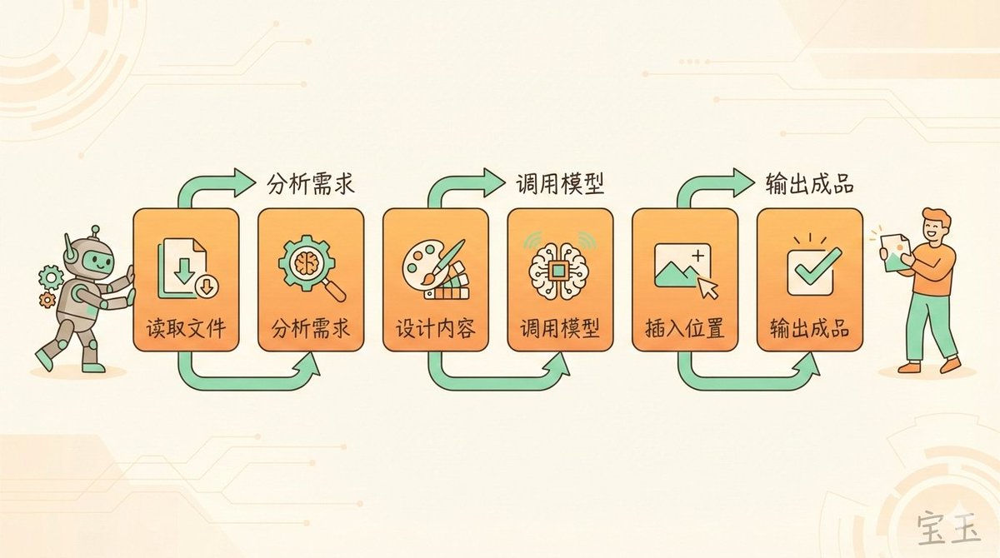
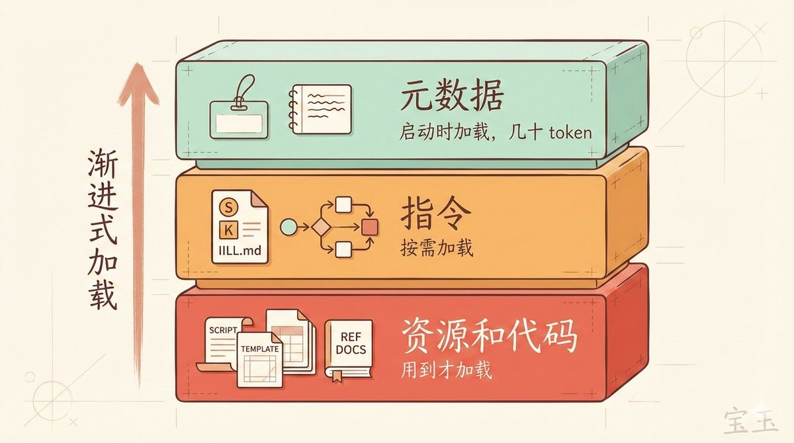
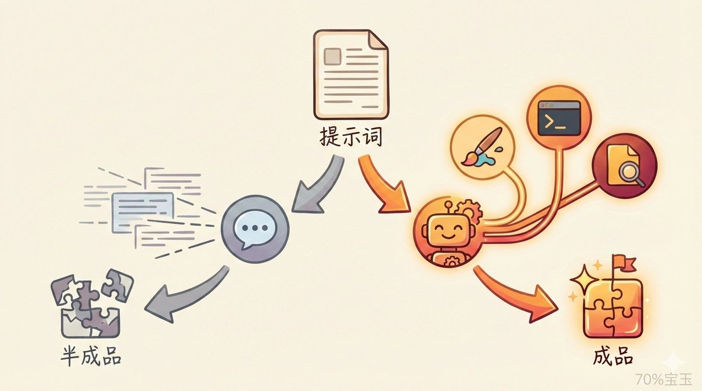
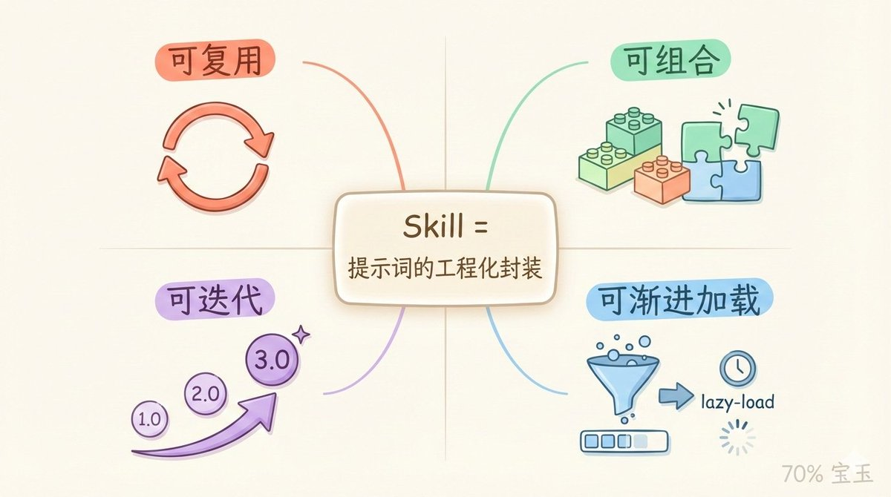
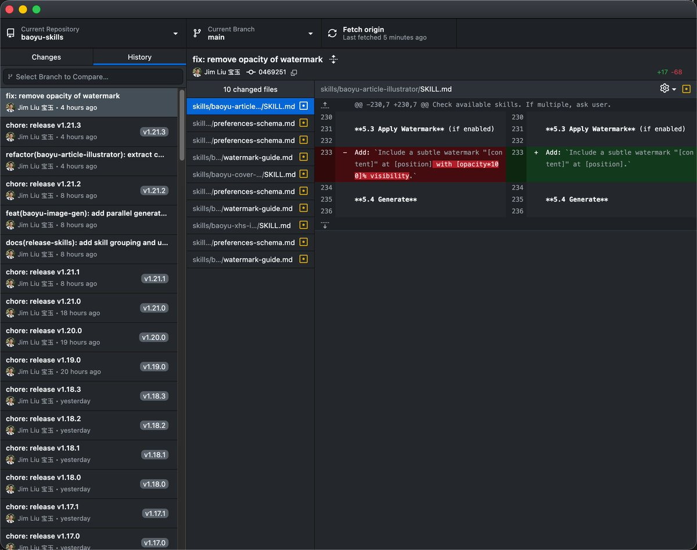
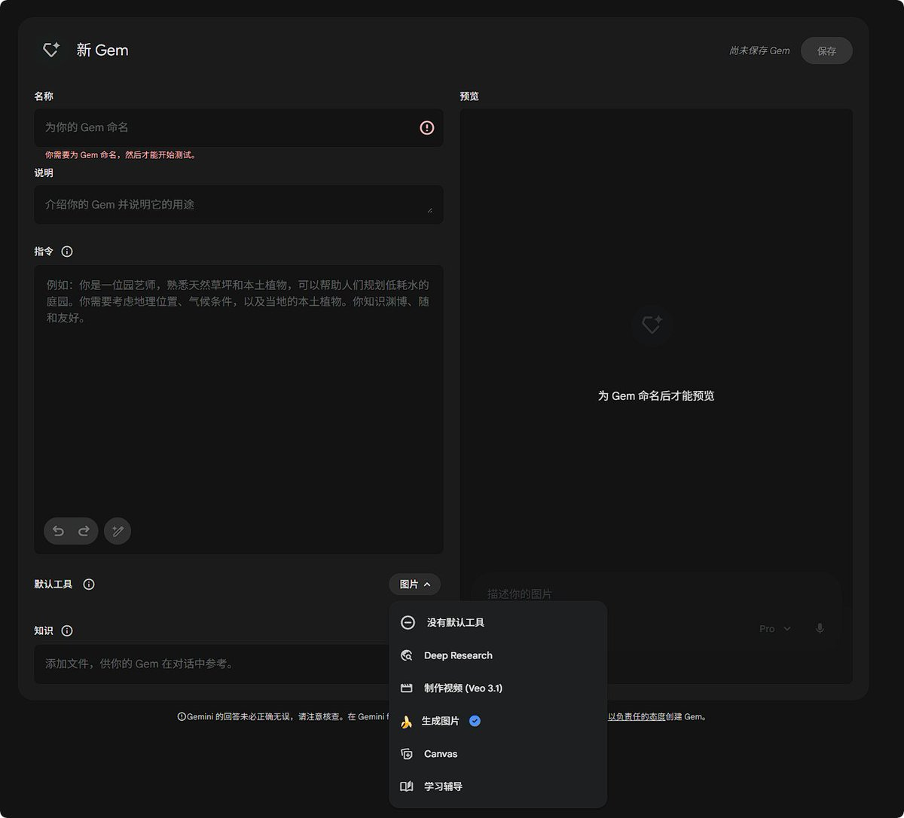

# 📰 “Skill 不就是长一点的提示词吗？”

[Embedded Tweet: https://x.com/i/status/2014607139352859077]

上篇文章《别把整个 GitHub 装进 Skills，Skills 的正确用法》发出去后，收到一些质疑：

> “说 skill 能做配图 prompt 不行。本来 skill 就是加载 md，没 skill 之前我们用 prompt 模板照样也是能做流程编排。”

> “现在大部分 skill 不就是长一点的提示词吗？为什么说'单纯靠提示词做不了'？”

这些批评是对的。

我原文确实表达有问题。写“提示词”的时候，我下意识拿 Gem、Project、GPTs 里的那种提示词当例子。那些确实做不到一次性生成配图。

但“提示词”是个很宽泛的概念。如果我把 SKILL.md 的内容复制出来发给 Claude Code，再给它一个生成图片的脚本，它一样能完成配图任务。

这里的差异不在于提示词能不能复用，Gem 和 GPTs 里的提示词也能复用。差异在于：提示词配套的是 ChatBot，还是 Agent？

## ChatBot 和 Agent 的核心区别

Skills 的完整名称叫 Agent Skills。注意这个“Agent”，它不是装饰词。Skills 利用 Agent 的虚拟机环境，提供单纯提示词无法实现的能力。

一句话总结：ChatBot 只能对话，Agent 能动手干活。

具体来说：

ChatBot 不能调用工具。 你给它一段配图提示词，它能帮你分析文章、生成画图 prompt，但真要生成图片？它只能说“请把这段提示词复制到 Gemini”。剩下的活还是你干。

Agent 能调用工具。 同样的配图任务，它能像个经验丰富的编辑一样自己完成：

1. 读取你的文件

1. 分析需要几张图、放哪里

1. 为每张图设计内容和风格

1. 调用画图模型生成图片

1. 把图片插入正确位置

1. 输出成品交到你手上

全程自动化，你只需要验收。

## 那 Skill 到底是什么？

很多人把 Skill 理解成“一段很长的提示词”，这个理解对了一半。

SKILL.md 的核心确实是指令文本。但 Skill 不止于此。

一个 Skill 可以包含三层内容：

第一层：元数据。 就是 name 和 description，告诉 Agent 这个 Skill 是干嘛的、什么时候该用。这部分在启动时就加载，但只占几十个 token。

第二层：指令。 SKILL.md 的主体内容，工作流程、最佳实践、注意事项。只有 Agent 判断需要用这个 Skill 时，才会读取这部分。

第三层：资源和代码。 附带的脚本、模板、参考文档。Agent 按需读取，用的时候才加载。

这就是官方说的“渐进式加载”：不是一股脑把所有内容塞进上下文，而是用到什么加载什么。

所以你可以给一个 Skill 附带几十份参考文档，只要这次任务用不上，它们就不占用上下文窗口。传统提示词做不到这一点。

## 为什么说配图“单纯靠提示词做不了”？

回到原来的争议。

如果你说的“提示词”是指发给像 Claude Code 这样的 Agent 的指令，那配图当然能做到。因为这时候提示词是发给 Agent 的，Agent 能调用工具。

但如果你说的是发给普通 ChatBot 的提示词，比如 ChatGPT 的自定义指令、Gemini 的 Gem、Claude 的 Project 指令，那确实做不到。因为 ChatBot 没有工具调用能力，它只能输出文字。

我原文的问题在于：默认读者理解的“提示词”是 ChatBot 场景下的提示词，但没有明确说出来。

更准确的表达应该是：Skill 必须配合 Agent 使用。 发给 ChatBot 的提示词，无论写多长多详细，都只能完成对话能完成的事。要让 AI 真正“动手”，需要的是 Agent + 工具调用能力。

## 那我直接给 Claude Code 发长提示词不行吗？

行。

把 SKILL.md 内容复制出来当提示词发，Agent 一样能执行。这也是为什么有人觉得“Skill 就是长一点的提示词”。

但 Skill 的价值不在于“能不能做到”，而在于：

可复用。 写一次，以后每次相关任务自动触发，不用每次复制粘贴。

可组合。 分析 Skill + 提纲 Skill + 写作 Skill，像乐高一样拼起来。单独的提示词模板做不到这种模块化组合。

可迭代。 用着用着发现问题，直接让 Agent 帮你改进 Skill。下次自动生效。传统提示词模板改了之后，你得记得每次都用新版本。

可渐进加载。 Skill 附带的资源文件不会一开始就占用上下文。你的提示词模板再怎么组织，发出去就是全量加载。

简单说：Skill 是提示词的工程化封装。 能做的事差不多，但管理成本、复用成本、迭代成本完全不同。

## 最后

上篇文章的核心没变：因需而建、可组合、可迭代。

Skill 就是长一点的提示词吗？

是的。但光有提示词不够。

关键是执行这段提示词的系统，到底是只会说的 ChatBot，还是能真正动手的 Agent。

Skill 是给 Agent 用的。 没有 Agent 的工具调用能力，Skill 就只是一段躺在文件夹里的 Markdown。

### 🖼️ Attached Media

## 💬 Replies

### 1 @xiangxiang103 (雨哥向前冲)

*Sun Jan 25 02:31:49 +0000 2026*

@dotey 元数据这层设计确实很轻量，但随着我们积累的 Skill 越来越多（比如超过 100 个时），Agent 仅仅靠 name 和 description 来‘自动寻址’的准确率会不会下降？宝玉老师在实操中，有没有遇到过 Agent 误调用或者漏掉某个关键 Skill 的情况？

### 2 @dotey (宝玉) (Author)

*Sun Jan 25 02:32:41 +0000 2026*

@xiangxiang103 会有的，通常这时候我会问问它为什么，让它优化，慢慢会好一点

### 3 @AlpacaNotes (小羊驼杂记)

*Sun Jan 25 03:04:37 +0000 2026*

@dotey “宝玉”与“70%宝玉”有什么区别？😂

### 4 @dotey (宝玉) (Author)

*Sun Jan 25 03:09:20 +0000 2026*

@AztecaAlpaca 别提了，我让 Claude Code 给我添加水印功能，它自作聪明加了个 70% 透明度，结果 nano banana pro 傻傻的就用 70%+名字当水印 

### 5 @NTongzhao (idolzhao)

*Sun Jan 25 01:01:44 +0000 2026*

@dotey 所以 写这篇文章的skills组合是啥

### 6 @dotey (宝玉) (Author)

*Sun Jan 25 01:03:51 +0000 2026*

@NTongzhao 写这篇不是靠的 AI 的 Skills，是人实践和反思后的结果……

### 7 @fanjinglian (Fiona Fan)

*Mon Jan 26 12:35:54 +0000 2026*

@dotey 宝哥，这些图是用的啥？很漂亮

### 8 @dotey (宝玉) (Author)

*Mon Jan 26 15:34:51 +0000 2026*

@fanjinglian [github.com/jimliu/baoyu-s…](https://github.com/jimliu/baoyu-skills)
里面的文章配图skill

### 9 @Alexu0317 (Alex Xu)

*Sun Jan 25 05:53:13 +0000 2026*

@dotey 捉个小虫：Gem可以选工具 

### 10 @dotey (宝玉) (Author)

*Sun Jan 25 06:00:50 +0000 2026*

@Alexu0317 对，现在 ChatBot 也在向 Agent 靠齐，不过能力还是弱很多，比如它还是做不到文章配图这样需要多步骤的

### 11 @msjiaozhu (MapleShaw)

*Sun Jan 25 02:55:56 +0000 2026*

@dotey 用了几天，感觉 skill 是以人类思维，让 AI 能有更长的触角，来帮人类提高效率，获得更多“摸鱼”的时间🤔

### 12 @Jadtrrguson (🍭吃货不怕胖)

*Sun Jan 25 06:23:08 +0000 2026*

@dotey 这些图确实做的漂亮

### 13 @skylineykk (Kev1nY丨🟩⬛️)

*Sun Jan 25 05:10:18 +0000 2026*

把 Skill 仅仅当成长一点的提示词（Prompt），其实有点看轻它了。表面上看它们都是一串字符，但真正的分水岭在于这东西是怎么跑起来的，以及你怎么管它。

如果脱离了 Agent 的决策逻辑和外部工具的调用（Tool Calling），Skill 就是一段死代码。只有当 Agent 意识到“现在需要解决某个特定任务”，并精准地调取某个 Skill 去操作数据库或调用 API 时，它才算活了。这时候的 Skill，已经从一段“说明书”变成了 AI 的一个“插件化技能”。

说白了，长提示词只是让 AI 看起来博学，而工程化管理下的 Skill 是让 AI 真正有了能干活的手脚。

### 14 @yibie (yibie)

*Sun Jan 25 01:32:42 +0000 2026*

@dotey 我尝试过直接在 [AGENTS.md](http://AGENTS.md) 里写入 Skills 的文档索引，但我还是发现它的调用成功率，相比 Claude Code 的很有差别。工程化实现是必须的，尤其是 Skills 的类型还包括了可执行的脚本。

### 15 @ChrisHamous (Chris hamous)

*Sun Jan 25 07:32:46 +0000 2026*

@dotey 醍醐灌顶

### 16 @jasongyang365 (jasonyang365)

*Sun Jan 25 06:09:58 +0000 2026*

@dotey “Skill是面向Agent的，优点是可组合、可迭代。”

文章读到一半时，脑子中形成了这个结论，最后发现和宝玉老师总结的一致🍻

### 17 @El_sinore (Elsinore)

*Sun Jan 25 02:05:19 +0000 2026*

@dotey 深度好文，mark后看

### 18 @finndean666 (Finn Dean)

*Sun Jan 25 01:27:00 +0000 2026*

我看到一个其他帖子也讲的很详细，Skill里面的md文件分三部分，其中元数据的作用是routing，也就是说agent在收到用户的指令时不会查看整个md文件，而是查看元数据，匹配上了对应的元数据才会查看中间的指令部分，而指令部分里面也包含了什么时候去调用scripts，所以我觉得他们说的skill就是长一点的提示词还是有问题，毕竟跟chatbot对话时他不能按照指令来执行某些固定的代码

### 19 @TianDatong (@Toong)

*Sun Jan 25 11:37:08 +0000 2026*

@dotey 提示词可以记在脑子里，Skill 必须保存成文件。🧐

### 20 @FCllBrIAt (Joy Joe)

*Mon Jan 26 03:07:50 +0000 2026*

@dotey skill是一堆像拟态章鱼一样的有自己脑子的提示词（agent场景下），它会结合使用者的output需求进行动态组装

### 21 @LastTechAI (头号个体)

*Sun Jan 25 00:28:38 +0000 2026*

@dotey skills是agents skills，那么未来会不会llm就是agents?

### 22 @karenCh00685031 (karen Chen)

*Sun Jan 25 01:36:45 +0000 2026*

@dotey 学习

### 23 @2332jssj (怀民亦未眠)

*Sun Jan 25 01:52:14 +0000 2026*

@dotey 感谢宝老师

### 24 @aikongmeng1 (Akm)

*Mon Jan 26 00:24:18 +0000 2026*

@dotey 所以还是得工具去调度，同样的 SK 国内的调度显然不如 CC

### 25 @tapopat (pat)

*Mon Jan 26 12:33:40 +0000 2026*

@dotey skills是system prompt的function calling

### 26 @huqinyiyayuguan (Regen)

*Sun Jan 25 02:38:42 +0000 2026*

@dotey Skills 让 Agent 有了可编排可复用的开放式的工作流能力，也可说 Agent 扩展出了 灵活可用的Skills 能力。

### 27 @LaoJiuCaiAlpha (韭菜Alpha)

*Sun Jan 25 05:44:01 +0000 2026*

@dotey 太真实了，我们总是在寻找那个完美的时机
却忘记了生活本身就是由无数个当下组成的

### 28 @Viki15885Viki (Viki)

*Mon Jan 26 07:55:14 +0000 2026*

@dotey 使用 gemini-web api 的方式来调用 nano banana 的方式目前看起来不太好用, 主要是因为谷歌将默认的模型改为了快速模型, 而不是 Pro

### 29 @ggstyop (Gary tt)

*Sun Jan 25 01:18:17 +0000 2026*

@dotey @readwise save this thread

### 30 @zumadrl (zuma)

*Sun Jan 25 00:38:20 +0000 2026*

@dotey @grok 总结提炼整理归纳此贴内容

### 31 @JoeJoeZ (zhumaobatiao)

*Sun Jan 25 03:28:36 +0000 2026*

@dotey 宝玉兄，请问你提到的可迭代是skill本身的特性吗？如果把prompt也用版本管理类似cline rule、[agents.md](http://agents.md)不也能实现，好像和skill本身没关吧？求指教。

### 32 @saki3857 (Sakisasaki)

*Sun Jan 25 18:22:23 +0000 2026*

@dotey skill是可供agent自助取用的、分层的提示词

### 33 @Baoge_AI_ (宝哥 | 培训师)

*Sun Jan 25 01:48:21 +0000 2026*

@dotey 宝玉老师总结的对，现在大家铺天盖地的宣传各种牛逼skills确实是非常的炫酷，很多时候自己加载了之后用的次数也不多，用的多的还是自己日常总干的活：
1、skill不是写出来的，是用出来的，把自己砸钉子的砖头变成顺手的锤子；
2、网上的好东西给自己灵感，让自己做顺手的锤子砸钉子，而不是收藏起来。

