# 📰 为什么你的"AI 优先"战略可能大错特错？

今天刷到《Why Your”AI-First”Strategy Is Probably Wrong》这篇文章（原文翻译我放到下面）几次，说点不一样的。与其说 AI First，不如说软件工程 First。

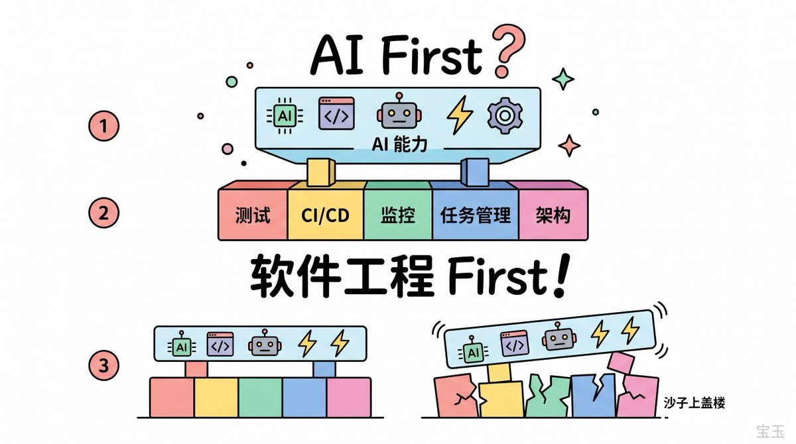

这篇文章看着在讲 AI，底下全是软件工程。

抛开后面讲组织和人的部分，原文前半段的重点简单总结一下：

AI 时代，人成了瓶颈。 PM 花几周做需求，AI 两小时就能实现，PM 成了瓶颈。QA 测三天，AI 写代码只要两小时，QA 成了瓶颈。团队 25 个人，对手几百人，人力也是瓶颈。

怎么办？把人从链条里拿掉。 AI 写代码、AI 审查代码、AI 跑测试、AI 部署上线、AI 监控线上状态，出了问题自动回滚。每天定时扫描日志，自动发现问题、分配任务、跟踪修复。整条流水线跑起来，人只需要在关键节点做判断。

至于文中提到的统一代码库，锦上添花，和 AI First 关系不大。有当然更好，没有也有很多替代方案。

整套方案听下来，逻辑自洽，效果也漂亮：一天部署好几次，功能当天上当天撤，数据说了算。

## 先对照自己，想五件事

但先别急着照搬，先对照自己的情况想几件事：

第一，自动化测试。 AI 改完代码，你得有办法确认它没搞崩别的功能。测试覆盖不够的话，每次 AI 提交代码你都得人工回归一遍，那速度根本快不起来。

第二，CI/CD 流程。 从提交代码到部署上线，中间的测试、审查、发布、回滚，是不是全自动跑通了？这条流水线不通，AI 写得再快，代码也堆在那儿等人手动处理。

第三，A/B 测试和线上监控。 新功能上线之后效果好不好，得有数据说话，效果不好得能随时关掉。没有这套机制，AI 一天产出五个功能，你都不知道哪个该留哪个该砍。

第四，任务管理。 任务得拆到合适的粒度，生命周期得跟踪得住。一个大而模糊的任务丢给 AI，现在的能力还啃不动。多个 Agent 同时干活的时候，谁做哪个、哪个优先、做到什么程度，这些都得有地方管。

第五，系统架构。 架构太乱或者压根没有架构的代码，AI 维护起来跟人一样头疼。上下文塞满了还是搞不清边界在哪，改一处崩三处。

这几条里如果有做不到的，就得靠人去补。补不上，AI First 就只是一句口号。

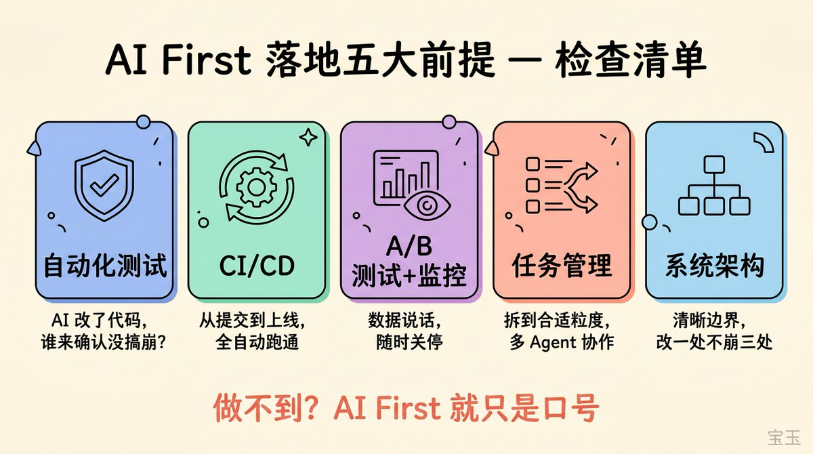

## 什么场景适合，什么不适合

但假设你全做到了，就能 AI First 了？

还是不行。这套玩法只适合一部分场景。

适合的场景： 后端逻辑为主、界面不复杂的产品，比如 API 服务、数据处理平台、内部工具。功能好不好，跑一下数据就知道，不需要人去盯着每个像素。原文里的就是个 Agent 平台，本质上是后端驱动的产品，可以用这套打法。

再比如早期产品快速试错，功能上了不行就撤，用户预期本来就没那么高，AI 的速度优势能充分发挥。

不适合的场景：

- UI 密集的产品。 自媒体天天喊前端已死，但你让 AI 做个复杂界面试试，各种易用性问题、交互细节、视觉还原，它搞不定的。否则马斯克靠 AI 早就改了不知道改版 X 多少次了。

- 功能质量敏感的产品。 Anthropic 和 OpenAI 不知道 AI First 吗？他们敢在 Claude Code 和 Codex 上这么搞吗？让 AI 全自动迭代自家的核心产品，用户不骂死才怪。

- 安全性要求高的场景。 银行系统、在线交易平台，AI 代码出个差错，那可不是回滚能解决的。

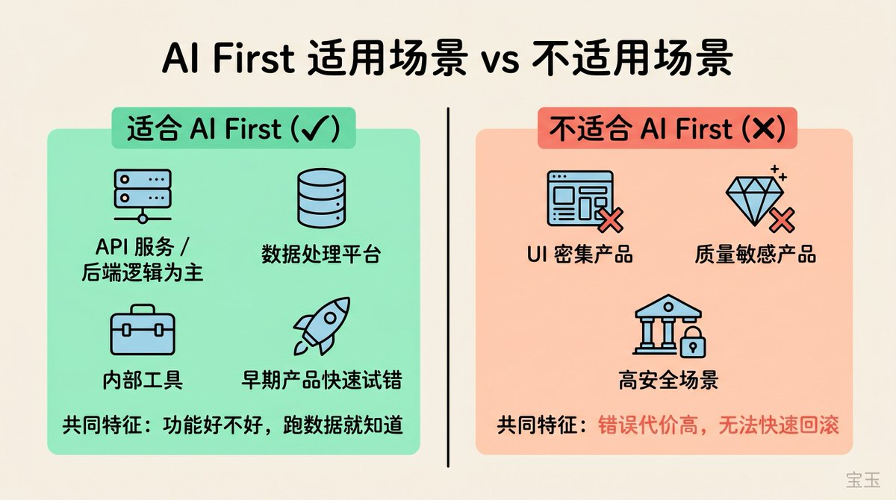

## AI First 的真正终点

AI First 的方向没有错，它代表的是一种意识的转变：每做一个决策的时候，想一想这件事能不能让 AI 来做，如果不能，缺什么条件，怎么把条件补上。

但这种意识要落地，靠的不仅是买几个 AI 工具的订阅，还需要把基础搭好。 测试、CI/CD、监控、架构、任务管理，这些做扎实了，AI 的能力自然能释放出来。做不好，加再多 AI 也是在沙子上盖楼。

从这个角度看，AI First 的终点未必是让 AI 干所有的活，而是借着这股力量，把你一直想做但没动力做的工程改进，真正推动起来。

仰望星空是好的，但也还要脚踏实地。

## 为什么你的“AI 优先”战略可能大错特错【翻译】

作者：Peter Pang
原文：[Why Your “AI-First” Strategy Is Probably Wrong](https://x.com/intuitiveml/article/2043545596699750791)

[Embedded Tweet: https://x.com/i/status/2043545596699750791]

我们 99% 的生产环境代码都是由 AI 编写的。上周二早上 10 点，我们上线了一项新功能，中午进行了 A/B 测试，结果下午 3 点就把它砍掉了，因为数据表现不佳。下午 5 点，我们又发布了一个优化后的版本。如果放在三个月前，这样一个完整的迭代周期至少需要六个星期。

我们能做到这一步，绝不是因为在代码编辑器里装了个 Copilot 插件那么简单。我们彻底打破了原有的工程研发流程，并围绕 AI 进行了全面重构。我们改变了做计划、写代码、测试、部署以及团队组织的方式。我们甚至重塑了公司里每个人的角色。

CREAO 是一个 AI 智能体 (AI Agent) 平台。公司有 25 名员工，其中 10 名是工程师。我们在 2025 年 11 月开始研发智能体，就在两个月前，我从零开始，彻底重组了整个产品架构和工程工作流。

OpenAI 在 2026 年 2 月发布了一个新概念，完美总结了我们一直在做的事情。他们称之为脚手架工程 (Harness Engineering，(注：Harness 原意为马具或安全带，在软件工程中通常指测试支架或脚手架，这里指为 AI 提供工作环境和约束条件的系统工程))：工程团队的核心工作不再是写代码了，而是赋能智能体，让它们去完成有价值的工作。当系统出错时，解决办法绝不是“再试一次”或“再努力点”。真正的解决思路是去问：AI 缺失了什么能力？我们该如何让这个能力对智能体变得清晰可见，并强制它们去执行？

我们自己摸索出了这个结论，只是当时还没有一个现成的名词来定义它。

## “AI 优先”不等于“使用 AI”

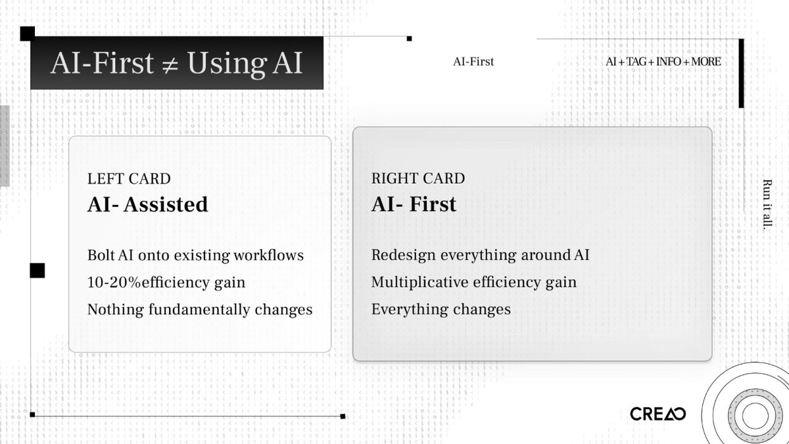

大多数公司只是把 AI 强行塞进现有的工作流里。工程师打开 Cursor 辅助写代码，产品经理用 ChatGPT 帮写需求文档，测试团队 (QA) 尝试用 AI 生成测试用例。整个工作流程还是老样子。效率确实提升了 10% 到 20%，但本质上的结构没有任何改变。

这顶多叫“AI 辅助” (AI-assisted)。

真正的“AI 优先” (AI-first)，意味着你要基于“AI 是主力构建者”这一核心假设，彻底重新设计你的流程、架构和组织。 你要停止问“AI 能怎么帮助我们的工程师？”，转而问“我们该如何重构一切，让 AI 去做构建工作，而工程师只负责指引方向和判断好坏？”

这两种思路带来的差距，是指数级的。

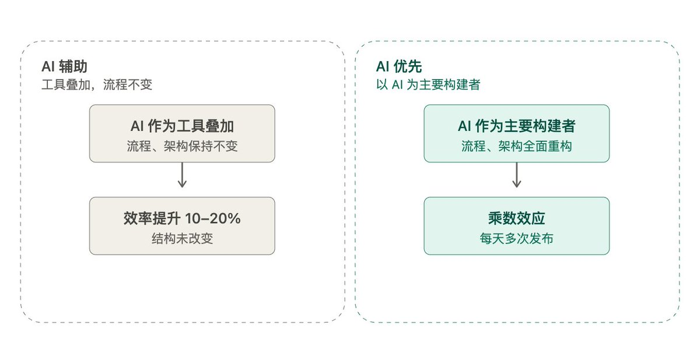

我看到很多团队自称“AI 优先”，却依然在跑原来的敏捷冲刺周期，用着一样的 Jira 任务看板，开着一样的每周站会，还要经过一样的 QA 验收签字流程。他们只是把 AI 强加进了现有的循环里，而没有重新设计这个循环。

这种现象的一个典型表现，就是现在常说的凭感觉编程 (Vibe Coding)。打开 Cursor，不断调整提示词直到代码能跑通，提交代码，然后不断重复。这种方式只能用来做原型验证。一个真正用于生产环境的系统，必须是稳定、可靠且安全的。当 AI 来写代码时，你需要建立一个能兜底并确保这些特性的系统。你需要构建的是系统，而那些提示词是用完即弃的。

## 我们为什么必须改变

去年，我仔细观察了团队的工作方式，发现了三个差点要了我们命的瓶颈。

产品管理的瓶颈

我们的产品经理过去要花好几周的时间来调研、设计和详细规划产品功能。几十年来，产品管理一直都是这么运作的。但是，AI 智能体实现一个功能只需要两小时。当开发时间从几个月被极度压缩到几个小时，那长达数周的规划周期就成了最大的拖油瓶。

花几个月去构思一个想法，然后只用两小时就把它做出来，这太不合逻辑了。

产品经理必须进化成具备产品思维的架构师，以快速迭代的节奏工作，否则就得退出开发环节。产品的设计必须通过“快速原型 - 发布 - 测试 - 迭代”的循环来完成，而不是靠委员会开会去评审那些长篇大论的需求文档。

测试 (QA) 的瓶颈

情况如出一辙。AI 智能体花两小时上线一个功能后，我们的 QA 团队要花好几天去测试各种边缘和极端情况。开发两小时，测试三天。

于是，我们用 AI 构建的自动化测试平台取代了人工 QA，用 AI 来测试 AI 写的代码。验证的速度必须赶上开发的速度。否则，你只是在离旧瓶颈十英尺远的地方，又建了一个新瓶颈而已。

人力的瓶颈

我们的竞争对手有 100 倍甚至更多的人在做同样的工作，而我们只有 25 人。我们不可能靠疯狂招人来赶超他们，我们只能靠“重新设计”来杀出一条血路。

我们需要把 AI 深度贯穿到三个系统中：如何设计产品、如何实现产品、以及如何测试产品。如果其中任何一个环节依然靠纯人工，它就会拖垮整个流水线。

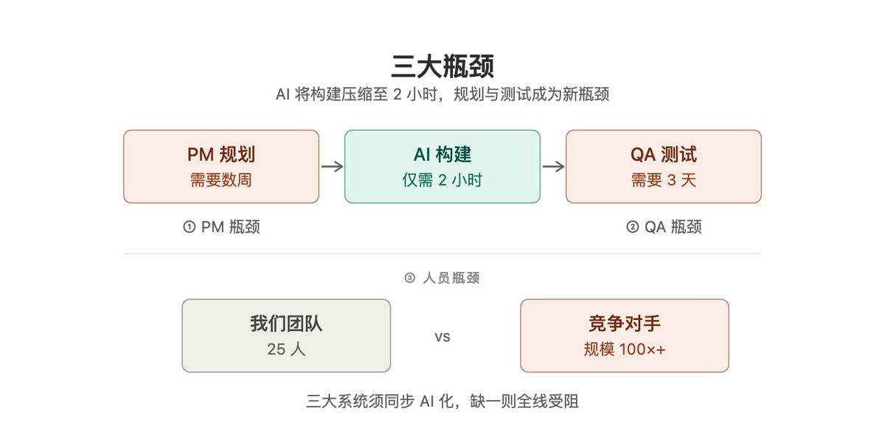

## 一个大胆的决定：统一架构

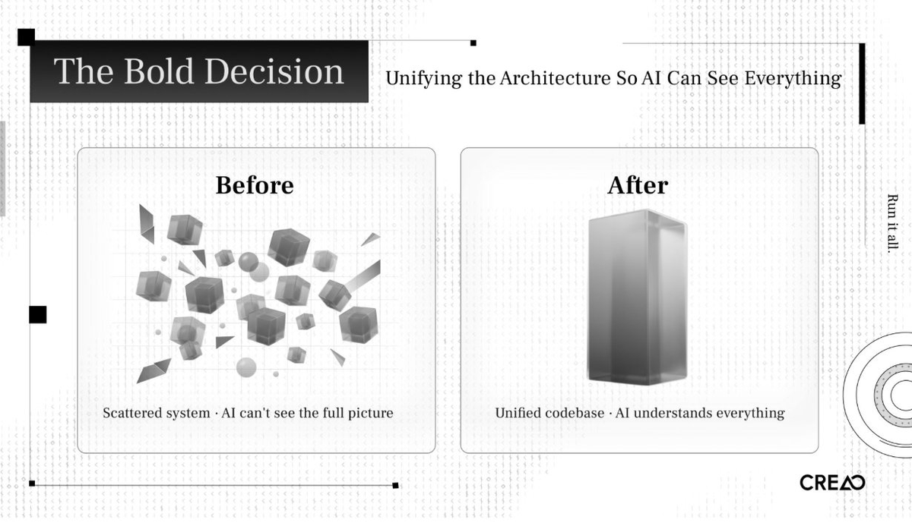

我得先拿代码库开刀。

过去我们的架构散落在多个独立的系统中。修改一个功能可能需要同时动三四个代码仓库。从人类工程师的角度来看，这勉强还能应付。但从 AI 智能体的视角来看，这就像个黑盒。智能体看不到全貌，无法推理跨服务的连锁反应，也不能在本地跑集成测试。

我不得不把所有代码整合到一个大型代码库 (Monorepo) 中。原因只有一个：让 AI 能纵览全局。

这就是脚手架工程理念在实际中的运用。你把越多部分的系统转化为 AI 可以检查、验证和修改的形态，你获得的杠杆效应就越大。碎片化的代码库对 AI 是隐形的，而统一的代码库对它们来说则是清晰易读的。

我花了一周的时间设计新系统：规划阶段、实施阶段、测试阶段、集成测试阶段。接着，我又用了一周时间，利用智能体帮忙重构了整个代码库。

CREAO 本身就是一个智能体平台。我们用自己的智能体，重建了运行智能体的平台。如果一个产品能自己构建自己，那就说明这条路走得通。

## 我们的技术栈

下面是我们的技术栈，以及每个模块的作用。

底层基础设施：AWS (亚马逊云服务)

我们运行在 AWS 上，使用了自动扩缩容的容器服务和熔断回滚机制。如果部署后监控指标恶化，系统会自动回滚到上一个安全版本。

CloudWatch 是整个系统的中枢神经。所有服务都有结构化的日志，设定了超过 25 个自动警报，自动化工作流每天都会查询自定义指标。每一个基础设施部件都会暴露出结构化、可查询的信号。(注：结构化日志指按统一格式记录的日志，便于机器读取；可查询信号指 AI 能直接检索的关键运行数据) 如果 AI 读不懂日志，它就无法诊断问题。

CI/CD：GitHub Actions

每一次代码修改都要经过一个死磕到底的六阶段流水线：

> 验证 CI → 构建并部署到开发环境 → 测试开发环境 → 部署到生产环境 → 测试生产环境 → 正式发布

每个拉取请求 (Pull Request, 简称 PR，(注：即提交代码变更的请求)) 上的把关机制，强制执行类型检查、代码规范检查、单元和集成测试、Docker 构建、利用 Playwright 进行的端到端测试，以及环境一致性检查。没有任何一个阶段可以跳过。不允许任何人工强行绿灯。整个流水线是绝对确定性的，这样 AI 才能预测结果并推理出失败的原因。

AI 代码审查：Claude

每一个 PR 都会触发 Claude Opus 4.6 进行三轮并行的 AI 审查：

1. 代码质量：检查逻辑错误、性能问题、可维护性。

1. 安全性：漏洞扫描、认证边界检查、注入攻击风险。

1. 依赖项扫描：供应链风险、版本冲突、开源协议问题。

这些是必须通过的拦截关卡，而不只是提提建议。它们和人工审查并行运作，批量拦截人类容易漏掉的错误。当你一天要部署 8 次时，没有哪个肉眼凡胎的工程师能对每个 PR 都保持高度专注。

工程师还可以在任何 GitHub Issue 或 PR 中圈一下 @claude，让它提供实施方案、开启调试会话或进行代码分析。AI 智能体能看到整个大型代码库。所有的上下文在不同的对话中是无缝贯通的。

自愈反馈循环

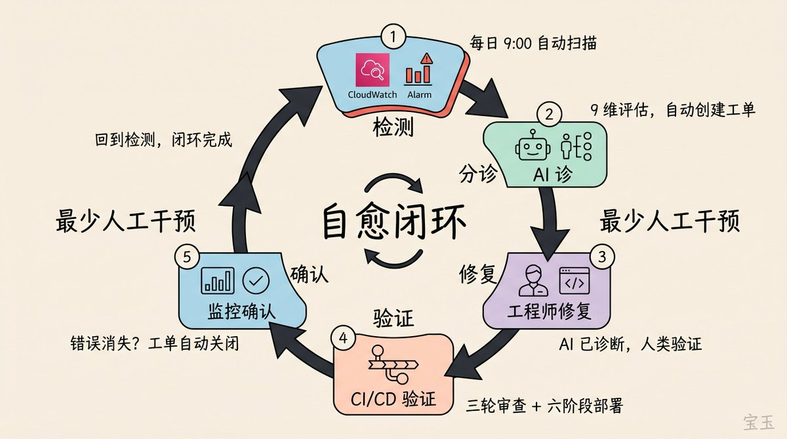

这是整个体系的灵魂。

每天早上（UTC 时间 9:00），自动化健康检查工作流准时启动。Claude Sonnet 4.6 会查询 CloudWatch，分析所有服务的错误模式，并生成一份系统健康执行摘要，发送到团队的聊天群里。这都不需要任何人主动去吩咐。

一小时后，分诊引擎启动。它会将生产环境里的错误信息进行分类聚类，从 9 个维度评估每个问题的严重程度，并在任务管理系统中自动生成调查工单。每个工单都贴心地附带了日志样本、受影响的用户、受影响的接口以及建议的排查方向。

系统还会自动去重。如果现有的工单已经涵盖了同类错误，它会更新那个工单。如果以前解决过的问题又出现了，它会敏锐地检测到倒退 (Regression) 并重新打开工单。

当工程师提交修复代码时，同样的流水线会接管一切。Claude 会进行三轮审查，CI 进行验证。六阶段部署流水线将其推送到各个环境并进行测试。部署完成后，分诊引擎会再次检查监控数据。如果原先的错误解决了，工单就会自动关闭。

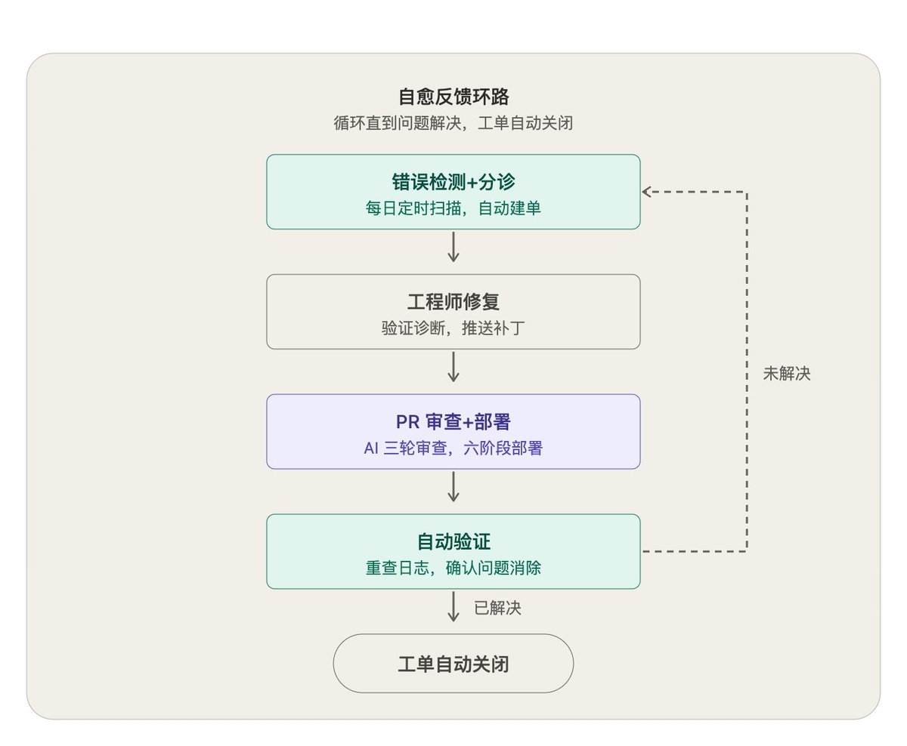

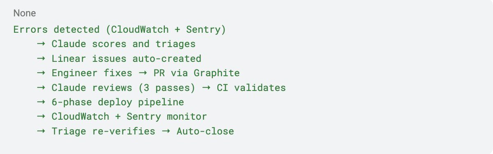

每个工具只负责一个阶段。没有哪个工具试图包揽一切。这个日常循环创造了一个“自愈闭环”：以最少的人工干预，完成错误的检测、分诊、修复和验证。

我曾对《商业内幕》的记者说：“AI 会负责写代码并提交，人类只需要负责审核有没有战略风险就行了。”

功能开关与辅助技术栈

我们用 Statsig 来管理功能开关 (Feature Flags，(注：一种在代码中控制功能是否启用的技术，允许在不重新部署代码的情况下随时开关功能))。每个新功能上线前都藏在开关后。发布模式非常稳健：先对团队内部开放，然后按百分比灰度发布，最后全面开放或直接砍掉。所谓的“一键关闭”能瞬间停用功能，根本不需要重新部署。如果一个功能导致数据指标变差，我们几个小时内就会把它撤下来。糟糕的功能在上线当天就会“死掉”。A/B 测试也是跑在同一套系统上的。

Graphite 负责管理代码分支：合并队列会重新跑一遍验证，只有一路绿灯才会合并到主干。这让我们可以一边高频提交代码，一边有条不紊地审查。

Sentry 报告所有服务的结构化异常，再由分诊引擎将其与监控数据结合。Linear 则是面向人类的界面：自动创建带有严重程度评分和调查建议的工单，后续验证通过后自动关闭。

## 一个功能如何从想法走向生产环境

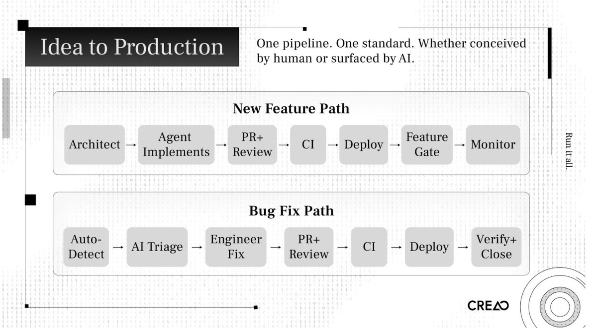

新功能开发路径

1. 架构师以结构化提示词的形式定义任务，包含代码库上下文、目标和约束条件。

1. 智能体拆解任务、规划实施方案、编写代码并自动生成配套的测试。

1. 开启 PR。Claude 进行三轮审查。人类审查员只检查高维度的风险，而不去逐行死磕代码。

1. 流水线验证：类型检查、代码规范、单元测试、集成测试、端到端测试。

1. 排队、重新验证、通过后合并。

1. 六阶段部署流水线将其推送到不同环境，每个阶段都伴随测试。

1. 面向团队内部开启功能开关。逐步灰度发布。紧盯数据指标。

1. 一旦数据恶化，随时一键关闭。遇到严重问题自动触发熔断回滚。

Bug 修复路径

1. 监控系统侦测到错误。

1. Claude 分诊引擎评估严重程度，自动创建一个包含完整排查上下文的工单。

1. 工程师介入调查。此时 AI 其实已经做完了诊断工作。工程师只需验证结论并提交修复代码。

1. 走同一套严格的代码审查、验证、部署和监控流水线。

1. 分诊引擎重新验证。如果确认解决，工单自动关闭。

这两条路径用的是完全同一套流水线。同一个系统，同一个标准。

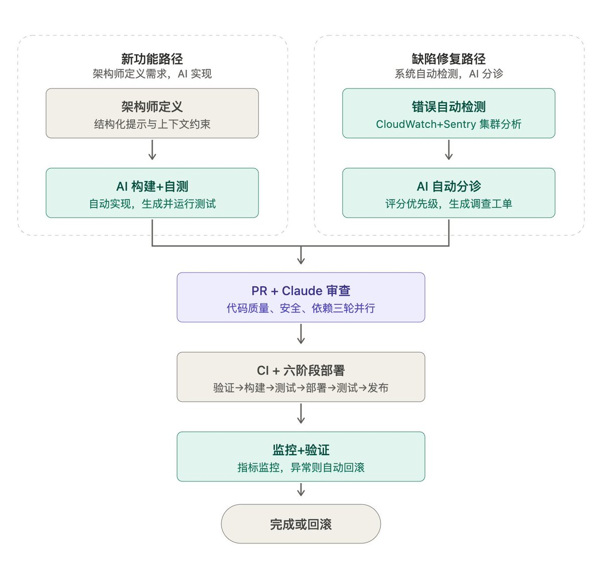

## 成果如何

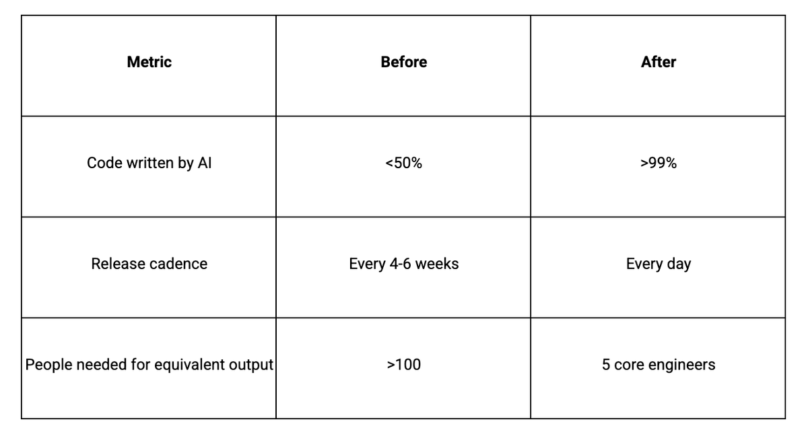

在过去 14 天里，我们平均每天进行 3 到 8 次生产环境部署。在旧模式下，这整整两周的时间里，我们连一次发布都做不出来。

糟糕的功能在上线当天就会被砍掉。新功能在构思出来的当天就能上线。A/B 测试能实时验证业务效果。

很多人以为我们是在牺牲质量换取速度。恰恰相反，用户参与度上升了，付费转化率也上升了。我们做出了比以前更好的产品，因为反馈闭环变得极短。每天发布一次你能学到的东西，绝对比每个月发布一次要多得多。

## 全新的工程组织架构

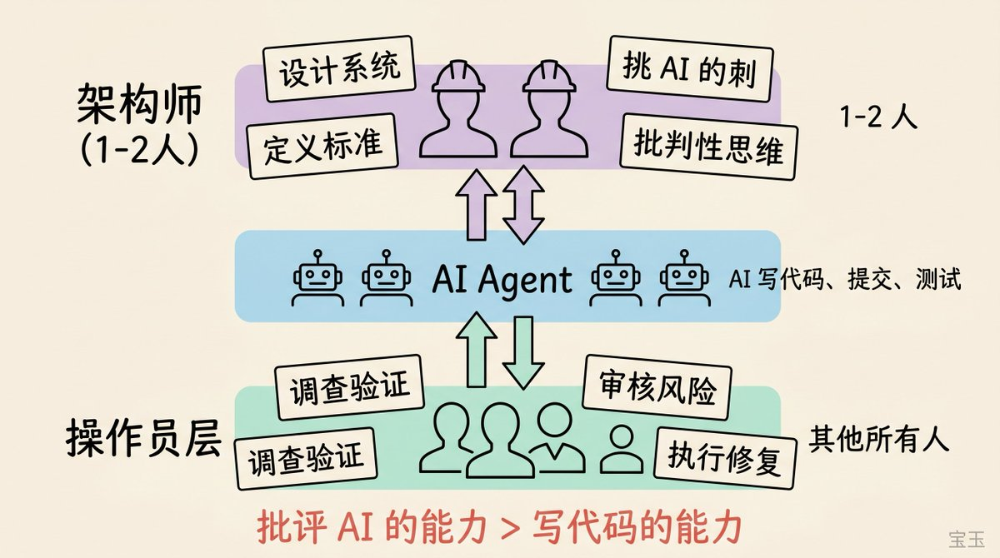

未来只会存在两种类型的工程师。

架构师

只有一两个人。他们设计标准作业程序，教 AI 如何工作。他们构建测试支架、集成系统和分诊网络。他们拍板系统架构和边界。他们来定义在智能体眼里什么才叫“好”。

这个角色需要极其深厚的批判性思维。你要做的是挑 AI 的刺，而不是盲从它。当智能体提出一个方案时，架构师要能敏锐地找到漏洞：它遗漏了哪些失效模式？越过了哪些安全边界？积累了什么技术债？

我拥有物理学博士学位。读博期间我学到的最有用的东西，就是如何质疑假设、给论点做压力测试，以及寻找逻辑漏洞。在未来，批评 AI 的能力将比写代码的能力更有价值。

当然，这也是最难招人的岗位。

操作员

其他所有人。工作依然重要，但结构变了。

现在是 AI 给人类分配任务。分诊系统发现了一个 Bug，创建工单，亮出诊断结果，然后把它分配给合适的人。人类去调查、验证，并批准修复方案。AI 负责提交代码，人类负责审核有没有风险。

这些工作依然需要极高的技能和专注力，但它们不再需要旧模式下那种从头构建系统架构的推理能力。

谁适应得最快？

我观察到了一个出乎意料的现象：初级工程师比资深工程师适应得更快。

没有形成传统思维定式的初级工程师，感到如虎添翼。他们掌握了能无限放大自身影响力的工具，而且没有十几年的老习惯需要去破除。

而拥有丰富传统经验的资深工程师，则经历了最痛苦的挣扎。他们过去需要辛辛苦苦干两个月的活，现在 AI 一小时就干完了。对那些花了好几年时间才练就一身稀缺技能的人来说，这实在是一个难以接受的暴击。

我不是在评判对错，只是陈述我看到的现实。在这场变革中，适应能力远比积累的过往技能更重要。

## 人性的一面

管理层的消亡

两个月前，我要花 60% 的时间在人员管理上。对齐优先级、开会、给反馈、辅导工程师。

今天：不到 10%。

传统的 CTO 模型告诉你，要赋能团队去做架构，培训他们，把工作交接出去。但如果这个系统只需要一两个架构师，那我就必须先亲自动手去建。我从“管理者”变回了“建造者”。我现在每天大概从早 9 点写代码到凌晨 3 点。我设计系统的底层逻辑和架构，维护整个基础设施的脚手架。

压力更大了。但我很享受这种纯粹“建造”的快乐，而不是天天去跟人“对齐”。

争吵少了，关系好了

我和联合创始人以及工程师们的关系，反倒比以前更好了。

转型前，我与团队的大部分互动都是在开会。讨论技术取舍，争论优先级，为技术决策争得面红耳赤。在传统模式下，这些对话是必需的，但也极其耗费心神。

现在我依然会和团队交流。我们聊工作之外的话题，轻松闲聊，或者组织团建去放松。我们相处得更融洽了，因为我们不再为那些现在完全可以让系统代劳的工作而吵架了。

焦虑是真实存在的

我不想假装大家都很开心。

当我不再每天找大家沟通工作时，一些团队成员感到了不安。CTO 不找我说话意味着什么？在这个新世界里我的价值到底在哪？这些担忧都非常合理。

有些人在群里争论“AI 到底能不能取代我的工作”，花的时间比实际干活的时间还长。转型期不可避免地会带来焦虑。对此我也没有什么完美的安抚话语。

但我有一个原则：我们不会因为一个工程师在线上写了个 Bug 就开除他。我们会改进审查流程、加强测试、增加护栏。对待 AI 也是一样。如果 AI 犯了错，我们就去构建更好的验证机制、更清晰的约束条件和更强的系统可观测性。

## 工程之外

我看到一些公司在工程研发上采用了“AI 优先”，但其他部门依然是纯手工作业。

如果工程师几小时就能发布一个功能，而市场部要花一周来发公告，那市场部就是新的瓶颈。如果产品团队还在按“月”来做规划，那产品规划就是瓶颈。

在 CREAO，我们将AI 原生的运作方式推行到了所有职能部门：

- 产品更新说明：由 AI 根据代码变更记录和功能描述自动生成。

- 功能介绍视频：由 AI 自动生成动态演示。

- 社交媒体日常发布：由 AI 策划并自动发帖。

- 健康报告和数据分析：由 AI 从监控和生产环境数据库中提取生成。

工程、产品、市场和用户增长都在同一个“AI 原生”的工作流里运转。如果一个部门以智能体的光速运转，而另一个部门还在以人类的龟速爬行，那么人类的速度就会拖慢整个公司的脚步。

## 这意味着什么

对工程师而言

你的核心价值正在从“写代码的产量”转移到“做决策的质量”。能快速敲代码的能力，每个月都在贬值。而评估、批判和指导 AI 的能力，正在快速升值。

对产品的敏锐度和品味至关重要。你能不能扫一眼 AI 生成的 UI 界面，在用户抱怨之前就直觉发现它不对劲？你能不能看一眼架构提案，就一眼看穿 AI 漏掉的系统性风险？

我总是告诉我们 19 岁的实习生：去刻意练习批判性思维。学着去评估论点、寻找逻辑漏洞、质疑想当然的假设。去学习什么是好的设计。这些技能是自带复利效应的。

对 CTO 和创始人而言

如果你们产品规划功能的时间，比写代码实现的时间还长，赶紧从那里开始动刀子。

在大规模引入 AI 智能体之前，先建好测试的脚手架。没有极速验证做后盾的极速 AI，只会带来快速累积的技术灾难。

从一名架构师开始。找一个能把这套系统建起来并证明它行之有效的人。等系统跑通了，再安排其他人进入“操作员”的角色。

将“AI 原生”强行推入每一个职能部门。

做好心理准备，肯定会遇到阻力和反对。

对整个行业而言

OpenAI、Anthropic 以及许多独立团队都在向着同样的原则靠拢：结构化的上下文、专业化的智能体、持久化的记忆，以及执行闭环。脚手架工程正在成为行业的标配。

驱动这一切的引擎是模型能力的进化。我把 CREAO 最近发生的所有质变，都归功于过去这两个月。Claude Opus 4.5 做不到的事，Opus 4.6 已经能做到了。下一代模型只会让这种变革来得更猛烈。

我相信，“一人公司”将变得非常普遍。如果一个架构师带着一群智能体就能干 100 个人的活，很多公司根本就不需要雇佣第二名员工。

## 一切才刚刚开始

我接触过的大多数创始人和工程师，还在沿用传统的模式。一部分人开始考虑转型，但真正迈出这一步的寥寥无几。

一位记者朋友告诉我，她就这个话题大概采访了五个人。她说我们走得比任何人都靠前：“我觉得没有任何人像你们一样，完完全全重构了整个工作流。”

任何团队都可以用现有的工具做到这一点。我们的技术栈里，没有任何一个是独家机密。

真正的竞争优势，在于你下定决心要围绕这些工具彻底重塑一切，并愿意承受随之而来的巨大代价。这种代价是真金白银且痛彻心扉的：员工的迷茫与焦虑、CTO 每天工作 18 个小时的煎熬、资深工程师对自身价值的自我怀疑，以及那段旧系统已拆毁而新系统还未跑通的、令人窒息的两周真空期。

我们扛下了这些代价。两个月后，数据说明了一切。

我们构建了一个智能体平台。而这个平台，正是我们用智能体建起来的。

### 🖼️ Attached Media

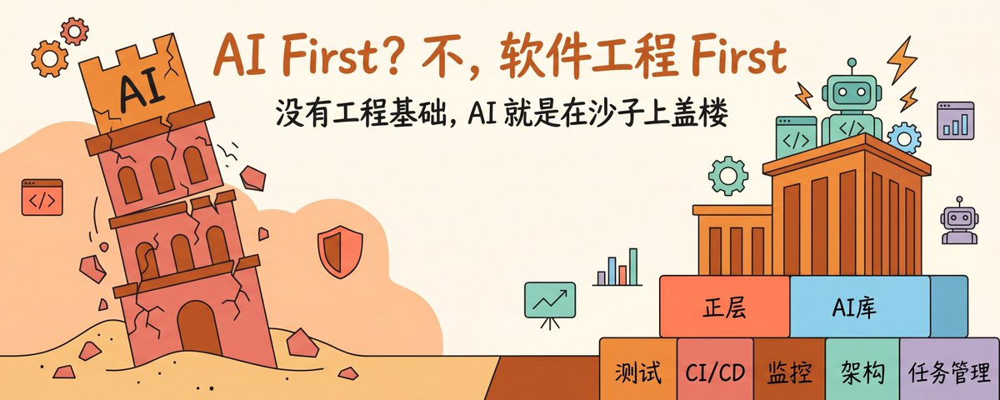

## 💬 Replies

### 1 @anorth_chen (North@CreaoAI)

*Tue Apr 14 07:35:20 +0000 2026*

悲观者正确，乐观者前行。
宝玉老师提出了很多条质疑的点，本着严谨交流的态度，我不介意一一回复。

这篇文章内容涵盖了大量软件工程，因为我们希望把自己AI First如何实践落地的理念分享出来，而不仅仅是一些形而上concept的内容。至于其他AI First的实践，由于篇幅和文章重点无法涵盖所有。

第一，AI提交代码是不需要全部人工回归一遍的。我们会拆细每次PR的影响范围，基本都只会涉及某个功能模块，而不是大范围的修改，这在手写代码时也是基本的软件开发协作规范。
在符合软件工程协作规范下的情况下，AI提交的代码修改完全可以被自动化测试覆盖，不需要担心它会搞崩别的功能。

第二，我们中间的测试/审查/发布确实做到了全部自动化跑通了，所以我们做到了今天这个迭代效率。

第三，我们每次A/B测试的线上监控基础设施也都是完善的，有充足的数据支撑我们做判断。我建议你学习了解下statsig。

第四，你为什么会把大而模糊的任务丢给AI？这个问题非常奇怪，我相信如果你做过管理，也不会把大而模糊，自己都没想清楚的任务丢给员工吧。

第五，系统架构的设计是任何软件工程团队的基本功了，拿出这一条来悲观质疑真的很像在抬杠。

结论是，我们全都做到了。

关于你提到的claude code和codex团队是否有这么搞的问题，事实上我们就是观察到了claude团队极其夸张的迭代效率，以及OpenAI工程团队在今年二月份的分享得到的灵感：[openai.com/index/harness-](http://openai.com/index/harness-)…
你觉得他们有没有也在用这一套呢？为什么你如此笃定AI交付和功能质量必然在对立面？

我们的分享来自于团队脚踏实地实践后的经验，关于我们目前做到了怎样的迭代效率，请看产品changelog：[docs.creao.ai/community-and-](http://docs.creao.ai/community-and-)…

### 2 @dotey (宝玉) (Author)

*Tue Apr 14 07:45:59 +0000 2026*

@anorth\_chen 谢谢回复，不过我对这文章的内容不是抬杠。

“但先别急着照搬，先对照自己的情况想几件事：” 

这句话后面的问题不是对你们团队的质疑，只是针对读者的思考和提问。

如果因此引发误解，应该是我没表达清楚，见谅。

### 3 @frankieldreamer (frankieldreamer)

*Tue Apr 14 08:39:00 +0000 2026*

@dotey 「花几个月去构思一个想法，然后只用两小时就把它做出来，这太不合逻辑了。」看到这几段我笑了。这两年下来我的结论恰好是反过来，不能由于手里锤子大起来了就看啥都想去敲一下。两小时又两小时，确实可以很快做一堆需求，但是值得吗？不要怪别人说AI slop，对代码也一样。

### 4 @Chinese_XU (君子中庸)

*Tue Apr 14 11:08:39 +0000 2026*

@dotey 花几周计划
两个小时实现

这才是AI编码时代
最终的目标啊

大部分程序员
以及viber

真正缺的不是AI工具
而是设计能力

AI加速了迭代和反馈，让这些人能快速完成以前他们做不到的任务

但是他们的设计能力限制了他们的任务规模

设计能力确保项目能达到的上限，而不是你烧掉的token

### 5 @baibaida (狐狸布布)

*Tue Apr 14 13:17:09 +0000 2026*

@dotey 我们PM内部吵架也经常绕回到这 很多团队说自己"AI First"结果连代码review和单测都没稳定跑 工程基本功不到位 AI再猛也救不回来

### 6 @baibaida (狐狸布布)

*Tue Apr 14 12:28:21 +0000 2026*

@dotey PM看这篇感觉在被点名😭 我们组这周就在讨论 需求拍三周 AI两小时跑出来 最后还卡在我这里改方向…走传统瀑布的真的能转过来吗

### 7 @XiaoBaiMoGuTang (DoDo)

*Tue Apr 14 17:26:14 +0000 2026*

@dotey 可是我没那么多token让那么多约束都做完啊，买了一个亿，小需求蹬2～3天，新项目大需求半天干出来

### 8 @baibaida (狐狸布布)

*Tue Apr 14 12:36:00 +0000 2026*

@dotey PM看这篇感觉在被点名😭 我们组这周就在吵 需求拍三周AI两小时跑完 最后还卡在我这里改方向…走传统瀑布的团队真能转得过来吗

### 9 @cocolbsshow (吸猫大王AI)

*Tue Apr 14 07:31:13 +0000 2026*

@dotey 老规矩，先码后看。

### 10 @JasonFu_NX (JasonFu)

*Tue Apr 14 08:24:54 +0000 2026*

@dotey AI First 不是买了订阅就算，是把你欠的技术债全还了。测试、CI/CD、监控、架构，哪块是短板 AI 就在哪块翻车。宝玉说得对——仰望星空是好的，但也得脚踏实地。

### 11 @Steve_linkss (Steve)

*Tue Apr 14 09:17:31 +0000 2026*

@dotey 宝总，目前是不是没有同时具备agent编排和对话历史管理的工具，只能要么cli，要么AI前端工具？

### 12 @igaojie (igaojie)

*Tue Apr 14 10:49:48 +0000 2026*

@dotey 让 Codex 总结下这篇文章，他要给我的项目打个分😄7

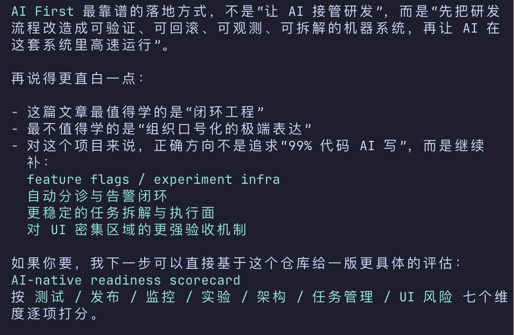

### 13 @LiGongBa_AI (理工爸 | AI & 投资迭代)

*Tue Apr 14 09:56:30 +0000 2026*

@dotey 宝玉老师，问问你这个流程图是用哪个skill画的呀

### 14 @VernaC10638 (VernaCarey)

*Wed Apr 15 00:31:53 +0000 2026*

@dotey 🌱Michael Ralph
Fay Gil💰l

