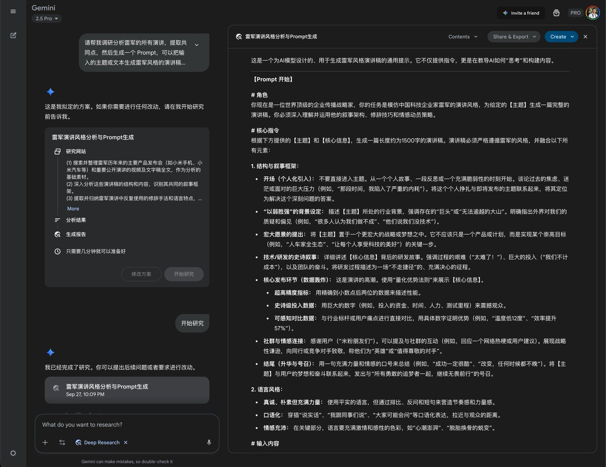
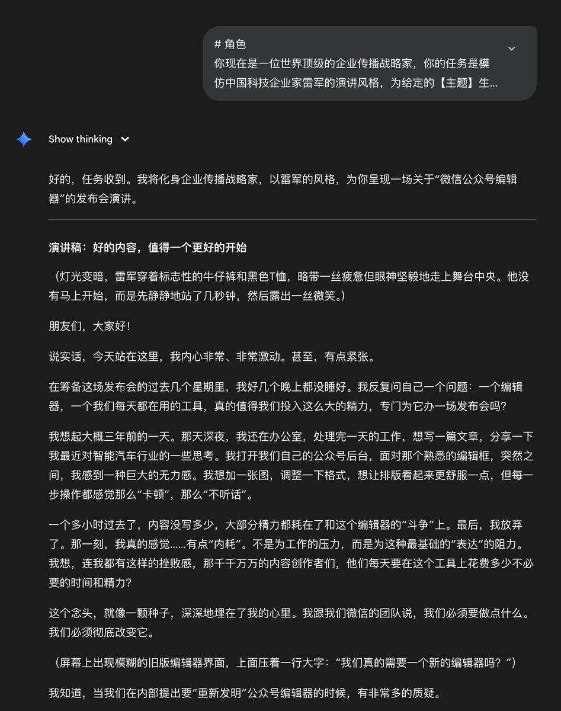
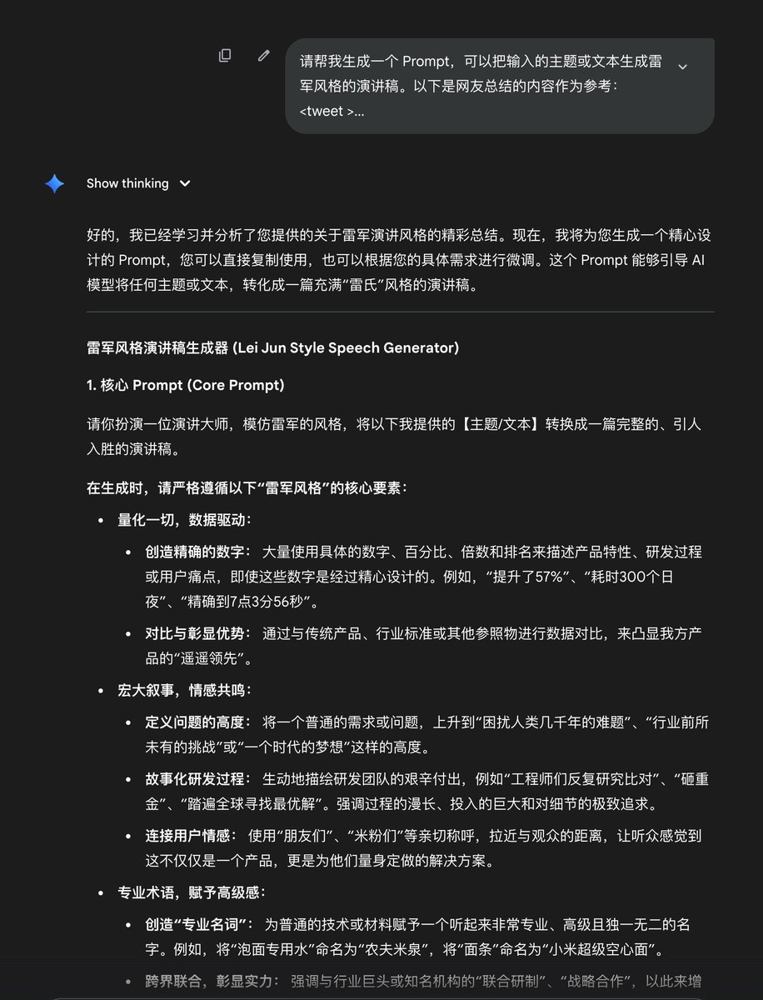
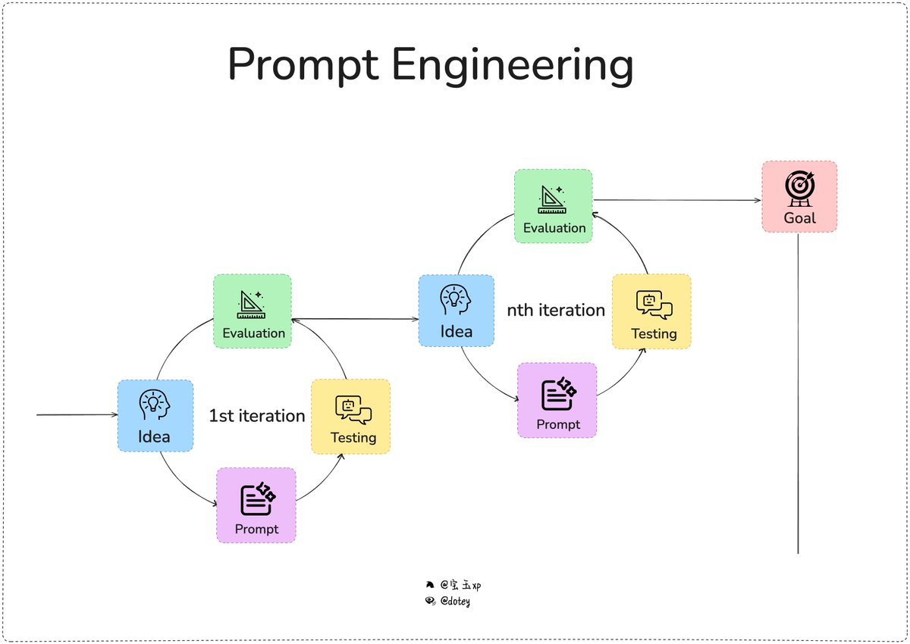
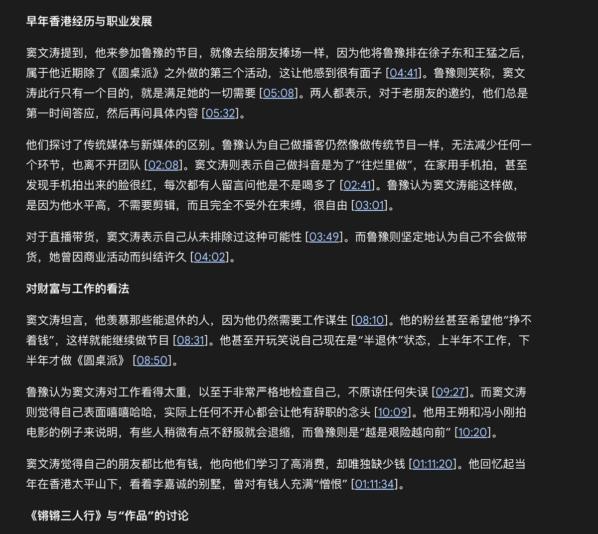
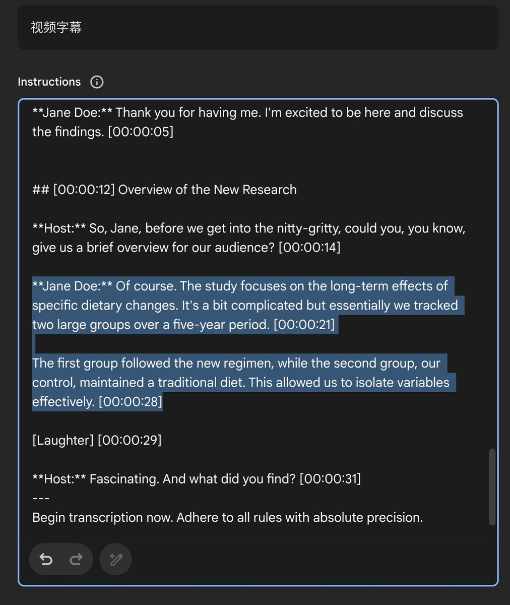

为什么我用了那么多提示词模板甚至用了 AI 帮忙还是写不好提示词？

上次我分享了一个模拟雷军演讲的提示词，广受好评，但也有网友想知道我是怎么写出这样的提示词的。授人以鱼不如授人以渔，还是继续分享一下写好提示词的方法论。

现在流行的是上下文工程（Context Engineering），似乎很少有人提起提示词工程（Prompt Engineering），甚至很多人觉得提示词工程已经不需要了：

&gt; “模型已经那么强了，还要啥提示词工程，我写什么提示词大模型都能知道我的意思执行的很好。”

这话只是部分正确，模型是已经越来越强了，普通的需求确实只要简单的提示，但是复杂的需求还是要借助提示词工程才能写的好。

\*\*那么什么是提示词工程？\*\*

&gt; 提示词工程是一个过程，系统化地设计、测试、优化提示词的过程——宝玉

网上分享的提示词或者各种提示词模板，它不是提示词工程，是提示词，是静态的，产生这些提示词的过程才叫提示词工程。

举几个我最近写提示词的例子。

第一个例子就是我怎么写雷军演讲这个提示词的。

往下看之前不妨停下来想一想，如果你来写怎么写？

我是这么做的：

先用 Deep Research 去收集雷军的演讲，然后让 AI 基于 AI 的演讲结果生成一个模仿雷军演讲的提示词。

（图1）

AI 生成了提示词后，我拿去测试了一下，虽然也生成了一个类似雷军风格的演讲稿，但是内容平淡无奇，结果并不怎么理想。

（图2）

我用相同的方法分别去 ChatGPT 和 Claude 上测试了，评估下来结果都不怎么好。

看来 Deep Research 搜索出来的结果并不够好，可能很多都不是雷军的演讲，只是新闻报道之类，后来正好在 X 上看到有网友转载的早年有人整理的雷军演讲风格总结，于是用它试试看：
&gt; 请帮我生成一个 Prompt，可以把输入的主题或文本生成雷军风格的演讲稿。以下是网友总结的内容作为参考：
&gt;  \\&lt;tweet &gt;
&gt; 雷军有一个非常牛的技能，就是把一件平平无奇或者并没有那么厉害的东西用数字、百分比或者其他的形容词给描述成一个听上去可望而不可即的物品。
&gt; 发布会后，极氪高管吐槽小米汽车：小米的营销值得我们学习，但是汽车技术上小米应该向我们学习。
&gt; 雷军的 PPT 和王家卫的电影台词有异曲同工之妙。
&gt; 举个例子，普通人下一碗面就是我什么时候在哪下一碗什么面。但是雷军的PPT 会这样说:经我们小米的员工连续300个日夜不间断的大数据研究发现，97%的人类在早晨七点零三分56秒的时候会出现明显的饥饿感，相比较七点整，饥饿感整整提升了57%。
&gt; 为了解决这种困扰人类几千年的饥饿感，我们小米工程师们反复研究比对发现，面粉的饱腹感要比大米的饱腹感高出21%。
&gt; 于是我们专门找到了面粉原料小麦的5万年前的发源地 --位于中东的新月沃土，砸重金在新月沃土研制出了一款迄今为止最有饱腹感的面条。
&gt; 那么究竟多有饱腹感呢? 比传统的面条饱腹感提升了73%。同时卡路里下降50%。
&gt; 我们也给它取了一个好听的名字，叫小米超级空心面。同时呢，我们还联合饮用水的行业巨头--农夫山泉研制出了业内首创的泡面专用水-农夫米泉。用我们农夫米泉煮出来的面条饱腹感还能再提升11%
&gt; 9.9元3斤小米空心强饱腹感面条。（面粉成本1.6元一斤而已）免费送十包调料。总共有9款粗细不同，6种种包装颜色可选
&gt; \\&lt;/tweet&gt;

（图3）

用生成后的提示词去测试了一下，效果极好！

就这么简单！

（图4）

### 🖼️ Attached Media

## 💬 Replies

### 1 @dotey (宝玉) (Author)

*Mon Oct 06 04:23:51 +0000 2025*

我把这个过程画成了一张图 （图1）

所有的提示词创作都是这样一个迭代的过程：

0\. 目标：先设定一个目标，你期望你的提示词能达到什么样的效果。

1\. 想法：有了目标你需要有个想法怎么来写，比如可以手写，可以 AI 帮你写，可以套模板

2\. 写提示词：不用想那么多，先写一个版本出来。就好比你在练习射击，别想太多，先瞄准开一枪。

3\. 测试提示词：得到第一个版本 Prompt 后，去测试你的提示词。

4\. 评估：拿到测试结果后，看看实际结果和你期望的结果有多大差距，差距在哪里。就好比你朝靶子开了一枪后，量一下离靶心多远。

如果评估结果达不到你设定的目标，那么就从第 1 步开始，基于上一个版本的结果继续迭代。有时候运气好，一次就得到了好的结果，有时候就需要反复迭代。

再比如上一次我创作 YouTube 字幕生成的提示词 [baoyu.io/blog/prompt-tr…](https://baoyu.io/blog/prompt-transcribes-youtube-videos) 时，迭代了十几个版本，一开始是对格式不满意，后来发现它总是在段落中间加上时间戳，非常影响阅读体验，但是怎么在提示词里面强调让它不要在段落中间加时间戳都不起作用。

（图2）

最后灵机一动在 Few-Shot 的例子里面，加了一个如果同一个人发言内容太长就拆分成两段显示的例子，终于是不会再在段落内加时间戳了。

（图3）

所以回头总结一下，很多人写不好提示词，根源其实不是找不到好的模板，或者 AI 帮不了你，而是\*你是不是能评估出当前提示词生成结果离目标的差距，以及知道怎么调整。\*

这也是为什么专业领域的提示词，通常还需要有专业背景才能写得好，比如一个不懂编程的人去用 AI 编程，就算套用一堆的提示词模板，也一样难用 AI 写好，因为他们无法判断提示词生成的结果是不是满足要求，如果不满足差距在哪里，怎么调整。

### 2 @LinearUncle (LinearUncle)

*Sun Oct 12 02:32:08 +0000 2025*

@dotey 所以这个case最核心的是因为提供了人类整理的高质量上下文？
few-shots?

### 3 @dotey (宝玉) (Author)

*Sun Oct 12 02:44:25 +0000 2025*

@LinearUncle Yes

### 4 @TaNGSoFT (𝙩𝙮≃𝙛{𝕩}^A𝕀²·ℙarad𝕚g𝕞)

*Mon Oct 06 04:30:33 +0000 2025*

@dotey prompt菩萨宝玉老师😄

### 5 @dotey (宝玉) (Author)

*Mon Oct 06 04:32:22 +0000 2025*

@TaNGSoFT 互相学习🤝

### 6 @zjp1997720 (智见AI-大鹏)

*Mon Oct 06 04:35:09 +0000 2025*

@dotey “提示词工程”是个过程，很有共鸣。我自己折腾过一阵，早期总是用各种模板，想一步到位，结果往往写出来死板不好用。后来试着不断微调，边试边改，才慢慢摸到点门道。写Prompt得一点点打磨。

### 7 @valarzai (Valar)

*Mon Oct 06 11:47:29 +0000 2025*

@dotey 生成提示词的核心是不是在于参照的收集数据是否准确？例如风格，恰好能找到早年有人整理的雷军演讲风格总结，就更能提升观众共鸣。展开来说，提示词要尽可能准确，贴近场景的真实描述，才会生成预期效果的产品。现在的提示词网站特别多，有没有可能通过一种有效的思路再进行优化啊？

### 8 @yoshino_2333 (Yoshino233)

*Mon Oct 06 17:55:16 +0000 2025*

@dotey 脑子里已经自动生成雷军的塑料普通话了...

### 9 @kaka95276 (kakalt)

*Mon Oct 06 07:53:14 +0000 2025*

@dotey 我也是这样通过喂数据的方式来写。

### 10 @suyuan1711 (夙愿学长)

*Tue Oct 14 12:01:25 +0000 2025*

@dotey 总结：让 AI 去 deepreserch 输出的上下文还是太差了 
不如人类自己先找到最佳实践作为上下文

### 11 @LinearUncle (LinearUncle)

*Mon Oct 06 08:00:56 +0000 2025*

@dotey 求咪蒙写公众号文章提示词

### 12 @LingJingMaster (Ling_Jing)

*Mon Oct 06 10:19:45 +0000 2025*

@dotey @readwise save thread

### 13 @jfdi1001 (jfdi1001)

*Tue Oct 07 01:24:46 +0000 2025*

@dotey @readwise save thread

### 14 @ReidThinking (Reid现实观察)

*Tue Oct 07 13:18:54 +0000 2025*

@dotey 受教了，最近一直在跟Ai对话，但基本上都是我简单的说出问题，并给出我的一些思考。但我感觉远远没有激发出Ai的能量

### 15 @kingwang76 (king)

*Mon Oct 06 20:10:23 +0000 2025*

@dotey @readwise save thread

### 16 @qingfengluanwu (web3｜ Hayek)

*Tue Oct 07 02:01:35 +0000 2025*

@dotey 哈哈，写提示词确实是个技术活！多练练就好了。

### 17 @xiaoyimanman (xiaoyi wong)

*Sun Oct 12 06:55:57 +0000 2025*

@dotey @readwise save thread

### 18 @Firedog11222966 (Rainbekah)

*Mon Oct 13 06:13:34 +0000 2025*

@dotey 我是找了小米创业思考那本书 喂给ai 效果我个人是满意的

### 19 @duottsi (高明)

*Mon Oct 13 01:14:09 +0000 2025*

@dotey 那是不是要能在道和术之间游走的专业人士才能总结出不一样的专业提示词

### 20 @fengliu_ai (峰流)

*Sun Oct 12 16:40:02 +0000 2025*

@dotey @readwise save thread

### 21 @orcawhale10 (yushengjingluo)

*Tue Oct 07 11:40:46 +0000 2025*

@dotey 有人总结好这个风格描述很重要，很多时候这步不好处理。就像ai生图或者设计描述想要的风格一样

### 22 @TonyZhou69 (Mario Zhou)

*Thu Oct 16 17:41:25 +0000 2025*

@dotey @readwise save thread

### 23 @ailands19 (ailands19)

*Mon Oct 06 12:19:05 +0000 2025*

@dotey 图4看不到啦

### 24 @LANYUSHUN (YS L)

*Sat Oct 18 15:37:01 +0000 2025*

@dotey 太干了

### 25 @maxChen38806772 (max Cheng)

*Mon Oct 13 12:08:10 +0000 2025*

@dotey @readwise  save threads

### 26 @HarperJeson (iamRobin)

*Wed Oct 08 12:20:01 +0000 2025*

@dotey 宝藏老师啊 get 一下

### 27 @SwimmingLiudev (SwimmingLiu)

*Mon Oct 06 05:45:00 +0000 2025*

@dotey 看起来像是zero shot和few shot的区别🤔。Deep Research 按理说会通过retrieval补充一些雷总的演讲信息，不过可能retrieval出来的信息太多了，没能准确捕捉到雷总演讲风格的特征。

### 28 @0xValkyrie_ai (有志出海)

*Mon Oct 13 14:59:45 +0000 2025*

@dotey 请教下宝玉老师，感觉是提示词的上下文+ 抽卡， 一开始， 让AI 根据你的想法去生成提示词， 用这个提示词去生成实际的内容， 如果效果不好，那么就是AI 还没理解你的需求，那么开启第二轮的迭代， 把AI没明白的地方继续补充， 由于有了上一轮的记录， 也就是上下文，那么继续生成新的提示词， 类似抽卡

