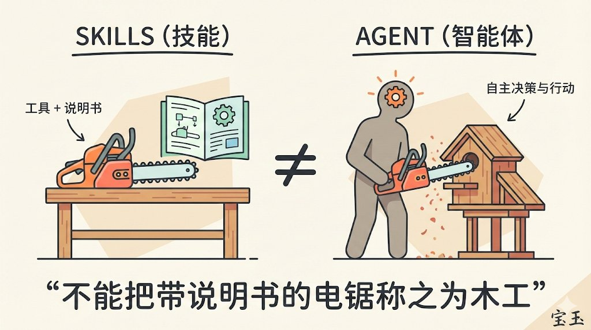

为什么说 Skills 不是 Agent？

因为“我们不能把一个带说明书的电锯称之为木工” 

## 💬 Replies

### 1 @fjun99 (fangjun)

*Sun Jan 25 03:29:57 +0000 2026*

@dotey 好像类比可以再斟酌下

skills 说明书

agent 电锯

人 伐木工/林场老板？

这样可行？

### 2 @dotey (宝玉) (Author)

*Sun Jan 25 03:36:08 +0000 2026*

@fjun99 电锯没有自主性

### 3 @wangdefou (得否)

*Sun Jan 25 08:58:48 +0000 2026*

@dotey 这总结太精辟了！以后再有人问我，我就这么回答他

### 4 @AlpacaNotes (小羊驼杂记)

*Sun Jan 25 03:30:53 +0000 2026*

@dotey 我感觉就是宏指令加上一些基于语义理解的执行。如果是Agent是人脑的延伸，那Skills应该算是人的手的延伸。

灵活性方面，Skills比Agent弱一些，但活动范围更大一些，行动更加规范。

### 5 @ShotAI_io (ShotAI)

*Sun Jan 25 12:20:17 +0000 2026*

@dotey 如果没能在skills里面显式给出一些corner case的处理方法，实际用的效果就仰仗agent本身的判断力和智能了。

### 6 @0xValkyrie_ai (有志出海)

*Sun Jan 25 04:04:52 +0000 2026*

我的理解，AGENT 是带着大模型的， 也就是需要配置大模型以后，agent 才能启动。

 但是skill的架构， 感觉并没有接入模型的配置， 除非在脚本中单独配置。 所以等同于带着说明书的tool。就好比skill= 汽车， 但是汽车的驾驶要由人或者agent 才能指挥才可以
 
昨天我把宝玉老师的skill转成coze， 他也是调用了coze 自己的生图模型。

### 7 @nekocode_cn (nekocode)

*Sun Jan 25 05:31:14 +0000 2026*

@dotey 两个维度。Agent 是运行时，Skills 是资产。

### 8 @lincolnstark5 (lincoln.拖雷)

*Sun Jan 25 11:15:31 +0000 2026*

@dotey 在哲学上是清晰界定区别并不难：
skill 是逻辑功能，相同输入的输出是确定稳定可重复，科技叫function.
agent ，就是prompt 以及flow 控制的llm， llm的类人状态机结果，不稳定而且不重复.
虽然现在没有清晰界定.. 早晚聊天是三栏目结构，左边agent右边skills中间打字，或动态生成的gui...，以及结果

### 9 @YangGuangAI (阳光)

*Sun Jan 25 03:29:20 +0000 2026*

@dotey 有不少人把skill多=agent能力强，这就像给1个木工买了100把电锯。

真正决定产出的是"木工"的判断力。

### 10 @ayakoaifei (AYAKOAI)

*Sun Jan 25 08:34:28 +0000 2026*

@dotey 有人总想脱掉她的裙子，宝玉老师为她穿上了内裤🩲

AI发展如日中天，更应思考使用方向而非逻辑方向，毕竟它是为人类服务的工具。

### 11 @ljhspurs (JimmyJacy)

*Sun Jan 25 03:36:13 +0000 2026*

@dotey 只有名词的句子和带动词的句子的区别😸

### 12 @tonyfeng (Tony Feng)

*Sun Jan 25 05:09:11 +0000 2026*

@dotey 宝玉老师的类比太形象了，秒懂

### 13 @zwdroidai (zwdroid)

*Sun Jan 25 08:14:39 +0000 2026*

@dotey skill 是工具，agent 是工具人😂

### 14 @valarzai (Valar)

*Sun Jan 25 12:18:21 +0000 2026*

@dotey 工具是被动的，它等待指令
Agent 是主动的，它对结果负责

### 15 @bityeung (Sunnyeung369)

*Mon Jan 26 06:30:02 +0000 2026*

@dotey 这比喻太棒了 农村不识字的老头儿一听都能秒懂

### 16 @YanceyOfficial (𝒴𝒶𝓃𝒸ℯ𝓎 ℒℯℴ)

*Sun Jan 25 11:06:45 +0000 2026*

@dotey Skills 是编译时，Agent是运行时

### 17 @hishn948957 (白)

*Sun Jan 25 03:29:52 +0000 2026*

@dotey 好形象的解释

### 18 @guijiewan (0x)

*Sun Jan 25 16:24:02 +0000 2026*

@dotey Skills是工作SOP， 是技能知识的静态集合
Agents是“活体”，完全两码事

### 19 @Kangkang776 (Kangkang｜AI Engineer)

*Sun Jan 25 04:01:31 +0000 2026*

@dotey 🤪🤪🤪

### 20 @zhaowh3613 (森叔)

*Sun Jan 25 11:48:25 +0000 2026*

@dotey skill可以是agent 的一部分，但无法替代agent

### 21 @solo_lever (杠哥)

*Sun Jan 25 12:25:32 +0000 2026*

@dotey 所谓 Agent，核心在于“自主闭环”。现在满大街的套壳应用只不过是给电锯装了个语音助手。拿着说明书的不是木工，只会调 API 的也不是架构师。没有决策力的代码，永远只是工具，成不了你的数字替身。

### 22 @yofine2js (yofine)

*Sun Jan 25 09:24:21 +0000 2026*

@dotey 除非他是电锯人 

### 23 @niumaweb3 (web3牛马Ⓜ️Ⓜ️T)

*Sun Jan 25 05:52:05 +0000 2026*

@dotey Agent不是技能的简单堆叠  
而是具备自主决策和适应能力的系统  
就像电锯只是工具，木工才是创造者

### 24 @niki_bcy (SEC_DOG_XXX)

*Tue Jan 27 03:06:03 +0000 2026*

@dotey 👍

### 25 @nuclearrocksto (核动力岩石)

*Sun Jan 25 07:15:26 +0000 2026*

@dotey 宝玉老师，想问一下有没有适合给GitHub项目生成封面图的Prompt

### 26 @laozhang2579 (老张来了)

*Sun Jan 25 03:33:38 +0000 2026*

@dotey 电锯只是工具，木工才有灵魂；可惜现在满大街都是拿着说明书装大师的电锯😂

