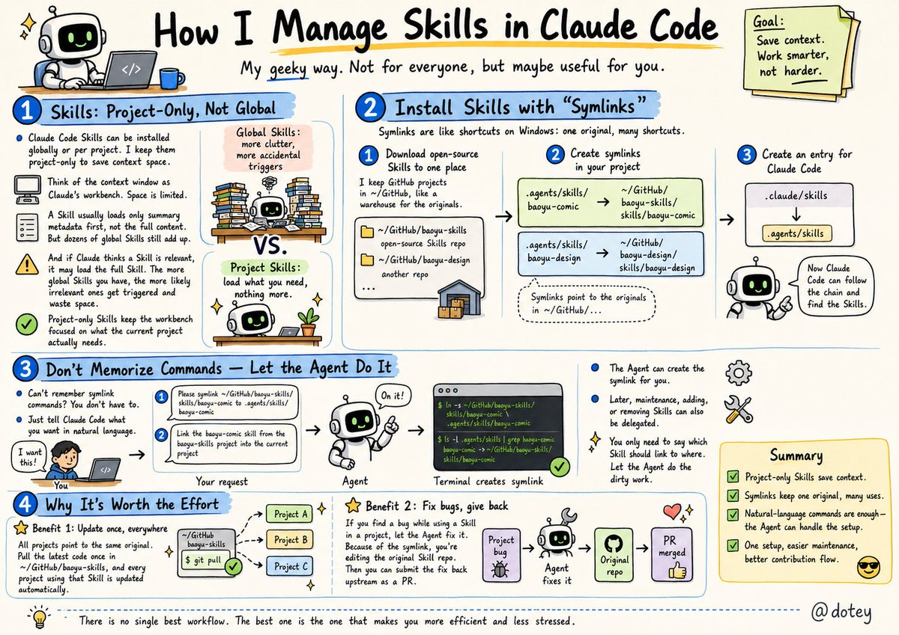
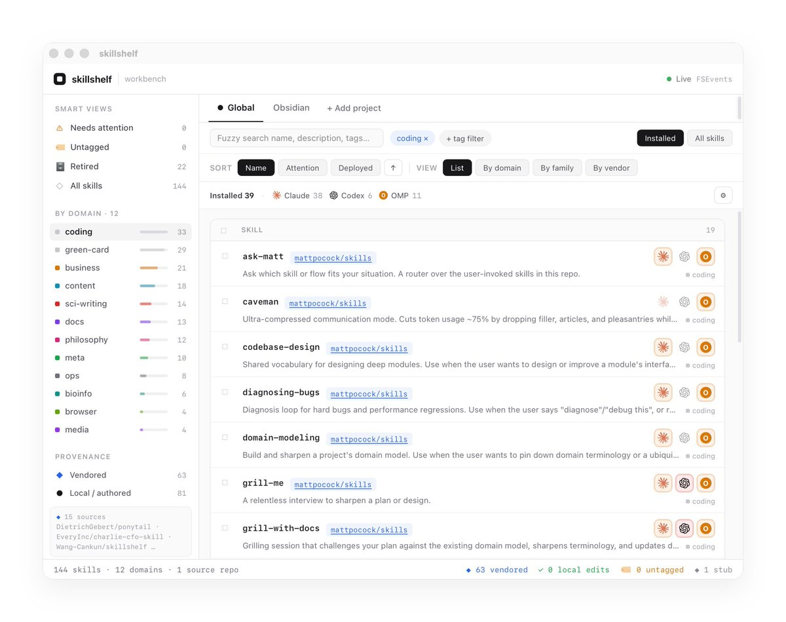
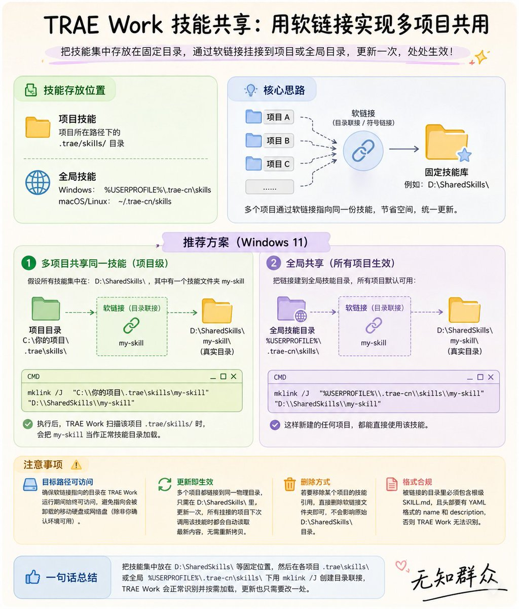

分享一下我管理 Skills 的方式，偏极客风格，不一定适合所有人，但可以给大家提供一个思路。

一、Skills 只装在项目里，不装全局

Agent 的 Skills 可以装在全局（所有项目共享）或者项目内（只有当前项目能用）。我选择只装在项目内，最主要的原因是节约上下文空间。

Agent 在工作时有一个上下文窗口，你可以把它想象成 Claude 的工作台——台面大小是有限的。虽然 Skill 默认只会加载名称、描述等摘要信息（不会把完整内容全部摊开），但积少成多——全局装了几十个 Skill，光是这些摘要加在一起也会占掉不少工作台空间。而且一旦 Claude 判断某个 Skill 跟当前任务相关，就会把它的完整内容加载进来，全局 Skill 越多，被误触发的概率也越大，白白浪费空间。

只在项目内安装真正需要的 Skills，工作台上就只摆当前用得到的资料，把宝贵的空间留给更重要的内容，Claude 干活也更高效。

二、用软链接来安装 Skills

这是我管理方式的核心，先解释一下什么是软链接。

你可以把软链接理解成 Windows 的快捷方式——文件本体只有一份，但你可以在很多地方创建快捷方式指向它。改了本体，所有快捷方式指向的内容都会同步变化。

我的具体做法分三步：

第一步：把开源 Skills 项目下载到统一的目录

我在电脑上有一个专门存放 GitHub 项目的文件夹 \~/GitHub，所有下载的开源项目都放在这里面，比如：

\~/GitHub/baoyu-skills      ← 存放各种 Skills 的开源项目
\~/GitHub/baoyu-design      ← 另一个开源项目

这个文件夹就像一个仓库，所有 Skills 的原件都保存在这里。

第二步：在自己的项目中创建软链接

假设我有一个写作项目 \~/GitHub/baoyu-writing，里面需要用到好几个 Skills。我不会把 Skills 复制进来，而是创建软链接，让项目指向仓库里的原件：

项目内的路径                         →  实际指向的位置（原件）
.agents/skills/baoyu-comic          →  \~/GitHub/baoyu-skills/skills/baoyu-comic
.agents/skills/baoyu-design         →  \~/GitHub/baoyu-design/skills/baoyu-design

第三步：给 Claude Code 建一个入口

最后再创建一个软链接，让 Claude Code 能找到这些 Skills：

.claude/skills  →  .agents/skills

这样 Claude Code 就能顺着这条链找到所有需要的 Skills 了。

三、不用记命令，让 Agent 帮你干

看到这里你可能会想：软链接的命令我记不住怎么办？

完全不用记。直接用自然语言告诉 Codex/Claude Code 你要做什么就行了，比如：

&gt; 帮我把 \~/GitHub/baoyu-skills/skills/baoyu-comic 软链接到 .agents/skills/baoyu-comic

甚至更简单：

帮我把 baoyu-skills 项目里的 baoyu-comic 这个 skill 链接到当前项目

Agent 会自动帮你创建软链接，后续的维护、添加、删除也都可以交给它。你只需要说清楚要把哪个 Skill 链到哪，剩下的脏活累活让 Agent 干就好。

四、为什么值得这么折腾？

初次设置确实比直接复制粘贴多花几分钟，但后续维护特别省心，主要有两个好处：

好处一：更新只需一次。因为所有项目都是通过软链接指向同一份原件的，所以当开源项目有更新时，我只需要去 \~/GitHub/baoyu-skills 拉取最新代码，所有用到这个 Skill 的项目就自动变成最新版了。

好处二：修了 bug 可以直接反哺。比如我在写作项目里用漫画 Skill 画漫画时发现了一个问题，直接让 Agent 修复就好。因为是软链接，Agent 修改的其实是仓库里的原件（\~/GitHub/baoyu-skills/skills/baoyu-comic），我可以直接把修复提交到开源项目，相当于顺手给开源社区做了贡献。

### 🖼️ Attached Media

## 💬 Replies

### 1 @dotey (宝玉) (Author)

*Wed Jun 24 06:54:55 +0000 2026*

Skills 的更新就跟着 git 走最好，通常都是开源项目，哪怕不是开源的也可以用私有 git repo 管理起来，需要更新去对应项目 git pull 一下，需要特定版本就去 git checkout。
这事你也不用自己做，可以在 Codex/CC 里面搞个定时任务，自动做
[x.com/linghucong/sta…](https://x.com/linghucong/status/2069674665476501935?s=20)

### 2 @dotey (宝玉) (Author)

*Wed Jun 24 16:50:33 +0000 2026*

Skill 就是需要一边用一边迭代的，这就是为什么我是用软链接指向同一位置，就是为了方便更新，因为无论在哪个项目中我发现问题，都可以直接更新原始位置。

但如果是别人的 Skill，你需要经常更新，最好 fork 一份，这样有修改都在你本地，也可以定期和upstream同步
[x.com/YooLien\_T/stat…](https://x.com/YooLien_T/status/2069819482802114785?s=20)

### 3 @LinearUncle (LinearUncle)

*Wed Jun 24 04:55:54 +0000 2026*

@dotey skills 只放在项目内的话，有一些日常频次比较高的工作流怎么办？
例如：twitter /youtube视频-&gt;字幕文字稿-&gt;AI 问答
z-library 下载书籍
iPhone“提醒事项”增删改查
等等一些常见的日常任务，是放到一个项目里吗？每次去那个固定项目里操作？感觉有点麻烦

### 4 @dotey (宝玉) (Author)

*Wed Jun 24 04:57:21 +0000 2026*

@LinearUncle 我自己就是固定项目，全局skill也不是说不行，少一点就好

### 5 @FeitengLi (Feiteng)

*Wed Jun 24 04:18:10 +0000 2026*

@dotey 宝玉老师的skill 我是装全局的，而且跨工具共享， Claude code Codex 都必须有

### 6 @dotey (宝玉) (Author)

*Wed Jun 24 04:25:03 +0000 2026*

@FeitengLi 很荣幸🙏，少数的还好，多了还是建议放项目内

### 7 @ixiaowenz (Xiaowen)

*Wed Jun 24 04:13:19 +0000 2026*

@dotey 我也是这么干的，专项专用，我有一个装 SKILL 和测试调试 SKILL 的项目，靠软连接提供给工作区项目。

### 8 @stevencheng (Steven Cheng)

*Wed Jun 24 09:48:16 +0000 2026*

@dotey 软链接确实省心。我还会加个.gitignore，避免把源文件误提交到项目仓库里。

### 9 @t20000622yy (也无风雨也雾晴)

*Fri Jun 26 16:00:57 +0000 2026*

@dotey 参考宝玉老师的思路，做了个跨 Agent 的 skill 管理版：
已经把电脑上的好多个agent各安装一份的skill管理起来了，
\~/.agents\_skills 做唯一原件，Claude/Codex/Pi/OpenCode 软链，Hermes 用 rsync。

[github.com/awesome-skills…](http://github.com/awesome-skills/agent-skills-manager)

### 10 @bi_9527zx (DeFi狙击手 | Ai🕊️)

*Wed Jun 24 14:54:51 +0000 2026*

@dotey 我来学习你的skills

### 11 @Vinkyu567 (vink)

*Wed Jun 24 05:40:29 +0000 2026*

@dotey 宝玉老师，我就是这样建立一个中央skill仓库，然后cc和codex都是通过软链接来管理的
[x.com/Vinkyu567/stat…](https://x.com/Vinkyu567/status/2068896090167074906)

### 12 @linxiaobei888 (小北)

*Wed Jun 24 11:11:30 +0000 2026*

@dotey skill一多，超过一定的token，剩下的cc和codex都会丢弃掉，所以有些Skill不知不觉就永远不会被触发

### 13 @singkid9527 (Kid)

*Wed Jun 24 11:51:09 +0000 2026*

@dotey 学习了。我一开始也是学的宝玉老师，Skills 放 Github 项目里，在软连接到 各种 Agent。

接下来就是慢慢习惯项目级 Skill 的用法。

### 14 @WangCankun (Cankun Wang)

*Wed Jun 24 20:49:36 +0000 2026*

@dotey 我也做了类似的，主要是根据不同 agent 做项目级别的软链管理+指定更新 

### 15 @wuzhiqunzhong (无知群众)

*Sun Jun 28 05:07:52 +0000 2026*

@dotey 试了下宝玉老师的软链接方法，确实不错👍，我是在trae里用的，skill管理和维护方便多了y

### 16 @Gravy_cell (binwu)

*Wed Jun 24 13:47:50 +0000 2026*

@dotey 我也是这么干的。Claude Code DROID Codex PI都在一个文件夹下面，其他的通过软链接的形式进行管理。

### 17 @xdimedu (姜无维)

*Wed Jun 24 16:56:32 +0000 2026*

@dotey 我也差不多是这样子，skill 跟项目走，随项目提交。宝玉老师总结的全面

### 18 @_junzhen (JZ)

*Wed Jun 24 05:56:38 +0000 2026*

@dotey [github.com/orca-studio/gh…](https://github.com/orca-studio/ghq-skills/)

我选择从 统一管理源仓库的 x-motemen/ghq 加个 skills 子命令来管 \~.\~

### 19 @NiallxYoung (🍙fan)

*Wed Jul 22 00:48:04 +0000 2026*

@dotey 几个月前刷到的时候，我还什么都不懂，觉得对我没什么帮助的帖子，现在我觉得已经很有必要执行了，果然人是需要学习才能理解比你高的人说的东西

### 20 @baibaida (狐狸布布)

*Wed Jun 24 12:19:10 +0000 2026*

@dotey 项目级隔离这点太对了 全局装久了根本想不起来哪个还在用 跟收藏夹吃灰一个道理

### 21 @pluoki (pluoki)

*Wed Jun 24 05:52:58 +0000 2026*

@dotey @grok research github to find existing projects on managing skills symlinks

### 22 @Karadokuy (KunKun折腾手记)

*Wed Jun 24 05:40:35 +0000 2026*

我的做法也是项目内安装 + 软链接，但我不会把软链接当成唯一管理方式。
对我来说，Skill 的源头必须先进入一个可追踪的真理源：要么是我自己的 Skill 仓库，要么是经过 snapshot / adopt / overlay 管理的外部 Skill。然后通过 registry（注册表）和 lock（锁文件）记录它的来源、版本、校验结果，再由 projector（投影器）把当前项目真正需要的 Skills 软链接到 .agents/skills / .claude/skills。这样项目里仍然很轻，只挂当前需要的 Skill；但同时我能回答三个问题：这个 Skill 从哪里来、现在是哪一个 commit、为什么允许它进入这个项目。

### 23 @GavinAgent (王二杠 | AI Agent)

*Wed Jun 24 04:05:11 +0000 2026*

@dotey 确实极客，还非常实用(👍ᐛ)

### 24 @Jackywxsz (Jacky无限生长)

*Wed Jun 24 10:04:47 +0000 2026*

@dotey 大佬的偏技术流，我是直接交给cc Switch管理的，也能实现软连接，skill放项目这点学到了，我目前精简了很多，但还是全局加载的。

### 25 @AndoRAG (Ando)

*Wed Jun 24 09:23:51 +0000 2026*

@dotey 我是在项目了指定他用哪些skill的，也是统一放在一个文件夹里
貌似这样也是软链🤓

### 26 @kim_18162579527 (Aaron)

*Thu Jul 23 00:22:35 +0000 2026*

@dotey 学到了

### 27 @hubo31377762 (hbo)

*Wed Jun 24 23:24:59 +0000 2026*

@dotey @lijigang 和我的做法一模一样，只是我用 openskill 把 skill 安装到 Agent 目录下

### 28 @readyaiplayer (ReadyAIPlayer)

*Wed Jun 24 19:01:06 +0000 2026*

@dotey 受启发

### 29 @ping_zu8939 (祖平 | AI 实战派)

*Wed Jun 24 04:29:25 +0000 2026*

@dotey 这套软链方案我很受用，想追一个协作场景：单人多项目时”改一次处处更新”是纯优点，但多人协作时，别人 clone 你的项目拿到的是个指向你本地 \~/GitHub 的死链。你是怎么处理的——是约定大家仓库结构一致，还是关键 skill 干脆复制进项目、只对自己常改的用软链？我一直在”复用”和”可移植”之间摇摆。

### 30 @Kainative (K.)

*Wed Jun 24 08:21:19 +0000 2026*

@dotey 已经在本地配置了。Skill 的原件只留一份，其他地方全用"快捷方式"指过去。之前我把同一个 skill 复制进十个项目，就有了十份副本，然后用着用改 bug修复也烂在那个项目里回不到原件，更回不到开源社区。软链接就把这个问题从根上掐掉：原件只有一份在仓库里，所有项目都是指过去不是搬过来，很有效。

### 31 @sharebravery (CloudySky North)

*Wed Jun 24 12:32:34 +0000 2026*

@dotey 使用ccswitch管理会更方便

### 32 @TreeShadow_1 (树影)

*Wed Jun 24 07:40:02 +0000 2026*

@dotey 在不同的项目里软链skills，如果不同项目的输入输出的路径可能不一样，宝玉老师有什么建议，是使用配置文件来解决还是有其他更便捷的方案。

### 33 @theDingZhi (鼎の工坊)

*Mon Jun 29 20:27:15 +0000 2026*

@dotey 跟你的用法一模一样除了第三步。 没想到还能这么玩： .claude/skills  →  .agents/skills。 学到了，谢谢！

### 34 @Michael55366361 (Michael Chan)

*Wed Jun 24 04:11:09 +0000 2026*

@dotey 软链接的方法就是跟宝佬学的，现在管理起来很方便👍

### 35 @better_christal (Christal.Z)

*Wed Jun 24 08:58:22 +0000 2026*

@dotey 第三步 .claude/skills 软链这手绝了，Claude Code 直接认路，细节满分！

### 36 @linghucong (飞叔)

*Wed Jun 24 06:51:07 +0000 2026*

@dotey skills的更新也是个问题，有什么好的方案么？

### 37 @YooLien_T (Silliter)

*Wed Jun 24 16:26:34 +0000 2026*

宝玉老师我有个疑问，我在使用过程中经常会去微调下原skill，以适配我的项目的特定需求的能力。
这种情况我目前的做法是直接拉skill到全局，使用过程中发现要调整，直接把skill引入到项目中去调整使用，原有的skill直接就干掉了。
目前已经重新自定义处理了十来个skill了，这样操作是skill的合理的使用方式么

