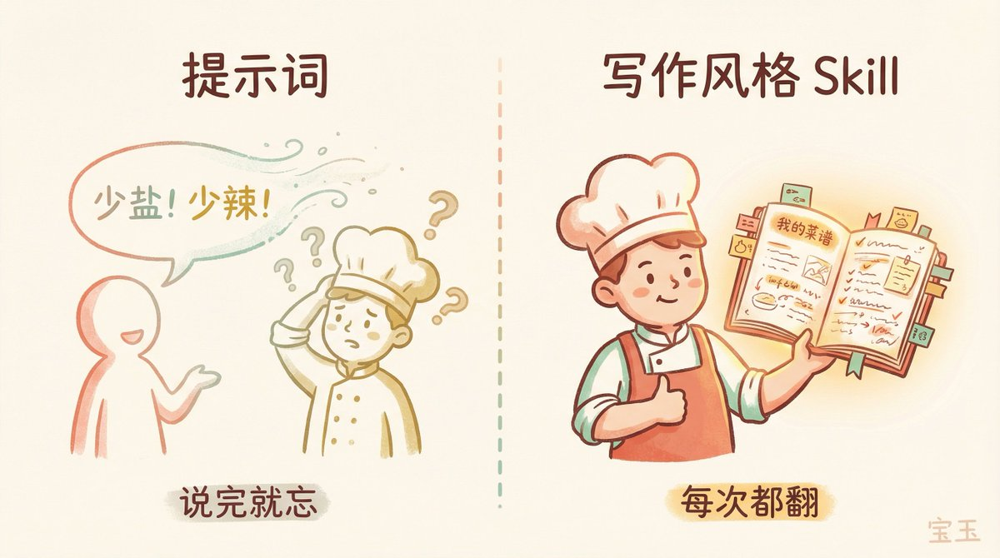
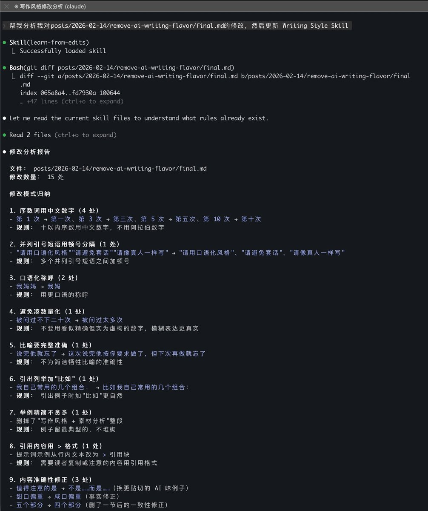
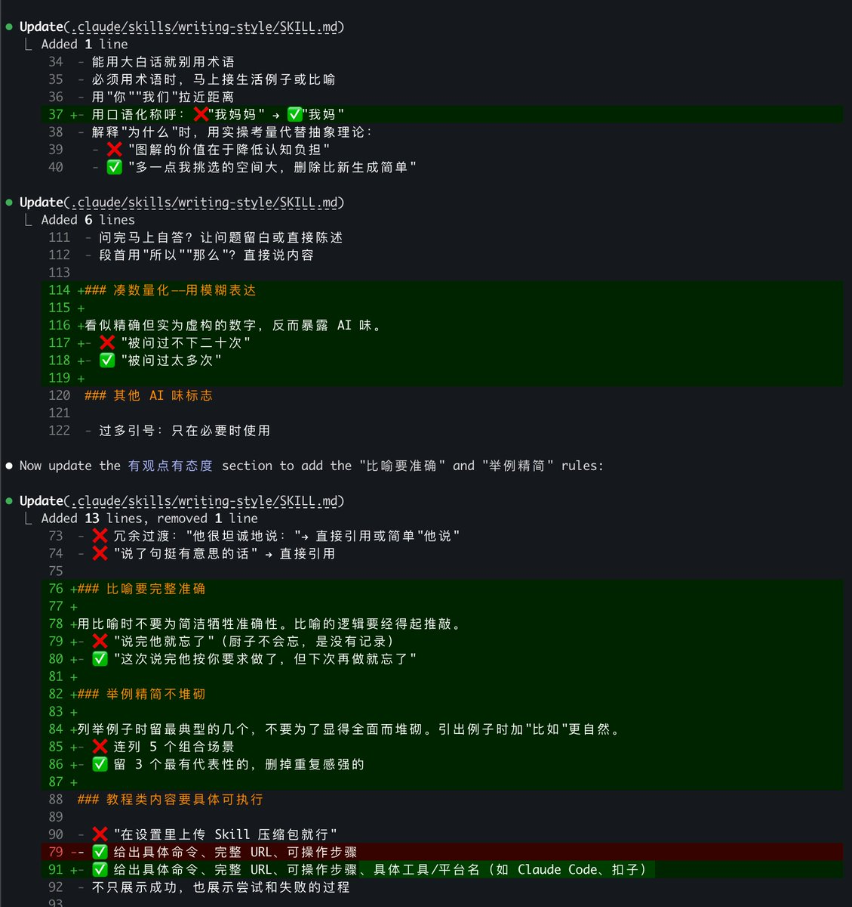
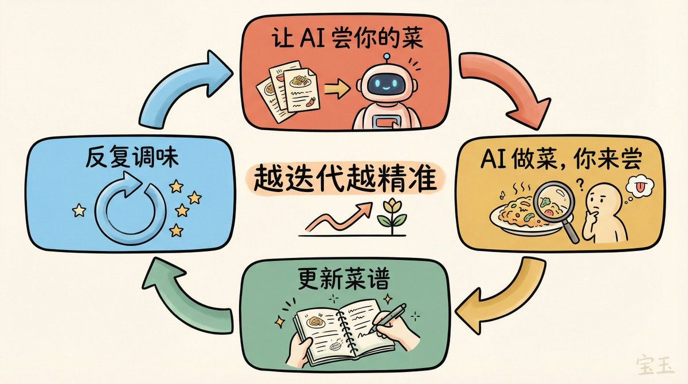
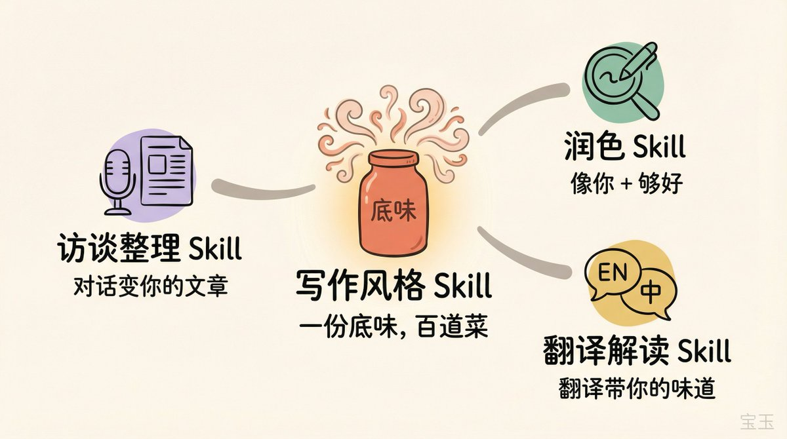
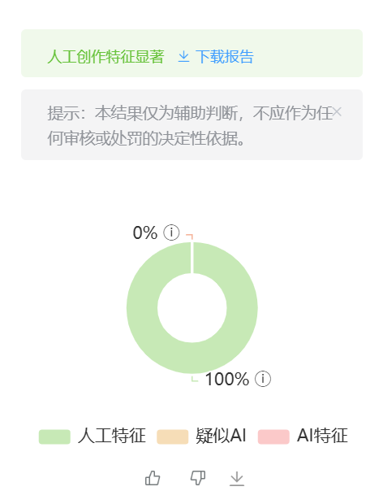

# 📰 别再用提示词去 AI 味了，方向就是错的

小红书搜“去 AI 味”，上万条笔记。B 站相关视频播放量加起来过千万。微博上也有人问我同样的问题：

> “宝玉老师，求教怎么去除 AI 写作的 AI 味啊？”

这个问题我被问过太多次。每次我都想认真回答，但不知从何说起，因为大部分人期待的答案是一条提示词，而我想说的是：所有去 AI 味提示词都是错的。

## 【1】去 AI 味提示词：一场集体幻觉

你一定见过这类内容：“一条提示词彻底去除 AI 味”，“让 ChatGPT 写出人味的万能公式”。

它们教你在提示词里加上“请用口语化风格”、“请避免套话”、“请像真人一样写”。你试了，好像有点用。但过两天再看，还是那个味儿。

为什么？三个原因。

第一，所有人用同一套去 AI 味提示词，产出的内容又变成了新的同质化。你从 AI 味 1.0 切换到了 AI 味 2.0。

第二，提示词是一次性的。你让它“口语化写一篇科技评论”，效果不错。换成写产品文案，又打回原形。你上次改过的那些不满意的地方，它完全不记得。

第三，你从来没告诉 AI 要像谁。你跟它说了一堆“不要”，但它还是不知道你到底想要什么味道。

## 【2】AI 味到底是什么

AI 味不是 AI 写得差。AI 写得很“好”，好到标准、工整、无懈可击，但也好到毫无个性。

AI 在用所有训练数据的平均风格写作。它学过无数人的文字，最后输出一个“最大公约数”。就像一个厨子，做菜不咸不淡不辣不酸，红烧肉有点甜，酸菜鱼有点酸，每道菜都能吃，但你吃不出任何个人特色。

你把“不是……而是……”删了，它还会用别的方式表达那个不咸不淡的味道。因为 AI 根本不知道你是谁、你怎么说话、你习惯怎么组织一篇文章。删一个词解决不了这个问题。

我小时候吃我妈做的红烧肉，酱色很深、咸口偏重，拿到外面未必人人喜欢，但那就是我家的味道。你跟厨子说“别放太多盐、别放味精、别放辣椒”，他能做出一道不难吃的菜，但做不出我妈那道红烧肉。

你在告诉他不要放什么，但从来没让他尝过你要的那个味道。

写作也一样。你得让 AI 尝过你的“菜”。

## 【3】从提示词到写作风格 Agent Skills

提示词是你每次口头跟厨子说"少盐、少辣、别太甜"，这次说完他按你要求做了，但下次再做就忘了。

我的方案是给 AI 一份持续更新的写作风格 Skill（Writing Style Skill）。一份写下来的菜谱，记录了你要的口味、做法、火候和忌口，厨子每次做菜前都会翻一遍。

提示词是一句话或一段话，用完就扔。Skill 是一份完整的文档，几十行到上百行，定义了你的用词偏好、句式习惯、禁止清单、标点规范，AI 每次写作时都会遵循。

提示词是死的，Skill 是活的。 每次你觉得 AI 做的菜“不对味”，改一改，把新发现的偏好更新到菜谱里。用得越久，这份菜谱越精确，AI 越懂你。

我自己的写作风格 Skill 迭代了好几个月，150 多行。这不是一天写出来的，是改了几十篇文章之后慢慢迭代出来的。

你不需要一开始就写这么多。

## 【4】从零开始：四步做出你的菜谱

第一步：让 AI 尝你的菜。

把你写过的三到五篇自己最满意的原创文章，发给你常用的支持 Agent Skills 的 AI Agent，比如 Claude Code、扣子等，让它分析你的写作特点，然后用 skill-creator Skill 生成一个写作风格 Skill。

注意，一定要是你自己写的内容作为参考，不是 AI 帮你写的。AI 会总结出你的用词偏好、句式习惯、结构特点、语气风格。

这一步的产出是一份初版的写作风格 Skill。它不会很准，就像厨子第一次尝你做的菜，能分辨出大致口味偏好，但细节还差得远。没关系，这是起点。

第二步：让 AI 照着菜谱做一道菜，你来尝。

拿一个你正好要写的题目，让 AI 按照你的写作风格 Skill 来写。写出来之后，你一定会觉得“不对，这不像我”。

这时候最关键的动作来了：手动修改。你自己动手，一句一句改成你满意的样子。别在聊天里跟 AI 说“这里改一下”，那没用。

改的过程中，你会发现自己在意的东西。比如你发现你会把“然而”全部删掉，把长句拆成短句，把“我们可以看到”改成“你看”。这些修改就是你口味的 DNA。

怎么对比修改前后的差异？

熟悉 Git 的话用 git diff，一目了然。不熟悉也没关系，直接让 AI 帮你对比，给它这个提示词：

> “对比以下两段文字，第一段是 AI 生成的原文，第二段是我手动修改后的版本。请分析我做了哪些修改，总结修改规律，并据此更新我的写作风格 Skill。”

XIMGPH\_2

第三步：根据你的反馈更新菜谱。

把 AI 原文和你的修改版都发给 AI，让它分析你改了什么、为什么改、背后的规律是什么。然后让 AI 把这些发现更新到 Skill 里。

举个例子。AI 写了一句“作为一名深耕 AI 领域多年的老兵”，我改成了“作为一个做了十几年 AI 的人”。AI 从这个修改中提取出规则：不用军事化用语，不用“深耕”这种商业黑话，具体年数比“多年”更好。

再比如，AI 发现你把所有的“首先……其次……最后……”结构都改成了平铺直叙，它就会在 Skill 里加一条：“禁止使用'首先、其次、最后'的三段式结构，改为自然过渡。”

每一次修改都是训练数据。 几轮下来，Skill 里会积累出非常具体的规则，比你一开始凭空写的规则精准得多。

第四步：反复做菜、反复调味。

这不是做一次就完的事。每写一篇文章，都是一次迭代的机会。

第一次用 Skill 写作，你可能要改一半以上。正常。菜谱才刚起步，信息量不够。到第三次左右，核心风格开始对了。开头不再是“本文将介绍”，结尾不再是“综上所述”，语气也接近你平时说话的感觉了。到第五次，你主要是在改个别用词和句式，大方向已经不需要动了。

到第十次左右，你会有一个意外的感觉：AI 做的菜比你自己做的还像你的口味。它学了你的偏好，还把你的偏好执行得比你本人更一致。你做菜时可能偶尔手抖多放了盐，AI 不会。

XIMGPH\_4

我自己的 Skill 到现在还在更新。就像这一篇，在和 AI 反复迭代了几个版本后，我手动修改了一遍，修改完又迭代了一版。

## 【5】菜谱里写什么：一个通用模板

Skill 文档分四个部分，你可以在这个基础上改。

第一部分：角色与读者。 你是谁？什么身份、什么领域、什么语气？读者是什么人？

比如：“我是一个产品经理，写东西给团队和用户看。口吻像同事聊天，不像写报告。读者是技术背景、时间有限、讨厌废话的人。”

两句话，但它决定了 AI 写作的整个基调。就像菜谱开头写“家常川菜，微辣，三口之家”，厨子立刻知道大方向在哪儿。

第二部分：风格要点。 你的核心写作原则，三到五条就够。比如“说人话”“有观点有态度”“教程要具体可执行”。每条原则下面最好有正面示例和反面示例，AI 看例子比看规则学得快。

第三部分：禁止清单。 这是你的“忌口表”，也是去 AI 味的重点。把你不能忍的表达方式全列上去：废话开场白、强调拐棍、商业黑话、公式化句式、特定的 AI 味词汇。每一类都要给替换方案或者直接标注“删除”。

越具体越好。禁止“说实话”“不得不说”“有一说一”开头，禁止“赋能”“闭环”“抓手”，禁止“总之”“综上所述”结尾。发现一个加一个，这个清单会越来越长，也越来越管用。

但禁止清单也不要太长，上下文塞太多会影响生成效果，而且规则越多越难遵守甚至有自相矛盾的地方。清单长了后可以让 AI 帮你总结归纳一下，AI 特别擅长找规律，有了规律就不需要那么长的清单。

第四部分：参考资料。 术语翻译对照表、常见错误清单、写得好的范文链接。有特定领域术语需要统一处理的，放这里。

四个部分组合起来，就是一份完整的菜谱。先写个简单版本跑起来，在实践中慢慢补充。第一版 20 行就够了。

## 【6】一份底味，百道菜：和其他 Agent Skills 组合

做菜有个概念叫"底味"。川菜的底味是麻辣，粤菜的底味是鲜甜。不管做什么具体的菜，底味是不变的。

写作风格 Skill 就是你所有 AI 写作的底味。不管 AI 帮你干什么活，加载上它，出来的东西就带着你的味道。

比如我自己常用的几个组合：

写作风格 + 润色。 风格 Skill 管“像你”，润色 Skill 管“够好”。AI 先按你的风格出初稿，润色 Skill 再站在读者角度检查一遍：有没有理解障碍、表达有没有冗余、结构逻辑通不通。就像厨子做完菜你先尝一口调调味，两步配合。

写作风格 + 翻译解读。 我经常翻译英文科技文章。只翻译不带风格，出来的读起来像机翻。加上风格 Skill，翻译会自动带上我的表达习惯、注释方式、读者意识。同一篇英文原文，不同人的风格 Skill 配合翻译 Skill，出来的中文版本完全不一样。

写作风格 + 访谈整理。 你做了一期播客，有一份录音转录稿。访谈 Skill 负责提取高价值信息、整理对话结构，风格 Skill 把它变成一篇读起来像你写的文章。

风格 Skill 一旦建好，到处都能用。

## 【7】开始调你自己的味

回到最开始的问题：怎么去掉 AI 味？

你去不掉。你只能用你自己的味道盖过去。

AI 的平均风格就像食堂大锅菜，营养够，能吃饱，但没人会说“这是我最爱的那道菜”。提示词像你跟食堂师傅喊了一嗓子“少放盐”，他这顿少放了，下顿又忘了。

写作风格 Skill 是你把自己家的菜谱写下来交给他。第一次做出来可能还差点意思，但你尝完告诉他哪儿要改，他记在菜谱上，下次就更接近了。改上十次八次，他做的菜就有了你家厨房的味道。

花一个小时，写一份你自己的菜谱。先把角色定义和忌口表写出来，然后让 AI 做一道菜，尝一口，提意见，更新菜谱。

每个人的厨房都有自己的味道。你的写作也该有。

### 🖼️ Attached Media

## 💬 Replies

### 1 @dotey (宝玉) (Author)

*Sun Feb 15 01:11:51 +0000 2026*

Claude Code，Codex CLI 都自带 skill-creator，你也可以借鉴官方的 Skill Creator 自己写一个
[github.com/anthropics/ski…](https://github.com/anthropics/skills/blob/main/skills/skill-creator/SKILL.md)

### 2 @dotey (宝玉) (Author)

*Sun Feb 15 17:43:40 +0000 2026*

这篇文章未来会被人拿去割韭菜是一定的，但这篇文章不是，如果没有看懂、不知道怎么操作，可能是因为还没理解 Skills 是什么怎么用，但不在这篇文章范围内

### 3 @zhiyebanzhuan (UBsoft)

*Sat Feb 14 21:30:30 +0000 2026*

@dotey 这篇写的挺好的，但这里也能看出大部分现代工作的悲哀，就是文案出图PPT三大坑，干到底都是这几个玩意。人每天一醒来就是干文案，我是越想越觉得悲伤

### 4 @dotey (宝玉) (Author)

*Sat Feb 14 21:40:37 +0000 2026*

@zhiyebanzhuan 我其实主业是写代码，初时发现AI能写代码惊喜，然后发现AI能写代码有些恐慌，现在已坦然

### 5 @onecellinglamp (一只吊灯)

*Sun Feb 15 15:49:20 +0000 2026*

@dotey 宝玉老师用的什么模型？我感觉 Gemini pro 3 像傻子，写代码不行，写文章也不行，倒是 claude 很不错

### 6 @dotey (宝玉) (Author)

*Sun Feb 15 16:52:05 +0000 2026*

@onecellinglamp Claude 挺好

### 7 @Boomings2 (ShareCarrots)

*Sun Feb 15 01:48:27 +0000 2026*

@dotey Skill和Gen有什么区别

### 8 @dotey (宝玉) (Author)

*Sun Feb 15 01:52:47 +0000 2026*

@Boomings2 Gen是啥？

### 9 @summer1845179 (summer)

*Sun Feb 15 00:41:09 +0000 2026*

@dotey 问个小白问题，create-skill Skills在哪里能找到啊？

### 10 @dotey (宝玉) (Author)

*Sun Feb 15 01:11:03 +0000 2026*

@summer1845179 claude code 自带 skill-creator，也开源了
[github.com/anthropics/ski…](https://github.com/anthropics/skills/blob/main/skills/skill-creator/SKILL.md)

### 11 @JamesAI (在悉尼和稀泥)

*Sun Feb 15 05:41:59 +0000 2026*

@dotey 完全同意宝玉老师说的。

[x.com/JamesAI/status…](https://x.com/JamesAI/status/2010217100934295858?s=20)

### 12 @MinLiBuilds (实践哥 Li)

*Sun Feb 15 00:27:48 +0000 2026*

@dotey 这些应该加到禁止清单里：

不是。。而是。。
降维打击
灵魂重塑

### 13 @isnail (蜗牛King 👑)

*Sun Feb 15 02:58:45 +0000 2026*

@dotey 宝玉老师，来教作业了，一直以来，我都没有纠结如何去AI味儿，而是让AI学会人味儿 

### 14 @linarich0015 (橙小禾)

*Sun Feb 15 00:00:08 +0000 2026*

@dotey 一下子明白了，返工要试下，收藏
这里想到一个用这类skill很好的场景，客服。看到有人说Ai不能替代客服，Ai味太重，经过这样调教过的skill，回复语气方式完全就是本人，再提供各种知识库，回复比本人更完美。
再加入openclaw，自动秒回
以后如果谁时时刻刻给你快速秒回，要考虑下他是不是真人了😢

### 15 @geekshellio (安仔)

*Sun Feb 15 02:26:10 +0000 2026*

@dotey 我们都在研究怎么“去掉”AI味，但其实方向这真的反了。

真正该做的，应该是先搞清楚自己的味道是什么。

你自己都没有风格，去什么AI味？去完之后剩下的还是空的。

与其花时间找那条万能提示词，不如自己好好沉下心来写一份自己的“菜谱”。

先知道自己是谁，AI才知道怎么像你。

### 16 @MorrisDuShips (杜子夜)

*Sat Feb 14 22:24:49 +0000 2026*

@dotey 受益匪浅 怪不得自己生成的那么差，这就去迭代试试看

### 17 @herr_kaefer (herrkaefer)

*Sat Feb 14 23:22:18 +0000 2026*

@dotey 所以其实还是迭代一套prompt? 🤣

### 18 @AlpacaNotes (小羊驼杂记)

*Sun Feb 15 02:04:17 +0000 2026*

@dotey 很多人抄别人的东西，还嫌有别人原生的气息...

### 19 @tarara2025 (主角小帅丨AI)

*Sun Feb 15 11:12:38 +0000 2026*

@dotey 宝玉老师的文章已经很难看出有AI味了，除了标点符号乱用的问题。

### 20 @DianZhiAI (DianZhi)

*Wed Feb 18 05:34:45 +0000 2026*

@dotey 真的有种懂的人自然懂的感觉了 应该说是很真诚的分享了 感谢宝玉老师 很多人不懂skills 简单的解释skills也包含提示词 而真诚本身我认为也就是一个好的写作风格提示词 也就可以放在底味当中

### 21 @kbhero21 (Delia Dou)

*Thu Jun 18 00:34:24 +0000 2026*

非常值得阅读！当别人推荐去AI味skill给我的时候，我也非常反感，当不得以用下来，发现是一篇正确的没有个人特色的文案，很难出彩但也不会出错。个人文章可以用个人原创合集去打造自己风格的skill，但品牌文章写手远不止一个人，是不能脱离品牌调性去打造品牌写手skill，除了品牌简介、调性和品位之外，打造品牌写手skill还注意些什么会让文章更有灵魂？

### 22 @endearqb (微风轻语)

*Sat Feb 14 22:43:05 +0000 2026*

@dotey 接受 AI 味是用好 AI 的第一步。

### 23 @yungui_ml (云归)

*Mon Feb 16 04:54:33 +0000 2026*

@dotey 我倒是有一个在持续迭代的风格 Skill 但是没有一个读者视角的润色 Skill ，所以我之前大多都是自己再稍微改吧改吧，我晚点也试试加上这个的效果。

### 24 @guansi (管四)

*Mon Feb 16 01:27:19 +0000 2026*

@dotey 感谢宝玉走在前边为后来者分享经验！

### 25 @BrahmosK150212 (史前生物圈)

*Sat Feb 14 22:59:52 +0000 2026*

@dotey 1.用做菜这个比喻来解释确实很好。我也经常用做菜来类比给别人解释提示词的重要性。 哈哈，我打算把这篇文章喂给AI,建立一个写作协助系统了

### 26 @iswangwenbin (AI 有两下子)

*Thu Jun 18 00:38:03 +0000 2026*

@dotey 这个才是正确的方向，
调教出自己写作风格才是真的去 AI 味

### 27 @realWreacher (Wreacher)

*Sun Feb 15 05:24:27 +0000 2026*

@dotey 深表赞成。如果人不会写文章，用AI就能写出文章，那是AI写的，不是人写的。用AI去AI味，标准的缘木求鱼。要去的是用AI的人去除自己的AI味。比如不是而是，我自己就喜欢用这样的句式，怎么就AI了？这根本不是重点。

### 28 @GM8488 (Gilgamesh)

*Sat Feb 14 23:40:01 +0000 2026*

@dotey 对嘛，用AI去AI这不搞笑嘛，汤太咸了加点盐去去咸味……，写的时候就设定好风格

### 29 @QikunXie (Nickel-3（学习版）)

*Sun Feb 15 00:14:50 +0000 2026*

@dotey 宝玉老师👍🏻

### 30 @koffuxu (koffuxu)

*Sat Feb 14 22:12:44 +0000 2026*

@dotey 学习了💪

### 31 @listeriaqr (listeria)

*Sun Feb 15 04:26:44 +0000 2026*

@dotey 很有帮助，关键在于人的参与，不是全部遥控ai,自己也要花心思有产出

### 32 @niubetter (牛一点better)

*Sun Feb 15 03:22:39 +0000 2026*

@dotey 做写作比成做菜，很形象，容易理解。

### 33 @Aaron_LLM3ibicu (Aaron)

*Mon Feb 16 11:57:31 +0000 2026*

@dotey 非抬杠，感觉这篇味也比较重。从结果上看并非最佳方案，勿喷勿喷～

