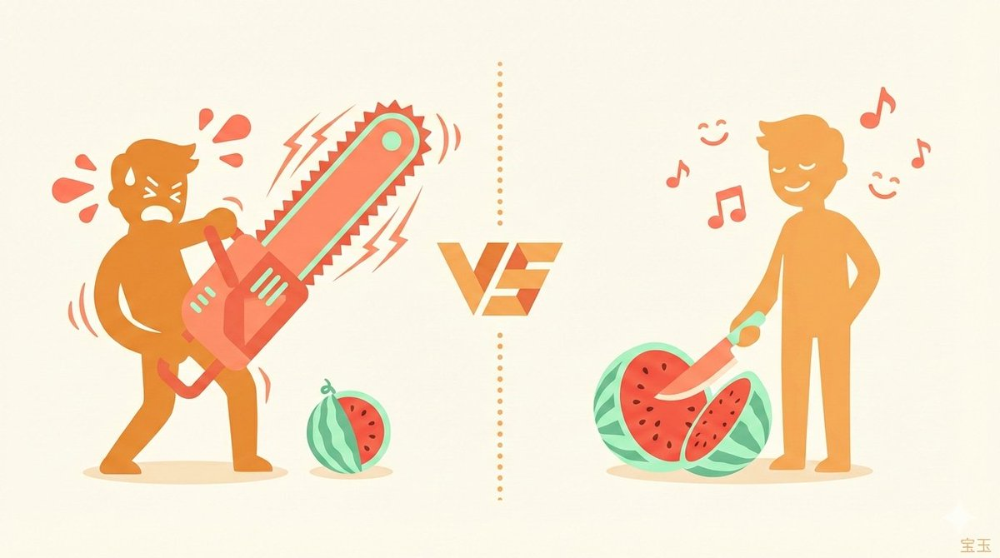
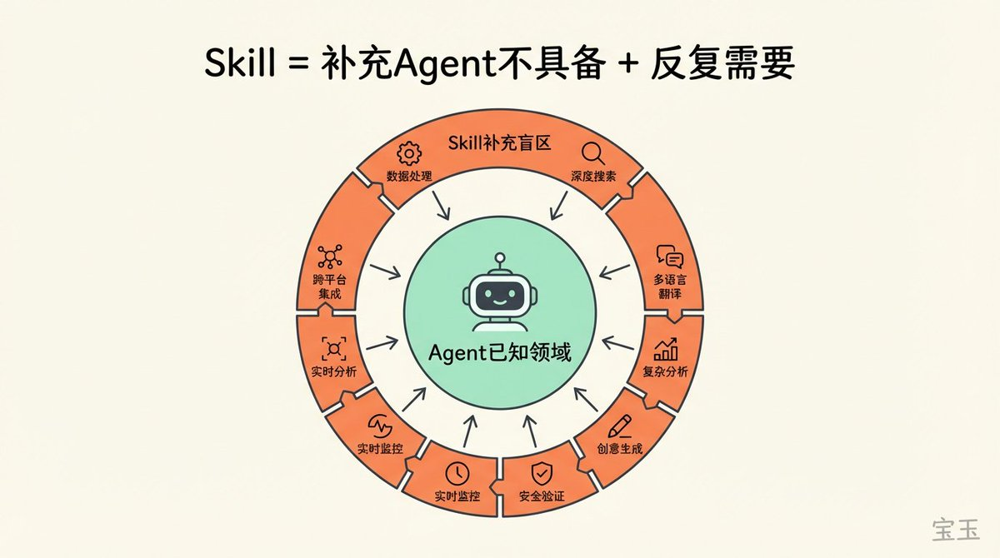
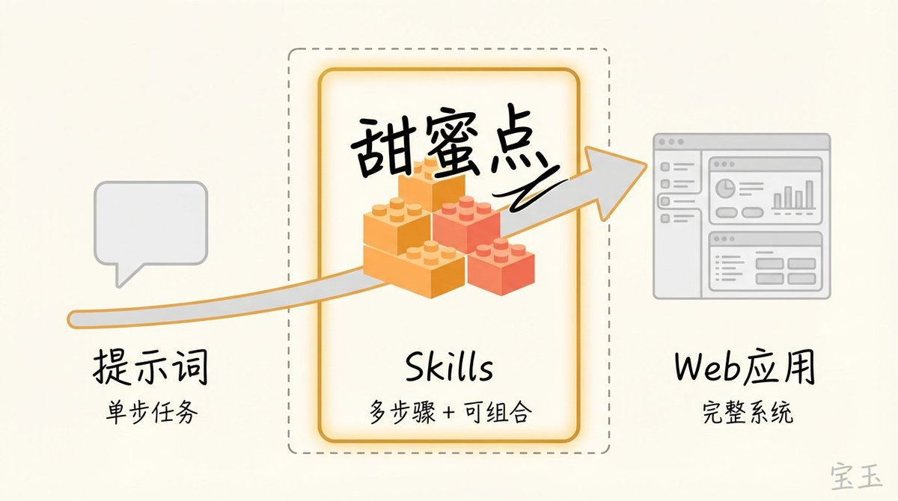
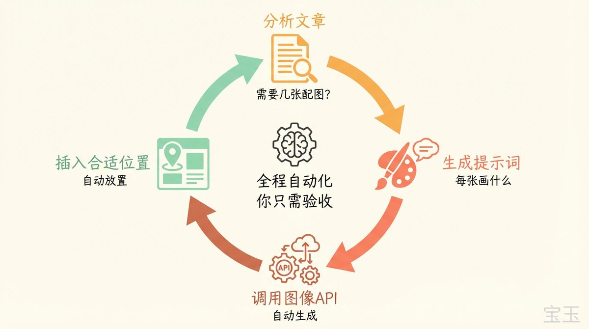
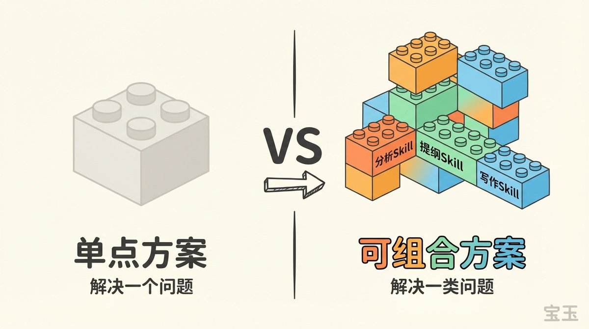
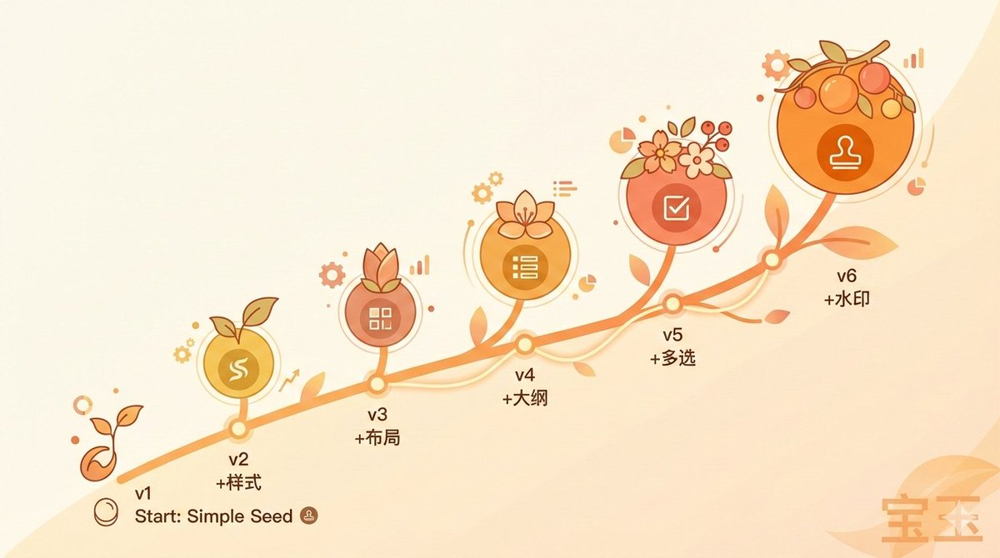
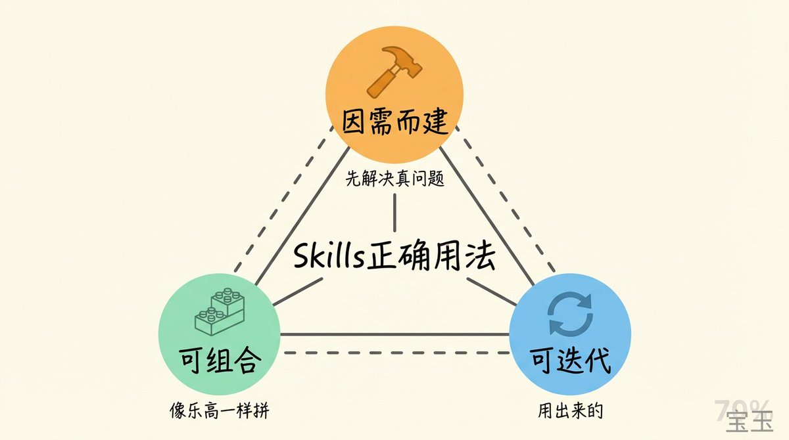
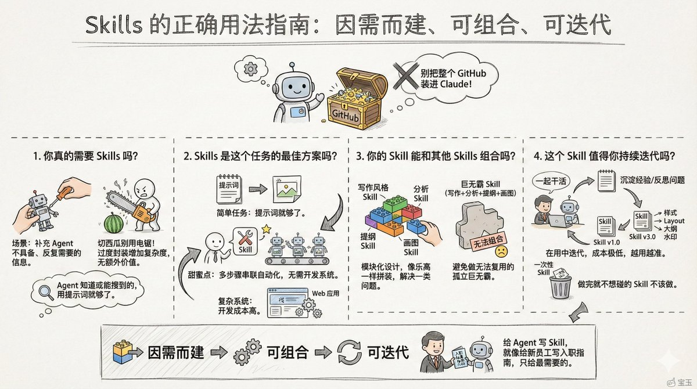
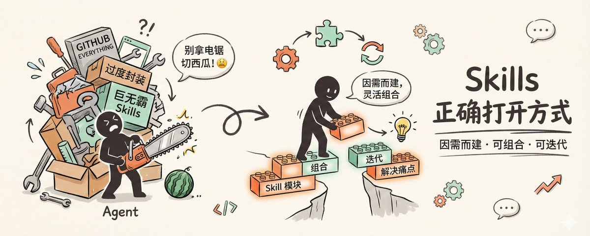

# 📰 别把整个 GitHub 装进 Skills，Skills 的正确用法

这篇《Skills 的最正确用法，是将整个 Github 压缩成你自己的超级技能库》绝对是一篇绝佳的入门指南，但也要注意：这种用法，还当不起“最”正确用法。

[Embedded Tweet: https://x.com/i/status/2013812311388229792]

我不是来抬杠的，而是想聊聊：怎么更好地使用 Skills，而不是有了把锤子就到处找钉子。

## 你真的需要 Skills 吗？

Skills 很酷，就像切西瓜拿电锯，感觉是真的爽😂

但你只是切西瓜的话，西瓜刀更顺手。

Skill 是用来补充 Agent 本身不具备、而你又反复需要的信息。

这意味着，如果 Agent 已经知道怎么做，或者能通过搜索自己搞定，那就没必要做成 Skill。过度封装只会增加复杂度，却不带来额外价值。

比如下载 YouTube 视频这事，真不需要给它一个 GitHub Repo。流行的开源项目，只要不是最近半年的，它都训练过；就算没有，它也会去搜。你每次只需要说“帮我下载这个视频”，然后给链接就行了。

真正需要 Skill 的场景是：你反复踩坑之后，发现某个地方每次都要解释一遍。

就像我在维护 [baoyu-skills](https://github.com/JimLiu/baoyu-skills) 时发现的：每次发布前，我都要教它写 changelog、更新 README、写 commit message、根据变更大小决定版本号。几次之后我就把这个流程封装成了 release-skills。

软件工程强调避免过度设计，Skills 也一样：先解决当下的真问题，别为可能永远用不上的未来需求过度设计。

## Skills 是这个任务的最佳方案吗？

Skill 的优势在于：让 Agent 能自主完成多步骤任务，还不用怎么写代码或者少量脚本就可以。

如果一个任务用提示词就能解决，那提示词就够了；如果必须写个 Web 应用才能跑通，那成本又太高。Skill 的甜蜜点在中间：任务需要多个步骤串联，但又不值得为此开发一套系统。

比如给文章配图。单纯靠提示词做不了，因为提示词只能帮你分析文章、生成画图提示词，但还是要人去一张张生成、一张张插入合适位置。

用配图 Skill 就不一样了。Agent 分析文章需要多少配图，一张张生成提示词，一张张调图像 API，最后还给你插入到合适位置。全程自动化，你只需要验收。

这事写程序也能做，但你得搭 Web 应用，后台接 LLM API 和画图 API，成本比 Skills 高得多。用 Skills 呢？几句话接入一个画图 Skill，事就成了。没有任何代码，写好了还能分享给其他人用。

## 你的 Skill 能和其他 Skills 组合吗？

Skill 的设计初衷是模块化：每个 Skill 做好一件事，然后像乐高一样拼起来。

单点方案和可组合方案的差别，往往不在第一次使用时显现，而在后续复用时拉开差距。一个孤立的 Skill 解决一个问题；一组可组合的 Skills 能解决一类问题。

比如写作风格这事，其实就是提示词，说明你喜欢用什么、不喜欢用什么。完全可以放到 Gemini 里做成一个 Gem，把素材发过去就能润色。但它是单点的，无法组合。

如果我把它变成一个 Skill，后续写视频采访稿可以用这个风格 Skill，发推文也能用。本来单个 Style 作为提示词模板也能用，但有了 Skills，我可以组合起来：

素材 → 分析 Skill → 提纲 Skill → 写作 Skill

写 PPT 时又可以重用分析 Skill 和提纲 Skill。

所以设计 Skill 时要避免做“巨无霸”的冲动。一个 Skill 包揽所有看似省事，实则堵死了组合的可能性。

## 这个 Skill 值得你持续迭代吗？

好的 Skill 不是写出来的，是用出来的。

这和传统写提示词完全不同。提示词是你坐在那里冥想 AI 需要知道什么，然后一次性写完；Skill 是你和 Agent 一起干活，干着干着把经验沉淀下来。

在用 Agent 完成任务的过程中，让它把成功的做法、踩过的坑自己总结成 Skill。跑偏了就让它反思哪里出了问题。用着用着，Skill 就越来越准。

如果一个 Skill 做完之后就再也不想碰了，那大概率这个 Skill 本身就不该做。

就像我发布的小红书 Skill，一个版本一个版本迭代到今天：

- 最开始是小互让我帮忙写一个小红书的提示词

- 然后我发布成了 Skill

- 后来发现样式太单一，添加了不同的样式风格

- 接着发现信息密度太低，添加了 Layout 选项

- 然后发现内容长了质量不够，就增加了分析并提炼大纲

- 有了大纲发现有时候不是我想要的，干脆让它一次性出多个版本让我选

- 今天又加上了水印的支持

最有趣的是，用的过程中发现问题，马上让 Agent 帮你优化，都省了去重现去描述。迭代成本极低，这是 Skill 相比传统代码的独特优势。

## 什么才是最正确用法？

不是把 GitHub 上所有酷炫的 Skill 都装进来。那只会让 Claude 启动时加载一堆用不上的元数据，反而影响判断。

也不是看什么功能就想着封装成 Skill。那是过度设计。

Skills 的正确用法是：先干活，干到某个地方反复卡壳，然后用最小的上下文解决这个卡壳，最后让这个解决方案能和其他 Skill 组合、能持续迭代。

三个词：因需而建、可组合、可迭代。

给 Agent 写 Skill，就像给新员工写入职指南。你不会在第一天就把公司所有文档都塞给他，而是根据他要做的事，给他最需要的那几份。

### 🖼️ Attached Media

## 💬 Replies

### 1 @dotey (宝玉) (Author)

*Sat Jan 24 23:59:44 +0000 2026*

上文一点补充
[x.com/dotey/status/2…](https://x.com/dotey/status/2015212857374413040)

### 2 @bornverse (Born)

*Fri Jan 23 10:10:04 +0000 2026*

@dotey 所以总结一个词，核心价值是：WorkflowSkills。

### 3 @dotey (宝玉) (Author)

*Fri Jan 23 15:22:11 +0000 2026*

@bornverse 也可以不是workflow的

### 4 @kkhdddzzz (kkhddd)

*Fri Jan 30 12:58:10 +0000 2026*

@dotey 老师可以分享一些适用于全局安装使用的skills吗😀

### 5 @dotey (宝玉) (Author)

*Fri Jan 30 15:43:33 +0000 2026*

@mSCZ9DCQDi98452 这个其实要看你自己日常咋用，所有或者大部分项目都用的才需要，比如skill-creator

### 6 @Mindhikers (心行者 Mindhikers)

*Sat Jan 24 02:21:13 +0000 2026*

@dotey 老师 请问如果workflow中涉及账号预先登陆的情况可以做成skill吗 比方tubebuddy搜关键词再捡选之类的场景？感谢🙏

### 7 @dotey (宝玉) (Author)

*Sat Jan 24 02:52:35 +0000 2026*

@freestone1026 对tubebuddy不了解，有两种途径：1. 有专门的MCP或者API，你可以用自己的token；2. 用Chrome CDP 操作浏览器，比如 post-to-x skill

### 8 @SEAMOUNT1976 (YANG)

*Sat Jan 24 07:01:18 +0000 2026*

@dotey 这个生成封面图插图是一个封装好的skill吧？求一个～

### 9 @dotey (宝玉) (Author)

*Sat Jan 24 07:07:34 +0000 2026*

@SEAMOUNT1976 [github.com/jimliu/baoyu-s…](https://github.com/jimliu/baoyu-skills)

$ npx skills add jimliu/baoyu-skills
baoyu-cover-image

记得点个star ：）

### 10 @EHyais451 (昼夜折叠)

*Fri Jan 23 08:35:02 +0000 2026*

@dotey 我现在还处于如何熟练使用别人的skills阶段。宝玉老师的图片生成换成我自己的api用geminipro，为什么上面的字体还是乱码啊

### 11 @dotey (宝玉) (Author)

*Fri Jan 23 08:38:12 +0000 2026*

@EHyais451 这个得您自己调试一下，怀疑不是nano banana pro模型

### 12 @Leslieyu0 (硅予)

*Sun Jan 25 03:37:52 +0000 2026*

宝玉老师分享的这个 skill 真的是戳中了我的痛点了。我用 Gemini 3.0 的 Gem 来辅助 AI 写作。这其中涉及的流程非常多，比如检查文章的逻辑、检查真人感、检查错别字等等。它一个任务里面包含了若干个细小的任务，一个系统提示是没有办法解决的。 这是不是就是 Skill 可以发挥的地方？然后我想问一下大家， Gemini 有没有这样的功能？

### 13 @dotey (宝玉) (Author)

*Sun Jan 25 03:40:14 +0000 2026*

@Leslieyu0 供参考[x.com/dotey/status/2…](https://x.com/dotey/status/2014164622459228324?s=20)

### 14 @JettHuu (meath)

*Sat Jan 24 09:24:48 +0000 2026*

@dotey 所以具体怎么使用呢
弄个小白教程 
分享一个使用的操作案例吗

### 15 @innomad_io (Innomad 一挪迈)

*Sat Jan 24 03:43:13 +0000 2026*

@dotey 宝玉这个说得太对了，AI 已经会的，就不用强行再skill了

### 16 @cnyzgkc (木马人)

*Sat Jan 24 15:38:19 +0000 2026*

我最近印象很深的一个事，是我给一个大哥发了我写的claude code的新手安装教程，他按照步骤装好了

然后他问了我一个问题：然后呢？

我说：什么然后？

他问我：我能用它干嘛？

我一下子不知道说啥，因为感觉claude什么都能做，但是这把锤子，是不是得先找个钉子才能发挥用途？

工具很多，但是明确使用场景和需求更重要

### 17 @drmrzhong (AI设计钟师傅)

*Fri Jan 23 09:35:33 +0000 2026*

@dotey 受教了

### 18 @RookieRicardoR (耳朵)

*Fri Jan 23 08:16:04 +0000 2026*

@dotey 还好宝玉老师写了，我不是大 V，所以只在卡兹克老师评论区说了一下这个问题😂

### 19 @AgiRay1015 (AI磊叔)

*Fri Jan 23 08:52:15 +0000 2026*

@dotey 这两天大家讨论的其实是「怎么用skill」，
也应该研究和思考的是「如何用skill」，
我也在捣鼓「skill 设计范式」，
大约九个字：
小而美，可复用，可组合

### 20 @zjp1997720 (智见AI-大鹏)

*Fri Jan 23 10:03:37 +0000 2026*

@dotey 我之前写了个 skill ，可以按我的风格进行写作，践行 human in loop，但效率还是太低了。受宝玉老师的启发，我加了并行 subagent 写作的逻辑，都是我的文风，但不同的结构与叙事，我只要自己选，或者让主 Agent 自己选，或者自己融合。整体效率质量都更高。这就是迭代的过程，从自己的需求出发

### 21 @lucklyrunner (dev4life)

*Fri Jan 23 09:16:05 +0000 2026*

@dotey 不思考或者外行人喜欢看原文（也许别人也知道，但流量大啊），懂的人就认可宝玉这篇文章的见解。所以大家还是分清什么是营销噱头文章，什么是见解干货文章，否则就贻笑大方，但这个世界是多样化的，各有各的受众。😂

### 22 @MingFire520 (Ming Hao)

*Fri Jan 23 09:01:43 +0000 2026*

@dotey 这样有些太繁重了，感觉已经脱离了最初的设计。有种Skills是个筐，啥都往里装的感觉。

### 23 @BreeStealth (腾风无踪)

*Fri Jan 23 08:54:23 +0000 2026*

@dotey 我在使用过程中的感受是，Skills的根本目的是为了将某一个需要重复处理的任务、动作标准化，并确保结果的\*\*一致性\*\*。
如果不能满足这些要求，Skills化是毫无意义的事情，甚至就像宝玉老师说的，会增加很多无谓的上下文，导致结果不如预期。

### 24 @hello919311 (橙心)

*Fri Jan 23 09:08:06 +0000 2026*

这篇文章分享了Claude Skills创作的最佳实践。

核心观点：好的Skill不是写出来的，而是用出来的；
如果做完就不想用，可能不值得做。  

5条黄金法则：

1\. 少即是多：指令控制在150-200条，只写通用规则。
2\. 保持简短：文档&lt;300行，越短越好。 
3\. 渐进披露：用多个MD文件，按需读取。
4\. 别用Claude当linter：代码风格用传统工具。
5\. 手工打磨：每行仔细设计，避免自动生成。 

 建议从实际需求出发，结合开源项目，逐步优化。

### 25 @aidavid125 (大卫叔的AI旅程)

*Sat Jan 24 01:19:18 +0000 2026*

@dotey 支持这个观点。Skill的用法就像它本身设计一样：按需加载，渐进式披露。按需使用，逐步完善。大道至简。

### 26 @DC_win6 (张DC)

*Fri Jan 23 15:59:28 +0000 2026*

@dotey 我觉得跟记笔记是一个意思。应该是根据自己的灵感，或者说自己总结出来的东西。如果只是抄别人比较精美的笔记，实际上对自己的作用是非常小的

### 27 @huzhouagi (胡诌AGI)

*Fri Jan 23 08:17:59 +0000 2026*

@dotey 学我所需，用我所学

### 28 @RookieRicardoR (耳朵)

*Mon Jan 26 01:40:33 +0000 2026*

@dotey 对本文的一些补充 [x.com/rookiericardor…](https://x.com/rookiericardor/status/2015586735779193247?s=46)

### 29 @yirancrypto (亦然)

*Sat Jan 24 02:05:00 +0000 2026*

@dotey 有钉子造锤子，而不是有锤子，找钉子。

最好的需求永远是自己的需求。

### 30 @stoneskin_gmail (Stoneskin)

*Fri Jan 23 14:15:28 +0000 2026*

@dotey 'Skill 是用来补充 Agent 本身不具备、而你又反复需要的信息。'
 这句话是精髓。。。

### 31 @GavinQuan (权工-Gavin)

*Fri Jan 23 07:54:12 +0000 2026*

@dotey 学习了

### 32 @010Zaj (听澜)

*Fri Jan 23 16:36:26 +0000 2026*

@dotey 没错，真正能够减少重复性SOP工作、而非为有而有

### 33 @oneruofeng (ruofeng)

*Fri Jan 23 12:08:42 +0000 2026*

@dotey 大道至简，佩服宝玉老师的对 skills 独到的深度思考🤔

