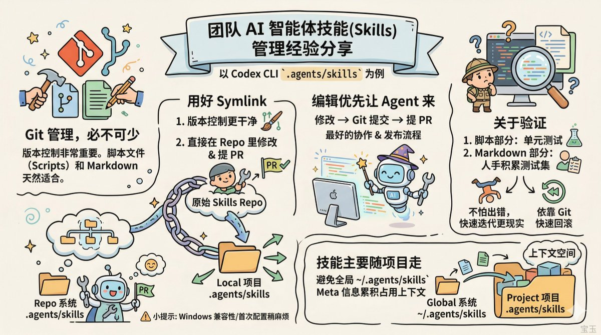
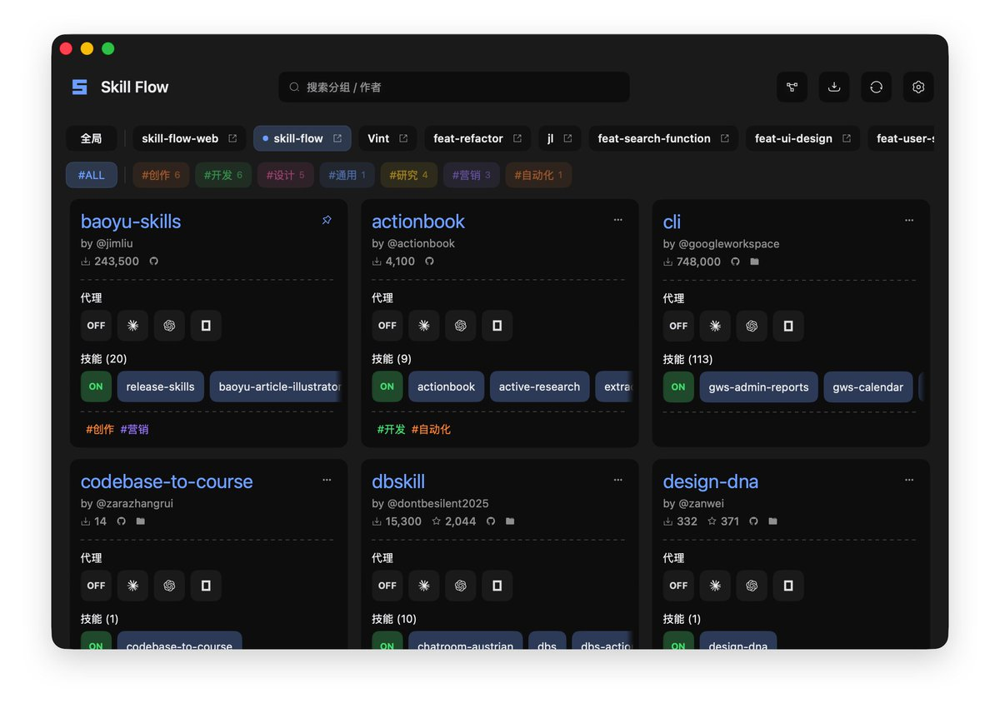
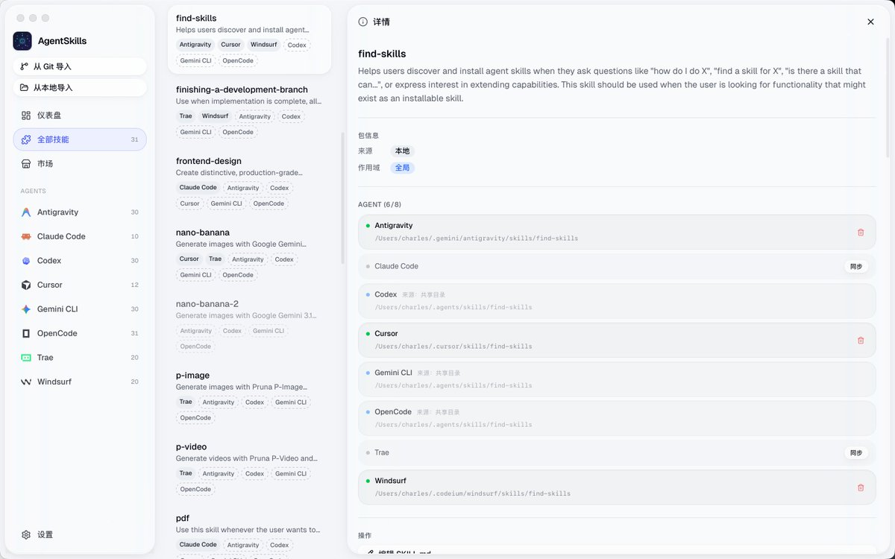

团队内的 skills 管理和维护的一点经验分享（以 codex cli 用的 .agents/skills 目录为例）：

1\. Git 管理是一定要的。
版本控制太重要了，而且 Skills 都是 Markdown 和脚本文件，天然适合 Git。

2\. 用好 Symlink。
不要把 Skills 整个拷贝到 .agents/skills，而是通过 Symlink 直接链接到原始 Skills 的 Repo。

好处有两个：一是版本控制更干净；二是使用中遇到问题，Agent 定位后可以直接在 Repo 里改，改完就能 Review 提 PR。

我日常维护 baoyu-skills 就是这么干的，用的时候发现问题，让 Agent 在当前会话改，改的就是 Repo 本身，流程非常顺。

主要的坑是 Windows 下好像不支持 Symlink，另外首次配置稍麻烦（可以让 Agent 帮你操作）。

3\. Skills 的编辑优先让 Agent 来。
改完走 Git 提 PR，这就是最好的协作和发布流程。

4\. 验证确实不太好做。
脚本部分可以写单元测试，Skill 的 Markdown 部分只能靠平时积累的测试集，大部分还得人工。
但配合 Git 的版本管理，快速迭代反而更现实：不怕改出问题，出了问题根据 commit history 快速定位，或者直接回滚。

5\. 最后提醒一下：大部分 Skills 应该跟着项目走（放项目目录下的 .agents/skills），不要放全局（\~/.agents/skills）。
即使是渐进式加载，meta 信息累积起来也会占不小的上下文空间。

### 🖼️ Attached Media

## 💬 Replies

### 1 @dotey (宝玉) (Author)

*Thu Apr 02 18:09:23 +0000 2026*

参考第2条，通过symlink指向唯一源头
[x.com/Tomyu\_2034/sta…](https://x.com/Tomyu_2034/status/2039766683091365999?s=20)

### 2 @dotey (宝玉) (Author)

*Thu Apr 02 18:50:28 +0000 2026*

FYI
[x.com/tangmian/statu…](https://x.com/tangmian/status/2039774970373701864?s=20)

### 3 @CodeIdealist (理想主义者)

*Fri Apr 03 05:37:02 +0000 2026*

@dotey 我们用的superpower，skill-creator这种呢，也建议安装到项目中吗

### 4 @dotey (宝玉) (Author)

*Fri Apr 03 05:39:17 +0000 2026*

具体要看场景，原则是经常用的随时随地用的放全局，否则跟项目走。但也不是绝对的，最好根据实际情况调整。

比如说，skill-creator 应该放全局，因为你随时随地都需要借助它创建/优化技能

superpower 如果你只是开发的时候用，那么放在具体的开放项目就够了，如果你所有项目都用，频繁用，那不如放全局

### 5 @wh1isper_ (Wh1isper)

*Fri Apr 03 11:48:27 +0000 2026*

@dotey 宝玉老师怎么管理apikey的

### 6 @dotey (宝玉) (Author)

*Fri Apr 03 15:25:22 +0000 2026*

@jizhongsheng957 跟着项目走，放项目环境变量

### 7 @a946665026 (mouri11)

*Fri Apr 03 12:57:19 +0000 2026*

@dotey 宝玉老师这个配图怎么生成的？有skill参考吗

### 8 @dotey (宝玉) (Author)

*Fri Apr 03 15:21:05 +0000 2026*

@a946665026 看置顶帖3楼

### 9 @tangmian (咸话咸说)

*Thu Apr 02 18:40:24 +0000 2026*

狗尾续貂下我的几个点：

\- 之前也是使用symblink来解决同步问题的，不过后来还是vide了一个专用的脚本来解决包括重命名等在内的事情。因为symblink也有它的问题，就像前文所述；

\- 我自己的source code还是按照原来的claude code plugin的结构来组织的，因为代码当时开始就存在了。但随着agent skill的开放标准化，需要适配的coding agent越来越多，但改源码结构显然不是最优解。这里面包含一些细节，比如claude code里面的agent skill命名是\`&lt;plugin-name&gt;:&lt;skill-name&gt;\`的形式，对于其他平台需要自动转化为\`&lt;plugin-name&gt;-&lt;skill-name&gt;\`格式; 这也是需要专用转换脚本的原因之一。

\- 之前走过一些弯路，利用rulesync之类的现成工具，但最终发现不方便使用，所以还是换成了自己搞的小轮子。合用就行。

\- 有一个小细节是最近的新发现，就是有些coding agent既支持自定义的skill加载目录，比如codex会从\`\~/.codex/skills\`、openclaw会从\`\~/.openclaw/skills\`加载，但他们同时也支持从\`\~/.agents/skills/\`里面加载。如果同时在\`\~/.agents/skills/\`以及他们自己的加载目录都放一份agent skill的话，coding agent默认会加载两遍，造成巨大的token浪费，所以需要避免。我目前的做法是claude code和antigravity走自己的目录，其他的平台(包括codex, gemini-cli, opencode, openclaw, pi)统一走\`\~/.agents/skills/\`。

### 10 @jokester_yxm (jokester)

*Fri Apr 03 03:21:48 +0000 2026*

@dotey 给宝玉老师安利一下我们最近开发的skill版本管理工具skill-git。跟 git 类似，commit 打快照，改坏了可以 revert，还能用scan扫描出哪些 skill 其实在干差不多的事，然后可以使用merge功能把几个skills合并在一起。目前还在持续开发迭代！欢迎试用、提意见～
[github.com/KnowledgeXLab/…](https://github.com/KnowledgeXLab/skill-git)

### 11 @VintonLin (Vint)

*Thu Apr 02 18:04:05 +0000 2026*

@dotey 可以考虑试试 Skill Flow 支持给检测到的项目挂载 Symlink 的 Skill。

[github.com/VintLin/skill-…](https://github.com/VintLin/skill-flow) 

### 12 @xxxjzuo (Jason Zuo)

*Thu Apr 02 18:06:56 +0000 2026*

@dotey 我一开始觉得 Symlink 会越用越乱，但到后来 agent 越来越多，发现是自己对 Symlink 误解太深
最开始就没强制显式依赖声明，对引用层数也没有概念
这些都不是 Symlink 的问题😂 
用 obsidian 管理能比较清晰的明确 agent graph + resolution flow

### 13 @Zephyr0715 (Zephyr)

*Thu Apr 02 22:20:34 +0000 2026*

@dotey 补一个：skill 写多了之后最头疼的是互相冲突。我现在每个 skill 开头都写明触发条件和边界，不然 agent 会在两个 skill 之间反复横跳。

### 14 @OMOisomo (O MO)

*Thu Apr 02 23:50:39 +0000 2026*

@dotey 我就是因为没有git，
导致了我的一个skill没了 😭

### 15 @QCL15 (Cario Lee)

*Thu Apr 02 23:05:02 +0000 2026*

@dotey I've gone the symlink route too — one thing I'd add is version-pinning when skills include scripts. A bad update once silently broke an automation I'd completely forgotten about.

### 16 @wuzhige4pixel (武止戈👽🦀相比于《1984》, 我宁可《2012》)

*Fri Apr 03 09:52:50 +0000 2026*

@dotey 说起symlink，推荐这个，mv &amp;&amp; ln 一步到位，支持dry run

[x.com/wuzhige4pixel/…](https://x.com/wuzhige4pixel/status/2012433715373490580?s=46)

### 17 @danielmiss33 (dnl 𝕏)

*Fri Apr 03 04:26:27 +0000 2026*

@dotey 我也是。不过没有做软连接。比较暴力。😂

### 18 @Zhongxing_Sun (Zhongxing Sun)

*Thu Apr 02 19:07:09 +0000 2026*

@dotey 这些tip都可以产品化啊

### 19 @OiiDev (OSDev)

*Thu Apr 02 20:42:15 +0000 2026*

@dotey rst @readwise save thread

### 20 @zhishiai6 (安逸爸爸学AI)

*Fri Apr 03 03:40:54 +0000 2026*

@dotey 作为小白啊，我其实 git 管理都不懂，用 GitHub 这个平台呢，在哪里下载那些文件都是最近才学会的

### 21 @upulseapp (Upulse)

*Fri Apr 03 09:29:19 +0000 2026*

@dotey Symlink 这个用法确实巧妙。我们也是把 skills 放独立 repo 管理，Agent 改完直接提 PR，版本控制干净多了。之前拷贝到项目里，改起来总担心同步不及时。

### 22 @koffuxu (koffuxu)

*Fri Apr 03 00:42:57 +0000 2026*

@dotey @TingFengAIAI 我现在就是用第一点和第二点来管理我的skill。用git的话，能够迭代版本，这是非常重要，因为调好一个skill要花很多时间和talk口。另外，用软链接的方式，宝玉老师说的是可以区分项目。我这边的话，因为是有两台电脑可以实现共享和备份

### 23 @truechatdata (Chat Data)

*Fri Apr 03 05:22:23 +0000 2026*

@dotey Git is the obvious baseline, but teams usually need a second layer on top of it for skills: ownership, review history, test cases, and a quick way to see which version actually performed better in production. Otherwise the markdown stays organized while the skill quality drifts.

### 24 @sunyoung2021 (SunFine)

*Fri Apr 03 08:56:51 +0000 2026*

@dotey @kafeeshow 分享下我是使用技巧，windows 电脑可以使用junction来链接对应的Skills。另外我还建了多个.claude-profiles来启动多个Claude 窗口，避免同时写入的时候文件损坏了

### 25 @bigthing123456 (Ne0@Digital)

*Thu Apr 02 22:37:45 +0000 2026*

@dotey Symlink 这个思路很实用，改完即生效，省掉了同步的心智负担。第5点也同意，skills 放项目级别而非全局，context window 寸土寸金。

### 26 @lgqyhm (谦仔)

*Thu Apr 02 23:16:56 +0000 2026*

@dotey 我们现在也是这么干，适配各种工具，只能用 symlink，不过我这边有个不一样，业务太多，人多，只有公共的 skills 才跟版本管理，其他做成内部仓库，自己业务自己拉…兼容公共与个人业务需求

### 27 @chr1sio (Carpe Dai)

*Fri Apr 03 10:00:25 +0000 2026*

@dotey 我写了一个 Skills 跨平台管理工具，支持 \`\~/.agents/skills/\`  的平台会统一走这个目录，不支持的会使用 symblink 解决同步问题，支持从 Git 和本地导入来手动管理，Windows 下 symlink 需要开发者模式权限，我这里处理的时候失败则 fallback 到 copy。[github.com/chrlsio/agent-…](http://github.com/chrlsio/agent-skills) 

### 28 @DrCyberloafing (hadoop master)

*Thu Apr 02 23:51:06 +0000 2026*

@dotey 我们的思路是做一个专门供团队下载skills 或者plugin的repo当成marketplace。这也是Anthropic官方推荐的distribution mechanism

### 29 @iml1s (ImL1s)

*Thu Apr 02 22:19:44 +0000 2026*

@dotey Symlink 的方案非常實用，避免了多處維護的問題。Git 管理 Skills 這個思路也對——Markdown 天然就是可 diff 的，PR review 的流程正好可以拿來做 Skills 的品質把關，兩全其美。

### 30 @xxww0098 (MR. XIE)

*Fri Apr 03 17:46:59 +0000 2026*

@dotey [github.com/xxww0098/Skill…](https://github.com/xxww0098/SkillStar) 试一试我的项目，我还没测试过windows就是了

### 31 @liutianyi1225 (whisper)

*Fri Apr 03 02:18:53 +0000 2026*

@dotey 得亏codex和claude code认可了同一套skill 标准

### 32 @BBBNiuniu (HotpotAgentAI)

*Tue Apr 28 21:26:32 +0000 2026*

@dotey windows下有symlink，比如nvm这样的工具，就是利用symlink在切换不同的nodejs的版本。

### 33 @noBody0295 (noBody)

*Fri Apr 03 15:45:36 +0000 2026*

@dotey 宝总，最近在思考一个问题，端到端开发项目的时候，业务背景这些怎么办，开发个知识库吗

### 34 @qazwsx_risk (明小)

*Fri Apr 03 06:28:25 +0000 2026*

@dotey 请问这个图用什么做的呢？效果不错啊

