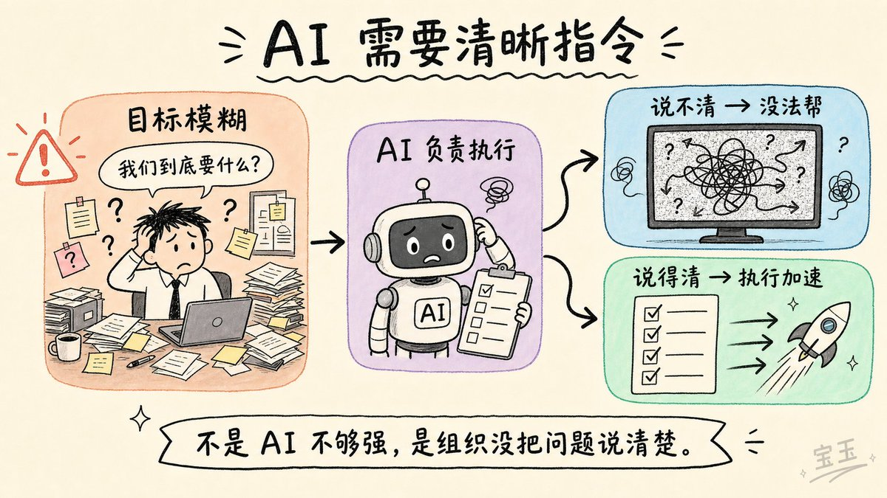
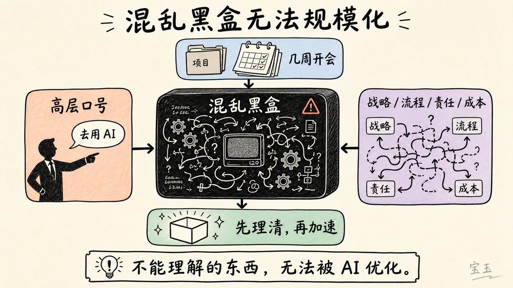
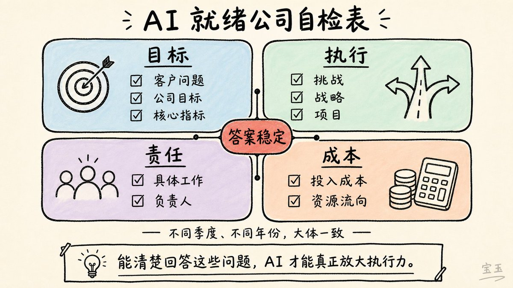
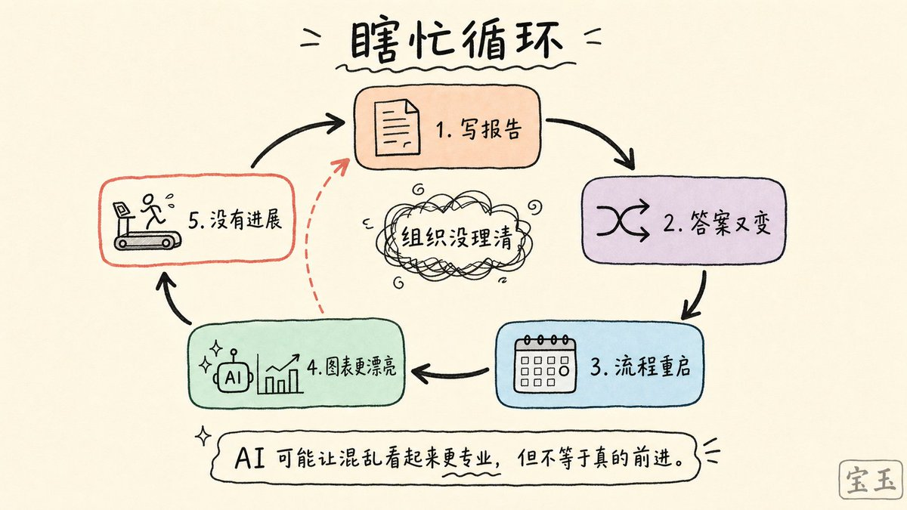
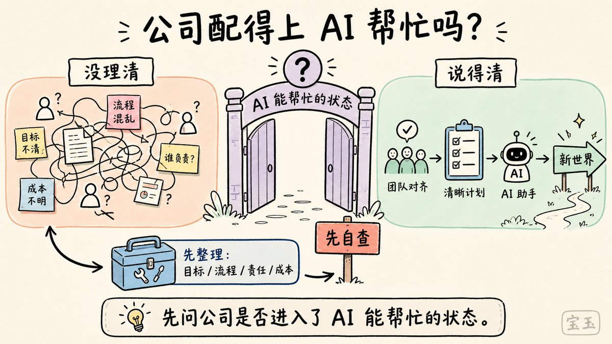

# 📰 大多数公司根本没有为 AI 做好准备

作者：Daniel Miessler
原文：[Most Companies Aren't Anywhere Near Ready for AI](https://danielmiessler.com/blog/most-companies-arent-ready-for-ai)

[Embedded Tweet: https://x.com/i/status/2050666594188304484]

并不是公司不想用 AI，而是他们根本用不了。

## AI 不是问题，说不清目标才是问题

很多人抱怨 AI 总是无法满足他们的需求，感到十分受挫。但说句实话，真正的问题在于：他们自己都说不清楚到底想要什么。

我曾为全球顶尖的巨头企业、数百家初创团队，以及无数全球 1000 强里的中大型公司做过咨询。我发现，排名第一的致命问题就是：公司的愿景和目标极其模糊，而且朝令夕改。

AI 的核心优势在于“执行”。如果它不知道到底要执行什么，它就毫无用武之地。相反，那些非常清楚自己想要什么的公司，正在借助 AI 混得风生水起。而且，随着 AI 变得越来越聪明，这些公司将爆发出更恐怖的统治力。

但遗憾的是，这类公司只是凤毛麟角。因为只有极少数的公司具备足够的自我认知和组织纪律，能够给 AI 下达正确的指令。

你无法去优化一个连你自己都没搞懂的东西。

如果一件事你本来就不该做，再去盲目扩大它的规模，那简直愚蠢透顶。

大家都在谈论“公司还没有为 AI 做好准备”，但我认为，大家根本没意识到这个问题到底有多严重。这根本不是什么技术成熟度的问题，它的根源要深刻得多。

## 混乱黑盒无法规模化

很大一部分公司，其实是“糊里糊涂”就成功了的。他们自己都不太清楚到底想实现什么目标，或者具体是怎么做到的。他们只是恰好掌握了几个碰巧管用的“绝招”，而且执行得还凑合，所以才能活到现在。

但是，如果你走进这些公司，对他们说：“好了，请给我描述一下你们到底想干什么？你们的战略是什么？面临哪些挑战？具体的工作流 (work streams) 是怎样的？”——他们要么会一脸茫然地看着你，要么会觉得你在开玩笑。他们得花上好几周的时间专门立个项，才能搞清楚这些问题的答案。然后还得再花上好几个月的时间去真正落实这个项目。(这里的工作流是指公司内部从任务发起、协作到最终交付的具体运转环节，很多传统公司对此缺乏清晰的梳理和记录)

说实话，我确信绝大多数公司正处于极度危险之中。因为它们本质上就是一个个勉强维持运转的“混乱黑盒”。

在这种公司里，如果董事会或高层领导直接向所有人下令“全面拥抱 AI”，那就好比盯着一台满屏雪花、满是杂音的老电视机，大喊：“我们要把这玩意儿做大做强！”

> 没问题，老板。麻烦您帮个忙，指一下到底想让我优化哪块业务？

（漫长的沉默……）

> 问得好。我们马上多开几个会，好好琢磨琢磨这个问题。

在这类公司里，AI 几乎毫无用武之地。而不幸的是，这意味着许多（甚至可以说是大多数）公司都是如此。

## 真正被 AI 帮到的公司

现在外界有一种论调，认为 AI 还没有帮助到足够多的公司，所以大家都在问：问题出在哪儿了？AI 什么时候才能变得足够聪明？或许，AI 压根没有大家吹的那么神。

但极其讽刺又显而易见的事实是：那些能够被 AI 真正赋能的公司，奇迹般地，恰恰是那些本来就知道自己在干什么的公司。

他们能够迅速且清晰地告诉你：

- 他们正在为客户解决什么问题

- 市面上的现有方案有什么缺陷，而他们的方案又是如何弥补的

- 公司长远的发展目标是什么

- 衡量这些目标的具体核心指标 (metrics) 是什么

- 阻碍他们达成目标的挑战在哪里

- 他们正在采取哪些战略来克服这些挑战

- 为了落地这些战略，正在推进哪些具体项目

- 这些项目里具体包含哪些工作任务

- 每一项任务由谁负责

- 投入的成本到底有多少

最关键的是，这些真正“拎得清”的公司，无论是在不同的季度还是不同的年份，对这些问题的回答都能保持高度的一致性。

## 混乱公司的典型信号

相反，一个公司陷入混乱的明显标志是：各个部门总是在花费大量的时间，声称自己有明确的答案——但这答案每个季度都在大变样，因为所有事情都在不停地变动。结果就是，员工们只是把那些能让自己表面上看起来干得不错的东西写在报告里。他们花了好几周时间精心准备，几个星期后又全盘推翻，再次从头开始走这套折磨人的流程。

对于这种公司，AI 基本上帮不上任何忙。不仅如此，AI 甚至可能会把局面搞得更糟——因为它会让员工们的“瞎忙活”看起来更加高大上。比如，用 AI 自动生成更多花里胡哨的幻灯片、更复杂的图表、还有一大堆没用的花架子。(就像给一台出故障的发动机外壳镀上一层金，看着很华丽，但解决不了任何动力问题，反而掩盖了真正的隐患)

你可能会问：“既然他们这么烂，怎么还没倒闭呢？”答案很简单：因为他们的大多数竞争对手也一样烂。

## 企业真正该问的问题

那么，说了这么多，重点到底是什么？

核心有以下几点：

1. 在企业界，AI 的应用其实才刚刚起步。因为只有一小撮公司具备足够的自我认知，能够清晰地梳理并描述自身业务，从而真正为拥抱 AI 做好准备。

1. 我们应该停止把问题怪罪于 AI，或者怪罪于技术本身。真正的问题在于，企业无法用清晰、易懂的方式描述自己——这包括他们的目标、工作流 (workflows)、日常运营、决策机制、团队架构以及资金流向。

1. 做不到这一点的公司，面对那些能做到的公司时，将处于极其危险的境地。

1. 那些体型庞大、运转笨重的大企业面临的主要威胁在于：现在，一家小公司完全有可能借助 AI 爆发出堪比大企业的战斗力。而且，小企业往往更容易清晰地回答出上面提到的那些关键问题。

正因如此，所有现存的公司都即将面临一场前所未有的“降维打击”。只有那些理清乱麻、内部通透的公司才能在风暴中存活下来，并迎风而起。

在这场变革的最初阶段，决定谁输谁赢的因素里，AI 占的比重其实极小。AI 更像是那些最终胜出者在“新世界”里互相搏杀的武器。而现在的游戏规则是：先看清楚谁有资格拿到进入新世界的门票。

作为一个企业，你现在最该问自己的第一个问题，不是“AI 能为我做什么”，而是“我的公司现在的状态，配得上让 AI 来帮忙吗？”如果答案是否定的，那你必须不遗余力，尽快让公司达到那个状态。

### 🖼️ Attached Media

## 💬 Replies

### 1 @yuyy614893671 (金融汪)

*Mon May 04 02:59:02 +0000 2026*

@dotey 据我的观察就是如此，结构化的数据，标准化的流程，应对日常事务与应急事务的不同处理方式......绝大部分公司都没准备好

### 2 @Michaelzsguo (Michael Guo)

*Sun May 03 23:01:47 +0000 2026*

这些其实根本不是 AI 问题，都是早就该解决的组织问题：目标说不清，owner 不明确，流程没有沉淀，指标不统一，决策权模糊，项目价值讲不明白。AI 只是把这些混乱放大了，并没有能力替你修好它们。

最近很火的Stripe 是一个很好的反例， 他们连续发布了几款AI产品： 给Agent用的Link Wallet；服务云基础设施的一键通Stripe Projects

Stripe 不是因为加了几个 AI 功能才突然变成 AI-ready。它本来就有很强的组织文化、产品抽象和工程基础：清晰的 API，developer-first 的工作流，对 identity、payment、trust、authorization、auditability 这些基础设施问题有长期积累。所以当 agent 时代到来，Stripe 能很自然地把自己的能力延伸到一个新的用户：AI agent。

### 3 @xingxp112 (香贝)

*Mon May 04 02:43:32 +0000 2026*

@dotey 我认为需要一个中间人，一个懂业务和懂AI的中间人来翻译业务和AI给双方，企业AI再以小场景切入，有看得见，摸得着的价值，促使老板更大投入，而不是一个想变革的心。

### 4 @BlockInsight214 (王小庄)

*Sun May 03 22:31:49 +0000 2026*

@dotey 深有体会。给企业做AI落地，最常见的不是"选哪个模型"，而是"我们到底要解决什么问题"都答不上来。工具从来不是瓶颈，流程混乱才是。AI只是把原来藏着的管理债全暴露了。

### 5 @chaojidigua (蓝色胖头鱼 | BlueChubbyFish)

*Mon May 04 00:32:39 +0000 2026*

@dotey 目前的 AI , 只能锦上添花, 不能雪中送炭.

再过几年, 等 AI 理解现实世界, 就可以雪中送炭了.

顺便给 99.99% 的公司送葬. 🤣

### 6 @xxxjzuo (Jason Zuo)

*Sun May 03 23:51:22 +0000 2026*

@dotey 其实对于个人用户来讲也是一个道理。大多都是跟风追逐热点，从排队装🦞就可见一斑。除了少数本来的开发者和产品出身的人，其他大部分都人甚至没有想明白为什么要用，要做什么。

### 7 @baibaida (狐狸布布)

*Mon May 04 01:37:48 +0000 2026*

@dotey 看完默默看了眼自己司…我们还在讨论要不要给 PM 配 AI 工具呢😭

### 8 @lala_oldtang (Mr Richard@AI+Crypto)

*Mon May 04 01:45:13 +0000 2026*

@dotey 大多数公司目前并不真正需要AI。AI只是工具，工作流，很多传统公司他们的核心是生产流，物流，资金流，信息流，如果互联网和线下已经解决的问题，就不一定需要AI。AI并不是万能的。

### 9 @Jennifer_yoyoyo (苏倩)

*Wed May 06 12:49:01 +0000 2026*

@dotey 很有启发，所以我写了一篇自己的思考，宝玉老师提提意见呗
[x.com/jennifer\_yoyoy…](https://x.com/jennifer_yoyoyo/status/2051314076677177489?s=46&t=Sr2ANTNni2fzHJBqwsyDvg)

### 10 @banbudev (Halfstep 半步)

*Sun May 03 22:45:34 +0000 2026*

@dotey 无论企业还是个人，知道要什么，能描述清楚要什么，能衡量最后得结果是不是自己要的，这个能力将越来越重要。

### 11 @yyneo01 (zh)

*Mon May 04 00:50:58 +0000 2026*

@dotey 这个道理同样也适用于个人，在当下，知道该做什么比知道该怎么做更重要。

### 12 @768150007 (匠心極選)

*Mon May 04 00:03:43 +0000 2026*

@dotey @Jackywine 国内来说，不论央企还是地方国企都不会使用 AI 智能体的 这个已经内部通报了🤫

### 13 @zourz88 (日上三竿)

*Sun May 03 23:10:00 +0000 2026*

@dotey 确实，接触很多公司是老板看到了AI潮流，就要求下面的人拥抱AI，下面的人被动式往AI上靠，大部分都是为了AI而AI

### 14 @xu_feng1 (Xu Feng)

*Sun May 03 22:10:04 +0000 2026*

@dotey 无论企业个人，AI发挥正杠杆率的前提在于元认知框架，判断力，以及是否能给出有效的反馈.

### 15 @Guluhehe (李简AI)

*Sun May 03 23:31:52 +0000 2026*

@dotey 最主要是牌桌上的既有部门和流程 都不想让步  甚至还要再把控一遍

### 16 @snowboat84 (snowboat)

*Mon May 04 00:58:11 +0000 2026*

AI提效将首先体现在小型公司甚至是一人公司，因为这些公司有明确的目标和分工，锐意进取，处于蒸蒸日上的上升期。对于大部分处于平稳期的中型和大型公司，各种混乱和内耗使得AI提效几乎变得不可能。

用历史来比喻，用AI提效犹如明治维新采纳西洋方式进行变法。而这样的变法在混乱的大清和亚洲其它各国都是不可能实现的。

然而AI转型和提效，终究会爆发甲午战争这样蛇吞象的故事，小公司会彻底干翻大公司。

### 17 @banbudev (Halfstep 半步)

*Sun May 03 22:48:09 +0000 2026*

@dotey taste-intent-eval

### 18 @EighthDFilms (Eighth.D)

*Mon May 04 03:58:16 +0000 2026*

@dotey AI时代，小而清晰的团队，可能比大而混乱的巨头更有优势。这里有个前提就是“客观环境”。

### 19 @RssFreedom (Freedom Rss)

*Mon May 04 14:38:13 +0000 2026*

@dotey 你这是用 AI 写的吧

### 20 @rollotomasi0203 (RolloTomasi)

*Mon May 04 08:39:50 +0000 2026*

@dotey HEY AI. GIVE THESE BUNCH OF  LOSERS A CLEAR GOAL

### 21 @MaoXianGouAI (冒险狗AI)

*Sun May 03 22:15:30 +0000 2026*

@dotey AI介入话语权掌握在小公司和普通业务员手里

### 22 @leyu37829 (乐鱼Joyfish)

*Mon May 04 06:09:00 +0000 2026*

@dotey 因为AI来的太快？不是，是因为AI迭代太快！你去年学的今年过期了！你没学到就不用学了……因为又更新了！[x.com/leyu37829/stat…](https://x.com/leyu37829/status/2042484124343288263?s=20)

### 23 @aias_0 (Coffee fans)

*Sun May 03 22:05:23 +0000 2026*

@dotey Always appreciate a share like this. It’s a nice little reminder to just slow down for a bit.

### 24 @hall120591 (Watch Cloud 2015)

*Mon May 04 03:07:47 +0000 2026*

@dotey @clip2vault

### 25 @Caius_Dean (AI嗅探 × 每日流量密码)

*Mon May 04 09:17:16 +0000 2026*

@dotey 深有体会啊，ai只能干固定的事情，还得人来训练，部署，而一个刚毕业的大学生就是最好的llm，你让他干嘛就干嘛，学习能力也强，也就3000块钱，又不麻烦，真到ai转型的时候，再让这个大学生去学习，也能坐上车，ai对小公司来说真没啥用

### 26 @ogx5125 (ogx)

*Mon May 04 00:54:46 +0000 2026*

@dotey AI 还只是工具层面，非技术问题更难解决

### 27 @xiaomingcz (小明厂长)

*Mon May 04 02:34:27 +0000 2026*

@dotey 也有很多公司出生就AI原生，可惜我的厂子不是

### 28 @antifomo0407 (Antifomo)

*Mon May 04 07:48:24 +0000 2026*

@dotey 因为ai这个物种本来从根本上就在冲击人类原有的组织形式，公司这种组织形式从长期来看应该是跟ai不兼容的

### 29 @dehewujiang (thomas lee)

*Sun May 03 23:30:36 +0000 2026*

@dotey 只要了解企业那些当官的有几个人知道markdown就明白了

### 30 @AgentCreatives (赵辉)

*Mon May 04 05:51:51 +0000 2026*

@dotey 对于人来说一样的，认清自己的目标和发展规划，构建自己清晰的系统

