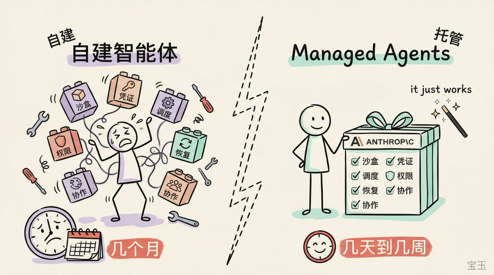
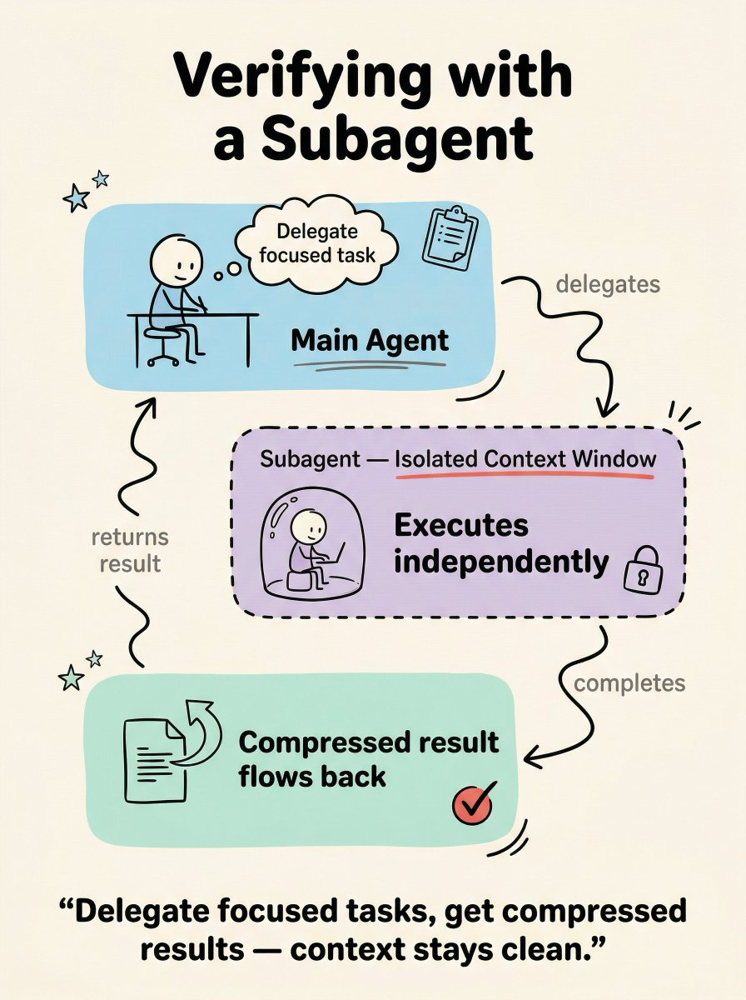
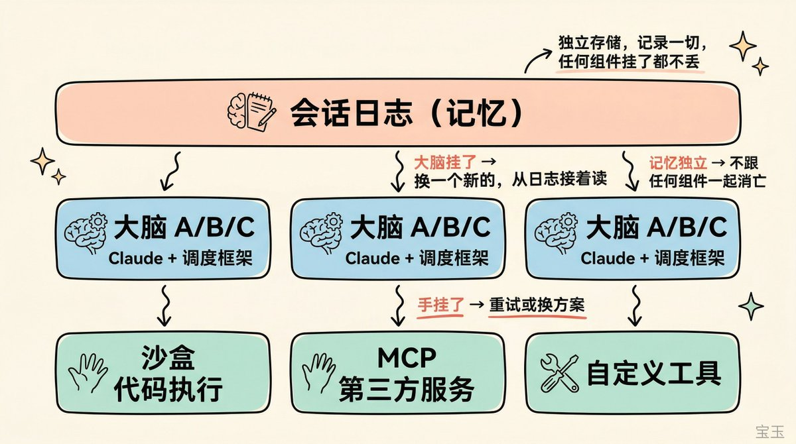
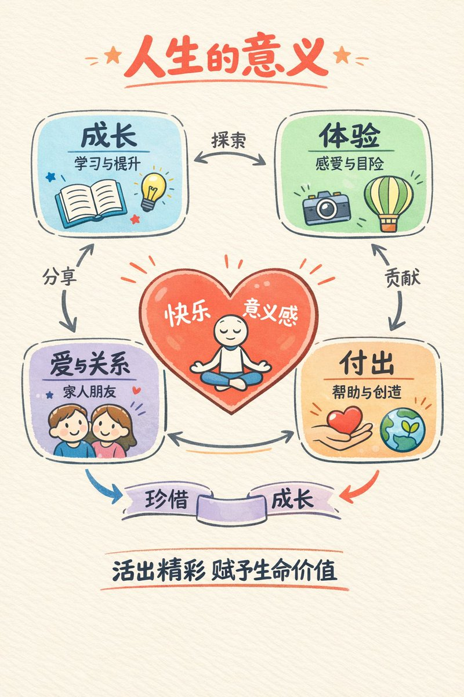

手绘风信息图提示词

选项 1
使用 baoyu-skills 的 baoyu-article-illustrator 或者 baoyu-cover-image skill，告诉它用 hand-drawn-edu 风格
[github.com/JimLiu/baoyu-s…](https://github.com/JimLiu/baoyu-skills)

选项2:

提示词模板：

---- 提示词开始 ----

你是一位擅长手绘风信息图的视觉设计师。请根据以下内容创作一张单页信息图。

\## 风格要求

整体风格：Hand-drawn educational infographic on warm cream paper texture (#F5F0E8)。所有线条和形状带轻微手绘抖动感（slight hand-drawn wobble），整体干净清晰，像高质量演示文稿的单页视觉摘要。无写实元素。

配色方案：

\- 信息区色块：马卡龙色系圆角卡片——浅蓝 #A8D8EA、薄荷绿 #B5E5CF、薰衣草紫 #D5C6E0、浅桃 #F4C7AB，根据内容分区选用

\- 强调色：珊瑚红 #E8655A，用于关键词、重要数据、勾选标记等需要视觉突出的元素

\- 线条与主文字：黑色

\- 辅助标注：暖灰 #6B6B6B，字号较小

图形优先：用图标、简笔画卡通形象、示意图承载信息，文字仅用于标注和点睛，能用图说清的绝不用文字。像好的 slides 一样——一眼看懂结构，细看理解细节。

信息结构：根据内容自动选择最佳视觉布局（流程→箭头串联，对比→左右分栏，循环→环形，组成→并列卡片，层级→嵌套等）。用圆角色块、气泡、虚线框等容器分区，区域间用手绘波浪箭头（hand-drawn wavy arrows）连接并标注简短关系词。

文字层次：标题顶部居中，粗体大号手绘字（bold, large, hand-drawn lettering）；区域内用粗体关键词 + 暖灰小字短标签（2-5 词）区分层次。

渲染细节：马卡龙色块不完全填满轮廓（colors do not completely fill outlines），涂鸦装饰点缀（小星星、下划线、小箭头等），充足留白，干净构图。

底部金句：图片底部一句粗体居中总结，概括核心观点。

\## 要图解的内容

\[在这里填入主题和核心信息点\]

画下面的内容：
\---

### 🖼️ Attached Media

## 💬 Replies

### 1 @dotey (宝玉) (Author)

*Fri Apr 17 15:01:16 +0000 2026*

GPT Image 2 效果也不错👍[x.com/meet\_yk/status…](https://x.com/meet_yk/status/2045082256939925998?s=20)H

### 2 @zhedao88 (黑泽)

*Thu Apr 09 02:21:55 +0000 2026*

@dotey 前几天，傅盛公司的人来我们公司讲他的小龙虾 PPT 是怎么做的。那时候给我们看他的 Skill，我还以为他们是公开的呢，结果只有这个没有公开。但是对他的那个手写的画风印象特别深刻，想要研究一下。这下宝玉老师出了这个 Skill，终于可以研究了。

### 3 @dotey (宝玉) (Author)

*Thu Apr 09 03:36:42 +0000 2026*

@zhedao88 用 baoyu-skills
[x.com/dotey/status/2…](https://x.com/dotey/status/2042083196506935482)

### 4 @buhuaguo1 (不滑锅)

*Thu Apr 09 00:27:19 +0000 2026*

@dotey 感觉到 x 上又会充满这个风格的图画，毕竟宝玉老师一出手，就知道这事儿要成了

### 5 @dotey (宝玉) (Author)

*Thu Apr 09 00:31:14 +0000 2026*

@buhuaguo1 😂 不是我本意

### 6 @starsea1234567 (星海之心)

*Thu Apr 09 03:53:13 +0000 2026*

@dotey 宝玉老师，请问用龙虾调用这个skills的时候是不是需要谷歌和chatgpt的api才行哇

### 7 @dotey (宝玉) (Author)

*Thu Apr 09 03:54:13 +0000 2026*

@starsea1234567 其他的画图也行

### 8 @winterslove2020 (青云AI)

*Fri Apr 10 06:15:41 +0000 2026*

@dotey 谢谢宝玉！请问，这个配色是怎么搞出来的？这个毕竟需要审美呀！

### 9 @dotey (宝玉) (Author)

*Fri Apr 10 06:25:13 +0000 2026*

@winterslove2020 马卡龙配色

### 10 @linarich0015 (橙小禾)

*Thu Apr 09 08:43:39 +0000 2026*

@dotey 宝玉老师，我遇到会把色值当文案渲染在图上
你有遇到过吗

### 11 @dotey (宝玉) (Author)

*Thu Apr 09 15:55:47 +0000 2026*

@linarich0015 有遇到过的，这种情况下得重新生成

### 12 @crypto_fyy (加密魔导师)

*Wed Apr 08 23:33:55 +0000 2026*

@dotey 想问下：希望图里保留可编辑层（svg）还是只要最终位图？输出分辨率偏网页还是印刷？

### 13 @dotey (宝玉) (Author)

*Wed Apr 08 23:35:25 +0000 2026*

@crypto\_fyy nano banana 不支持 svg/图层

### 14 @BetterSelf_Life (Better Self, Better Life)

*Wed Apr 08 23:58:04 +0000 2026*

@dotey 请问给英文文章配图用你的中文提示词也适用吗？

### 15 @dotey (宝玉) (Author)

*Thu Apr 09 00:03:03 +0000 2026*

@BetterSelf\_Life 可以的，说明下文字用英文

### 16 @binghe (冰河)

*Thu Apr 09 05:12:13 +0000 2026*

@dotey 好看，优雅。。

真不错。。先收藏。慢慢欣赏 。

### 17 @wwwgoubuli (wwwgoubuli)

*Fri Apr 10 12:37:03 +0000 2026*

@dotey 希望大家抄思路，不要抄风格，不然很快互联网上全是同一个风格的图，看的想吐

### 18 @zenvertao (Zenver Tao)

*Thu Apr 09 03:44:42 +0000 2026*

@dotey 赞！好用～ 

### 19 @ljhspurs (JimmyJacy)

*Wed Apr 08 23:59:50 +0000 2026*

@dotey 宝玉skills厉害，图很漂亮👍😎

### 20 @parrotboy888 (Ryan)

*Thu Apr 09 00:03:39 +0000 2026*

@dotey 感觉这种手绘风比较有人味 

### 21 @VinceZcrikl (文森.Z)

*Thu Apr 09 00:11:24 +0000 2026*

@dotey 宝玉老师这个好，时间线上千篇一律的AI风格，已经让人审美疲劳了，创作者正需要不同的style 来保持新鲜度👍

### 22 @yesongh (i若木)

*Sat Apr 11 17:21:54 +0000 2026*

@dotey 被漫画版skill惊艳了，可以把平时和ai聊的枯燥内容，一键生动起来
[x.com/yesongh/status…](https://x.com/yesongh/status/2043015395083456542?s=20)

### 23 @bitesized_3mzz (一口一个三明治🥪)

*Thu Apr 09 03:20:08 +0000 2026*

@dotey 大佬又发力了😋

### 24 @Stanley83784547 (Stanley)

*Thu Apr 09 02:50:19 +0000 2026*

@dotey 其实。。。  我想说    这个辨识度不高    感觉有点乱糟糟的样子

### 25 @crayon1267 (蜡笔进化论)

*Thu Apr 09 14:55:55 +0000 2026*

@dotey 这个提示词好适合文章配图，谢谢宝玉老师。

### 26 @leyu37829 (乐鱼Joyfish)

*Fri Apr 10 16:34:39 +0000 2026*

@dotey 这么高级了吗？我已经看不懂了，只会用AI写写推文
[x.com/leyu37829/stat…](https://x.com/leyu37829/status/2042484124343288263?s=20)

### 27 @xinglongking (黑皮衣)

*Fri Apr 10 11:39:16 +0000 2026*

@dotey 宝玉老师这些skills 太适合搞内容创作了

### 28 @ChrisWangwy (老爸的AI联萌)

*Thu Apr 09 15:13:43 +0000 2026*

@dotey 看起来真不错呀

### 29 @Neal7249 (Neal)

*Thu Apr 09 03:54:48 +0000 2026*

@dotey 一直在使用你的skill创作，很赞

### 30 @BetterSelf_Life (Better Self, Better Life)

*Wed Apr 08 23:57:09 +0000 2026*

@dotey 多谢宝玉老师！图画得很好看！

### 31 @hongming731 (ginobefun)

*Thu Apr 09 01:19:18 +0000 2026*

@dotey 好看 👍🏻 
这就去试用一下

### 32 @kendeng_me (Kendeng | AI Visuals)

*Sat Apr 11 05:54:05 +0000 2026*

@dotey 这个系列的skills非常棒，内容超多，而且配色很好，就是莫兰迪的感觉👍

### 33 @lliu54827 (HSIAO YUAN)

*Thu Apr 09 10:32:45 +0000 2026*

@dotey 測試了幾個，hand-drawn 風格確實是目前 AI 簡報最有辨識度的。我用 Grok Imagine 和 Flow 給 X 貼文配圖，發現風格一致性比畫質重要——讀者滑過去的時候認的是風格不是內容。

### 34 @qmz20000 (武鸣好汉)

*Thu Apr 09 01:38:26 +0000 2026*

@dotey 宝玉老师，我的智能体嫖你

### 35 @yibaiyeye (一点六一八)

*Tue Apr 21 01:41:10 +0000 2026*

@dotey baoyu-url-to-markdown 安装后可识别，但运行时依赖的 baoyu-fetch@0.1.2 报错引用了开发者本地绝对路径 /Users/jimliu/GitHub/baoyu-skills/...，怀疑是发布包打包缺陷。请问这是已知问题吗？有没有修复版本或临时方案？

