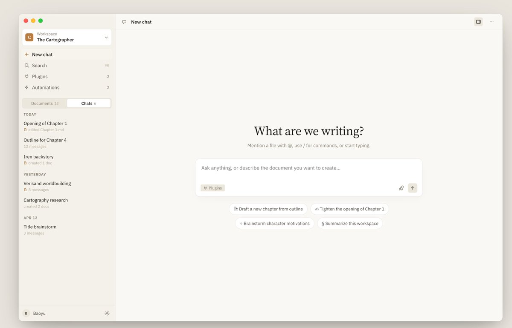
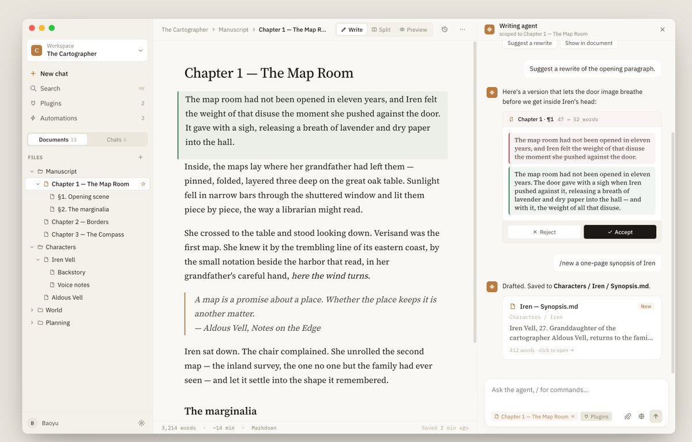
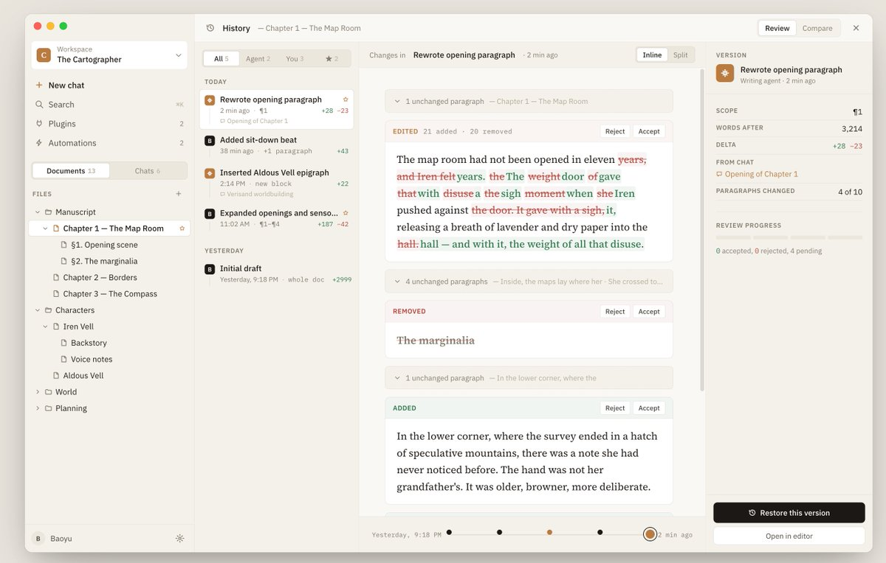
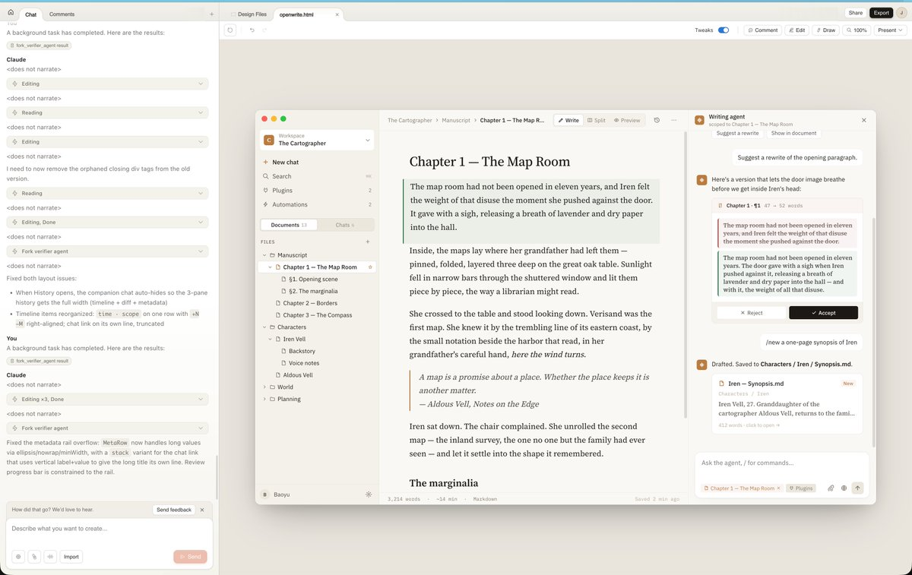
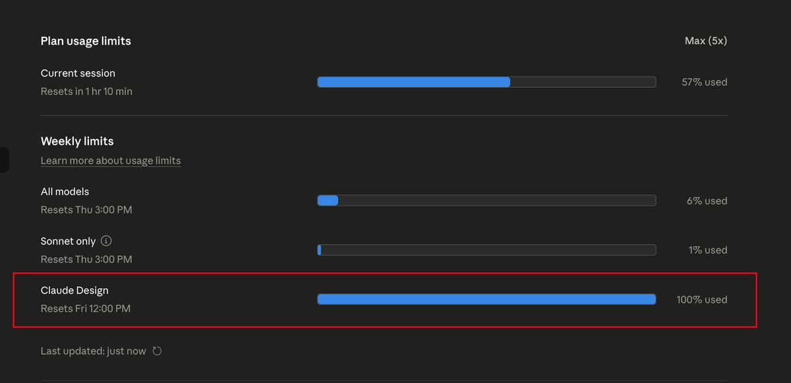
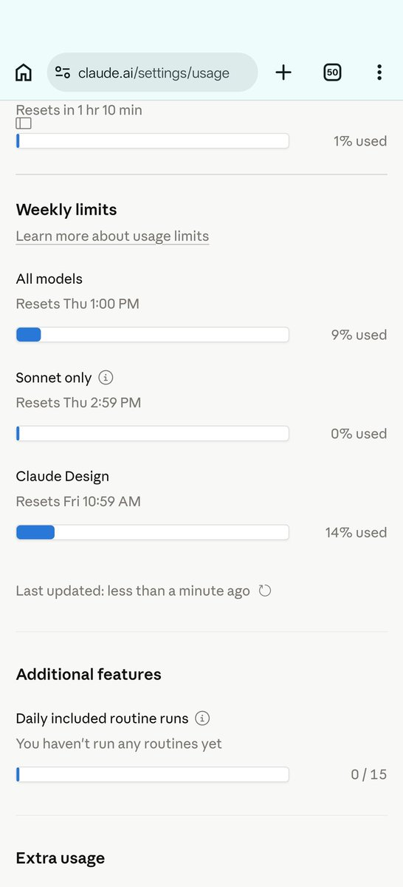

经过试用，Claude Design 将会是跟 Claude Code 一样重要的产品，千万别低估它的潜力。

个人和小团队用它可以让产品设计和交互水平高出一大截，Opus 4.7 它真的懂设计，设计外包和设计工具要大幅缩水了。

如果有条件，一定要去试试！附件是我简单交互后设计的一个结果，交付的是可以交互的高保真原型

### 🖼️ Attached Media

## 💬 Replies

### 1 @dotey (宝玉) (Author)

*Fri Apr 17 19:50:19 +0000 2026*

它是独立的额度，用不了几次一周的额度就没了💔2

### 2 @frxiaobei (凡人小北)

*Sat Apr 18 04:04:04 +0000 2026*

@dotey @atian25 找了套 vi 丢进去尝试，除了贵其他缺点可以忽略了

### 3 @AriXZone (魔都老猿)

*Fri Apr 17 21:30:19 +0000 2026*

@dotey 宝玉老师，这个是单独订阅还是和code包里的？

### 4 @dotey (宝玉) (Author)

*Fri Apr 17 21:30:42 +0000 2026*

@AriXZone 包一起的

### 5 @leewaytor (Leeway)

*Fri Apr 17 22:42:30 +0000 2026*

@dotey 同感 今天写长文分析的时候也是这个判断 真正的差异化是 onboarding 读你的 codebase + design files 自动建设计系统 Figma 这块是手动维护且跟代码脱钩的 这一条工程量 Figma 要追 12 个月以上

### 6 @dotey (宝玉) (Author)

*Fri Apr 17 23:14:46 +0000 2026*

@leewaytor 设计系统这个我都还没来得及体验

### 7 @leeoxi (Leo)

*Fri Apr 17 19:50:23 +0000 2026*

@dotey 试了一下，确实不错，就是design token耗得太快了。Max 20一次性干掉一周的15%。那Pro和Max5，感觉没法用。 

### 8 @dotey (宝玉) (Author)

*Fri Apr 17 19:54:18 +0000 2026*

@leeoxi 我5x已经没额度了

### 9 @hx831126 (虎小象)

*Fri Apr 17 22:41:09 +0000 2026*

@dotey 之前它不是也能吗？这个单独发，是为了一个新的额度消耗吗🤣

### 10 @dotey (宝玉) (Author)

*Fri Apr 17 23:13:41 +0000 2026*

@hx831126 之前哪个？这不是新产品？

### 11 @crypto_fyy (加密魔导师)

*Fri Apr 17 19:32:46 +0000 2026*

@dotey 你是怎么喂需求的？一句话 PRD + 竞品截图，还是直接丢 Figma/流程图？它对“业务约束/边界条件”会追问吗

### 12 @dotey (宝玉) (Author)

*Fri Apr 17 19:51:31 +0000 2026*

@crypto\_fyy 就文字描述就好了，会跟你确认，也可以让它自己发挥

### 13 @RookieRicardoR (耳朵)

*Sun Apr 19 05:52:27 +0000 2026*

@dotey 宝玉老师 交付的这个原型可以转成 figma 分享一下吗？  我也感受一下这个原型的精细程度

### 14 @dotey (宝玉) (Author)

*Sun Apr 19 05:56:59 +0000 2026*

@RookieRicardoR 是html的，没法直接分享，只能分享给团队

### 15 @RookieRicardoR (耳朵)

*Sun Apr 19 05:50:25 +0000 2026*

@dotey 宝玉老师是完整复刻设计了一个 Claude 客户端？

### 16 @dotey (宝玉) (Author)

*Sun Apr 19 05:56:21 +0000 2026*

@RookieRicardoR 不是的，是个写作的agent

### 17 @waterlemongg (duaduadua)

*Fri Apr 17 21:21:49 +0000 2026*

@dotey 宝玉老师，现在用claude做交互式教育内容，输出的前端页面很丑，有什么好的方法吗

### 18 @dotey (宝玉) (Author)

*Fri Apr 17 21:26:18 +0000 2026*

@waterlemongg 用 Claude Design

### 19 @Sivalacittasudo (Sivalacitta)

*Sun Apr 19 02:41:20 +0000 2026*

@dotey 老师 这跟用各种design skill差距大吗？

### 20 @dotey (宝玉) (Author)

*Sun Apr 19 02:48:35 +0000 2026*

@Sivalacittasudo 很大，试试才知道

### 21 @motohayai (東京小卡｜Kirin🍥)

*Fri Apr 17 20:31:50 +0000 2026*

@dotey Claude Design 很值得一试、未来可期 👍
就像 2025 年初发布的 Claude Code 一样，
谁能想到不到一年半，已经彻底革命了「编程」

### 22 @mylifcc (lifcc)

*Sat Apr 18 01:35:54 +0000 2026*

@dotey 这是做了一个claudecode吗，看了半天没找到客户端入口

### 23 @fishdiff (一拳卡比)

*Sat Apr 18 00:03:20 +0000 2026*

@dotey 昨晚我看到新闻也第一时间去尝试做了公司产品样册。确实好用，点了几下就把 24 小时的额度用完了😓

### 24 @Zvvven (胡了个茬)

*Sat Apr 18 02:28:14 +0000 2026*

@dotey 客户端里哪里有设计模式为什么看不见，需要更新嘛

### 25 @Immerse_code (Immerse)

*Sat Apr 18 02:40:29 +0000 2026*

@dotey 效果很棒，额度消耗也是真的快

### 26 @Microstrongs (microstrong)

*Sat Apr 18 01:22:37 +0000 2026*

@dotey 不敢低估模型厂家出来的每一个产品

### 27 @LeonLRedfield (台灣李家宝🇲🇳)

*Sat Apr 18 16:03:21 +0000 2026*

@dotey @SunnyDarkClouds

### 28 @voltwake (小威Volt⚡️)

*Fri Apr 17 20:31:43 +0000 2026*

@dotey 试用了，真的太牛逼了😭

### 29 @VinceZcrikl (文森.Z)

*Fri Apr 17 19:39:27 +0000 2026*

@dotey Claude可以说产品非常走心了，抛开政治不谈，有很多可以学习的地方

### 30 @robertmaurerfan (Jackie)

*Sun Apr 19 08:28:04 +0000 2026*

@dotey 好谢谢 你的推荐一般很好

### 31 @dashuai38953711 (大帅)

*Fri Apr 17 20:13:00 +0000 2026*

@dotey Claude Design 真能干，设计外包和低级工具要被冲击了，小团队生产高保真原型的门槛被降到很低。

