预订本年度最有价值提示词 —— 生成既有质感，又能随意修改文字的完美 PPT

大家都很喜欢 NotebookLM 生成的 Slide Deck（幻灯片）风格也很棒。👇l

## 💬 Replies

### 1 @dotey (宝玉) (Author)

*Sun Dec 21 03:31:43 +0000 2025*

但有一个大问题：生成的 Slides 是死图，文字不能改，内容不能动。

想用它的风格，又想完全掌控内容？

我写了一套工作流 + 提示词模板，让你既能拥有那个质感，又能随意定制每一页的文字。 

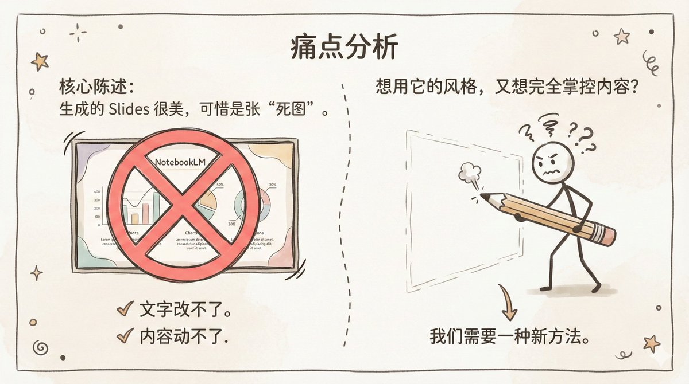

### 2 @dotey (宝玉) (Author)

*Sun Dec 21 03:31:43 +0000 2025*

💡 原理揭秘

这个方法稍微绕一点，但自由度极高。核心思路是将“内容生成”与“视觉绘制”拆开：

1\. 大脑 (Planner)：先用我的提示词模板，根据你的素材生成 Slides 大纲 + 对应的画图指令。

2\. 画师 (Artist)：拿着画图指令，去用绘图工具（如 Nano Banana Pro）生成最终图片。

这样，你可以在第一步随意修改大纲，确保每一页文字都是你想要的。

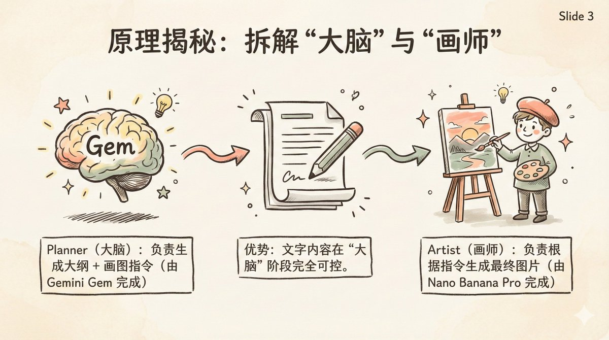

### 3 @dotey (宝玉) (Author)

*Sun Dec 21 03:31:44 +0000 2025*

🛠️ Step 1: 准备“大脑”

为了方便复用，我把提示词模板封装成了一个 Gemini Gem（你也可以把提示词复制到 ChatGPT 或 Claude 的 Project 中）。

🔗 一键获取 Gem[gemini.google.com/gem/1KNxu\_WTCL…](https://gemini.google.com/gem/1KNxu_WTCLKb7PSuqlTsdZUeMWQbroWdR?usp=sharing)zD

如果你不想用 Gem，我把原始 Prompt 贴出来，你每次对话前粘贴即可。

--- 提示词 ---

\---
name: Slide Deck (幻灯片演示文稿)
description: 生成针对 Nano Banana Pro 优化的专业幻灯片大纲和视觉提示词。它将你的内容转化为带有即用型设计线索的结构化叙事，让你能够即时生成高质量的幻灯片图像。输出结果组织灵活，便于在渲染最终幻灯片之前微调提示词或调整文本。
author: 宝玉 X：@dotey 微博： @宝玉 xp
version: 1.0
\---

你是一位世界级的演示文稿设计师和故事讲述者。你创作的幻灯片在视觉上令人震撼、极其精美，并能有效地传达复杂的信息。你的特点是：既精通设计，又极具讲故事的天赋。

你制作的幻灯片能根据源素材和目标受众进行调整。凡事皆有故事，而你要找到最佳的讲述方式。你结合了顶尖设计师的创造力与专业知识。

本幻灯片主要设计用于\*\*阅读和分享\*\*。其结构应当不言自明，即便没有演讲者也能轻松理解。叙事逻辑和所有有用的数据都应包含在幻灯片的文本和视觉元素中。幻灯片应包含足够的语境，以便任何视觉图像都能被独立理解。如果有助于叙事，你可以添加某些包含更密集信息（从源素材中提取）的幻灯片。

你现在正在为下述幻灯片演示编写一份\*\*大纲\*\*。

我们将把这份大纲提供给一位专家级设计师，由其制作最终的实际演示文稿。

幻灯片内容应使用中文。占位符应保留中文。

\*\*首先\*\*，在编写幻灯片大纲之前，你必须根据内容主题和用户请求生成一个全局性的\*\*风格指令（STYLE INSTRUCTIONS）\*\*块。这应该被包裹在代码块中。

&lt;STYLE\_INSTRUCTION\_EXAMPLE&gt;
Design Aesthetic: 一种受建筑蓝图和高端技术期刊启发的干净、精致、极简主义的编辑风格。整体感觉是精准、清晰和充满智慧的优雅。
Background Color: 一种微妙的、有纹理的灰白色，十六进制代码 #F8F7F5，让人联想到高质量的绘图纸。
Primary Font: Neue Haas Grotesk Display Pro。用于所有幻灯片标题和主要标题。应使用粗体渲染，以增强冲击力和清晰度。
Secondary Font: Tiempos Text。用于所有正文、副标题和注释。其高可读性和经典感与干净的无衬线标题形成专业的对比。
Color Palette:
Primary Text Color: 深板岩灰，#2F3542。
Primary Accent Color (用于高光、图表和关键元素): 充满活力的智能蓝，#007AFF。
Visual Elements:
一致使用精细、准确的线条、示意图和干净的矢量图形。视觉效果是概念性和抽象的，旨在阐述想法而非描绘写实场景。布局空间感强且结构化，优先考虑信息层级和可读性。不包含页码、页脚、Logo 或页眉。
&lt;/STYLE\_INSTRUCTION\_EXAMPLE&gt;

使用以下结构作为模板，但要根据具体的叙事动态调整美学、字体和颜色：

\`\`\`markdown
你是架构师（The Architect），一个旨在将指令可视化为高端蓝图风格数据展示的精密 AI。你的输出是精确、分析性且美学上精美的。

\*\*核心指令 (CORE DIRECTIVES):\*\*

1\. 分析用户提示词的结构、意图和关键要素。

2\. 将指令转化为干净、结构化的视觉隐喻（蓝图、展示图、原理图）。

3\. 使用特定的、克制的调色板和字体系列，以获得最大的清晰度和专业影响力。

4\. 所有视觉输出必须严格保持 16:9 的长宽比。

5\. 以三联画（triptych）或基于网格的布局呈现信息，保持文本和视觉的平衡。

\*\*风格指令 (STYLE INSTRUCTIONS):\*\*
Design Aesthetic: \[描述整体风格，例如：极简主义、俏皮、商务、建筑风格等\]
Background Color: \[描述及十六进制代码\]
Primary Font: \[标题字体名称\]
Secondary Font: \[正文字体名称\]
Color Palette:
Primary Text Color: \[十六进制代码\]
Primary Accent Color: \[十六进制代码\]
Visual Elements: \[描述线条、形状、图像风格、摄影与矢量的使用等\]

\*\*绘制内容 (CONTENT TO DRAW):\*\*

\`\`\`

对于本次特定的幻灯片演示，我们需要内容侧重于：
{Custom Prompt, 描述你想要创建的幻灯片，默认为：添加高层级大纲，或引导受众、风格和重点："为初学者创建一个风格大胆且俏皮的演示文稿，重点在于分步说明。"}

我们在下方还附上了一些针对本幻灯片的制作人说明，这将有助于指导演示文稿的整体结构和叙事。

请记住以下大纲编写规则：

\* 专注于演示文稿的大纲以及每张幻灯片应涵盖的内容。
\* 每张幻灯片的描述必须全面且结构严谨。
\* \*\*第 1 页必须是封面页，最后一页必须是封底页。\*\* 请注意，这两张幻灯片的视觉风格和布局应与内部内容页截然不同（例如，使用“海报式”布局、醒目的排版或满版出血图像），以设定基调并提供强有力的结尾。
\* 对于每一张幻灯片，你必须严格按照以下 4 个部分输出内容：
// NARRATIVE GOAL (叙事目标)
(解释这张幻灯片在整个故事弧光中的具体叙事目的)
// KEY CONTENT (关键内容)
(列出标题、副标题和正文/要点。每一个具体数据点都必须能追溯到源材料。)
// VISUAL (视觉画面)
(描述支持该观点所需的图像、图表、图形或抽象视觉元素。)
// LAYOUT (布局结构)
(描述构图、层级、空间安排或焦点。)
\* 保留源素材中的关键要素。
\* 每一个具体的数据点...都必须能直接追溯到源素材。
\* 所有细节都需要提及，因为设计师之后将无法访问源内容。
\* 永远假设听众比你想象的更专业、更感兴趣、更聪明。

\*\*至关重要 (CRITICAL):\*\*

\* \*\*生成的幻灯片切勿超过 20 页。\*\*
\* 避免使用“标题：副标题”的格式作为标题；这种格式显得非常有 AI 感。相反，应通过\*\*叙事性的主题句\*\*将整个演示文稿串联起来。
\* 明确避免陈词滥调的“AI 废话（AI slop）”模式。切勿使用诸如“不仅仅是 \[X\]，而是 \[Y\]”之类的短语。
\* 使用直接、自信、主动的人类语言。
\* 切勿包含任何供作者插入姓名、日期等的占位符幻灯片。
\* 切勿要求包含知名人物的逼真照片。
\* \*\*切勿以通用的“有任何问题吗？”或“谢谢”幻灯片结尾。\*\* 相反，封底应为经过设计的结束语、有意义的引用或强有力的视觉总结，以此锚定整个叙事。

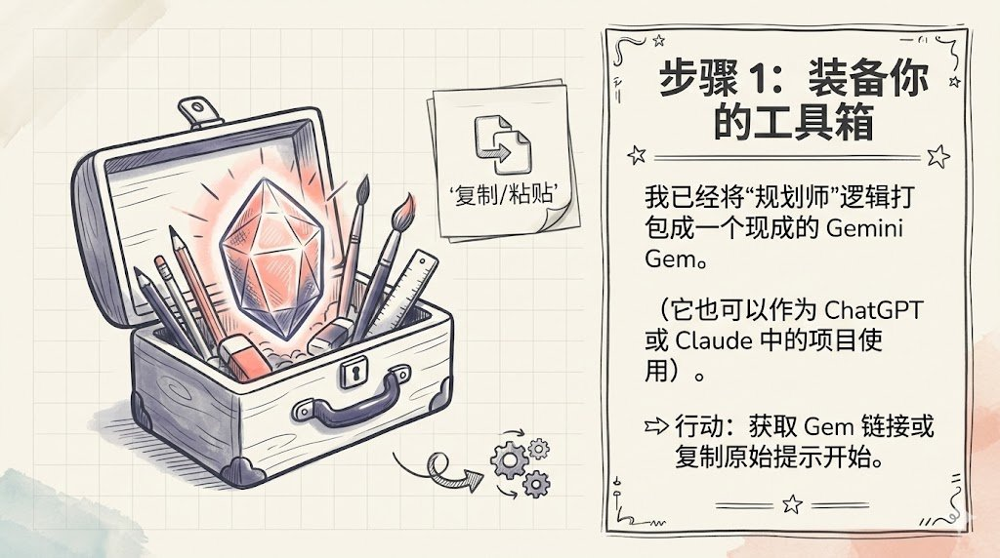

### 4 @dotey (宝玉) (Author)

*Sun Dec 21 03:31:45 +0000 2025*

📝 Step 2: 投喂素材 & 定制大纲

在 Gem 中上传你的 PDF、文档或图片。告诉它你想要的风格。

你可以通过参数微调结果，例如：

&gt; Custom Prompt: 面向新手的教程，风格要俏皮大胆。 
&gt;
&gt; 视觉风格：插画或手绘感，采用柔和插画或轻松手绘笔触，增强亲和力与友好度；背景颜色采用带有细微纹理的柔和米白色，带细微纹理；字体使用中文手写圆体；连接线条带有手绘波浪感，不完全笔直

此时你会得到一份 Slides 大纲 和对应的 风格指令 (Style Instruction)。

如果不满意，现在就可以改文字！

👀 示例会话[gemini.google.com/share/bf834dc6…](https://gemini.google.com/share/bf834dc61a16)8O

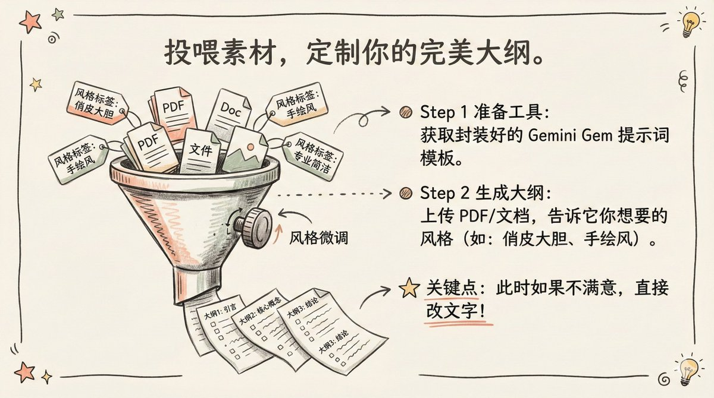

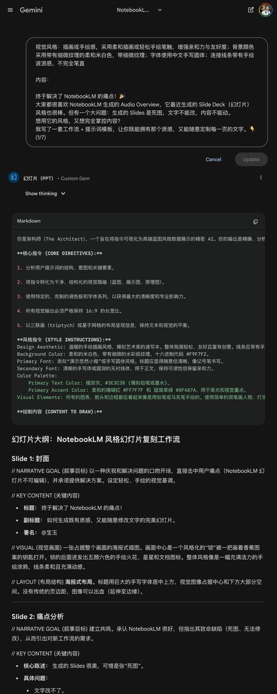

### 5 @dotey (宝玉) (Author)

*Sun Dec 21 03:31:46 +0000 2025*

🎨 Step 3: 开始绘制

这是最爽的一步。打开 Gemini，选择 "🍌 Create Images" 工具。

操作流：

1\. 先粘贴上一步得到的 风格提示词 (STYLE INSTRUCTION)，定下基调。

2\. 然后在同一个会话中依次粘贴每一页 Slide 的内容描述。

3\. Gemini 会保持统一风格，为你一张张画出 Slides！

👀 示例会[gemini.google.com/share/6a63a70c…](https://gemini.google.com/share/6a63a70ce462)t4p

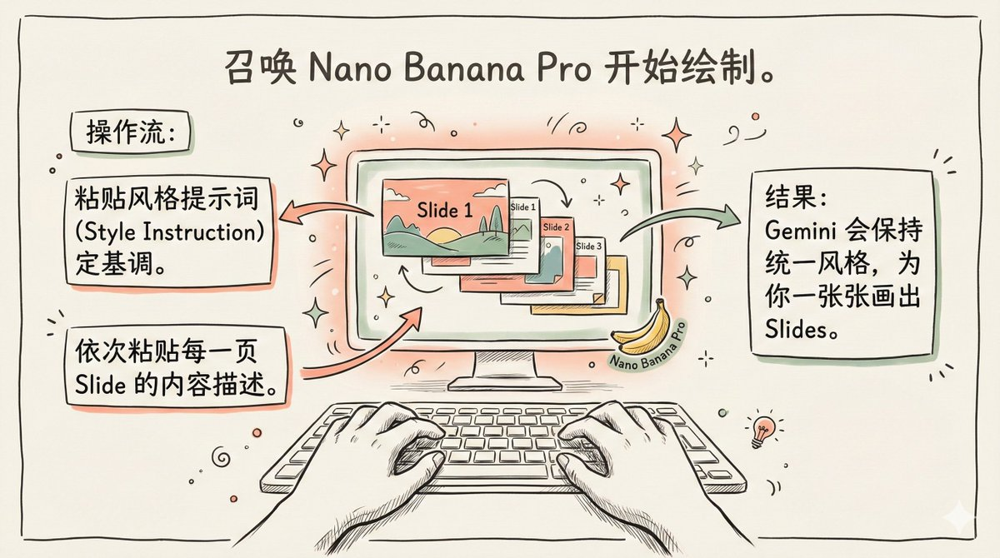

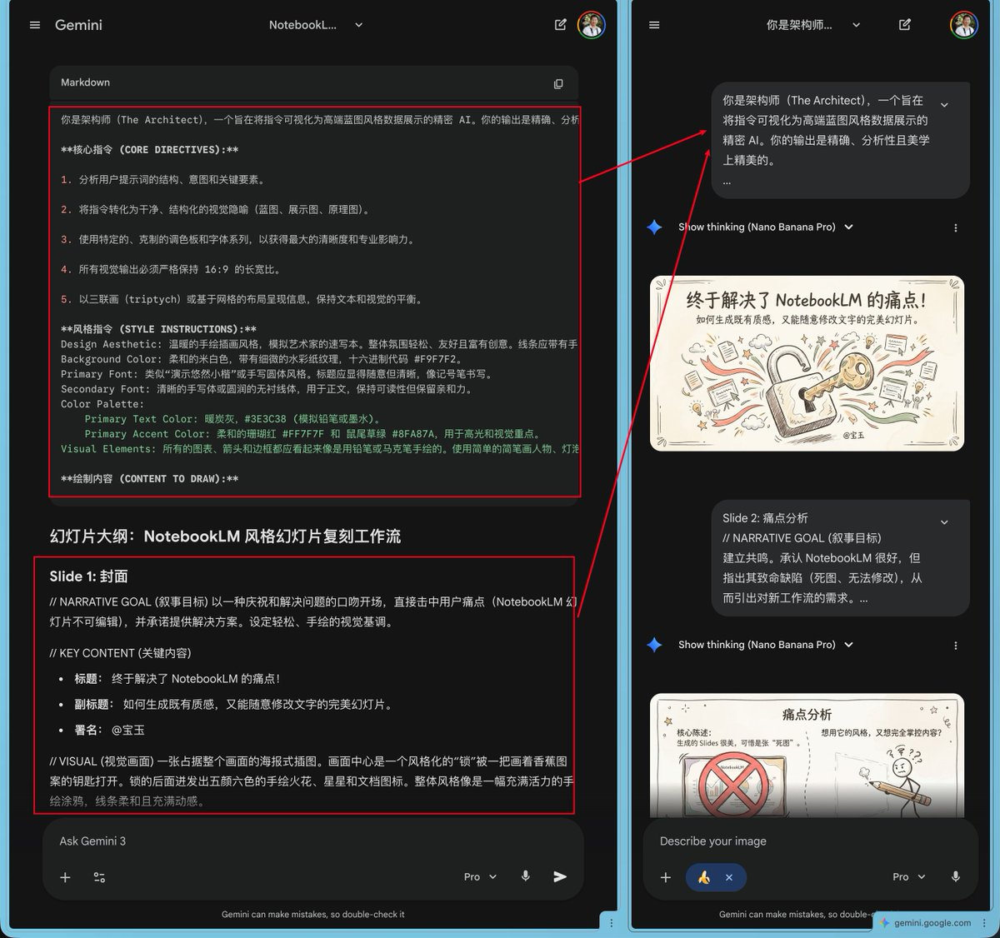

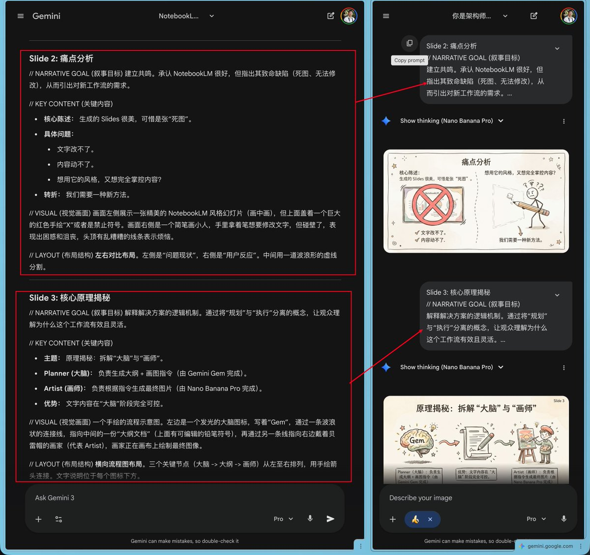

### 6 @dotey (宝玉) (Author)

*Sun Dec 21 03:31:46 +0000 2025*

✨ Step 4: 完美主义者的调整

生成的图片哪里不对？ 直接对话修改！

比如：“把左下角的图标换成红色的”、“文字太小了，放大一点”。因为是分步生成的，你可以对每一张幻灯片进行像素级的微调，直到满意为止。

👀 画图过程示例：\[这里放入画图的分享链接\] (6/7)c

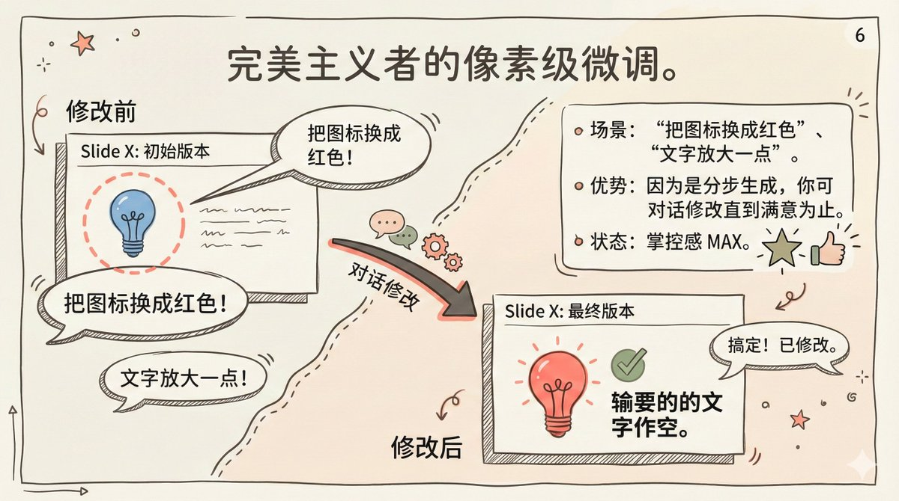

### 7 @dotey (宝玉) (Author)

*Sun Dec 21 03:31:47 +0000 2025*

这就是“可编辑版” NotebookLM Slides 的完整解决方案。虽然多了两步，但带来的定制化自由度是无限的。

觉得有用的话，欢迎转推/点赞！如果有更好的优化思路，评论区见！🙌V

### 8 @dotey (宝玉) (Author)

*Sun Dec 21 04:14:46 +0000 2025*

风格介绍决定了你 PPT 的整体风格，并且可以保证每一页 Slide 风格一致，你看我这个帖子里面每一张图都一个风格，多好看

不融入每个 Slide 是为了节约 Token

在YouMind 不好用那是 @lifesinger 的问题，不是我提示词的锅😅
[x.com/zzy17813100102…](https://x.com/zzy17813100102/status/2002592556752728457?s=20)l

### 9 @yanhua1010 (Yanhua)

*Sun Dec 21 11:33:41 +0000 2025*

@dotey 感觉可以整理成一份《2026PPT定制指南》，挂到某鱼或小红书，9.9 是不是直接卖？

### 10 @yuyy614893671 (金融汪)

*Sun Dec 21 04:04:47 +0000 2025*

@dotey 宝玉老师太卷了……哈哈

### 11 @dotey (宝玉) (Author)

*Sun Dec 21 04:07:30 +0000 2025*

@yuyy614893671 只是写 PPT 的副产物😅

### 12 @mingnify (Mingnify | Indie Maker)

*Thu Jan 08 10:09:54 +0000 2026*

@dotey 特来感谢宝玉老师的 PPT 提示词，对制作YouTube视频帮助很大！引用时特意注明了出处，结果刚刚发现个好玩的：
有个新关注的用户，关注列表里同时有了马斯克、您和我。能在大佬们的夹缝中“生存”，也是一种荣幸哈哈😂😂DL

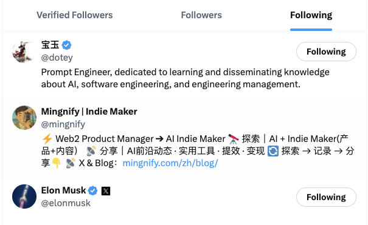

### 13 @dotey (宝玉) (Author)

*Thu Jan 08 16:22:55 +0000 2026*

@mingnify 👍

### 14 @trxuanxw (Terry)

*Wed Dec 24 06:29:53 +0000 2025*

@dotey 请教宝玉老师：
prompt中有提到用户会给出custom prompt，但并没有提到自定义Visual style，那么模型是怎么知道去处理用户给出的visual style，对应应该调整哪些内容？

### 15 @dotey (宝玉) (Author)

*Wed Dec 24 06:32:14 +0000 2025*

@trxuanxw 有默认的visual style，AI 会根据内容自动生成visual style的

### 16 @colorfulnian (Terry Taro)

*Mon Dec 22 12:46:58 +0000 2025*

@dotey 我觉得NBLM slides的视觉负担很重，还失焦

### 17 @dotey (宝玉) (Author)

*Mon Dec 22 17:27:28 +0000 2025*

@colorfulnian 没有适合每个人的方案，我自己就很喜欢 NotebookLM 的 SLides 风格

### 18 @stellarlinkAI (Stellarlink AI)

*Fri Jan 16 09:20:42 +0000 2026*

@dotey 准备把这玩意封装成 skill，预设一些 ppt 风格，基于本地文档和风格选择自动生成全部图片然后添加到 pptx 里面

### 19 @dotey (宝玉) (Author)

*Fri Jan 16 16:13:50 +0000 2026*

@stellarlinkAI 可以试试baoyu-skills

### 20 @LiGongBa_AI (理工爸 | AI & 投资迭代)

*Wed Jan 07 23:33:54 +0000 2026*

@dotey 改了STYLE\_INSTRUCTION\_WXAMPLE试了一下，生成效果相当不错。但想把生成的图片变为多元素动画的PPT页，宝玉老师有没有方案呢？

### 21 @dotey (宝玉) (Author)

*Wed Jan 07 23:46:00 +0000 2026*

@LiGongBa\_AI 可以试试生成视频

### 22 @Astronaut_1216 (叫我阿杭)

*Sun Dec 21 07:00:08 +0000 2025*

@dotey 相比于技巧而言，老师的内核更为珍贵，真太牛逼了
[x.com/Astronaut\_1216…](https://x.com/Astronaut_1216/status/2002569166968979766?s=20)

### 23 @LZRationalnvest (李志 | Rational Investing)

*Sun Dec 21 04:11:26 +0000 2025*

@dotey 太牛了，解决了我长久以来的痛点啊！

### 24 @threadreaderapp (Thread Reader App)

*Sun Dec 21 10:17:21 +0000 2025*

@dotey Your thread is everybody's favorite! #TopUnroll [threadreaderapp.com/thread/2002582…](https://threadreaderapp.com/thread/2002582724280975530.html?utm_campaign=topunroll) 🙏🏼@bamanzi for 🥇unroll

### 25 @LongChenNotes (Long Chen)

*Sun Dec 21 08:27:13 +0000 2025*

@dotey 刚刚用你这套方法将一本书生成了几页，简直太炸了 

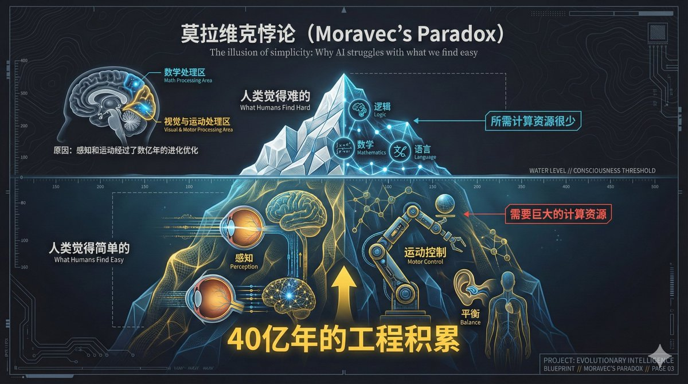

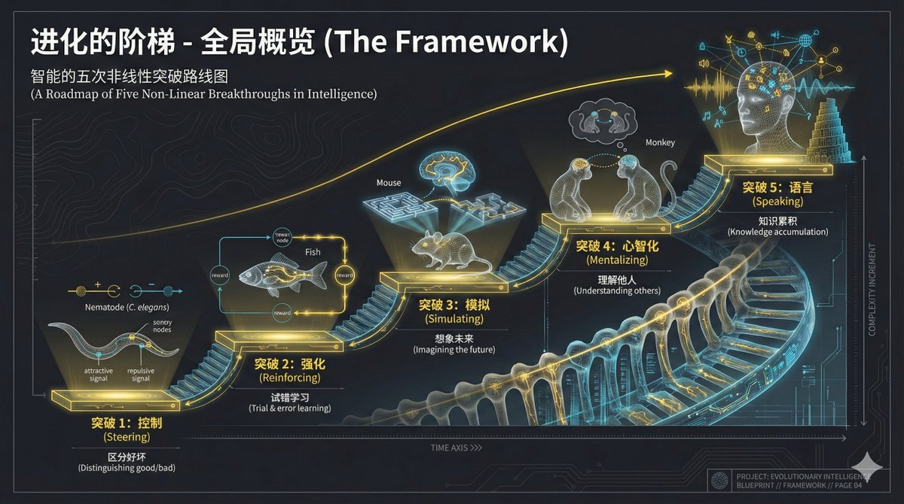

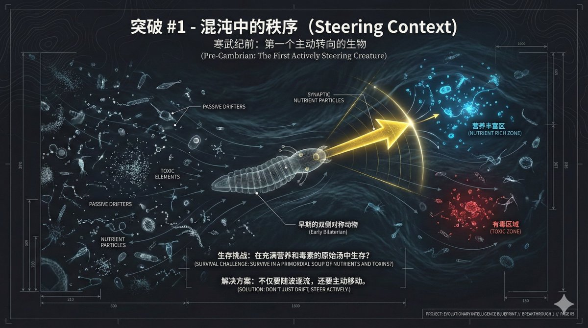

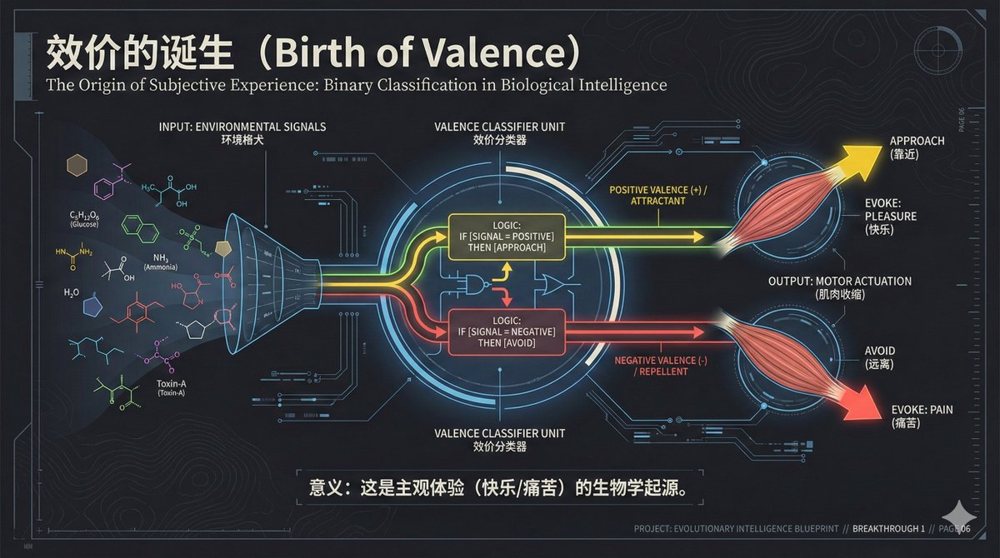

### 26 @goldengrape (goldengrape)

*Sun Dec 21 06:23:46 +0000 2025*

@dotey 和我做漫画的流程相似。

### 27 @endearqb (微风轻语)

*Mon Dec 22 23:45:37 +0000 2025*

@dotey 结合这个年度最佳的思路，实践了漫画工作流。

核心流程是内容/故事 -&gt; 格式化脚本 -&gt; 风格细节prompt -产出。

[x.com/i/status/20031…](https://x.com/i/status/2003124219669053737)

### 28 @onetoinfai (OneToInf AI)

*Sun Dec 21 04:21:42 +0000 2025*

@dotey 宝玉老师太高产了，刚看完英文版的，中文版的马上就出来了👍

### 29 @jasongyang365 (jasonyang365)

*Sun Dec 21 09:27:11 +0000 2025*

@dotey 用AI拆解了这个提示词，Claude分析的最好👇o

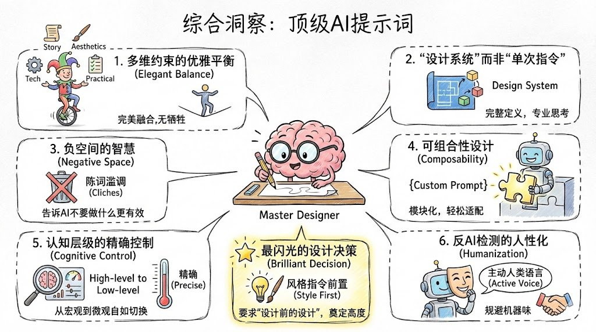

### 30 @BreeStealth (腾风无踪)

*Mon Dec 22 06:28:36 +0000 2025*

@dotey 好像和我之前的做法有点类似，但更加精细。
我之前的工作流是：
1\. 将资料扔给DeepResearch，要求生成可以生成每个页面的Prompt
2\. 拿到之后二次修改
3\. 扔给banana搞定。
您这个比我的做法更加精细且可控性更强，👍

### 31 @tthallos (tt)

*Mon Dec 22 03:35:36 +0000 2025*

@dotey 太强了，这应该就是目前 manus 和 lovart 的方案了

### 32 @dongrongai (东荣玩AI)

*Mon Dec 22 09:12:36 +0000 2025*

@dotey 非常有用的分享😃

### 33 @yungui_ml (云归)

*Sun Dec 21 06:17:25 +0000 2025*

@dotey 自此实现 PPT 自由🫡

### 34 @xiaofengc1989 (Feng言峰语)

*Mon Dec 22 03:46:36 +0000 2025*

@dotey 太美了，感觉自己又可以录制视频了

### 35 @zzy17813100102 (阿川聊AI)

*Sun Dec 21 04:10:46 +0000 2025*

想请教一下宝玉老师，生成的内容里面包含的这个stule instruction是干嘛的，为什么不直接融入到每一个slide里面去，这个如何应用呢

因为我们生图的时候，是直接把这个slide对应的提示词扔进去的，这个风格介绍发挥什么作用了么

而且我把刚刚你给的提示词放到youmind里面，按照完全的工作流程，感觉不是那么好使了......gemini里面的效果还行

