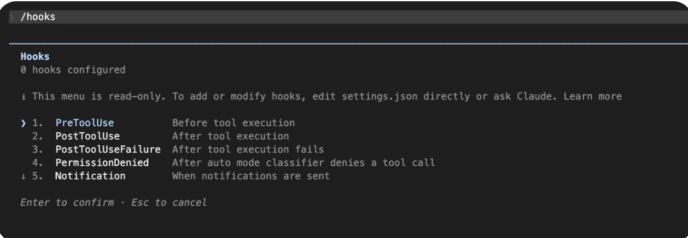
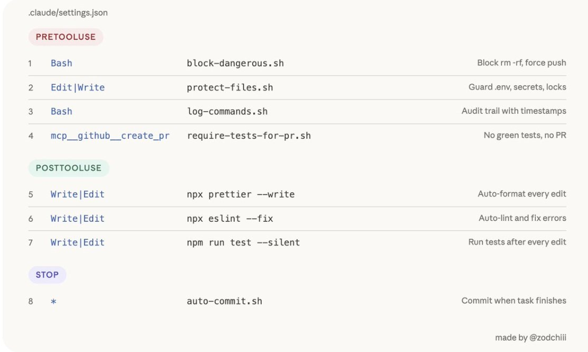
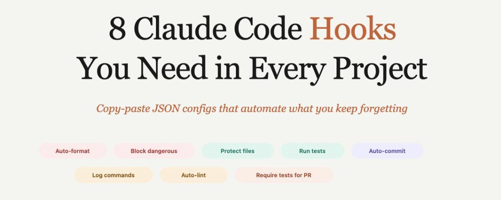

# 📰 8 个 Claude Code Hooks 实战（译）

上周四晚上十一点多，我正准备关电脑。

瞄了一眼 git diff，发现 Claude 把我的 .env 改了。加了一行调试变量。本身没啥——但我当时连着生产库。

> 导读：用了仨月 Claude Code，之前天天帮它擦屁股。后来发现 Hooks 之后 10 分钟设好，之前手动检查的活全自动了。回不去了。原文 下面是翻译+实测。

[Embedded Tweet: https://x.com/i/status/2040000216456143002]

你有没有过这种经历：让 Claude Code 做某件事，它就是不做？

你说"格式化代码"——它没做。你说"别碰那个文件"——它碰了。

你说"完成前跑一下测试"——它忘了。

原因在于，CLAUDE.md 只是一个建议。

Claude 读了它，大概 80% 的时间会遵守。但 Hooks 不同。它们是自动触发的动作——每当 Claude 编辑文件、执行命令或完成任务时，都会自动执行。

下面 8 个 Hooks，直接复制到 settings.json，设完就忘。

## 30 秒搞懂原理

Hooks = 绑在 Claude Code 动作上的脚本。设一次，后台一直跑。

- PreToolUse：Claude 动手之前。exit code 2 = 拦住。门卫。

- PostToolUse：Claude 动手之后。跑格式化、跑测试。质检员。

\`\`\`markdown
hook在哪：
.claude/settings.json         项目级（git 同步全组）
\~/.claude/settings.json       用户级（所有项目）
.claude/settings.local.json   本地（不进 git）
\`\`\`

文档：[https://code.claude.com/docs/en/hooks](https://code.claude.com/docs/en/hooks)

## 1\. 自动格式化

\`\`\`json
{
  "hooks": {
    "PostToolUse": \[
      {
        "matcher": "Write\|Edit",
        "hooks": \[
          {
            "type": "command",
            "command": "jq -r '.tool\_input.file\_path' \| xargs npx prettier --write 2&gt;/dev/null; exit 0"
          }
        \]
      }
    \]
  }
}
\`\`\`

Python 换 black，Go 换 gofmt，Rust 换 rustfmt。

之前在 CLAUDE.md 里写了"永远运行 Prettier"。管用，但偶尔会忘。偶尔忘一次就够你在 PR 里丢一次脸了。

装完之后再没出过格式问题。所有项目标配，没有之一。

## 2\. 拦截危险命令

Claude 真的会跑 rm -rf。概率低，但概率低跟零之间，隔着你的生产数据库。

创建.claude/hooks/block-dangerous.sh：

\`\`\`bash
Create .claude/hooks/block-dangerous.sh:
#!/usr/bin/env bash
set -euo pipefail
cmd=$(jq -r '.tool\_input.command // ""')

dangerous\_patterns=(
  "rm -rf"
  "git reset --hard"
  "git push.\*--force"
  "DROP TABLE"
  "DROP DATABASE"
  "curl.\*\|.\*sh"
  "wget.\*\|.\*bash"
)

for pattern in "${dangerous\_patterns\[@\]}"; do
  if echo "$cmd" \| grep -qiE "$pattern"; then
    echo "Blocked: '$cmd' matches dangerous pattern '$pattern'. Propose a safer alternative." &gt;&2
    exit 2
  fi
done
exit 0
Then add to your settings.json:
{
  "hooks": {
    "PreToolUse": \[
      {
        "matcher": "Bash",
        "hooks": \[
          {
            "type": "command",
            "command": ".claude/hooks/block-dangerous.sh"
          }
        \]
      }
    \]
  }
}
\`\`\`

再往 settings.json 添加:

\`\`\`json
{
  "hooks": {
    "PreToolUse": \[
      {
        "matcher": "Bash",
        "hooks": \[
          {
            "type": "command",
            "command": ".claude/hooks/block-dangerous.sh"
          }
        \]
      }
    \]
  }
}
\`\`\`

exit code 2 = 出错拦截，0 = 放行，这个很简单，告诉 Claude 原因出错了，并让它换方案。

装了这个之后晚上终于能睡踏实了。之前有段时间做梦都梦到 Claude 跑了个什么奇怪的命令，醒来第一件事就是打开终端检查。你说荒不荒谬，一个程序员被自己的工具搞出 PTSD 了。

## 3\. 敏感文件上锁

Claude 重构的时候顺手改了 package-lock.json。后面两个小时我都在跟诡异的依赖冲突搏斗，最后发现就是它动了不该动的文件。

\`\`\`bash
#!/usr/bin/env bash
set -euo pipefail
file=$(jq -r '.tool\_input.file\_path // .tool\_input.path // ""')

protected=(
  ".env\*"
  ".git/\*"
  "package-lock.json"
  "yarn.lock"
  "\*.pem"
  "\*.key"
  "secrets/\*"
)

for pattern in "${protected\[@\]}"; do
  if echo "$file" \| grep -qiE "^${pattern//\\\*/.\*}$"; then
    echo "Blocked: '$file' is protected. Explain why this edit is necessary." &gt;&2
    exit 2
  fi
done
exit 0
\`\`\`

\`\`\`bash
{
  "hooks": {
    "PreToolUse": \[
      {
        "matcher": "Edit\|Write",
        "hooks": \[
          {
            "type": "command",
            "command": ".claude/hooks/protect-files.sh"
          }
        \]
      }
    \]
  }
}
\`\`\`

停一下。

这个 Hook 干的事说白了就一个字：防。

有人会觉得矛盾——你用 AI 写代码，又防着它？你花钱请它来帮忙，结果第一件事是给它画红线？

但我越想越觉得，这可能就是我们这代程序员跟 AI 打交道的常态了。你离不开它，但你也不敢完全放手。就像你第一次把车钥匙交给刚拿驾照的孩子——你坐在副驾上，脚一直悬在刹车上方。

区别在于，Hooks 让你可以把脚从刹车上挪开。因为刹车已经自动化了。

顺便说：不会拖慢 Claude。毫秒级的事，实测过。

好，防灾到此为止。下面聊提效。

说真的，我一开始也觉得没必要搞这些。我的项目又不大，Claude 又挺聪明的。直到那天晚上 .env 的事。10 分钟设好这些 Hook，之后它们拦住的那一次事故，可能值你一整天。

顺便问一句——你用 Claude Code 多久了？有没有被它坑过？我特别好奇有多少人跟我有类似经历。

## 4 & 5. 测试这件事，我踩了两次坑才学乖

第一次：Claude 改完代码说"搞定了"。我信了。20 分钟后要 commit，测试全红。

第二次：Claude 写完功能一激动直接建了 PR。CI 全红。Reviewer 留了俩字："认真？"

那个 Reviewer 是我 lead。当时恨不得找个地缝钻进去。

两个坑，两个 Hook。

改完代码自动跑测试：

\`\`\`json
{
  "hooks": {
    "PostToolUse": \[
      {
        "matcher": "Write\|Edit",
        "hooks": \[
          {
            "type": "command",
            "command": "npm run test --silent 2&gt;&1 \| tail -5; exit 0"
          }
        \]
      }
    \]
  }
}
\`\`\`

tail -5 只留最后几行，别让 200 行日志撑爆 context。

建 PR 前强制测试通过：

.claude/hooks/require-tests-for-pr.sh：

\`\`\`bash
#!/usr/bin/env bash
set -euo pipefail

if npm run test --silent; then
  exit 0
else
  echo "Tests are failing. Fix all test failures before creating a PR." &gt;&2
  exit 2
fi
\`\`\`

\`\`\`json
{
  "hooks": {
    "PreToolUse": \[
      {
        "matcher": "mcp\_\_github\_\_create\_pull\_request",
        "hooks": \[
          {
            "type": "command",
            "command": ".claude/hooks/require-tests-for-pr.sh"
          }
        \]
      }
    \]
  }
}
\`\`\`

Claude Code 创造者 Boris Cherny 说过，这种实时反馈能让输出质量翻 2-3 倍。我自己的体感是确实快了不少，Claude 修 bug 不再是"盲猜"了。

## 6\. 自动 Lint + 7. 审计日志

这俩不像前面几个有什么惊天大坑，但不装你会在小地方持续被恶心到。

Lint：有一次 merge 之后队友给我发了个白眼 emoji，一个字没说。我看了半天才明白——ESLint 没跑，一堆规则违反。那种被无声审判的感觉，比被骂还难受。加上了：

\`\`\`json
{
  "hooks": {
    "PostToolUse": \[
      {
        "matcher": "Write\|Edit",
        "hooks": \[
          {
            "type": "command",
            "command": "npx eslint --fix $(jq -r '.tool\_input.file\_path') 2&gt;&1 \| tail -10; exit 0"
          }
        \]
      }
    \]
  }
}
\`\`\`

跟 #1 搭配：Prettier 管格式，ESLint 管规则。到手就是干净的。

日志：上个月 Claude 在某次会话里覆盖了一个配置文件，我三天后才发现。问题是我不知道是哪次会话、哪条命令干的。翻了一下午 commit 也没头绪。从那以后我装了这个：

.claude/hooks/log-commands.sh：

\`\`\`bash
#!/usr/bin/env bash
set -euo pipefail
cmd=$(jq -r '.tool\_input.command // ""')
printf '%s %s\\n' "$(date -Is)" "$cmd" &gt;&gt; .claude/command-log.txt
exit 0
\`\`\`

\`\`\`json
{
  "hooks": {
    "PreToolUse": \[
      {
        "matcher": "Bash",
        "hooks": \[
          {
            "type": "command",
            "command": ".claude/hooks/log-commands.sh"
          }
        \]
      }
    \]
  }
}
\`\`\`

.claude/command-log.txt 加 .gitignore。出事打开，精确到秒。

## 8\. 自动 commit

放最后是因为这个最有争议。在我团队引发了一场小战争。

反对派说：自动 commit？这是对 git 的亵渎。commit message 呢？review 呢？

我说：你是想要每个任务一个干净 commit，还是要一天结束时那个叫 "various changes" 的垃圾山？

吵了半天，最后怎么着？两派各用各的，谁也没服谁。到今天还是这样。

.claude/hooks/auto-commit.sh：

\`\`\`
#!/usr/bin/env bash
set -euo pipefail
git add -A
if ! git diff --cached --quiet; then
  git commit -m "chore(ai): apply Claude edit"
fi
exit 0
\`\`\`

\`\`\`json
{
  "hooks": {
    "Stop": \[
      {
        "matcher": "",
        "hooks": \[
          {
            "type": "command",
            "command": ".claude/hooks/auto-commit.sh"
          }
        \]
      }
    \]
  }
}
\`\`\`

配合 claude -w feature-branch（worktrees），每个任务一个隔离分支。用过之后 git 历史第一次变得可读了。

你可以不喜欢。但建议先试一周再下结论。

## 完整 settings.json

这里把所有内容放一起，方便复制。

复制到 .claude/settings.json，脚本放 .claude/hooks/，chmod +x .claude/hooks/\*.sh，commit。全组同步。

\`\`\`json
{
  "hooks": {
    "PreToolUse": \[
      {
        "matcher": "Bash",
        "hooks": \[
          { "type": "command", "command": ".claude/hooks/block-dangerous.sh" },
          { "type": "command", "command": ".claude/hooks/log-commands.sh" }
        \]
      },
      {
        "matcher": "Edit\|Write",
        "hooks": \[
          { "type": "command", "command": ".claude/hooks/protect-files.sh" }
        \]
      },
      {
        "matcher": "mcp\_\_github\_\_create\_pull\_request",
        "hooks": \[
          { "type": "command", "command": ".claude/hooks/require-tests-for-pr.sh" }
        \]
      }
    \],
    "PostToolUse": \[
      {
        "matcher": "Write\|Edit",
        "hooks": \[
          { "type": "command", "command": "jq -r '.tool\_input.file\_path' \| xargs npx prettier --write 2&gt;/dev/null; exit 0" },
          { "type": "command", "command": "npx eslint --fix $(jq -r '.tool\_input.file\_path') 2&gt;&1 \| tail -10; exit 0" }
        \]
      }
    \],
    "Stop": \[
      {
        "matcher": "",
        "hooks": \[
          { "type": "command", "command": ".claude/hooks/auto-commit.sh" }
        \]
      }
    \]
  }
}
\`\`\`

今天先装 #1 和 #2。 就这俩，最常见的翻车已经干掉一大半。

> 实践哥：翻译完这里我突然想到一件事。

> 一年前我还在嘲笑那些不会用 AI 的同事。现在呢？我每天的工作流是：让 AI 写代码，然后检查 AI 写的代码，然后给 AI 装护栏防止它写出问题代码。你的 title 还是 Software Engineer，但你每天干的事越来越像 AI Babysitter。

> Hooks 就是这个转变里唯一让我觉得舒服的部分——至少 babysitting 这件事，也可以自动化。

> 这个变化好不好？老实说我也没想明白。但它已经在发生了，不管你接不接受。

> 最后，那个问题我是真想听你的答案：该不该让 AI 自动 commit？

> 我见过两派人为这事差点闹翻。

> A. 该，反正 squash merge 时会压掉，过程 commit 无所谓

> B. 不该，commit 是工程师最后的体面

> C. 我有更野的操作——说来听听

### 🖼️ Attached Media

## 💬 Replies

### 1 @MinLiBuilds (实践哥 Li) (Author)

*Sat Apr 04 02:49:32 +0000 2026*

[x.com/i/status/20402…](https://x.com/i/status/2040250341455733053)

### 2 @xiangxiang103 (雨哥向前冲)

*Sat Apr 04 01:22:57 +0000 2026*

@MinLiBuilds 实践哥，周六早上就来硬货啊，本来想出去的，不行，得读完了才能出去！

### 3 @MinLiBuilds (实践哥 Li) (Author)

*Sat Apr 04 01:39:25 +0000 2026*

@xiangxiang103 收藏下慢慢读 我也早上搜到的 哈哈

### 4 @alin_zone (阿蔺A-Lin)

*Sat Apr 04 02:13:33 +0000 2026*

@MinLiBuilds 假期就开始搞硬货了？我简单看了几眼还是有不少信息量的

### 5 @MinLiBuilds (实践哥 Li) (Author)

*Sat Apr 04 02:50:05 +0000 2026*

@alin\_zone 跟着大家一起学习。

### 6 @rionaifantasy (Rion Wu)

*Sat Apr 04 06:29:21 +0000 2026*

@MinLiBuilds 专业👍🏻

### 7 @Lonely__MH (Lonely)

*Sat Apr 04 03:25:00 +0000 2026*

@MinLiBuilds 假期第一天就来干货👏🏻

### 8 @coder_left (程序员Left)

*Sat Apr 04 10:15:34 +0000 2026*

@MinLiBuilds 实践哥真干啊，跟着学习了

### 9 @jumppshot (jumpshot)

*Sat Apr 04 04:39:17 +0000 2026*

@MinLiBuilds @readwise save thread

