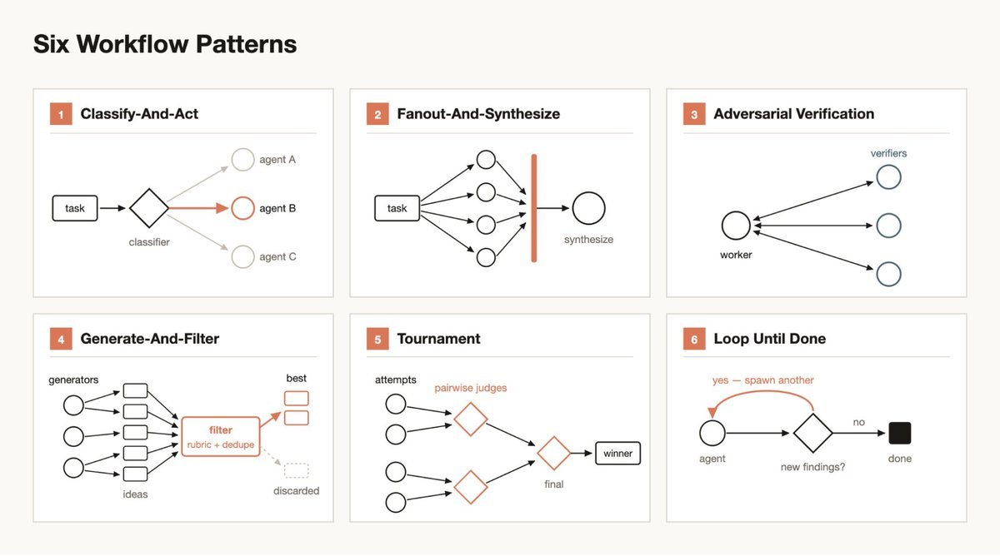

Workflow 有 6 种形式。 

我找到了原始prompt 放在评论区。

这六种形式分别是：

分类并执行：由一个 classifier agent 判断任务类型，据此路由到不同的 agent 或行为；也可以在任务完成时确定输出的分类。

扇出并综合：把任务拆成许多更小的步骤，每个步骤跑一个 agent，再综合所有结果。当大量步骤都能从干净、互不干扰的 context window 中受益时，这一模式尤其有用。综合这一步充当一个 barrier，它会等所有扇出的 agent 完成后，再合并它们的结构化输出。

对抗式验证：每生成一个 agent，就再跑一个单独的 agent，以对抗的姿态对照 rubric 或判定准则来验证它的输出。

生成并筛选：先就某个主题生成多个想法，再按 rubric 或验证来筛选，去重后只留下质量最高、经过检验的那些。
锦标赛：让 N 个 agent 用不同方法在同一个任务上互相竞争，而不是把工作分摊下去。由成对评判的 agent 决出胜者，直到只剩一个。

循环至完成：对工作量未知的任务，持续生成 agent，直到满足停止条件为止，比如不再有新发现、日志里不再有错误，而不是采用固定的遍数。

### 🖼️ Attached Media

## 💬 Replies

### 1 @MinLiBuilds (实践哥 Li) (Author)

*Fri Jun 05 14:23:31 +0000 2026*

\- Adversarial verify: spawn N independent skeptics per finding, each prompted
  to REFUTE. Kill if ≥majority refute. Prevents plausible-but-wrong findings
  from surviving.
\- Perspective-diverse verify: when a finding can fail in more than one way,
  give each verifier a distinct lens (correctness, security, perf,
  does-it-reproduce) instead of N identical refuters — diversity catches
  failure modes redundancy can't.
\- Judge panel: generate N independent attempts from different angles (e.g.
  MVP-first, risk-first, user-first), score with parallel judges, synthesize
  from the winner while grafting the best ideas from runners-up. Beats
  one-attempt-iterated when the solution space is wide.
\- Loop-until-dry: for unknown-size discovery (bugs, issues, edge cases), keep
  spawning finders until K consecutive rounds return nothing new. Simple
  counters (while count &lt; N) miss the tail.
\- Multi-modal sweep: parallel agents each searching a different way
  (by-container, by-content, by-entity, by-time). Each is blind to what the
  others surface; useful when one search angle won't find everything.
\- Completeness critic: a final agent that asks "what's missing — modality not
  run, claim unverified, source unread?" What it finds becomes the next round
  of work.
\- No silent caps: if a workflow bounds coverage (top-N, no-retry, sampling),
  log() what was dropped — silent truncation reads as "covered everything"
  when it didn't.

### 2 @gbroai (狗哥笔记)

*Sat Jun 06 07:43:58 +0000 2026*

@MinLiBuilds 实际上， workflow 可以有无数种，这 6 种可以进行不停的组合。

### 3 @MinLiBuilds (实践哥 Li) (Author)

*Sat Jun 06 07:45:08 +0000 2026*

@pyang1235005 yes 6 种基础范式

### 4 @shitunote (马识途)

*Fri Jun 05 14:49:54 +0000 2026*

@MinLiBuilds 太专业了 实践哥 

这个得用到大工程中吧？

### 5 @MinLiBuilds (实践哥 Li) (Author)

*Fri Jun 05 14:59:15 +0000 2026*

@shitunote 嗯，最近经常在用，特别稳定。每天睡觉前发一个，第二天早上起来经常有惊喜

### 6 @alexhyzhang (AlexHYZhang)

*Sat Jun 06 15:40:17 +0000 2026*

@MinLiBuilds 而且可以不断嵌套，太疯狂了

