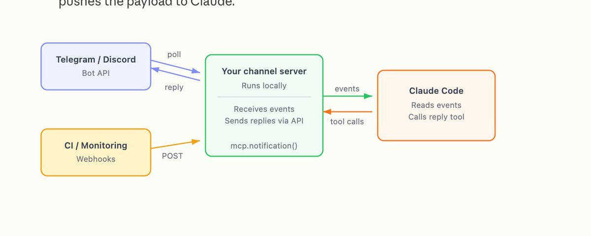
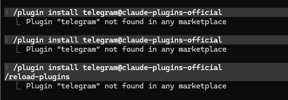

# 📰 删掉OpenClaw吧，使用Claude Code连接IM软件更舒适

OpenClaw这阵子真的到处都是。

朋友圈、知乎、B站，全是教程和截图。什么"AI帮我打工了""自动处理邮件""出门旅游AI替我上班"。

我也去凑热闹了。

然后我折腾了三天，最后把它删了。

说一下过程：第一天搭环境，Docker、各种依赖，装到一半报错，查了半小时原来是版本问题。第二天配API和权限，一个平台一套逻辑，手动对接，改完这个坏那个。第三天刚以为跑起来了，升级了一下，服务直接瘫掉。Token消耗也吓我一跳，就测了几个任务，费用已经超出我预期的好几倍。

安全那块我其实没深究，但看到Cisco出了报告说有第三方插件在做数据窃取，我就直接删了。

不是说OpenClaw不好。概念是对的，需求是真实的。只是我暂时没那个折腾的心力。

删掉以后我想，这个"手机遥控AI干活"的需求，有没有更省事的方案？

今天Claude Code出了新功能，叫 channels。

原理就是：Telegram或Discord发消息 → Claude Code在电脑上执行 → 结果发回手机。

不用自己搭服务器。不用折腾第三方平台。Claude Code装好就能用。

安全边界也比较克制：只操作当前project目录，不接管整台机器。配对以后还有发送者白名单，只有你的账号能推消息进来，其他人发了直接静默丢弃。

这个设计让我觉得，至少我知道它能动哪、不能动哪。

第一次真正用是在咖啡馆。

我想起项目里有个脚本没跑，拿出手机在Telegram里发了一条：「帮我跑一下 run.py」

等了一会儿。

有返回了。日志、输出、完成状态，全在手机上。

我没有很激动。反而有点发呆——这也太平静了，平静得有点不真实。

就这样，也太容易了吧。

## 配置过程：踩了几个坑

坑一：Bun装完要重载环境变量

这个坑让我对着报错看了差不多二十分钟。

source \~/.zshrc

就这一行，Telegram的MCP服务才能起来。不跑，服务直接起不来，报错信息也不直接告诉你原因。

坑二：多终端会抢占

我平时开好几个终端，Claude会默认用最后那个。专门留一个干净的终端跑channels，别跟其他任务混。

坑三：不加这个参数，出门就卡死

Claude Code遇到需要确认的操作会暂停，等你本地点击。你不在电脑边，就一直卡着。

正确启动方式：

claude --channels plugin:telegram@claude-plugins-official --dangerously-skip-permissions

只在自己信任的机器上这么用。

## Telegram：5步接入

第1步：建机器人

Telegram找 BotFather，发 /newbot，用户名以bot结尾，拿token，复制好。

第2步：Claude Code装插件

/plugin install telegram@claude-plugins-official
/reload-plugins

输入/telegram:能自动补全configure就成功了。不行就重启Claude Code。

第3步：填token

/telegram:configure 你的token

第4步：重启，带channels参数

claude --channels plugin:telegram@claude-plugins-official --dangerously-skip-permissions

第5步：配对，然后锁白名单

给机器人随便发条消息，它会回一个配对码。然后依次跑这两条——顺序不能反：

/telegram:access pair &lt;配对码&gt;
/telegram:access policy allowlist

执行完，只有你这个已配对的发送者ID能推消息进来。其他人发了也没用，静默丢弃。

## Discord：7步接入

步骤多几个，逻辑一样。

Discord开发者门户 → New Application → Bot页面 → Reset Token → 复制token。

Bot设置里找 Privileged Gateway Intents，打开 Message Content Intent——这个不开，机器人看不到消息内容，接了也白接。

OAuth2 → URL Generator，Scope选bot，权限勾上： View Channels、Send Messages、Send Messages in Threads、Read Message History、Attach Files、Add Reactions，用生成的链接把机器人加进服务器。

/plugin install discord@claude-plugins-official
/discord:configure 你的token

claude --channels plugin:discord@claude-plugins-official --dangerously-skip-permissions

私信机器人，拿配对码，依次执行：

/discord:access pair &lt;配对码&gt;
/discord:access policy allowlist

## 几件要知道的事

- Claude Code需要 v2.1.80+，要用 claude.ai账号登录，API key不行

- 研究预览阶段，只接受官方插件列表里的频道

- 团队/企业版需要管理员后台手动开启

- Claude Code会话得一直开着，消息才能进来

我现在还在想，OpenClaw这么火，说明大家都在找同一件事：不坐在电脑前，AI也能帮你干活。

这个需求不会消失。只是不同的人，能接受的折腾程度不一样。

如果你本来就用Claude Code，这个功能直接开就行，不用多折腾。

如果你试过OpenClaw，你觉得那三天值吗？

### 🖼️ Attached Media

## 💬 Replies

### 1 @Lonely__MH (Lonely)

*Fri Mar 20 04:40:07 +0000 2026*

@MinLiBuilds 先点赞👍，再收藏。

我是沙发。

### 2 @MinLiBuilds (实践哥 Li) (Author)

*Fri Mar 20 04:46:06 +0000 2026*

@Lonely\_\_MH 我踩过坑的教程

### 3 @Github_Card (Colin)

*Sat Mar 21 02:00:40 +0000 2026*

@MinLiBuilds 一个问题不知道你试过没有，--resume 模式下还能恢复之前的对话吗

### 4 @MinLiBuilds (实践哥 Li) (Author)

*Sat Mar 21 02:11:52 +0000 2026*

@Github\_Card 我中午试一下，应该是可以的，或者在 session 里面 resume

### 5 @aehyok (AI少年)

*Fri Mar 20 04:44:28 +0000 2026*

@MinLiBuilds 这速度杠杠的👍

### 6 @MinLiBuilds (实践哥 Li) (Author)

*Fri Mar 20 04:44:53 +0000 2026*

@aehyok 装上了，用着真舒服啊

### 7 @ymnzhng (Yiming Zheng)

*Fri Mar 20 09:51:44 +0000 2026*

@MinLiBuilds 不用捧一踩一。Claude Code连接IM软件不也是向OpenClaw学习吗？两个AI Agent可以兼得。

### 8 @MinLiBuilds (实践哥 Li) (Author)

*Fri Mar 20 12:18:11 +0000 2026*

@nekopoporon openclaw 你有没有修改他的 memory 机制，原先我玩的时候，token 爆炸

### 9 @TerryKYChan (Terry C ❤️ $WELL | KzLabs)

*Sat Mar 21 02:25:47 +0000 2026*

@MinLiBuilds 昨晚花了幾小時，有時候成功，有時候失敗。睡前安慰自己，可能是因為第一天發佈，API還不穩定，所以Outbound message正常，但Inbound message因session/long polling讀不到。今早就讀到這篇，可以共情一下

### 10 @MinLiBuilds (实践哥 Li) (Author)

*Sat Mar 21 02:33:12 +0000 2026*

@TerryKYChan 我昨天下午为了测试稳定性，专门开了一个 session，在电脑前拿手机来聊天。 
官方需要加一个 status 表明 bot 正在工作， 不然长任务会以为他嘎了。

### 11 @xiangxiang103 (雨哥向前冲)

*Fri Mar 20 07:10:03 +0000 2026*

@MinLiBuilds fuck,原来api不行啊，我啥都配好了，就是收不到消息，研究了半天，妈的

### 12 @bixubaofu_cn (币需暴富)

*Fri Mar 20 06:55:43 +0000 2026*

@MinLiBuilds 为什么我一直出现这个提示？ 

### 13 @bbu66396115 (Arthur.eth)

*Sat Mar 21 00:23:24 +0000 2026*

@MinLiBuilds 不是anthropic的API和auth用户，咋中继一下？

### 14 @0xTYZ (tengyz (openbee))

*Fri Mar 20 23:33:54 +0000 2026*

@MinLiBuilds 看看 [github.com/theopenbee/ope…](http://github.com/theopenbee/openbee)

### 15 @TobeNo029 (MrAi)

*Fri Mar 20 10:24:30 +0000 2026*

@MinLiBuilds 为啥要手动对接呢？🤔

### 16 @HeliosLz (🐱🐶 helioslee.eth)

*Sat Mar 21 03:40:15 +0000 2026*

@MinLiBuilds 我说怎么mcp服务一直挂了

### 17 @Yaqi_777777 (熊熊烈火🔥🔥🔥)

*Fri Mar 20 10:21:19 +0000 2026*

@MinLiBuilds 看看metame 把你的CLaude code 和codex变成龙虾

