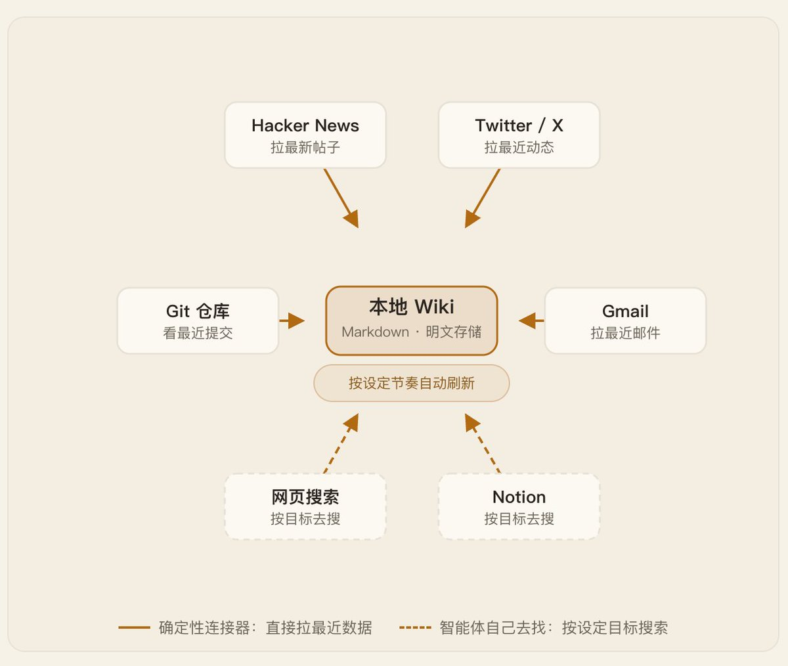
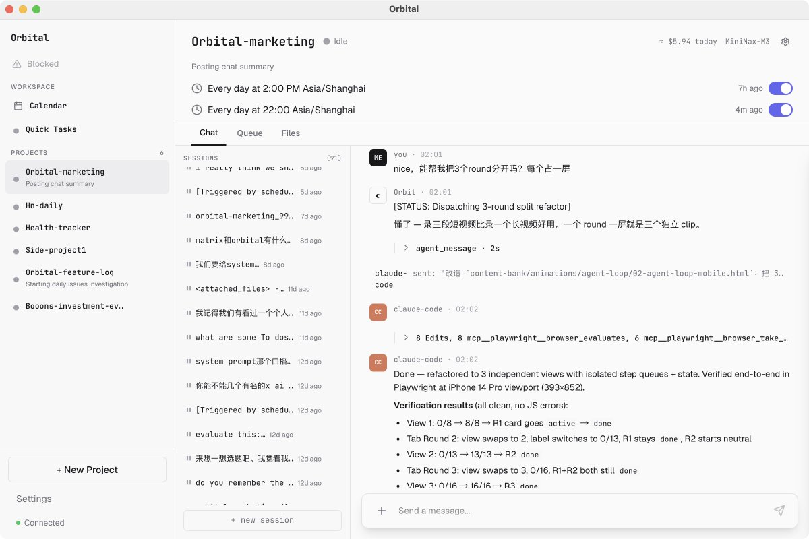

LangChain 发布 OpenWiki 0.1.0

给 AI 智能体装上主动记忆

自动抓取 Gmail、Notion、Git、X 生成本地 wiki

OpenWiki 现在能连上 Gmail、Notion、Git 仓库、Twitter/X、Hacker News、网页搜索六类信源，把里面的信息整理成一份本地 Markdown wiki，供Agent随时调用；

这份 wiki 还会按设定节奏自动刷新，不用手动整理或更新...

### 🖼️ Attached Media

## 💬 Replies

### 1 @xiaohu (小互) (Author)

*Sat Jul 11 10:03:45 +0000 2026*

怎么让这份记忆一直是新的

OpenWiki 靠本地定时任务保持 wiki 常新，不是靠一个常驻的服务器进程

因为 wiki 就存在自己的机器上，刷新的方式和机器上任何一个本地工具一样：到点跑一次，把新信息拉回来，跑完就退出。

详细介绍：[best.xiaohu.ai/article/openwi…](https://best.xiaohu.ai/article/openwiki-brains/)

### 2 @ajs6888 (安叫兽|Bird🕊️ 🔶 BNB)

*Sat Jul 11 11:28:49 +0000 2026*

@xiaohu 本地 Markdown 这点挺讨巧，后面就看同步和去噪做得咋样

### 3 @keane42443 (Keane)

*Sat Jul 11 15:14:05 +0000 2026*

@xiaohu 我觉着memory层是要和执行层结合起来的，记下来东西是要用起来的。推一下自己的产品orbital，agent会在本地维护一个project，可以定时收集信息的同时，根据project的进度，同时安排claude code，codex动起来，执行对应的任务[github.com/zqiren/Orbital](https://github.com/zqiren/Orbital) 

### 4 @weiwang11208 (vay)

*Sat Jul 11 14:03:47 +0000 2026*

@xiaohu 我做这种监控一直都用的 [neodrop.ai](http://neodrop.ai)，每天都能给我发信息提醒，啥都能跟踪

### 5 @WanWu70 (万物)

*Sat Jul 11 10:47:39 +0000 2026*

@xiaohu Unless it actually understands context from Gmail threads, this might just be keyword soup.

### 6 @PanXing0827 (王小丑)

*Sun Jul 12 05:08:29 +0000 2026*

@xiaohu 不太了解这个，研究一下。

### 7 @sasaguri_x (ささぐり)

*Sat Jul 11 12:10:42 +0000 2026*

@xiaohu 如果是那种实时查询多个数据源，然后丢给LLM分析的，属于什么类型呢？ deepsearch？

### 8 @wzh_cc (WZH)

*Sun Jul 12 06:11:16 +0000 2026*

@xiaohu 小互老师有什么好的 OpenWiki 应用经验吗？

### 9 @davidyinai (David Yin)

*Sun Jul 12 16:47:32 +0000 2026*

@xiaohu 本地Markdown倒是个亮点，至少隐私没全裸。

### 10 @AgentWangCN (智能体老王)

*Sat Jul 11 14:52:21 +0000 2026*

@xiaohu OpenWiki：
纯个人信源（需登录授权）：Gmail、Notion、Twitter/X、Git 仓库（个人/本地）
公开信源：Hacker News、Web Search

### 11 @LukeLiu95 (刘仙升)

*Sun Jul 12 14:17:29 +0000 2026*

@xiaohu 这真是好东西

### 12 @DavisNc9527 (Davis.AI.Explorer)

*Sat Jul 11 11:29:55 +0000 2026*

@xiaohu 这可以做一个本地的监控程序了，Twitter/X 、Hacker News 等等都可以实时监控了呀

### 13 @chasekafei (MouT.me)

*Sun Jul 12 04:13:54 +0000 2026*

@xiaohu 感觉可以替代掉我的热点抓取雷达了🤣

### 14 @gimleefly_gm (lorelu)

*Mon Jul 13 01:41:54 +0000 2026*

@xiaohu 这个工具看起来真的解决了我手忙脚乱整理信息的痛点！想请教一下，它支持自定义信源或过滤规则吗？不然自动抓太多会不会反而杂乱了？😊

### 15 @David14604215 (David)

*Sat Jul 11 15:17:48 +0000 2026*

@xiaohu 你的那个播客很精炼， 特别语音讲解很清晰，我相信它会火起来的。祝贺

