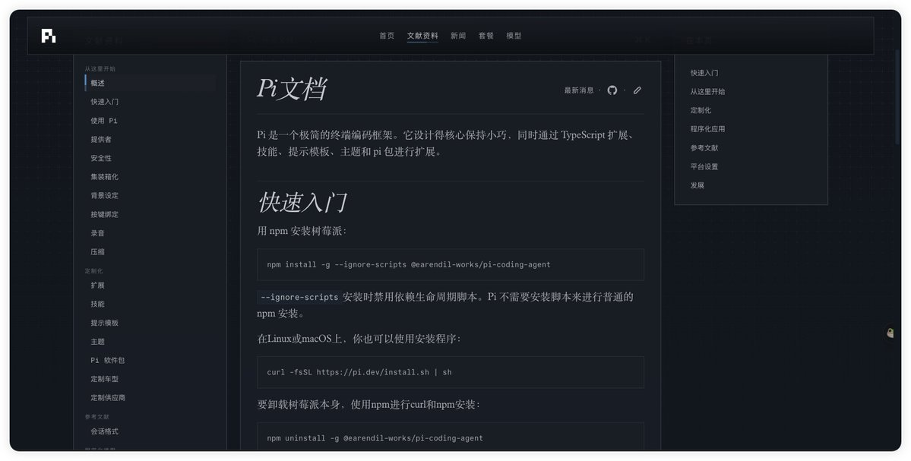
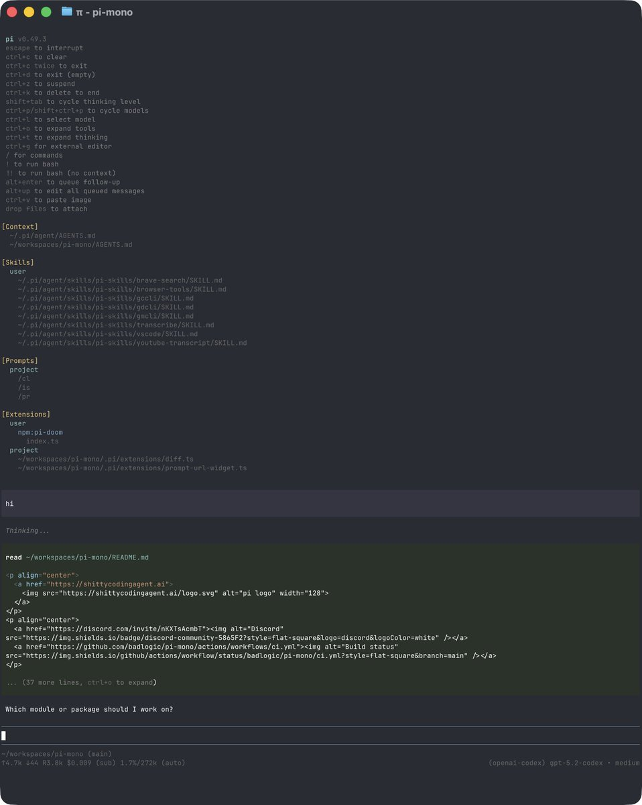

如果你也想开始学习 Pi，可以看看我的学习分享🔥

其实Pi没有想象的那么难，只是大多数人一开始学习的方向就错了，一上来研究 Harness、Agent Loop、Extension 这些东西。

如果让我推荐，我会建议按照这 5 个步骤进行学习：

1、先搞懂 Pi 到底是什么

先把 Pi、Pi Coding Agent、Claude Code、Codex 这些东西的关系弄明白，你只需要知道 Pi 最大的特点就是足够轻，而且很多能力都可以自己往上加。

2、先把最基础的功能用熟

安装、登录模型、新建 Session、继续之前的任务，再把几个常用命令摸熟，先让 Pi 真正进入你的日常工作，而不是装完以后就开始研究源码。

3、然后开始给 Pi 加能力

学会安装 Extension 和 Skill，再试试 SSH、安全插件、上下文工具这些真正能改善体验的东西，这一步基本也是 Pi 最好玩的阶段。

4、再去理解 Context 和 Token

等真正用过一段时间，再去理解为什么 Pi 的 System Prompt 很短、工具很少、缓存容易命中，以及上下文满了以后 Compaction 到底在干什么，会比一开始硬啃概念容易很多。

5、最后再玩 Pi 真正有意思的进阶玩法

手机远程、多设备协同、Sub-agent、多模型分工，甚至慢慢组合出一套属于自己的 Pi，这时候你才会真正理解为什么很多人把 Pi 当成 Harness，而不只是另一个 Coding Agent。

按照这五个点去学习，我相信你也一定可以体会到使用Pi 的快乐，就是那种自由自在的感觉，想要什么都可以动手自己去创造。

学习网站，我只推荐一个[pi.dev/docs/latest](https://pi.dev/docs/latest)j

### 🖼️ Attached Media

## 💬 Replies

### 1 @defaiscope (DeFAI Scope)

*Tue Aug 25 15:06:22 +0000 2026*

@xiaomovps 先每天只用基础功能，再去挖那些高级的东西。  

这样你才能真正感受到它怎么工作，并且在此基础上构建而不迷路。

### 2 @xiaomovps (小墨同学) (Author)

*Tue Aug 25 15:20:17 +0000 2026*

@defaiscope 主要是长时间去使用 这部分没有捷径 多去玩玩就知道了

概念可以后面慢慢补齐

### 3 @ajs6888 (安叫兽|Bird🕊️ 🔶 BNB)

*Tue Aug 25 14:05:56 +0000 2026*

@xiaomovps 先搞清楚工具边界，再折腾高级玩法，少走不少弯路

