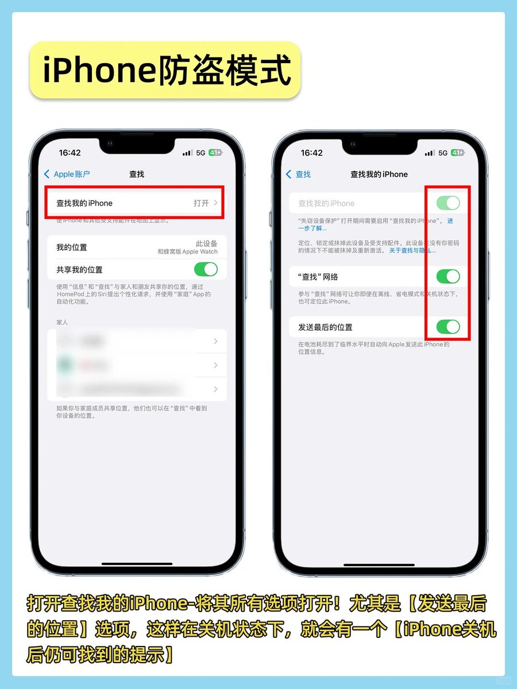
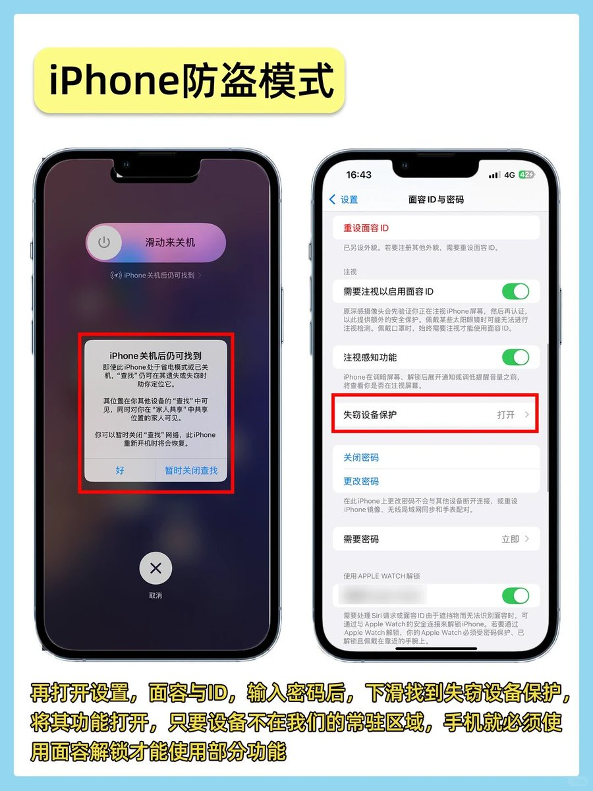
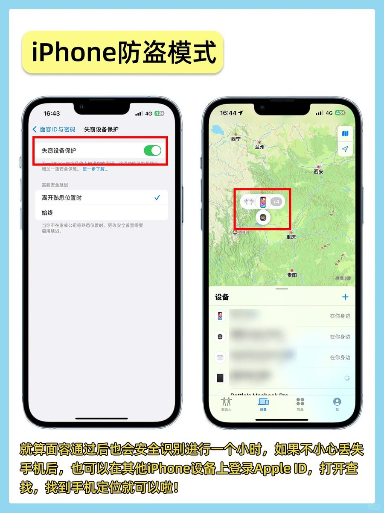
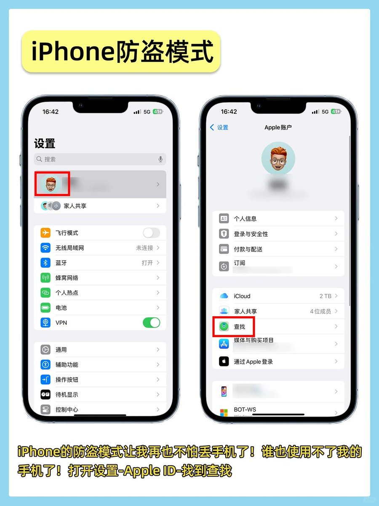

🔥 iPhone 防盗神级自动化（快捷指令）

给丢失的 iPhone 发一条含关键词的短信（如：LOST），
手机会 自动省电 + 前置拍照 + 定位 + 回传信息。

一次设置，长期生效。

🛠 设置步骤

1️⃣ 打开【快捷指令】→【自动化】→【创建个人自动化】
2️⃣ 选择【信息】→ 设触发词（如 LOST）
3️⃣ 按顺序添加动作：

开启【低电量模式】

【拍照】前置摄像头（预览关闭）

【获取当前位置】

【发送信息】到你自己（附照片+位置）

4️⃣ 关键设置：
运行前询问：关闭
运行时通知：关闭

### 🖼️ Attached Media

## 💬 Replies

### 1 @Yiwei_growth (Yiwei)

*Thu Feb 19 04:22:42 +0000 2026*

@xiaoying\_eth 确实实用，但我发现这种自动化有个坑：如果对方直接关机或者暴力拔掉SIM卡，快捷指令就完全断网哑火了

### 2 @cptangNAS (一只蜗牛)

*Fri Feb 20 02:49:30 +0000 2026*

@xiaoying\_eth 用来监控女朋友行踪，确实不错

