# 📰 Claude Code 命令大全（2026 最新版，夯爆了！）

用 Claude Code 这么久，我发现一个很有意思的现象，很多人天天用 Claude Code，但来来回回就会一个 \`/clear\`，顶多再加个 \`/init\`，剩下几十个命令压根没碰过。。

其实 Claude Code 在终端里藏了 90 多个命令，从初始化项目、切模型、管权限，到代码审查、后台跑任务、云端并行，基本上你能想到的操作，它都给你配好了对应的命令。

这篇我就把最新版的 Claude Code 命令按使用场景给你梳理一遍，告诉你什么时候该用哪个，看完你对 Claude Code 的掌控力直接上一个台阶。

> 万字干货，建议收藏，慢慢看。

# 基本用法

先说最基础的用法。

在 Claude Code 的会话里直接敲一个 \`/\`，就会弹出所有可用的命令，你也可以在 \`/\` 后面接几个字母来过滤，如图所示：

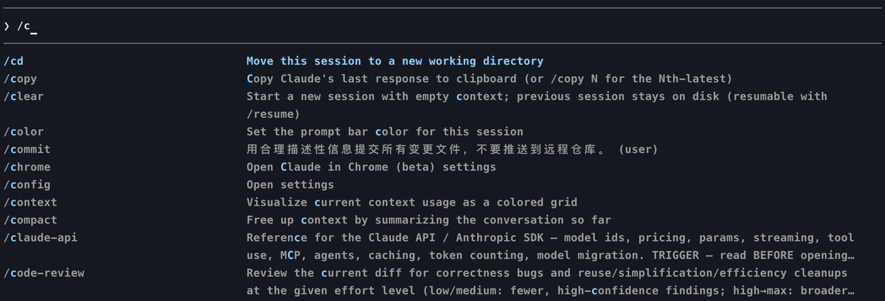

有一点要记住，命令只有放在消息开头才会被识别，命令名后面跟的文字，会被当成参数传给这个命令。

比如你发 \`/plan 修复登录的 bug\`，前面的 \`/plan\` 是命令，后面那句就是参数，Claude 会带着这个任务进入计划模式。

另外，下面表格里我沿用官方的约定：\`\` 表示必填参数，\`\[arg\]\` 表示可选参数。

> 还有一点要提前说清楚，不是每个命令对所有人都可见，具体取决于你的平台、套餐和环境。

> 比如 \`/desktop\` 只在 macOS 和 Windows 且登录了订阅账号时才出现，\`/upgrade\` 只在 Pro 和 Max 套餐才显示，看不到很正常，别慌。

最后，Claude Code 还专门标出了两类特殊命令：

- Skill（技能）：内置技能，本质是一段交给 Claude 的提示词，Claude 在判断相关时也能自动调用。

- Workflow（工作流）：内置的动态工作流，会把活儿拆给一堆子代理，丢到后台并行跑。

铺垫完了，下面正式进入主题。

# 账号与用量

这一组管账号登录、用量和套餐，钱包相关的都在这。

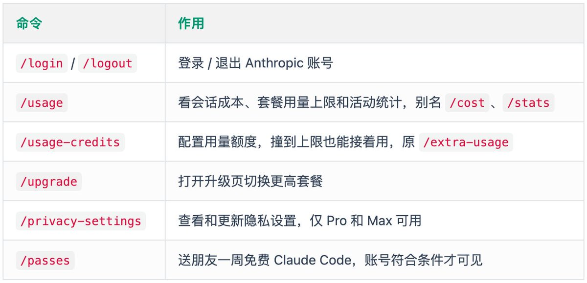

重度用户最该常看的是 \`/usage\`，它能拉出按技能、子代理、插件、MCP 服务器细分的用量，哪块在烧 Token 一目了然，省钱全靠它。

# 项目初始化

刚把 Claude Code 拉进一个新仓库时，最该干的事就是先让它「认识」这个项目，这几个命令是开荒标配。

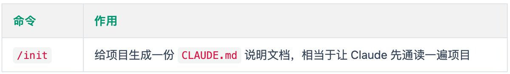

这是新项目第一条该敲的命令，它会扫一遍代码结构，生成 \`CLAUDE.md\`，后面 Claude 干活就有了上下文。

# 开发常用

进入正式开发后，这几个命令用好了能省 Token 也能提质量。

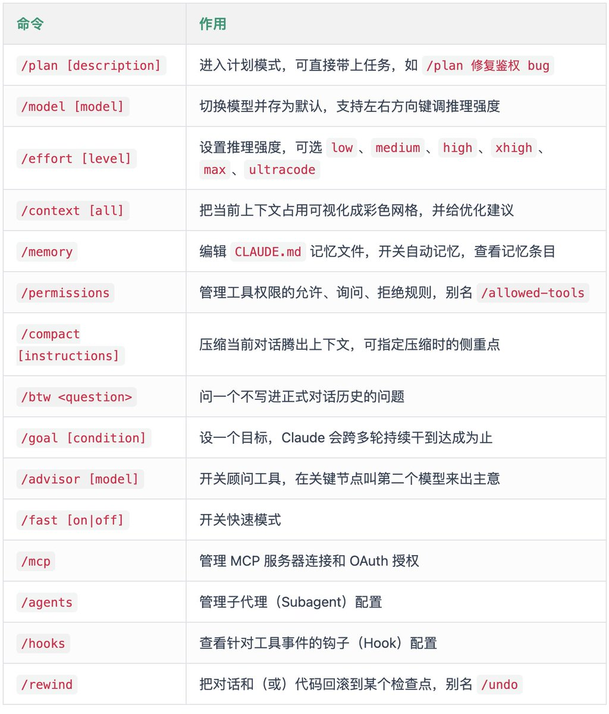

这里有几个是真正能拉开差距的：

1、\`/plan\` 是大改动前的好习惯，先让 Claude 想清楚再动手，避免它一头扎进去写一堆返工的代码。\`/model\` 和 \`/effort\` 是一对，简单任务用低强度省钱，硬骨头才上 \`max\`。其中 \`ultracode\` 比较特别，它把 \`xhigh\` 的推理和工作流自动编排捆在一起，专治复杂任务。

2、聊到一半上下文快满了怎么办？先用 \`/context\` 看看上下文都被谁占了，再用 \`/compact\` 压一压。如果只是想插一句不相干的问题，又不想污染主线对话，用 \`/btw\`，问完即走，干净利落。\`/agents\` 创建子代理，也可以减少上下文占用。

3、\`/permissions\` 是我个人很看重的一个，权限管好了，Claude 才敢放手让它干活，又不至于乱删乱改。配合后面要讲的 \`/fewer-permission-prompts\`，能少弹一大堆确认框。

4、\`/goal\` 是我觉得很有想象力的一个，你给它定个完成条件，它会自己跨轮次一直干到目标达成，特别适合「跑通这个测试为止」这种任务。

# 会话管理

一个项目干久了会攒一堆会话，怎么开新的、怎么找回旧的、怎么导出，看下面的命令。

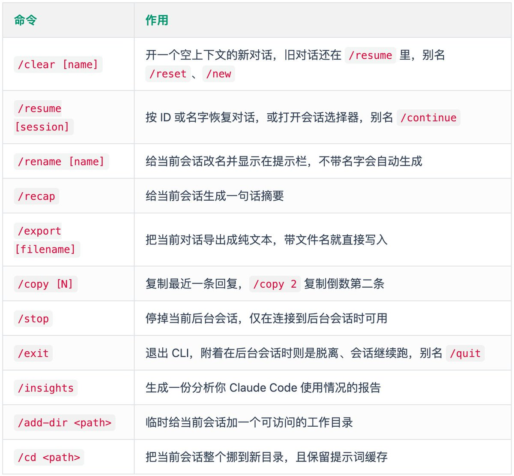

最常用的是 \`/clear\` 和 \`/resume\` 这一对。开新任务时用 \`/clear\`，它清空上下文但保留项目记忆，旧对话不会丢，随时能 \`/resume\` 找回。

注意它和 \`/compact\` 的区别：

- \`/clear\` 是另起炉灶；

- \`/compact\` 是在同一个对话里腾地方，想保留上下文就用后者。

另外，\`/cd\` 是个比较新的命令，它和 \`/add-dir\` 容易搞混：\`/add-dir\` 是额外授权一个目录、会话还在原地，\`/cd\` 是把整个会话搬过去。

# 并行任务

Claude Code 现在最猛的就是并行能力，一个人能当一支队伍用，这几个命令是核心。

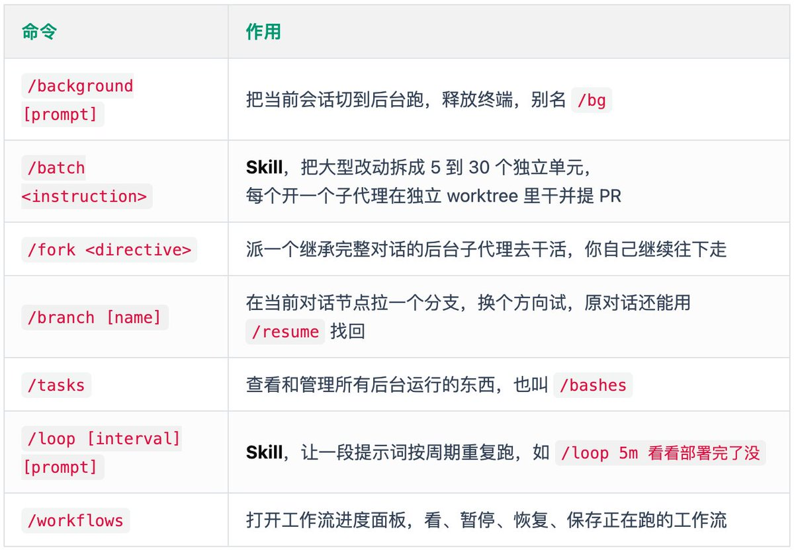

这一组的精髓是让 Claude 同时干好几摊活：

1、\`/batch\` 是大杀器，比如你要把 \`src/\` 整个目录从 Solid 迁移到 React，一条 \`/batch migrate src/ from Solid to React\` 下去，它先研究代码、拆成几十个独立单元、给你一份计划，你点头后就每个单元开一个子代理，各自在独立的 git worktree 里改代码、跑测试、提 PR，互不打架。

2、\`/fork\` 和 \`/branch\` 这俩容易混：\`/fork\` 是派个分身去后台默默干，结果干完回传给你，你这边不打断；\`/branch\` 是拉一个新分支换方向继续。一个是「派人」，一个是「自己换条路」，场景不一样。

3、\`/loop\` 也很实用，配合一句 \`/loop 5m 检查 CI 跑完没\`，它就帮你定时盯着，省得你自己反复刷。

# 交付检查

代码写完别急着提，Claude Code 自带一整套审查和验证命令，这一步做扎实，能帮你拦下不少坑。

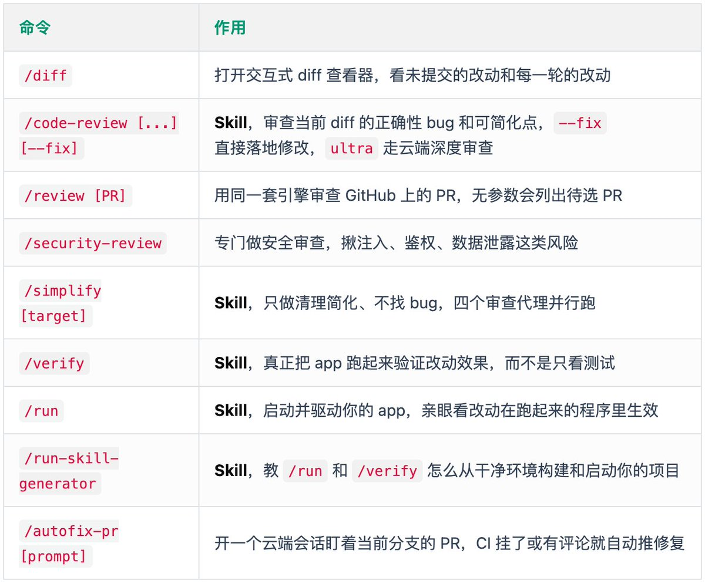

这套组合我建议养成习惯：

1、提交前先 \`/diff\` 扫一眼改了啥，再用 \`/code-review\` 让它查正确性问题，确认没问题再 \`--fix\` 落地。要注意 \`/code-review\` 和 \`/simplify\` 现在分工明确了：前者专门找 bug，后者只做清理简化、不找 bug，别用错。

2、\`/verify\` 和 \`/run\` 是 2026 比较新的能力，核心思路是「光过测试不算数，得把 app 真跑起来看效果」。第一次用前最好先跑一下 \`/run-skill-generator\`，教会它怎么从零启动你的项目，后面 \`/run\` 和 \`/verify\` 才顺。

3、\`/security-review\` 别嫌麻烦，涉及鉴权、表单、外部输入的改动，多跑一遍能省后面一堆事。

# 排查问题

工具用着用着难免出岔子，安装报错、跑着卡住、内存飙高，这几个是救命命令。

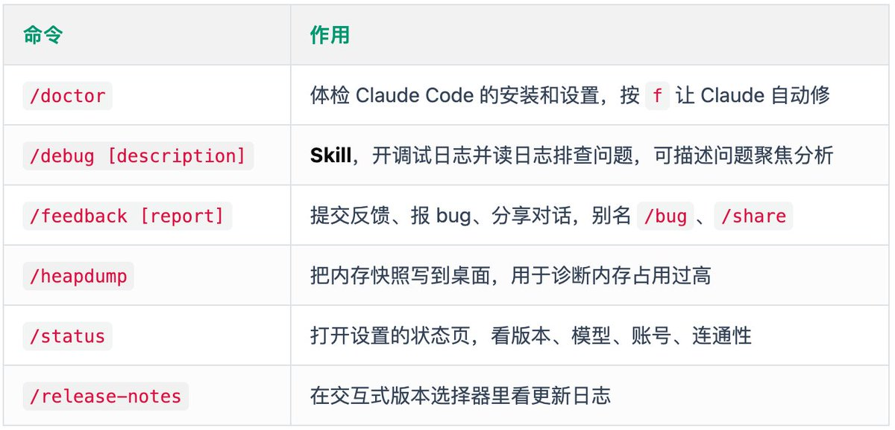

遇到莫名其妙的问题，第一步先 \`/doctor\`，它会列出一堆带状态图标的检查项，发现毛病按 \`f\` 直接让 Claude 帮你修，省心。

如果是会话跑到一半行为不对，用 \`/debug\` 开日志，最好顺手把问题描述一句，让它带着方向去看日志。

要是 Claude Code 吃内存吃得离谱，\`/heapdump\` 能导出快照辅助定位。

实在搞不定，\`/feedback\` 一键把对话上下文打包报给官方。

# 多端编程

2026 的 Claude Code 早就不只是终端工具了，云端、网页、手机、桌面全打通。

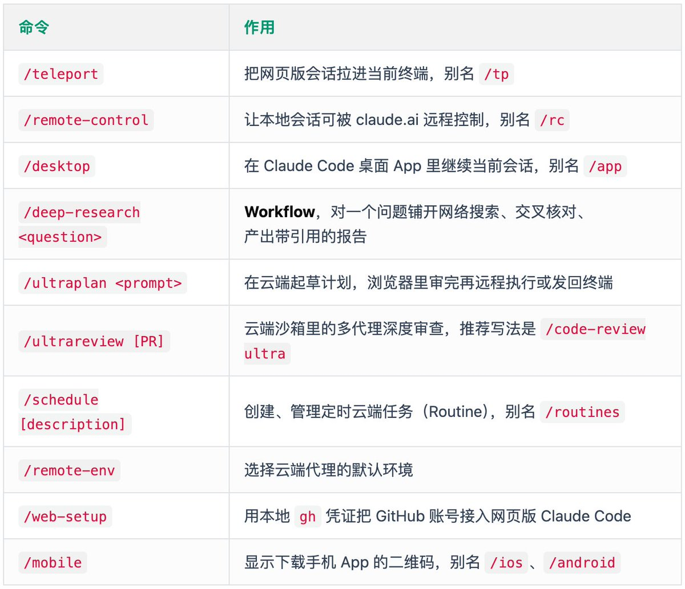

这里值得单独拎出来的是这两个：

- \`/ultraplan\` 适合特别复杂的大改动，先在云端把计划做扎实，你在浏览器里审一遍再执行。

- \`/ultrareview\` 是云端多代理深度审查，比本地的 \`/code-review\` 更狠，不过现在推荐统一用 \`/code-review ultra\` 来触发，\`/ultrareview\` 只是个别名。

\`/deep-research\` 是个 Workflow，丢给它一个问题，它会自己发散搜索、交叉核对、最后给你一份带引用来源的报告，做调研很省事。

\`/teleport\` 和 \`/remote-control\` 是一对跨设备神器，前者把网页上跑的会话拉回终端，后者反过来让你从别的设备接管本地会话，通勤路上用手机接着盯任务，体验确实丝滑。

# 外观与终端

工具用着顺不顺手，界面和快捷键也很关键，这几个命令负责调教手感。

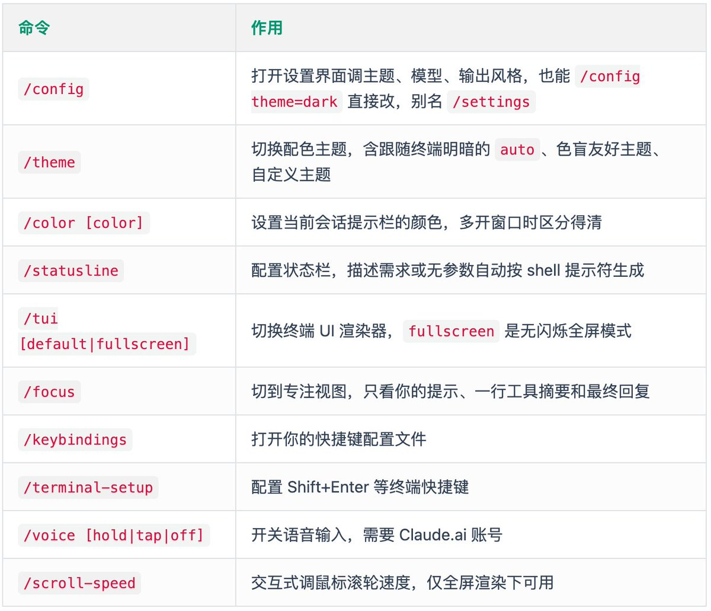

同时开好几个 Claude Code 窗口的，强烈建议用 \`/color\` 给每个会话设不同颜色，再配 \`/statusline\` 把当前分支、模型这些信息显在状态栏，一眼就知道哪个窗口在干啥，不会手忙脚乱发错地方。

# 其他命令

剩下这些虽然不天天用，但关键时刻能帮大忙，我打包列一下。

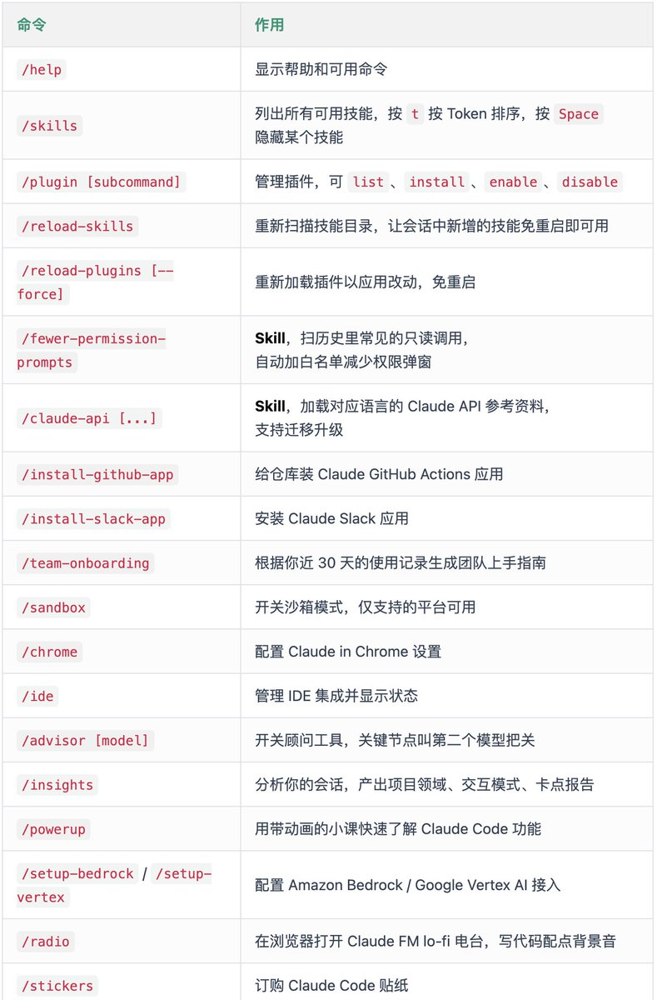

这里我特别推荐 \`/fewer-permission-prompts\`，被权限弹窗烦到的同学一定要试，它会扫你历史里那些常见的只读操作，自动整理成白名单写进项目配置，世界瞬间清净。

Java 后端的同学留意下 \`/claude-api\`，写代码引入 \`anthropic\` 这类 SDK 时它会自动激活，加载对应语言的 API 参考，少查不少文档。

另外提醒一句，老命令 \`/pr-comments\` 和 \`/vim\` 已经被移除了，看 PR 评论现在直接让 Claude 看就行，Vim 编辑模式去 \`/config\` 的 Editor mode 里切。

# 总结

90 多个命令盘下来，你大概也感觉到了，Claude Code 早就不是一个简单的终端聊天框。从初始化、开发、审查到并行、云端协作，整条研发流水线都被它塞进了一个个 \`/\` 命令里。

这么多命令，记不住很正常，其实也没必要全背。

我的建议是先把高频那批吃透就行，剩下的命令，等真碰到对应场景再来翻这篇就好了。

说到底，会不会把工具用到极致，才是拉开人和人差距的地方。

未完待续，我会继续分享更多 Claude Code、AI 实战干货。

### 🖼️ Attached Media

## 💬 Replies

### 1 @xmglab (小码哥) (Author)

*Tue Jul 14 03:07:09 +0000 2026*

不得不说 X 的编辑器是真难用啊，虽然有 Skills 辅助，但不稳定，还是搞了半天。

### 2 @guangtoutianbo1 (Stokis Tian)

*Tue Jul 14 16:41:03 +0000 2026*

@xmgplus 好文给你点赞

### 3 @xmglab (小码哥) (Author)

*Wed Jul 15 01:07:49 +0000 2026*

@guangtoutianbo1 感谢

