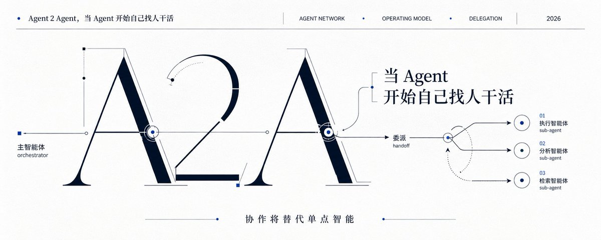

# 📰 A2A：当 Agent 开始自己找人干活

假设一家公司接入了一个新的 AI Agent。它读了全部内部知识库，翻完了过去三年的会议纪要，每一份制度文件都存进了它的上下文窗口。

但它依然什么都做不了。

它不知道今天该找谁。不知道哪件事最急。不知道这个季度的目标改了没有。不知道项目卡在哪个环节。不知道自己有没有权限花那笔预算。

它像一个读完了员工手册、却没被拉进任何项目群的新员工。坐在工位上，等一个人来告诉它：现在，做什么。

知识不等于情境。 Agent 要进入组织，光会调用工具还不够。它得先像新员工一样，看懂自己所处的位置。

# 今天的 Agent，背后都站着一个人

你现在能看到的所有"Agent 干活"的故事，背后都有同一个模式。

一个人同时指挥多个 Agent。把任务拆开，分下去，检查结果，再发下一步指令。这个人承担了至少四件事：目标拆解、上下文补充、任务路由、最终验收。Agent 只是执行链条里的一个调用点。即使一个组织部署了上百个 Agent，只要每次行动都在等人下命令，它们就不是同事，是工具。

过去，多 Agent 协作一直被锁在同一个框架或同一家平台里。A 框架的 Agent 不认识 B 平台的 Agent，因为它们没有统一的"工作语言"。A2A 协议真正突破的，不是让 Agent 变聪明，是让不同出身、不同厂商、不同框架的 Agent 能够互相发现、委托任务和交付成果。 它把"跨系统协作"这件事标准化了。

A2A 已经发布 v1.0，100 多家企业加入，Linux 基金会接管治理。技术上说，一个 Agent 已经可以找到另一个 Agent 并让它干活了。

但通信协议解决不了组织问题。

真正的问题不在"Agent 会不会说话"。在：拿掉这个人类接口，Agent 凭什么知道自己该干什么？

# 新员工能工作，不是因为他读了员工手册

一个新人进公司，真正上手通常要三到六个月。

这三到六个月不是在读书。是在建立一套情境感知。

他逐渐搞清楚自己的角色：职责边界在哪里，什么归他管、什么不归他管。搞清楚组织对他的目标是什么，哪些事优先级最高、哪些事可以放一放。搞清楚规则：什么能做，什么不能碰，什么需要审批。搞清楚手里有什么资源：数据、工具、预算、可以找的人。搞清楚关系网：向谁汇报，找谁协作，出了问题找谁升级。最后，搞清楚状态：项目现在走到哪了，谁正在处理，哪里卡住了。

角色、目标、规则、资源、关系、状态。六件事，没有一件能靠读知识库获得。

知识库保存的是相对静态的东西：制度、文档、历史经验。但组织每天运行依赖的大量信息是动态的。目标会调整，项目会阻塞，负责人会变更，预算会消耗，权限会被收回。一个只读过知识库的 Agent，就像一个背熟了员工手册但没进过项目群的新人。它知道公司过去写过什么，却不知道今天谁在等它、哪件事最急、什么动作需要审批。

一位 AI 转型观察者提出了这个视角：Agent 要真正进入组织，缺的不是更大的模型，是这六项情境信息。 而恰恰这些信息，关系、目标、实时项目状态，目前几乎没有企业向 Agent 开放。企业做 AI 转型，花最多力气沉淀的是会议纪要和知识库。但知识库告诉你过去发生了什么，不告诉你此刻应该做什么。

# 三个协议，各自补上哪一块

搞清楚六要素之后，Skills、MCP、A2A 各自的位置就清楚了。

Agent Skills 保存的是岗位经验。这件事按什么步骤做，验收标准是什么，有哪些模板和检查清单。它回答"怎么做"。

MCP 提供的是工具和数据入口。数据库、文件系统、业务软件、API，全部通过标准接口接入。它让 Agent 有了手和脚。回答"用什么做"。

A2A 解决的是协作。通过 Agent Card 发现同事，通过 Task 委托工作，通过 Artifact 交付成果。它让 Agent 有了嘴和耳朵。回答"找谁做"。

三者拼在一起：Skills 是经验，MCP 是手脚，A2A 是组织里的协作语言。 这已经是一个合格员工的能力配置。

但注意，它们仍然只是能力。三者没有天然回答一个关键问题：这个员工此刻应该做什么。

这里要看清 A2A 到底解决了什么、没解决什么。

A2A 的核心是 Agent Card、Task 和 Artifact 三个对象。Agent Card 让一个 Agent 在不了解对方内部模型、记忆和工具的情况下，读取它公布的能力说明，判断它是否适合接这个活。Task 是一个有完整生命周期的工单，处理中、等待输入、完成、失败、取消，这意味着 A2A 生来就支持长任务，一件活可以跑几小时甚至几天，中间状态可追踪、可恢复。Artifact 是最终的交付物。

这套设计让 A2A 区别于简单的 API 调用。API 是你知道我有什么接口、直接调用我。A2A 是你只知道我能做什么、把任务和上下文交给我、我自己规划步骤、你只看结果。A2A 买的是"你来搞定"，不是"你帮我执行第 3 步"。

但这恰恰也是它的边界。Agent Card 是自我声明。我怎么知道你说的是真的？Task 能追踪状态，但不能判断交付质量。Artifact 能交付文件，但不能自动验收。这些问题不在 A2A 的范围内，它们属于另一层：信任和治理。

组织上下文，角色、目标、规则、资源、关系、状态，才是决定 Agent 什么时候使用这些能力的那个东西。没有这一层，Skills、MCP、A2A 就是一把好工具，握在一个不知道自己该修什么的人手里。

顺便澄清一个容易混淆的点：A2A 的 Agent Card 里也有一个叫 AgentSkill 的字段，用来对外说明"我会做什么"。它是名片。Skills 规范里的 SKILL.md 是内部操作手册。同名，不是一回事。外部调用方只需要知道你能做什么，不需要知道你内部怎么做。

# 传话的人，最先被跳过

一旦 Agent 能读取组织上下文，并通过 A2A 直接找到正确的 Agent 同事，人类中间接口就会被大幅压缩。两层含义。

市场里：Agent 可以直接查询、询价、比较和委托专业 Agent。过去需要人工收集信息、转发需求、比价、传话的环节，Agent 自己干了。依赖公开信息整理、需求转述、人工转单、简单比价和催进度的工作，会最先被压缩。

更深一层的变化，是"情境翻译"这个职能的转移。

中间商的真正生意不是信息差，是情境翻译。

携程就是一个标本。它的价值不是把航班和酒店列在一起。这件事任何比价网站都能做。它的价值是把用户一句模糊的人话，翻译成机器能执行的指令。用户说"我想带老人孩子去三亚过个周末，预算一万"，航司听不懂这句话，酒店也听不懂。是携程把这句模糊的人话，翻译成了舱位代码和房型 SKU，再翻译成订单和确认短信。这才是它收佣金的本钱。不是信息聚合，是情境翻译。

当用户的 Agent 完整掌握了"我是谁、要去哪、预算多少、带谁去"的情境，它自己就能做这种翻译，直接和航司 Agent、酒店 Agent 谈，不需要携程坐在中间翻译。

不是携程会消失。是它的利润率会从"翻译费"塌缩成"API 调用费"。前者按脑力定价，后者按流量定价。 这是两种完全不同的生意。

组织里：Agent 可以直接读取项目状态、寻找负责人、传递任务、同步结果。那些日常工作内容是"确认这个找谁""那个进度怎样""你的需求和他们对上了吗"的角色，正在失去存在理由。他们不创造结果，他们只是传递信息。

但这里必须划一条线。A2A 解决的是通信和任务协作，它不等于 Agent 已经能自主做生意。回到上一节讲到的问题：Agent Card 是自我声明，没有内置验证机制。一个 Agent 说"我会审核发票"，谁来验证它真的会？它的准确率是多少？上次出错是什么时候？

这些问题不会因为 Agent 之间能说话了就自动消失。交易还需要身份验证、信用评估、支付授权、合同、审计和争议处理。A2A 是同事之间的协作语言，不是公司之间的自动收银机。 而这些缺失的环节，恰恰是新的价值洼地。

# 管理不会消失，它会换成另一副面孔

传话少了，管理不会少。

当多个 Agent 的目标互相冲突，谁决定优先级？Agent Card 是自我声明，谁验证它说的是真的？Agent 可以发起付款，谁定义预算和授权边界？多个 Agent 串联出错，谁验收、谁审计、谁承担责任？规则遇到例外，谁有权修改？

这些问题一个都没消失。它们只是从"亲自做路由器"变成了"设计路由规则"。 管理者的核心工作不再是在 Agent 之间传话和转单，而是定义目标、设置权限边界、处理例外情况、解决目标冲突、承担最终责任。

市场里也一样。旧的撮合型中间商会变薄，新的信任层会长出来：身份认证、能力评测、信用评级、支付担保、争议仲裁。互联网曾经让买卖双方可以直接连接，同时又长出了搜索、平台、支付和评价体系。Agent 网络很可能重复这条路径。旧的人工撮合层变薄，机器可读的信任层变厚。

所以更稳的判断不是"中间商消失"，而是中间商的价值从"我知道你不知道的"变成"我能验证他说的可信度"。靠信息差和人工转述生存的中间商会先被压缩；能提供身份、信用、验收、支付、审计和责任承担的中间层，会重新定价。

# MiniPC：一名 AI 员工的私有办公室

在这个图景里，MiniPC 不是一个"跑大模型的便宜盒子"。

它更适合被理解为一间 AI 员工的私有办公室。 保存私有数据、岗位 Skills、协作关系图、项目状态和长期记忆。通过 MCP 使用本地语音、图片、文档和业务工具。作为本地主 Agent，通过 A2A 寻找外部专业 Agent 并委托任务。对外只开放经过授权的能力和最少的必要数据。

但把端口暴露到公网，不等于拥有了一个可以做生意的 Agent。要真正对外提供服务，至少还需要认证、限流、日志、成本上限、任务隔离和人工确认。

硬件参数决定它能同时跑多少东西。但商业价值取决于它能否持续完成一类可验收的任务。 把一台 MiniPC 变成 ASP，不是买对配置就完了。是把一类重复工作固化成 Agent Skill，把数据和工具接成 MCP，把复杂服务包装成 A2A Agent，公布可验证的 Agent Card，补齐身份、计费和日志，然后用真实订单验证成功率。这条路比"买台机器挂平台被动赚钱"慢得多，但更接近真正能长期存在的 Agent 服务生意。

一台机器上跑着完整的组织上下文。它知道自己是谁、为谁工作、能花多少钱、遇到问题找谁。这才是 MiniPC 从"本地算力"变成"Agent 节点"的关键一步。

# 未来的组织，不会只招聘人

回到开头那个读完员工手册却无法工作的 Agent。

读完所有文档，只是入职准备。组织还要告诉它角色、目标和边界，让它看见资源、关系与实时状态，并允许它在权限内直接寻找同事。

A2A 让 Agent 之间直接协作成为常态，也会压缩人类充当信息路由器的空间。但组织仍然需要人来决定：为什么做，做到什么程度，出了问题谁负责。这两件事不矛盾。

矛盾的是，一边喊着 AI 转型，一边只给 Agent 扔了一堆文档，然后说：你自己看着办吧。

未来拉开差距的，可能不是谁有更好的模型，是谁先把自己的组织改造成 Agent 能够看懂、能够参与的结构。

这件事的起点不是买更多 GPU。是把你的团队里，谁负责什么、目标是什么、能调用什么资源、项目走到哪一步了，这些信息从"大家都知道"变成"系统能读到"。一句话：让组织从人治变成 Agent 可读。

这件事不需要等 A2A 大规模爆发之后再做，现在就可以开始。

### 🖼️ Attached Media

## 💬 Replies

### 1 @davinci_seven (达芬七Seven)

*Sun Jul 19 12:37:02 +0000 2026*

@ma\_zhenyuan 太牛逼了，都玩上A2A了

### 2 @ma_zhenyuan (小麦搞钱计划) (Author)

*Sun Jul 19 12:39:50 +0000 2026*

@davinci\_seven 哈哈哈，必须要搞起来

### 3 @ai_Goge (Kelvin)

*Sun Jul 19 12:46:30 +0000 2026*

@ma\_zhenyuan 确实未来拉开差距的，可能不是谁有更好的模型，是谁先把自己的组织改造成 Agent 能够看懂、能够参与的结构。这篇文章诠释了一切

### 4 @ma_zhenyuan (小麦搞钱计划) (Author)

*Sun Jul 19 13:01:31 +0000 2026*

@ai\_Goge 给 AI 看懂～

### 5 @AI_jacksaku (阿川 | AI thinking)

*Sun Jul 19 12:26:24 +0000 2026*

@ma\_zhenyuan 完全同意“知识不等于情境”这个核心观点。文章里举的新员工例子特别到位：读完员工手册却没被拉进项目群，就只能干坐着。很多公司现在搞AI转型，花大价钱灌知识库，却不开放实时项目状态和关系网，Agent 当然还是工具人。

### 6 @Stanleysobest (Stanley)

*Sun Jul 19 13:08:13 +0000 2026*

@ma\_zhenyuan Agent管理Agent

### 7 @isnail (蜗牛King 👑)

*Sun Jul 19 13:00:22 +0000 2026*

@ma\_zhenyuan 未来人与人的链接，能搞定人的人才是稀缺的资源

### 8 @FinnTsai88 (Florian.C)

*Mon Jul 20 02:11:29 +0000 2026*

@ma\_zhenyuan Agent读完手册却不知道今天该干啥、找谁，就跟新员工没拉进项目群一样。

### 9 @KyrieCheungYep (Kyrie)

*Sun Jul 19 13:07:36 +0000 2026*

@ma\_zhenyuan 我以为是阿美莉卡to阿美莉卡

### 10 @HytidelLegend (Hytidel聊商业（文章更多干货）)

*Sun Jul 19 13:10:56 +0000 2026*

@ma\_zhenyuan AI Agent狂吞公司知识库，像背熟员工手册的新人，结果坐工位发呆：谁是老板？钱敢花吗？今天干啥？😂 光有脑子没“八卦群”，它还是工具人！A2A再牛，也得先拉进项目群啊！

### 11 @yunbiyun (云比云)

*Sun Jul 19 12:28:03 +0000 2026*

很多人以为，只要把公司的知识库、制度文件和会议纪要都交给 Agent，它就能像员工一样开始工作。

但现实是，它可能什么都知道，却还是不知道眼下该做什么。它不知道谁负责这个项目，不知道哪件事最着急，也不知道自己有没有权限花钱。

这就像一个刚入职的新人。员工手册看完了，历史资料也读完了，但没有人告诉 TA 当前目标是什么、项目卡在哪里、遇到问题该找谁，TA 依然很难真正干活。

过去所谓的多 Agent 协作，背后通常还有一个人在不停地拆任务、补充背景、分配工作和检查结果。Agent 看起来很忙，但本质上还是等人下命令的工具。

A2A 改变的是这件事。它让不同平台、不同厂商开发的 Agent，可以互相发现、互相委托任务，并把结果交回来。

一个 Agent 不需要了解另一个 Agent 内部用了什么模型、接了什么工具，只需要知道对方会做什么，然后把任务和背景交过去，让对方自己完成。

不过，Agent 会找人干活，不代表它知道该找谁，也不代表它知道什么时候应该行动。

真正决定 Agent 能不能进入一家公司的，是六类信息：它是什么角色、目标是什么、哪些规则不能碰、能调用什么资源、可以和谁协作，以及项目现在进行到哪一步。

Skills 解决的是工作具体怎么做，MCP 解决的是可以使用哪些工具和数据，A2A 解决的是应该找谁一起做。三者加起来，Agent 才有了经验、手脚和沟通能力。

但要让 Agent 真正成为组织的一员，公司还得把职责、目标、权限、预算和项目状态变成系统能够读取的信息。未来企业之间的差距，可能不只是模型强不强，而是谁先把自己的组织变成 Agent 能看懂、能参与、也能承担工作的结构。

### 12 @sj66587 (三金AI搞钱实验室)

*Mon Jul 20 01:24:25 +0000 2026*

@ma\_zhenyuan 人类在意感觉，说句那啥就知道是啥意思，所以现在重要的是ai听懂什么那啥，或者把那啥变成ai能听懂，能去做的事

### 13 @ai_suxiaole (苏乐)

*Sun Jul 19 14:43:59 +0000 2026*

@ma\_zhenyuan 打开我对于 aggent 开发的认知了

### 14 @OMOisomo (O MO)

*Sun Jul 19 14:56:42 +0000 2026*

@ma\_zhenyuan 知识不等于情境，AI 缺的不是知识库，是没人告诉它"现在、立刻、找谁、干嘛"。

### 15 @LuluQinsy (Lulu Qin)

*Mon Jul 20 00:28:17 +0000 2026*

@ma\_zhenyuan a2a，有意思

