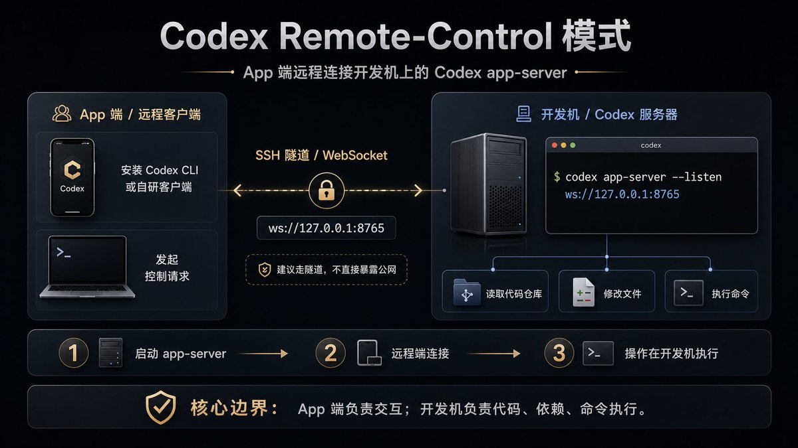
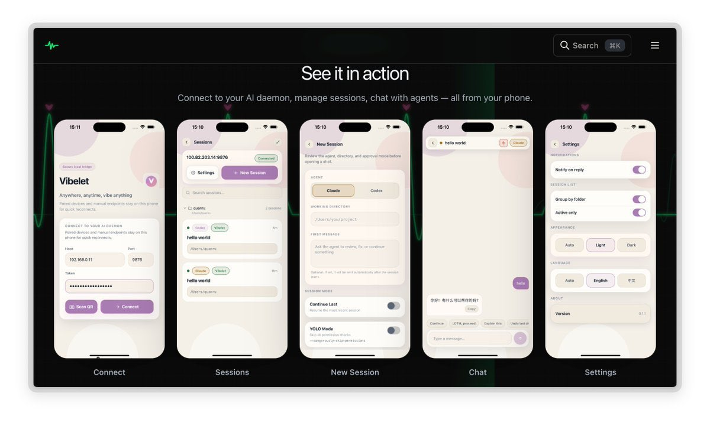

codex 新增了remote-control 命令🎉
可以实现远程控制你的codex 服务了，codex越来越好了，真香😄

ios app 应该也快推出了吧？再不来我们基于这个也可以自己搞50

## 💬 Replies

### 1 @vesmallu (Ve)

*Mon May 11 12:07:30 +0000 2026*

我补充一个实际场景。remote-control 这个功能我上个月在 dev 分支就试过了——用它远程 SSH 到一台没装 Codex 的服务器修 Bug。
测试下来延迟波动很大：本地局域网延迟 80ms 还行，走公网连阿里云直接飙到 600ms+，修一行代码回显都要等两秒。
不过最大的痛其实是session 管理——远程跑了 40 分钟的任务，断线重连后 context 全丢了，得从头再来。
你们跑远程任务的时候有做断线续传吗？

### 2 @quanruzhuoxiu (Leyang)

*Sun May 10 03:18:53 +0000 2026*

@LufzzLiz 已经搞好了！ [vibelet.icu/zh](https://vibelet.icu/zh) 

### 3 @0xHelloFreedom (0xHello)

*Sun May 10 04:31:50 +0000 2026*

@LufzzLiz Windows 怎么样才能使用这个功能，@grok

### 4 @IWVRsaOuHo2dFxo (代码余生)

*Sun May 10 04:33:47 +0000 2026*

@LufzzLiz 大家的龙虾可以卸载了

### 5 @PuCao_BUPT (Pu Cao)

*Sat May 09 15:02:49 +0000 2026*

@LufzzLiz 所以需要remote能连外网吗 @grok

### 6 @MoonInAI (MoonInAI)

*Sun May 10 04:57:30 +0000 2026*

@LufzzLiz Codex 这波越来越像“远程打工人”了，手机一句话安排任务，电脑那边自己干活，真香。

### 7 @wei_wang (Wei)

*Sun May 10 03:59:15 +0000 2026*

@LufzzLiz 应该快了 之前说过了

### 8 @dannyli789 (danny li)

*Mon May 11 08:00:44 +0000 2026*

@LufzzLiz @grok ,Windows怎麼樣才能使用這個功能

### 9 @DengDian33441 (电灯试试)

*Sun May 10 16:02:18 +0000 2026*

@LufzzLiz 只能iOS 使用吗@grok

### 10 @breakpman (李Bobby)

*Sun May 10 05:13:53 +0000 2026*

@LufzzLiz codex cli么？还是直接控制客户端啊

