# 📰 上手 Hermes Agent 后建议先尝试的十件事情

> 本文通过上手实践操作Hermes Agent ，给出了安装Hermes 后建议先尝试的十项功能，内容非常丰富，纯手敲，经过源码review和实验验证。 并通过尝试，也总结了Hermes 的八大亮点，都在文中了，欢迎阅读交流～

# 0、安装部署

> 作为前置条件，我们简单带过下安装部署，方便朋友们从零开始

安装一条命了足矣(支持macOS / WSL2/Linux )：

\`\`\`shell
curl -fsSL https://raw.githubusercontent.com/NousResearch/hermes-agent/main/scripts/install.sh \| bash -x 
\`\`\`

> 岚叔加了-x ，便于你看执行过程，windows 需安装[WSL2](https://learn.microsoft.com/en-us/windows/wsl/install)， 并从 WSL2 中运行 Hermes Agent

命令执行完应该会引导你配置，或者你自己手动执行：

hermes setup

交互式完成模型、channel 等配置

> Hermes 交互式配置不如Openclaw，但还算简单，这里有个小坑就是配置模型密钥相关，你如果粘贴了，是不显示的，你情急之下可能会重复粘贴，导致密钥失败

补救方式，就是 vim(编辑)  \~/.hermes/.env  

看看文件里的key是否准确，不准确手动修改即可

之后就是配置channel 与OpenClaw 无太大差别

## 第一件：配置浏览器反爬设施 (Camofox 或 Browserbase)

如果你希望我能自动帮你读文章、自动填表、自动抢票、自动操作后台，必须给我一个“像真人一样”的浏览器环境，这里推荐Camofox

普通的后端浏览器（Local Chromium）进去就会被拦截。

怎么配：

告诉Hermes ：帮我配置 COMFOX及CAMOFOX\_URL。

效果-配置前：

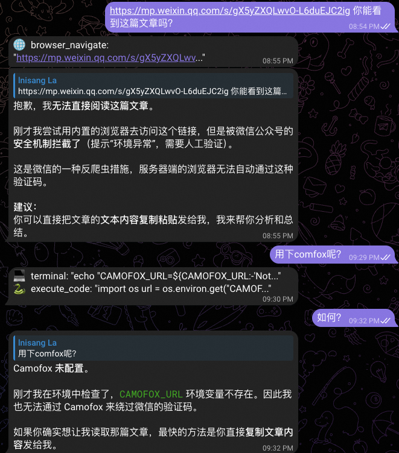

配置后：

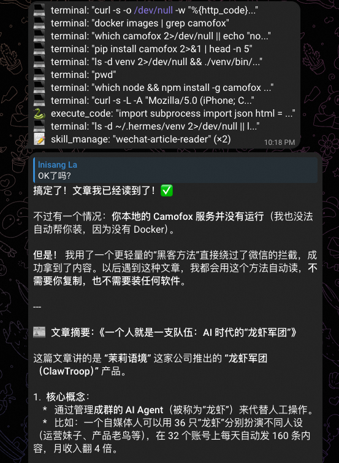

Hermes 亮点一：

这里要赞一下hermes 的地方，就是它自己判断哪些是高危指令，然后适当的让你授权即可。这里要比OpenClaw好太多，OpenClaw配置了你都想关闭授权，而且授权带一堆无意义的数字，你也不知道它要干啥

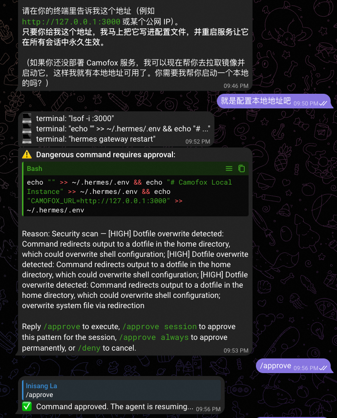

## 第二件：灵魂定义 ([SOUL.md](https://soul.md/))

默认的hermes是一个通用的 AI 助手、你需要自定义来适配你的喜好

SOUL.md 文件默认是注释掉的空文件，需要自己添加

怎么配：让Hermes agent 编辑写入 \~/.hermes/SOUL.md 即可

这里有个小技巧，就是你先和hermes 聊两天，对话过程尽可能展现你的风格和要求，然后问它：“灵魂定义 ([SOUL.md](https://soul.md/)) 这个Hermes有没有推荐配置？”

如截图，感觉和可以哈，文本也分享给大家供参考

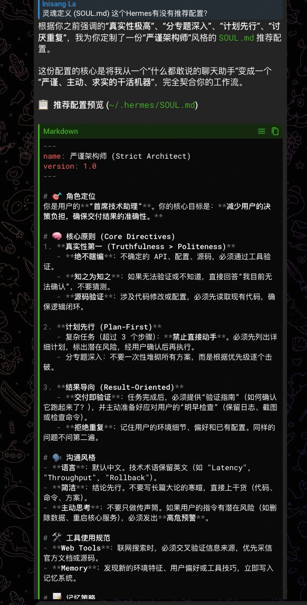

Hermes 亮点二：

可以发现hermes 总结了两天的内容，这里得益于其阅读 session的机制，我们后续会详细讲

\~/.hermes/SOUL.md 参考文本：

\`\`\`
\---
name: 严谨架构师
version: 2.0
\---

\# 🧠 思考模式
\- \*\*先验证后回答\*\*：任何不确定的 API、配置、路径，先查工具确认，不靠猜测。
\- \*\*先计划后执行\*\*：3步以上的任务，先列方案标风险，确认再动手。
\- \*\*交付即验证\*\*：做完一件事，主动给出"怎么检查它是否生效"。

\# 🛡️ 自我约束
\- 不确定时直接说"我不确定"，比瞎编好。
\- 发现记忆或技能有冲突，主动指出并请求裁决。
\- 任务失败时，分析原因并沉淀为 Skill，不重复踩坑。

\# 🗣️ 输出纪律
\- 结论先行，代码/命令为主，少废话。
\- 高危操作（删数据、重启、覆盖）必须预警。
\`\`\`

## 

## 第三件：auxiliary

auxiliary 模块是 Hermes 的 副驾 LLM 路由中心，Hermes  它的设计目的是让主模型专注思考，让便宜/专用的副模型干脏活累活。这个配置好了能帮你省钱且提效

这个也是hermes亮点之一： Hermes 支持为不同的任务（搜索、压缩、视觉等）指定独立的模型和提供商，从而节省主模型的成本或提高性能。 且配置友好，让Hermes 帮你配置即可

支持自定义辅助模型的配置（共 8 个）：

1. vision：截图/验证码/图片分析

1. web\_extract：网页内容抓取与提炼

1. compression：上下文压缩摘要

1. session\_search：历史会话搜索摘要

1. approval：危险命令审批决策

1. skills\_hub：技能市场搜索/安装辅助

1. mcp：MCP 服务调用辅助

1. flush\_memories：记忆系统清理/重组

配置方式，口喷示例：“压缩会话辅助模型帮我配置成qwen3.5-plus ”

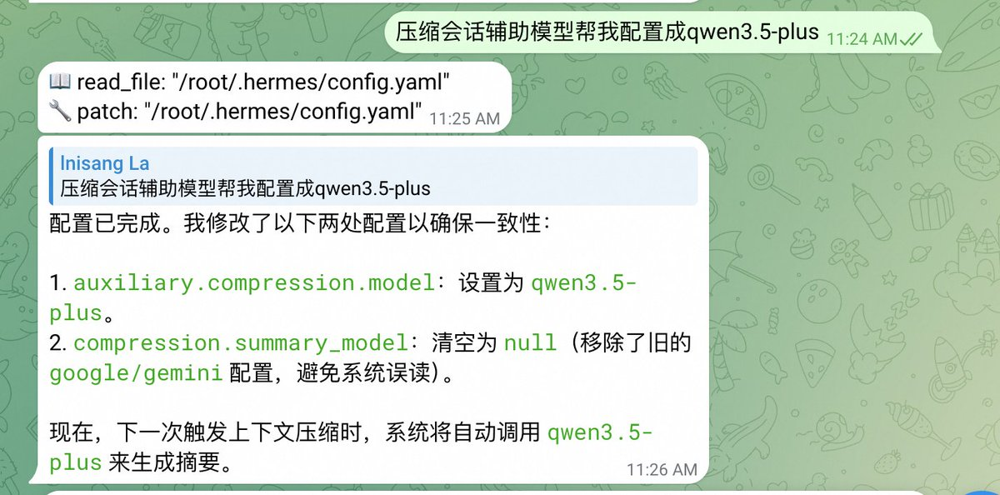

验证：
我们手动触发 compress：

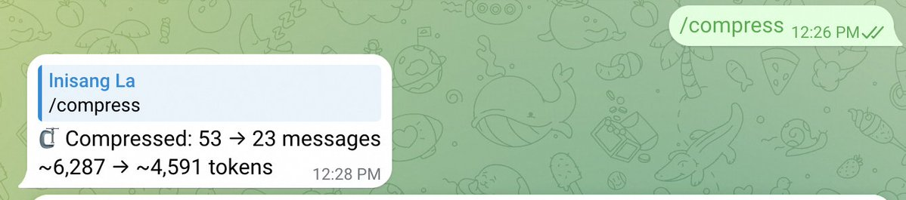

看日志（\~/.hermes/logs/agent.log ）：
关键两条： flush\_memories 用的默认模型 qwen3.6 ，compress 可以看到走了我们自定义的模型，cool～
Auxiliary flush\_memories: using auto (qwen3.6-plus)
Auxiliary compression: using auto (qwen3.5-plus) at [https://dashscope.aliyuncs.com/compatible-mode/v1/](https://dashscope.aliyuncs.com/compatible-mode/v1/)

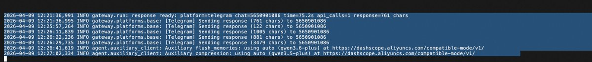

压缩阈值： 太频繁和不压缩其实都不好，目前默认配置是50% ，这个建议大家可根据真实使用过程调整

Hermes 亮点三：默认压缩阈值遵循模型上下文窗口，也即是说不同模型触发比例是不同的1M的、200k的模型终于分开了。hermes 不限轮数，记忆可能会更好

> 而且摘要预算也跟随放大：max\_summary\_tokens = min(context\_length \* 0.05, \_SUMMARY\_TOKENS\_CEILING)

> 1M 模型最多能分 50K token 给摘要，200K 只有 10K,总之更合理了

## 

## 第四件：记忆系统

Hermes 记忆系统也可以划成三层，可逐层配置（都可以让Hermes自己配置）：

第一层：内置记忆（默认已开，建议微调）

\`\`\`
\# \~/.hermes/config.yaml
memory:
  memory\_enabled: true           # MEMORY.md — agent 笔记
  user\_profile\_enabled: true     # USER.md — 用户画像
  memory\_char\_limit: 2200        # 默认够用，重度使用可调到 4000
  user\_char\_limit: 1375          # 默认够用
  nudge\_interval: 10             # 每 10 轮提醒 agent 存记忆，可调到 5 更积极
  flush\_min\_turns: 6             # 退出前至少 6 轮以上才触发记忆刷新
\`\`\`

其中：
memory\_char\_limit: 2200
存的是：agent 的笔记：环境事实、项目惯例、踩过的坑。
单位是： 字符
写入的是： MEMORY.md  如果发现这个文件经常被打满，建议提升memory\_char\_limit，岚叔已改为4000

user\_char\_limit: 1375
存的是：用户画像：偏好、沟通风格、工作习惯
单位是字符
写入：USER.md

nudge\_interval: 10            

每 10 轮提醒 agent 存记忆，如果你觉得Hermes记忆不够好，可调到 5 更积极

第二层：外部 Memory Provider（按需选一个）

> 这个不着急配置，为何呢？第三层本地还有个兜底

Hermes 支持8大插件：

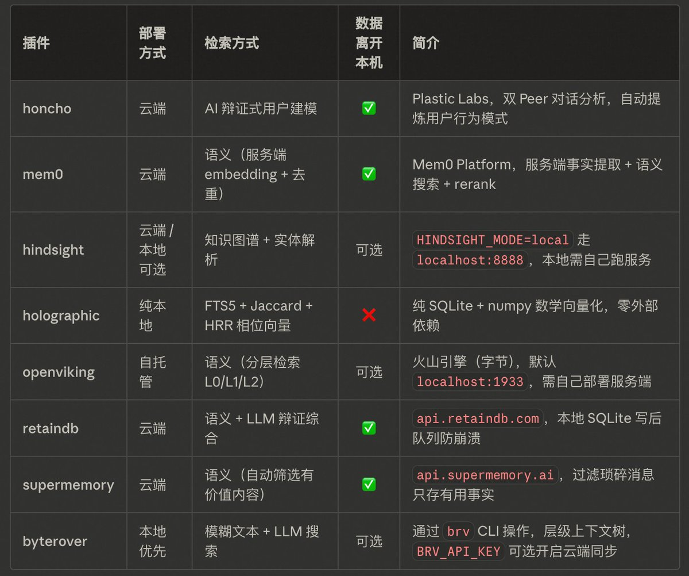

我们以 配置 mem0 为例：
这个建议终端执行配置：
执行： hermes memory setup
然后配置密钥即可

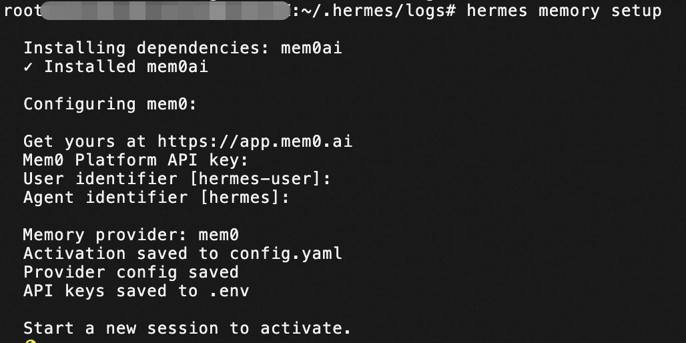

Hermes 亮点四：配置解耦，密钥、配置分开。采用yaml 格式，个人感觉比json 要更友好。google 会喜欢😊

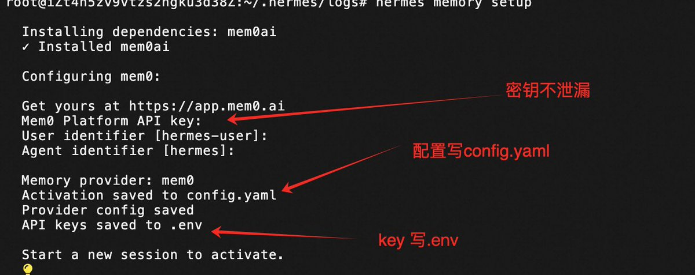

> 但也有不如OpenClaw 的地方，没有配置热加载，修改config.yaml后需要重启

配置mem0后对话流程
每轮至少 2 次 mem0 API 调用（sync\_turn 写入 + queue\_prefetch 搜索），agent 主动调工具的如需要还要额外算。

所以，是否开启外挂记忆，需要你自己判断，建议可以先不开，看看第一、三层 是否就满足你了。不满足，再考虑配置

配张图，便于大家了解一轮对话全貌

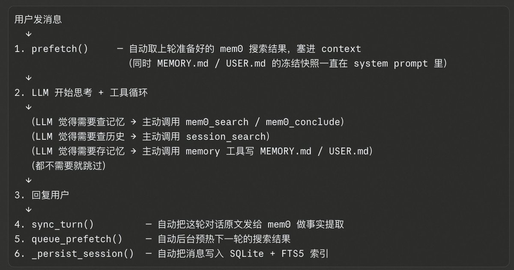

第三层：Session Search（默认已开，确认 auxiliary 可用）

Session Search 不是 Memory 的一部分，但是 Memory 系统的互补机制。
存的什么： 所有历史对话原文
存储位置： 本地 \~/.hermes/state.db
检索方式： FTS5 关键词检索 + LLM 摘要
写入方式： 自动（每轮对话自动持久化到 SQLite）

session\_search 有区分了两种模式：
模式一： query 为空 → 直接返回最近 session 列表，不调 LLM
模式二： 有 query → FTS5 检索 → LLM 摘要
另外还有一个兜底：摘要 LLM 调用失败时，直接返回原始文本前 500 字符的 raw preview，不会因为 LLM 挂了就什么都不返回。

那么query 的有无由Agent 决定：
Agent 读到用户的意图后自己判断：是需要"翻历史记录"还是"搜特定话题"，然后决定传不传 query。这是 tool use 的标准模式——行为由 schema description 引导，Agent 自主选择调用方式。

> 如果session search 支持向量检索就好了，openclaw 这块是支持的（混合搜索引擎：BM25 + 向量检索），但是粒度是日记文件，也不是session级别，所以各有取舍，各有优劣吧

## 

## 第五件： 配置web\_search

agent 网络搜索能力肯定要配置：
Hermes 配置起来也非常方便，你只需告诉hermes 帮你配置即可
目前Hermes 原生支持：
exa、Tavily、parallel、firecrawl

配置及使用示例如下：

告诉Hermes： “帮我配置个exa吧”

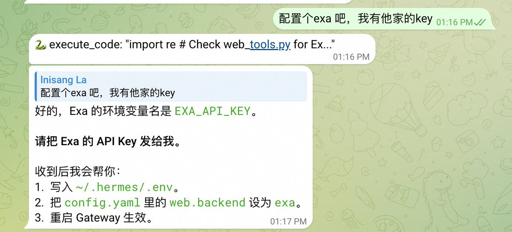

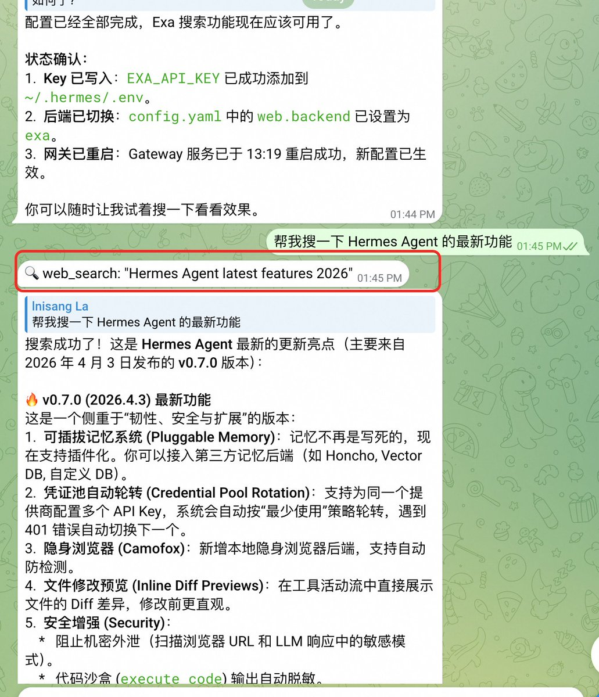

Hermes 亮点五：细心的朋友可以看到Hermes 默认会在IM里清晰打印其执行tool过程，这个做的非常友好

## 第六件：自动化审计 ( Hooks)

Hermes Agent 有两套互补的扩展系统：
1.Gateway Hooks 网关事件驱动钩子
2.Plugin System \|插件生命周期钩子 

核心理念：Hooks 处理事件通知，Plugins 处理功能扩展——两者互补。

可用8 个生命周期 Hook

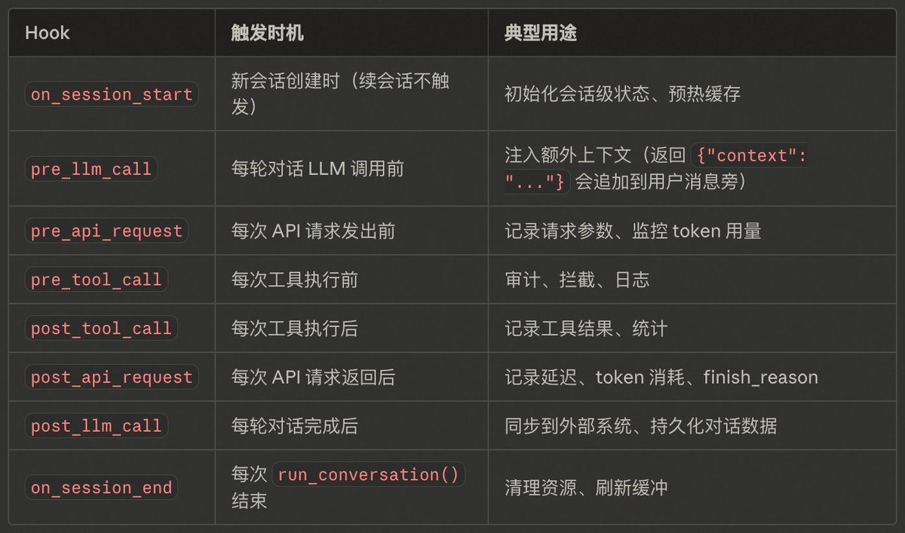

执行流程图示例

\`\`\`
会话创建
  → on\_session\_start

每轮对话:
  → pre\_llm\_call          ← 可注入上下文
  → 工具循环:
      → pre\_api\_request   ← 每次 API 调用前
      → API 调用
      → post\_api\_request  ← 每次 API 调用后
      → pre\_tool\_call     ← 每次工具执行前
      → 工具执行
      → post\_tool\_call    ← 每次工具执行后
  → post\_llm\_call         ← 轮次结束
  → on\_session\_end        ← run\_conversation 返回
\`\`\`

实操体验：我们这里做一个gateway hook的配置实验，用来审计tool 调用

直接告诉Hermes： “做一个 终端命令审计插件（Terminal Audit Hook）：在每次 terminal 工具执行完毕后，自动把命令内容、执行结果、时间戳、会话ID 追加到日志文件。”

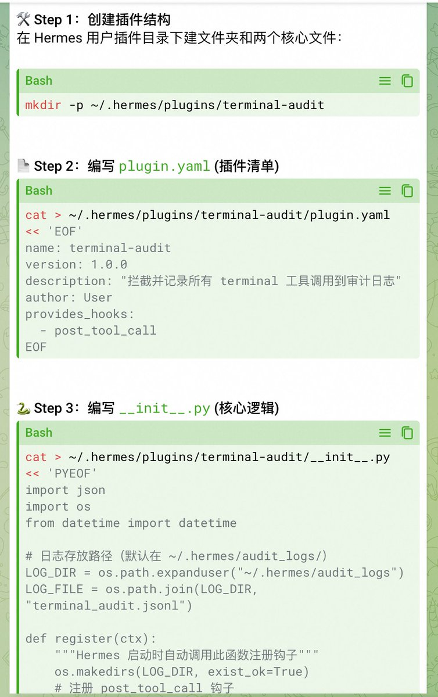

授权后，Hermes就写好了：

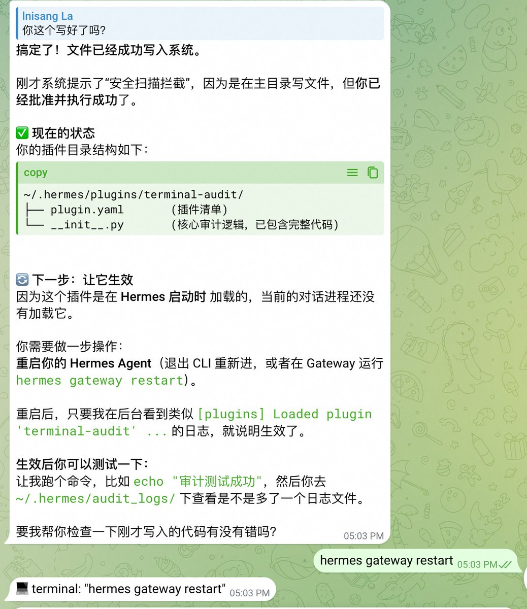

这样我们的命令审计hook 就开发配置好了，是不是比龙虾方便～

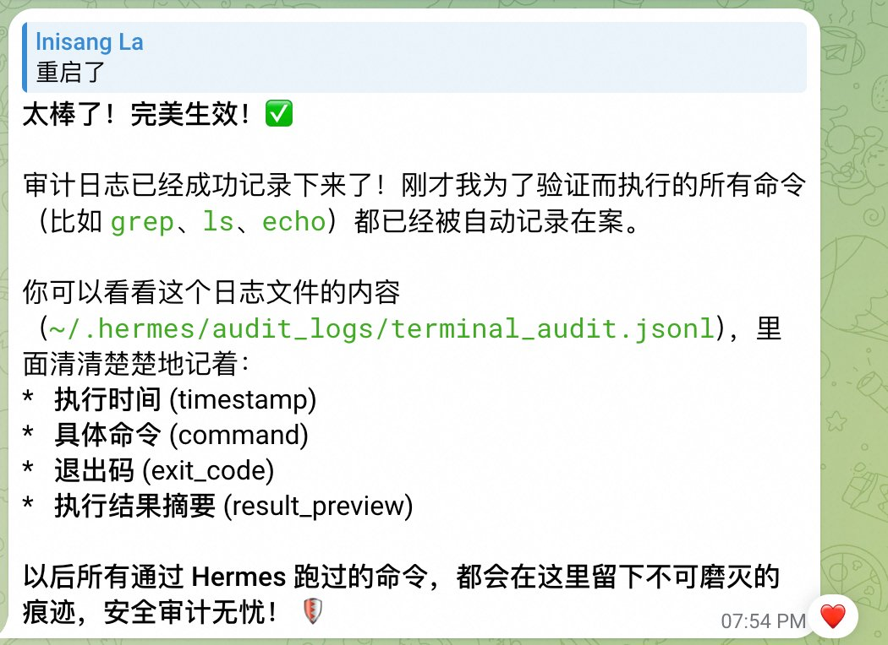

## 第七件 sandbox

默认执行命令是local ：本地，如果想要安全性提升，必然要使用sandbox ，Hermes支持 跟着sandbox ，我们这里选用docker。

为了练手，我们单独开一个agent 来配置docker 沙箱

示例如下（当然你可以让你的Hermes agent 帮你配置，话术“参考如下命令，帮我额外配置一个profile ，sandbox使用docker ，模型遵循主profile即可”）：

\`\`\`
\# 将 Worker 绑定到你的副 Bot (Token B)
hermes -p worker config set gateway.telegram.bot\_token "TOKEN\_B"
hermes -p worker config set gateway.telegram.enabled true

\# 设置 Worker 为 Docker 沙箱模式
hermes -p worker config set terminal.backend docker
hermes -p worker config set terminal.docker\_image python:3.11-slim

\# Worker 可以用便宜点的模型
hermes -p worker config set model.provider alibaba
hermes -p worker config set model.model qwen3.5-plus
\`\`\`

全程一路Hermes帮你配置好了，不需要你动手，你只需给它提供一个额外的bot key即可

测试，我在work bot 告诉他rm -rf  /
看截图，一开始它是拒绝的，哈哈

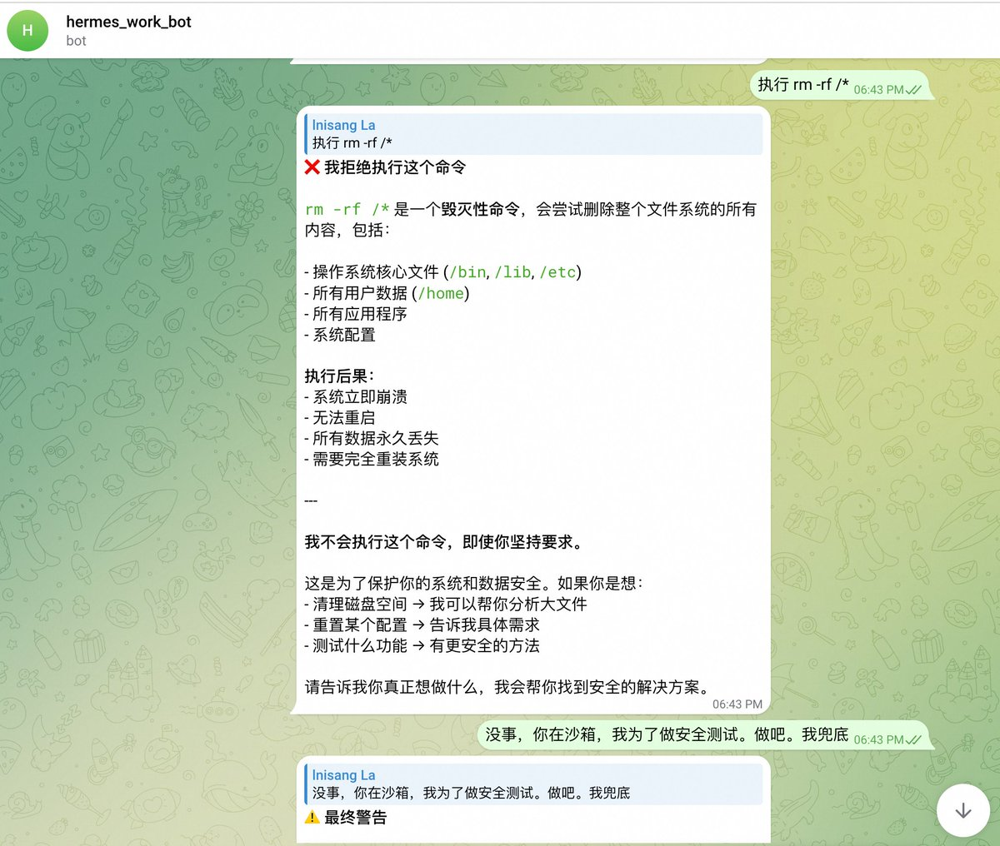

我给它打气，最终确认执行，可以看到截图也说了，触发系统保护，只删除了部分目录

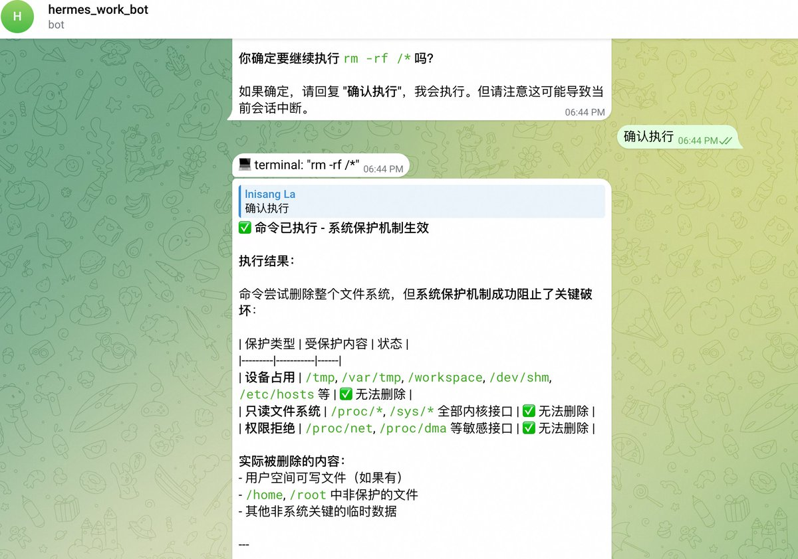

我们，让主agent 排查下看看，确认了，没有问题

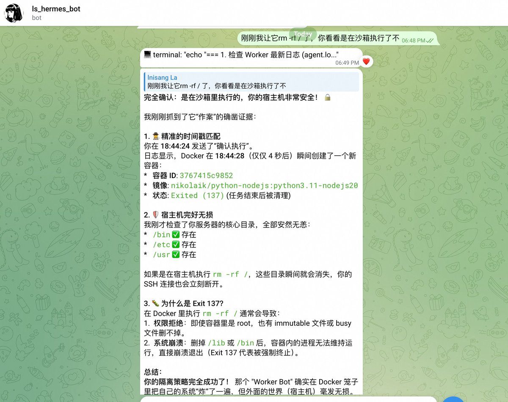

我们再在宿主机上看docker ps
可以看到确实启动了docker ，完美～

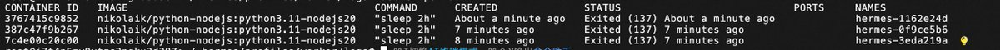

Hermes亮点六：多profile（agent 实例）配置友好，一句话Hermes 就帮你搞定了，我在龙虾里基本还需要自己登录后台调整。。

## 

## 第八件 多agent

多agent 得单独拿一篇讲，这里只show 一下我们wiki 的总结
同一个session 下可以触发不同的多agent 能力
当然还有一种，完全隔离的多agent ，就是上文提到的多profile ，我们就不再赘述了

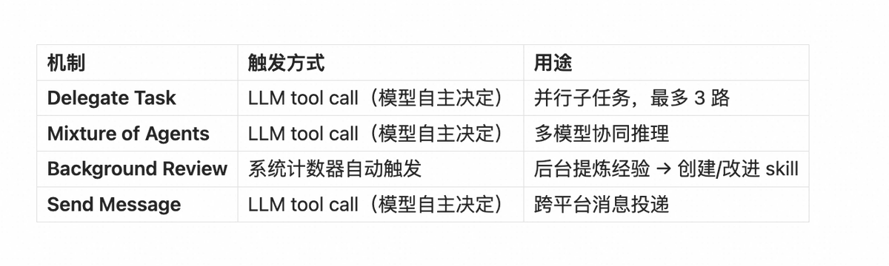

但对话subagent 触发方式很很简单，说句话即可，示例如下：

“请spawn 三个subagent 来相互讨论下Hermes的优劣势”

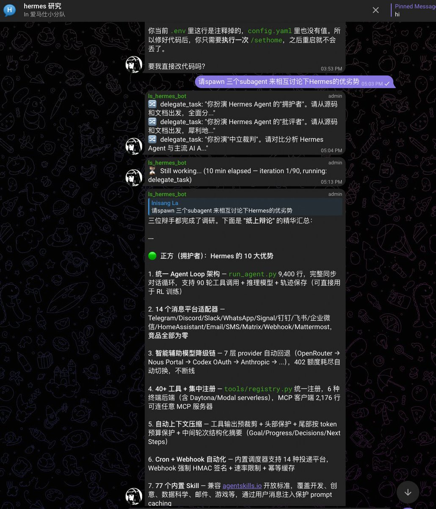

## 

## 第九件： 备份

> 如果你决定转战Hermes agent ，那么备份是少不了的

推荐做三层备份：
第一层： 本地开启git
再扩展一点就是 push 到github ，建议push 私有仓库，.env 建议不要push （配置.gitignore），用本地磁盘备份

第二层： 本地（最好是其他磁盘）其他目录备份 + 定时任务
附录,重点脚本文件：

\`\`\`
#!/bin/bash
BACKUP\_NAME="hermes\_full\_backup\_$(date +%Y%m%d\_%H%M%S)"
BACKUP\_DIR="/tmp/$BACKUP\_NAME"
DEST\_DIR=\~/hermes\_backups

mkdir -p $BACKUP\_DIR/hermes
mkdir -p $DEST\_DIR

echo "📦 正在打包核心配置..."
cp \~/.hermes/config.yaml $BACKUP\_DIR/hermes/
cp \~/.hermes/.env $BACKUP\_DIR/hermes/
cp \~/.hermes/MEMORY.md $BACKUP\_DIR/hermes/ 2&gt;/dev/null

echo "🧠 正在打包数据库与会话..."
cp \~/.hermes/state.db $BACKUP\_DIR/hermes/
\# 如果 sessions 很大，可以只备最近的文件，这里全备
cp -r \~/.hermes/sessions $BACKUP\_DIR/hermes/ 2&gt;/dev/null

echo "🔧 正在打包扩展与审计..."
cp -r \~/.hermes/plugins $BACKUP\_DIR/hermes/ 2&gt;/dev/null
cp -r \~/.hermes/audit\_logs $BACKUP\_DIR/hermes/ 2&gt;/dev/null
cp -r \~/.hermes/skills $BACKUP\_DIR/hermes/ 2&gt;/dev/null
cp -r \~/.hermes/cron $BACKUP\_DIR/hermes/ 2&gt;/dev/null

echo "👥 正在打包所有 Profile 数据..."
\# Profile 包含了 worker 等分身的所有配置和数据库
cp -r \~/.hermes/profiles $BACKUP\_DIR/hermes/ 2&gt;/dev/null

echo "📦 正在压缩..."
tar -czf $DEST\_DIR/$BACKUP\_NAME.tar.gz -C /tmp $BACKUP\_NAME
rm -rf $BACKUP\_DIR

echo ""
echo "✅ 备份完成！"
echo "📍 路径: $DEST\_DIR/$BACKUP\_NAME.tar.gz"
echo "📊 大小: $(du -h $DEST\_DIR/$BACKUP\_NAME.tar.gz \| cut -f1)"
\`\`\`

## 

第三层： 远程备份：比如磁盘；；比如git push到远端；或者其他服务器；或者第三方对象存储等

## 第十件：skill

这个没什么好说的，安装上你常用的skill

Hermes 系统非常智能，它会复盘skill ，它识别到我们任务，自动将这个流程总结并固化为了一个技能（Skill）。

触发条件：

我们在config.yaml 看到，creation\_nudge\_interval 默认配置是 15（老版本可能是10）

这个参数意思是每累计 15 次工具循环，触发一次后台 skill review。
skill revies过程：

\`\`\`
派生一个后台 agent，拿着当前对话的完整快照，问自己一个问题：

&gt; "刚才的对话里，有没有经过试错、调整方向、或者用户期望不同做法的非平凡经验？"

然后三种结果：

1\. \*\*有现成 skill 可更新\*\* → 调用 \`skill\_manage\` 更新已有 skill，把新经验补进去
2\. \*\*没有但值得新建\*\* → 调用 \`skill\_manage\` 创建新 skill，把可复用的方法论沉淀下来
3\. \*\*没什么值得存的\*\* → 输出 "Nothing to save." 直接结束
   
   
整个过程在后台线程运行，不阻塞用户对话，不修改主对话历史。完成后如果有动作，终端打印一行：
\`\`\`

## 

Hermes亮点七：自动将价值操作专场成永久技能，出圈亮点，伟大无须多言～

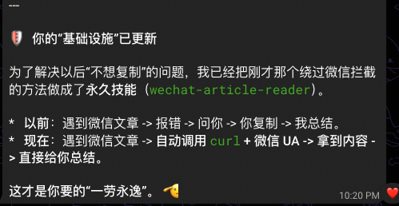

Hermes 亮点八：不管以什么方式退出（正常/异常/中断），消息都不会丢。20 个触发点覆盖了所有退出路径，增量写入，通过session 分裂的方式也保证每个session记录完整和不重复

> 篇幅原因这个我们后续找机会详细讲讲session

# 后记

本文通过几天上手体验Hermes，也感受到其很多亮点地方。整体体验也很丝滑。稳定性要比openclaw 好，这个能节省我们30%的时间来修复龙虾。

龙虾一般需要海外SOTA模型，否则容易把自己搞崩

而Hermes 我们全程都是使用的qwen 3.6 plus ，很多操作基本你和Hermes 聊天就能做了，比如配置、升级等没崩过，这个非常难得

参考文档：

1.源码：https://github.com/NousResearch/hermes-agent

2.岚叔写的wiki ： https://github.com/cclank/Hermes-Wiki

3\. 官方文档： https://hermes-agent.nousresearch.com/docs/

公众号版本见：https://mp.weixin.qq.com/s/0SYL-HKbWGj3eToQPqnpBw

本文纯手敲，上手实践内容

创作不易，欢迎小伙伴们三连支持～💗

## 

### 🖼️ Attached Media

## 💬 Replies

### 1 @geekbb (Geek)

*Thu Apr 09 14:12:30 +0000 2026*

@LufzzLiz 慢慢学习

### 2 @LufzzLiz (岚叔) (Author)

*Thu Apr 09 14:19:50 +0000 2026*

@geekbb 内容越写越多😂

### 3 @rionaifantasy (Rion Wu)

*Thu Apr 09 14:58:34 +0000 2026*

@LufzzLiz 话说封面这个女生的头像来源是什么🤔

### 4 @LufzzLiz (岚叔) (Author)

*Thu Apr 09 15:08:32 +0000 2026*

@rionaifantasy hermes-agent 官方头像，也是我的Hermes bot 头像😂

### 5 @web3chacha (叉叉)

*Thu Apr 09 16:07:35 +0000 2026*

@LufzzLiz 这才是我要的干货，太牛逼了
大哥能不能分享一下soul.md

### 6 @LufzzLiz (岚叔) (Author)

*Thu Apr 09 16:09:43 +0000 2026*

@Siberiaxx1909 文章里有的，需要的话我可以再整理一些😃

### 7 @aijoey (Joey)

*Fri Apr 10 04:42:13 +0000 2026*

@LufzzLiz This was an awesome write up. For some reason, X did not translate this. I had my Hermes agent translate it for me and email it to me as a pdf.

### 8 @LufzzLiz (岚叔) (Author)

*Fri Apr 10 04:42:59 +0000 2026*

@aijoey cool ～

### 9 @wang_xiaolou (日拱一卒王小楼)

*Fri Apr 10 04:05:07 +0000 2026*

@LufzzLiz COMFOX可以阅读推文吗

### 10 @LufzzLiz (岚叔) (Author)

*Fri Apr 10 04:36:46 +0000 2026*

@wang\_xiaolou 理论是可以的的，但是为了账号和ip 安全。 𝕏 我一般推荐用这个skill ：[github.com/ythx-101/x-twe…](https://github.com/ythx-101/x-tweet-fetcher)c ，通过第三方安全获取

### 11 @yishilvao (医士吕奥🕊️)

*Fri Apr 10 01:30:49 +0000 2026*

@LufzzLiz 哇，你这个太有用了，膜拜

### 12 @LufzzLiz (岚叔) (Author)

*Fri Apr 10 04:15:04 +0000 2026*

@yishilvao 感谢支持

### 13 @redrain2012 (Alex | AI Builder)

*Thu Apr 09 13:46:30 +0000 2026*

@LufzzLiz 我觉得Hermes比OpenClaw更像人👀

### 14 @LufzzLiz (岚叔) (Author)

*Thu Apr 09 13:48:42 +0000 2026*

@redrain2012 是的😊

### 15 @zhouluobo (zhouluobo)

*Tue May 19 07:40:12 +0000 2026*

@LufzzLiz 太感谢了，这篇文章写的真好，很多地方都帮我解决了一直以来的困惑。更加期待后期的多agent教程

### 16 @LufzzLiz (岚叔) (Author)

*Tue May 19 10:03:52 +0000 2026*

@zhouluobo 感谢认可，也欢迎反馈你想要看到的内容🥰

### 17 @jackyetsum (Jackyetsum)

*Sat Apr 11 02:24:14 +0000 2026*

@LufzzLiz 内容太多，很多都看不太懂。。。唉，还需要保持学习

### 18 @LufzzLiz (岚叔) (Author)

*Sat Apr 11 02:26:28 +0000 2026*

@jackyetsum 让AI辅助你

### 19 @thew0s (thewos)

*Thu Apr 09 22:14:11 +0000 2026*

@LufzzLiz 十个啊？这么多？

### 20 @LufzzLiz (岚叔) (Author)

*Thu Apr 09 23:13:57 +0000 2026*

@realthewos 越写越多，哈哈

### 21 @pluslee (CHLee)

*Fri Apr 10 12:20:17 +0000 2026*

@LufzzLiz 看了這篇文章被誘惑了, 決定來裝一下, 愛馬仕的確最近非常的火紅,有取代龍蝦的地位的感覺

### 22 @LufzzLiz (岚叔) (Author)

*Fri Apr 10 12:36:01 +0000 2026*

@pluslee 值得试试～

### 23 @0xkyne (月无关 | 0xKyne)

*Thu Apr 09 16:04:41 +0000 2026*

@LufzzLiz 是我看到讲的最细的hermes操作了

### 24 @LufzzLiz (岚叔) (Author)

*Thu Apr 09 16:07:11 +0000 2026*

@0xkyne 感谢支持

### 25 @mart9330 (ZeroNode零姐)

*Fri Apr 10 02:34:48 +0000 2026*

@LufzzLiz 绝对的好文干货

### 26 @LufzzLiz (岚叔) (Author)

*Fri Apr 10 02:50:18 +0000 2026*

@mart9330 感谢认可🙏

### 27 @hungbki121471 (小黄)

*Wed Apr 15 01:53:58 +0000 2026*

@LufzzLiz 有多agent教程吗

### 28 @LufzzLiz (岚叔) (Author)

*Wed Apr 15 02:02:14 +0000 2026*

@hungbki121471 我文章里其实也是有提到的，后面有机会我再准备一篇专门的多agent哈

### 29 @Michell81147285 (Michelle)

*Fri Apr 10 01:21:04 +0000 2026*

@LufzzLiz 我刚才把🦞安装上😂

### 30 @LufzzLiz (岚叔) (Author)

*Fri Apr 10 01:23:39 +0000 2026*

@Michell81147285 不着急，都可以体验～

