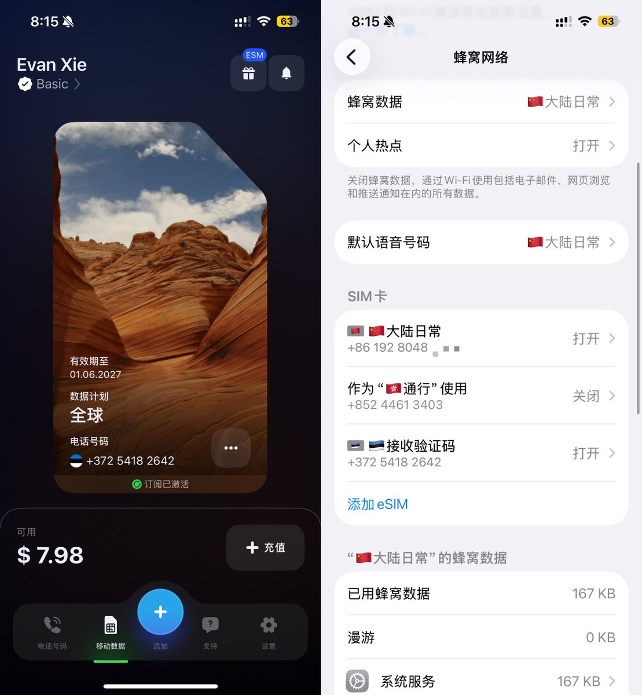
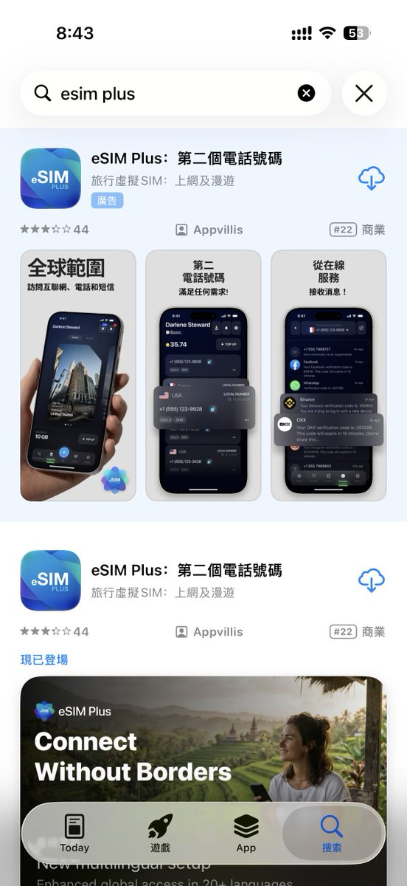
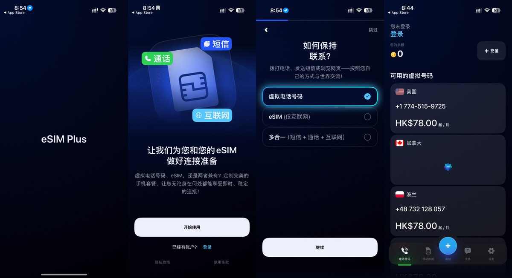
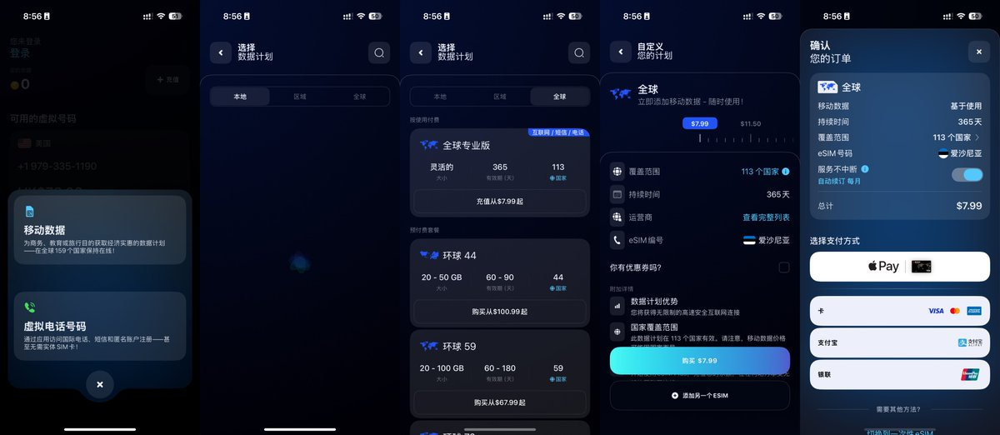
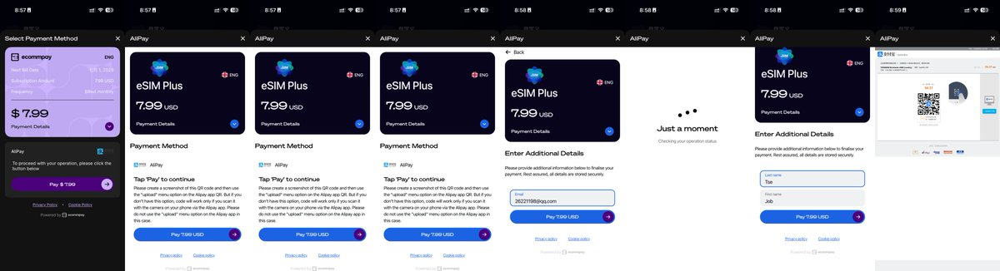
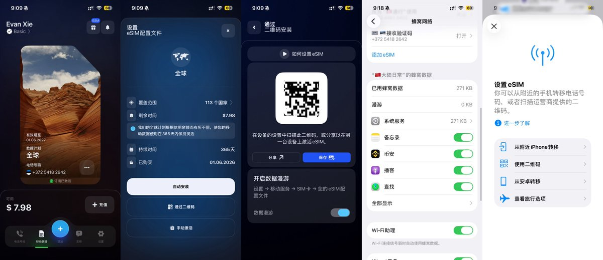
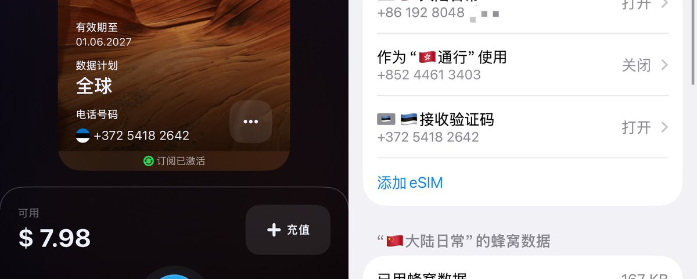
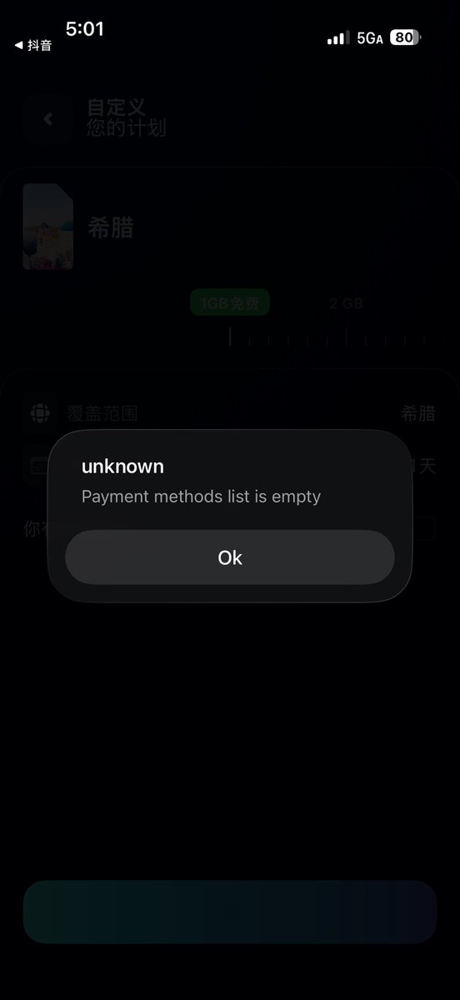

# 📰 如何50元拿下海外一年电话卡？全网最便宜海外 eSIM 曝光

2026年6月1日儿童节福利，算是给到了我的X推友了。全X最新最便宜最简单的办理国外手机卡教程，无需实名认证，支付宝可以付款，购买即用。买了英国Giffgaff的朋友要睡不着了。

以下是我今天刚刚开通的成功截图，归属地可以选全球113个国家，包括美国，欧洲，等。我选择的是爱沙尼亚归属地，7.99美元一年最便宜，直接上截图，号码我都不打码了。

接下来上教程

需要准备一台可以写入Esim的港版或美版苹果手机，我用的时候17e，没有的想办法去找个可以写入Esim的白卡。

## 购买教程

[1⃣](https://abs.twimg.com/emoji/v2/svg/31-20e3.svg)打开Apple store 搜索 eSIM Plus,并下载。

[2⃣](https://abs.twimg.com/emoji/v2/svg/32-20e3.svg)打开esim Plus，跟着导航点继续，然后跳过，到主页

[4⃣](https://abs.twimg.com/emoji/v2/svg/34-20e3.svg)点击添加，选择移动数据

[5⃣](https://abs.twimg.com/emoji/v2/svg/35-20e3.svg)点击选择全球专业版7.99USD，自动就是爱沙尼亚最便宜的

[6⃣](https://abs.twimg.com/emoji/v2/svg/36-20e3.svg)是点击购买，填写邮箱选择支付宝支付

[7⃣](https://abs.twimg.com/emoji/v2/svg/37-20e3.svg)购买成功后，可以选择直接注册，也可以直接用一谷歌账号，AppleID登入进去。然后就可以配置啦。

## 如何配置？直接扫描二维码1分钟搞定

进入到首页，点击风景图，进入到配置页面，选择二维码，保存后，在Esim天添加页面，选择扫描二维码，然后恭喜你有了国外手机卡，以后遇到各种验证都不用担心啦。

我是 Job，一个死磕 AI 落地与实操的 00 后。

如果这篇干货对你有启发，求个点赞 + 转推 支持一下！[❤️](https://abs.twimg.com/emoji/v2/svg/2764.svg) 

你们的每一次互动，都是我这个 X 新人持续为你输出硬核原创的最大动力！

### 🖼️ Attached Media

## 💬 Replies

### 1 @ChuanqiAGI (川启) (Author)

*Tue Jun 02 05:08:14 +0000 2026*

有问题可以评论区交流哦

### 2 @OtherSideBJ (另一面)

*Tue Jun 02 23:59:22 +0000 2026*

@Joybunala 挺喜欢你的，能回关一下吗？很愿意在评论区互动。

### 3 @ChuanqiAGI (川启) (Author)

*Wed Jun 03 01:20:14 +0000 2026*

@OtherSideBJ 谢谢你的喜欢呀

### 4 @wuliao_btc (无聊先生(爱炒币的懒羊羊)🩵AI)

*Wed Jun 03 03:40:18 +0000 2026*

@Joybunala 需要一个支持esim的苹果手机 或者 安卓机吧

### 5 @ChuanqiAGI (川启) (Author)

*Thu Jun 04 23:56:38 +0000 2026*

@wuliao\_btc 买一个se3 美版，以后可以写100个

### 6 @zhanghedongya (zhanghedong)

*Wed Jun 03 23:35:09 +0000 2026*

@Joybunala 有了自己的境外电话卡，可以流量上网 可以境外注册很多86无法注册的APP。这个福利真的是太好了。

### 7 @ChuanqiAGI (川启) (Author)

*Thu Jun 04 23:56:50 +0000 2026*

@zhanghedongya 是滴，大哥

### 8 @0xallyhelp (币圈美股博主VIP聚合)

*Thu Jun 04 19:29:42 +0000 2026*

@Joybunala 老哥这么好的东西关注咋这么少，先给你点个关注，回关看你心情

### 9 @ChuanqiAGI (川启) (Author)

*Thu Jun 04 23:58:35 +0000 2026*

@aiduduba 感謝我大爹的動力關注

### 10 @FFirmstone22262 (Fabrizia Firmstone)

*Tue Jun 02 11:13:11 +0000 2026*

@Joybunala 有点贵啊，giff10欧能用好多年，这个作为接码的话，有点贵了

### 11 @ChuanqiAGI (川启) (Author)

*Tue Jun 02 13:53:03 +0000 2026*

@FFirmstone22262 开卡就几百块，又麻烦，一年的多少钱还不知道呢。我看那些教程买这个买那个都头晕，这个直接下来。

### 12 @COBSERVER364152 (启程)

*Thu Jun 04 07:51:58 +0000 2026*

@Joybunala 到底能不能接openai短信啊，哪位大佬测试了

### 13 @ChuanqiAGI (川启) (Author)

*Fri Jun 05 00:01:00 +0000 2026*

@COBSERVER364152 可以呀，已经发啦截图

### 14 @qingliang0 (qingliang0)

*Thu Jun 04 00:26:31 +0000 2026*

@Joybunala 我就是在国内收的验证码呀

### 15 @ChuanqiAGI (川启) (Author)

*Fri Jun 05 00:00:37 +0000 2026*

@qingliang0 啥问题呀？够了

### 16 @ChrisZebraUp (修罗王)

*Thu Jun 04 14:04:19 +0000 2026*

@Joybunala 手机这一关就过不了，pass

### 17 @ChuanqiAGI (川启) (Author)

*Fri Jun 05 00:09:36 +0000 2026*

@ChrisZebraUp 适合有美版的港版的哈哈哈

### 18 @glgg000 (短发牛逼)

*Wed Jun 03 05:04:40 +0000 2026*

@Joybunala 年续有点麻烦

### 19 @ChuanqiAGI (川启) (Author)

*Wed Jun 03 07:05:33 +0000 2026*

@yihuadong666 还不知道呢

### 20 @wsakshen (Jon Stark)

*Wed Jun 03 07:43:36 +0000 2026*

@Joybunala 可是这个要7.99美元一年呀，Giffgaff的买新卡五六十，每年保号成本才5块钱。这还是比G卡贵呀？

### 21 @ChuanqiAGI (川启) (Author)

*Wed Jun 03 18:55:16 +0000 2026*

@wsakshen 便宜，速度，快，GIF现在50-60买不到，且时间长

### 22 @sunjoy762740 (sunjoy)

*Tue Jun 02 17:08:49 +0000 2026*

@Joybunala 这个是一个月7.99刀啊？

### 23 @ChuanqiAGI (川启) (Author)

*Tue Jun 02 17:22:15 +0000 2026*

@sunjoy762740 一年7.99刀！

### 24 @Zouzuzijiu (Zou Zu)

*Sun Jun 14 03:29:31 +0000 2026*

@Joybunala 港卡一年6元

### 25 @ChuanqiAGI (川启) (Author)

*Mon Jun 15 06:45:24 +0000 2026*

@Zouzuzijiu 但是不可以Gpt

### 26 @Natalia1458567 (Natalia)

*Thu Jun 04 20:31:38 +0000 2026*

@Joybunala 我尝试了一下，但是不知道是什么原因。手机没信号但是一直显示正在激活

### 27 @ChuanqiAGI (川启) (Author)

*Thu Jun 04 23:57:14 +0000 2026*

@Natalia1458567 截图发出来看看 ，是不是没有开漫游？可以重新写入试一下

### 28 @Henry_LHT (Henry)

*Thu Jun 04 04:03:00 +0000 2026*

@Joybunala 这个卡适合拿来注册港卡和美国券商么？谢谢

### 29 @ChuanqiAGI (川启) (Author)

*Fri Jun 05 00:05:54 +0000 2026*

@Henry\_LHT 不建议，这个有效才一年，

### 30 @Cc292565933 (Cc292)

*Wed Jun 03 15:43:09 +0000 2026*

@Joybunala 及时雨！！！！明天试试

### 31 @ChuanqiAGI (川启) (Author)

*Wed Jun 03 18:54:16 +0000 2026*

@Cc292565933 感谢，新人创作

### 32 @ZzidG46377 (ZZid GG)

*Tue Jun 02 14:55:06 +0000 2026*

@Joybunala 这个怎么开头又要 esim 空白卡啥意思？

### 33 @ChuanqiAGI (川启) (Author)

*Tue Jun 02 15:05:36 +0000 2026*

@ZzidG46377 港版iPhone自带eSIM，没有eSIM你就需要搞到eSIM。仔细看教程哦。😃

### 34 @yewenxi189 (sonic)

*Thu Jun 04 06:46:54 +0000 2026*

@Joybunala 我选择支付宝是这样的 

### 35 @ChuanqiAGI (川启) (Author)

*Fri Jun 05 00:09:54 +0000 2026*

@yewenxi189 开vpn

