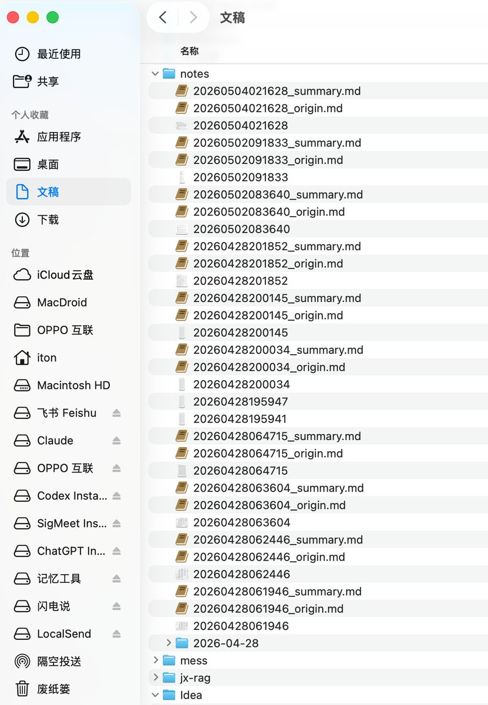
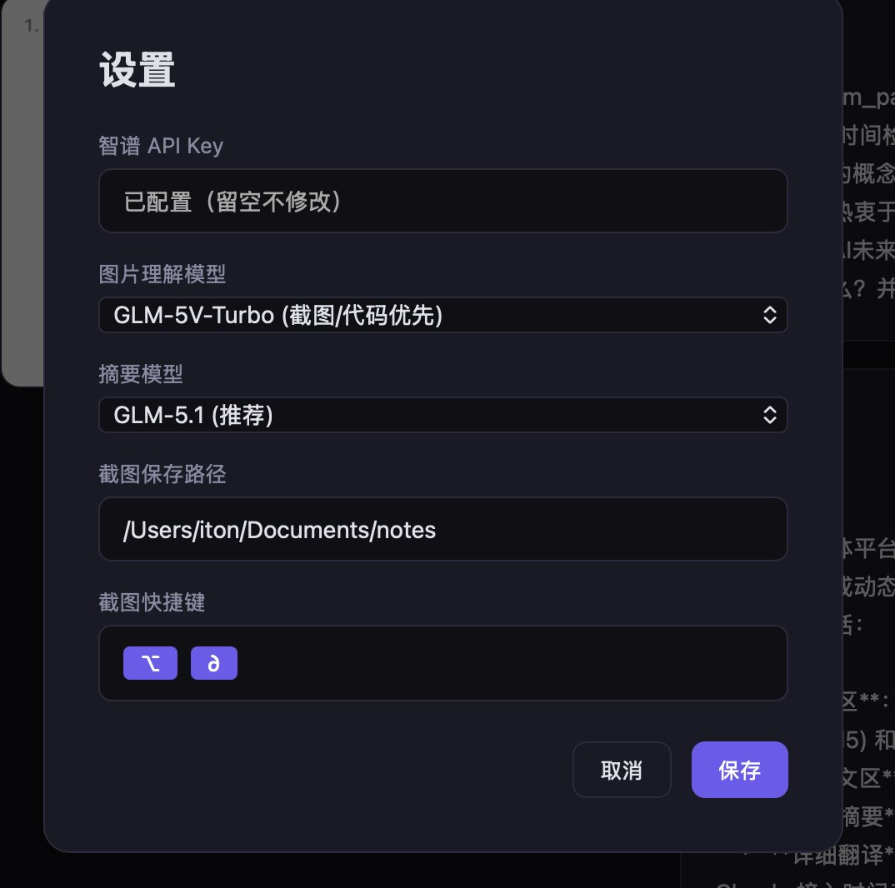

有没有那种，可以丢个推特长文链接，自动把文章保存为markdown的工具呀？

如果没有的话，我就去vibecoding一个

## 💬 Replies

### 1 @wangdefou (得否) (Author)

*Mon May 04 12:45:32 +0000 2026*

我自己手搓了一个出来

[x.com/wangdefou/stat…](https://x.com/wangdefou/status/2051280285623627874)

### 2 @cellinlab (Cell 细胞)

*Mon May 04 01:53:41 +0000 2026*

@wangdefou 这里

[x.com/cellinlab/stat…](https://x.com/cellinlab/status/2035988483102458277?s=46)

### 3 @wangdefou (得否) (Author)

*Mon May 04 01:59:46 +0000 2026*

@cellinlab 这个也挺6啊，收藏了，晚点试试这个。早看到的话就好了。

### 4 @supezen (ZEN)

*Mon May 04 02:26:40 +0000 2026*

@wangdefou 可以试试 [dokobot.ai](http://dokobot.ai) 几乎任何网站都可以
本地免费无限使用，无需注册

### 5 @wangdefou (得否) (Author)

*Mon May 04 02:35:08 +0000 2026*

@supezen 谢谢，我找空试试这个

### 6 @0xReggieJ (ReggieJ)

*Mon May 04 15:53:05 +0000 2026*

@wangdefou 有的博主没有文章功能，希望能把博主在回复里发的内容也一起保存，不知道市面上有没有这个功能

### 7 @wangdefou (得否) (Author)

*Mon May 04 16:02:08 +0000 2026*

@0xReggieJ [twillot.com/?ref=URGNFK](https://www.twillot.com?ref=URGNFK)，这个插件好像可以，之前还用过

### 8 @wadezone (Koda)

*Mon May 04 02:26:02 +0000 2026*

@wangdefou 我有

### 9 @wangdefou (得否) (Author)

*Mon May 04 02:33:47 +0000 2026*

@wadezone 我刚搓完我自己的🤣，晚点发出来

### 10 @hustonw0909 (HustonWang)

*Mon May 04 01:19:49 +0000 2026*

@wangdefou obsidian web clipper extention

### 11 @wangdefou (得否) (Author)

*Mon May 04 02:03:07 +0000 2026*

@hustonw0909 这个脱离了电脑就不灵了，我想的是通过手机也可以做这件事

### 12 @bruc3van (Bruce Van)

*Mon May 04 02:15:06 +0000 2026*

@wangdefou 哈哈，我的 OpenClaw 可以，丢个 X 链接自动发回 markdown 文件 

### 13 @wangdefou (得否) (Author)

*Mon May 04 02:16:54 +0000 2026*

@bruc3van 我也刚刚配置好

### 14 @cnzhihao (智昊 - OPC版)

*Mon May 04 01:17:51 +0000 2026*

@wangdefou 我是用obsidian clipper插件，它可以读长文自动保存到obsidian里，也可以弄到剪切板，还可以保存成单独的markdown文件，一键保存

### 15 @wangdefou (得否) (Author)

*Mon May 04 01:44:57 +0000 2026*

@cnzhihao 刚刚让hermes想了一个解决方案，已经跑通了，晚点写一个教程出来

### 16 @icycat (冷酷小猫 IcyCat)

*Mon May 04 01:52:23 +0000 2026*

@wangdefou 如果只是单个长文的话，我的插件就能实现在，分享的地方可以直接复制为md

### 17 @wangdefou (得否) (Author)

*Mon May 04 01:54:38 +0000 2026*

@icycat 有可能是多个长文

沉淀了一个skills，安装到hermes里面，就可以实现随时随地把看到的好文章，以md格式保存在本地了。

### 18 @sfce2025 (炼金者)

*Mon May 04 01:17:13 +0000 2026*

@wangdefou 看来你们把AI用的出神入化了

### 19 @wangdefou (得否) (Author)

*Mon May 04 02:03:21 +0000 2026*

@sfce2025 都是基于自己奇奇怪怪的需求

### 20 @bainianAI (百年 AI×出海)

*Mon May 04 01:11:39 +0000 2026*

@wangdefou 我这个需求一般是 claude code playwright 满足的。。。

### 21 @wangdefou (得否) (Author)

*Mon May 04 01:12:31 +0000 2026*

@yidabuilds 我可能要保存很多篇，能封装到hermes agent里面就香了

### 22 @is_kerwin (Kerwin)

*Mon May 04 02:00:06 +0000 2026*

@wangdefou Obsidian 插件不是可以吗？

### 23 @wangdefou (得否) (Author)

*Mon May 04 02:03:39 +0000 2026*

@is\_kerwin 一旦脱离电脑，这个插件都不能用了

### 24 @onevcat (onevcat)

*Mon May 04 09:41:03 +0000 2026*

@wangdefou 你在找 transcrab 么 [transcrab.onev.cat](https://transcrab.onev.cat/) 🤪

### 25 @calicastle (Cali Castle)

*Mon May 04 02:51:23 +0000 2026*

@wangdefou 可以直接 defuddle.md 后面带上 url 即可
比如

[defuddle.md/x.com/vmiss33/…](https://defuddle.md/x.com/vmiss33/status/2050984556790939731)

### 26 @nexmoe (Nexmoe)

*Mon May 04 03:14:00 +0000 2026*

@wangdefou [clipii.com](https://clipii.com/)
还能保存哔哩哔哩、小宇宙等等各种平台到 markdown

### 27 @YuLin807 (QingYue)

*Mon May 04 04:11:28 +0000 2026*

@wangdefou 这不是早年间X Twitter Fetch就有热心群友帮我添加了这个功能 
原封不动的保存到obsidian

### 28 @itonlin111 (itonlin)

*Mon May 04 02:23:08 +0000 2026*

@wangdefou 我有一个自己用的本地python工具，就是在任意位置按个快捷键，就会触发截屏。

选中截图，后台任务就会自动去调图片模型，识别并做OCR，提取里面的文字，总结内容，然后保存到一个本地文件夹里边，按照时间命名。

模型是可以自己配置的。

有需要的话可以把我这个工具共享出来 

### 29 @emememerica (aresyang)

*Mon May 04 02:27:56 +0000 2026*

@wangdefou 已经有了  [github.com/aresbit/fetch-…](https://github.com/aresbit/fetch-skill)

### 30 @zhaoke92 (中衡英寿)

*Mon May 04 02:00:56 +0000 2026*

@wangdefou 别瞎基吧造轮子了

