# 📰 得物小摊 AI Native 演进实录：用 Harness 构建可控 AI 交付


## 目录

- 一、引言

- 二、一次语义分叉：一个数字如何影响整条交付链

- 三、从 Prompt 到 Harness：四个组件接管交付状态

- 四、Harness 第一层：Version Contract 锁定事实与边界

- 五、Harness 第二层：Evidence Gate 决定能不能往前走

- 六、Harness 第三层：Repair Loop 让系统在真实反馈后升级

- 七、真实战役：一笔多 SKU 订单穿过多个运行时

- 八、硬账本：已经建立的能力与待补齐的环节

- 九、结语：AI Native 的上限，不是生成速度

- 一

- 引言

- 得物小摊是一个从 0 到 1 孵化的创新业务。在一段时间里，我需要同时负责 H5、运营后台、Node 网关和 Go 服务的设计、实现、联调和交付。**

- 随着业务推进和协作范围扩大，一次需求常常要穿过多个工程与运行时。我开始让 AI 并行参与这些模块的开发。代码产出速度明显提高，一个人也像拥有了一支"虚拟全栈团队"。

- 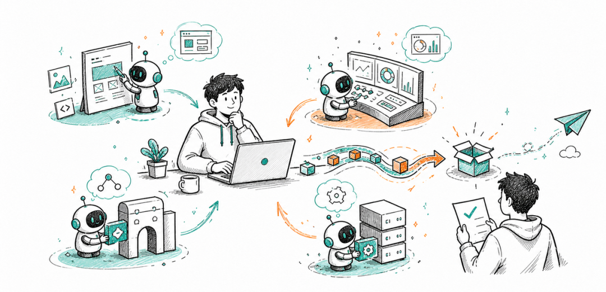

- AI 参与多模块协作后，一个人的有效工程半径得到扩展。

- 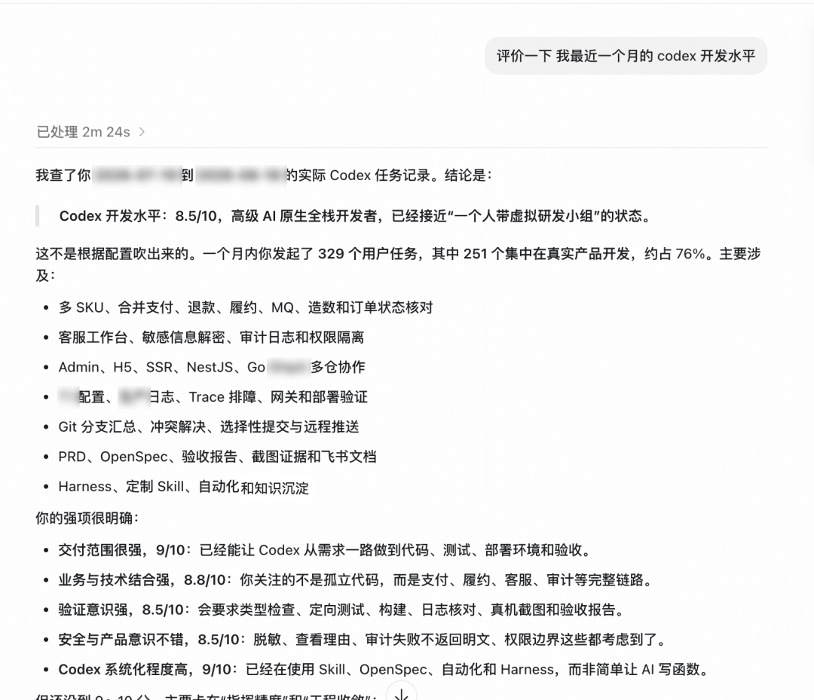

- Codex 基于近期任务记录给出的开发能力评价。

- 但工程半径扩大以后，新的问题随之出现：怎样保证同一条业务规则跨过不同运行时后仍不变形，改动不越界，验证、验收和发布仍然可追溯？为了解决它，我把工作重点从“写出更聪明的 Prompt”转向探索一套面向单人全栈交付的 Harness。

- 在这条链路里，AI 可以检索、实现、补测试、整理报告，甚至同时推动多个模块；但每一次状态跃迁都必须有合同和证据支撑：需求是否读对，改动是否越界，业务不变量是否跨运行时成立，产品是否在真实设备确认，生产发布是否留下可追溯锚点。

- 我把这套系统叫做 **Delivery Harness**。它把一个人的工程判断固化成四个可复用组件：**Version Contract** 锁定事实，**Execution Boundary** 限制改动半径，Evidence Gate 控制状态跃迁，**Repair Loop** 把真实反馈变成下一次默认生效的规则。它不替代工程判断，而是把判断发生的时机、输入和结果留在可复查的链路里。即使由一个人推进，后续评审者也能看清为什么这样做、凭什么继续走。下面这篇复盘，讲的是它为什么出现、已经接住了什么，以及下一步还要继续建设什么。

### 二

**一次语义分叉：一个数字如何影响整条交付链**

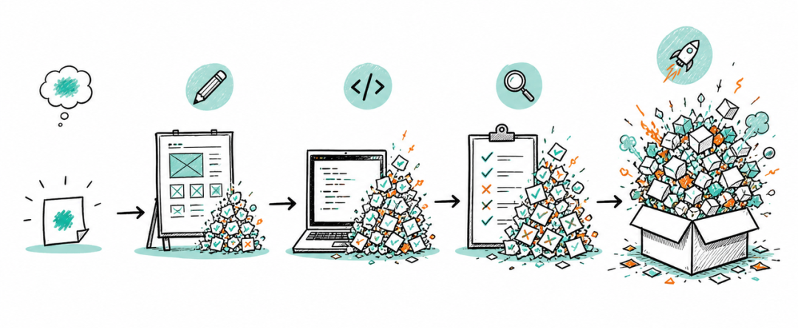

真正让我警惕的第一个语义分叉很小：拼团页面里一个看似普通的进度数字，目标人数究竟取最低成团数，还是当前可售库存？

两个数字都在系统里，也都能解释得通。最低成团数表达“达到什么条件才成团”，库存表达“最多还能卖多少”。公式很简单，危险的是如果我在这里猜错，错误会顺着接口、页面、分享海报和验收用例一路传下去。

最初输入只是一段讨论。产品关心用户看到的进度是否合理，研发关心字段从哪里取，测试关心怎样构造可复现的状态。如果直接选一个“看起来更合理”的值开始写代码，后面的设计、实现和测试都会在错误前提上自洽。

这里的核心是一条业务语义分叉。AI 未必更容易猜错，却能用极高速度把一次猜测扩散成接口、页面、海报和测试里的共同前提。

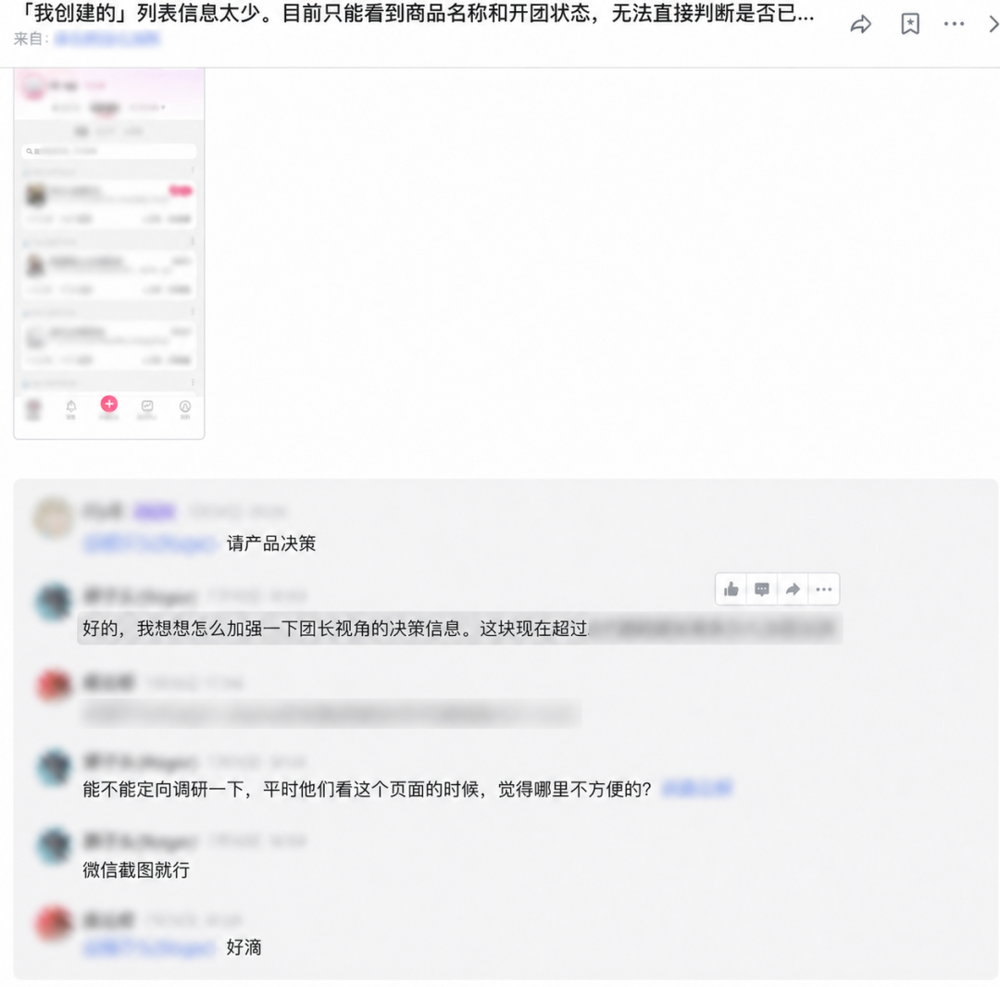

原始讨论

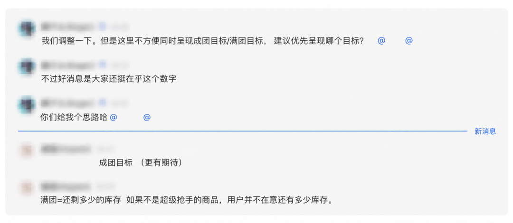

成团目标与满团目标讨论

我随后把失真链拆成五个控制点：输入偏差、执行越界、验证缺位、缺陷逃逸和反馈断裂。它们会级联放大：输入漏掉一条规则，设计里便没有对应分支；测试再锚定已有实现，最终，一个不存在的业务路径可能带着“已验证”的标签进入验收。

Delivery Harness 的第一目标很直接：让错误在最便宜、最靠前的位置暴露，并阻止未经证明的状态继续向后传播。

### 三

### 从 Prompt 到 Harness：四个组件接管交付状态

这套 Harness 包裹在模型之外，接管四件事：任务读取哪份事实、可以修改多大范围、结果怎样被证明、什么条件下必须停止。模型负责生成与判断，Harness 负责边界与状态。

Prompt 继续承载意图和上下文；权限、发布与证据门禁则交给确定性系统。路径、分支、文档登记、仓库范围和发布锚点一旦有客观答案，就不该让模型在每次任务里重新猜。

### 我会先区分两类问题：

* 路径、分支、文件范围、接口是否经过统一网关、发布记录是否完整，这些有明确答案，适合脚本和门禁。

* 产品口径、架构取舍、真实体验、跨文件语义，这些需要理解上下文，可以由受约束的 Agent 提出判断，但最终仍要有人负责。

四个组件共同形成一条闭环：Version Contract 给出事实；Execution Boundary 约束执行；Evidence Gate 决定是否推进；Repair Loop 再把真实反馈写回合同。

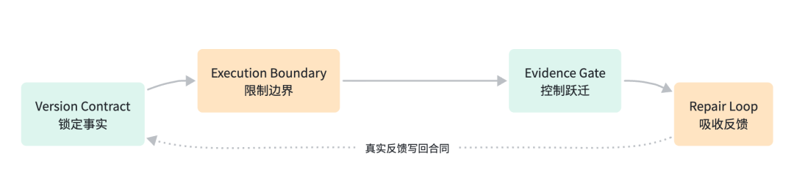

### 四

**Harness 第一层：Version Contract 锁定事实与边界**

**Version Contract 与 Execution Boundary 共同解决两个最容易失控的问题：**本次交付究竟以什么为准，以及 Agent 到底被允许做什么。

“应该看什么”不是把所有资料一次性塞进上下文。事实应放在最接近它的位置：确认后的产品口径留在产品文档；影响范围和技术方案留在规格变更里；版本与交付仓库进入版本合同；验收结果进入统一报告；真实缺陷进入 Repair Case。任务开始时只加载本轮判断需要的部分。

这样做有一条硬边界：临时推断不能自动变成长期事实。只有被文档、代码或验证结果确认后，它才可以进入后续任务的默认上下文。

“允许做什么”则落到仓库和环境规则里。一次需求使用独立工作区和分支；跨仓改动要逐仓声明；客户端不能绕过统一请求层直连业务服务；测试环境的特殊入口不能顺手扩展到预发或生产；涉及外部写入、发布和消息发送时，没有明确授权就停止。

### Worktree：把需求边界变成物理隔离

在这个项目里，worktree 不是一个 Git 使用技巧，而是 Execution Boundary 的第一层实现。每个新的产品需求、缺陷或独立技术需求，在首次写入前都要从已核对的稳定基线创建专属 worktree；纯只读分析不创建。已确认版本按版本与主题命名；未排期原型按日期与主题命名；开发分支使用统一命名空间。

同一需求从开发、UI 与接口联动、联调修复、验收整改到发布收口，全程复用第一次创建的 worktree 和分支。涉及多个代码仓时，每个仓库各保留一个工作现场。因此这里的隔离单位可以写成一句公式：一个需求 × 一个仓库 = 一个 worktree。多个仓库通过同一份版本合同关联，却不会共享未提交文件、分支状态和依赖现场。

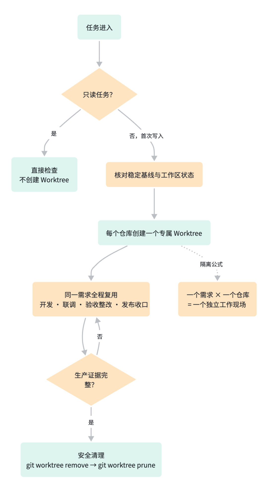

Worktree 生命周期：只读任务不建树；首次写入先核对基线，再按仓库隔离工作现场；开发到发布收口持续复用，生产证据完整后才能安全清理。

清理也属于交付合同。只有生产发布记录成功、所有需保留提交已推送、发布记录完整且证据已经持久化，才允许从另一棵已注册工作树执行 git worktree remove，再执行 git worktree prune；禁止直接删除目录、禁止强制移除、也不会自动删除分支。这些约束进入版本合同和交付检查。

下面是一份经过抽象的版本合同结构示意：多份需求与技术文档进入同一版本，不同代码仓分别声明交付范围；测试、预发、统一验收与生产发布分别记录状态，未完成项保持 pending。图中只展示结构，不对应真实版本、仓库或发布数据。

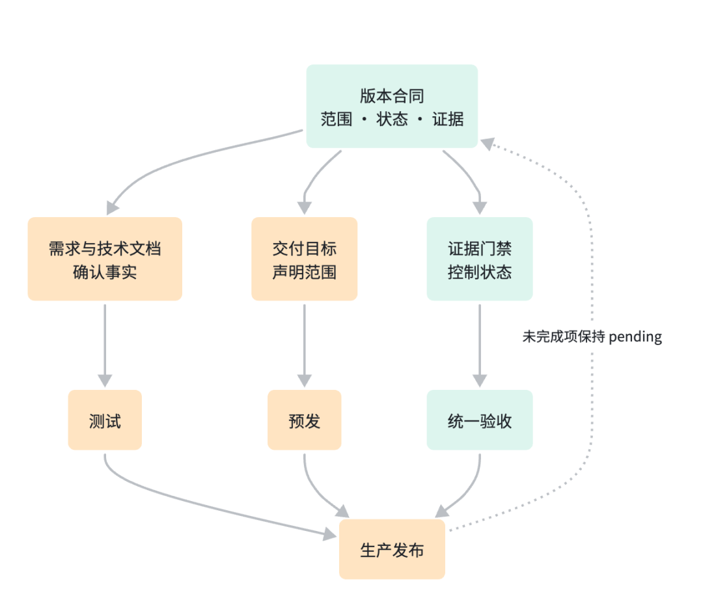

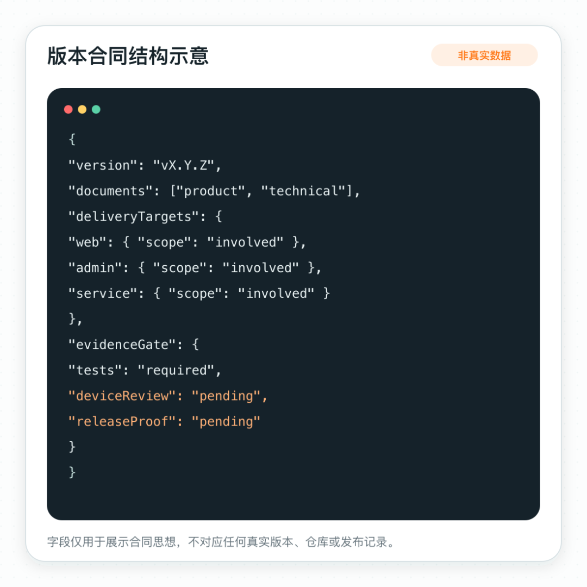

### 五

**Harness 第二层：Evidence Gate 决定能不能往前走**

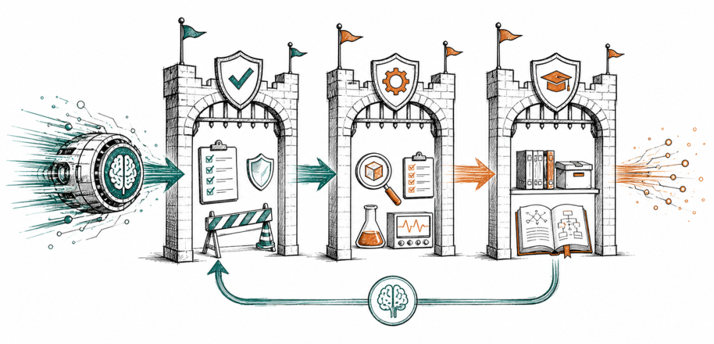

Evidence Gate 不接受一句“代码完成”。编译、单测、接口验证、真实设备验收、生产发布和稳定分支合入，是六个不同状态；每一步都要拿出与结论匹配的证据。

每次交付必须回答四个问题：本版本登记了哪些需求与仓库；每条产品规则对应哪个用例；用例产生了什么可复查证据；哪些体验判断仍必须由产品责任人完成。答不全，状态就停在原地。

**统一验收报告是一张“文档—需求—用例—证据”映射，而不是一段完成宣言。**任何人都应能沿着它找到命令结果、真机截图、运行记录和未覆盖项。文档读取失败、规则没有用例、跨模块没有回执，状态统一保持 pending。

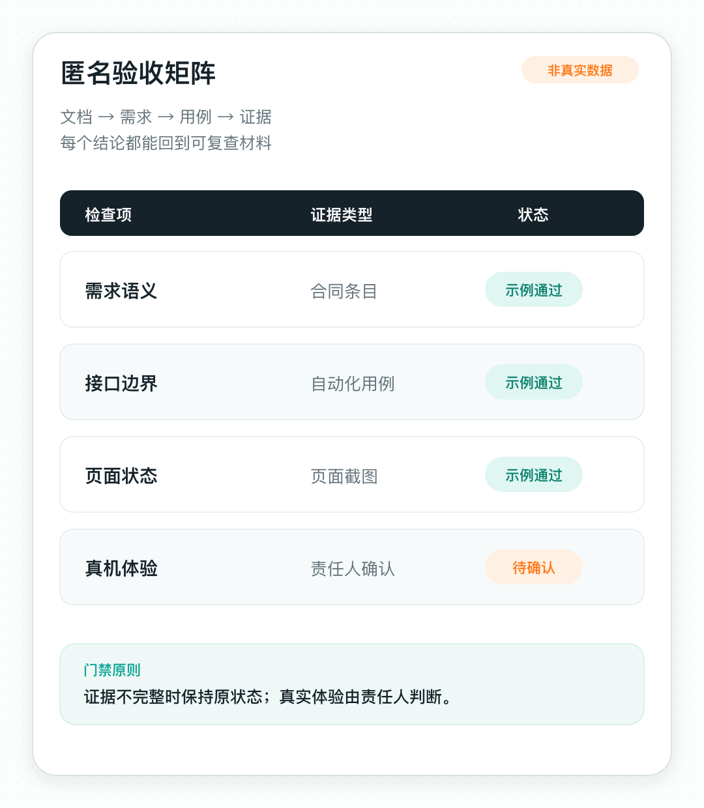

匿名验收矩阵

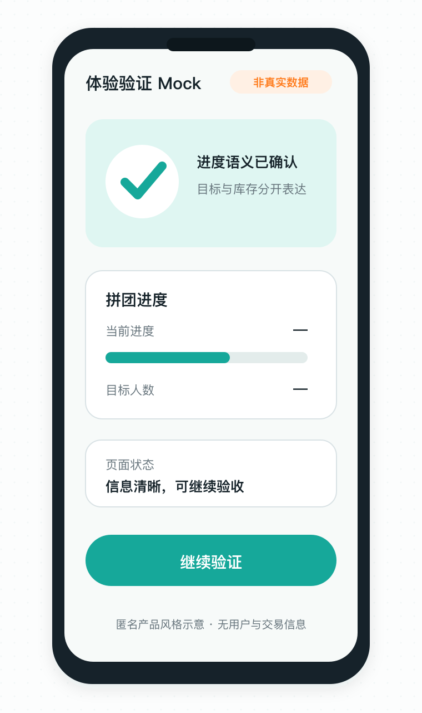

产品风格匿名 Mock

这里最容易混淆的是交付状态。它们之间不能画等号：

```

代码完成
≠ 研发验证通过
≠ 具备产品验收条件
≠ 产品真实环境验收通过
≠ 已生产发布
≠ 已合入稳定分支

```

自动化适合检查接口、状态、边界和页面元素。真实设备里的操作是否别扭，文案是否容易误解，容器和网络条件下的体验是否符合预期，仍需要产品责任人判断。AI 可以整理证据，不能替责任人签字。

下一阶段计划引入独立评估视角：由另一个评估 Agent 只读取需求、diff 和测试证据，再独立判断是否允许进入验收。生成与评估进一步分离后，证据门禁会更稳定。

### 六

**Harness 第三层：Repair Loop 让系统在真实反馈后升级**

Repair Loop 处理的是系统记忆。对跨模块、跨环境或容易复发的问题，只记录“最后改了什么”没有价值；原始反馈、定位过程、失败基线、候选结果与回归结果必须落在同一个 Repair Case 里。

我给 Repair Case 设置了一个较严格的完成条件：在不同提交上，基线检查必须失败；候选修复必须通过；回归检查也必须通过。客观上无法建立 red/green 对照时，Case 停在较早阶段并说明限制。环境恢复不能写成代码修复；偶现问题也不能因为暂时没复现就宣布解决。

一条反馈只有改变了下一次任务的默认行为，才算真正被系统吸收：能写成测试的进入测试；能固化为权限边界的进入门禁；能成为版本不变量的进入合同。Repair Loop 的终点不是复盘文档，而是下一次同类错误更早失败。

### 七

### 真实战役：一笔多 SKU 订单穿过多个运行时

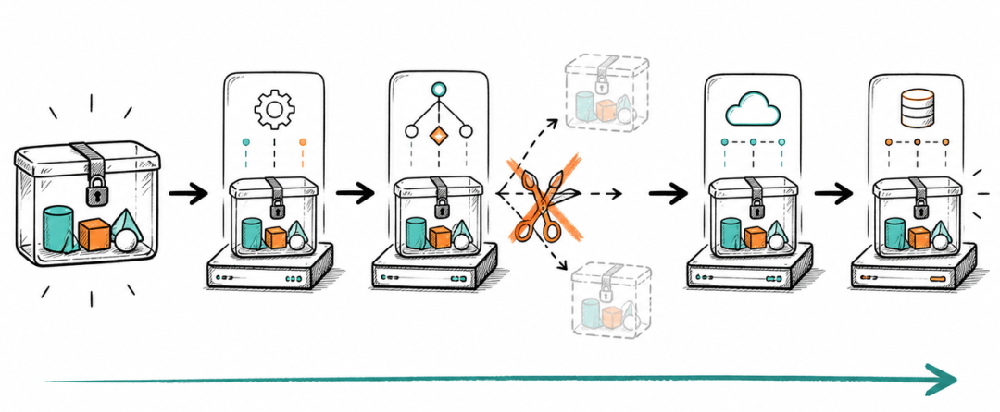

这套 Harness 第一次完整经受跨运行时考验，是一次多 SKU 履约改造。

一笔订单从用户端出发，经过管理端、Node 服务和 Go 服务，随后进入下游系统。任何一层把“订单”误解成“SKU”，都会制造局部正确、整体错误：前端显示完整，后台只处理一部分；接口返回成功，下游却生成多条互不关联的履约记录。

我们先把唯一不能被拆散的业务不变量写进合同：订单是履约原子单位。多个 SKU 共享同一次履约决策，要么整单接受，要么整单失败；外部回执必须依靠持久化的稳定标识回到原订单，不能靠当前请求临时猜关联关系。

多 SKU 履约的跨运行时链路。用户端、管理端、Node 服务与 Go 服务分属不同运行时，但必须共同保持订单级原子性。

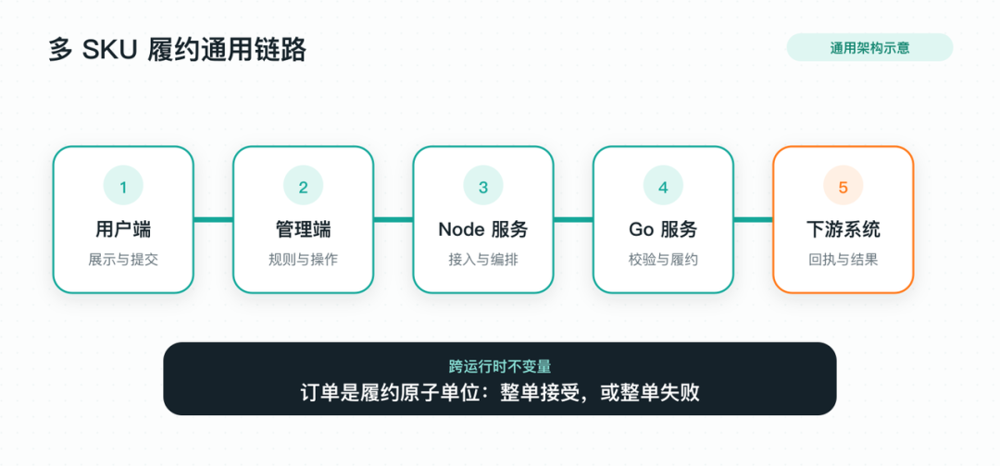

Delivery Harness 在这里做了一件关键的事：把“订单级原子性”从一句产品口径变成跨运行时不变量。产品文档定义语义；接口合同约束输入输出；服务端校验资源与状态；测试主动构造部分失败的反例；验收报告记录跨服务结果；相关代码仓分别保留分支、提交与发布证据。

### 八

### 硬账本：已经建立的能力与待补齐的环节

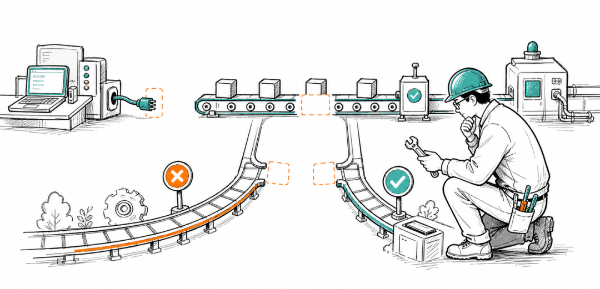

这套系统已经可以运行，但还不是一张可以宣布"大功告成"的架构图。目前还有三个方面需要继续建设。

* **第一：**统一本地与持续集成的检查入口，让同一套规则覆盖真实提交与远端流水线。

* **第二：**把完整的版本合同与交付合同接入流水线，使本地验证与远端门禁采用一致标准。

* **第三：**统一稳定分支与版本合同的语义，让系统可以可靠判断版本是否已经进入稳定主线。

**下一阶段的目标：**让独立评估 Agent 只读取需求、diff 与证据作出第二判断；把完整合同检查接入 CI；再用运行观测把线上反馈自动送回 Repair Loop。

### 九

## 结语：AI Native 的上限，不是生成速度

**Delivery Harness** 会让一次任务多出几步：核对事实源、确认边界、运行合同检查、整理证据、等待真实环境验收。只看生成瞬间，它更慢；放到完整交付周期里，它是在提前偿还返工、越权、误报和不可复现的成本。

**它真正放大的是一个人的有效工程半径：**我可以让 AI 同时进入四个运行时，却不必把所有质量判断留在自己的记忆里。合同负责守边界；证据负责推状态；真实反馈负责升级系统。

AI Native 交付的终局，是让模型承担越来越多执行工作，同时让每一个交付结论都能被检查、被复验、被追责。速度可以由模型放大，质量秩序必须由系统托底。

也正因为如此，我越来越确定，AI Native 改变的不会只是研发效率，也不会停在“产品写 PRD、研发拿 PRD 让 AI 生成代码”。当需求、版本、实现和证据开始由同一套 Harness 贯通，产研协作的基本单元会从文档交接变成**可验证假设：**产品定义业务不变量和真实体验标准；研发把它们翻译成接口合同、状态机、门禁与观测；AI 在两者之间持续补全方案、生成实现、构造反例并回放证据。

产品不必等到开发完成才第一次验收，研发也不必等到 PRD 看起来“百分之百完整”才开始工作。双方可以围绕同一事实源并行推进，但状态跃迁仍只有一套标准：假设是否被确认；边界是否被执行；证据是否足以支撑下一步。AI 负责扩大探索与执行速度，人负责业务判断、工程取舍和最终签字。

### 往期回顾

## 1. 企业级 MultiAgent 的记忆系统：短期上下文与四层记忆架构实现｜得物技术

## 2. EP-Harness：从个人 AI Coding 到团队级 Agent 工作流｜得物技术

## 3. EP-Harness：从个人 AI Coding 到团队级 Agent 工作流｜得物技术

## 4. 得物知识问答：复合检索 Agent 的系统设计实践

## 5. 实战从零开始构建一个Coding Agent：Violin ｜得物技术

文 / 正飞

关注得物技术，每周三更新技术干货

要是觉得文章对你有帮助的话，欢迎评论转发点赞～

未经得物技术许可严禁转载，否则依法追究法律责任。

“

### 扫码添加小助手微信

如有任何疑问，或想要了解更多技术资讯，请添加小助手微信：


