# 📰 AI Native 交易核心系统的研发范式｜得物技术

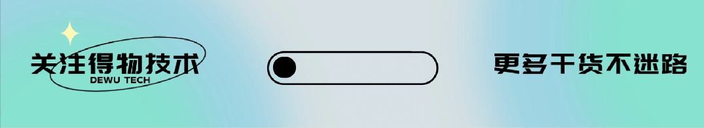

## 目录

- 一、引言

- 二、AI Native 下核心系统稳定性的挑战

- 三、AI Native 核心系统编码全流程稳定性治理思路

- 四、插件流水线设计 —— 插件的五道关口

- 1.第一道关口：需求澄清 —— 保证方向不错

- 2.第二道关口：技术方案设计

- 3.第三道关口：编码执行 TDD Implement

- 4.第四道关口：门禁卡控

- 5.第五道关口：全流程埋点监控

- 五、写在最后

- 一

- 引言

- 订单系统是交易链路的核心命脉，直接承载用户所有下单与支付行为，其稳定性直接决定业务盈亏。为此，我们耗时一年多，完成了订单系统由外而内的三阶段改造。

- **第一阶段筑牢稳定底线：**以 SLA 99.99%、杜绝跌单为目标，梳理下游依赖、搭建三级保障规范，规避下游抖动拖累主链路。

- **第二阶段剥离核心链路：**以支付节点为分界，将订单创建、支付回调等核心能力从老旧应用中独立拆分并专属保障。

- **第三阶段模块化重构链路：**按业务语义重构执行序列，实现各环节模块化分层并配齐全链路埋点。

- 三阶段改造落地后，订单系统实现了稳定性兜底、核心链路隔离、架构模块化、链路可观测的全面升级。但 AI Coding 的普及，给核心系统研发带来了全新的挑战。

- 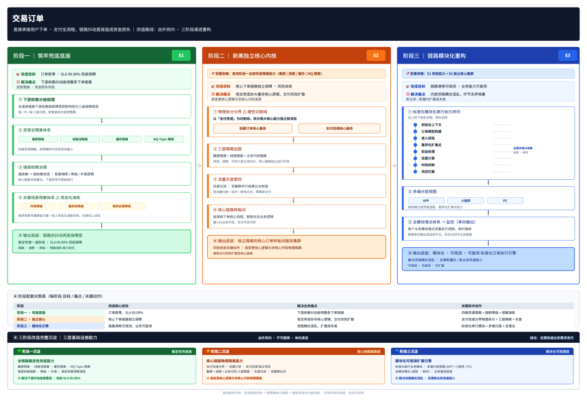

### 二

### AI Native 下核心系统稳定性的挑战

前三阶段的改造为系统打下了**稳定性**、**可扩展性**和**模块化**的基础，但当前仍面临以下挑战：AI 让代码产出又快又多（人均增加近 3 倍），但**质量并不会因生成速度提升而自动提升**。约束不够强、知识不够全，AI 就会"又快又稳地把错的东西复制一千份"。具体挑战归纳为：

- **错误模式迁移：**从"个人手误"转向"系统性偏差"，AI 倾向复用历史模式，错误容易批量复制。

- **知识结构化压力：**约束规约散落各处时，AI 等同于"看不见"团队积累。

- **代码量与审查力失衡：**变更量是之前的数倍，但 CR 资源不同步增加，缺陷逃逸风险被放大。

- **故障回溯难：**人 + AI 协同完成的代码，事后难定位根因（知识库/skill/规约/prompt 哪里出错）。

- **单点提效，链路熵增：**编码变快但前后步骤没变快，阶段间信息折损变大，整条链路熵在增加而非减少。

问题不在 AI 不会写代码，而在旧流程没有给 AI 准备可执行的输入和可验证的出口——旧流程是为"人理解人"设计的，要重新设计的不是 AI，而是它工作的流水线。本文分享：如何将适配传统人工研发的旧流程，重构为适配 AI 编码的五道标准化关口——需求澄清、技术方案、TDD 实施、门禁卡控、全流程埋点监控。

### 三

**AI Native 核心系统编码全流程稳定性治理思路**

## 第一章的五个挑战背后其实是同一件事：旧流程是给"人理解人"设计的。治理思路就是把研发流水线重构成五道关口，让每个痛点在源头就被接住

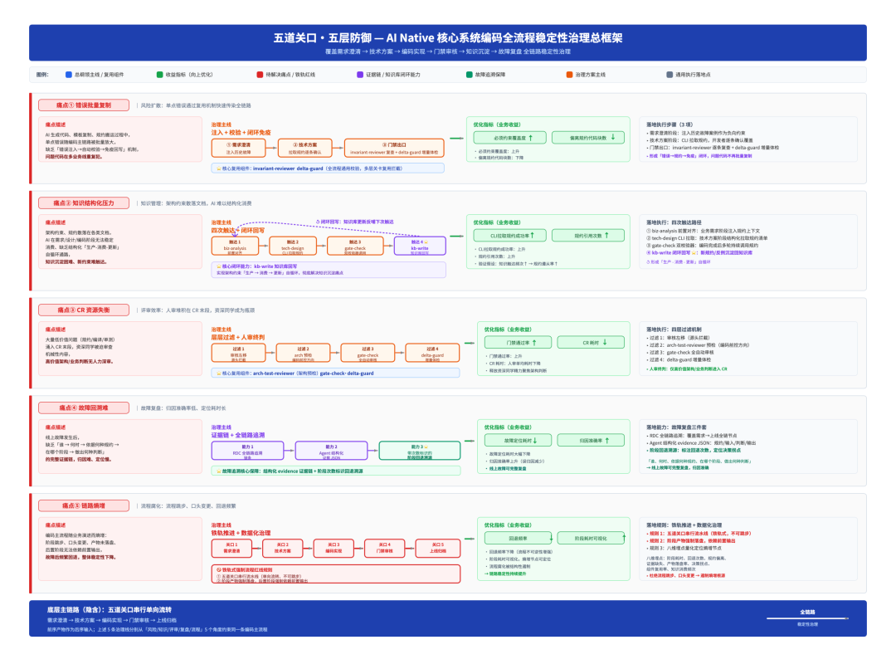

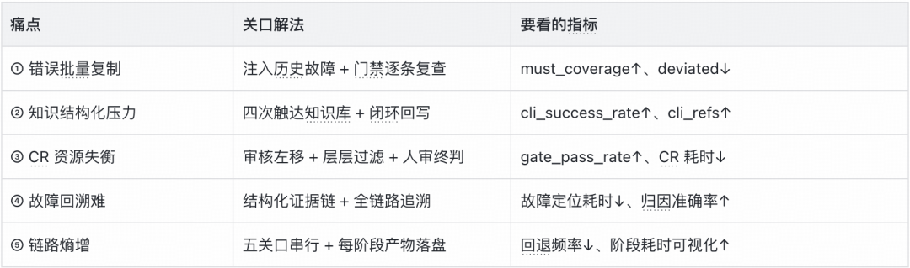

### 四

### 插件流水线设计 —— 插件的五道关口

**定位：**一个 Claude Code 的 Spec-Driven 开发插件，把"需求澄清→技术方案→执行计划→TDD 实施→准入准出"串成一条带用户确认门控的工作流。

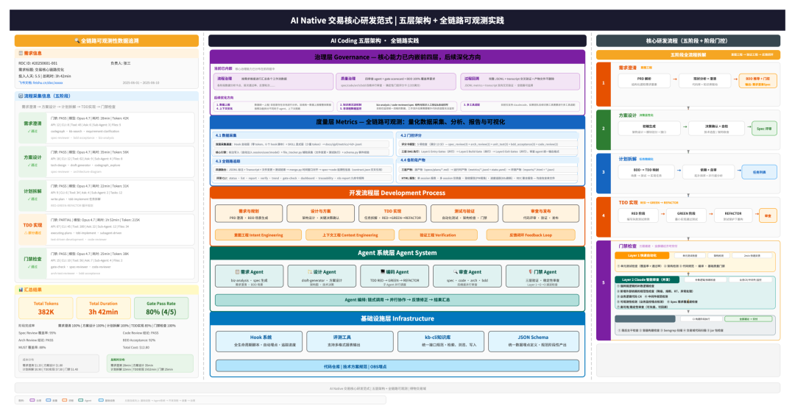

### 整体采用五层自底向上的架构设计

- **基础设施层：**统一埋点定义和阶段性产出规范，双层采集通道（Hook 自动层 + SKILL 显式层）实现全链路数据采集。

- **Agent 系统层：**设计 Agent、意图工程、上下文工程，通过"链式调用→并行协作→反馈修正→结果汇总"编排。

- **开发流程层：**定义五阶段核心研发流程。

- **度量层：**全链路可观测，量化数据采集、分析、报告与可视化。

- **治理层：**顶层保障，将核心治理能力（spec/code/arch/BDD 四维并行审查）内嵌到前四层。

### 第一道关口：需求澄清——保证方向不错

工作流的第一阶段是需求澄清。在这一步，我们不产出任何代码，甚至不讨论代码——只做一件事：让业务意图被精确地、结构化地记录下来。

拿贯穿全文的案例说：出海下单支持礼品卡，礼品卡金额 = 礼品卡面值 + 出海服务费。算错是资损，且有一个跨环节约束——确认订单和创建订单两处都要算礼品卡金额，漏一处就会出现确认时和下单时金额对不上。在需求澄清关口，我们要钉死的是"算什么、什么情况算错了要阻断"。

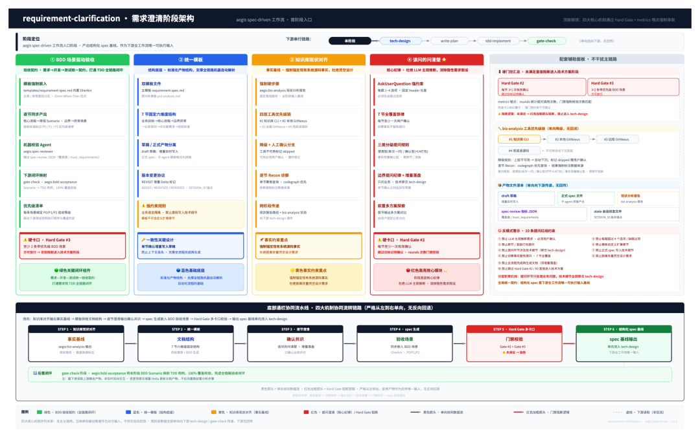

**BDD 场景驱动验收：Spec 里写的，就是后面测的**

落到出海礼品卡上，Gherkin 场景这样写：

- **正常路径：**Given 出海下单选礼品卡支付，面值 100 元 + 出海服务费 10 元，When 用户确认订单，Then 礼品卡金额 = 110 元。

- **异常边界：**Given 礼品卡面值 + 服务费计算后金额异常，When 下单，Then 阻断并提示，不创建异常金额订单。

- **优先级标定：**礼品卡金额一致性场景标 P0，必须通过才能发布。

后续的 BDD-acceptance agent 会把每条 Gherkin 场景一对一映射到 TDD 用例，逐条验收——需求、测试、实现三者一一对齐。传统流程中 PRD 是"给人看的文章"，AI 读完后"猜"要做什么、测试再"猜"要测什么，两次传递两次折损；我们强制在需求阶段产出 Gherkin 场景（Given-When-Then）作为需求与测试之间的"硬契约"，让验收标准从一开始就是机器可读、可执行的。

**统一模板，禁止技术语言：让 Spec 成为"通用语言"**

**Spec 固定六节：**①文档基本信息 ②业务目标与用户价值 ③核心业务流程 ④边界条件与异常场景 ⑤业务规则与协作边界 ⑥优先级与验收方法。每节强制业务语言，技术术语一律屏蔽：

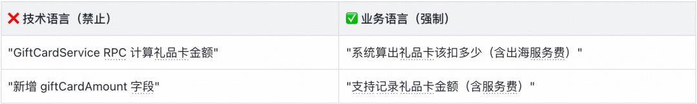

字段类型、表结构、接口签名、上下游系统名一律不写（tech-design 阶段的事）。模板由独立子 Agent 渲染、不注入主会话上下文，保证产出格式稳定一致。

**结合知识库做现状对齐：让 AI"带着上下文"理解需求**

需求澄清开始前，自定义插件会自动触发获取对应知识库信息，传入 PRD 中的业务场景关键词，从知识库 + 代码现状中拉取一份"现状分析报告"。这份报告是需求澄清的事实底座，作用是：

- **避免凭印象描述现状：**AI 不会"觉得"某个功能现在是怎么工作的，而是基于代码和文档的事实。

- **避免新增能力与已有逻辑撞车：**写新需求前先知道"这块之前是怎么设计的"。

- **澄清过程可回溯：**每个判断都能溯源到知识库或代码，而不是拍脑袋。

### 提问而非假设：把"该问的问清楚"

按"该问 / 不该问 / 可跳过"三类管理提问：

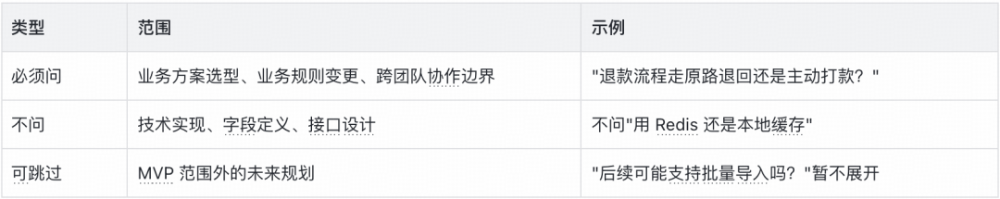

需求澄清关口核心：BDD 钉死验收、模板屏蔽技术语言、知识库兜住现状、提问管理该问不该问——让"做什么"和"怎么算做完"在起点就被精确记录。

### 第二道关口：技术方案设计

承接上一关口：需求澄清把"算什么"（What）钉死，技术方案这一关口要回答"怎么改"（How）和"算错了怎么兜"（Fallback）。核心思想一句话——**不让 AI 在编码时临场发挥，所有设计决策在编码前就被锁定**。

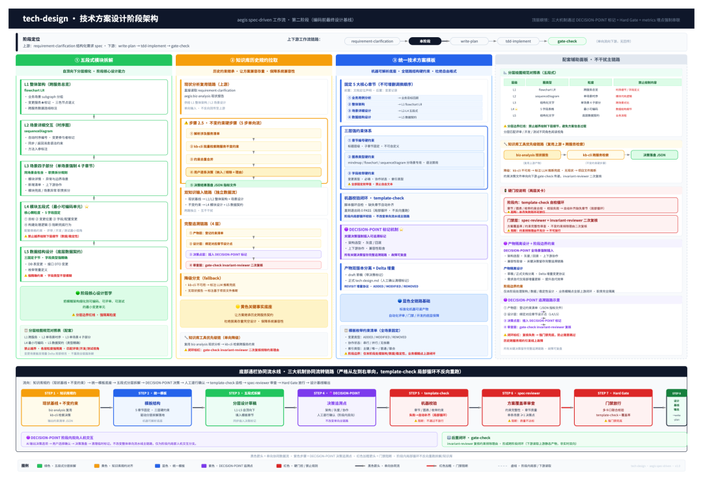

**分析要改动的模块：从"整体架构"拆到"五段式"**

拿到需求 Spec 后，tech-design 阶段不会直接跳进代码细节。先做自上而下的模块拆解：

- **第一步：解析服务清单。**从需求规格的"整体架构/跨服务总览"章节解析本次涉及的服务清单。

- **第二步：逐服务拆到模块粒度。**每个涉及的服务按场景拆解，每个场景下固定五个子部分：

```

▎ 场景详细设计（每个场景固定五部分）
├── 模块详情（五段式结构）
│   ├── 目标：这个模块要达成什么
│   ├── 变更位置：改哪个类、哪个方法
│   ├── 字段/配置变更：加什么字段、改什么配置
│   ├── 构建/处理逻辑：核心处理流程
│   └── 阻断/兜底行为：异常时怎么处理
├── 异常与边界：边界条件清单
├── 新增清单：新增的类/方法/配置
└── 上下游协作（表格形式）
    ├── 上游依赖项
    ├── 下游影响项
    ├── 是否需要对方改动
    └── 联合设计状态

```

落到出海礼品卡上，五段式是这样写的：

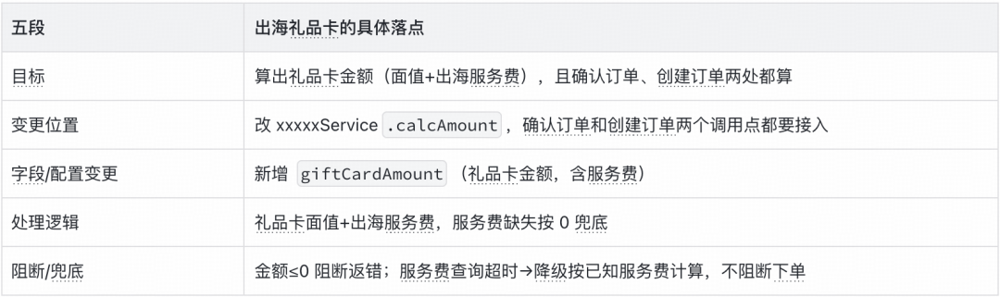

**从知识库拉取模块规约：让方案"知道历史"设计**

出海礼品卡需求拉取时，会命中一条关键跨环节不变约束："确认订单要算礼品卡金额（含出海服务费）""创建订单也要算——两处算法必须一致"。命中的约束逐条让用户选"纳入"还是"明确排除"——排除必须填理由，理由在门禁阶段会被强制复查，防止有人为图省事把关键约束排除了。纳入的约束作为场景详细设计的输入，方案从一开始就"长"在规约上，并像影子跟到编码和门禁阶段，"入口拉了哪些规约，出口就查哪些规约"，形成完整证据链。CLI 不可用时降级跳过并在产物中明确标注，不静默漏过。

**统一技术方案模板：章节编号、图表类型全部硬约束**

所有技术方案走统一模板，五大核心章节固定顺序：一、业务用例分析 → 二、整体架构 → 三、场景详细设计 → 四、数据结构设计 → 五、稳定性设计。

**层面一：模块详情层的"阻断/兜底行为"**——每个模块必须明确具体动作（阻断/降级/默认值），不能只写模糊的"兜底处理"。

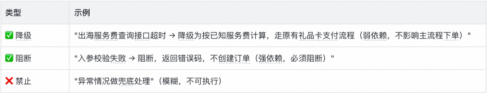

**层面二：稳定性设计层（第五章）**——按可灰度 / 可监控 / 可回滚三维度展开，弱依赖模块在这里补全熔断、降级链路：

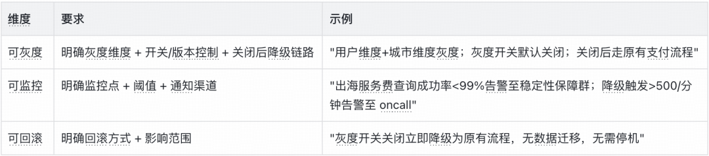

### 第三道关口：编码执行 TDD Implement

承接上一关口：技术方案把"怎么算"锁死后，编码就变纯粹——照方案"翻译"成代码，再用 TDD 卡住"做完没"。

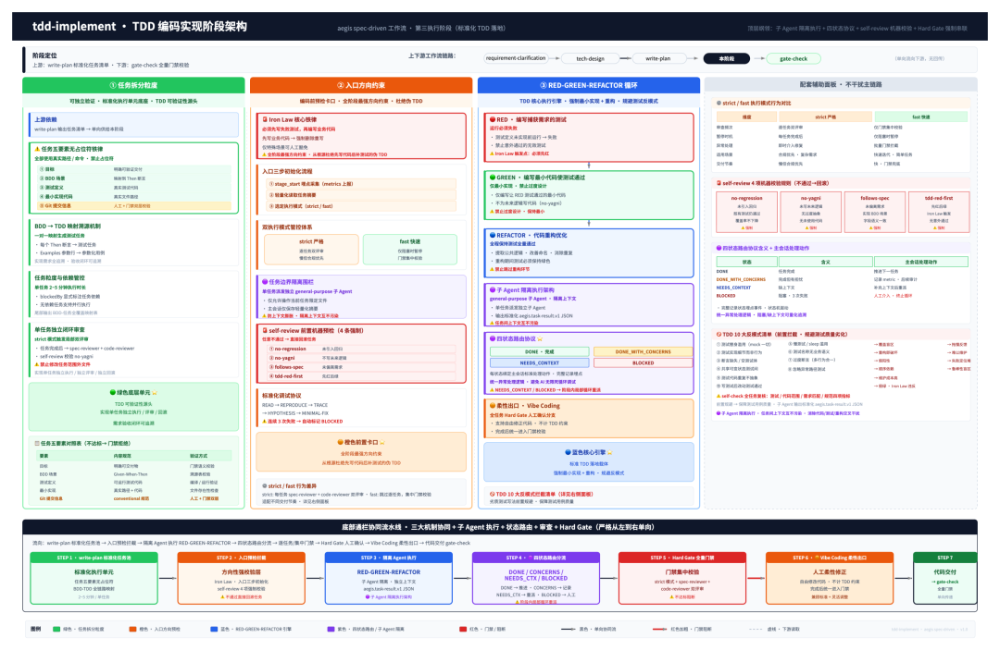

### 任务拆分（write-plan）：可独立验证

技术方案被拆解为可独立验证的任务列表，每个任务有三个硬约束：

- **足够小，可独立完成**——一个任务的产物应该是可独立 review 的最小单元。

- **有明确的 RED/GREEN 验证点**——先写测试（RED），再写实现（GREEN），没有例外。

- **可独立回退**——任务失败时可以单独回退，不影响其他任务。

这样拆解的目的是：把"写一段大代码"这件事，变成"完成 N 个小任务"。每个小任务都有明确的入口（失败的测试）和出口（通过的测试）。AI 不再有"自由发挥"的空间——想写代码，先证明你想清楚了它该怎么测。

### 架构预检（入口）：编码前先卡方向

编码前，架构检测先卡一次：

- **分层是否越界**——比如 Controller 层直接调 DAO 层，跳过了 Service 层。

- **依赖方向是否反转**——比如领域层反向依赖了基础设施层。

- **模块边界是否穿透**——比如订单模块直接调用了支付模块的内部类。

这一步的设计意图是：避免实现跑偏后再返工——方向错了，代码写得再快也没用。架构预检是"事前防"，比"事后查"成本低得多。

### RED-GREEN 循环：先写测试，再写代码

TDD 的三步循环：

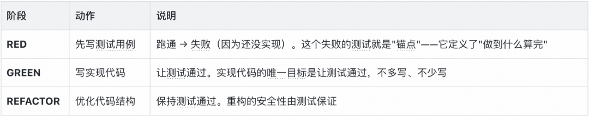

放到出海礼品卡上，三步循环是这样跑的：

- **RED：**先写"礼品卡面值 100 + 出海服务费 10 = 110 元"的测试，预期礼品卡金额 = 110 元。

- **GREEN：**实现 GiftCardCalculator.calcAmount 让测试通过。

- **REFACTOR：**把"面值 + 服务费"的算法抽成公共方法，确认订单和创建订单复用同一份。

TDD 确保每行代码都有对应测试，测试又对应到需求澄清的 Gherkin 场景——需求→方案→计划→测试→代码，一条完整可追溯链。

**为什么 TDD 在 AI 时代格外重要？**AI 写代码最大的问题不是写不出来，是它太自信了。它会在没有测试的情况下，写一段看起来很合理的实现，然后自信地告诉你"完成了"。TDD 的价值在于，**先有一个失败的测试摆在那里，AI 必须让这个测试通过**——这是一个客观的、不可糊弄的锚点。没有 TDD，AI 的"完成"是主观判断；有了 TDD，AI 的"完成"是测试通过——客观、可验证、不可糊弄。

### 第四道关口：门禁卡控

承接上一关口：编码过了 TDD，最后一道关口是门禁——但"审核"不只发生在 gate-check，每个阶段产物落地都有对应审核，gate-check 是最终汇总。门禁的设计遵循四个核心原则：

- **机器判定为主：**每个审核 Agent 输出结构化 JSON，门禁读 JSON 判 PASS/FAIL，不靠 LLM 主观总结。

- **人工决策为辅：**只有关键决策点（如回退方向、排除规约的理由）才需要人确认。

- **所有结论落本地磁盘，数据可回溯：**每一步都有结构化证据，不是"凭印象觉得没问题"。

- **失败必须回退到具体阶段：**门禁 FAIL 不是简单打回重来，而是定位到具体阶段、具体问题。

### 全流程审核分布：门禁不止在最后

审核机制贯穿全流程，每个阶段产物落地时都有对应的审核 Agent，gate-check 只是最终汇总：

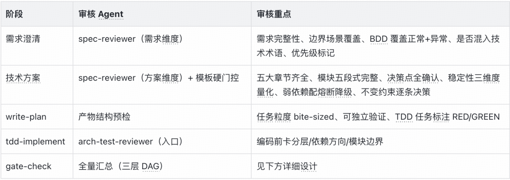

放到出海礼品卡需求上看门禁怎么查：

- **invariant-reviewer：**技术方案阶段"纳入"的"确认订单和创建订单都要算礼品卡金额"约束，两处调用点是否都同步改了——只改一处就 FAIL。

- **delta-guard：**新增的出海服务费查询外部调用是否登记、是否有降级——命中"外部调用"检查项，没降级就高亮提醒。

- **bdd-acceptance：**需求 Spec 里"礼品卡 = 110 元""金额 ≤ 0 阻断"两条 Gherkin 场景，必须有对应测试且全部通过。

**门禁检查三层 DAG 结构：层内并行、层间串行**

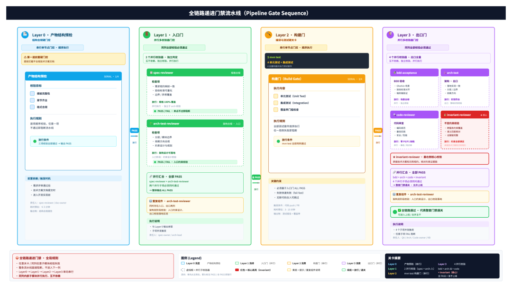

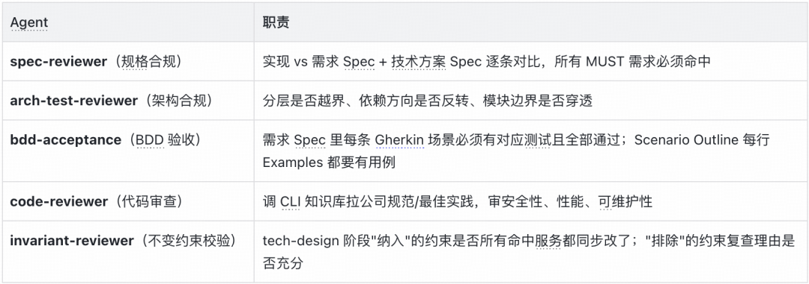

### 增量代码体检，合入门禁前的"快速拍片"

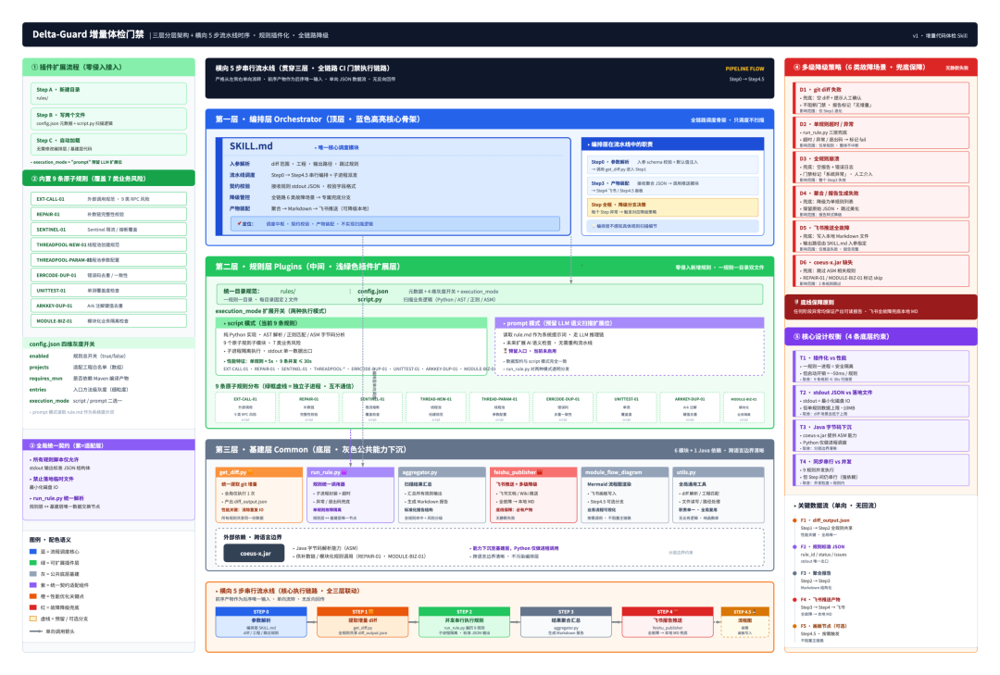

增量代码检测是"代码准入检查"的工具，主要用于合并代码前的自动审查和开发者本地自查。它会用 9 个维度扫描本次改动的代码——比如有没有引入新的外部调用、新的线程池、错误码是否重复、关键调用链上有没有动到不该动的节点等——然后把结果整理成一份飞书报告，直接发到项目组的知识库下。

- **可扩展：**每条规则是独立小目录，一个配置 + 一个扫描脚本，新增规则不动其他地方，预留大模型判断扩展位。

- **可复用：**解析代码差异、查代码作者、生成飞书文档等基础动作下沉为共用工具，代码差异只解析一次，9 条规则读同一份数据。

- **轻量级：**纯文本扫描 60 秒超时、秒级返回，流水线三级兜底，单条规则挂了不拖累其他，飞书发不出也留本地文件。

### 第五道关口：全流程埋点监控

承接上一关口：前四道关口是"闸门"，这一道是"仪表盘"——告诉你改进到底有没有效果。

埋点监控把研发过程变成数据：这次需求花了多少人力成本、哪个阶段最耗时、知识库调用成功率高吗、门禁通过率在变好还是变差、回退了两次根因是需求没写清还是方案设计漏了。让改进有据可依。

### 看板分三层，从需求到代码逐层下钻

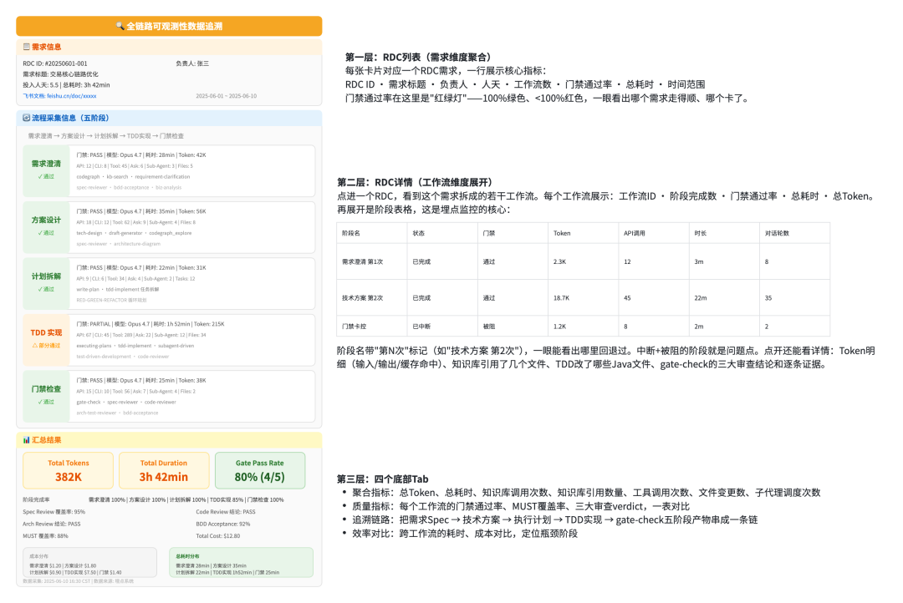

### 五个维度观察

把看板上的指标按"问什么问题"归类：

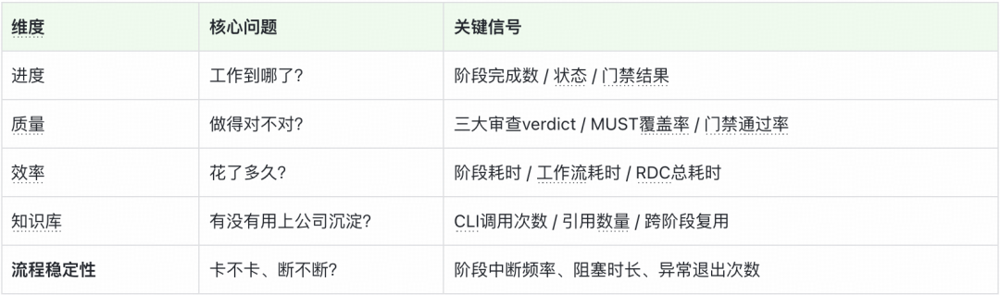

### 埋点如何驱动改进：三个典型场景

**场景一：知识库补充——从用户问答里挖"该补什么"**

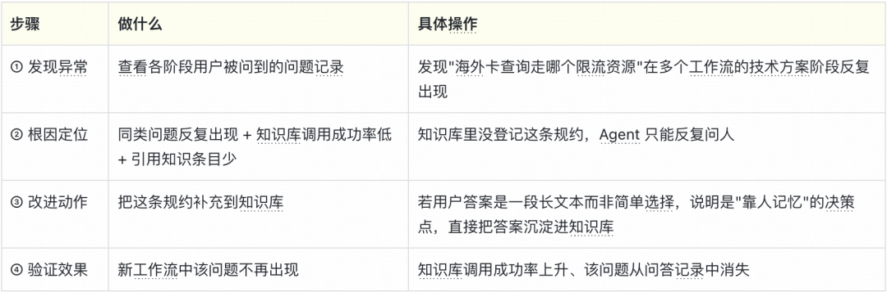

信号组合：知识库调用成功率低 + 引用知识条目少 + 用户问答多 → 知识库要么内容少、要么命中率低。高频问题清单就是知识库该补充的内容清单。

**场景二：流程优化——从耗时和对话轮数里找"哪里设计得不好"**

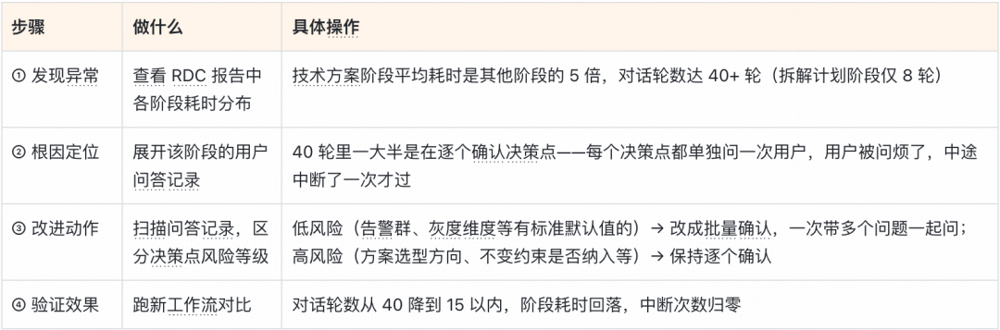

核心判断标准：耗时高不一定是问题，但耗时高 + 对话轮数异常高一定是流程设计问题，不是模型慢。

**场景三：子代理与工具调用收敛——从"谁在白干"里找"哪里该收敛"**

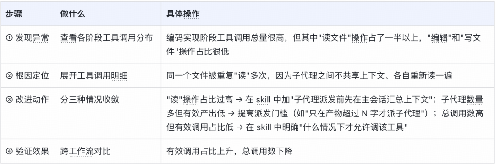

### 五

### 写在最后

AI Coding 走到下一阶段，比拼的不再是谁的模型更强，而是：谁能把 AI 的产出，变成可验证、可度量、可负责的研发生产方式。这五个字——可验证、可度量、可负责——才是 AI Native 研发范式的核心。模型能力是变量，流程设计是常数。变量决定上限，常数决定底线。交易核心系统的底线，不能交给变量。

### 往期回顾

## 1. 推荐系统体验的数字化突破：得物自动化评测平台的技术实践｜AICon 文章整理

## 2. RAG 核心概念与原理：Chunking、Embedding、相似度、HNSW 与多路召回｜得物技术

## 3. 从"机械应答"到"服务伙伴"：得物高可控智能客服的 Agent 工程实践｜AICon 演讲整理

## 4. 得物推荐系统诊断 Agent：从 “调接口” 到 “会思考”｜AICon 演讲整理

## 5. 得物 OceanBase 落地实践

文 / 行亦

关注得物技术，每周三更新技术干货

要是觉得文章对你有帮助的话，欢迎评论转发点赞～

未经得物技术许可严禁转载，否则依法追究法律责任。

“

### 扫码添加小助手微信

如有任何疑问，或想要了解更多技术资讯，请添加小助手微信：


