# 📰 企业级 MultiAgent 的记忆系统：短期上下文与四层记忆架构实现｜得物技术


## 目录

- 一、背景及整体架构概览

- 二、记忆架构概览

- 三、短期记忆加载详情

- 1.关键实现

- 2.Redis 存储结构

- 3.Token 窗口控制策略

- 四、短期记忆写入详情

- 五、长期记忆加载实现详解

- 1.并行加载设计

- 2.语义检索实现

- 3.Token Budget 分配策略

- 六、长期记忆写入实现详解

- 1.写入入口与去重

- 2.LLM 智能判断

- 3.去重与冲突处理

- 4.先写后删策略

- 七、核心设计与运行观测

- 八、总结与后续工作

- 一

- 背景及整体架构概览

- 在 MultiAgent 平台中，Agent 一次请求可能同时经过模型、MCP/A2A 工具、RAG、Workflow 和 Sandbox，还要在多轮对话和跨会话协作中记住用户偏好、任务进展与协作约定。因此记忆模块不是独立外挂，而是 Agent 执行链路的一部分。

- 在本项目中，记忆不是把全部历史简单拼到 Prompt，而是分别承接会话上下文、跨会话信息和上下文关联：

- **会话延续：**短期历史无法支持指代消解和任务延续。

- **跨会话复用：**跨会话无法复用用户偏好和稳定事实。

- **上下文关联：**新增消息无法与已有上下文建立关联。

- 选型 MemOS：**在 1540 个问题、10 个测试用户的评测中，综合得分 74.33%，单跳与多跳表现均达标（评测仅作选型参考，不代表生产 SLA）。

- 整体架构：**后端基于 Spring Boot 3 和 Java 17，Agent 编排采用 AgentScope。新建 Agent 默认将 longMemoryProvider 设为 MEMOS，但 openLongMemory 默认关闭；开启后，请求开始时短期会话历史和长期记忆并行加载，会话结束后由 onSessionEndAsync 异步完成筛选、去重和长期沉淀。短期记忆以 MySQL 为持久化底座、Redis 为热点缓存，长期记忆以 MemOS 为主路径，同时保留 MySQL/Mem0 路由作为兼容路径。

- 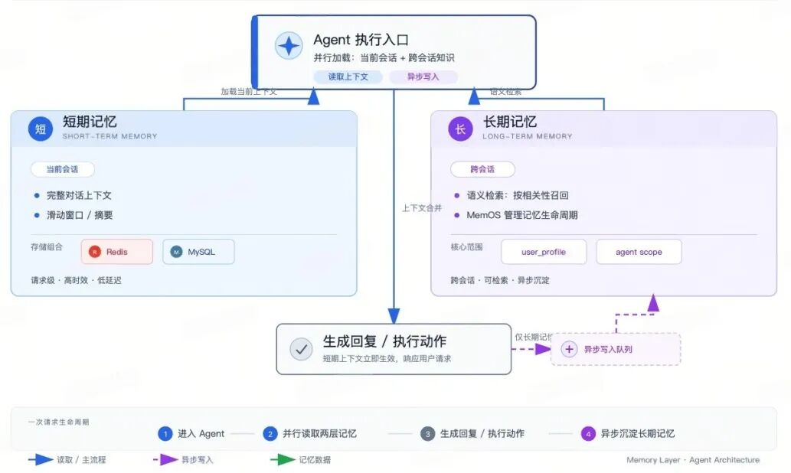

- 本文只展开记忆模块的实现：**包括四层记忆模型、短期历史的读取与写入、MemOS 的按 scope 检索，以及会话结束后的异步沉淀。

### 二

### 记忆架构概览

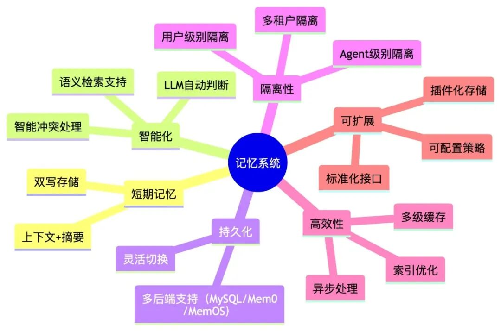

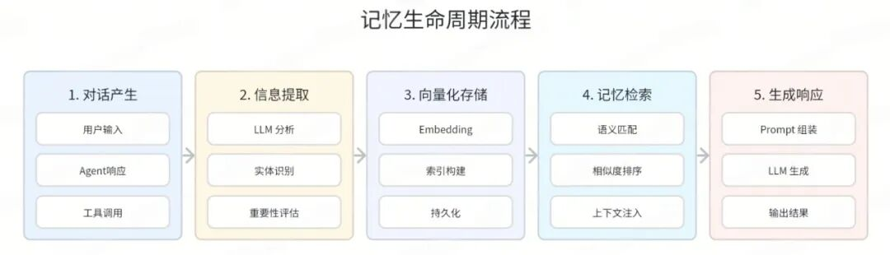

### Agent 四层记忆模型

四层分别对应不同的生命周期：Working Memory 只服务当前一步推理；Session Memory 保存会话内的消息历史；User Memory 记录跨 Agent 共享的偏好和稳定事实，对应 MemOS 的 user\_profile；Agent Memory 保存某个 Agent 的任务经验和协作约定，对应 agent\_{agentId}。会话结束后，新增消息经过判断和去重，再从 Session 层沉淀到 User 或 Agent 层。

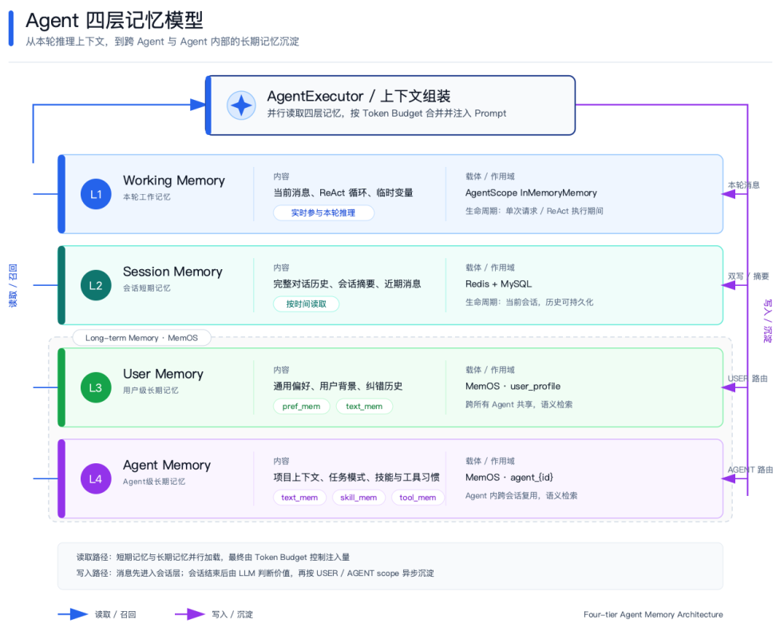

Agent 四层记忆模型：Working、Session、User 与 Agent Memory 的读取、作用域和异步沉淀链路。

### 记忆类型

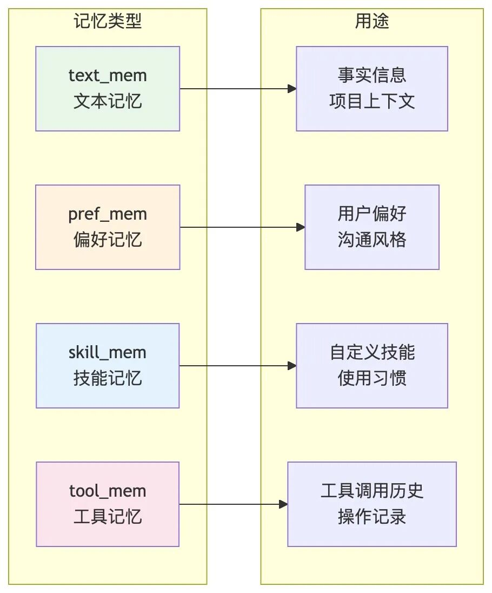

**四层模型与 MemOS 类型是两套分类维度：**四层模型描述信息的生命周期和作用域；MemOS 的 text\_mem、pref\_mem、skill\_mem、tool\_mem 描述记忆内容形态，不能直接与四层一一对应。

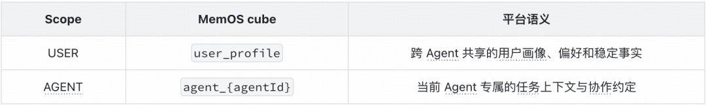

**当前路由行为：**longMemoryProvider 未配置、Agent 不存在或读取配置异常时，MemoryRpcServiceImpl 选择 MySQL；明确配置为 MEMOS 或 Mem0 时才进入对应 Provider。MemOS 查询异常由 Provider 自身记录日志并返回空结果，当前不会自动切换到 MySQL。

### 记忆加载流程

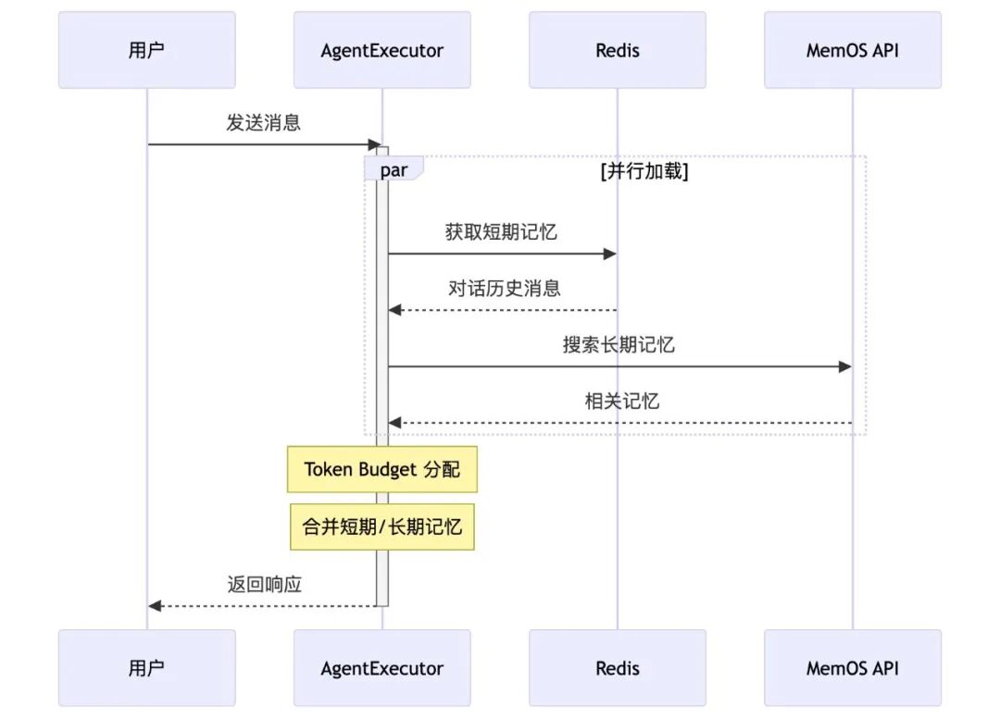

**一次请求的记忆路径**可以概括为：AgentExecutor[#execute]() 解析上下文参数后，在 memoryLoadExecutor 中并行启动短期记忆和长期记忆 Future。短期链路读取 ConversationMemory；长期链路调用 queryMemory，由 MemoryRpcServiceImpl 按 Agent 配置选择 MEMOS、Mem0 或 MySQL。

* 长期记忆检索返回后，平台按 user\_profile 与 agent 分组，过滤敏感或低相关内容，并限制每个 scope 的条数。

* 随后以固定 tokens 为默认预算，优先满足用户画像，再把剩余预算分配给 Agent 专属记忆。

* 最终结果写入 AgentContext，与短期消息一起参与后续模型调用；会话结束后再异步触发长期记忆沉淀和上下文摘要。 

**实现边界：**平台的 ConversationMemory 负责会话历史读取和窗口裁剪；AgentScope Harness 的 state store 负责会话状态持久化，有 Sandbox 时使用共享工作区文件存储，没有 Sandbox 时回退到内存存储。当前 ModelInvoker 主链路构造 Harness 消息时，以本轮 userMsg 为入口，因此不能简单理解为 Redis/MySQL 历史会被无条件直接拼进每一次 AgentScope Prompt。

### 短期记忆 vs 长期记忆

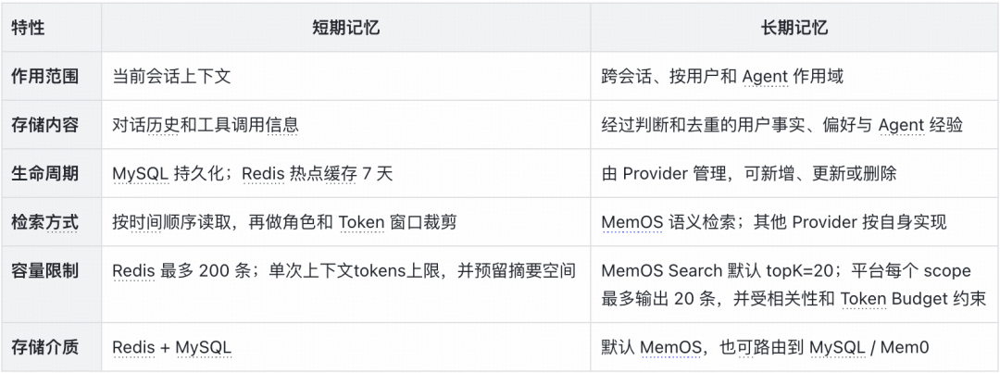

### 关键组件及方法

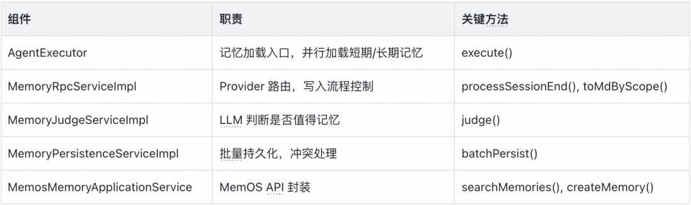

### 三

### 短期记忆加载详情

短期记忆（Session Memory）保存当前会话中按时间排列的对话历史，是指代消解和多轮推理的直接上下文。实现重点是读取时延、Redis/MySQL 回退以及 Token 窗口控制。

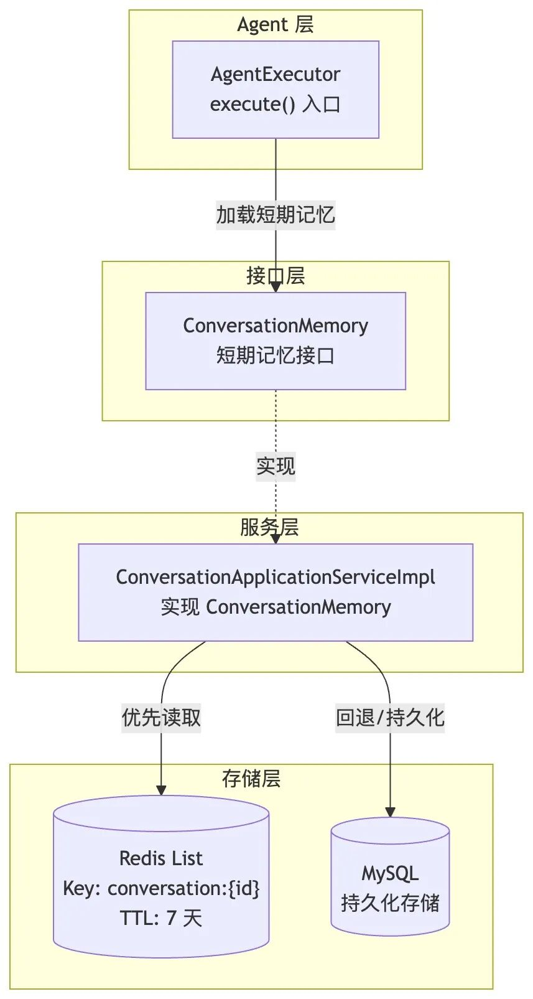

加载流程图

### 调用链说明：

* AgentExecutor 从 AgentContext 获取 AgentConfig → ModelBindConfigDto → contextRounds。

* AgentExecutor 调用 chatMemory.get(conversationId, contextRounds \* 3)。

* chatMemory 是 ConversationMemory 接口，由 ConversationApplicationServiceImpl 实现。

* 实现类优先从 Redis 读取，失败则从 MySQL 回退。

### 关键实现

完整实现还包括消息类型转换、system 消息拆分及工具调用信息处理。下面只保留“读取 → 交替校验 → Token 窗口判断”的主路径，便于理解短期记忆如何形成模型上下文。

```

// DTO 已转换为 Message，system/tool 消息已拆分
trimAlternationFromEnd(chatMsgs);
int windowSize = MAX_TOKEN_WINDOW_SIZE - SUMMARY_TOKEN_BUDGET;
int totalTokens = 0, recentTokens = 0;
boolean overLimit = false;
List recentWindow = new ArrayList<>();
for (int i = chatMsgs.size() - 1; i >= 0; i--) {
    Message message = chatMsgs.get(i);
    int tokens = TikTokensUtil.tikTokensCount(message.getText());
    totalTokens += tokens;
    if (!overLimit && recentTokens + tokens <= windowSize) {
        recentWindow.add(0, message);
        recentTokens += tokens;
    } else {
        overLimit = true;
    }
}
if (totalTokens <= MAX_TOKEN_WINDOW_SIZE) {
    removeLeadingAssistant(chatMsgs);
    return mergeSystemAndChat(systemMsgs, chatMsgs);
}
removeLeadingAssistant(recentWindow);
String summaryMd = iMemoryRpcService.getConversationSummaryMd(Long.parseLong(cid));
if (StringUtils.isNotBlank(summaryMd)) {
    recentWindow.add(0, new SystemMessage(summaryMd));
}
return recentWindow;

```

**Redis 优先读取，类说明：**ConversationApplicationServiceImpl[#getMessagesFromCache]() 先读取 Redis List，命中后把 JSON 转为 ChatMessageDto，并翻转为 oldest-first；未命中或读取异常则查询 MySQL，再按倒序 leftPush 回写，设置 CACHE\_TTL\_SECONDS，并用 rightPop 按 MAX\_CACHED\_MESSAGES 淘汰最旧消息。逐条解析和异常日志属于防御性代码，这里不展开。

### Redis 存储结构实现细节

使用 leftPush 写入，最新消息在 index 0；当前实现使用 range(0, Long.MAX\_VALUE) 读取 Redis 列表，再在应用层做窗口裁剪；使用 rightPop 移除最旧消息 需要注意，ConversationMemory[#get]()(String, int) 的 lastN 参数当前未参与 Redis 的 range 边界计算；实际读取范围由 Redis 列表内容和后续 Token 窗口共同决定。Redis 只承担热点缓存，MySQL 仍是冷启动回源和持久化兜底。

### Token 窗口控制策略

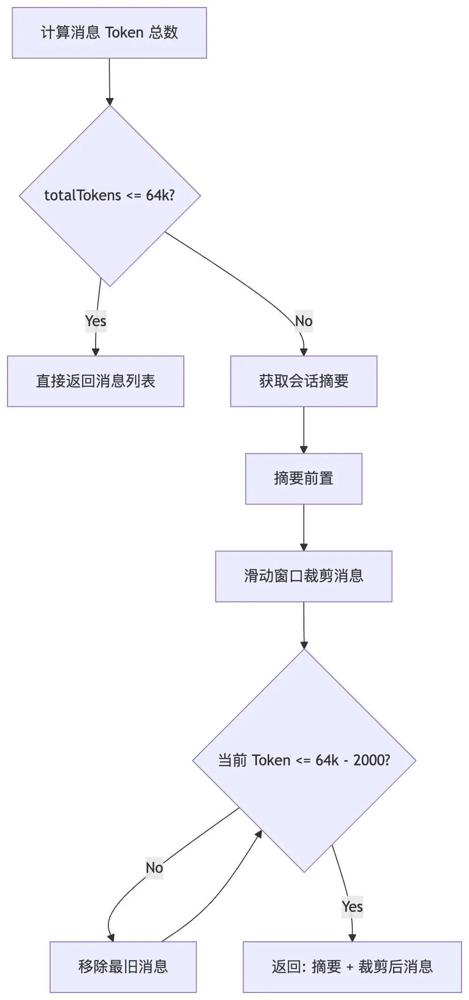

### 四

### 短期记忆写入详情

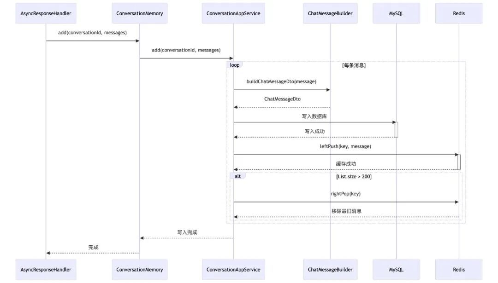

写入时序图

**双写的意义——****MySQL ：**持久化兜底防止数据丢失。**Redis：** 高性能读取支撑实时对话。**回退机制：** Redis 失败时仍可从 MySQL 回退读取。

```

messages.forEach(message -> {
    String conversationId0 = conversationId;
    if (conversationId0.startsWith("agent:")) {
        // 子 Agent 的非 ChatMessage 不写入主会话，避免虚拟会话污染主链路。
        if (message instanceof ChatMessageDto) {
            conversationId0 = conversationId.replace("agent:", "");
        } else {
            return;
        }
    }
    ChatMessageDto chatMessage = ...; // 类型转换、清洗文本并补齐租户字段
    ConversationMessage conversationMessage = ...;
    // 先落 MySQL，Redis 只作为可失效的热点缓存。
    Long messageId = TenantFunctions.callWithTenantId(chatMessage.getTenantId(),
        () -> conversationDomainService.addConversationMessage(conversationMessage));
    chatMessage.setIndex(messageId);
    try {
        String key = generateConversationKey(conversationId0);
        redisUtil.leftPush(key, JSON.toJSONString(chatMessage));
        redisUtil.expire(key, CACHE_TTL_SECONDS);
        long size = redisUtil.size(key);
        // 最新消息在表头，超出 200 条时从尾部淘汰最旧消息。
        if (size > MAX_CACHED_MESSAGES) {
            redisUtil.rightPop(key);
        }
    } catch (Exception e) {
        // 缓存失败不回滚已完成的 MySQL 写入，读取时会回源数据库。
        log.warn("Failed to cache message to Redis, conversationId={}", conversationId0, e);
    }
});

```

短期消息写入后，onSessionEndAsync 还会检查会话摘要：当未被摘要覆盖的消息达到 20 条才触发摘要生成，摘要注入预算约 2000 tokens，并在 Redis 缓存 1 小时。这样做把高频对话写入与低频摘要合并拆开，避免每轮都调用摘要模型。

### 五

### 长期记忆加载实现详解

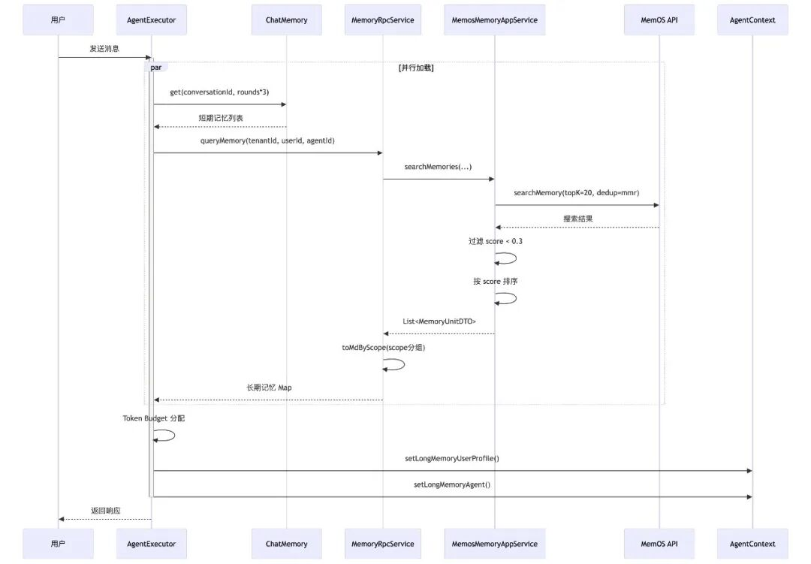

加载时序图

### 并行加载设计

在 Agent 执行入口 AgentExecutor[#execute]() 中，我们采用 CompletableFuture 实现短期记忆和长期记忆的并行加载：

```

final int finalContextRounds = contextRounds;
CompletableFuture> contextMessagesFuture = CompletableFuture.supplyAsync(() -> {
    // contextRounds=0 是合法配置，直接跳过短期历史读取。
    if (finalContextRounds <= 0) {
        return new ArrayList();
    }
    return new ArrayList<>(
        chatMemory.get(agentContext.getConversationId(), finalContextRounds * 3));
}, memoryLoadExecutor);

CompletableFuture> longMemoryFuture = CompletableFuture.supplyAsync(() -> {
    if (agentContext.getAgentConfig().getOpenLongMemory() != AgentConfig.OpenStatus.Open) {
        return Collections.emptyMap();
    }
    try {
        AgentComponentConfigDto modelComponentConfig =
            agentContext.getAgentConfig().getModelComponentConfig();
        // queryMemory 需要绑定模型的 targetId，未绑定时不发起长期检索。
        if (modelComponentConfig == null || modelComponentConfig.getTargetId() == null) {
            return Collections.emptyMap();
        }
        boolean justKeywordMatch = resolveJustKeywordMatch(agentContext);
        // originalMessage 是主查询词；此处 context 为空，短期历史不会反向增强本次 query。
        return conversationApplicationService.queryMemory(
            agentContext.getUser().getTenantId(), agentContext.getUser().getId(),
            agentContext.getAgentConfig().getId(), modelComponentConfig.getTargetId(),
            agentContext.getOriginalMessage(), "", justKeywordMatch,
            agentContext.isFilterSensitive());
    } catch (Exception e) {
        // 长期记忆是增强能力，查询失败时让主对话继续。
        log.warn("查询长期记忆失败", e);
        return Collections.emptyMap();
    }
}, memoryLoadExecutor);

// 这里才是并行结果的汇合点，主流程等待两条记忆链路都完成。
agentContext.setContextMessages(contextMessagesFuture.join());
Map longMemoryMap = longMemoryFuture.join();

```

**设计要点：**使用专用线程池 memoryLoadExecutor，避免 ForkJoinPool.commonPool 争抢；长期记忆不阻塞短期记忆，用空 context 先行查询。

**边界与降级：**关闭 openLongMemory 时长期 Future 直接返回空 Map；Agent 未绑定模型时跳过长期检索；查询异常也会记录 warning 并返回空结果，主对话继续执行。当前长期查询以 originalMessage 作为主检索词，和短期记忆的读取互不等待，因此并行带来的是执行重叠，不是"短期历史已注入后再增强查询"。

### 语义检索实现

MemOS Search 请求保留以下参数；context 非空时，平台只取前 200 个字符拼到 userMessage 后作为 query。调用链虽然携带 justKeywordSearch，但当前 MemosMemoryApplicationService 未据此切换检索模式，仍固定调用 MemOS Search。

```

List readableCubeIds = new ArrayList<>();
readableCubeIds.add("user_profile");
if (agentId != null) {
    readableCubeIds.add("agent_" + agentId);
}

MemOSClient.SearchRequest searchRequest = new MemOSClient.SearchRequest();
// 一次 Search 同时覆盖用户画像和当前 Agent 的记忆 cube。
searchRequest.setQuery(buildSearchQuery(userMessage, context));
searchRequest.setUserId(memOSUserId);
searchRequest.setTopK(DEFAULT_TOP_K);
searchRequest.setMode("fast");
searchRequest.setRelativity(0.45);
searchRequest.setDedup("mmr");
searchRequest.setReadableCubeIds(readableCubeIds);
searchRequest.setIncludePreference(true);
searchRequest.setPrefTopK(6);

List searchResults =
    memOSClient.searchMemory(searchRequest).getMemories();
// 转换阶段会过滤低分结果、截断单条内容，再按 score 降序返回。
result.addAll(convertToMemoryUnitDTOs(searchResults, tenantId, userId, agentId));
result.sort((a, b) -> {
    if (a.getScore() == null && b.getScore() == null) return 0;
    if (a.getScore() == null) return 1;
    if (b.getScore() == null) return -1;
    return Double.compare(b.getScore(), a.getScore());
});

```

### 搜索参数说明：

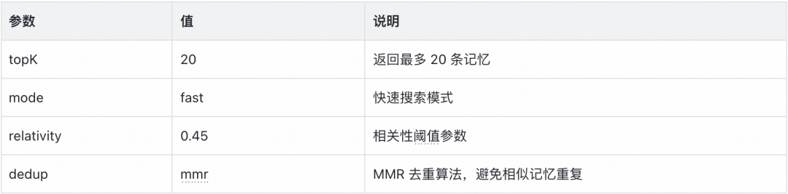

readableCubeIds 当前包含 user\_profile 和 agent\_{agentId}；同时开启 preference 检索，prefTopK=6 用于补充用户偏好。检索结果随后还会经过 score \< 0.3 过滤和单条 1000 字符截断，避免低相关或过长内容挤占上下文。

### Token Budget 分配策略

以下片段承接 5.2 的检索结果，userProfileRaw 与 agentMemoryRaw 分别是按 scope 汇总后的文本。为防止记忆撑爆 Agent 上下文，我们设计了 Token Budget 分配机制。

```

int budget = DEFAULT_LONG_MEMORY_TOKEN_BUDGET; // 4000 tokens
int userProfileRawTokens =
    TikTokensUtil.tikTokensCount(userProfileRaw != null ? userProfileRaw : "");

// user_profile 最多占 60%；实际未用满时，剩余预算让给 Agent 记忆。
if (userProfileRawTokens <= budget * 0.6) {
    userProfile = userProfileRaw;
    agentMemory = truncateLongMemory(agentMemoryRaw, budget - userProfileRawTokens);
} else {
    userProfile = truncateLongMemory(userProfileRaw, (int) (budget * 0.6));
    // 重新计算截断后的 token 数，避免把截断前的估算带入剩余预算。
    int userProfileTokens =
        TikTokensUtil.tikTokensCount(userProfile != null ? userProfile : "");
    agentMemory = truncateLongMemory(agentMemoryRaw, budget - userProfileTokens);
}

```

**截断算法**采用按行截断，保留完整语义：

```

String[] lines = longMemory.split("\n", -1);
for (String line : lines) {
    // 按行累计 token，尽量保留一条记忆的完整内容。
    int lineTokens = TikTokensUtil.tikTokensCount(line + "\n");
    if (currentTokens + lineTokens > budget) {
        break;
    }
    truncated.append(line);
    currentTokens += lineTokens;
}

```

user\_profile 最多占 60% 预算；如果实际占用更少，剩余空间分给 Agent 记忆。两类内容都按行累加 token，达到预算后停止追加，避免拆散单条记忆。

### 六

### 长期记忆写入实现详解

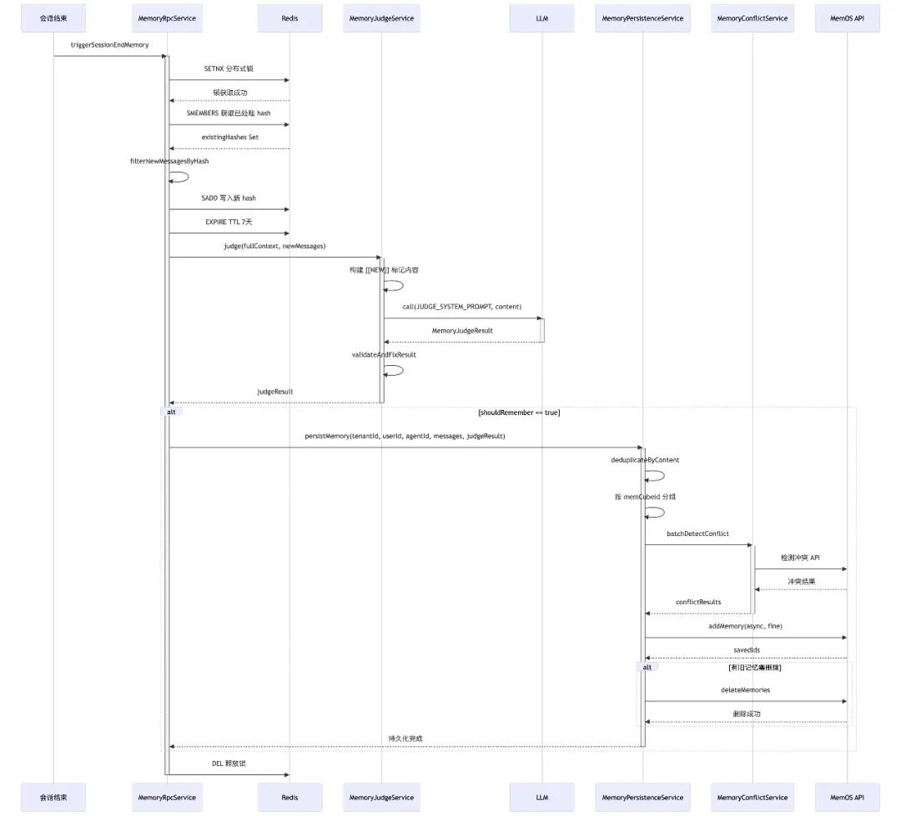

写入时序图

### 写入入口与去重

会话结束时，系统触发记忆写入流程，首先使用 Redis Set 记录已处理消息的 hash 并做去重。

**类说明：**MemoryRpcServiceImpl 负责会话结束后的写入编排，onSessionEndAsync 先获取会话级 Redis 锁，再由 processSessionEnd 按消息 hash 过滤本次新增内容并提前记录已处理 hash，随后根据 Agent 配置选择 provider：MemOS 路径先进行 LLM 记忆判断，再交给 MemoryPersistenceServiceImpl 持久化；MySQL、Mem0 路径则组装完整上下文和最新 user 输入后调用 createMemory。记忆处理完成后，同一异步线程继续检查是否需要生成上下文摘要。

### 设计要点：

* 分布式锁防止并发处理同一会话。

* MD5(role:content) 生成消息唯一标识。

* TTL 7 天自动清理过期记录。

onSessionEndAsync 使用 10 分钟的会话锁，已处理消息 hash 的 TTL 为 7 天。hash 会在 LLM 判断和 MemOS 持久化之前写入，用来挡住重复结束事件。但这一层属于 best-effort：Redis 读取失败时，当前实现会把整段会话作为新增内容继续处理；hash 写入失败也只记录日志。外部服务失败后没有自动回放，因此运行侧需要同时关注重复写入和处理未完成两类异常。

### LLM 智能判断

完整 Prompt 定义了记忆类别、scope、importance 和 JSON 输出约束，下面只保留新增消息标记与模型调用主线。judge 会先调用 LLM；调用异常或返回为空时，降级到仅基于新增消息的规则判断。LLM 返回不为空时，还会统一补齐缺省字段、过滤空内容，并将单条记忆截断到 200 字符。

```

private MemoryJudgeResult judgeByLLM(Long tenantId, Long modelId,
        List fullContext, List newMessages) {
    Set newMessageKeys = newMessages.stream()
        .map(m -> (m.getRole() != null ? m.getRole() : "user")
            + ":" + (m.getContent() != null ? m.getContent() : ""))
        .collect(Collectors.toSet());

    StringBuilder content = new StringBuilder("## 完整对话上下文\n\n");
for (MemoryMessage message : fullContext) {
        String role = message.getRole() != null ? message.getRole() : "user";
        String text = message.getContent() != null ? message.getContent() : "";
        content.append(newMessageKeys.contains(role + ":" + text)
                ? "[[NEW] " : "[")
            .append(role).append("]: ").append(text).append("\n");
    }

    MemoryJudgeResult result = iModelRpcService.call(
        tenantId, modelId, JUDGE_SYSTEM_PROMPT, content.toString(),
new ParameterizedTypeReference() {});
return result == null ? null : validateAndFixResult(result);
}

```

### 判断要点：

* 按 role:content 生成消息 key 并标记重点内容，相同内容的历史消息也可能一并命中。

* 按 5 类信息定义 importance 区间（1-10）。

* 明确 scope 归属规则。

### 去重与冲突处理

在持久化前进行本地相似度去重，减少不必要的写入：**类说明：**MemoryPersistenceServiceImpl[#calculateSimilarity]() 按 exact、contains、字符级 Jaccard（阈值 0.7）和短文本 Levenshtein（阈值 0.8）依次判断，相似即标记为重复；空值或未达到阈值则返回 none。它只负责同批次的本地预去重，跨历史记忆的冲突仍交给后续冲突服务处理。

batchPersist 完成本地去重后，先按 memCubeId 分组，再调用 batchDetectConflict 获取每条候选记忆的冲突结果。下面只保留逐条决定"写入新记忆、跳过，或记录待失效旧记忆"的核心循环：

```

for (int i = 0; i < memoryList.size(); i++) {
    MemoryToSave memory = memoryList.get(i);
    MemoryConflictResult conflict = i < conflictResults.size()
        ? conflictResults.get(i) : MemoryConflictResult.noConflict();

    if (!conflict.isHasConflict()) {
        messagesToStore.add(createMessage(memory.getContent()));
        continue;
    }

    ConflictResolutionResult resolution =
        memoryConflictService.resolveConflict(
            tenantId, memOSUserId, memCubeId,
            memory.getContent(), conflict, modelId);
    if (resolution.isShouldStoreNew()) {
        messagesToStore.add(createMessage(memory.getContent()));
        if (CollectionUtils.isNotEmpty(resolution.getMemoryIdsToExpire())) {
            memoryIdsToDelete.addAll(resolution.getMemoryIdsToExpire());
        }
    }
}

```

这里的“批量”主要指按 memCubeId 分组、复用一批待写入内容；冲突服务的批量方法在实现内部仍逐条调用检测接口，再逐条决定保留新记忆、跳过或标记旧记忆。因此它减少了分组和编排开销，但不能等同于一次网络请求完成全部冲突判断。

### 先写后删策略

为避免数据丢失，采用"先写新记忆，后删旧记忆"策略。

**类说明：**MemoryPersistenceServiceImpl[#batchPersist]() 按 memCubeId 组装 MemOS 的 AddMemoryRequest，写入 userId、writableCubeIds 和 messages，并以 async、fine 模式调用 addMemory。只有返回结果中包含新增记忆时，才把冲突旧记忆 ID 交给 deleteMemories；删除异常只记录 warning，已经写入的新记忆继续保留。

这是一种"写入优先"的风险控制，而不是事务级一致性：MemOS 是外部 HTTP 服务，平台无法用本地事务同时包住新增和删除。当前删除失败只记录 warning，属于 best-effort；旧记忆可能暂时保留，后续检索或下一次冲突处理再进行清理。

### 七

### 核心设计与运行观测

这套实现把记忆处理拆成两条独立链路：请求前并行加载短期历史和长期记忆，会话结束后异步完成筛选、去重和持久化。核心策略集中在四点：

* **并行加载：**短期记忆和长期记忆提交到同一个专用线程池，主流程在 join 处汇合。

* **新增消息标记：**使用 [[NEW]] 标记本次新增消息，让 LLM 借助完整上下文提取新信息。

* **预算控制：**短期历史采用滑动窗口并预留摘要空间，长期记忆按 scope 分组后分配固定 tokens。

* **可靠写入：**Redis 锁和 hash 负责幂等，MemOS 侧先写新记忆、再尽力删除冲突旧记忆。

**运行观测能力：**系统提供运行概览、记忆类型分布、时间趋势、Top Agents 和 Cube 明细等查询能力，可用于了解记忆数据的规模、分类、来源及变化趋势，并支持按时间范围查看长期记忆搜索趋势，适合日常巡检、数据分布分析和异常定位。

### 八

## 总结与后续工作

短期记忆负责把当前会话带入下一轮，长期记忆负责把经过筛选的用户事实和 Agent 经验带到后续会话。两条链路在请求前并行读取，在会话结束后通过异步任务衔接；长期记忆再按 scope 和 Token Budget 控制注入内容。

当前方案已覆盖 Redis/MySQL 回退、MemOS 语义检索、LLM 判断、本地去重、冲突处理和先写后删。仍需补齐生产流量下的延迟与失败率观测，以及外部记忆服务失败后的补偿机制。

### 往期回顾

## 1. EP-Harness：从个人 AI Coding 到团队级 Agent 工作流｜得物技术

## 2. 得物知识问答：复合检索 Agent 的系统设计实践

## 3. 实战从零开始构建一个Coding Agent：Violin ｜得物技术

## 4. AI Native 交易核心系统的研发范式｜得物技术

## 5. 推荐系统体验的数字化突破：得物自动化评测平台的技术实践｜AICon 文章整理

文 / 偶啦

关注得物技术，每周三更新技术干货

要是觉得文章对你有帮助的话，欢迎评论转发点赞～

未经得物技术许可严禁转载，否则依法追究法律责任。

“

### 扫码添加小助手微信

如有任何疑问，或想要了解更多技术资讯，请添加小助手微信：


