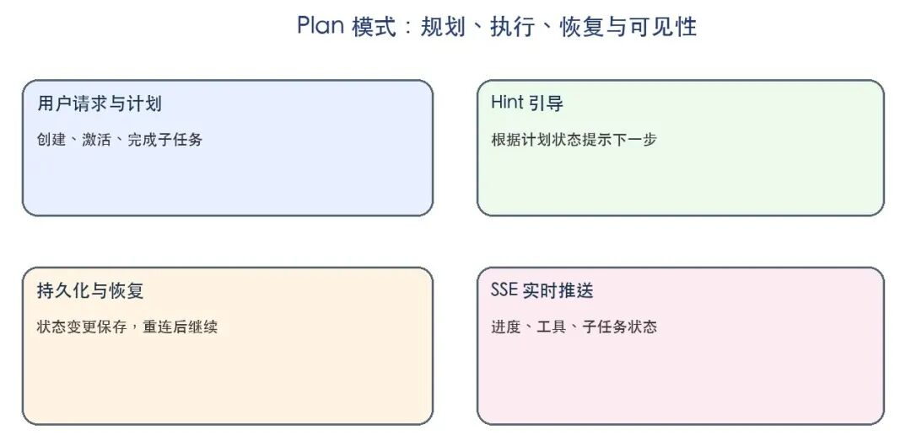
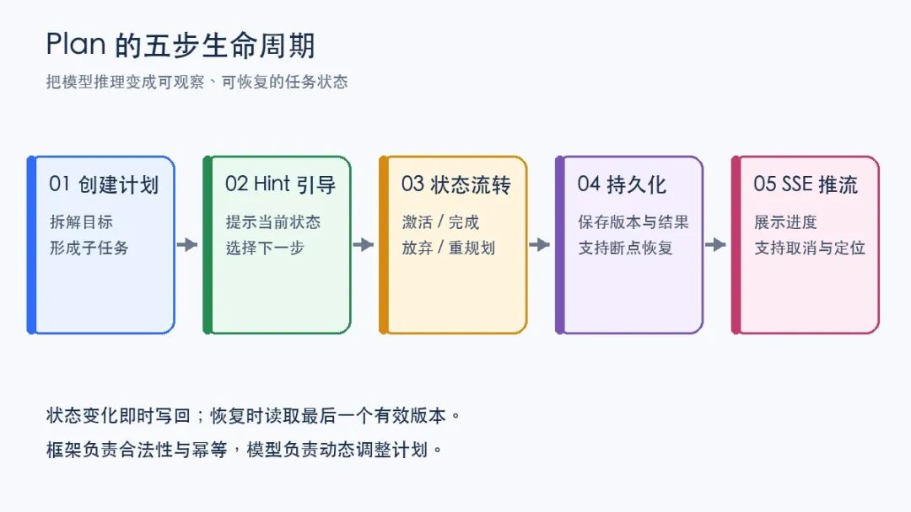
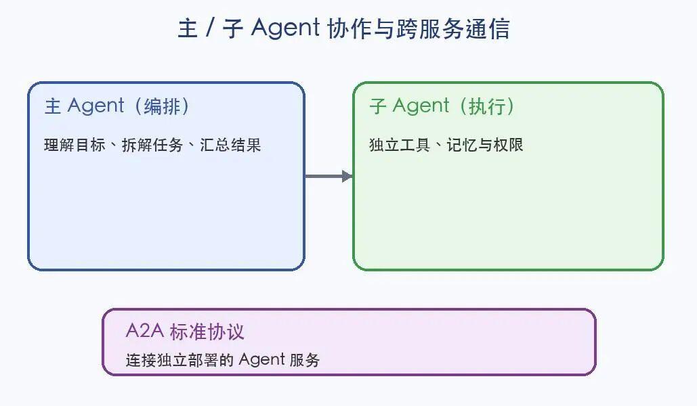
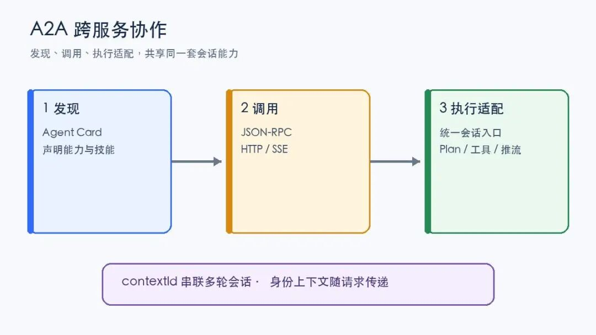
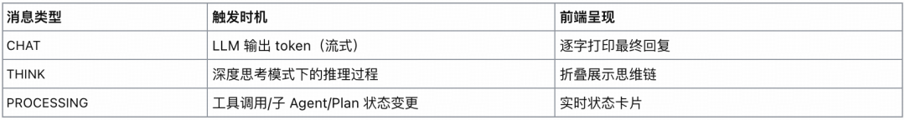
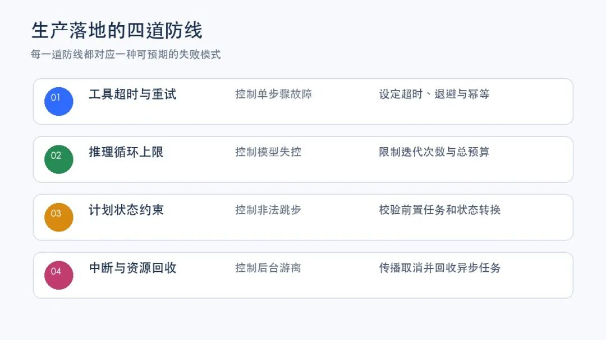

# 📰 企业级 MultiAgent 落地：Plan 模式与主子 Agent 协作｜得物技术


## 目录

- 一、开篇：项目背景

- 二、为什么需要 Plan

- 三、Plan 的全生命周期

- 1.创建计划

- 2.Hint 注入

- 3.持久化与断点恢复

- 4.SSE 过程可见

- 四、主 Agent 与子 Agent 协作

- 1.声明式配置与调用

- 2.可观测与中断传播

- 五、A2A：跨服务的 Agent Teams

- 六、企业级能力保障

- 1.多租户全链路隔离

- 2.双模式认证与 API Key 开放接入

- 3.全链路追踪：多层调用树

- 4.SSE 分层消息协议：完整的执行过程可见性

- 5.异常保护的四道防线

- 6.向量、全文检索双引擎

- 七、典型应用场景

- 八、总结与展望

- 一

- 治理背景

- 我们正在建设一个基于 AgentScope Java 的企业级 MultiAgent 平台，为研发、数据分析和知识问答等场景提供统一的模型调用、工具接入、任务编排、流式输出与运行追踪能力。上一篇文章介绍了平台基础运行时，本文聚焦复杂任务如何规划、如何拆给专业 Agent，以及不同服务之间如何协作。文中隐去具体组织、系统和环境信息，只讨论可迁移的方法。

### 二

### 为什么需要 Plan

“分析一组数据、检索资料、生成报告并给出建议”包含多个相互依赖的步骤。只使用 ReAct 循环（推理、调用工具、继续推理）会遇到：后面才发现前置步骤不完整；过程隐藏在 Prompt 中，执行前无法审计；Token 消耗难以预估；工具失败后缺少稳定的恢复路径。

Plan-and-Execute 把“要做什么”和“怎么做”拆开：先生成结构化计划，再逐项执行。计划不再是备注，而是一个有状态、可持久化、能被前端观察的运行对象。



### 三

### Plan 的全生命周期

### 创建计划

平台将计划操作注册成工具，由模型根据任务动态创建和调整。最小工具集可以是：

```

create_plan(name, description, subtasks)
activate_subtask(index)
finish_subtask(index, outcome)
finish_plan(summary)

```

### Hint 注入

模型可能“忘记”自己正在执行计划，因此每轮推理前根据状态注入短提示：没有计划时建议创建；计划已创建时提醒激活下一项；存在进行中任务时提示可执行、完成或放弃；全部完成时提醒结束计划。

Hint 是软约束，不替模型决策。框架负责硬约束，例如同一时刻只允许一个任务进行中，不能跳过未完成的前置任务。模型可以新增或放弃任务，但必须留下可解释的状态变化。

### 持久化与断点恢复

长任务可能因刷新页面、网络断开或服务重启而中断。计划状态应独立保存，每次变化立即序列化；重连后读取最后有效版本继续执行。恢复要幂等，工具响应丢失时可按任务标识查询，而不是盲目重试。

### SSE 过程可见

最终答案之外，用户还需要知道 Agent 做到了哪一步。平台通过 SSE 推送结构化事件：CHAT 表示回复增量文本，PROCESSING 表示计划、工具或子 Agent 的状态，ERROR 表示异常。前端可以展示“正在检索资料”“第 2/5 项已完成”等状态卡片，让等待过程可理解，也为取消和问题定位提供边界。



### 四

### 主 Agent 与子 Agent 协作

单个 Agent 同时承担规划、查询、分析和写作时，工具集会变大，上下文会变杂，权限边界也会模糊。主/子 Agent 模式把职责拆开：主 Agent 负责理解目标、分解任务和汇总结果；子 Agent 负责某一类专业工作。



### 声明式配置与调用

子 Agent 可用配置描述名称、职责、工具和模型：

```

name:data_analyst
description:负责数据查询与统计分析
tools: [query_data, calculate_metric]

```

平台启动时创建独立实例，再包装成主 Agent 可调用的工具。子 Agent 拥有独立记忆、工具集和系统提示，只接收当前任务输入。短任务同步等待，耗时任务异步查询；多个独立任务可以并行。异步任务必须具备查询、取消、超时和回收能力。

### 可观测与中断传播

子 Agent 不应成为黑盒。主、子 Agent 的工具事件应汇聚到同一条追踪链路，前端可以看到“哪个角色正在调用哪个工具”，排查问题时也能还原完整调用树。

取消必须贯穿层级：父会话设置中断标志，子 Agent 在执行周期检查并协作式退出；流式连接关闭，后台任务进入可回收状态。

### 五

### A2A：跨服务的 Agent Teams

同进程内的子 Agent 适合快速编排，但不同团队往往独立维护 Agent 服务。A2A（Agent-to-Agent）提供标准协议，让服务发现彼此、提交任务、接收流式结果并管理会话。

### 一次 A2A 调用可拆成三层：

* **发现：**服务发布 Agent Card，声明能力、技能和通信方式，调用方通过标准地址获取。

* **调用：**使用 JSON-RPC over HTTP/SSE，支持同步发送、流式发送、查询任务和取消任务。

* **执行适配：**被调用服务把协议消息转换为统一会话入口，因此 A2A 请求与用户请求共享 Plan、工具和推流能力。

A2A 不是一次性 RPC，其典型时序为：发现层拿到对方 Agent Card 确认能力 → 向标准入口发送首条消息，被调用方创建会话并返回 contextId → 后续请求携带该标识延续上下文，长任务通过流式接口逐步回传 → 执行期间可随时查询状态或发起取消。用户与租户身份必须随请求传递，并在异步执行时恢复。

这里最容易被忽略的是"会话归属"：contextId 必须与发起方身份绑定，否则任一调用方都能凭标识读取他人会话；异步恢复时租户条件要重新注入数据访问层，而不是信任调用方传来的快照。把这两条规则前置到协议适配层，业务 Agent 就不必每处都重写鉴权逻辑。



### 六

### 企业级能力保障

企业级与"可用"之间的差距，不在于功能列表，而在于生产环境的可靠性保障。

### 多租户全链路隔离

平台在 ORM 层强制注入租户条件，所有 SQL 执行前自动拼接租户标识。Agent 配置、对话记录、Plan 数据、向量索引均在租户维度严格隔离。这不是应用层的权限判断，而是 ORM 层的强制过滤，租户间数据泄漏在架构上被消除。

对于 Plan 数据，隔离粒度进一步细化到会话级别：计划存储以会话为目录物理隔离，不同会话的计划文件互不可见。

### 双模式认证与 API Key 开放接入

认证拦截器实现两套路径：JWT 本地认证适合平台 Web 端直接使用，企业 SSO 单点登录对接企业现有身份体系，员工凭企业账号直接接入。

API Key 拦截器提供第三种路径：通过 API Key 直接调用 Agent 能力，专为服务间调用和企业内部系统集成设计。将 Agent 能力嵌入 CRM、ERP、内部工单系统成为标准操作。

### 全链路追踪：多层调用树

每次 Agent 执行，平台建立追踪上下文，捕获完整的调用层级：

```

Trace: conversationId=xxx, agentId=yyy
├─ Span: 主 Agent 推理（第1轮）
│   └─ Tool Call: query_database [input/output/latency/tokens]
├─ Span: 子 Agent data_analyst 执行
│   ├─ Span: 子 Agent 推理
│   └─ Tool Call: execute_sql [input/output/latency/tokens]
└─ Span: 主 Agent 推理（第2轮）
    └─ Tool Call: task_output [返回子 Agent 结果]

```

追踪数据包含每个节点的输入输出、执行延迟、Token 消耗和模型版本。生产环境的性能瓶颈定位、异常行为溯源、Token 成本分析，均有精确的数据支撑。

**SSE 分层消息协议：****完整的执行过程可见性**

所有 Agent 响应均通过 SSE 实时推流，执行监听器将过程中的每一个事件转换为结构化消息：



PROCESSING 事件携带组件类型（区分 ToolCall / SubAgentCall / Agent / Plan）和状态（EXECUTING / FINISHED），前端可精确渲染每一步行动：工具调用显示工具名称和执行状态，子 Agent 调用显示子 Agent 名称及其内部工具执行，Plan 进度显示"执行计划（2/5 已完成）"及各子任务状态列表。

开源框架通常只返回最终结果，用户无法获知 Agent 在"思考什么、做什么"。本平台通过 SSE 实时推送每个步骤的状态。

### 异常保护的四道防线



**工具级超时与重试：**每个工具调用设置独立超时和退避重试策略。单个工具的网络抖动或超时不会直接导致整个 Agent 任务失败。

**ReAct 循环迭代上限：**主 Agent 的 ReAct 循环设置迭代上限，防止 LLM 陷入无效工具调用循环。达到上限时优雅终止并返回当前进展。

**Plan 状态合法性约束：**计划状态更新内置约束，切换子任务为进行中前，校验所有前序子任务必须处于已完成或已放弃状态，且同一时刻只允许一个子任务处于进行中。LLM 即使产生"跳步执行"的错误推理，也会被框架层拒绝。

**子 Agent 协作式中断传播：**用户取消对话时，中断标志位被设置，父 Agent 在每个推理周期检查该标志。父 Agent 被中断时，所有子 Agent 在下一个执行节点协作式停止，不存在后台游离任务。

### 向量、全文检索双引擎

Agent 的知识获取并非只依赖 LLM 的参数记忆。平台集成双检索引擎：向量数据库支持语义向量检索，适合开放式知识问答；全文检索引擎支持精确文本匹配，适合精确文档查找。两种检索方式可作为独立工具或组合工具注册给 Agent，由 LLM 根据任务类型自主选择检索策略。

平台原生支持 MCP（Model Context Protocol）客户端和服务端，任意 MCP 服务可动态挂载为 Agent 工具：

```

McpClient mcpClient = McpClient.builder()
    .serverUrl(mcpServerUrl)
    .build();
toolkit.registerTool(new McpTool(mcpClient, toolName));

```

任何遵循 MCP 标准的工具服务，无需定制开发即可直接接入平台 Agent。

### 七

### 典型应用场景

### 场景一：复杂研究报告生成

用户请求："分析同行业在电商平台的销售策略，对比我们的优劣势，给出下季度的运营建议。"Plan 模式下，Agent 自动创建如下计划：

```

✅ 子任务 1：调用数据平台 API 获取同行业销售数据（已完成）
⏳ 子任务 2：调用知识库检索我方历史策略文档（进行中）
□  子任务 3：调用数据分析子 Agent 进行多维对比
□  子任务 4：调用报告生成子 Agent 撰写分析报告
□  子任务 5：汇总结论并生成运营建议

```

用户在等待过程中看到进度实时更新。

### 场景二：多系统数据聚合

用户请求："把 CRM、ERP 和 BI 系统的数据汇总成一份周报。"主 Agent 同时向三个专属子 Agent 提交任务，各子 Agent 分别携带对应系统的工具和权限：

```

主 Agent
├─ CRM 子 Agent（工具：crm_query, customer_filter）
├─ ERP 子 Agent（工具：erp_api, inventory_query）
└─ BI 子 Agent（工具：bi_dashboard_fetch, metric_calculate）

```

三个子 Agent 并行执行，主 Agent 聚合结果后生成周报。

### 场景三：跨部门 Agent 协作（A2A）

某企业内部部署了两个独立的 Agent 服务：**运营 Agent**（负责数据分析）和**法务 Agent**（负责合规审查）。通过 A2A 协议，运营 Agent 可以在生成报告后，自动调用法务 Agent 进行合规扫描，两个服务各自独立维护，通过标准协议互操作。

### 八

## 总结与展望

Plan 模式和主/子 Agent 协作让 Agent 能处理更复杂的任务。企业级平台的技术深度体现在：Plan 的生产可靠性（持久化、断点恢复）、多 Agent 的工程化（声明式配置、异步调度）、企业集成的完整性（多租户、统一认证），以及执行过程的可见性（实时推流、完整追踪）。

Plan 让复杂任务可拆解、可恢复；主/子 Agent 让专业能力可组合、可隔离；A2A 让不同团队的 Agent 通过标准协议协作。系统能否进入生产，取决于计划是否持久化、状态是否可见、取消是否能传递、权限是否能跨服务保持，以及失败时是否有清晰边界。

当这些能力被统一封装后，Agent 才从演示程序变成能够长期运行、持续演进的软件系统。

### 参考资料：

Anthropic：《Building Effective Agents》

Lilian Weng：《LLM Powered Autonomous Agents》

ReAct 论文：《Synergizing Reasoning and Acting in Language Models》

Google A2A Protocol Specification

AgentScope Java 多 Agent 文档

### 往期回顾

## 1. 得物小摊 AI Native 演进实录：用 Harness 构建可控 AI 交付

## 2. 企业级 MultiAgent 的记忆系统：短期上下文与四层记忆架构实现｜得物技术

## 3. EP-Harness：从个人 AI Coding 到团队级 Agent 工作流｜得物技术

## 4. 得物知识问答：复合检索 Agent 的系统设计实践

## 5. 实战从零开始构建一个Coding Agent：Violin ｜得物技术

文 / 光度

关注得物技术，每周三更新技术干货

要是觉得文章对你有帮助的话，欢迎评论转发点赞～

未经得物技术许可严禁转载，否则依法追究法律责任。

“

### 扫码添加小助手微信

如有任何疑问，或想要了解更多技术资讯，请添加小助手微信：


