# 实战从零开始构建一个Coding Agent：Violin ｜得物技术


## 目录

- 一、背景

- 二、效果预览

- 三、分层实现介绍

- 1.Agent Loop（一切的核心）

- 2.AI 模型适配层（Agent Loop 调用的是谁）

- 3.Tool System（Agent Loop的手和脚）

- 4.Product层（循环之外的事）

- 5.Event System（插件实现的基础）

- 6.网络层（客户端实现的基础）

- 7.Python Client 实现

- 四、总结

- 一

- 背景

- 从 24 年冬天开始，各类 coding agent 层出不穷——从 Gemini CLI 的起步，到 Claude Code 的尝试，再到如今 Codex、OpenCode、PI、Qoder 等百花齐放。

- 

- 短短一年多的时间，agent 从大模型的一个附属品，逐渐演变成模型能力的放大器，成为 AI 工程化的关键载体。市面上各类业务 agent——客服、数据分析、工作流编排等——追根溯源，基本都是 coding agent 的泛化变种。

- 理解了 coding agent 的构建原理，也就掌握了理解其他 agent 的一把钥匙。笔者对每天都在使用的 agent 原理很感兴趣，于是决定自己写一个：violin。

- 

### 二

### 效果预览

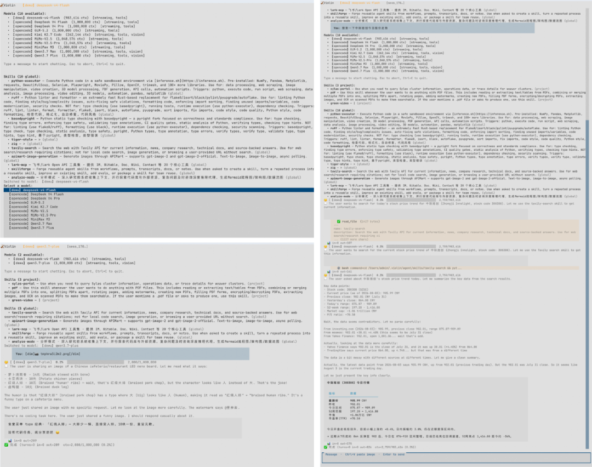

虽然有点丑，但是基本的功能（多模态、skill、插件）已经完备了。

### 三

### 整体架构

Violin 的架构设计深度借鉴了 Pi 的设计理念。Pi 作为一个 TypeScript 实现的 AI coding agent，其最突出的特点是简洁而可扩展的架构——**三层分离**（模型适配层 / 内核层 / 产品层）、EventBus 事件驱动、工具注册表和插件系统，每个模块各司其职且松耦合。

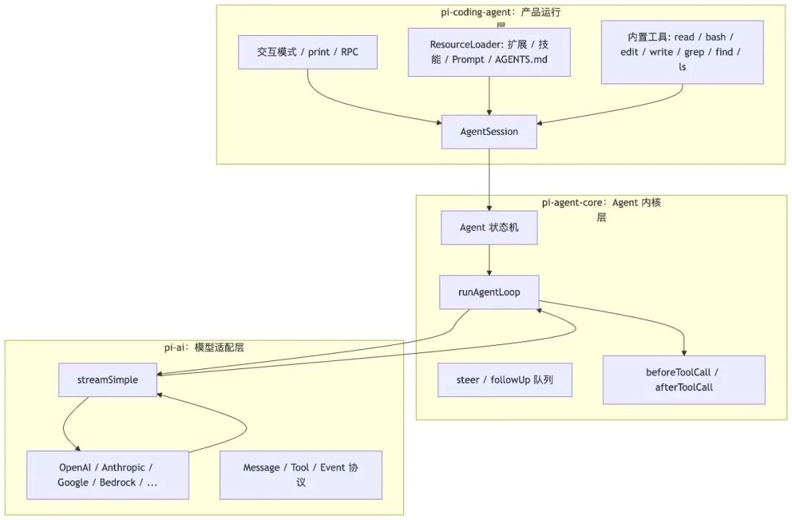

更难得的是，Pi 的代码完全开源，这不仅让 Violin 有了一个扎实的参考蓝本，也让它本身成为一个极佳的 Agent 工程学习范本：代码结构清晰、注释详尽、每层职责明确。想要学习 Pi 架构的，强烈推荐这个项目：how-pi-agent-works。

可以说，读懂了 Pi 的架构，就理解了现代 AI coding agent 的核心设计模式。Violin 在保持这一架构精髓的同时，用 Zig 替换了 TypeScript，在内存安全和性能上做了进一步的探索。

### Violin agent 的架构如下

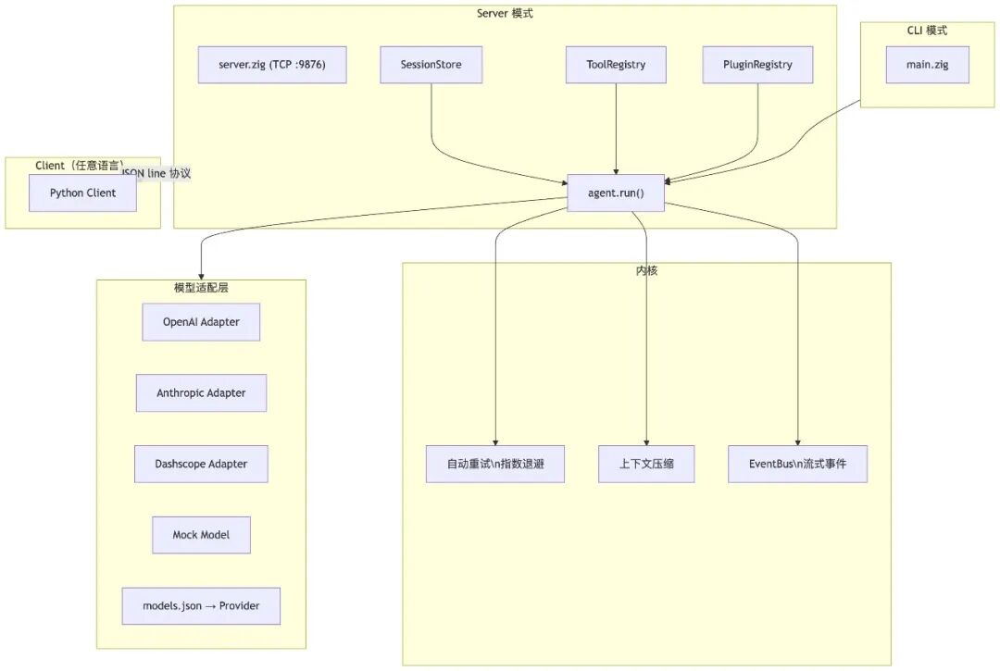

### Why Zig?

Violin 的架构设计深度借鉴了 Pi 的三层分离和 EventBus 方案，但在实现语言上做了完全不同的选择。既然每一层通过接口（或网络协议）解耦，那么不同层用不同语言实现是完全可行的——不需要也不可能「全部用一种语言写完」。

Violin 的分工是：Agent Loop、模型适配、会话管理等底层引擎用 Zig 实现，追求极致的性能和内存可控性；而 Client 端用 Python 实现，利用 Python 的生态快速搭建终端交互 UI。

两者通过 TCP + JSON line 协议通信，Server 不关心 Client 用什么语言写的。笔者的技术栈恰好是 Zig + Python，不会 JS、不熟悉 Rust，但这个组合正好覆盖了「引擎」和「界面」两端，分工清楚，各取所长。

### 每层为什么存在

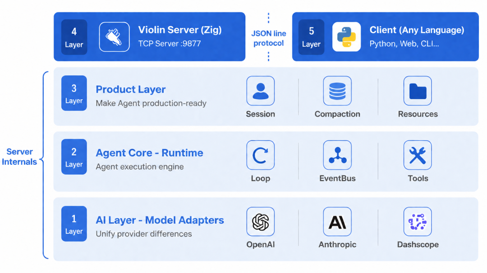

### ai****：把供应商拍平

不同模型 API 对工具调用、推理内容、缓存、错误、OAuth、流式协议的表达都不同。Violin 把这些差异统一成 Message、Tool、AssistantMessageEvent 和 streamSimple()。

这样上层 Agent Loop 不需要知道「这是 Anthropic 的 tool\_use，还是 OpenAI Responses 的 function call」。它只关心统一后的 toolCall 内容块。

### agent-core****：只管 Agent 运行时

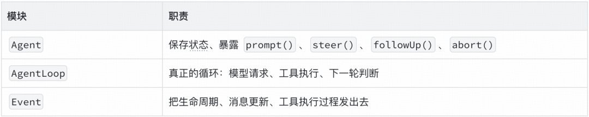

### product****：把 Agent 变成可用产品

写一个 Agent Loop 不难，难的是把它变成每天能用的开发工具。产品层负责这些「麻烦但关键」的事情：

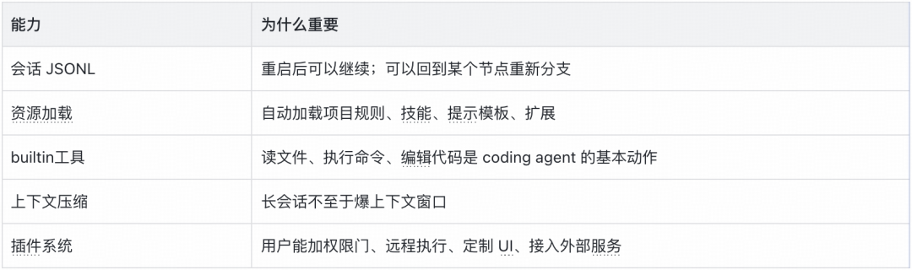

### server****：把 Agent 能力包装为一个TCP Server

为了让客户端实现与语言无关，我们需要将 agent 能力包装为一套通信协议 + 一个 TCPServer。TCPServer 流式通信 + 全双工，天生适合这个场景。

### 四

### 分层实现介绍

### Agent Loop（一切的核心）

Agent Loop 是什么？一个 while 循环，在**「问模型」**和**「执行工具」**之间来回切换，直到模型给出最终答案。它不关心模型是 OpenAI 还是 Anthropic，不关心工具是读文件还是跑命令，只关心两件事：模型要不要调工具？如果要，调完继续问；如果不要，结束。

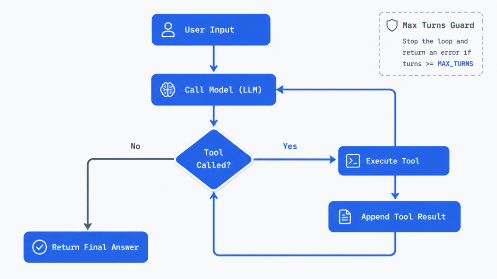

这是 Agent Loop 的核心代码（简化后）：

```

while (turn < max_turns) : (turn += 1) {
   // 1. 调模型
   const assistant = try model.complete(.{
       .messages = messages.items,
       .tools = tool_registry.definitions(),
   });

   // 2. 检查是否有工具调用
   const has_tool_calls = assistant.toolCalls().len > 0;

   // 3. 没有 → 结束；有 → 逐个执行工具
   if (!has_tool_calls) break;

   for (assistant.content) |block| {
       if (block == .tool_call) {
           const result = tool_registry.execute(tc.name, tc.args);
           messages.append(result);  // 回写给模型
       }
   }
}

```

### 这里需要注意

- **为什么要有 max\_turns** — 模型可能陷入无限工具循环，上限是安全阀。

- **为什么工具结果要 append 回 messages** — 模型需要看到结果才能决定下一步。

- **为什么 tools 定义要传进 complete()** — 模型要提前知道有哪些工具可用。

当然不管是 LLM 调用还是工具调用，都有失败的可能，所以我们需要在 AgentLoop 这一层加入重试机制。首先我们需要区分错误种类，是不是一个可以重试的错误，Violin 中做了简单分类：

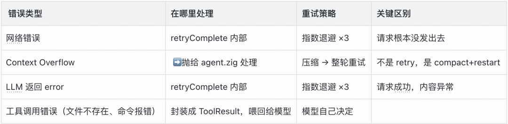

Agent Loop 只关心**「循环」**，不关心消息从哪里来、执行结果存到哪里。这些「循环之外」的事——会话历史的加载和保存、上下文压缩后的重试、Arena 内存管理——由上一层产品层（product/agent.zig）封装。

agent.zig 调用 loop.run() 时传入历史消息，loop 返回后它负责把新消息持久化到 Session，并在 ContextOverflow 时截断上下文重试。

### AI 模型适配层

### （Agent Loop 调用的是谁）

模型适配层的职责只有一句话：把不同 LLM Provider 的 API 差异封装在一个 Model.complete() 接口后面。Agent Loop 只认这个接口，不关心背后是 OpenAI 还是 Anthropic。

### 简化后的核心逻辑（伪代码）

```

interface ModelAdapter {
    complete(input: CompleteInput) -> AssistantMessage
    name() -> string
}

// 每个 Provider 实现这个接口：
// OpenAIAdapter      — 调用 /chat/completions
// AnthropicAdapter   — 调用 /v1/messages

struct CompleteInput {
    system_prompt: string,
    messages: Message[],
    tools: ToolDefinition[],
    max_tokens: int,
    temperature: float,
    stream_callback: optional callback,  // 流式输出
}

```

实际 Zig 实现使用函数指针表（Zig 没有 trait 和虚函数，用函数指针实现多态），每个适配器提供三个函数指针（complete、name、deinit），通过统一接口调用。适配器内部状态（如 base\_url/api\_key）通过类型擦除的指针在回调中还原。

### Violin 适配了目前最流行的 2 种 LLM 协议

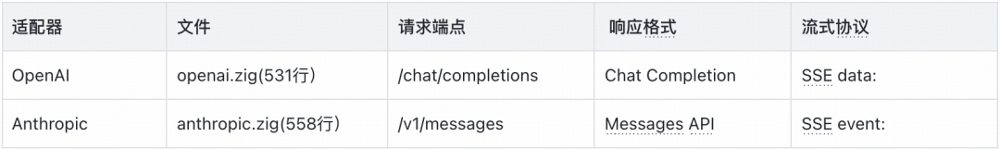

两个适配器代码量差不多（531 vs 558 行），因为它们各自要处理 JSON 序列化、HTTP 请求、SSE 流式解析、错误映射。**差异主要在：**请求体格式不同（OpenAI 用 messages[]，Anthropic 用 content[]）。工具调用的结构不同（OpenAI 是 tool\_calls[]，Anthropic 是 content[] 中的 tool\_use block）。流式协议不同（OpenAI 用 data: 行，Anthropic 用 event: 行）。

LLM 生成一个回答可能需要几秒甚至十几秒。如果等全部生成完再返回，用户只能干等。为了客户端体验的流畅，目前主流 Agent 都采用了流式输出，这个问题的解决方案是流式（SSE）。

```

// 模型适配器在收到 SSE 的每个 chunk 时，调用 stream_callback
// Agent Loop 收到回调后，立即通过 EventBus 发射 message_update 事件
// Client 收到事件后，实时追加到终端显示

pub const StreamCallback = *const fn (ctx, chunk: StreamChunk) bool;

```

Violin 没有内置任何模型，全部从 \~/.violin/agent/models.json 中加载模型配置，再由客户端决定使用哪个模型：

```

{
"providers": {
   "openai": {
     "base_url": "https://api.openai.com/v1",
     "api": "openai-completions",
     "api_key": "$OPENAI_API_KEY",
     "models": [
       { "id": "gpt-4o", "name": "GPT-4o", "contextWindow": 128000 }
     ]
   }
 }
}

```

### Tool System

### （Agent Loop的手和脚）

模型适配层让 Agent Loop 可以调任何模型，工具系统让 Agent Loop 可以做任何事。

### 工具的定义

```

pub const Tool = struct {
  name: []const u8,
  description: []const u8,
  parameters: []const u8,  // JSON Schema
  execute: ToolExecuteFn,
};

```

Violin 内置了 6 个基本工具，和 Pi 的设计保持一致：

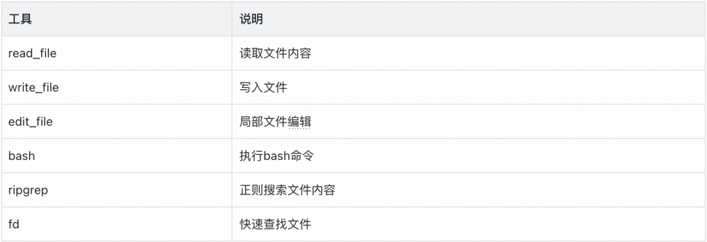

为了方便管理这些 tools，Violin 中实现了一个工具注册表（伪代码）：实际 Zig 实现使用 HashMap 存储工具，按名称快速查找。definitions() 将工具列表编码为模型可识别的 JSON Schema 格式。

```

// 简化后的工具注册表逻辑：
classToolRegistry:
    tools: Map

    funcregister(name, description, execute_fn):
        tools[name] = Tool(name, description, execute_fn)

    func get(name) -> Tool:
        return tools[name]

    func definitions() -> ToolDefinition[]:
        // 返回所有工具定义，发送给模型
        return [t.definition() for t in tools.values()]

    func execute(name, args) -> ToolResult:
        tool = tools[name]
        return tool.execute(args)

```

### Product层（循环之外的事）

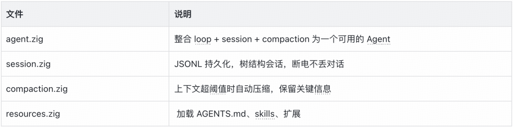

### agent.zig — 胶水层，但最关键

product/agent.zig 只有 123 行，却是把整个项目「粘起来」的那层。它做的事情很简单：

- 从 Session 加载历史消息。

- 传给 loop.run () 执行。

- loop 返回后，把所有新消息保存到 Session。

- 如果 loop 抛了 ContextOverflow，调用 compaction 压缩后重试。

### 展示核心逻辑（简化）

```

// 简化后的 agent.run() 逻辑：
func run(config, user_input) -> AgentResult:
    history = load_history(config.session)

    while True:
        loop_result = loop.run(
            model=config.model,
            initial_messages=history,
            input=user_input
        )

        if loop_result == ContextOverflow:
            compact_session()     // 压缩历史，保留关键信息
            continue              // 压缩后重试

        // 保存新消息到会话
        for msg in loop_result.new_messages:
            session.appendMessage(msg)

        return AgentResult(text=loop_result.final_text)

```

### session.zig — 对话的「记忆」

没有 Session，Agent 每次对话都是「失忆」的。**存储格式：**JSONL，每行一个独立 JSON 对象。第一行是会话头（id, created\_at, cwd），后续每行是一条消息。

```

{"id":"sess_001","created_at":1717234567,"cwd":"/project","model":"gpt-4o"}
{"id":1,"parent_id":null,"timestamp":1,"role":"user","content":"帮我读 README.md"}
{"id":2,"parent_id":1,"timestamp":2,"role":"assistant","content":"我来帮你读..."}

```

violin 为了管理 Session，添加一个 SessionStore 的数据结构

```

// 简化后的 SessionStore 数据结构：
classSessionStore:
    file_path: string          // JSONL 文件路径
    entries: Map    // 消息索引，支持随机访问
    leaf_id: int | null        // 当前叶子节点（最新消息）
    next_id: int               // 自增 ID，用于生成新消息 ID
    header: SessionHeader      // 会话头信息

```

实际 Zig 实现使用 ArenaAllocator 统一管理内存（所有分配来自 arena，deinit 时一次性释放），省去逐条 free 的麻烦。

### 核心方法如下

- 消息持久化 writeEntry 的核心逻辑（伪代码）：

```

// 简化后的消息持久化逻辑：
func writeEntry(entry):
    json_line = serialize_to_json(entry) + "\n"
    // 写入临时文件，然后追加到会话文件
    // 用临时文件方式，避免处理特殊字符的麻烦
    write_temp_file(json_line)
    append_to_session_file(temp_file)

```

- 追加消息（伪代码）：

```

// 简化后的追加消息逻辑：
func appendMessage(message) -> entry_id:
    id = next_id++
    entry = Entry(
        id: id,
        parent_id: current_leaf_id,  // 挂在当前消息后面
        timestamp: now(),
        message: message
    )
    entries[id] = entry
    leaf_id = id                     // 新消息成为最新消息
    writeEntry(entry)                // 持久化到 JSONL 文件
    return id

```

- session 从文件恢复（伪代码）：

```

// 简化后的会话恢复逻辑：
func load():
    if not file_exists(file_path):
        createSession()       // 文件不存在，新建会话
        return

    for each line in read_lines(file_path):
        if is_first_line:
            header = parse_header(line)  // 首行 = 会话头
            is_first_line = false
        else:
            entry = parse_entry(line)    // 后续行 = 消息
            if entry is valid:
                entries[entry.id] = entry
            else:
                log_warn("跳过损坏的消息")  // 损坏行跳过，不崩

```

**与 Pi 的对比：**Pi 的 Session 也是 JSONL + 树结构，支持了树形对话结构，支持分支 fork 和回滚，Violin 继承了这些能力。

### compaction.zig — 对话的「脑容量管理」

当 token 超过阈值时，把旧消息压缩成一条摘要，保留最近 N 条消息。Agent 层的重试循环会检查压缩结果并重新执行 loop。

LLM 有上下文窗口限制，一个 Coding Agent 的对话可能持续几十轮，累积数千 token。如果不做处理，早期消息会被窗口截断，模型「忘记」了之前的上下文。当 token 超过阈值时，把旧消息压缩成一条摘要，保留最近的消息不变。

```

压缩前:
[消息1] [消息2] [消息3] ... [消息N-10] [消息N-9] ... [消息N]

压缩后:
[摘要: 之前讨论的要点] [消息N-9] [消息N-8] ... [消息N]

```

### 核心设计

- Token 预算

```

// 不引入 tokenizer，用 字符数/4 近似。够用就行——压缩决策不需要精确到个位数。
pub fn estimateTokens(text: []const u8) usize {
   return text.len / 4;
}

```

- 触发条件

```

func needsCompaction(messages, config) -> bool:
    return estimateMessagesTokens(messages) > config.max_tokens

```

默认阈值 100K token，保留最近 10 条消息，摘要目标长度 500 token。

- 摘要生成

```

把旧消息拼接成文本，调用模型生成摘要：
[user]: 帮我写一个 HTTP 服务器
[assistant]: 可以用 Zig 的 std.http...
[tool_call]: write_file("server.zig", ...)
[tool_result]: 文件已写入

--->
用户要求编写 HTTP 服务器，助手使用 Zig 标准库创建了 server.zig，实现了基本的请求处理。

```

violin 的压缩系统分成了 2 层：

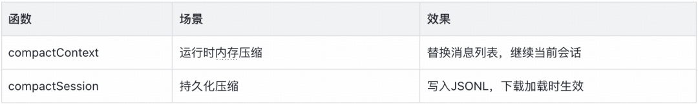

### resources.zig — 资源加载「为Agent注入灵魂」

Resources 从文件系统加载项目规则（AGENTS.md）和技能（SKILL.md），解析 frontmatter，格式化为 system prompt 注入给 LLM，让模型知道它有哪些工具和能力可用。ResourceLoader 负责从文件系统加载三类资源，格式化为 system prompt 供 LLM 使用：

- **项目规则** — AGENTS.md/ CLAUDE.md。

- **技能** — .agent/skills/ 下的 SKILL.md 文件。

### 数据结构（伪代码）如下

```

// 简化后的数据结构：
struct Skill {
    name: string           // 技能名称
    description: string    // 技能描述
    filePath: string       // SKILL.md 文件路径
    source: enum           // "global" 或 "project"
    content: string        // SKILL.md 原文
}

struct Resources {
    rules: ProjectRules
    skills: Skill[]
    cwd: string
}

```

### 资源的搜索路径如下

```

项目规则（优先级从高到低）:
 {cwd}/AGENTS.md
 {cwd}/CLAUDE.md
 ~/.violin/agent/AGENTS.md
 ~/.violin/agent/CLAUDE.md

技能（项目先，全局后，同名冲突时项目赢）:
 {cwd}/.agent/skills/*/SKILL.md
 {cwd}/.agents/skills/*/SKILL.md
 ~/.violin/agent/skills/*/SKILL.md

loadAll()
 ├─ loadProjectRules()
 │   ├─ 尝试 {cwd}/AGENTS.md
 │   ├─ 尝试 {cwd}/CLAUDE.md
 │   ├─ 尝试 ~/.violin/agent/AGENTS.md
 │   └─ 尝试 ~/.violin/agent/CLAUDE.md
 │
 └─ loadSkills()
     ├─ 扫描 {cwd}/.agent/skills/*/SKILL.md
     ├─ 扫描 {cwd}/.agents/skills/*/SKILL.md
     └─ 扫描 ~/.violin/agent/skills/*/SKILL.md
         └─ 同名冲突时报告 diagnostic，跳过

```

SKILL.md 文件都会携带一个 YAML frontmatter，violin 会解析这部分内容，并构建成一个 XML 数据，最终会注入到系统提示词中：

```

      basedpyright
      Python static type checking
      /path/to/skill/SKILL.md

```

### Event System****（插件实现的基础）

Agent Loop 在跑，但外界怎么知道它跑到了哪一步？—— 事件系统就是答案。Agent Loop 每做一件事（开始一轮、生成一个 token、调一个工具），就往 EventBus 上发一个事件。谁关心这个事件，谁就注册回调。

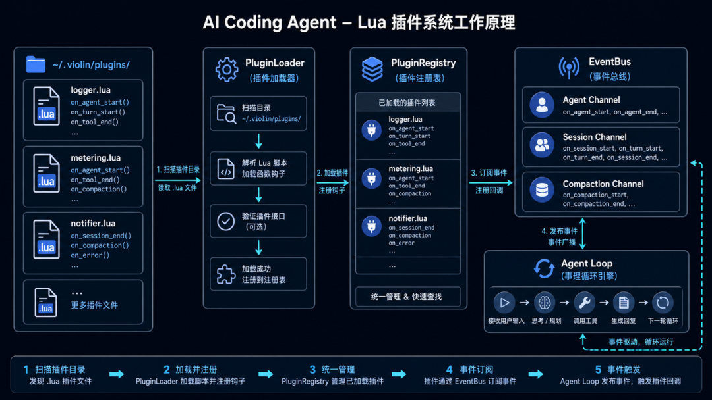

插件的优势在于即插即用、动态加载，刚开始考虑有如下的方案：

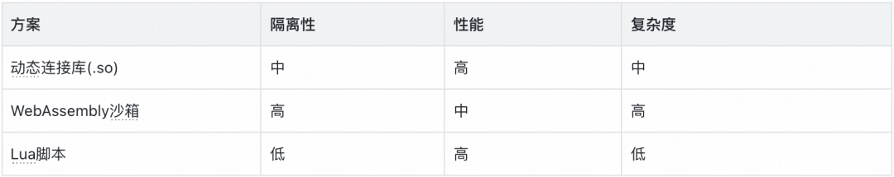

最终我选了 Lua。不是因为 Lua 是最好的语言，而是因为它是最小的对的那一个。500KB 的运行时，20 年 proven 的嵌入场景（从 WoW 到 Redis 到 Nginx），一 C 函数就能调 — 对 Zig 项目来说，这是路径最短的选择。

### 插件系统的架构如下

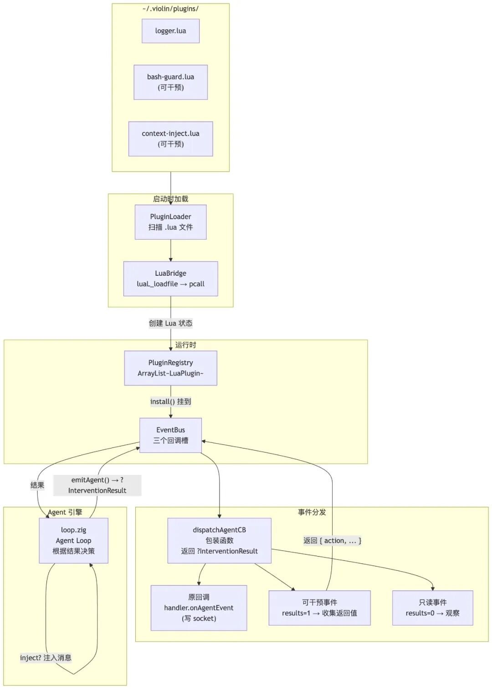

核心机制非常简单：EventBus 有三个回调槽（agent /session/compaction），install () 把原回调保存下来，换成自己的 dispatch 包装函数。先执行原回调（写 socket 流式返回给客户端），再遍历所有已注册的 Lua 插件，逐个调用对应的 hook 函数。

### 插件长什么样子？

```

-- ~/.violin/plugins/bash-guard.lua
return {
    name = "bash-guard",
    version = "0.2.0",
    description = "拦截危险 bash 命令，自动加安全前缀",

    -- tool_start：执行工具前拦截
    on_tool_start = function(event)if event.tool_name == "bash" then-- 阻止危险命令if event.arguments:find("rm -rf", 1, true) thenreturn { action = "block", reason = "危险命令已阻止" }
            end-- 修改命令（加安全前缀）return { action = "modify", arguments = "set -e; " .. event.arguments }
        end-- 不 return = allowend,

    -- tool_end：修改工具执行结果
    on_tool_end = function(event)if event.tool_name == "bash" and event.is_error thenreturn { action = "modify", content = "错误已自动处理", is_error = false }
        endend,

    -- context：在 LLM 调用前注入系统指令
    on_context = function(event)return { action = "modify", inject_text = "使用 bash 时注意安全", inject_role = "system" }
    end,

    -- agent_start：阻止 agent 启动
    on_agent_start = function(event)-- 在某些条件下阻止 agent 启动-- return { action = "block", reason = "当前不允许执行" }end,

    -- session_before_compact：阻止手动压缩
    on_session_before_compact = function(event)if event.reason == "manual" thenreturn { action = "block", reason = "禁止手动压缩" }
        endend,
}

```

### 网络层（客户端实现的基础）

网络层定义了 Violin 客户端与服务端之间如何通信 —— 客户端发一条消息，服务端把思考过程、工具调用、最终回答一条条推送给客户端，就像看一个人边想边做边说的直播。

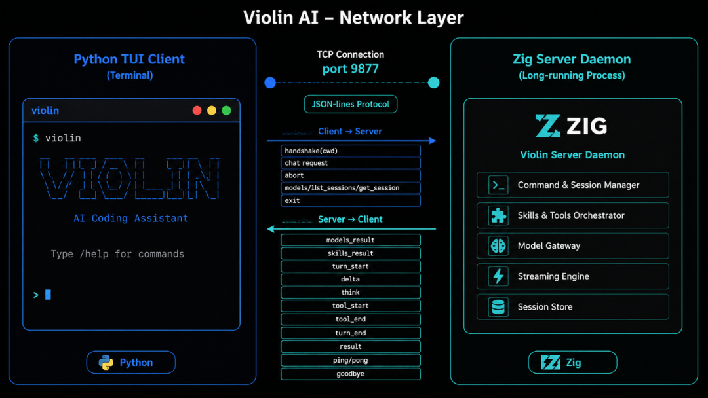

**为什么是 C/S 架构？**大多数 Coding Agent 是一体式的 ——Agent 引擎直接嵌入编辑器或 CLI 工具里，启动、加载模型、执行工具、管理会话都在一个进程里完成。

### Violin 选择了前后端分离

```

一体式:  [agent + UI + 会话]  — 一个进程，跑在本地

Violin:  [Zig 服务端 (daemon)]  ←TCP/JSON-lines→  [Python TUI 客户端]
                               也可以接其他客户端

```

这个设计选择也是受到了 ACP 协议的启发，ACP 协议复杂度较高，而且 zig 没有很好的 ACP 实现依赖，violin 作为一个 toy 项目，选择了最小最容易的方式 ——TCP + JSON LINES。

我在项目中维护了一个详细的通信协议说明，如果用户想用其他语言实现客户端，只需要把通信协议交给 AI 即可 vibe 出一个新的客户端。

受到篇幅限制，我只简单介绍几个核心协议：

### 握手

```

客户端 → 服务端:
{"type":"handshake","cwd":"/home/user/project/violin"}

服务端 → 客户端:
{"type":"models_result","models":[...],"default":"deepseek-v4-flash"}
{"type":"skills_result","global_skills":[...],"project_skills":[...]}

```

cwd 用于加载项目技能 {cwd}/.agent/skills/ 和注入系统提示词。

### 聊天请求

```

客户端 → 服务端:
{"type":"chat","content":"列出目录下文件","model":"deepseek-v4-flash"}

```

可选字段：session\_id、temperature、max\_tokens、system\_prompt、images。

### 事件流

服务端处理 chat 请求时，流式推送事件。Violin 设计了 8 个事件类型来完善对话需求：

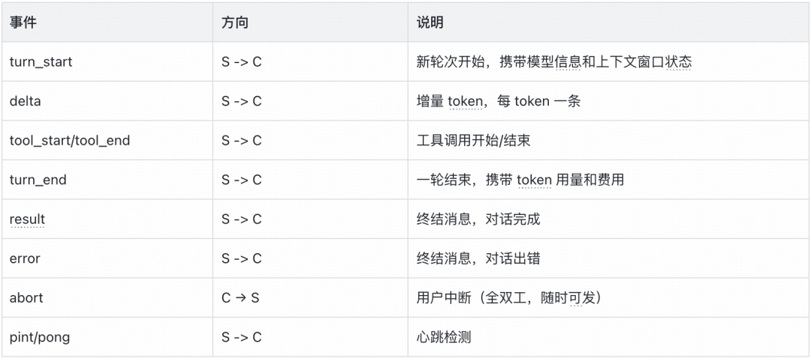

完整事件流示例：

```

// Client 发送
→ {"type":"chat","content":"帮我读 README.md"}// Server 开始流式返回
← {"type":"turn_start","session_id":"sess_001","model":{"id":"gpt-4o","provider":"openai","label":"GPT-4o"},"context":{"tokens":5400,"window":128000,"usage_pct":4.2}}

← {"type":"delta","text":"我来"}
← {"type":"delta","text":"帮你"}
← {"type":"delta","text":"读"}

← {"type":"tool_start","name":"read_file","args":{"path":"README.md"}}// ... 等待工具执行 ...
← {"type":"tool_end","name":"read_file","ok":true,"output":"# Violin\n..."}

← {"type":"delta","text":"文件"}
← {"type":"delta","text":"内容是："}
← {"type":"delta","text":"Violin是一个AI助手"}

← {"type":"turn_end","turn":0,"usage":{"input_tokens":5400,"output_tokens":18,"cost_usd":0.0115}}

← {"type":"result","text":"我来帮你读...","turns":1,"aborted":false,"session_id":"sess_001","usage_total":{"input_tokens":5400,"output_tokens":18,"cost_usd":0.0115}}

```

### Python Client 实现

有了上一节网络协议的铺垫，我们可以写一个简单的 Violin Python 客户端。Python Client 的核心是一个 async TCP 连接 + 事件分发器：

```

classViolinClient:
"""Async Violin protocol client (no UI, just I/O)."""

def__init__(self, host="127.0.0.1", port=9877):
        self.reader = None
        self.writer = None
        self.models = []
        self.session_id = ""

# 回调——UI 层注册这些，实现与展示分离
        self.on_delta = None
        self.on_tool_start = None
        self.on_tool_end = None
        self.on_result = None
        ...

asyncdefconnect(self, retries=3):
"""TCP 连接 → handshake → 收 models_result + skills_result"""
for i inrange(retries):
try:
                r, w = await asyncio.open_connection(*self.addr)
                self.reader = r
                self.writer = w
await self._send({"type": "handshake", "cwd": os.getcwd()})
                msg = await self._read_msg()
if msg and msg.get("type") == "models_result":
                    self.models = msg.get("models", [])
returnTrue
except ConnectionRefusedError:
await asyncio.sleep(0.5 * (2 ** i))
returnFalse

asyncdefhandle_messages(self, state):
"""事件分发——读 socket → 按 type 调用对应回调"""
whileTrue:
            msg = await self._read_msg()
            mt = msg.get("type", "")
if mt == "delta":
                state["full_text"] += msg.get("text", "")
if self.on_delta:
                    self.on_delta(msg["text"])
elif mt == "tool_start":
if self.on_tool_start:
                    self.on_tool_start(msg["name"], msg["args"])
elif mt == "result":
                self.session_id = msg.get("session_id", self.session_id)
if self.on_result:
                    self.on_result(msg["text"], msg.get("usage_total", {}))
return msg["text"]
elif mt == "error":
if self.on_error:
                    self.on_error(msg["msg"])
return""
elif mt == "ping":
await self._send({"type": "pong"})
return state["full_text"]

```

### 四

## 总结

整个项目做下来，最大的感受是：coding agent 的核心没有什么魔法。剥开各种花哨的 UI 和功能，底层就是一个 while 循环 —— 问模型、拿结果、要不要调工具、调完再问。Violin 的每一层都是在给这个循环打补丁：

- 模型适配层解决 "问谁"。

- 工具系统解决 "能干嘛"。

- 资源层解决 "记不记得住、SKILL 在哪"。

- 插件解决 "能力扩充"。

这个玩具距离一个成熟的 Coding Agent 还有一堆没填的坑：buildJson 里 tools 参数还没序列化，模型根本收不到工具定义。插件没有权限隔离，Lua 能干任何事。ACP 协议也没接，暂时只能自己跟自己玩。

但作为一个从零搭起来的 toy agent，这个项目的目的从来不是交付一个商用产品，而是验证一个判断：**理解了 coding agent 的构建原理，也就掌握了理解其他 agent 的一把钥匙。**

这个判断在构建过程中不断被验证 —— 模型的统一适配、工具的注册与调度、会话的持久化与恢复、上下文的压缩与保留、插件的注入与拦截，这些看似各不相干的问题，底层都收敛到同一个循环：问模型、调工具、再问。客服 agent 的会话管理、数据分析 agent 的工具链编排、工作流 agent 的状态机设计 —— 追根溯源，都是这个循环在不同场景下的变形。

剩下那些没填的坑，既是项目当前的边界，也是下一段探索的起点。把一个 toy 项目一路补到能真正落地，过程本身就是最好的学习方式。


### 往期回顾

## 1. AI Native 交易核心系统的研发范式｜得物技术

## 2. 推荐系统体验的数字化突破：得物自动化评测平台的技术实践｜AICon 文章整理

## 3. RAG 核心概念与原理：Chunking、Embedding、相似度、HNSW 与多路召回｜得物技术

## 4. 从"机械应答"到"服务伙伴"：得物高可控智能客服的 Agent 工程实践｜AICon 演讲整理

## 5. 得物推荐系统诊断 Agent：从 “调接口” 到 “会思考”｜AICon 演讲整理

文 / 酒米

关注得物技术，每周三更新技术干货

要是觉得文章对你有帮助的话，欢迎评论转发点赞～

未经得物技术许可严禁转载，否则依法追究法律责任。

“

### 扫码添加小助手微信

如有任何疑问，或想要了解更多技术资讯，请添加小助手微信：


