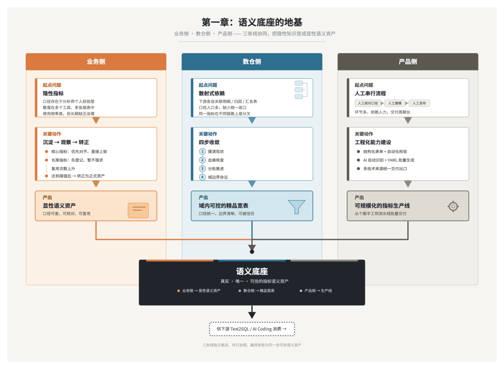
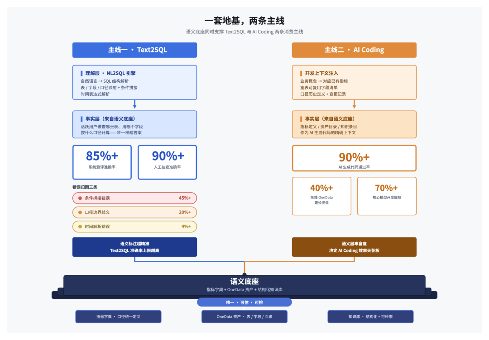
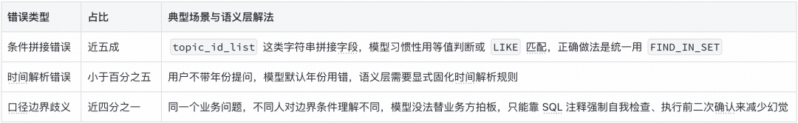
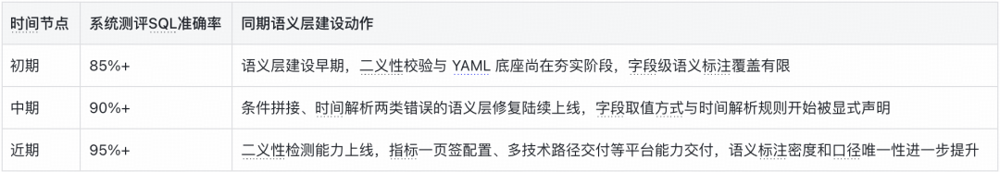
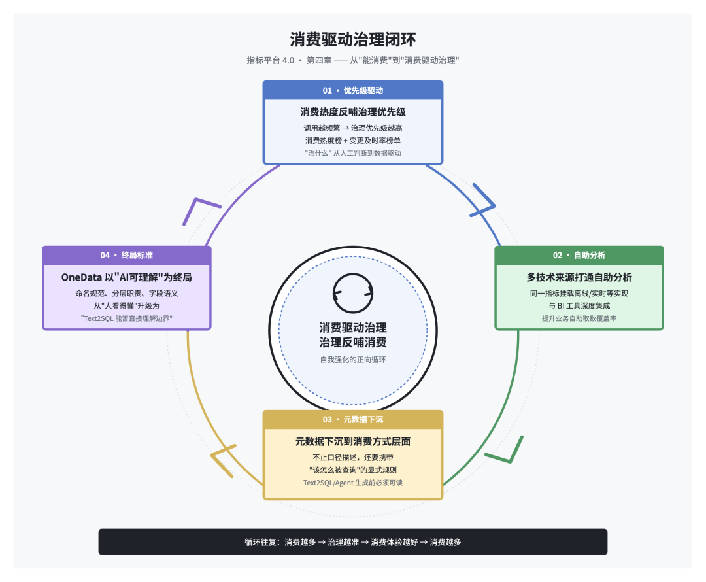

# 📰 指标平台：从语义底座到智能消费的实践路径｜得物技术

## 目录

- 一、引言：指标平台的下一站，是"AI 可信赖地用起来"

- 二、语义底座的地基：把隐性知识变成显性资产

- 1.业务侧：从存量报表逆向梳理，到攻克"隐性指标"

- 2.数仓侧：把消费收敛到域可控的宽表

- 3.解决方案：结构化对话设计方法

- 4.产品侧：让"上架"这件事本身可扩展

- 三、质量不失控的关键：把二义性拦截在源头

- 四、语义底座真正的考卷：Text2SQL 与 AI Coding 两条消费主线

- 1.Text2SQL：指标字典是它的"事实来源"

- 2.AI Coding：语义层的丰富度决定它的天花板

- 五、往前一步：从"能消费"到"消费驱动治理"的闭环

- 六、结语：指标的意义，正在从人脑迁移到机器

- 一

- 引言：指标平台的下一站，是"AI 可信赖地用起来"

- 指标平台的演进史，本质上是一部"意义"从人脑迁移到机器的历史。第一代把指标固化进 OLAP 立方体的物理结构，灵活性极差；第二代用语义层把业务名词和 SQL 表达式解耦，解决了"命名一致"的表面问题；第三代把指标升级为结构化的语义资产对象，用 NoETL 绕开宽表预物化的负担，Chat BI 和 NL2SQL 第一次成为可能。行业普遍认同的下一站，是把指标从"有血缘的对象"进一步升级为"有语义关系、可推理约束的本体网络"——这个方向是对的，指标之间的因果链路、维度层次的动态扩展，确实是数据认知基础设施迟早要补上的一课。

- 过去这半年，我们在公司内部真正推动"指标字典"从 0 到 1 落地，并同步支撑 Text2SQL 语义层能力建设。这条路径不靠一次架构设计就能铺完，它需要业务侧、产品侧、数仓侧三条线同时发力，每一步都要经得起"AI 拿这个数据能不能取对"的检验。

- 这篇文章想做的，不是在本体化的宏大叙事上再叠加一层理论，而是把我们在真实落地中验证过的路径讲清楚：**语义底座怎么从零建立起来、怎么保证质量不失控、怎么支撑 Text2SQL 和 AI Coding 两条消费主线，以及沿着这条路径往前走，下一步该往哪个方向发力。**

### 二

**语义底座的地基：把隐性知识变成显性资产**

任何指标平台的智能化，都建立在一个前提之上——语义层里的每一条描述都必须是真实、唯一、可信的。这个地基怎么打，我们的经验是分三条线同时推进。

**业务侧：从存量报表逆向梳理，到攻克"隐性指标"**

指标字典最容易做的部分，是从存量报表、看板、SQL 里逆向梳理已经"有主"的指标——这部分相对容易治理，因为口径已经在被使用，只是没有被结构化。真正难啃的，是分析师日常在分析工具里高频使用、却从未沉淀为规范指标的那一批。

这类指标有三个共同特征：口径存在于个人经验里（比如"活跃用户"，不同分析师可能用不同时间窗口，谁都没错但谁都不通用）；散落在多个技术底座里彼此互不感知；使用频率高但治理优先级低，因为"能用就行"。

我们给这类问题的解法，不是指望一次性全量收编，而是建立一套"沉淀-观察-转正"的可持续机制：以公司核心指标体系（北极星→支撑指标→相关指标）为起点，反向核对哪些报表覆盖了核心指标，优先对齐上架；长尾、定制化指标先做登记（记录名称、口径、归属人），不占开发资源，等复用次数上来了，业务价值凸显了，再"转正"升级为字典指标。这比"眉毛胡子一把抓、全量收录"要现实得多——早期我们确实尝试过把梳理出的全部指标一次性推入数仓开发，很快发现资源根本撑不住，而且很多是报表下的离散定制口径，照单全收反而背离了"统一核心指标口径"的初衷。

这套机制的核心逻辑是：**语义标注的密度，直接决定后续 AI 取数场景的准确率上限**，所以业务侧的首要目标不是"覆盖了多少指标"，而是"覆盖了多少真正被高频使用的指标"。

### 数仓侧：把消费收敛到域可控的宽表

如果说业务侧解决的是"指标从哪来、谁来定义"，数仓侧要解决的是更底层的问题：指标背后的数据，够不够干净、口径够不够统一、能不能被下游放心引用。

过去分析师和下游任务想要一份完整的用户画像或经营指标，往往要自己关联好几张底层明细表、归因表、汇总表，不仅要理解每张表的粒度和主键，还要清楚表与表之间的关联关系和口径差异——这些理解成本本质上是重复劳动，十个下游需求可能有八个在各自重新拼一遍同样的关联逻辑，稍有偏差就会导致口径分叉。

解法是把这些散射式依赖收敛到几张域内可控的精品宽表上。收敛之后，下游不再需要关注上游的加工逻辑，取数从"多表关联+口径对齐"简化为"单表查询"；口径由域内统一维护，一旦业务口径调整，只需要在宽表加工层改一次，所有下游自动生效；宽表本身也天然具备了对外分享的能力，可以直接作为域对外提供数据服务的"契约"，无论是被其他域引用，还是被指标字典、Text2SQL 引擎索引，都不需要额外的解释成本。

这不是一句"我们要治理老表"就能推进的，实操上需要按四个具体步骤走：

**第一，先摸清命名和分层现状再动手。** 同一批核心表里主键类型不统一、非标前缀、项目代号嵌入表名等问题，不先摸清楚，任何重构都容易改出新坑。

**第二，做血缘核查而不是相信文档描述。** 这是最容易被低估但代价最高的一步，文档记录的依赖关系和实际血缘经常对不上，必须先核查血缘再动重构，这是一条硬规则。

**第三，按依赖关系分批次推进。** 挑出无内部依赖、可并行改造的表打头阵，高风险的超宽表放最后，且在削减字段前必须先做字段引用率统计。

**第四，明确域边界协议。** 本域只产出真正归属本域的字段，跨域指标只能通过 JOIN 引用，禁止把其他域字段直接复制写入本域宽表，这条规则不在重构阶段就明确下来，宽表边界会在后续迭代中被不断打破。

这一步是指标字典能不能立得住的地基工程——**如果指标背后的物理实现依然是东拼西凑、口径分散、血缘断层的老资产，指标字典再规范，也只是给一堆脏数据穿了件干净外套。**

### 产品侧：让"上架"这件事本身可扩展

业务侧攻克隐性指标，数仓侧收敛物理资产，最终都要靠产品侧的工程能力把这套流程沉淀成可规模化复制的生产线。这半年产品侧做的事情，可以归纳为几类：

流程效率上，指标上架正在从“人工核对口径—人工建模—人工发布”的串行链路，向结构化表单录入+自动化校验+一键发布转型；同时推进维度管理模块，让“分渠道 GMV”和“GMV”这类拆解关系能自动关联，而不是每个维度组合都要重新建一个指标。

多技术来源的统一交付，是容易被忽视但价值很大的一块——这里说的“多技术来源”不是简单的接口封装，而是同一个指标定义背后允许挂载多个物理实现：可能是离线表的日粒度聚合结果，也可能是实时链路产出的分钟级聚合结果，甚至是不同引擎（Spark 离线 / Flink 实时）加工出来的多张表。这些来源各不相同，但对外呈现的必须是同一个口径、同一个结果——下游不管需要实时看板的分钟级数据，还是离线深度分析的日粒度数据，取到的都是“同一个指标”，只是背后按场景匹配了不同的技术来源。这本质上是在指标定义层做“一对多”的物理映射管理。

AI 自动识别+基于 YAML 的批量生成，是效率杠杆最大的一块。已交付基于 YAML 文件解析的初版能力，可以自动生成数据模型和原子指标；下一步是让 AI 具备“自动识别”能力——分析师提供一段业务描述或一张参考表，AI 自动识别出可提取的指标定义，推荐字段口径，生成对应的 YAML 语义描述，人工只做终审。这套能力能跑通，前提是团队已经在标签表开发上验证过同一套方法论：需求输入→提炼目标表名/业务背景/数据粒度/字段口径/数据源五项关键信息→参照已有同类表代码风格→自动生成包含建表语句、参数配置、加工逻辑、数据校验的完整开发包，每份产出强制遵循同一套骨架（库名/时间参数统一变量不硬编码，每张表上线前必须自带分布验证+空值检查+主键唯一性校验）。指标字典的 AI 自动识别，走的是这条路径的延伸——今天让 AI 提炼“该建什么表、粒度是什么”，明天就是让 AI 提炼“这段描述里包含哪些可复用的指标、YAML 该怎么写”，产出物从 SQL 变成 YAML，方法论没有变。

### 三

### 质量不失控的关键：把二义性拦截在源头

语义底座能不能被下游放心消费，最核心的前提只有一条：每个指标名称和口径必须唯一、无歧义。如果“新客”这个词在系统里同时对应“首次下单”和“首次注册”两个口径，AI 取数时就会随机踩坑，而且用户根本感知不到自己拿到的是哪个版本。

这件事的正确解法，不是在指标用错之后回头排查，而是在指标提报环节就做语义相似度检测和口径冲突预警，把“两个人各自定义了一个几乎同名但口径不同的指标”这种情况在源头拦下来。我们把这个能力理解为语义底座的“免疫系统”——它不追求消灭所有语义复杂性，而是保证任何一个被下游消费的指标，在被消费的那一刻，口径是确定且唯一的。

配套的是覆盖率要有清晰、不能自评的判定边界。“精品资产指标字典上架覆盖率”这类指标，容易被理解成一个可以拍脑袋定义的软指标，但真正可执行的做法是把分母锁定在精品数据资产目录（已明确分级和认证机制的资产清单）里被标记为“指标”且同时满足“经业务认证或平台推荐”的那部分字段，而不是数仓侧自行判断“这个指标常不常用”。这套边界解决了一个实际问题：过去做资产盘点，经常出现“我们域里其实上架了不少指标，怎么覆盖率数字还是不好看”的争议，根源就是分子分母口径没对齐。把判定标准锁定在已有认证结果上之后，覆盖率数字才具备跨域可比性，业务侧推动分析师上架指标时，也才知道具体要对齐哪张目录、哪些字段。

质量保障的最后一环落在每张精品资产上线前的强制门禁——标签/指标分布验证、NULL 值检查、主键唯一性校验，这三类校验不是“建议做”，而是“缺了就不算完工”。这套三件套配合底层 OneData 命名规范、分层职责的持续建设，目标是让表名、字段名不仅“人读得懂”，更要“AI 可以直接理解”，减少语义歧义带来的取数错误。

### 四

**语义底座真正的考卷：Text2SQL 与 AI Coding 两条消费主线**

语义底座建得再扎实，如果没有真实的消费场景来检验，价值就无法闭环。当前公司层面对语义层最重的两条消费主线，一条是 Text2SQL，一条是 AI Coding，两者看似独立，实际上依赖的是同一套语义基础设施。

### Text2SQL：指标字典是它的"事实来源"

公司层面的 Text2SQL 能力，本质上分两层：理解层（NL2SQL 引擎把自然语言转成正确的 SQL 结构）和事实层（引擎知道"活跃用户"该去哪张表、用哪个字段、按什么口径算）。行业里很多 Text2SQL 项目卡壳，往往不是模型能力不够，而是事实层缺失——引擎能理解语言，但不知道"真相"在哪。指标字典，就是在给事实层提供权威数据源。

我们在 Text2SQL 语义层项目上观察到一个非常明确的规律：字段的全量语义标注做得越细，NL2SQL 在枚举、聚合、分区、约束这类结构化维度上的表现就越稳定；反过来，某个字段一旦存在"逻辑名与物理名不一致"这类语义歧义，就会直接反映成一次错误的取数。这恰恰印证了指标字典要解决的核心问题：**只要语义标注足够精准、口径足够唯一，Text2SQL 的准确率上限就会明显提升。**

从我们实测的错误归因结构里，能更具体地看到语义层元数据缺失和 Text2SQL 准确率之间的直接因果关系。系统测评 SQL 准确率85%+，分析师人工抽查准确率90+%，差距不大但错误归因高度集中在三类问题上：

这组数据说明了一件很重要的事：**Text2SQL 准确率的瓶颈，绝大多数时候不在模型推理能力，而在语义层能不能把“这个字段该怎么被查询”这类元数据显式声明清楚。**二义性拦截、字段取值方式声明、时间解析规则固化，这些看起来“不性感”的语义层基础工作，恰恰是当前 Text2SQL 准确率提升最直接的杠杆——这也是为什么“二义性拦截”在产品侧被列为高优先级，它不是锦上添花的体验优化，而是 Text2SQL 能不能规模化可信的先决条件。

如果只看某一个时间点的静态快照，读者很难判断这个准确率水平算好还是不好——它需要一个参照物。把观察窗口拉长到语义层建设的整个推进周期，能看到更直接的证据：**系统测评 SQL 准确率随语义标注密度和覆盖率的提升同步上扬，**而不是维持在一个固定水平。

随着语义层建设的持续推进，系统测评准确率从 85%+ 提升到 95%+，提升节奏与语义层治理动作（条件拼接修复、时间解析规则固化、二义性检测上线）逐一对应，不是自然波动或模型能力本身的变化。这组趋势数据补足了前面错误归因结构想说明但没有直接证明的那句话：**语义层从不完善到完善的过程，直接兑现为 Text2SQL 准确率的可观测提升，而不只是理论上"应该"提升。**

### AI Coding：语义层的丰富度决定它的天花板

另一条消费主线，是 AI Coding 在数仓开发链路上的规模化应用。团队内部的实践已经验证了 AI 辅助开发在标准化场景下能带来数量级的效率提升：某业务域 OneData 建设全流程提效40%+，核心模型开发阶段提效70%+（一次大宽表拆分涉及的多批次下游迁移，全程用 AI 辅助开发，效率提升约40%）。

但这些效率提升有一个共同前提：**AI 需要足够精确的上下文，才能生成正确的代码。** 指标字典和 OneData 资产体系，恰恰是给 AI Coding 提供上下文的关键基础设施——当一个新的标签表要开发时，AI 能不能直接查到"这个业务概念对应哪个已有指标"、"这张宽表的哪些字段可以复用"、"这个口径的历史定义是什么"，直接决定 AI 生成代码的一次通过率。当前 AI 代码通过率能做到较高水平，很大程度上得益于结构化知识资产（术语字典、开发原则、反模式清单、上下文触发规则）和指标字典的共同支撑，而不仅仅是模型本身变强了。

指标字典、OneData 资产、结构化知识库，本质上是同一件事的三个切面——把数仓的隐性知识显式化、结构化、可检索化。Text2SQL 消费的是这套语义层，AI Coding 消费的也是这套语义层，两条看似独立的技术主线，底层依赖的是同一个语义基础设施。这也是为什么数仓侧的精品资产收敛不能被当作"技术债务清理"这种低优先级工作，它是公司整个 AI 化数据消费链路的地基。

### 五

**往前一步：从"能消费"到"消费驱动治理"的闭环**

语义底座建立起来，质量拦截机制生效，Text2SQL 和 AI Coding 两条主线开始规模化消费之后，下一步该往哪个方向走？我们认为正确的路径不是急于叠加更复杂的语义推理能力，而是先把“消费”这件事本身反过来变成治理的输入，形成一个自我强化的闭环。

**第一，消费热度应该反哺资产治理优先级。**一个指标被 Text2SQL、Agent 调用得越频繁，它的治理优先级就该越高——这需要建立指标下游消费热度榜和变更及时率榜单，让“哪些指标该优先治理”这件事从人工判断变成数据驱动。这和自适应物化的思路是一致的：让系统自己学习该把治理资源花在哪，而不是凭经验或职级话语权分配优先级。

**第二，多技术来源的统一交付要进一步和业务自助分析打通。**当同一个指标可以稳定挂载离线、实时等不同粒度的物理实现之后，下一步是把这套能力和 BI 工具做更深度的集成，让业务自助取数的覆盖率明显提升——目标不是让分析师学会写更复杂的 SQL，而是让“要什么数据、要多细粒度”这件事本身变得可配置化，指标平台负责在背后保证口径一致。

**第三，元数据的颗粒度要继续下沉到“消费方式”层面。**语义层过去主要携带的是口径描述（这个指标叫什么、怎么算），下一步要显式携带“这个字段该怎么被查询”这类消费侧元数据——是否需要特定函数处理、时间字段的默认解析规则、是否存在业务边界歧义需要强制二次确认。这类元数据不需要复杂的技术方案，一个结构化好的语义描述字段就够，但必须是 Text2SQL、Agent 在生成 SQL 之前就能读到的，而不是生成完 SQL 之后再来纠错——这是当前错误归因里“条件拼接”“边界歧义”两类问题能被系统性根治的关键。

**第四，OneData 建设要以“AI 可直接理解”为终局标准，而不仅仅是“人可以看懂”。**命名规范、分层职责、字段语义的持续治理，衡量标准正在从“规范文档写得清不清楚”升级为“Text2SQL 引擎能不能通过表名和字段名直接理解数据边界”。这意味着数仓侧的规范化工作，未来要拿“AI 取数准确率”作为验收标准之一，而不只是代码评审时的人工检查项。

### 六

## 结语：指标的意义，正在从人脑迁移到机器

指标平台的价值，是让“语义”跟数据本身同等重要。这半年的实践让我们越来越确信，这件事没有捷径——它需要业务侧把隐性口径变成显性资产；数仓侧把散射式依赖收敛成域内可控的精品宽表；产品侧把上架这件事本身工程化成可规模复制的生产线；同时用二义性拦截守住语义底座的唯一性和可信度。

SQL 写得好不好，正在变得不那么重要；但“活跃用户是什么”“这个指标该去哪张表取”“这个口径谁说了算”，这些问题回答得准不准、快不快，会直接决定 Text2SQL 能不能真正被业务方信任，也会直接决定 AI Coding 能不能在数仓开发链路上持续放大效率。这也是这套体系对建模人员提出的新能力要求：不再只是“写代码的人”，而是“业务语言和机器语言之间的翻译者与守护者”。

指标字典不是终点，它是数仓从“面向人的查询系统”向“面向 AI 的语义底座”演进过程中，最先立起来的那根承重柱。沿着“地基扎实→质量可控→消费验证→消费驱动治理”这条路径走下去，更高阶的本体化能力、跨指标因果推理，才有可能建立在一个真正可信赖的基础之上——这才是指标平台4.0应该走的路。

### 往期回顾

## 1. 企业级 MultiAgent 落地：Plan 模式与主子 Agent 协作｜得物技术

## 2. 得物小摊 AI Native 演进实录：用 Harness 构建可控 AI 交付

## 3. 企业级 MultiAgent 的记忆系统：短期上下文与四层记忆架构实现｜得物技术

## 4. EP-Harness：从个人 AI Coding 到团队级 Agent 工作流｜得物技术

## 5. 得物知识问答：复合检索 Agent 的系统设计实践

文 / 沈卢

关注得物技术，每周三更新技术干货

要是觉得文章对你有帮助的话，欢迎评论转发点赞～

未经得物技术许可严禁转载，否则依法追究法律责任。

“

### 扫码添加小助手微信

如有任何疑问，或想要了解更多技术资讯，请添加小助手微信：

