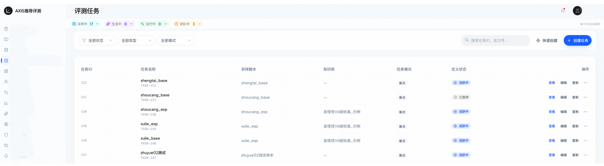
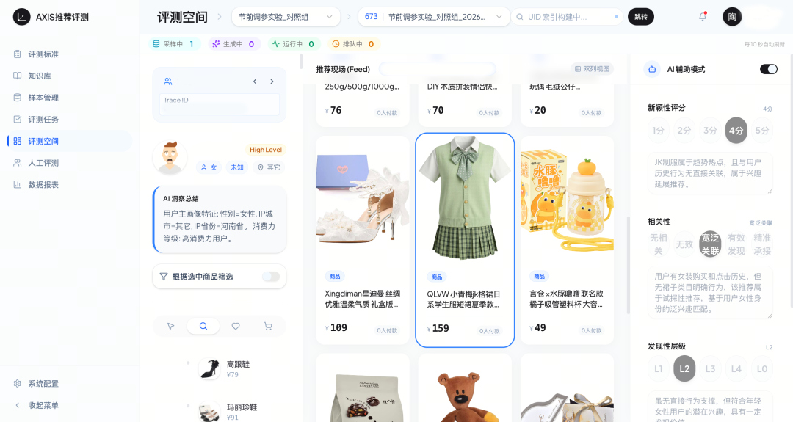
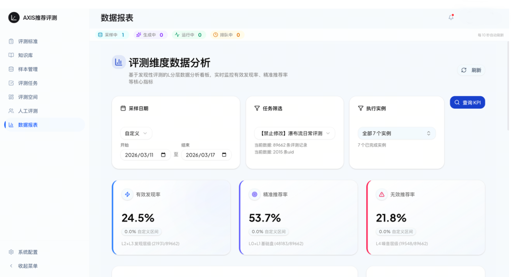
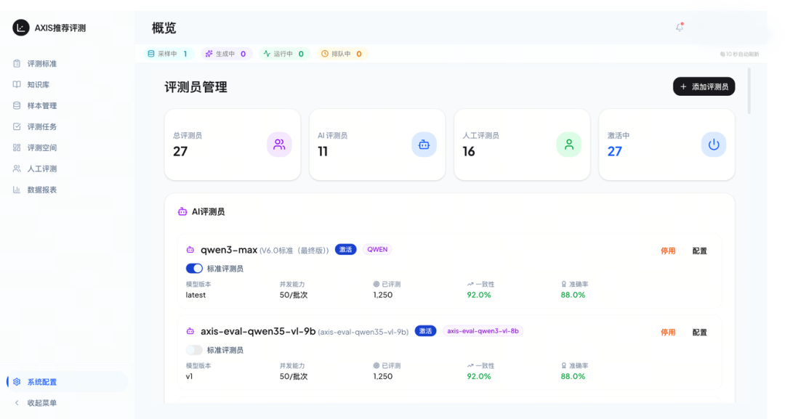
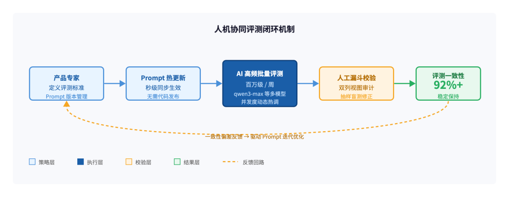
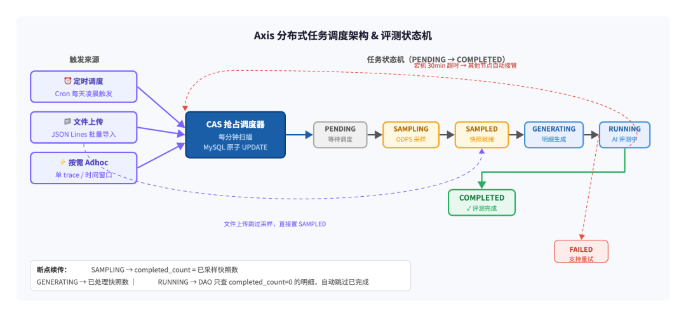
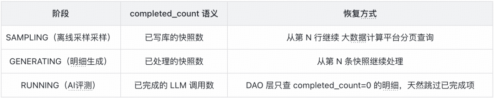
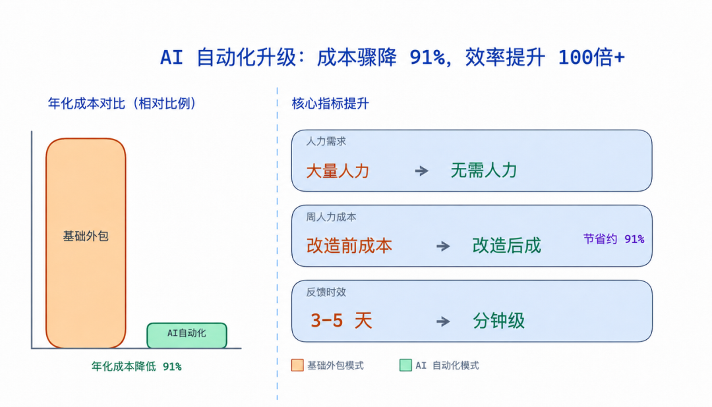

# 📰 推荐系统体验的数字化突破：得物自动化评测平台的技术实践｜AICon 文章整理

## 目录

- 一、业务背景：发现性指标的量化困局与效率瓶颈

- 二、核心架构与功能模块解析

- 1.评测任务的高并发调度

- 2.评测空间与大模型辅助审计

- 3.评测数据分析看板

- 三、核心技术架构拆解

- 1.可视化提示词工程与人机协同校验基建（模型层）

- 2.百万级吞吐的算力调度与微观控本（工程层）

- 四、业务成效与降本增效实绩

- 1.策略迭代效率呈倍数提升

- 2.运营资源投入大幅节省

- 五、演进路线：从单一评测到全维度的 Agent 自动巡检

- 1.体验评测的多维度泛化

- 2.走向全天候的 Agent 自动巡检

- 六、结语

- 本文是得物技术专家在 AICon 上海演讲整理的技术实录。[AICon上海2026\_全球人工智能开发与应用大会暨大模型应用生态展\_InfoQ技术大会]()

- 「得物推荐 AI Harness 工程化实践系列」的末篇内容，本系列共三篇连载。**本篇（末篇）详解得物推荐评测平台的完整技术体系：从主观体验量化到大模型自动化评测流水线，涵盖多维度指标设计、人机协作提示词校验闭环、分布式任务调度与成本精控等核心工程实现，以及单周百万级审计需求下实现 91% 资源成本优化的工业级落地实战细节。

### 一

**业务背景：发现性指标的量化困局与效率瓶颈**

在推荐系统中，CTR 和 CVR 等硬性指标往往容易通过实时数据进行观测，但新颖性、相关性等评价维度由于主观性强、反馈周期长，长期处于量化黑盒状态。本文将介绍得物自动化评测平台的建设方案。该平台通过引入大模型评测能力，将评测反馈周期从周级缩短至小时级，并在支撑单周百万级审计需求的背景下，实现了 91% 的资源成本优化。

在得物推荐评测平台建设前，推荐产研团队在优化用户体验和长尾策略时，面临以下核心痛点：

- **主观指标难以定量：**判断一个商品是否属于算法针对用户潜在兴趣的合理推荐，过去高度依赖人工审计，缺乏统一且可连续对比的数据标准。

- **反馈周期严重滞后：**策略上线后，通常需要等待一周的大盘例行数据才能得出综合评估，无法满足策略高频迭代的需求。

- **审计成本居高不下：**面对百万级别的全量对比和竞品评测需求，依靠传统人工评估模式需要投入巨大的人力资源，难以形成常态化的日常诊断。

为了打破这一基建瓶颈，得物推荐评测平台应运而生，旨在通过自动化流水线将主观的发现性指标转化为可实时监控、可精确对比的结构化数据。

### 二

### 核心架构与功能模块解析

得物推荐评测平台通过任务流自动化和指标多维可视化，构建了完整的全自动评测空间。

### 评测任务的高并发调度

在评测任务管理中心，产研同学可以一键拉起不同类型的评测任务。

- **任务承载：上线初**期，平台已稳定支撑大量实验任务、1 组例行大盘以及多场友商对比评测。

- **吞吐能力：**依托异步底座，单周评测数据处理量已达到百万级别。

### 评测空间与大模型辅助审计

评测空间是针对具体 case 进行深度拆解的场所。平台支持结合用户的多维画像特征进行全自动化洞察：

- **智能辅助评估：**平台引入了 AI 辅助模式，从相关性、新颖性等维度对推荐结果进行 1 到 5 分的动态打分，并输出具体的判定依据。

- **多维特征关联：**评测员或算法同学可以通过双列视图直观看到商品详情，快速定位异常推荐结果。

评测工作界面

### 评测数据分析看板

在数据报表模块，得物推荐评测平台实现了全层级指标的实时监控与下钻分析：

- **核心 KPI 提炼：**报表实时输出有效发现率、精准推荐率以及无效推荐率。

- **分级下钻：**评测记录被精细化划分为 L0 到 L4 等不同层级，产研可在小时级内清晰掌握实验组与基线的水位差，彻底告别直觉判断。

数据报表

### 三

### 核心技术架构拆解

**可视化提示词工程与人机协同校验基建（模型层）**

在得物推荐评测平台中，评测提示词的设计与评估一致性的对齐，并非通过硬编码锁死，而是交由产品与业务专家基于实际场景进行敏捷迭代。为了支撑业务同学能够独立、高效地完成提示词的调试与人工校验，平台在底层构建了一套完善的工程化配置与校验基建：

**动态提示词（Prompt）版本管理：**平台将评测提示词抽象为独立的配置资产。产品同学可以针对相关性、新颖性等不同评测维度，在后台可视化界面中独立调优 Prompt。平台支持 Prompt 的版本控制与热更新，确保策略调整后，评测标准能够秒级同步，无需经历繁琐的代码发布流程。

**低门槛的评测员配置矩阵：** 平台底层解耦了具体的模型供应商，提供了统一的接入协议。业务同学可以自由选择 Qwen3-Max 等不同量级的模型作为评测员，并在系统配置中实时观测其并发能力、当前版本的准确率以及与人工结论的一致性水位。

系统配置与评测大模型管理

**人机协作的在线校验流：**为解决大模型在复杂电商场景下的理解偏差，平台构建了高效的样本校验工作流。产品同学在调整 Prompt 后，可一键抓取历史真实 case 进行小规模盲测。通过平台提供的双列视图，人工专家可以对 AI 的打分和文本解释进行实时审计与修正。

这种“产品专家定义标准、AI 高频执行放大、人工漏斗式校验”的闭环机制，不仅极大地降低了算法策略的对齐成本，更让平台评测的一致性在业务的动态微调下稳定保持在 92% 以上。

**百万级吞吐的算力调度与微观控本（工程层）**

在支撑同等百万级审计需求下，Axis 将单周算力成本控制在万元级左右，大幅提升了投入产出比。

**分布式任务调度：CAS 无锁抢占，杜绝重复执行**

得物推荐评测平台的调度核心采用 CAS（Compare-And-Swap）抢占机制，而非传统的分布式锁方案。调度器每分钟扫描一次待执行实例，用一条原子 SQL 完成"抢锁"操作。

依赖 MySQL 行级锁保证多节点竞争时只有一个节点的 rowcount = 1，其余节点本轮直接跳过，无需引入 Redis/ZooKeeper 等外部依赖。宿主机宕机后，超过 30 分钟心跳超时的实例可被任意存活节点自动接管，做到故障自愈。

**断点续传：三阶段 offset 机制，中断后零数据丢失**

百万级评测任务往往需要数小时执行。得物推荐评测平台通过进度技术字段记录三个阶段各自的执行进度：任务在任意阶段中断后重启，均能从断点精确续跑，不会产生重复评测或数据空洞。

任务在任意阶段中断后重启，均能从断点精确续跑，不会产生重复评测或数据空洞。

**LLM 并发控制：ThreadPoolExecutor + 动态限流，成本与速度的精确平衡**

对于文本 LLM 评测（文本评测策略），得物推荐评测平台采用分批并发：并发度支持通过配置中心热更新，无需重启服务即可动态调整至最优水位。

对于多模态视觉评测（多模态视觉评测策略），以单次多模态请求替代多次图片请求，在减少 API 调用次数的同时显著降低单次 Token 消耗。

**微观控本：按需触发 + 模型分级，把每分钱花在刀刃上**

- **按需执行：**三种触发模式（定时调度 / 文件上传 / 按需 Ad hoc）均严格按需消费算力，无闲置轮询开销。

- **模型分级：**平台支持同时配置多个不同量级的评测员（如 Qwen3 用于高精度场景、轻量模型用于快速验证），策略团队可自由组合，高精度任务走重模型，批量验证走轻模型。

- **采样精控：**评测样本流式分页采样，精确匹配评测所需规模，不做无效全量拉取。

三重机制叠加，使平台在每周支撑百万级 LLM 调用请求，算力利用率极高。

### 四

### 业务成效与降本增效实绩

得物推荐评测平台上线后的实际业务表现可以概括为以下两点：

### 策略迭代效率呈倍数提升

通过将评测反馈周期从传统的按周计算缩短至小时级，算法同学在当天即可看到实验策略与大盘的真实差距，有力支撑了上线初期推荐策略的高频迭代。

### 运营资源投入大幅节省

在处理同等百万级审计需求时，自动化流水线完全替代了过去的人工评估。单周算力成本极低，相比传统的人工模式节省了 91% 的资源投入，年化潜在节省巨幅人力评测成本。

### 五

**演进路线：从单一评测到全维度的 Agent 自动巡检**

虽然得物推荐评测平台在上线初期首先聚焦于解决发现性指标的量化难题，但从架构设计的本质来看，这套 AI 自动化评测基建具备更广泛的泛化能力。平台未来的演进将突破单一指标的限制，向两个深度方向纵向延伸：

### 体验评测的多维度泛化

发现性评测只是得物推荐评测平台的起点。推荐系统的体验是一个由多维要素交织的复合物，后续平台将逐步解耦并接入更多维度的体验审计能力：

- **相关性与类目多样性评测：**评估推荐流在保持兴趣相关性的同时，在类目散散度上的表现，防止用户陷入信息茧房。

- **时效性与疲劳度审计：**实时监控用户高频行为信号的下发反馈速度，并对重复推荐、类目过度疲劳等负反馈体验进行量化评测。

- **低质与敏感内容拦截把控：**引入图文多模态大模型评测员，对推荐流中的低质封面、标题党以及合规风险进行前置审计。

### 走向全天候的 Agent 自动巡检

当前平台的运行模式主要依赖产研手动触发或例行大盘调度。而得物推荐评测平台的终极形态，是一个具备自主思考和主动防御能力的自动化巡检智能体（Agent）：

- **全时段监控：**平台将与在线业务日志及 Trace 链路深度联动，无需人工干预，7\*24 小时在线上推荐流中进行高频采样。

- **主动根因诊断：**当巡检 Agent 发现某个 UID 的推荐流中有效发现率突降，或者无效噪音飙升时，将自动激活深度诊断工作流，联动召回、粗排、精排及策略过滤等全链路日志进行溯源。

- **闭环预警与干预：**在问题引发大盘指标异常之前，智能体将自动梳理出异常 case 的根因报告，并通过内部通道精准推送给策略负责人，甚至在未来实现低风险策略的自动化降级与熔断。

### 六

## 结语

在过去，由于主观体验无法量化，很多能够带来业务长远增量的策略（例如破圈推荐、泛兴趣引入、长尾类目扶持）因为缺乏即时的指标反馈，往往在实验初期就被墨守成规地放弃了。而得物推荐评测平台的出现，恰恰是把这些看不见的体验变成了可追踪、可量化的数据水位差。通过小时级的反馈闭环，算法同学得以在一片迷雾中看清每一组增量实验的真实方向，从而支撑起整个季度策略的高频迭代。它真正的价值，在于解放了生产力，让团队敢于去探索那些能带来业务突破的无人区。

在信息茧房和推荐黑盒越来越被广泛讨论的今天，做一个推荐算法工程师，很多时候我们不仅在和冷冰冰的点击率、转化率数字赛跑，更是在和真实用户的疲劳感、厌倦感博弈。得物推荐评测平台的诞生，让我们第一次有了一块清晰的后视镜，能够随时看到算法在线上对用户体验带来的微观改变。当 AI 评测员开始全天候辅助我们去审视每一个商品流，去理解每一个用户的潜在兴趣时，我们离那个更健康、更有温度、也更具业务生命力的推荐系统，又近了一步。

得物推荐评测平台还在持续成长，我们期待与更多探索在推荐一线的技术同行一起，用技术要效率，用评测促增量。

### 往期回顾

## 1. 从狂野代码到按目标生产：得物推荐 AI Harness 的工程化实践｜AICon 演讲整理

## 2. 得物推荐系统诊断 Agent：从 “调接口” 到 “会思考”｜AICon 演讲整理

## 3. RAG 核心概念与原理：Chunking、Embedding、相似度、HNSW 与多路召回｜得物技术

## 4. 从"机械应答"到"服务伙伴"：得物高可控智能客服的 Agent 工程实践｜AICon 演讲整理

## 5. 得物 OceanBase 落地实践

文 /水月

关注得物技术，每周三更新技术干货

要是觉得文章对你有帮助的话，欢迎评论转发点赞～

未经得物技术许可严禁转载，否则依法追究法律责任。

“

### 扫码添加小助手微信

如有任何疑问，或想要了解更多技术资讯，请添加小助手微信：

