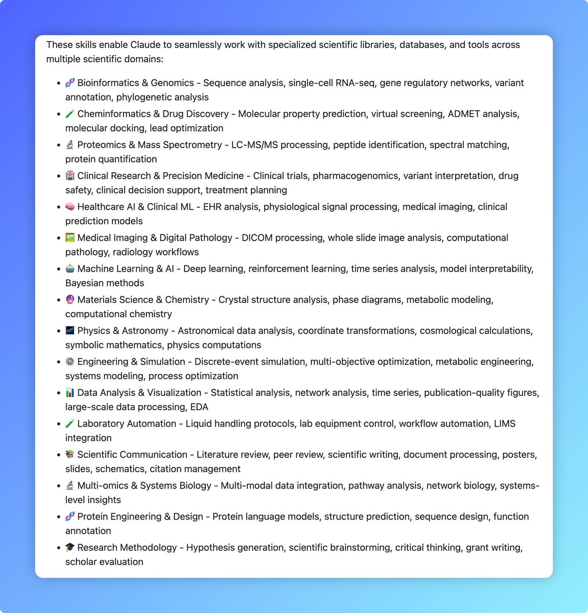

再来个硬核的 Claude Skills 仓库

由 K-Dense 团队打造，提供了 138 个现成科学技能，覆盖生物信息学、化学信息学、药物发现、临床研究、单细胞分析、蛋白质工程、机器学习等多个领域！

核心亮点：
✅ 集成 28+ 科学数据库（PubMed、ChEMBL、UniProt、ClinVar、KEGG 等）
✅ 支持 55+ Python 专业库（RDKit、Scanpy、BioPython、PyTorch、Qiskit 等）
✅ 还能对接 Benchling、DNAnexus 等平台，实现实验室自动化
✅ 从文献检索、数据分析、分子对接、虚拟筛选，到生成出版级图表、报告、甚至 grant 申请，全流程自动化！

[github.com/K-Dense-AI/cla…](https://github.com/K-Dense-AI/claude-scientific-skills)

### 🖼️ Attached Media

## 💬 Replies

### 1 @ZenHuifer (ZenHuifer)

*Thu Jan 01 15:08:19 +0000 2026*

@iamzhihui 借楼推广

[github.com/huifer/Claude-…](http://github.com/huifer/Claude-Ally-Health) 基于文件系统的个人医疗健康数据管理系统，使用 Claude Code 命令行工具进行医疗数据管理。

### 2 @iamzhihui (志辉) (Author)

*Thu Jan 01 16:05:22 +0000 2026*

@ZenHuifer 感谢分享

### 3 @hiheimu (赖叔 | LaiShu.ai)

*Thu Jan 01 16:27:40 +0000 2026*

@iamzhihui 感觉是不是可以构建家庭的健康状况数据库了。
如果还能有一些诊疗建议、定时提醒就牛了

### 4 @iamzhihui (志辉) (Author)

*Thu Jan 01 16:31:30 +0000 2026*

@hiheimu 你这是个好主意，这样成本就会降低很多，我再研究研究看看

### 5 @yahaclass (YAHA學堂)

*Thu Jan 01 09:53:09 +0000 2026*

@iamzhihui 这么卷…都不歇歇

### 6 @iamzhihui (志辉) (Author)

*Thu Jan 01 09:59:14 +0000 2026*

@AIPMLogi 永不停歇，卷起来

### 7 @suke2826 (马克)

*Fri Jan 02 03:16:25 +0000 2026*

@iamzhihui 很好

### 8 @iamzhihui (志辉) (Author)

*Fri Jan 02 04:07:00 +0000 2026*

@suke2826 写了很长时间

### 9 @beicasunlaoshu (SophieSun)

*Thu Apr 02 02:50:44 +0000 2026*

@iamzhihui 很棒的分享！
我们最近也做了医学研究方向的agent skill库，欢迎大家来试试\~
[github.com/aipoch/medical…](https://github.com/aipoch/medical-research-skills)

### 10 @iamzhihui (志辉) (Author)

*Thu Apr 02 02:52:11 +0000 2026*

@beicasunlaoshu 很棒不错呀

### 11 @k_dense_ai (K-Dense)

*Fri Jan 02 21:59:46 +0000 2026*

@iamzhihui Thanks for sharing! Also check out our hosted implementation via K-Dense Web at [k-dense.ai](http://www.k-dense.ai)

### 12 @codewithimanshu (Himanshu Kumar)

*Thu Jan 01 19:55:01 +0000 2026*

@iamzhihui User observes K-Dense team built Claude skills repository.

### 13 @xdotli (Xiangyi Li)

*Thu Jan 01 18:40:54 +0000 2026*

@iamzhihui 哇感谢分享！不知道你有没有兴趣参加我们的SlillsBench  [xhslink.com/o/6AXK0rwKVIR](http://xhslink.com/o/6AXK0rwKVIR)

### 14 @jojogh_007 (Alex Zhang)

*Thu Jan 01 11:24:01 +0000 2026*

@iamzhihui 硬核！

### 15 @kukuyidui (crypto 墨道)

*Thu Jan 01 09:21:59 +0000 2026*

@iamzhihui 撸起来

### 16 @deserce (deserce)

*Fri Jan 02 11:25:02 +0000 2026*

@iamzhihui 感觉真不错

