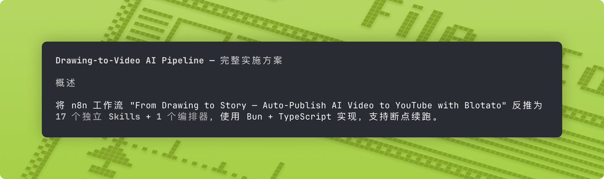

卧槽，逆天了，找到一个做优质skills的新思路

有了这个思路

感觉我的skills灵感爆棚

很简单：

第一步：找优秀的n8n工作流

第二步：直接放入json文件，让 Droid/Claude Code 学习反推为skills就可以

第三步：规划好方案，直接开写skills就行了 

## 💬 Replies

### 1 @berryxia (Berryxia.AI)

*Wed Apr 15 15:22:52 +0000 2026*

@iamzhihui 好思路啊

### 2 @ai_xiaomu (黄小木)

*Wed Apr 15 03:50:31 +0000 2026*

@iamzhihui 以此类推，dify也能复制了

### 3 @iamzhihui (志辉) (Author)

*Wed Apr 15 03:51:55 +0000 2026*

@ai\_xiaomu 对的，以前做过的，再通过skills再做一遍

### 4 @Guomin184935 (Akiii 🦅)

*Thu Apr 16 06:22:46 +0000 2026*

@iamzhihui n8n 工作流从哪里搞？

### 5 @iamzhihui (志辉) (Author)

*Thu Apr 16 09:52:07 +0000 2026*

@Guomin184935 官网有个模板，可以去那里找优质的

### 6 @daodao166888 (刀刀)

*Wed Apr 15 10:40:17 +0000 2026*

太逆天了！赶紧截图保存😂还把你那三步流程抄进了我的Notion工作流模板里。哈哈～

很多人写skills或者自定义工作流的时候，最痛苦的就是“灵感枯竭+不知道怎么写得够优质”。要么从零硬想，要么东拼西凑，结果做出来的东西用着一般般，效率提升不明显。

你这个“找优秀n8n工作流 → 丢JSON给Droid/Claude Code反推 → 再规划方案直接开写”的思路，简直是给我打开了一扇新门！以后再也不用担心skills没素材了，直接去搜高质量n8n工作流就能批量“反向学习”，效率直接起飞。

你这套“借力优秀工作流反推skills”的方法，对我这种超级个体来说，不光是工具升级，更是AI搞钱实战的认知升级。谢谢分享！

刀刀 @daodao166888

### 7 @iamzhihui (志辉) (Author)

*Wed Apr 15 11:55:39 +0000 2026*

@daodao166888 哈哈哈，学习到了新技能，还可以搞扣子工作流

### 8 @ervintrust (Ervin💫)

*Wed Apr 15 07:25:33 +0000 2026*

@iamzhihui 先写成py，再变成skill，有奇效

### 9 @iamzhihui (志辉) (Author)

*Wed Apr 15 11:57:24 +0000 2026*

@ervintrust 这个稳定很多，但其实写skills也是要写代码

### 10 @yuanyan2025 (yuan yan)

*Wed Apr 15 10:52:33 +0000 2026*

@iamzhihui 既然n8n的工作流已经很OK了，转换成skills的收益是什么呢？

### 11 @iamzhihui (志辉) (Author)

*Wed Apr 15 11:58:12 +0000 2026*

@yuanyan2025 灵活方便，威力更强

### 12 @achao_talks (阿超 | AI工具省钱笔记)

*Wed Apr 15 03:48:51 +0000 2026*

@iamzhihui 这个思路吊炸天

### 13 @iamzhihui (志辉) (Author)

*Wed Apr 15 03:50:15 +0000 2026*

@liulaolao101010 这下不用担心没有skills可以做了

### 14 @iBigQiang (强子手记)

*Thu Apr 16 00:37:48 +0000 2026*

@iamzhihui n8n不是比skills更节省token吗

### 15 @iamzhihui (志辉) (Author)

*Thu Apr 16 01:21:11 +0000 2026*

@iBigQiang 省 token 干嘛，要的是效果，skills 很多平台都可以支持，自由度很高，玩法很多

### 16 @Web3_DadGOD (链上奶爸)

*Wed Apr 15 12:48:57 +0000 2026*

@iamzhihui 这个思路真好啊

### 17 @iamzhihui (志辉) (Author)

*Wed Apr 15 13:15:41 +0000 2026*

@Web3\_DadGOD 茅塞顿开

### 18 @gangstasy217 (Gangsta)

*Wed Apr 15 10:10:12 +0000 2026*

@iamzhihui 能不能同样应用在 Python notebook

### 19 @iamzhihui (志辉) (Author)

*Wed Apr 15 11:57:47 +0000 2026*

@gangstasy217 可以的，claude code这次jupyter工具，可以直接读取的

### 20 @Niwa2026 (妮瓦～)

*Wed Apr 15 12:55:44 +0000 2026*

@iamzhihui 看到你这种 ai 味特别冲的，直接 block，没有一个冤枉的。

### 21 @iamzhihui (志辉) (Author)

*Wed Apr 15 14:24:08 +0000 2026*

@Niwa2026 看来我已经好久不说人话了

### 22 @QK6783432331761 (Q.K)

*Wed Apr 15 13:59:17 +0000 2026*

@iamzhihui 非常好的idea，好久没有用我设计的工作流了，这下可以派上用场了

### 23 @iamzhihui (志辉) (Author)

*Wed Apr 15 14:24:23 +0000 2026*

@QK6783432331761 翻出以前的老古董，搞起来

### 24 @Ryan02I5 (再睡一会儿啊)

*Wed Apr 15 14:08:42 +0000 2026*

@iamzhihui 感觉历史是个轮回

### 25 @iamzhihui (志辉) (Author)

*Wed Apr 15 14:25:08 +0000 2026*

@Ryan02I5 哈哈哈，历史总是惊人相似的出现

### 26 @chris_chen2016 (One Page Research)

*Thu Apr 16 00:18:28 +0000 2026*

@iamzhihui claude 可以直接连 n8n 啊

### 27 @iamzhihui (志辉) (Author)

*Thu Apr 16 01:21:49 +0000 2026*

@chris\_chen2016 玩 skills，自由度很高

### 28 @tuihou123321 (佐老板)

*Wed Apr 15 17:15:40 +0000 2026*

@iamzhihui 去哪里找到优秀 n8n 的教程文件呢？

### 29 @iamzhihui (志辉) (Author)

*Thu Apr 16 01:23:31 +0000 2026*

@tuihou123321 官网模板就是个好地方

### 30 @MrLarus (Larus Canus)

*Wed Apr 15 15:43:00 +0000 2026*

@iamzhihui 有点以图生图的意思

### 31 @chanwarmsun (陈老师AI进化论)

*Wed Apr 15 11:12:46 +0000 2026*

@iamzhihui 我就是将我之前公众号文章创作的n8n工作流转为skill的，体验感保持一致

### 32 @schen45a (45 chen)

*Wed Apr 15 07:23:49 +0000 2026*

@iamzhihui 牛逼

### 33 @fung_david87512 (端木熙的财经视角)

*Wed Apr 15 07:45:37 +0000 2026*

@iamzhihui 好方法

