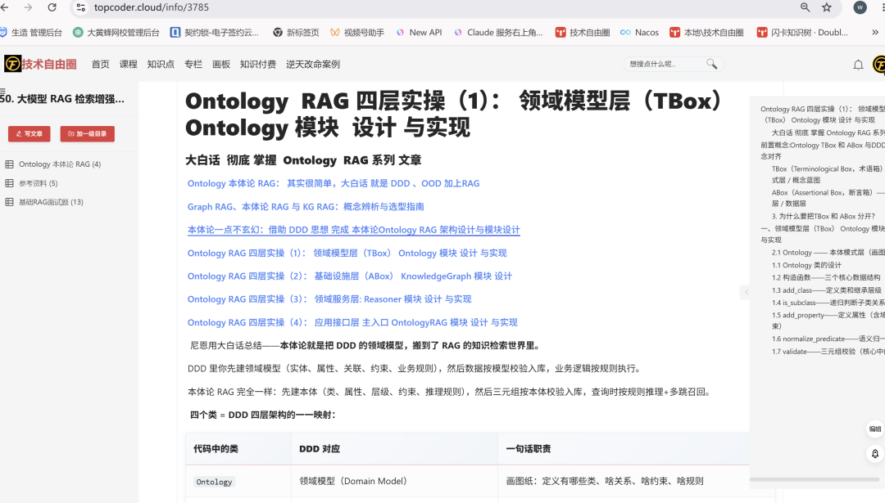
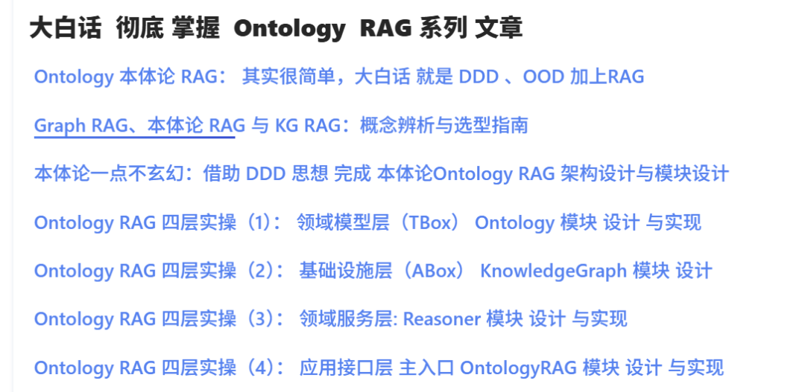
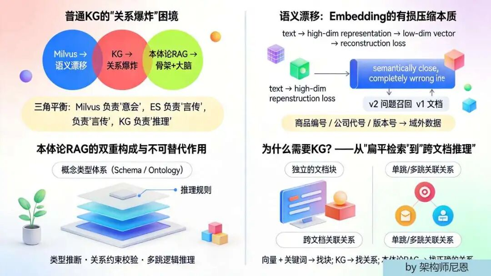
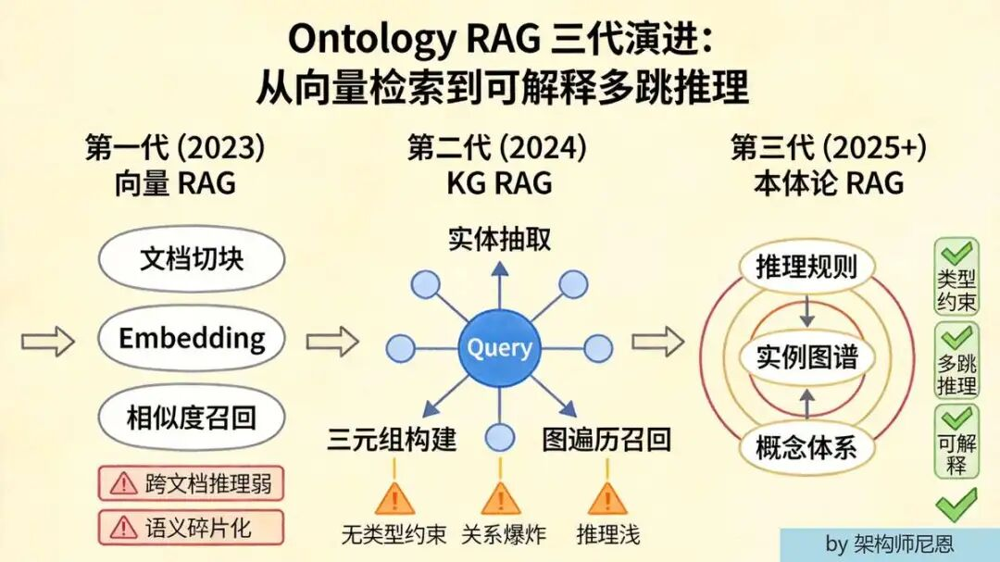
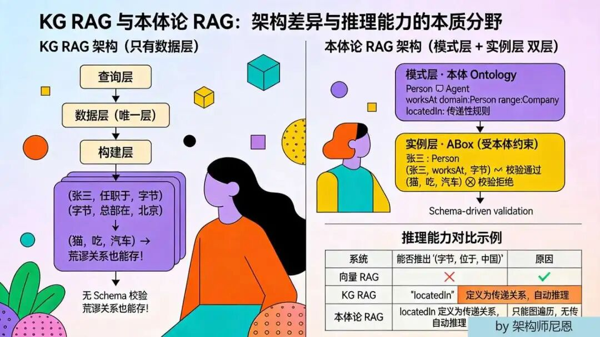
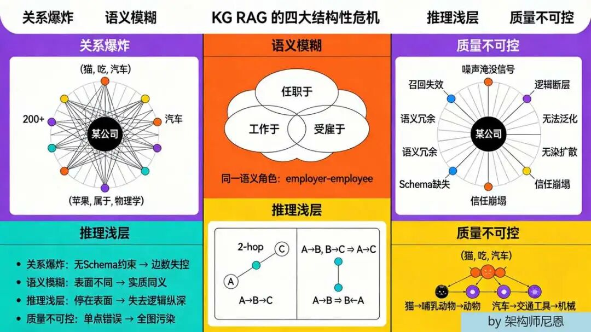

# 别被概念骗，Ontology 本体论 RAG 其实很简单，大白话  就是 DDD 、OOD 加 RAG

FSAC未来超级架构师

## 架构师总动员 实现架构转型，再无中年危机

## Ontology 本体论 RAG： 其实很简单，大白话 就是 DDD 、OOD 加上RAG

在45岁老架构师尼恩的**读者交流群**（50+人）里，最近不少小伙伴再尼恩辅导下，拿下 阿里、滴滴、极兔、有赞、希音、百度、字节、网易、美团这些一线大厂的面试 ，**面试完成后，会找尼恩 复盘！**

前两天就有个小伙伴面腾讯， 问到 **现在 的RAG，已经演进到Ontology 本体论 阶段了， 你这个 语义RAG过时了， 你知道 怎么演进到Ontology 本体论 RAG吗 ？ ”**的场景难题 ，小伙伴没有一点概念，导致面试挂了。

**注意，RAG 已经是 一个 核心题目/生产级别的 题目了**

小伙伴 没有看过系统化的 答案，**回答也不全面** ，so， 面试官不满意 ， 面试挂了。小伙伴找尼恩复盘， 求助尼恩。

通过这个 文章， 这里 尼恩给大家做一下 系统化、体系化的梳理，写一个系列的文章组成 尼恩编著 《《AI 面试 的 六层内力》 ，也叫 《尼恩 AI 面试宝典 V5》 。

通过《尼恩 AI 面试宝典 V5》 ，使得大家可以充分展示一下大家雄厚的 “技术肌肉”，**让面试官爱到 “不能自已、口水直流”**。

**需要 《尼恩 AI 面试宝典 V5》 pdf的小伙伴，可以 找尼恩 免费领取。**





**这个系列，一共有 7篇文章，本文是 第 一篇。**

## 一、普通的KG会 "关系爆炸" ，所以需要 本体论 RAG



**本体论 RAG 就是给知识图谱装上"骨架"和"大脑"的 RAG。**

传统 KG RAG 只有"实体—关系—实体"的三元组数据，本体论 RAG 在此之上多了一层**概念类型体系（Schema / Ontology）+ 推理规则**，能做类型推断、关系约束校验、多跳逻辑推理。

本体论 现在确实是热点方向——**微软 GraphRAG 2.0、LlamaIndex Property Graph Index、各类 Ontology-based RAG 论文都在往这个方向卷。**

### 本质原因

* 纯向量 RAG 解决不了"跨文档逻辑推理"

* 纯 KG RAG 解决不了"关系爆炸"

* 本体论是中间那个最优解

尼恩详细说下原因： "Milvus 负责'意会'，ES 负责'言传'，KG 负责'推理'。

* Milvus（向量库） = 靠**语义相似度**模糊匹配，你说啥它能"懂你意思"——这叫意会。

* ES（倒排索引） = 靠**关键词字面**精确匹配，词对不上就找不到——这叫言传。

* KG（知识图谱） = 靠**关系链逻辑推导**，从 A→B→C 推出你要的答案——这叫推理。

**但是 Milvus 会出现语义漂移 ， KG 会出现"关系爆炸"。**

语义搜索会出现语义漂移，所以会**召回不相关/错误文档（高相似度 ≠ 高相关）**，需要ES 关键词补充，KG 是挖掘知识隐含的单跳/多跳关联关系 和 跨文档关联关系 ， 但是 会 关系爆炸。"

为啥会语义漂移 ？ **Embedding 本质是对文本的有损压缩**，把一句话压进低维向量，必然丢失逻辑细节 。 另外"域外数据"不在 embedding 训练集里。

一个 **语义漂移的例子**：商品编号、版本号（v1 vs v2 API）、公司代号这类"域外数据"不在 embedding 训练集里，语义搜会把 v2 问题召回 v1 文档——"semantically close, completely wrong in practice" 。这正是需要 BM25 关键词兜底的场景 。

为啥需要KG ？ 传统 RAG 是"扁平的单点碎片化检索"，向量 + 关键词都**只能找到独立的文档块**，看不懂块之间的关系。 **这就需要KG，但是 普通的KG会 "关系爆炸" ，所以需要 本体论 RAG** 。

---

## 二、Ontology RAG 三代演进路径



```

第一代 (2023)          第二代 (2024)            第三代 (2025+)┌──────────────┐      ┌──────────────┐       ┌──────────────┐│   向量 RAG    │ ──▶ │   KG RAG     │ ──▶ │  本体论 RAG   ││              │      │  (知识图谱)   │       │              ││ 文档切块      │      │ 实体抽取      │       │ 概念体系      ││ Embedding    │      │ 三元组构建    │       │ + 实例图谱    ││ 相似度召回    │      │ 图遍历召回    │       │ + 推理规则    ││              │      │              │       │              ││ 短板：        │      │ 短板：        │       │ 优势：        ││ 跨文档推理弱  │      │ 无类型约束    │       │ 类型约束      ││ 语义碎片化    │      │ 关系爆炸      │       │ 多跳推理      ││              │      │ 推理浅        │       │ 可解释        │└──────────────┘      └──────────────┘       └──────────────┘

```

---

## 三、Ontology 本体论 大白话 是啥？

**本体就是"这个领域里有哪些东西、这些东西分几类、类和类之间啥关系、哪些关系合法哪些不合法"的一张总蓝图。**

用尼恩的话说—— 本体就是 DDD里边的 领域 实体 、属性、关联关系、约束关系。

### DDD ↔ 本体论 RAG 概念映射

本体就是 DDD 的领域模型（实体 + 属性 + 关联 + 约束），但不带方法，只带推理规则。

|         **DDD 概念**          |    **本体论 RAG 对应**    |       **本质**        |
|-----------------------------|----------------------|---------------------|
|**统一语言**（Ubiquitous Language）|     本体定义的标准化术语体系     |领域内所有人 / 系统用同一套词，消除歧义|
| **限界上下文**（Bounded Context）  |   本体的边界（不同领域不同本体）    |模型只在自己的边界内有效，跨边界需要映射 |
|       **实体**（Entity）        |    实例层 ABox 中的个体     |  有唯一标识、有生命周期的领域对象   |
|    **值对象**（Value Object）    |    本体中的属性值 / 字面量     |   无唯一标识，通过属性值定义自身   |
|   **聚合 / 聚合根**（Aggregate）   |  本体中的 Class 层级 + 约束  |  一组相关对象的边界，保证内部一致性  |
|     **不变量**（Invariants）     |Domain/Range 约束 + 规则校验|  数据必须始终满足的条件，不满足就拒  |
|       **领域规则 / 业务规则**       |   推理规则（传递性、逆关系、继承）   |  领域内的逻辑规律，可自动推导新事实  |
|  **领域服务**（Domain Service）   |  类型感知查询改写 + 规则推理引擎   |    不归属任何实体的领域逻辑     |
|     **仓储**（Repository）      |    图数据库 + 向量库混合检索    |    领域对象的持久化和查询接口    |

---

DDD ↔ 本体论 RAG 共通本质：四层同构

```

DDD 工程世界                    本体论 RAG 知识世界┌──────────────────┐          ┌──────────────────┐│  战略设计          │          │  本体建模          ││  限界上下文划分     │          │  领域边界 + Schema ││  统一语言建立       │          │  概念类 + 关系定义  │├──────────────────┤          ├──────────────────┤│  战术设计          │          │  约束 + 规则       ││  实体/值对象/聚合   │          │  Class/属性/层级   ││  不变量定义         │          │  Domain/Range 校验 ││  领域规则           │          │  推理规则          │├──────────────────┤          ├──────────────────┤│  数据落地          │          │  实例入库          ││  仓储实现           │          │  图数据库存储       ││  数据按模型校验入库  │          │  ABox 受 TBox 约束 │├──────────────────┤          ├──────────────────┤│  业务运行          │          │  查询推理          ││  领域服务执行业务   │          │  规则推理 + 多跳召回││  聚合保证一致性     │          │  本体保证知识质量   │└──────────────────┘          └──────────────────┘

```

所以，这就是 为什么 DDD 老兵做本体论 RAG 上手特别快 的原因

为 DDD 本身就是用面向对象思想来落地的。 **具体请参考尼恩的架构视频 第 34章 DDD 架构。**

所以，进一步 用尼恩的话说—— 从**工程思维、建模目的和认知方式**来看，**本体论和面向对象设计（OOD）有着极其深刻的共通点**。

本体论和面向对象设计（OOD） 的共通点体现在以下五个核心维度：

**(1) 核心共通点：都是对现实世界的“概念化抽象”**

无论是面向对象还是本体论，它们的第一性原理都是**抽象**。

* **面向对象（OO）** 让你找出现实业务中的“名词”作为类（Class），“动词”作为方法（Method）。

* **本体论（Ontology）** 让你找出现实知识中的“概念”作为类（Class），“特征”作为属性（Property）。

* **共通本质：** 两者都在做“建模”，即忽略掉无关的细节，只抽取出领域中最核心的骨架。你提到的“建房子先画结构图”，在 OO 里叫**概念模型/类图**，在本体里叫 **TBox（术语箱）**，两者都是那张“总蓝图”。

**2. 分类学与层级思维（Is-a / 继承）**

两者都依赖严格的层级结构来组织世界，避免扁平化的混乱。

* **面向对象：** 通过 `extends`（继承）构建类族谱。比如 `Dog extends Animal`，子类自动获得父类的属性和方法。

* **本体论：** 通过 `SubClassOf`（子类）构建概念树。比如 `Employee ⊑ Person`。

* **共通本质：** 都是**“一般化-特殊化”**的思维。都是为了表达“A 是一种 B”，从而实现逻辑的复用和概念的归类。在 DDD 里，这就是通用语言中的概念层级。

**3. 关系与关联（Has-a / Property）**

两者都认为孤立的对象没有意义，必须通过关系连接成网。

* **面向对象：** 通过成员变量（Reference）建立对象间的关联。比如 `Person` 类里有一个 `Company` 类型的字段。

* **本体论：** 通过属性（Property）建立个体间的关联。比如 `worksAt` 关系连接人和公司。

* **共通本质：** 都在描述**语义连接**。你提到的 DDD 中的“关联关系”，在 OO 里是对象引用，在本体里是显式的边（Edge）。两者都试图还原业务对象之间是如何互相协作和指向的。

**4. 约束与契约（不变量 / Invariants）**

两者都强调“守规矩”，不允许数据处于非法状态。

* **面向对象：** 通过类型系统、构造函数校验、或者 DDD 中聚合根内维护的**不变量（Invariants）**来保证。比如“订单总金额不能为负”。

* **本体论：** 通过 **Domain/Range 约束**、函数性约束（Functional Property）等来保证。比如 `worksAt` 的域必须是人，值域必须是公司。

* **共通本质：** 都是在定义**合法性边界**。你材料里写的“哪些关系合法哪些不合法”，在 OO 里是编译器的类型检查和运行时的断言；在本体里是推理机的逻辑校验。目的都是为了保证模型（或知识库）的**一致性**。

**5. 统一语言与边界划分（限界上下文）**

这是你提供的材料里最精髓的部分，也是 OO/DDD 与本体论在工程管理上的最大共通点。

* **面向对象/DDD：** 强调**统一语言（Ubiquitous Language）**和**限界上下文（Bounded Context）**。在不同的微服务或模块里，“订单”这个词的含义可以不同，模型不能互相污染。

* **本体论：** 强调**术语标准化**和**命名空间/本体边界**。不同的领域（如医疗本体、金融本体）使用不同的 URI 来区分概念，跨领域需要映射（Mapping）。

* **共通本质：** 都承认**“语境”的重要性**。没有放之四海而皆准的模型。两者都致力于在特定的边界内，让所有参与者（开发者、业务专家、甚至现在的 AI 系统）使用**同一套无歧义的词表**进行沟通。

**总结：为什么它们如此相似？**

因为**面向对象和本体论，都是人类为了对抗软件/知识复杂性而发明的结构化思维工具。**

* **面向对象**说：“让我们把世界看作一个个有状态、有行为的**对象**，通过消息传递来协作。”

* **本体论**说：“让我们把世界看作一个个有属性、有关系的**概念**，通过逻辑规则来推导。”

**为啥 DDD 老兵做本体论 RAG 上手快，正是因为：你脑子里早就有了“实体、值对象、聚合、不变量、统一语言”这些思维模型。你只是把原来用 Java/C# 类表达的东西，换成了用 OWL/RDF 三元组来表达；把原来写在 Service 里的校验逻辑，交给了推理机去自动执行。**

两者殊途同归，都是在画那张“知识世界的结构图”。

有了这些 理论基础，接下来， 本体就非常简单了。

## Ontology 本体的核心组成

建房子，大家一般 先画结构图（承重墙在哪、哪些是梁哪些是柱），本体就是知识世界的结构图。

|       **组成**       |  **说明**  |               **示例**               |
|--------------------|----------|------------------------------------|
|    **Class（类）**    | 领域中的概念类型 |       Person、Company、Product       |
|    **is-a（层级）**    | 类之间的继承关系 |         Employee ⊑ Person          |
|  **Property（属性）**  | 类的属性或关系  |      worksAt、headquarteredIn       |
|**Domain/Range（约束）**|关系的合法主体和客体|worksAt domain=Person, range=Company|
|   **Rule（推理规则）**   |  逻辑推理规则  |          locatedIn 具有传递性           |

## 四、 KG RAG vs 本体论 RAG 架构对比



### 4.1 KG RAG 架构（只有数据层） ###

```

┌─────────────────────────────────────────┐│              查询层                       ││   实体链接 + 子图扩展 + 向量混合召回        │└──────────────────┬──────────────────────┘                   ▼┌─────────────────────────────────────────┐│           数据层（唯一层）                 ││                                         ││   三元组集合：                            ││   (张三, 任职于, 字节)                    ││   (字节, 总部在, 北京)                    ││   (猫, 吃, 汽车)  ← 荒谬关系也能存！       ││                                         │└──────────────────┬──────────────────────┘                   ▼┌─────────────────────────────────────────┐│              构建层                       ││   LLM 抽取实体+关系 → 直接入库             ││   无 Schema 校验，关系类型自由生长          │└─────────────────────────────────────────┘

```

### 4.2 本体论 RAG 架构（模式层 + 实例层 双层） ###

```

┌─────────────────────────────────────────┐│              查询层                       ││   类型感知查询改写 + 规则推理 + 多跳子图召回 │└──────────────────┬──────────────────────┘                   ▼┌─────────────────────────────────────────┐│     模式层 · 本体 Ontology（核心新增）      ││                                         ││   概念类(Class) + 层级(is-a) + 属性约束    ││   Person ⊑ Agent                         ││   worksAt domain:Person range:Company    ││   locatedIn: 传递性规则                   │└──────────────────┬──────────────────────┘                   ▼┌─────────────────────────────────────────┐│     实例层 · ABox（受本体约束）            ││                                         ││   张三 : Person                          ││   (张三, worksAt, 字节)  ✓ 校验通过        ││   (猫, 吃, 汽车)       ✗ 校验拒绝          │└──────────────────┬──────────────────────┘                   ▼┌─────────────────────────────────────────┐│              构建层                       ││   先定义/抽取本体 Schema                   ││   → 实例按 Schema 校验入库                 ││   → 类型约束 + 推理规则                    ││   （传递性、逆关系、继承等）                 │└─────────────────────────────────────────┘

```

### 4.3 推理能力对比示例 ###

**场景：** 已知 `(字节, 总部在, 北京)` 和 `(北京, 属于, 中国)`，问"字节位于哪里？"

|**系统** |**能否推出 `(字节, 位于, 中国)`**|         **原因**         |
|-------|-----------------------|------------------------|
|向量 RAG |          不能           |     切块后信息分散，无法跨块推理     |
|KG RAG |          不能           |     只能图遍历，无传递性推理规则     |
|本体论 RAG|         **能**         |`locatedIn` 定义为传递关系，自动推理|

## 五、关键差异速查表

| **维度**  |    **KG RAG**    |      **本体论 RAG**      |
|---------|------------------|-----------------------|
|**知识结构** |   扁平三元组，无类型层级    |TBox 模式层 + ABox 实例层，双层 |
|**关系约束** |无，`(猫, 吃, 汽车)` 也能存|domain/range 校验，非法关系直接拒|
|**推理能力** | 仅图遍历（1-2跳），无逻辑推理 |   支持传递性、继承、逆关系等规则推理   |
|**构建成本** |   低，LLM 直接抽三元组   |    中高，需先建本体 Schema    |
|**数据质量** | 依赖 LLM 抽取质量，噪声多  |   Schema 约束兜底，质量可控    |
|**查询灵活性**|    高，任意关系都能查     |      中，受本体定义范围限制      |
|**可解释性** |    弱，只能展示关联路径    |       强，推理链路可追溯       |
|**适用场景** |   通用问答、轻量实体关联    |  医疗/金融/法律等强领域、强推理场景   |

## 六、 KG RAG 的核心问题 是什么？



KG RAG 只有"砖头"（三元组），没有"图纸"（Schema）。LLM 抽出来啥就存啥，`(猫, 吃, 汽车)` 这种荒谬关系也能进库。

### 具体问题

**(1) 关系爆炸：关系类型没有约束，越抽越乱，一个实体连出几百条边，召回时根本不知道哪条有用**

**(2) 语义模糊：`任职于`、`工作于`、`受雇于` 被当成三种不同关系，实际是同一个**

**(3) 推理浅层：只能做 1-2 跳图遍历，无法做逻辑推理（传递、继承、逆关系）**

**(4) 质量不可控：完全依赖 LLM 抽取质量，错误三元组直接污染整个图谱**

## 七、Ontology 本体论 RAG 怎么解决

### 7.1 类型约束（Domain/Range 校验） ###

先定义本体：`Person`、`Company`、`worksAt`（domain=Person, range=Company）。

实例入库时**强制校验**：- `(张三, worksAt, 字节)` → 通过 ✓- `(猫, 吃, 汽车)` → 拒绝 ✗（猫不是 Person，汽车不是 Company）

### 7.2 推理规则（Rule-based Reasoning） ###

定义了 `locatedIn` 是传递关系后：- `(字节, 总部在, 北京)` + `(北京, 属于, 中国)`- 自动推出 `(字节, 位于, 中国)`

这是纯 KG RAG 做不到的。

### 7.3 语义归一化 ###

本体定义了统一的关系类型，`任职于`、`工作于`、`受雇于` 都映射到 `worksAt`，避免关系爆炸。

## 八、现在是不是都在往这搞 Ontology 本体轮 ？

工业界目前的真实状态：

|**阶段**|**技术** |  **普及度**   |  **主力场景**  |
|------|-------|------------|------------|
|  主力  |向量 RAG |  绝大多数生产系统  | 通用问答、文档检索  |
| 增长中  |KG RAG |  中大型企业知识库  |企业知识管理、多文档关联|
|  早期  |本体论 RAG|医疗/金融/法律等强领域|强推理、高合规要求场景 |

**本体论 RAG 落地最快的领域：**- **医疗**：疾病、症状、药物的层级关系清晰，推理要求高- **金融**：公司、人物、交易的关联网络复杂，合规要求严- **法律**：法条、案例、概念的层级和引用关系明确

**通用场景还在早期的原因：** 本体构建成本高，LLM 自动抽取 Schema 的质量还不够稳定。

---

## 九、工程落地建议

### 别一上来就搞完整本体论 RAG

正确路径是渐进式升级：

```

Step 1: 向量 RAG   │  （成本低、先跑通）   ▼Step 2: 向量 + KG 混合召回   │  （在核心实体上建轻量图谱）   ▼Step 3: 在核心实体上定义轻量本体   │  （类 + 层级 + 关键约束，不追求完备）   ▼Step 4: 逐步加推理规则   （传递性、逆关系、继承，按需添加）

```

### 每一步都能看到收益，不要跳步

---

## 十、记忆口诀

>
>
> **KG RAG = 有数据没骨架，三元组乱飞；**
>
>
>
> **本体 RAG = 先搭骨架再填肉，类型约束加推理，多跳问答不迷路。**
>
>
>
> **演进路径：向量打底 → 图谱加关联 → 本体定规矩 → 规则做推理。**
>
>

## 狠狠卷 尼恩 三高架构 +尼恩 AI架构 ， 完成 P7/P8/p9 升级，实现逆天改命

[刷一年 八股 升级 失败 ，31岁小伙 绝望了！ 痛定思痛，走三化三驱 捷径，10 天逆袭，太扎心了](https://mp.weixin.qq.com/s?__biz=MzIxMzYwODY3OQ==&mid=2247487396&idx=1&sn=3582bf407828ac6c64336f095ddd07d8&scene=21#wechat_redirect)

[三观颠了：3本 进国企 年60w，公金10W， 没任何一点关系。最大的背景 就是 AI架构](https://mp.weixin.qq.com/s?__biz=MzIxMzYwODY3OQ==&mid=2247487384&idx=1&sn=27b1a3d4acbb4c88d56dae66593ffd4e&scene=21#wechat_redirect)

[裸辞学AI，可以吗？ 26岁4年小伙裸辞，学AI 一个月3大厂offer，逆涨30% 年薪50w，完全可以裸体学习](https://mp.weixin.qq.com/s?__biz=MzIxMzYwODY3OQ==&mid=2247487371&idx=1&sn=3cf5ebdb10dd7a1f674c92489ad16807&scene=21#wechat_redirect)

[涨薪 传奇： 28/3-4年/代码0经验/一线运维，7个月 逆袭 AI 专家，年薪64W涨一倍。 证明一个硬道理：低起点 0经验，也能 进大厂 + 冲100万](https://mp.weixin.qq.com/s?__biz=MzIxMzYwODY3OQ==&mid=2247487362&idx=1&sn=859c20746a72041060f82cc7407c3368&scene=21#wechat_redirect)

[一个天一个地： 31岁同学 刷 一年八股文，进阶失败， 自以为聪明却走出 一年最大弯路；28岁同学走捷径13天逆袭，太伤人了](https://mp.weixin.qq.com/s?__biz=MzIxMzYwODY3OQ==&mid=2247487345&idx=1&sn=47cda270110a04462b185a7490386832&scene=21#wechat_redirect)

[梦幻：40岁 项目经理， 5年没写代码，开滴滴10个月 ，找尼恩升级P9， 一个月逆天改命， 收 两个架构offer， P9级架构太香了](https://mp.weixin.qq.com/s?__biz=MzIxMzYwODY3OQ==&mid=2247487333&idx=1&sn=6ec78493c8489f1db8cc80aa5e3a2be4&scene=21#wechat_redirect)

[逆天：从修手机到AI开发，2个月 大逆袭 ！ Java+AI 太香了！](https://mp.weixin.qq.com/s?__biz=MzIxMzYwODY3OQ==&mid=2247487249&idx=1&sn=61363bb76a6fd12debbddd093af72c51&scene=21#wechat_redirect)

[成了： 卖肥料一年，上岸 架构师 。月薪3w 比 卖肥料 香 太多！Java架构+AI架构，帮助31岁小伙伴 大逆袭](https://mp.weixin.qq.com/s?__biz=MzIxMzYwODY3OQ==&mid=2247487219&idx=1&sn=57dee3f12a3941a277b76228cdf13032&scene=21#wechat_redirect)

[小伙赶在32岁 末班车，拿到 京东P7（60w）， 撬开P8（年薪100W）通道， 逆天改命了！！！](https://mp.weixin.qq.com/s?__biz=MzIxMzYwODY3OQ==&mid=2247487192&idx=1&sn=284141b9a55954d371207c667e3a2443&scene=21#wechat_redirect)

[逆袭 100万 P8。37岁 空窗6个月，靠 Java+AI双栖架构， 2个月上岸 100w年薪到手，职业重生+逆天改命！](https://mp.weixin.qq.com/s?__biz=MzIxMzYwODY3OQ==&mid=2247487170&idx=1&sn=239470e9b38c511261839c9d6bb39f5e&scene=21#wechat_redirect)

[一飞冲天， 逆 首席： 37 岁 借力 Java+AI 逆袭 首席架构  ， 年薪80W+太香了](https://mp.weixin.qq.com/s?__biz=MzIxMzYwODY3OQ==&mid=2247487126&idx=1&sn=9016db06543f328a42cd37eadfceffee&scene=21#wechat_redirect)

[31岁 /专科 升架构成功， 收10个offer 变 offer 皇帝 ！！ 下一步，直冲100W](https://mp.weixin.qq.com/s?__biz=MzIxMzYwODY3OQ==&mid=2247487047&idx=1&sn=0397145548d8c1e76ee900c7e5920f4d&scene=21#wechat_redirect)

[奇迹 :  一年 涨2倍， 年薪 60W 梦想实现 。 接下来，开启 40岁之前的 年薪 200W 梦想](https://mp.weixin.qq.com/s?__biz=MzIxMzYwODY3OQ==&mid=2247487014&idx=1&sn=5d1359a7adc7c9e46e6374597bb03138&scene=21#wechat_redirect)

[28岁/6年/被裁1年，收 3 大厂offer ， 成 大厂 皇后 。2本学历 51W 年薪，惊天 逆涨，涨薪2倍](https://mp.weixin.qq.com/s?__biz=MzIxMzYwODY3OQ==&mid=2247486987&idx=1&sn=ff977f450dd242446f228d3a6585e258&scene=21#wechat_redirect)，大厂皇后

[涨薪传奇： 18k-\>38K , 单月暴20K，32岁小伙伴 2个月时间年薪 翻1.5倍 ，一步登天+逆天改命](https://mp.weixin.qq.com/s?__biz=MzIxMzYwODY3OQ==&mid=2247486960&idx=1&sn=f57253a448694c32e834207381c42284&scene=21#wechat_redirect)

[低学历 传奇：29岁6年专套本，受够了外包，狠卷3个月逆袭大厂 涨 1倍， 逆天改命](https://mp.weixin.qq.com/s?__biz=MzIxMzYwODY3OQ==&mid=2247486945&idx=1&sn=f6ff6231ccf3585624161c2ef1f50fdf&scene=21#wechat_redirect)

[极速上岸： 被裁 后， 8天 拿下 京东，狠涨 一倍 年薪48W， 小伙伴 就是 做对了一件事](https://mp.weixin.qq.com/s?__biz=MzIxMzYwODY3OQ==&mid=2247486913&idx=1&sn=edd6774e9d17c39327e8dcb95fdd68d9&scene=21#wechat_redirect)

[外包+二本 进 美团： 26岁小2本 一步登天， 进了顶奢大厂（ 美团） ， 太爽了](https://mp.weixin.qq.com/s?__biz=MzIxMzYwODY3OQ==&mid=2247486904&idx=1&sn=e7c878f99ed101ebfbd1d80ec0e07401&scene=21#wechat_redirect)

[超牛的Java+Al 双栖架构： 34岁无路可走，一个月翻盘，拿 3个架构offer，靠 Java+Al 逆天改命！！！](https://mp.weixin.qq.com/s?__biz=MzIxMzYwODY3OQ==&mid=2247486848&idx=1&sn=ff43d058271b0801f84aba3f3d957855&scene=21#wechat_redirect)

java+AI 逆袭2：[：3年 程序媛 被裁， 25W-》40W 上岸， 逆涨60%。 Java+AI 太神了， 架构小白 2个月逆天改命](https://mp.weixin.qq.com/s?__biz=MzIxMzYwODY3OQ==&mid=2247486858&idx=1&sn=9cd122c18d166433b43d0952d3a7a7a8&scene=21#wechat_redirect)

[Java+AI逆袭3 ： 36岁/失业7个月/彻底绝望 。狠卷 3个月 Java+AI ，终于逆风翻盘，顺利 上岸](https://mp.weixin.qq.com/s?__biz=MzIxMzYwODY3OQ==&mid=2247486870&idx=1&sn=990a540a155cdb8254ebce6c75816882&scene=21#wechat_redirect)

[Java+AI逆袭 ： 闲了一年，41岁/失业12个月/彻底绝望 。狠卷 2个月 Java+AI ，终于逆风翻盘](https://mp.weixin.qq.com/s?__biz=MzIxMzYwODY3OQ==&mid=2247486880&idx=1&sn=a37033157c766ac5ae7c9195fe776693&scene=21#wechat_redirect)

[Java+AI逆袭5：1个月大涨2.5W，37岁 脱坑外包， 入了正编，GO+AI 要逆天了](https://mp.weixin.qq.com/s?__biz=MzIxMzYwODY3OQ==&mid=2247486885&idx=1&sn=4e26fbb093f45d437dedf14ea9b9e6c5&scene=21#wechat_redirect)

### 职业救助站

实现职业转型，极速上岸


关注**职业救助站**公众号，获取每天职业干货  
助您实现**职业转型、职业升级、极速上岸**  
\---------------------------------

### 技术自由圈

实现架构转型，再无中年危机


关注**技术自由圈**公众号，获取每天技术千货  
一起成为牛逼的**未来超级架构师**

**几十篇架构笔记、5000页面试宝典、20个技术圣经  
请加尼恩个人微信 免费拿走**

**暗号，请在 公众号后台 发送消息：领电子书**

如有收获，请点击底部的"在看"和"赞"，谢谢
