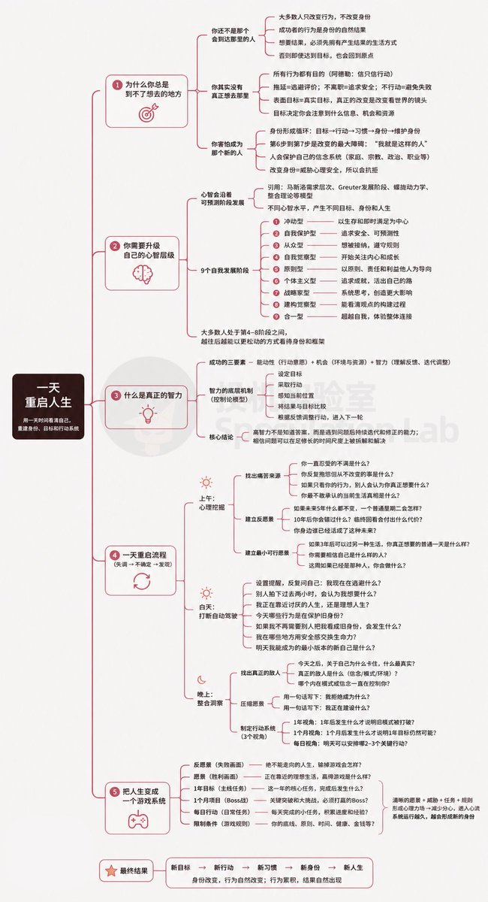

获得1.9亿次观看的深度好文：如何用一天时间重启你的人生。

做了个辅助阅读的思维导图👇

人生之所以长期停留在原地，往往是因为旧身份，旧目标和旧思维方式一直在塑造你的行为。
真正的改变，始于看清自己正在被什么驱动，然后通过新的愿景和行动系统，逐渐成为另一个人。d

## 💬 Replies

### 1 @ThanksuTrump (猫投鹰 (鹰哥))

*Sun Jun 21 03:42:01 +0000 2026*

@LabSpeculation 感谢总结

### 2 @yanniscyu (ChloeYan)

*Sun Jun 21 02:09:46 +0000 2026*

@LabSpeculation 其实就是《刻意练习》里面说的内容。我感觉DAN KOE都能把这书背下来了

### 3 @LabSpeculation (投机实验室) (Author)

*Sun Jun 21 02:12:33 +0000 2026*

@yanniscyu 👍👍

### 4 @_dmarinho (Diógenes Marinho)

*Mon Jun 22 01:54:45 +0000 2026*

@LabSpeculation Tens ele em inglês?

### 5 @LabSpeculation (投机实验室) (Author)

*Mon Jun 22 13:04:17 +0000 2026*

@\_dmarinho check out this post 👇he made a good english summary😁[x.com/figo\_saleh/sta…](https://x.com/figo_saleh/status/2010931873321718020?s=20)wNU

### 6 @MetauniverseT (小天NFR)

*Sat Jun 20 15:14:19 +0000 2026*

@LabSpeculation 感谢，刚才看的时候还看不明白了，有了思维导图明朗多了

### 7 @LabSpeculation (投机实验室) (Author)

*Sun Jun 21 02:12:21 +0000 2026*

@MetauniverseT 🤝🤝

### 8 @yangyue992125 (先手 · Ahead)

*Sun Jun 21 14:42:05 +0000 2026*

这套先看清自己被什么驱动，顺序其实反了。

真正让人停在原地的不是旧思维，是旧环境一动没动。

你愿景立得再清楚，手机解锁第一屏还是那几个APP，冰箱里还是那些东西，下班还是路过那家店，第二天照样滑回去。

行为靠的是默认路径，不是每天拿新愿景去驱动自己。

愿景会累，环境不会。

所以真要重启，第一天别先想我要成为谁，先把你闭着眼都会走的那几条路径挨个拆掉。

### 9 @AllOrdinalsX (AllOrdinals)

*Sun Jun 21 01:47:53 +0000 2026*

@LabSpeculation @Sean\_ZMC 这招太狠了！我得看看。🤔

### 10 @FinnTsai88 (Florian.C)

*Sat Jun 20 23:03:34 +0000 2026*

@LabSpeculation @jiu1gjl 最深刻的一点是导图最后那句：把人变成一个系统

### 11 @shr_leo3680 (shr leo)

*Mon Jun 22 02:32:57 +0000 2026*

@LabSpeculation 😁 感觉能看到好多书里面的精华

### 12 @Tomfl3x (Tomflex)

*Sat Jun 20 20:05:57 +0000 2026*

@LabSpeculation 6 days - 6 concepts - 1 codex. 

### 13 @smomo82203 (蛋糕)

*Sun Jun 21 16:03:06 +0000 2026*

@LabSpeculation 感謝☺️

### 14 @gimleefly_gm (lorelu)

*Mon Jun 22 03:16:06 +0000 2026*

@LabSpeculation 思维导图很清晰，但“一天重启”多少有点标题党了，真改变还得靠日常的小坚持。不过作为启动框架确实不错👍

### 15 @hannahsvip (hannah紫涵)

*Sun Jun 21 12:39:15 +0000 2026*

@LabSpeculation 不想成为温水里面的青蛙，改变很痛苦，更痛苦的是当下不选择改变，过些年以后，发现无能为力更痛苦！

