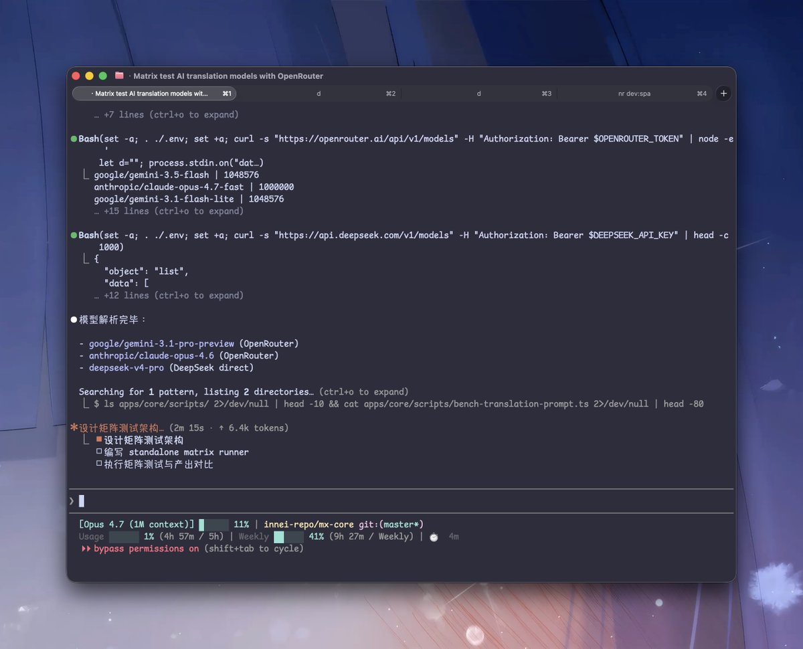
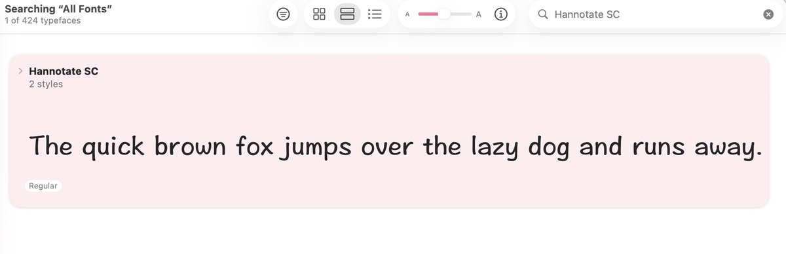
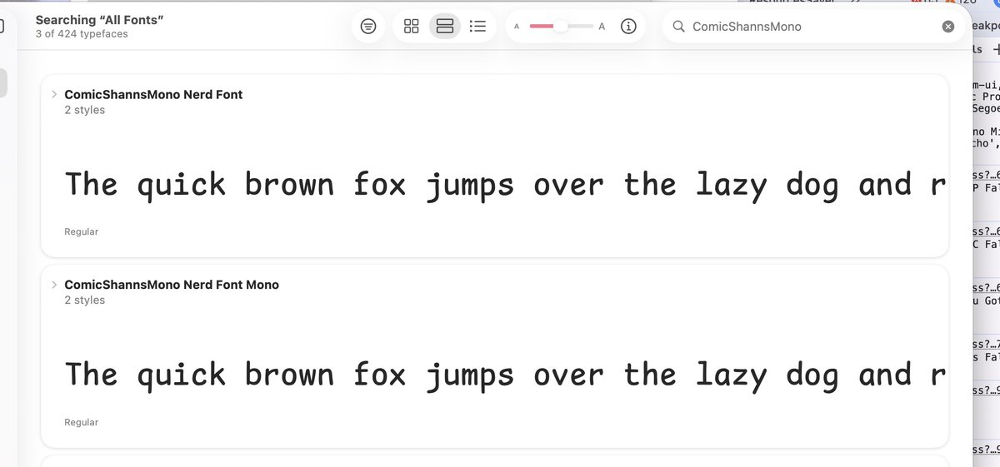

每次发截图，评论区总有人问：这是什么字体？

所以我打算顺手把我 Claude Code 相关的一整套环境都整理出来：插件、终端配置、字体、主题。

应该会是一篇比较完整的环境配置分享。 

## 💬 Replies

### 1 @__oQuery (拾一.max-fast) (Author)

*Thu May 28 05:39:15 +0000 2026*

字体：ComicShannsMono Nerd Font, Hannotate SC

前者是等宽字体，后者是 mac 自带的中文字体

[github.com/Innei/dotfiles…](https://github.com/Innei/dotfiles/blob/master/tag-base/config/ghostty/config) 

### 2 @__oQuery (拾一.max-fast) (Author)

*Thu May 28 05:39:16 +0000 2026*

Claude Code 底部的状态栏是：claude-hud

config: [gist.github.com/Innei/a8b8b8c6…](https://gist.github.com/Innei/a8b8b8c69ca434073c3cb845d2455482)

[github.com/jarrodwatts/cl…](https://github.com/jarrodwatts/claude-hud)

### 3 @maoqiucute (aicoot)

*Thu May 28 06:23:33 +0000 2026*

@\_\_oQuery 大胶囊的标签栏 真的好丑，这个怎么改？

### 4 @__oQuery (拾一.max-fast) (Author)

*Thu May 28 17:02:43 +0000 2026*

@maoqiucute 别升级 mac 26 就行了

### 5 @xavier_running (Diego)

*Thu May 28 09:19:50 +0000 2026*

@\_\_oQuery 终端是 Ghostty ？

### 6 @__oQuery (拾一.max-fast) (Author)

*Thu May 28 17:02:47 +0000 2026*

@xavier\_running y

### 7 @william40152988 (Yong.C)

*Mon Jun 08 00:35:37 +0000 2026*

@\_\_oQuery 这种 Claude Code 场景挺真实，工具链细节会直接影响体验。

### 8 @0xkkdemian (kkdemian)

*Thu May 28 10:33:40 +0000 2026*

@\_\_oQuery 期待

### 9 @Axnino55 (黑猫Sens)

*Thu May 28 17:09:01 +0000 2026*

@\_\_oQuery 新买的mac要到了，想睡觉就来枕头捏

